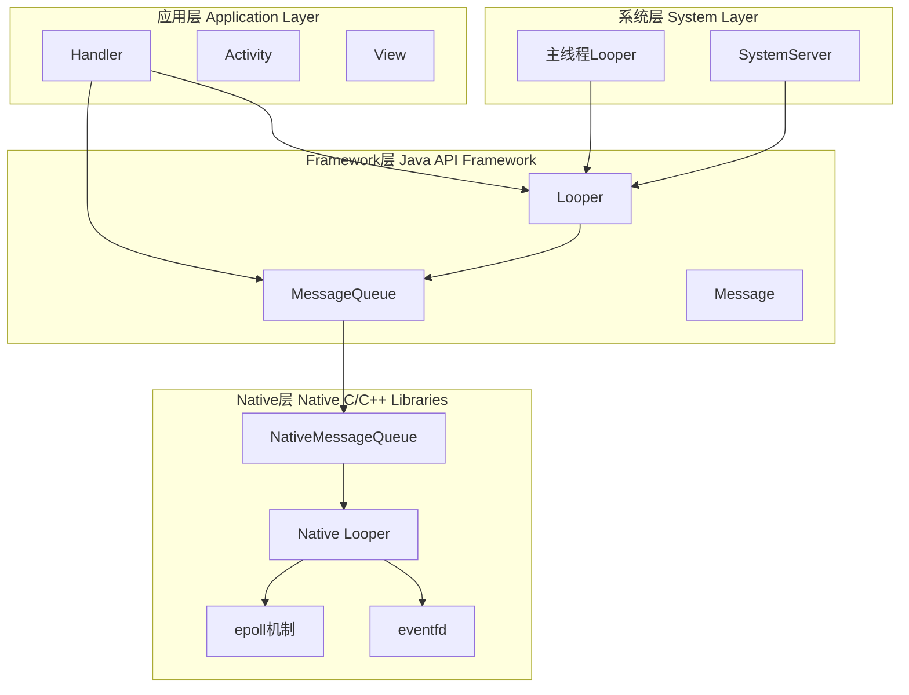
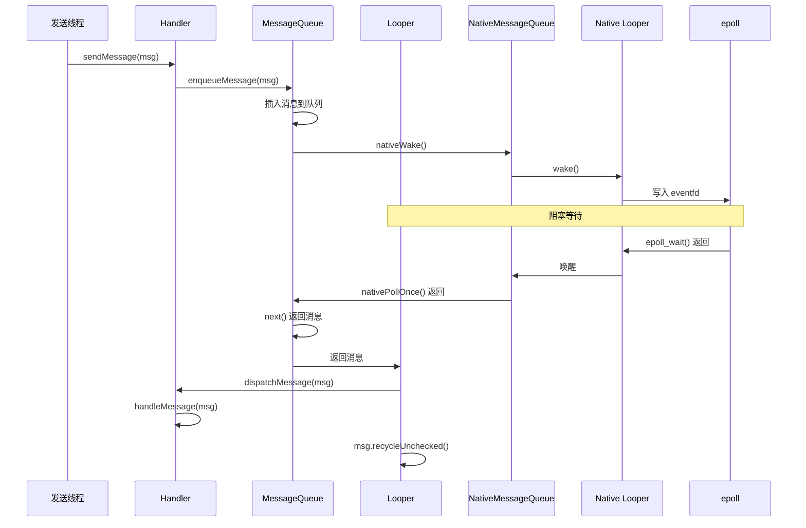

# MessageQueue 系统基础篇：Android 消息机制架构与核心概念

## 📋 概述

MessageQueue（消息队列）机制是 Android 系统中最核心的线程间通信机制，负责处理所有异步任务调度、UI 更新、事件分发等。理解 Android 消息机制是深入理解 ANR 机制、View 绘制、Activity 生命周期、系统服务等核心功能的基础。本篇将从架构概述、核心组件、层级结构、Java 与 Native 层的关系、消息基本概念、线程与 Looper 的关系、消息流程七个维度，建立对 Android 消息机制的基础认知。

---

## 一、Android 消息机制架构概述

### 1.1 整体架构图

Android 消息机制采用分层架构，从应用层到 Native 层，共分为四层：



### 1.2 四层架构详解

| 层级 | 主要组件 | 核心职责 |
| :--- | :--- | :--- |
| **应用层** | Handler、Activity、View | 消息发送和处理、UI 更新、事件处理 |
| **Framework 层** | Looper、MessageQueue、Message | 消息循环、消息队列管理、消息对象 |
| **Native 层** | NativeMessageQueue、Native Looper、epoll、eventfd | 高效的阻塞等待、及时的唤醒、文件描述符监听 |
| **系统层** | 主线程 Looper、SystemServer | 系统级消息处理、服务管理 |

### 1.3 核心组件简介

#### Handler
- **位置**：应用层和 Framework 层
- **作用**：消息的发送者和处理者
- **职责**：
  - 发送消息到消息队列（sendMessage、post 等）
  - 处理消息（handleMessage、Callback）
  - 绑定到特定的 Looper 和线程

#### Looper
- **位置**：Framework 层
- **作用**：消息循环的核心，负责从消息队列中取出消息并分发
- **职责**：
  - 准备消息队列（prepare）
  - 启动消息循环（loop）
  - 分发消息到 Handler
  - 管理线程与 Looper 的绑定（ThreadLocal）

#### MessageQueue
- **位置**：Framework 层（Java 层）和 Native 层
- **作用**：消息队列，存储待处理的消息
- **职责**：
  - 消息的入队和出队
  - 消息的排序（按 when 字段）
  - 阻塞等待和唤醒（通过 Native 层）
  - 同步屏障和 IdleHandler 的管理

#### Message
- **位置**：Framework 层
- **作用**：消息对象，封装了要处理的任务
- **职责**：
  - 存储消息内容（what、obj、arg1、arg2 等）
  - 关联目标 Handler（target）
  - 支持回调（callback）
  - 消息池复用

#### NativeMessageQueue
- **位置**：Native 层
- **作用**：Java MessageQueue 的 Native 对应
- **职责**：
  - 桥接 Java 层和 Native 层
  - 管理 Native Looper
  - 提供 JNI 接口（nativeInit、nativePollOnce、nativeWake）

#### Native Looper
- **位置**：Native 层
- **作用**：使用 epoll 实现高效的阻塞和唤醒
- **职责**：
  - 创建和管理 epoll 实例
  - 创建和管理 eventfd（用于唤醒）
  - 监听文件描述符（Binder、Input Channel 等）
  - 阻塞等待和唤醒

### 1.4 消息机制的作用和重要性

消息机制在 Android 系统中扮演着至关重要的角色：

1. **线程间通信**：实现不同线程之间的安全通信
2. **异步任务调度**：支持延迟执行、定时执行等异步操作
3. **UI 更新**：确保 UI 操作在主线程执行
4. **事件分发**：处理用户输入、系统事件等
5. **生命周期管理**：Activity、Service 等组件的生命周期回调
6. **系统服务**：AMS、WMS 等系统服务的消息处理

### 1.5 消息机制在 Android 系统中的应用场景

- **主线程消息队列**：处理 UI 更新、用户交互、生命周期回调
- **工作线程消息队列**：处理后台任务、网络请求、文件 IO
- **系统服务消息队列**：AMS、WMS、PMS 等系统服务的消息处理
- **Binder 线程消息队列**：处理 IPC 调用
- **Input 系统**：输入事件的分发和处理
- **View 绘制**：Choreographer 使用消息机制同步 VSYNC

---

## 二、消息机制层级简介

### 2.1 应用层

**主要组件**：Handler

**职责**：
- 创建 Handler 并绑定到 Looper
- 发送消息（sendMessage、post 等）
- 处理消息（handleMessage、Callback）

**特点**：
- 开发者直接使用的 API
- 可以绑定到主线程或工作线程的 Looper
- 支持消息的延迟发送和优先级控制

### 2.2 Framework 层（Java 层）

**主要组件**：Looper、MessageQueue、Message

**职责**：
- Looper：消息循环、消息分发
- MessageQueue：消息队列管理、消息排序
- Message：消息对象、消息池管理

**特点**：
- Java 实现，易于维护
- 负责业务逻辑和消息管理
- 通过 JNI 调用 Native 层

### 2.3 Native 层

**主要组件**：NativeMessageQueue、Native Looper、epoll、eventfd

**职责**：
- NativeMessageQueue：桥接 Java 层和 Native 层
- Native Looper：使用 epoll 实现高效的阻塞和唤醒
- epoll：监听文件描述符，实现阻塞等待
- eventfd：用于唤醒机制

**特点**：
- C++ 实现，性能更高
- 直接调用系统调用（epoll、eventfd）
- 支持文件描述符监听
- 精确的延迟控制

### 2.4 系统层

**主要组件**：主线程 Looper、SystemServer

**职责**：
- 主线程 Looper：系统自动创建，处理 UI 相关消息
- SystemServer：系统服务的消息处理

**特点**：
- 系统级组件
- 主线程 Looper 不允许退出
- 系统服务使用消息机制进行任务调度

---

## 三、Java 层与 Native 层的区别和作用

### 3.1 Java 层的职责

**消息的创建、发送、入队**：
- Message 对象的创建（obtain 或 new）
- Handler 发送消息（sendMessage、post 等）
- MessageQueue.enqueueMessage() 插入队列

**消息队列的数据结构管理**：
- 使用单链表存储消息
- 按 when 字段排序
- 支持头部插入和中间插入

**消息的分发和处理**：
- Looper.loop() 从队列中取出消息
- Handler.dispatchMessage() 分发消息
- 支持 Callback 和 handleMessage 两种处理方式

**业务逻辑处理**：
- handleMessage() 中执行具体的业务逻辑
- 支持消息的优先级和延迟处理

**高级特性**：
- 同步屏障（SyncBarrier）
- IdleHandler
- 消息合并和去重

### 3.2 Native 层的职责

**高效的阻塞等待机制**：
- 使用 epoll_wait() 实现阻塞等待
- 支持超时控制
- 避免 Java 层的 busy-wait

**及时的唤醒机制**：
- 使用 eventfd 实现唤醒
- 写入事件即可唤醒阻塞的线程
- 非阻塞和 close-on-exec 标志

**文件描述符监听**：
- 支持监听多个文件描述符（Binder、Input Channel 等）
- 文件描述符事件可以触发消息处理
- 使用 epoll 高效监听多个 FD

**精确的延迟控制**：
- epoll 超时机制支持精确的延迟控制
- 计算超时时间并传递给 epoll_wait()
- 延迟消息的精确调度

**系统级资源管理**：
- 管理 epoll 实例
- 管理 eventfd
- 管理文件描述符的注册和注销

### 3.3 为什么要分两层

#### 性能考虑

1. **直接调用系统调用**：
   - Native 层直接调用 epoll、eventfd 等 Linux 系统调用
   - 避免了 Java 层的性能开销
   - 系统调用执行效率更高

2. **避免 GC 压力**：
   - 阻塞在 Native 层，不占用 Java 堆
   - 减少 Java 对象的创建和回收
   - 降低 GC 频率和停顿时间

3. **减少 JNI 调用次数**：
   - 一次 nativePollOnce() 可以阻塞很长时间
   - 避免了频繁的 JNI 调用
   - 减少了 Java 和 Native 层之间的切换开销

#### 功能需求

1. **系统调用的限制**：
   - Java 层无法直接使用 epoll、eventfd 等 Linux 系统调用
   - 必须通过 Native 层来访问这些系统功能

2. **文件描述符监听**：
   - 需要监听文件描述符（Binder、Input Channel），必须使用 Native 层
   - epoll 是 Linux 特有的高效 I/O 多路复用机制

3. **精确的阻塞和唤醒控制**：
   - 需要精确的延迟控制和及时的唤醒
   - Native 层更适合这种底层控制

#### 架构设计

1. **职责分离**：
   - Java 层负责业务逻辑，代码更易维护
   - Native 层负责系统调用，封装系统细节
   - 清晰的职责划分，便于理解和维护

2. **可维护性**：
   - Java 层代码更易读、易写、易维护
   - Native 层封装复杂的系统调用细节
   - 开发者主要关注 Java 层的使用

3. **可扩展性**：
   - Native 层可以支持更多系统特性
   - 文件描述符监听等功能可以灵活扩展
   - 便于未来添加新的系统级功能

### 3.4 两层协作关系

**Java 层调用 Native 层**：
- `nativeInit()`：创建 NativeMessageQueue，返回指针
- `nativePollOnce()`：阻塞等待消息或超时
- `nativeWake()`：唤醒阻塞的线程

**Native 层回调 Java 层**：
- 文件描述符事件回调
- 通过 JNI 调用 Java 层的回调方法

**数据传递**：
- 通过 JNI 传递指针（mPtr）和参数
- mPtr 指针：Java 层保存 Native 对象的地址
- 参数传递：timeoutMillis 等参数通过 JNI 传递
- 返回值：通过 JNI 返回结果

---

## 四、消息的基本概念

### 4.1 消息类型

**同步消息**：
- 默认的消息类型
- 按照 when 字段排序处理
- 可以被同步屏障拦截

**异步消息**：
- 通过 setAsynchronous() 设置
- 可以越过同步屏障
- 用于需要优先处理的消息（如 View 绘制）

### 4.2 消息的字段详解

| 字段 | 类型 | 说明 |
| :--- | :--- | :--- |
| `what` | int | 消息标识，用于区分不同类型的消息 |
| `obj` | Object | 消息携带的对象，可以是任意类型 |
| `arg1` | int | 消息参数 1，用于传递简单的整型数据 |
| `arg2` | int | 消息参数 2，用于传递简单的整型数据 |
| `target` | Handler | 目标 Handler，消息将被分发到此 Handler |
| `callback` | Runnable | 回调 Runnable，优先级高于 handleMessage |
| `when` | long | 消息执行时间（时间戳），用于延迟消息 |
| `flags` | int | 消息标志，如 FLAG_ASYNCHRONOUS（异步消息） |
| `next` | Message | 指向下一个消息（链表结构） |
| `data` | Bundle | 消息携带的 Bundle 数据 |

### 4.3 消息对象的创建方式

#### new Message() vs Message.obtain()

**new Message()**：
```java
Message msg = new Message();
```
- 直接创建新的 Message 对象
- 每次都会分配新的内存
- 增加 GC 压力

**Message.obtain()**：
```java
Message msg = Message.obtain();
```
- 从消息池中获取 Message 对象
- 复用已回收的 Message 对象
- 减少内存分配和 GC 压力
- **推荐使用**：性能更好，减少内存占用

#### 消息池的工作原理

**消息池结构**：
- `sPool`：消息池的头部（静态变量）
- `sPoolSize`：消息池中消息的数量
- `MAX_POOL_SIZE`：消息池的最大容量（50）

**消息池的优势**：
1. **减少内存分配**：复用已回收的消息对象
2. **降低 GC 压力**：减少对象的创建和回收
3. **提高性能**：避免频繁的内存分配

**消息池的工作流程**：
1. 调用 `Message.obtain()` 时，从消息池中取出一个消息
2. 如果消息池为空，则创建新的消息
3. 消息处理完成后，调用 `recycleUnchecked()` 回收到消息池
4. 消息池达到最大容量时，不再回收新消息

### 4.4 消息的完整生命周期

消息从创建到回收的完整生命周期包括以下阶段：

**1. 创建阶段**：
- 使用 `Message.obtain()` 或 `new Message()` 创建消息对象
- 从消息池中获取或创建新对象

**2. 配置阶段**：
- 设置消息的字段（what、obj、arg1、arg2、callback 等）
- 设置目标 Handler（target）
- 设置执行时间（when）

**3. 发送阶段**：
- 调用 Handler 的发送方法（sendMessage、post、sendMessageDelayed 等）
- 消息被封装并准备入队

**4. 入队阶段**：
- `MessageQueue.enqueueMessage()` 将消息插入队列
- 按照 when 字段排序
- 如果需要，唤醒阻塞的线程

**5. 分发阶段**：
- `Looper.loop()` 从队列中取出消息
- 检查消息是否到期（when <= now）
- 处理同步屏障和异步消息

**6. 处理阶段**：
- `Handler.dispatchMessage()` 分发消息
- 优先执行 callback（如果存在）
- 否则执行 handleMessage()

**7. 回收阶段**：
- 消息处理完成后，Looper 调用 `msg.recycleUnchecked()` 回收消息
- `recycleUnchecked()` 不会检查消息是否正在使用，直接回收（消息已处理完成，无需检查）
- 消息被回收到消息池，等待下次复用

### 4.5 消息发送方式对比

#### sendMessage() vs post()

**sendMessage()**：
```java
Handler handler = new Handler();
Message msg = Message.obtain();
msg.what = 1;
handler.sendMessage(msg);
```
- 需要手动创建和配置 Message 对象
- 更灵活，可以设置所有字段
- 适合需要传递复杂数据的场景

**post()**：
```java
Handler handler = new Handler();
handler.post(new Runnable() {
    @Override
    public void run() {
        // 执行任务
    }
});
```
- 自动创建 Message 对象，设置 callback 字段
- 更简洁，适合简单的任务
- 不需要手动创建 Message

#### sendMessageDelayed() vs postDelayed()

**sendMessageDelayed()**：
```java
handler.sendMessageDelayed(msg, 1000); // 延迟 1 秒
```
- 延迟发送消息
- 需要手动创建 Message 对象

**postDelayed()**：
```java
handler.postDelayed(runnable, 1000); // 延迟 1 秒
```
- 延迟执行 Runnable
- 自动创建 Message 对象

#### sendMessageAtTime() vs sendMessageAtFrontOfQueue()

**sendMessageAtTime()**：
```java
handler.sendMessageAtTime(msg, SystemClock.uptimeMillis() + 1000);
```
- 在指定时间发送消息
- 消息按照 when 字段排序

**sendMessageAtFrontOfQueue()**：
```java
handler.sendMessageAtFrontOfQueue(msg);
```
- 将消息插入到队列头部
- 优先级最高，立即处理
- **注意**：可能影响消息顺序，谨慎使用

#### 各种发送方式的使用场景

| 方法 | 使用场景 |
| :--- | :--- |
| `sendMessage()` | 需要传递复杂数据，设置多个字段 |
| `post()` | 简单的任务，不需要传递数据 |
| `sendMessageDelayed()` | 延迟发送消息，需要传递数据 |
| `postDelayed()` | 延迟执行任务，不需要传递数据 |
| `sendMessageAtTime()` | 在指定时间发送消息 |
| `sendMessageAtFrontOfQueue()` | 紧急消息，需要立即处理 |

---

## 五、线程与 Looper 的关系

### 5.1 ThreadLocal 机制（重要基础）

#### ThreadLocal 在 Looper 中的作用

**为什么需要 ThreadLocal**：
- 每个线程只能有一个 Looper
- 需要将 Looper 与线程绑定
- 避免线程间的 Looper 冲突

**ThreadLocal 的基本原理**：
```java
static final ThreadLocal<Looper> sThreadLocal = new ThreadLocal<Looper>();
```
- ThreadLocal 为每个线程维护一个独立的变量副本
- 每个线程访问自己的 Looper，互不干扰
- 实现了线程与 Looper 的一对一绑定

#### 为什么每个线程只能有一个 Looper

**设计原因**：
1. **简化设计**：一个线程一个 Looper，避免复杂性
2. **避免冲突**：多个 Looper 会导致消息分发混乱
3. **性能考虑**：单个 Looper 更高效

**实现机制**：
- `Looper.prepare()` 检查当前线程是否已有 Looper
- 如果已有，抛出异常
- 确保每个线程只有一个 Looper

#### ThreadLocal 的基本实现原理（简化版）

**存储机制**：
- 每个线程维护一个 ThreadLocalMap
- ThreadLocalMap 存储该线程的所有 ThreadLocal 变量
- 通过线程 ID 和 ThreadLocal 对象作为 key 来存储和获取

**sThreadLocal 的存储机制**：
- `sThreadLocal.set(looper)`：将 Looper 存储到当前线程的 ThreadLocalMap
- `sThreadLocal.get()`：从当前线程的 ThreadLocalMap 获取 Looper
- 不同线程的 Looper 互不干扰

### 5.2 主线程的 Looper

#### 主线程 Looper 的自动创建

**创建时机**：
- 在 `ActivityThread.main()` 中自动创建
- 应用启动时，系统自动为主线程准备 Looper
- 开发者无需手动调用 `Looper.prepare()`

**创建代码**（简化）：
```java
public static void main(String[] args) {
    Looper.prepareMainLooper(); // 准备主线程 Looper
    ActivityThread thread = new ActivityThread();
    thread.attach(false);
    Looper.loop(); // 启动消息循环
}
```

#### 主线程 Looper 的特殊性

1. **不允许退出**：
   - `quitAllowed = false`
   - 调用 `quit()` 会抛出异常
   - 确保主线程消息循环一直运行

2. **系统自动管理**：
   - 系统负责创建和启动
   - 应用退出时系统负责清理
   - 开发者无需手动管理

3. **与 UI 更新的关系**：
   - 所有 UI 操作必须在主线程执行
   - View 的更新、事件处理都在主线程的 Looper 中执行
   - 确保 UI 线程安全

### 5.3 工作线程的 Looper

#### Looper.prepare() 的调用时机

**手动准备**：
```java
class WorkerThread extends Thread {
    private Handler handler;
    
    @Override
    public void run() {
        Looper.prepare(); // 准备 Looper
        handler = new Handler();
        Looper.loop(); // 启动消息循环
    }
}
```

**使用 HandlerThread**：
```java
HandlerThread handlerThread = new HandlerThread("WorkerThread");
handlerThread.start();
Handler handler = new Handler(handlerThread.getLooper());
```

#### Looper.loop() 的启动

**启动消息循环**：
- `Looper.loop()` 启动无限循环
- 从 MessageQueue 中取出消息并分发
- 直到调用 `quit()` 或 `quitSafely()` 才退出

#### 工作线程 Looper 的退出机制

**退出方式**：
- `quit()`：立即退出，丢弃未处理消息
- `quitSafely()`：处理完已到期消息后退出

**退出时机**：
- 线程不再需要时，应该退出 Looper
- 避免线程泄漏和资源浪费
- 通常在 `onDestroy()` 或线程结束时调用

### 5.4 Looper.prepare() 和 Looper.loop() 的完整流程

**prepare() 流程**：
1. 检查当前线程是否已有 Looper
2. 如果已有，抛出异常
3. 创建 MessageQueue
4. 创建 Looper 对象
5. 将 Looper 存储到 ThreadLocal

**loop() 流程**：
1. 获取当前线程的 Looper
2. 获取 MessageQueue
3. 进入无限循环
4. 调用 `queue.next()` 获取消息
5. 如果消息为 null，退出循环
6. 分发消息到 Handler
7. 回收消息对象
8. 继续循环

---

## 六、消息发送和处理流程（完整版）

### 6.1 时序图：消息从发送到处理的完整流程



### 6.2 流程图：sendMessage() → enqueueMessage() → loop() → next() → dispatchMessage()

```
发送消息
    ↓
Handler.sendMessage()
    ↓
MessageQueue.enqueueMessage()
    ↓
插入消息到队列（按 when 排序）
    ↓
是否需要唤醒？ → nativeWake()
    ↓
Looper.loop() 循环
    ↓
MessageQueue.next()
    ↓
检查消息是否到期
    ↓
未到期 → nativePollOnce() 阻塞等待
    ↓
到期 → 返回消息
    ↓
Looper 分发消息
    ↓
Handler.dispatchMessage()
    ↓
执行 callback 或 handleMessage()
    ↓
回收消息到消息池
    ↓
继续循环
```

### 6.3 各阶段的详细说明

**1. 发送阶段**：
- Handler 的 sendMessage() 方法调用内部的 enqueueMessage() 方法
- enqueueMessage() 设置 `msg.target = this`（将 Handler 设置为消息的目标）
- 然后调用 MessageQueue.enqueueMessage() 将消息插入队列

**2. 入队阶段**：
- 按照 when 字段排序插入队列
- 判断是否需要唤醒线程（消息插入到队列头部，或插入异步消息且队列头部是同步屏障，且线程正在阻塞）
- 如果需要，调用 nativeWake() 唤醒阻塞的线程

**3. 阻塞等待阶段**：
- MessageQueue.next() 检查队列是否为空
- 如果为空或最早消息未到期，调用 nativePollOnce() 阻塞
- Native 层使用 epoll_wait() 阻塞等待

**4. 唤醒阶段**：
- 新消息入队时，调用 nativeWake()
- Native 层写入 eventfd，唤醒 epoll_wait()
- 线程从阻塞中恢复

**5. 分发阶段**：
- Looper 获取消息后，调用 Handler.dispatchMessage()
- 优先执行 callback（如果存在）
- 否则执行 handleMessage()

**6. 回收阶段**：
- 消息处理完成后，Looper 调用 `msg.recycleUnchecked()`
- 消息被回收到消息池，等待下次复用

### 6.4 消息队列的插入和取出

**插入操作**：
- 按照 when 字段排序
- 头部插入：when = 0 或 when < 队列头部消息的 when
- 中间插入：遍历队列，找到合适的位置插入

**取出操作**：
- 从队列头部取出消息
- 检查消息是否到期（when <= now）
- 处理同步屏障和异步消息

### 6.5 阻塞和唤醒的时机

**阻塞时机**：
- 消息队列为空
- 最早的消息未到期（延迟消息）
- 需要等待新消息或超时

**唤醒时机**：
- 新消息入队，且满足以下条件之一：
  - 消息插入到队列头部（when = 0 或 when < 队列头部消息的 when），且线程正在阻塞
  - 插入的是异步消息，且队列头部是同步屏障，且线程正在阻塞
- 延迟消息到期（epoll_wait() 超时返回）
- 文件描述符事件发生（epoll_wait() 检测到 FD 事件）

### 6.6 Java 层与 Native 层的交互时序

**初始化阶段**：
- MessageQueue 构造函数调用 nativeInit()
- Native 层创建 NativeMessageQueue 和 Native Looper
- 返回指针（mPtr）给 Java 层

**阻塞等待阶段**：
- Java 层调用 nativePollOnce(ptr, timeoutMillis)
- Native 层执行 epoll_wait()，阻塞等待
- 等待超时、唤醒或文件描述符事件

**唤醒阶段**：
- Java 层调用 nativeWake(ptr)
- Native 层写入 eventfd
- epoll_wait() 被唤醒，返回

---

## 七、总结

### 7.1 核心概念回顾

1. **消息机制采用四层架构**：应用层、Framework 层、Native 层、系统层
2. **核心组件**：Handler、Looper、MessageQueue、Message、NativeMessageQueue、Native Looper
3. **Java 层与 Native 层的分工**：
   - Java 层：业务逻辑、消息管理
   - Native 层：系统调用、阻塞唤醒
4. **消息的完整生命周期**：创建 → 配置 → 发送 → 入队 → 分发 → 处理 → 回收
5. **线程与 Looper 的关系**：通过 ThreadLocal 实现一对一绑定
6. **消息发送和处理流程**：sendMessage() → enqueueMessage() → loop() → next() → dispatchMessage()

### 7.2 架构层次

- **应用层**：Handler 的使用，消息发送和处理
- **Framework 层**：Looper、MessageQueue、Message 的实现
- **Native 层**：高效的阻塞等待和及时的唤醒机制
- **系统层**：主线程 Looper、系统服务的消息处理

### 7.3 关键要点

1. **消息池机制**：使用 Message.obtain() 复用消息对象，减少内存分配
2. **ThreadLocal 机制**：确保每个线程只有一个 Looper
3. **Native 层的重要性**：epoll 和 eventfd 实现高效的阻塞和唤醒
4. **主线程 Looper 的特殊性**：系统自动创建，不允许退出
5. **消息的优先级**：同步屏障、异步消息、普通消息的处理顺序

### 7.4 下一步学习

在掌握了基础概念后，建议继续学习：
- **进阶篇**：深入理解各层级的实现细节和交互机制
- **专家篇**：掌握高级特性和性能优化方法
- **面试题篇**：巩固知识点，准备面试

---

**提示**：消息机制是 Android 系统的核心，理解消息机制是深入理解 Android 系统的基础。建议结合实际项目经验，不断加深理解。
