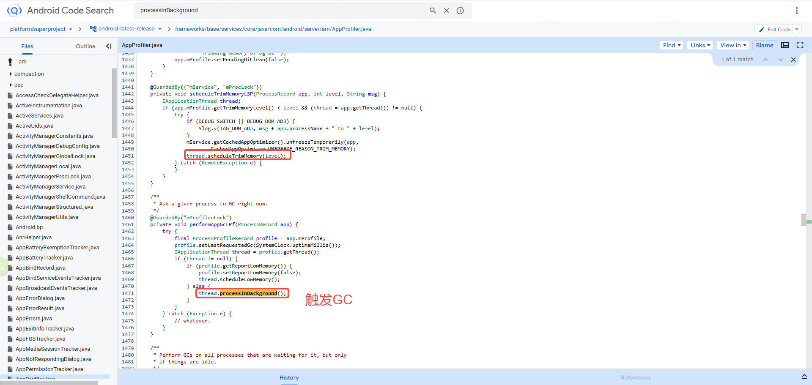

# 05-同步屏障与异步消息：UI 渲染的优先级保障

在上一篇中，我们跟随 Message 的完整生命周期——从 `obtain()` 创建、`enqueueMessage()` 入队、`dispatchMessage()` 分发到 `recycleUnchecked()` 回收——理解了消息机制的"运输与处理"环节。但有一个问题我们还没有回答：**如果消息队列里排了 20 条普通消息，这时候一条 UI 渲染消息到来，它能"插队"吗？**

答案是：**能，但需要一把特殊的"锁"——同步屏障（Sync Barrier）。**

Android 的 UI 渲染有一个硬约束：每一帧必须在 16.6ms（60Hz）或 8.3ms（120Hz）内完成。如果渲染消息排在一堆普通消息后面等待，很可能错过 VSync 窗口导致掉帧。为了保障渲染优先，Android 设计了同步屏障机制：当屏障插入后，`MessageQueue.next()` 会**跳过所有普通（同步）消息**，只取出**异步消息**优先处理。

这个机制是 Choreographer 保障 UI 流畅性的核心手段。而与之配合的 `IdleHandler`，则在消息队列空闲时执行低优先级任务——GC、延迟初始化、Activity finish 等。

本篇将完整拆解同步屏障的实现原理、Choreographer 与 ViewRootImpl 的渲染链路、以及 IdleHandler 的调度逻辑。对稳定性架构师来说，理解这些机制至少有三个直接用处：

1. **理解掉帧的根因**：同步屏障保障了渲染消息的优先级，但如果屏障未被正确移除，所有同步消息被永久阻塞——主线程"假死"。
2. **理解渲染链路**：从 `scheduleTraversals()` 到 `performTraversals()`，中间经历了屏障插入、VSync 等待、屏障移除的完整过程。任何一环出问题都会导致 UI 异常。
3. **理解 IdleHandler 的风险**：IdleHandler 在空闲时执行，看似无害，但如果执行耗时过长，会延迟后续消息的处理，间接引发 ANR。

---

## 1. 同步屏障是什么

### 1.1 为什么需要消息优先级

Android 主线程的 `MessageQueue` 是一个按时间排序的单链表——消息按 `when` 字段从小到大排列，`next()` 每次从链表头取出到期的消息分发。这是一个严格的 FIFO（先到先处理）模型。

但 FIFO 模型有一个致命缺陷：**它不区分消息的重要性。** 一条 `Handler.post(runnable)` 提交的普通任务和一条 Choreographer 的 `doFrame` 渲染消息，在队列中享有完全相同的优先级。如果普通消息排在前面，渲染消息只能等。

```
MessageQueue 链表（按 when 排序）：

  msg1(DB查询回调, when=100) → msg2(网络回调, when=102) → msg3(日志上报, when=103)
    → msg4(doFrame渲染, when=105) → msg5(动画回调, when=106)

  next() 严格按顺序处理：msg1 → msg2 → msg3 → msg4 → msg5

  如果 msg1 耗时 20ms、msg2 耗时 15ms、msg3 耗时 10ms，
  msg4(doFrame) 要等 45ms 才能执行 → 远超 16.6ms → 掉帧
```

为了解决这个问题，Android 引入了**同步屏障 + 异步消息**的优先级机制。

### 1.2 同步消息 vs 异步消息

每条 `Message` 都有一个 `flags` 字段，其中 `FLAG_ASYNCHRONOUS` 标志位决定了消息的类型：

> Source: `frameworks/base/core/java/android/os/Message.java`

```java
// frameworks/base/core/java/android/os/Message.java
/** @hide */
public static final int FLAG_ASYNCHRONOUS = 1 << 1;

public boolean isAsynchronous() {
    return (flags & FLAG_ASYNCHRONOUS) != 0;
}

public void setAsynchronous(boolean async) {
    if (async) {
        flags |= FLAG_ASYNCHRONOUS;
    } else {
        flags &= ~FLAG_ASYNCHRONOUS;
    }
}
```

| 消息类型 | `isAsynchronous()` | 来源 | 特点 |
| :--- | :--- | :--- | :--- |
| **同步消息** | `false`（默认） | `Handler.sendMessage()`、`Handler.post()` 等 | 受同步屏障影响，屏障存在时被跳过 |
| **异步消息** | `true` | 通过 `Handler(async=true)` 创建或 `msg.setAsynchronous(true)` | 不受同步屏障影响，屏障存在时仍可被取出 |

**在没有同步屏障的情况下，同步消息和异步消息的行为完全一样**——都按 `when` 排序，先到先处理。异步消息的"特权"只在同步屏障存在时才生效。

### 1.3 同步屏障的本质

同步屏障是一种 **`target == null` 的特殊 Message**。普通 Message 的 `target` 字段指向发送它的 Handler（用于 `dispatchMessage` 分发），而同步屏障的 `target` 为 null——它不属于任何 Handler，也不需要被分发。它唯一的作用就是：**告诉 `MessageQueue.next()` "从我开始，跳过所有同步消息，只取异步消息"。**

```
有屏障时的消息队列：

  [barrier(target=null, when=100)]
    → msg1(同步, when=101)        ← 被跳过
    → msg2(同步, when=102)        ← 被跳过
    → msg3(异步, when=103)        ← 被取出！
    → msg4(同步, when=104)        ← 被跳过
    → msg5(异步, when=106)

  next() 遇到 barrier → 遍历链表找第一个异步消息 → 找到 msg3 → 取出执行
  msg1、msg2、msg4 全部被屏蔽，直到 barrier 被移除
```

**稳定性关联：** 同步屏障的 `target == null` 特性意味着它**不能通过 `Handler.removeMessages()` 移除**——因为 `removeMessages` 是按 target（Handler）过滤的。屏障只能通过 `removeSyncBarrier(token)` 这个专用方法移除。如果插入屏障的代码在异常路径上跳过了移除逻辑，这个屏障将永远留在队列中，所有同步消息被永久阻塞。

---

## 2. 源码实现

### 2.1 postSyncBarrier()：插入同步屏障

> Source: `frameworks/base/core/java/android/os/MessageQueue.java`

```java
// frameworks/base/core/java/android/os/MessageQueue.java
/** @hide */
public int postSyncBarrier() {
    return postSyncBarrier(SystemClock.uptimeMillis());
}

private int postSyncBarrier(long when) {
    synchronized (this) {
        final int token = mNextBarrierToken++;
        // ① 从对象池获取 Message，但不设置 target
        final Message msg = Message.obtain();
        msg.markInUse();
        msg.when = when;
        msg.arg1 = token;  // token 用于后续移除

        // ② 按 when 插入到链表的正确位置
        Message prev = null;
        Message p = mMessages;
        if (when != 0) {
            while (p != null && p.when <= when) {
                prev = p;
                p = p.next;
            }
        }
        if (prev != null) {
            msg.next = p;
            prev.next = msg;
        } else {
            msg.next = p;
            mMessages = msg;
        }
        return token;
    }
}
```

**关键设计点：**

| 设计 | 实现 | 原因 |
| :--- | :--- | :--- |
| target 不设置 | `Message.obtain()` 后不调用 `msg.target = handler` | `target == null` 是屏障的唯一标识 |
| 按 when 排序插入 | 遍历链表找到 `when` 的正确位置 | 屏障也遵循时间排序，不会插到过去的消息之前 |
| 返回 token | `mNextBarrierToken++` 自增整数 | 用于 `removeSyncBarrier(token)` 精确定位要移除的屏障 |
| `@hide` API | 对应用层不可见 | 屏障机制仅供系统内部使用（Choreographer / ViewRootImpl） |

注意这里和普通的 `enqueueMessage()` 有一个重要区别：**`postSyncBarrier()` 不调用 `nativeWake()`**。这意味着插入屏障本身不会唤醒可能阻塞在 `epoll_wait` 中的线程——屏障只是一个"标记"，等线程下次被唤醒后才会生效。

### 2.2 next() 中的屏障逻辑

> Source: `frameworks/base/core/java/android/os/MessageQueue.java`

```java
// frameworks/base/core/java/android/os/MessageQueue.java — next() 方法（屏障相关逻辑）
Message next() {
    // ...
    for (;;) {
        nativePollOnce(ptr, nextPollTimeoutMillis);

        synchronized (this) {
            final long now = SystemClock.uptimeMillis();
            Message prevMsg = null;
            Message msg = mMessages;  // 链表头

            // ★ 同步屏障检查
            if (msg != null && msg.target == null) {
                // 链表头是同步屏障 → 跳过所有同步消息，找第一个异步消息
                do {
                    prevMsg = msg;
                    msg = msg.next;
                } while (msg != null && !msg.isAsynchronous());
            }

            if (msg != null) {
                if (now < msg.when) {
                    // 异步消息还没到时间 → 计算等待时长
                    nextPollTimeoutMillis = (int) Math.min(
                            msg.when - now, Integer.MAX_VALUE);
                } else {
                    // 异步消息到时间了 → 取出
                    mBlocked = false;
                    if (prevMsg != null) {
                        prevMsg.next = msg.next;  // 从链表中间摘除
                    } else {
                        mMessages = msg.next;     // 从链表头摘除
                    }
                    msg.next = null;
                    msg.markInUse();
                    return msg;
                }
            } else {
                // 没有找到异步消息 → 无限期阻塞
                nextPollTimeoutMillis = -1;
            }

            // ... IdleHandler 逻辑 ...
        }
    }
}
```

逐步分解这段逻辑：

```
next() 进入同步块后：

  msg = mMessages（链表头）

  ① 检查链表头是否是屏障（msg.target == null）
     │
     ├── 否 → msg 就是链表头消息，正常处理
     │
     └── 是 → 进入 do-while 循环
              │
              │  遍历链表，跳过所有同步消息
              │  (msg != null && !msg.isAsynchronous())
              │
              ├── 找到异步消息 → msg 指向该异步消息
              │   ├── now >= msg.when → 取出并返回
              │   └── now < msg.when → 计算等待时长
              │
              └── 遍历到链表末尾仍未找到 → msg == null
                  → nextPollTimeoutMillis = -1
                  → 无限期阻塞（等待异步消息入队唤醒）
```

**关键行为：** 当同步屏障存在且队列中没有异步消息时，`nextPollTimeoutMillis` 被设为 `-1`，线程将**无限期阻塞**在 `nativePollOnce` 中。只有当新的异步消息入队并调用 `nativeWake()` 时，线程才会被唤醒。

**稳定性关联：** 这就是同步屏障泄漏导致主线程"假死"的根本原因——如果屏障没有被移除，且没有新的异步消息入队，主线程将永远阻塞。但这种阻塞和"正常空闲"在 ANR trace 中看起来完全一样——都是停在 `nativePollOnce`。区分的关键是查看 `mMessages` 链表是否有 `target == null` 的消息头。

### 2.3 removeSyncBarrier()：移除同步屏障

> Source: `frameworks/base/core/java/android/os/MessageQueue.java`

```java
// frameworks/base/core/java/android/os/MessageQueue.java
/** @hide */
public void removeSyncBarrier(int token) {
    synchronized (this) {
        Message prev = null;
        Message p = mMessages;

        // ① 根据 token 在链表中找到屏障消息
        while (p != null && (p.target != null || p.arg1 != token)) {
            prev = p;
            p = p.next;
        }
        if (p == null) {
            throw new IllegalStateException(
                    "The specified message queue synchronization "
                    + "barrier token has not been posted or has "
                    + "already been removed.");
        }

        final boolean needWake;
        // ② 从链表中移除屏障
        if (prev != null) {
            prev.next = p.next;
            needWake = false;  // 屏障不在链表头，移除不影响调度
        } else {
            mMessages = p.next;
            needWake = mMessages == null || mMessages.target != null;
        }
        p.recycleUnchecked();

        // ③ 如果需要，唤醒阻塞的线程
        if (needWake && !mQuitting) {
            nativeWake(mPtr);
        }
    }
}
```

**关键设计点：**

1. **查找条件 `p.target != null || p.arg1 != token`**：同时匹配 `target == null`（是屏障）和 `arg1 == token`（是我们要移除的那个屏障）。一个队列中可能存在多个屏障（虽然实践中极少），token 保证精确匹配。
2. **needWake 判断**：如果移除的屏障在链表头部，且移除后链表头变成了一条同步消息（`mMessages.target != null`），说明之前被屏障阻塞的同步消息现在可以被处理了，需要 `nativeWake()` 唤醒线程。
3. **异常检测**：如果 token 找不到对应的屏障，直接抛 `IllegalStateException`。这意味着**重复移除同一个屏障也会崩溃**。

**稳定性关联：** `removeSyncBarrier` 的调用必须与 `postSyncBarrier` 严格配对。遗漏移除会导致同步消息永久阻塞；重复移除会导致 `IllegalStateException` 崩溃。在 ViewRootImpl 的实现中，这个配对通过 `mTraversalBarrier` 变量保证——插入时记录 token，移除时使用同一个 token。

---

## 3. 为什么需要同步屏障——Choreographer 与 VSync

### 3.1 渲染的时间约束

Android 的 UI 渲染由 Choreographer 驱动。SurfaceFlinger 以固定频率（60Hz = 每 16.6ms）发送 VSync 信号，Choreographer 在收到 VSync 后必须在下一个 VSync 到来之前完成当前帧的渲染——否则就掉帧。

```
VSync 时间线（60Hz）：

  VSync₁         VSync₂         VSync₃         VSync₄
    │               │               │               │
    ▼               ▼               ▼               ▼
  ──┬───────────────┬───────────────┬───────────────┬──→ time
    │  16.6ms 窗口  │  16.6ms 窗口  │  16.6ms 窗口  │
    │               │               │               │
    │ doFrame       │ doFrame       │ doFrame       │
    │ (必须在此窗口  │               │               │
    │  内完成渲染)   │               │               │
```

Choreographer 在收到 VSync 后，通过 Handler 发送 `MSG_DO_FRAME` 消息。这条消息到达 `MessageQueue` 后，如果前面排了很多普通消息，可能要等很久才能被处理——每等一条消息的处理时间，就离 16.6ms 的截止线更近一步。

### 3.2 Choreographer 如何使用同步屏障

> Source: `frameworks/base/core/java/android/view/Choreographer.java`

```java
// frameworks/base/core/java/android/view/Choreographer.java
private final class FrameHandler extends Handler {
    public FrameHandler(Looper looper) {
        super(looper);
    }

    @Override
    public void handleMessage(Message msg) {
        switch (msg.what) {
            case MSG_DO_FRAME:
                doFrame(System.nanoTime(), 0);
                break;
            case MSG_DO_SCHEDULE_VSYNC:
                doScheduleVsync();
                break;
            case MSG_DO_SCHEDULE_CALLBACK:
                doScheduleCallback(msg.arg1);
                break;
        }
    }
}
```

Choreographer 的 `FrameHandler` 在构造时使用了 `async = true` 的参数：

```java
// frameworks/base/core/java/android/view/Choreographer.java
private Choreographer(Looper looper, int vsyncSource) {
    mLooper = looper;
    // 注意第三个参数 true → 这个 Handler 发出的所有消息都是异步的
    mHandler = new FrameHandler(looper);
    // ...
}
```

实际上 Choreographer 在调度 VSync 回调时，会将消息标记为异步：

```java
// frameworks/base/core/java/android/view/Choreographer.java
private void postCallbackDelayedInternal(int callbackType,
        Object action, Object token, long delayMillis) {
    synchronized (mLock) {
        // ...
        Message msg = mHandler.obtainMessage(MSG_DO_SCHEDULE_CALLBACK, action);
        msg.arg1 = callbackType;
        msg.setAsynchronous(true);  // ★ 标记为异步消息
        mHandler.sendMessageAtTime(msg, dueTime);
    }
}
```

当 VSync 信号到达时，Choreographer 通过 `scheduleFrameLocked()` 调度渲染：

```java
// frameworks/base/core/java/android/view/Choreographer.java
private void scheduleFrameLocked(long now) {
    if (!mFrameScheduled) {
        mFrameScheduled = true;
        if (USE_VSYNC) {
            if (isRunningOnLooperThreadLocked()) {
                scheduleVsyncLocked();
            } else {
                Message msg = mHandler.obtainMessage(MSG_DO_SCHEDULE_VSYNC);
                msg.setAsynchronous(true);  // ★ 异步消息
                mHandler.sendMessageAtFrontOfQueue(msg);
            }
        }
    }
}
```

**完整流程：**

```
VSync 信号到达
    → DisplayEventReceiver.onVsync()
        → Choreographer.doFrame()
            → 按类型依次执行回调：
                CALLBACK_INPUT      → 处理输入事件
                CALLBACK_ANIMATION  → 执行属性动画
                CALLBACK_INSETS_ANIMATION → 处理窗口 Insets 动画
                CALLBACK_TRAVERSAL  → 执行 View 三大流程（measure/layout/draw）
                CALLBACK_COMMIT     → 提交帧
```

### 3.3 同步屏障的渲染保障作用

同步屏障确保了这样一个不变量：**在 VSync 到达到 doFrame 执行之间，主线程不会被普通消息"打断"。**

```
无同步屏障（可能掉帧）：

  queue: [msg1(同步,5ms)] → [msg2(同步,8ms)] → [msg3(同步,6ms)] → [doFrame(异步)]

  处理顺序: msg1(5ms) → msg2(8ms) → msg3(6ms) → doFrame
  doFrame 等待时间: 19ms → 超过 16.6ms → 掉帧 ✗

有同步屏障（保障渲染）：

  queue: [barrier] → [msg1(同步)] → [msg2(同步)] → [msg3(同步)] → [doFrame(异步)]

  next() 遇到 barrier → 跳过 msg1/msg2/msg3 → 直接取 doFrame
  doFrame 等待时间: ~0ms → 渲染窗口充裕 ✓
  屏障移除后 → msg1/msg2/msg3 继续正常处理
```

**稳定性关联：** 同步屏障是一把双刃剑。它保障了渲染优先级，但也意味着**屏障存在期间，所有同步消息都被延迟**。如果渲染链路中某一环耗时过长（如 `onDraw()` 中做了复杂计算），屏障的存在时间就会拉长，同步消息的延迟也随之增加。这就是为什么"重绘耗时"不仅影响帧率，还可能间接影响生命周期回调、Broadcast 超时等——因为它们都是同步消息。

---

## 4. ViewRootImpl.scheduleTraversals() 完整链路

### 4.1 为什么要从 scheduleTraversals 说起

当你调用 `View.invalidate()`、`View.requestLayout()` 或 `Window` 属性变更时，最终都会汇聚到 `ViewRootImpl.scheduleTraversals()`。这个方法是 **UI 渲染的总入口**——它插入同步屏障、注册 VSync 回调、等待 VSync 到达、执行渲染、移除屏障。完整链路如下：

```
View.invalidate() / View.requestLayout()
    ↓
ViewRootImpl.scheduleTraversals()
    ├── ① postSyncBarrier()             ← 插入同步屏障
    └── ② Choreographer.postCallback()  ← 注册 CALLBACK_TRAVERSAL 回调
            ↓
        等待 VSync 信号
            ↓
        VSync 到达
            ↓
        Choreographer.doFrame()
            ↓
        doCallbacks(CALLBACK_TRAVERSAL)
            ↓
        mTraversalRunnable.run()
            ↓
        ViewRootImpl.doTraversal()
            ├── ③ removeSyncBarrier()    ← 移除同步屏障
            └── ④ performTraversals()    ← 执行 measure / layout / draw
```

### 4.2 源码走读

> Source: `frameworks/base/core/java/android/view/ViewRootImpl.java`

```java
// frameworks/base/core/java/android/view/ViewRootImpl.java
void scheduleTraversals() {
    if (!mTraversalScheduled) {
        mTraversalScheduled = true;

        // ① 插入同步屏障，记录 token
        mTraversalBarrier = mHandler.getLooper().getQueue().postSyncBarrier();

        // ② 向 Choreographer 注册 TRAVERSAL 类型的回调
        mChoreographer.postCallback(
                Choreographer.CALLBACK_TRAVERSAL,
                mTraversalRunnable,   // Runnable，最终调用 doTraversal()
                null);

        // 通知即将进行遍历（用于性能监控）
        notifyRendererOfFramePending();
        pokeDrawLockIfNeeded();
    }
}
```

`mTraversalRunnable` 的定义：

```java
// frameworks/base/core/java/android/view/ViewRootImpl.java
final class TraversalRunnable implements Runnable {
    @Override
    public void run() {
        doTraversal();
    }
}
final TraversalRunnable mTraversalRunnable = new TraversalRunnable();
```

`doTraversal()` 中移除屏障并执行渲染：

```java
// frameworks/base/core/java/android/view/ViewRootImpl.java
void doTraversal() {
    if (mTraversalScheduled) {
        mTraversalScheduled = false;

        // ③ 移除同步屏障
        mHandler.getLooper().getQueue().removeSyncBarrier(mTraversalBarrier);

        // ④ 执行 View 三大流程
        performTraversals();

        // ...
    }
}
```

`performTraversals()` 是 View 体系最核心的方法，依次执行 measure → layout → draw：

```java
// frameworks/base/core/java/android/view/ViewRootImpl.java（极简化）
private void performTraversals() {
    // ... 大量前置检查和窗口属性处理 ...

    if (mFirst || windowShouldResize || viewVisibilityChanged || ...) {
        // 执行 measure
        performMeasure(childWidthMeasureSpec, childHeightMeasureSpec);
    }

    if (didLayout) {
        // 执行 layout
        performLayout(lp, mWidth, mHeight);
    }

    if (!cancelDraw) {
        // 执行 draw
        performDraw();
    }
}
```

### 4.3 完整时序图

```
时间 ──────────────────────────────────────────────────────────→

  T1: View.invalidate()
      │
      ▼
  T2: scheduleTraversals()
      ├── postSyncBarrier() ──→ [barrier 插入到 MessageQueue]
      └── postCallback(TRAVERSAL, mTraversalRunnable)
                                    │
                                    ▼
                            Choreographer 向 SurfaceFlinger 请求 VSync
                                    │
                                    │  （等待，主线程此时处理异步消息
                                    │   或在 nativePollOnce 中阻塞）
                                    │
                                    ▼
  T3: VSync 到达
      │
      ▼
  T4: Choreographer.doFrame()
      ├── doCallbacks(CALLBACK_INPUT)
      ├── doCallbacks(CALLBACK_ANIMATION)
      ├── doCallbacks(CALLBACK_INSETS_ANIMATION)
      ├── doCallbacks(CALLBACK_TRAVERSAL)
      │       └── mTraversalRunnable.run()
      │               └── doTraversal()
      │                       ├── removeSyncBarrier() ──→ [barrier 从队列移除]
      │                       └── performTraversals()
      │                               ├── performMeasure()
      │                               ├── performLayout()
      │                               └── performDraw()
      └── doCallbacks(CALLBACK_COMMIT)
                                    │
                                    ▼
  T5: 屏障已移除，之前被阻塞的同步消息恢复正常处理

  屏障生存周期：T2 → T4（从 scheduleTraversals 到 doTraversal）
```

### 4.4 mTraversalScheduled 防重入

注意 `scheduleTraversals()` 开头的 `if (!mTraversalScheduled)` 检查——这是一个防重入标志。在同一帧周期内，多次调用 `invalidate()` 只会触发一次 `scheduleTraversals()`，因此只会插入**一个**同步屏障。

```java
void scheduleTraversals() {
    if (!mTraversalScheduled) {   // 防重入
        mTraversalScheduled = true;
        mTraversalBarrier = ...postSyncBarrier();
        mChoreographer.postCallback(CALLBACK_TRAVERSAL, ...);
    }
}

void doTraversal() {
    if (mTraversalScheduled) {
        mTraversalScheduled = false;  // 重置标志
        removeSyncBarrier(mTraversalBarrier);
        performTraversals();
    }
}
```

这个设计保证了**屏障的插入和移除严格 1:1 配对**。如果没有这个防重入机制，连续两次 `invalidate()` 会插入两个屏障但只移除一个——第二个屏障永远留在队列中。

**稳定性关联：** `mTraversalScheduled` 标志位是渲染链路正确性的关键保障。如果这个标志位出现不一致（比如通过反射修改，或在自定义 View 的错误重写中被绕过），可能导致屏障泄漏。部分厂商的自定义 ROM 在优化渲染逻辑时修改了这个区域，引入过屏障泄漏的 bug。

---

## 5. IdleHandler——空闲时的低优先级调度

### 5.1 为什么需要 IdleHandler

有些任务不紧急，但需要在"主线程不忙的时候"执行——比如 GC 触发、Activity 的 finish 收尾、延迟初始化等。把这些任务作为普通消息发送到队列中，可能挤占正常消息的处理时间；而如果放到子线程，又需要线程同步的开销。

`IdleHandler` 提供了一个优雅的中间方案：**在 `MessageQueue.next()` 确定当前没有待处理消息（或下一条消息还没到时间）时，调用注册的 IdleHandler 回调。**

### 5.2 接口定义

> Source: `frameworks/base/core/java/android/os/MessageQueue.java`

```java
// frameworks/base/core/java/android/os/MessageQueue.java
public static interface IdleHandler {
    /**
     * 在消息队列空闲时被调用。
     * @return true → 保留这个 IdleHandler，下次空闲时继续调用
     *         false → 移除这个 IdleHandler，只执行一次
     */
    boolean queueIdle();
}
```

注册和移除：

```java
// frameworks/base/core/java/android/os/MessageQueue.java
public void addIdleHandler(@NonNull IdleHandler handler) {
    synchronized (this) {
        mIdleHandlers.add(handler);
    }
}

public void removeIdleHandler(@NonNull IdleHandler handler) {
    synchronized (this) {
        mIdleHandlers.remove(handler);
    }
}
```

### 5.3 next() 中的 IdleHandler 执行逻辑

> Source: `frameworks/base/core/java/android/os/MessageQueue.java`

```java
// frameworks/base/core/java/android/os/MessageQueue.java — next() 方法（IdleHandler 部分）
Message next() {
    int pendingIdleHandlerCount = -1; // 首次循环时为 -1
    int nextPollTimeoutMillis = 0;

    for (;;) {
        nativePollOnce(ptr, nextPollTimeoutMillis);

        synchronized (this) {
            // ... 消息取出逻辑（包括屏障逻辑）...

            // 只在第一次循环且队列空闲时收集 IdleHandler
            if (pendingIdleHandlerCount < 0
                    && (mMessages == null || now < mMessages.when)) {
                pendingIdleHandlerCount = mIdleHandlers.size();
            }
            if (pendingIdleHandlerCount <= 0) {
                mBlocked = true;
                continue;  // 没有 IdleHandler → 回到顶部阻塞
            }

            if (mPendingIdleHandlers == null) {
                mPendingIdleHandlers = new IdleHandler[
                        Math.max(pendingIdleHandlerCount, 4)];
            }
            mPendingIdleHandlers = mIdleHandlers.toArray(mPendingIdleHandlers);
        }

        // 在同步块外执行 IdleHandler 回调
        for (int i = 0; i < pendingIdleHandlerCount; i++) {
            final IdleHandler idler = mPendingIdleHandlers[i];
            mPendingIdleHandlers[i] = null;  // 释放引用

            boolean keep = false;
            try {
                keep = idler.queueIdle();
            } catch (Throwable t) {
                Log.wtf(TAG, "IdleHandler threw exception", t);
            }

            if (!keep) {
                synchronized (this) {
                    mIdleHandlers.remove(idler);
                }
            }
        }

        pendingIdleHandlerCount = 0;      // 重置，后续循环不再执行 IdleHandler
        nextPollTimeoutMillis = 0;         // IdleHandler 可能产生了新消息
    }
}
```

**执行时机和条件：**

```
next() 循环中 IdleHandler 的执行时机：

  ① 第一次进入循环（pendingIdleHandlerCount = -1）
  ② 当前没有到期的消息（mMessages == null 或 now < mMessages.when）
  ③ 有已注册的 IdleHandler（mIdleHandlers.size() > 0）

  三个条件同时满足 → 执行所有 IdleHandler

  特别注意：
  - IdleHandler 只在 next() 的**一次循环**中执行一批
  - 执行完后 pendingIdleHandlerCount 被设为 0
  - 后续循环不再执行 IdleHandler（除非 next() 重新被调用）
  - 执行完后 nextPollTimeoutMillis 被设为 0，立即重新检查消息
```

### 5.4 系统中的 IdleHandler 使用场景

| 使用者 | 类 | 用途 | 返回值 |
| :--- | :--- | :--- | :--- |
| **GcIdler** | `ActivityThread.GcIdler` | 空闲时触发 GC | `false`（一次性） |
| **Idler** | `ActivityThread.Idler` | 通知 AMS Activity 已空闲（finish 收尾等） | `false`（一次性） |
| **PurgeIdler** | `ActivityThread.PurgeIdler` | 空闲时清理资源缓存 | `false`（一次性） |

> Source: `frameworks/base/core/java/android/app/ActivityThread.java`

```java
// frameworks/base/core/java/android/app/ActivityThread.java
final class GcIdler implements MessageQueue.IdleHandler {
    @Override
    public final boolean queueIdle() {
        doGcIfNeeded();
        purgePendingResources();
        return false;  // 一次性执行
    }
}

private class Idler implements MessageQueue.IdleHandler {
    @Override
    public final boolean queueIdle() {
        // 通知 AMS 当前 Activity 已空闲
        ActivityClientRecord a = mNewActivities;
        if (a != null) {
            IActivityManager am = ActivityManager.getService();
            // ...
            am.activityIdle(a.token, a.createdConfig, stopProfiling);
            // ...
        }
        return false;
    }
}
```



### 5.5 IdleHandler 的稳定性风险

IdleHandler 看似在"空闲时"执行，不影响正常消息处理。但实际上有两个隐藏风险：

**风险一：queueIdle() 耗时过长**

IdleHandler 的回调在 `next()` 内部执行。在 queueIdle() 执行期间，`next()` 不会返回，主线程无法处理新到来的消息。如果 queueIdle() 执行了 I/O、数据库查询或其他耗时操作，效果和在主线程直接执行耗时操作一样——后续消息被延迟。

```
时间线：

  T0: next() 发现队列空闲 → 开始执行 IdleHandler
  T0~T0+200ms: queueIdle() 执行数据库查询（耗时 200ms）
  T0+50ms: 一条 Input 消息入队（被排在 IdleHandler 之后）
  T0+200ms: queueIdle() 返回 → next() 设置 nextPollTimeoutMillis=0
  T0+200ms: next() 重新循环 → 取出 Input 消息
  T0+200ms: Input 消息实际延迟了 150ms

  如果此时恰好有 Input ANR 的 5s 倒计时在跑 → 这 150ms 的延迟可能成为压垮骆驼的最后一根稻草
```

**风险二：返回 true 的 IdleHandler 导致持续开销**

如果 `queueIdle()` 返回 `true`，这个 IdleHandler 会被保留。每次消息队列空闲时都会被调用——在快速滑动的 RecyclerView 场景中，帧间空隙会频繁触发 IdleHandler，造成不必要的 CPU 开销。

**稳定性关联：** 对于稳定性架构师来说，IdleHandler 是一个需要审计的风险点。应用中所有注册的 IdleHandler 都应该满足两个条件：（1）queueIdle() 执行时间极短（< 5ms）；（2）除非有明确理由，否则返回 `false`（一次性执行）。

---

## 6. 同步屏障与异步消息的全景关系

将前面 5 节的知识串联起来，形成完整的理解：

```
┌─────────────────────────────────────────────────────────────────┐
│                    MessageQueue 消息分类                          │
│                                                                 │
│  ┌──────────────┐   ┌──────────────┐   ┌──────────────┐        │
│  │  同步屏障      │   │  同步消息      │   │  异步消息      │        │
│  │ target=null   │   │ async=false  │   │ async=true   │        │
│  │ 不被分发      │   │ 受屏障影响    │   │ 不受屏障影响   │        │
│  │ 只做标记      │   │ 普通消息      │   │ 渲染/VSync   │        │
│  └──────┬───────┘   └──────┬───────┘   └──────┬───────┘        │
│         │                  │                  │                 │
│         └──────────────────┼──────────────────┘                 │
│                            ▼                                    │
│                    MessageQueue.next()                          │
│                            │                                    │
│              ┌─────────────┼─────────────┐                      │
│              │             │             │                      │
│           无屏障         有屏障         有屏障                   │
│           时正常         有异步消息     无异步消息                │
│           FIFO处理       只取异步       无限期阻塞               │
│                          跳过同步       (timeout=-1)            │
│                                                                 │
│  ┌──────────────────────────────────────────────────┐          │
│  │ IdleHandler：在无消息可处理时执行低优先级回调         │          │
│  │ 执行时机：无到期消息 + next() 首次循环              │          │
│  └──────────────────────────────────────────────────┘          │
└─────────────────────────────────────────────────────────────────┘
```

**核心不变量：**

1. **屏障只阻塞同步消息，不阻塞异步消息**——这是 UI 渲染优先级保障的基础。
2. **屏障的插入和移除必须严格配对**——由 `mTraversalScheduled` 标志和 `mTraversalBarrier` token 保证。
3. **IdleHandler 在 next() 内部执行**——它的耗时会直接影响后续消息的处理时延。
4. **没有屏障时，同步和异步消息的行为完全一致**——异步消息的"特权"仅在屏障存在时生效。

---

## 7. 稳定性实战案例

### 案例一：同步屏障泄漏导致主线程"假死"——用户触摸无响应但动画仍在播放

**现象：**

某短视频 App 在特定操作序列下出现"假死"：视频仍在播放（SurfaceView 由独立线程驱动），但所有按钮点击无反应、返回键无效、侧滑退出也不行。需要杀进程重启。

Logcat 中发现大量以下警告，且随着时间推移越来越多：

```
W/MessageQueue: Handler (android.app.ActivityThread$H) {b2e4d3a}
    sending message to a Handler on a dead thread
```

ANR trace 显示主线程堆栈：

```
"main" prio=5 tid=1 Native
  at android.os.MessageQueue.nativePollOnce(Native method)
  at android.os.MessageQueue.next(MessageQueue.java:335)
  at android.os.Looper.loop(Looper.java:183)
  at android.app.ActivityThread.main(ActivityThread.java:7656)
```

看起来主线程空闲在等待消息——但明明有大量消息在排队（从日志的 `sending message` 可以看出），为什么 `next()` 取不出来？

**分析思路：**

1. **矛盾点识别**：主线程停在 `nativePollOnce`（看似空闲），但系统在尝试发消息给主线程 Handler（说明有消息要处理）。这个矛盾只有一种解释：**`MessageQueue.next()` 在循环中跳过了所有同步消息。**

2. **怀疑同步屏障泄漏**：在 debug 模式下通过反射获取 `MessageQueue.mMessages`，发现链表头确实是一个 `target == null` 的 Message——同步屏障。

3. **追踪屏障来源**：通过 `Message.arg1`（即 token）值，结合 `ViewRootImpl.mTraversalBarrier` 的监控，确认这个屏障是 `scheduleTraversals()` 插入的，但对应的 `doTraversal()` 没有执行——因此 `removeSyncBarrier()` 没有被调用。

4. **根因定位**：复现路径是：用户快速连续点击"进入全屏" → "退出全屏" → "返回上一页"。在这个操作序列中：
   - 进入全屏触发 `scheduleTraversals()` → 插入屏障 A
   - 退出全屏时 `doTraversal()` 执行 → 移除屏障 A → 触发新的 `scheduleTraversals()` → 插入屏障 B
   - 在屏障 B 的 Choreographer 回调尚未执行时，用户点击返回
   - 返回触发了 Activity 的 finish 流程，但由于特定的自定义 Window 动画处理（App 自研的转场动画库），`ViewRootImpl` 被提前 detach
   - detach 过程中没有调用 `unscheduleTraversals()`（因为自研库直接操作了 WindowManager，绕过了 ViewRootImpl 的正常流程）
   - 屏障 B 永远留在 MessageQueue 中

5. **连锁效应**：

   ```
   屏障 B 留在队列中
     → next() 永远跳过所有同步消息
     → Activity 生命周期回调（同步消息）无法执行
     → Input 事件分发的 Java 层回调（同步消息）无法执行
     → AMS 的各种请求消息无法被处理
     → 用户看到"主线程假死"：触摸无反应、按钮无效
     → 但视频仍在播放：因为 SurfaceView 渲染在独立线程，不受 MessageQueue 影响
     → 且 Choreographer 的异步消息仍能通过屏障执行（但没有 View 需要渲染了）
   ```

**根因：**

自研转场动画库在退出全屏动画时直接通过 `WindowManager.removeView()` 移除 DecorView，绕过了 `ViewRootImpl.die()` → `doDie()` → `dispatchDetachedFromWindow()` 的正常流程。正常流程中 `dispatchDetachedFromWindow()` 会调用 `unscheduleTraversals()`：

```java
// frameworks/base/core/java/android/view/ViewRootImpl.java
void unscheduleTraversals() {
    if (mTraversalScheduled) {
        mTraversalScheduled = false;
        mHandler.getLooper().getQueue().removeSyncBarrier(mTraversalBarrier);
        mChoreographer.removeCallbacks(
                Choreographer.CALLBACK_TRAVERSAL, mTraversalRunnable, null);
    }
}
```

自研库绕过这个流程后，`removeSyncBarrier()` 没有被调用，屏障泄漏。

**修复方案：**

1. **短期修复**：修改自研转场动画库，不直接操作 `WindowManager`，而是通过标准的 `Activity.finish()` / `onBackPressed()` 流程退出，确保 `ViewRootImpl` 的生命周期方法被完整调用。

2. **防御性修复**：在 `ViewRootImpl` 的 `finalize()` 中增加屏障泄漏检测（虽然 finalize 不可靠，但作为兜底）：

```java
// 在 App 层通过监控检测屏障泄漏
class SyncBarrierMonitor {
    private static final long CHECK_INTERVAL_MS = 5000;

    void startMonitor(Looper mainLooper) {
        MessageQueue queue = mainLooper.getQueue();
        Handler handler = new Handler(mainLooper);

        handler.postDelayed(new Runnable() {
            @Override
            public void run() {
                if (hasSyncBarrier(queue)) {
                    long barrierAge = getBarrierAge(queue);
                    if (barrierAge > 3000) {
                        // 屏障存在超过 3 秒 → 极可能泄漏
                        reportBarrierLeak(barrierAge);
                        // 紧急修复：通过反射移除屏障
                        removeSyncBarrierByReflection(queue);
                    }
                }
                handler.postDelayed(this, CHECK_INTERVAL_MS);
            }
        }, CHECK_INTERVAL_MS);
    }
}
```

3. **长期治理**：
   - 在 APM 中添加同步屏障生存周期监控：记录每次 `postSyncBarrier` 和 `removeSyncBarrier` 的时间戳，如果差值超过阈值（如 3 秒）上报
   - 自研转场动画库的重构：禁止直接操作 `WindowManager`，所有 Window 操作走标准 API

```
修复前后对比：
┌──────────────────────────────────┬────────────┬────────────┐
│ 指标                              │ 修复前      │ 修复后      │
├──────────────────────────────────┼────────────┼────────────┤
│ 全屏切换后"假死"发生率             │ 0.8%       │ 0%         │
│ 相关 ANR 日均次数                 │ 320        │ 0          │
│ 同步屏障生存周期 > 1s 的次数/日    │ 1200       │ 5          │
│ 用户投诉"卡死需杀进程"日均        │ 85         │ 2          │
└──────────────────────────────────┴────────────┴────────────┘
```

**给稳定性架构师的启示：**

1. **同步屏障泄漏是一种极难排查的"假死"**：主线程没有 crash、没有 ANR（因为异步消息仍在处理），但所有同步消息被永久阻塞。ANR trace 中看起来像"主线程空闲"，极容易被误判为"非我方问题"。
2. **任何绕过 `ViewRootImpl` 标准生命周期的操作都是危险的**：`scheduleTraversals` / `unscheduleTraversals` 中的屏障管理是严格配对的，绕过标准流程就意味着可能破坏这个配对。
3. **屏障监控应该成为 APM 的标配**：通过反射定期检查 `MessageQueue.mMessages` 链表头是否为 `target == null` 的消息，以及该消息存在的时长，可以在屏障泄漏早期发现问题。

---

### 案例二：IdleHandler 中执行重量级初始化，导致触摸响应延迟触发 ANR

**现象：**

某金融 App 在冷启动后的前 5 秒内，用户反馈"点击按钮要等一会才有反应"。偶尔直接触发 Input ANR。热启动（App 已在后台）则没有问题。

ANR 的 Reason 字段：

```
Reason: Input dispatching timed out (Waiting to send key event
        because the touched window has not finished processing certain
        input events that were delivered to it over 500.0ms ago.
        Wait queue length: 5. Head age: 5234.7ms.)
```

Systrace 显示冷启动后主线程有多段连续的"空隙"（`nativePollOnce` 返回后到 `dispatchMessage` 之前），每段约 100~500ms——显然不是正常的消息间隙。

**分析思路：**

1. **Systrace 分析**：在冷启动后的前几帧中，`MessageQueue.next()` 的每次循环耗时异常长。通过自定义 trace 标记定位到耗时发生在 `next()` 方法内部、消息取出逻辑之后——即 **IdleHandler 的执行区域**。

2. **排查 IdleHandler 注册**：在 `Application.onCreate()` 中搜索 `addIdleHandler`，发现以下代码：

```java
// 问题代码：在 Application.onCreate() 中注册 IdleHandler
public class MyApplication extends Application {
    @Override
    public void onCreate() {
        super.onCreate();
        // "延迟初始化"——在主线程空闲时执行
        Looper.myQueue().addIdleHandler(() -> {
            initializeAnalyticsSDK();      // 埋点 SDK 初始化，约 150ms
            return false;
        });
        Looper.myQueue().addIdleHandler(() -> {
            initializeRiskControlSDK();    // 风控 SDK 初始化，约 200ms
            return false;
        });
        Looper.myQueue().addIdleHandler(() -> {
            preloadDatabaseConnection();   // 数据库预连接，约 300ms
            return false;
        });
        Looper.myQueue().addIdleHandler(() -> {
            initializePushSDK();           // 推送 SDK 初始化，约 120ms
            return false;
        });
    }
}
```

3. **问题分析**：开发者的初衷是"延迟初始化，不阻塞启动"。但 IdleHandler 的执行时机有一个关键特性：**所有注册的 IdleHandler 在同一次空闲时被批量执行。**

```
冷启动时间线：

  T0: Application.onCreate() → 注册 4 个 IdleHandler
  T0~T1: 系统消息处理（bindApplication、LaunchActivity 等）
  T1: 第一帧渲染完成，消息队列暂时空闲
      │
      ▼
  T1: next() 检测到空闲 → 批量执行 4 个 IdleHandler
      ├── initializeAnalyticsSDK()    150ms
      ├── initializeRiskControlSDK()  200ms
      ├── preloadDatabaseConnection() 300ms
      └── initializePushSDK()         120ms
      总计：770ms
      │
      ▼
  T1+770ms: IdleHandler 全部执行完毕
            next() 设置 nextPollTimeoutMillis=0，重新循环
            此时如果有 Input 消息在排队 → 延迟了 770ms
            如果用户在 T1+50ms 时点击了按钮 → 触摸等待了 720ms
            超过 Input ANR 的阈值 → ANR
```

4. **为什么热启动没问题**：热启动时 `Application.onCreate()` 不会被再次调用，那 4 个 IdleHandler 不会被注册（它们返回 `false`，已在第一次执行后移除）。

**根因：**

在 `Application.onCreate()` 中通过 IdleHandler 注册了 4 个重量级初始化任务。这些任务在冷启动后第一次队列空闲时被**批量串行执行**，总耗时 770ms。在这 770ms 内，所有新到来的消息（包括 Input 事件）都被延迟处理，导致触摸响应延迟甚至 ANR。

**修复方案：**

1. **拆分 IdleHandler 任务**：将 4 个重量级任务拆分为多轮 IdleHandler，每轮只执行一个，避免单次空闲期的耗时过长。

```java
// 修复方案：分轮执行 + 耗时控制
public class DeferredInitializer {
    private final Queue<Runnable> mTasks = new LinkedList<>();
    private static final long MAX_IDLE_TIME_MS = 50; // 单次 IdleHandler 上限

    public void addTask(Runnable task) {
        mTasks.add(task);
    }

    public void start() {
        Looper.myQueue().addIdleHandler(() -> {
            long startTime = SystemClock.uptimeMillis();
            while (!mTasks.isEmpty()) {
                long elapsed = SystemClock.uptimeMillis() - startTime;
                if (elapsed >= MAX_IDLE_TIME_MS) {
                    break; // 超过时间预算，剩余任务下次空闲执行
                }
                Runnable task = mTasks.poll();
                if (task != null) {
                    task.run();
                }
            }
            return !mTasks.isEmpty(); // 还有任务 → 保留 IdleHandler
        });
    }
}
```

2. **将耗时操作移到子线程**：SDK 初始化和数据库预连接本不需要在主线程执行。

```java
// 更好的方案：子线程初始化
Executors.newSingleThreadExecutor().execute(() -> {
    initializeAnalyticsSDK();
    initializeRiskControlSDK();
    preloadDatabaseConnection();
    initializePushSDK();
});
```

3. **IdleHandler 审计机制**：在 debug 模式下 hook `MessageQueue.addIdleHandler()`，记录所有注册的 IdleHandler 及其来源堆栈，在 queueIdle() 执行时统计耗时。超过阈值（如 30ms）发出警告。

```
修复前后对比：
┌──────────────────────────────────────┬────────────┬────────────┐
│ 指标                                  │ 修复前      │ 修复后      │
├──────────────────────────────────────┼────────────┼────────────┤
│ 冷启动后首次触摸响应延迟（P90）        │ 820ms      │ 65ms       │
│ 冷启动 5s 内 Input ANR 率             │ 1.2%       │ 0.02%      │
│ IdleHandler 单次批量执行耗时（max）    │ 770ms      │ 48ms       │
│ 冷启动完整耗时                        │ 2.1s       │ 1.8s       │
└──────────────────────────────────────┴────────────┴────────────┘
```

**给稳定性架构师的启示：**

1. **IdleHandler 不是"免费的延迟执行"**：它在 `next()` 内部执行，阻塞的是消息取出的过程。如果 queueIdle() 耗时超过几十毫秒，其效果与在消息回调中直接执行耗时操作无异。
2. **批量注册 IdleHandler 尤其危险**：所有注册的 IdleHandler 在一次空闲中批量执行。注册 N 个各耗时 100ms 的 IdleHandler，等于在主线程插入一个 N * 100ms 的阻塞。
3. **"延迟初始化"不等于"在 IdleHandler 中初始化"**：如果初始化逻辑不需要主线程，优先移到子线程。IdleHandler 适合轻量级的主线程操作（如 View 的预加载、缓存预热），不适合 SDK 初始化、数据库操作等重量级任务。
4. **IdleHandler 审计应纳入 APM 体系**：监控所有 `addIdleHandler` 调用的来源、queueIdle() 的执行耗时、单次批量执行的总耗时，作为主线程卡顿监控的补充指标。

---

## 总结

本篇围绕"消息优先级"这个核心问题，拆解了同步屏障、异步消息和 IdleHandler 三个机制。

| 主题 | 核心要点 | 稳定性关联 |
| :--- | :--- | :--- |
| **同步屏障** | `target == null` 的特殊 Message；阻塞同步消息，放行异步消息 | 屏障泄漏 → 同步消息永久阻塞 → 主线程"假死" |
| **postSyncBarrier / removeSyncBarrier** | 插入返回 token，移除用 token 匹配；必须严格配对 | 不配对 → 泄漏（未移除）或崩溃（重复移除） |
| **Choreographer + VSync** | VSync 到达 → 异步消息（doFrame）→ 屏障保障优先执行 | 渲染消息被普通消息挤占 → 掉帧 |
| **scheduleTraversals 链路** | 插屏障 → 注册回调 → VSync → doTraversal → 移除屏障 → performTraversals | 任何中间环节异常 → 屏障泄漏或渲染失败 |
| **IdleHandler** | 队列空闲时执行；返回 false 一次性，返回 true 保留 | 耗时过长 → 延迟后续消息 → 间接 ANR |

核心原则：**同步屏障的插入和移除必须严格配对；IdleHandler 必须轻量快速。** 违反这两条原则，就会在看似"正常运行"的主线程中埋下"假死"或"响应延迟"的隐患。

下一篇我们将进入 Handler 与 ANR 的深度关联——从消息延迟到系统超时，理解 ANR 的"定时器"本质和四种超时机制的 Handler 实现。
