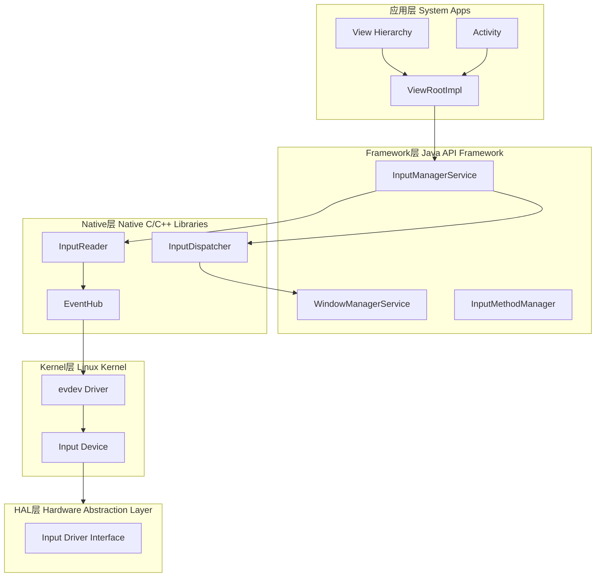
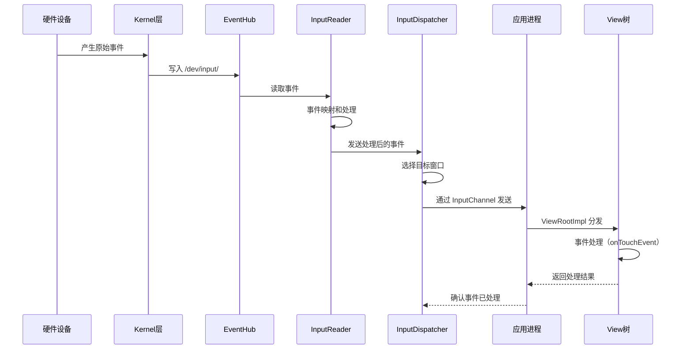
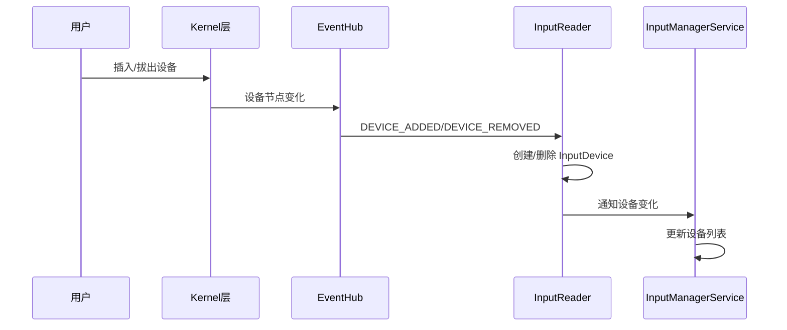
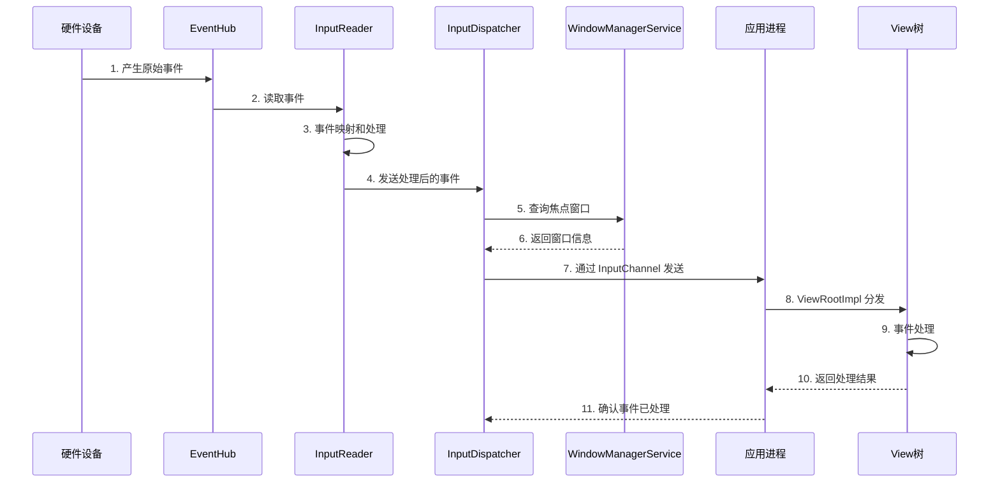

# Input 系统基础篇：Android 输入架构与核心概念

## 📋 概述

Input（输入）系统是 Android 处理用户交互的核心机制，负责处理所有用户输入事件，包括触摸、按键、鼠标、游戏手柄等。理解 Android 输入系统是深入理解 ANR 机制、事件分发、焦点管理、输入法交互等核心功能的基础。本篇将从架构概述、基本概念、层级简介、设备管理和事件流程五个维度，建立对 Android 输入系统的基础认知。

---

## 一、Android 输入系统架构概述

### 1.1 整体架构图

Android 输入系统采用分层架构，从应用层到硬件层，共分为五层：



### 1.2 五层架构详解

| 层级 | 主要组件 | 核心职责 |
| :--- | :--- | :--- |
| **应用层** | View、Activity、ViewRootImpl | 接收输入事件、处理用户交互、事件分发 |
| **Framework层** | InputManagerService、WindowManagerService、InputMethodManager | 输入管理、焦点管理、窗口匹配、输入法协调 |
| **Native层** | InputReader、InputDispatcher、EventHub | 事件读取、事件处理、事件分发、ANR 检测 |
| **HAL层** | Input Driver Interface | 硬件抽象接口 |
| **Kernel层** | evdev Driver、Input Device | 驱动硬件、产生原始输入事件 |

### 1.3 核心组件简介

#### InputManagerService (IMS)
- **位置**：Framework 层，SystemServer 进程
- **作用**：输入系统的核心服务，管理输入设备和输入策略
- **职责**：
  - 输入设备的发现和管理
  - 输入策略的执行（按键拦截等）
  - 与 WindowManagerService 协调焦点管理
  - 与 InputMethodManager 协调输入法

#### InputReader
- **位置**：Native 层，InputReaderThread 线程
- **作用**：读取和处理原始输入事件
- **职责**：
  - 从 EventHub 读取原始事件
  - 事件映射（scan code → key code）
  - 设备配置处理
  - 事件批处理

#### InputDispatcher
- **位置**：Native 层，InputDispatcherThread 线程
- **作用**：分发输入事件到目标窗口
- **职责**：
  - 事件队列管理
  - 窗口匹配和焦点选择
  - 通过 InputChannel 发送事件
  - ANR 检测和处理

#### EventHub
- **位置**：Native 层
- **作用**：监听输入设备，读取原始输入事件
- **职责**：
  - 监听 `/dev/input/` 设备
  - 读取 Linux input_event 结构
  - 处理设备热插拔（DEVICE_ADDED、DEVICE_REMOVED）

#### InputChannel
- **位置**：Framework 层和应用层
- **作用**：应用与系统通信的通道，用于传递输入事件
- **特点**：
  - 每个窗口有一个 InputChannel
  - 基于 Unix Domain Socket
  - 双向通信（系统发送事件，应用返回确认）

---

## 二、输入事件的基本概念

### 2.1 输入事件的类型

Android 支持多种输入事件类型：

| 事件类型 | 说明 | 使用场景 |
| :--- | :--- | :--- |
| **触摸事件（Touch Event）** | 手指触摸屏幕 | 点击、滑动、多指手势 |
| **按键事件（Key Event）** | 物理按键或虚拟键盘 | 返回键、音量键、软键盘输入 |
| **鼠标事件（Mouse Event）** | 鼠标操作 | 鼠标移动、点击、滚轮 |
| **游戏手柄事件（Gamepad Event）** | 游戏手柄操作 | 游戏控制 |
| **触控笔事件（Stylus Event）** | 触控笔操作 | 手写输入、绘图 |

### 2.2 输入事件的数据结构

#### MotionEvent（触摸事件）

```java
// MotionEvent.java (简化)
public class MotionEvent extends InputEvent {
    // 事件动作
    public static final int ACTION_DOWN = 0;        // 手指按下
    public static final int ACTION_UP = 1;          // 手指抬起
    public static final int ACTION_MOVE = 2;        // 手指移动
    public static final int ACTION_CANCEL = 3;      // 事件取消
    public static final int ACTION_POINTER_DOWN = 5; // 多点触控，额外手指按下
    public static final int ACTION_POINTER_UP = 6;   // 多点触控，额外手指抬起
    
    // 获取坐标
    public float getX();           // X 坐标
    public float getY();           // Y 坐标
    public float getX(int pointerIndex);  // 指定手指的 X 坐标
    public float getY(int pointerIndex);  // 指定手指的 Y 坐标
    
    // 历史样本（批处理）
    public int getHistorySize();   // 历史样本数量
    public float getHistoricalX(int pos);  // 历史 X 坐标
    public float getHistoricalY(int pos);  // 历史 Y 坐标
}
```

**MotionEvent 的特点**：
- 支持多点触控（最多 10 个手指）
- 支持历史样本（批处理机制）
- 包含压力、大小等额外信息

#### KeyEvent（按键事件）

```java
// KeyEvent.java (简化)
public class KeyEvent extends InputEvent {
    // 事件动作
    public static final int ACTION_DOWN = 0;    // 按键按下
    public static final int ACTION_UP = 1;      // 按键抬起
    
    // 按键码
    public int getKeyCode();  // 获取按键码（如 KEYCODE_BACK、KEYCODE_VOLUME_UP）
    
    // 元键状态
    public boolean isShiftPressed();   // Shift 键是否按下
    public boolean isCtrlPressed();    // Ctrl 键是否按下
    public boolean isAltPressed();     // Alt 键是否按下
}
```

### 2.3 输入事件的生命周期

输入事件从产生到消费的完整生命周期：



**生命周期阶段**：

1. **产生**：硬件设备产生原始输入信号
2. **驱动**：Kernel 驱动转换为标准 input_event
3. **读取**：EventHub 读取原始事件
4. **处理**：InputReader 映射和处理事件
5. **分发**：InputDispatcher 选择目标窗口并分发
6. **接收**：应用通过 InputChannel 接收事件
7. **处理**：View 树处理事件
8. **确认**：应用确认事件已处理

### 2.4 输入事件的坐标系统

**屏幕坐标系统**：

- **原点**：屏幕左上角为 (0, 0)
- **X 轴**：从左到右递增
- **Y 轴**：从上到下递增
- **单位**：像素（px）

**坐标转换**：

```java
// View 中的坐标转换
public boolean onTouchEvent(MotionEvent event) {
    // 获取屏幕坐标
    float screenX = event.getRawX();
    float screenY = event.getRawY();
    
    // 获取相对于 View 的坐标
    float viewX = event.getX();
    float viewY = event.getY();
    
    // 坐标转换
    int[] location = new int[2];
    getLocationOnScreen(location);
    float relativeX = screenX - location[0];
    float relativeY = screenY - location[1];
}
```

---

## 三、输入系统层级简介

### 3.1 应用层：View、Activity、ViewRootImpl

**View 树的事件分发**：

```java
// View.java (简化)
public boolean dispatchTouchEvent(MotionEvent event) {
    // 1. 检查是否可点击
    if (onTouchEvent(event)) {
        return true;  // 事件已消费
    }
    return false;  // 事件未消费，继续向上传递
}
```

**ViewRootImpl 的作用**：
- 接收 InputDispatcher 发送的输入事件
- 将事件分发给 View 树
- 处理输入事件的确认

### 3.2 Framework 层：InputManagerService、WindowManagerService

**InputManagerService**：
- 管理输入设备
- 执行输入策略
- 协调焦点管理

**WindowManagerService**：
- 创建和管理 InputChannel
- 选择焦点窗口
- 计算窗口触摸区域

### 3.3 Native 层：InputReader、InputDispatcher、EventHub

**EventHub**：
- 监听 `/dev/input/` 设备
- 读取原始输入事件

**InputReader**：
- 处理原始事件
- 事件映射和配置

**InputDispatcher**：
- 分发事件到目标窗口
- 检测 ANR

### 3.4 Kernel 层：Input Driver、evdev

**evdev Driver**：
- Linux 标准输入驱动
- 将硬件信号转换为 input_event

---

## 四、输入设备管理（基础）

### 4.1 输入设备的类型和分类

| 设备类型 | 说明 | 示例 |
| :--- | :--- | :--- |
| **触摸屏（Touchscreen）** | 电容式或电阻式触摸屏 | 手机屏幕 |
| **物理按键（Physical Key）** | 硬件按键 | 电源键、音量键 |
| **虚拟按键（Virtual Key）** | 软件实现的按键 | 导航栏按键 |
| **鼠标（Mouse）** | USB 或蓝牙鼠标 | 外接鼠标 |
| **键盘（Keyboard）** | 物理键盘或虚拟键盘 | USB 键盘、软键盘 |
| **游戏手柄（Gamepad）** | 游戏控制器 | USB 手柄、蓝牙手柄 |
| **触控笔（Stylus）** | 手写笔 | S Pen、Apple Pencil |

### 4.2 设备发现机制（热插拔）

**设备热插拔流程**：



**设备发现的关键点**：
- EventHub 扫描 `/dev/input/` 目录
- 检测设备节点的添加和删除
- 通知 InputReader 处理设备变化

### 4.3 设备配置和映射（简介）

**Key Layout 文件**：
- 映射 Linux scan code 到 Android key code
- 位置：`/system/usr/keylayout/`

**IDC 文件（Input Device Configuration）**：
- 设备特定的配置
- 触摸校准、按键映射等
- 位置：`/system/usr/idc/`

---

## 五、输入事件分发流程（简化版）

### 5.1 完整流程概览



### 5.2 各阶段详解

**阶段 1-2：硬件到 EventHub**
- 硬件产生输入信号
- Kernel 驱动转换为 input_event
- EventHub 读取 `/dev/input/` 设备

**阶段 3-4：InputReader 处理**
- 事件映射（scan code → key code）
- 设备配置应用
- 事件批处理（MotionEvent）

**阶段 5-6：InputDispatcher 选择目标**
- 查询 WindowManagerService 获取焦点窗口
- 根据事件类型选择目标（触摸事件 vs 按键事件）

**阶段 7-8：事件分发到应用**
- 通过 InputChannel 发送事件
- ViewRootImpl 接收并分发到 View 树

**阶段 9-11：应用处理**
- View 树处理事件
- 返回处理结果
- 确认事件已处理

---

## 六、总结

### 6.1 核心概念回顾

1. **输入系统采用五层架构**：应用层、Framework 层、Native 层、HAL 层、Kernel 层
2. **核心组件**：InputManagerService、InputReader、InputDispatcher、EventHub、InputChannel
3. **输入事件类型**：触摸事件、按键事件、鼠标事件等
4. **事件生命周期**：从硬件产生到应用消费的完整流程

### 6.2 架构层次

- **应用层**：接收和处理输入事件
- **Framework 层**：管理输入设备和焦点
- **Native 层**：读取、处理、分发事件
- **Kernel 层**：驱动硬件，产生原始事件

### 6.3 下一步学习

- **进阶篇**：深入各层级的实现细节
- **交互机制**：层级之间的通信方式
- **与其他模块的交互**：输入与窗口、ANR、IME 的关系

---

**提示**：理解输入系统是理解 ANR 机制、事件分发、焦点管理的基础。建议结合实际代码和调试工具（如 `getevent`、`dumpsys input`）来加深理解。
