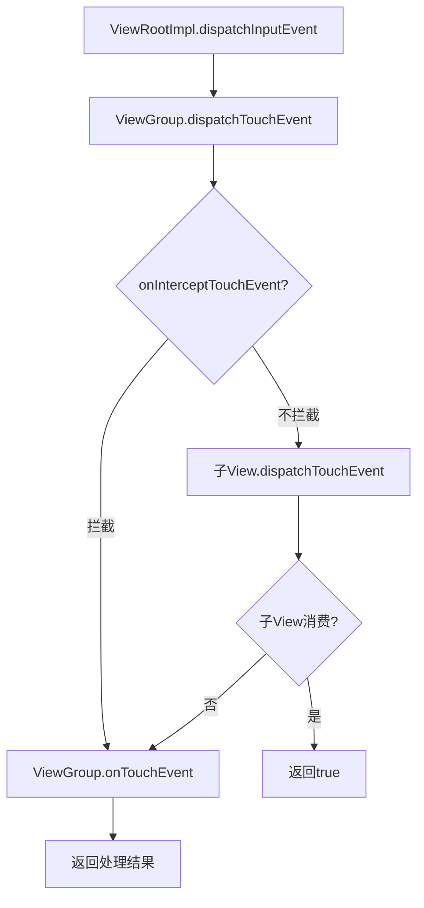
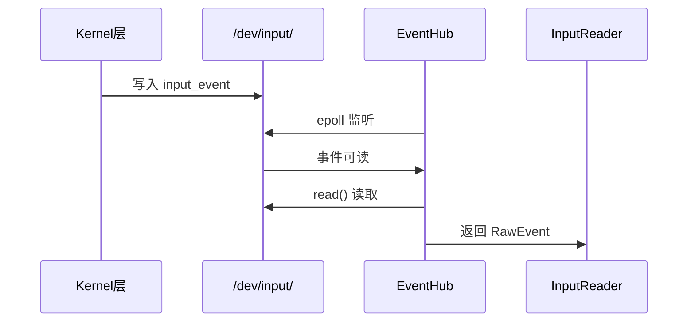
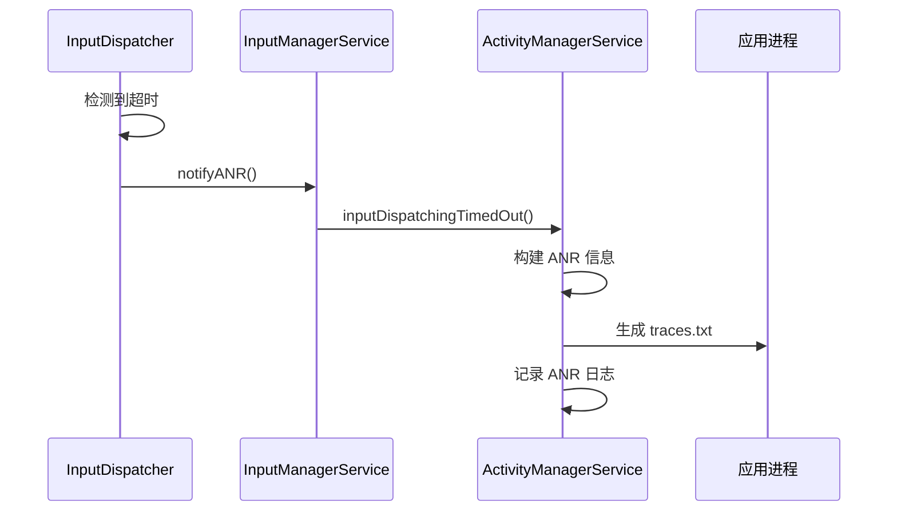
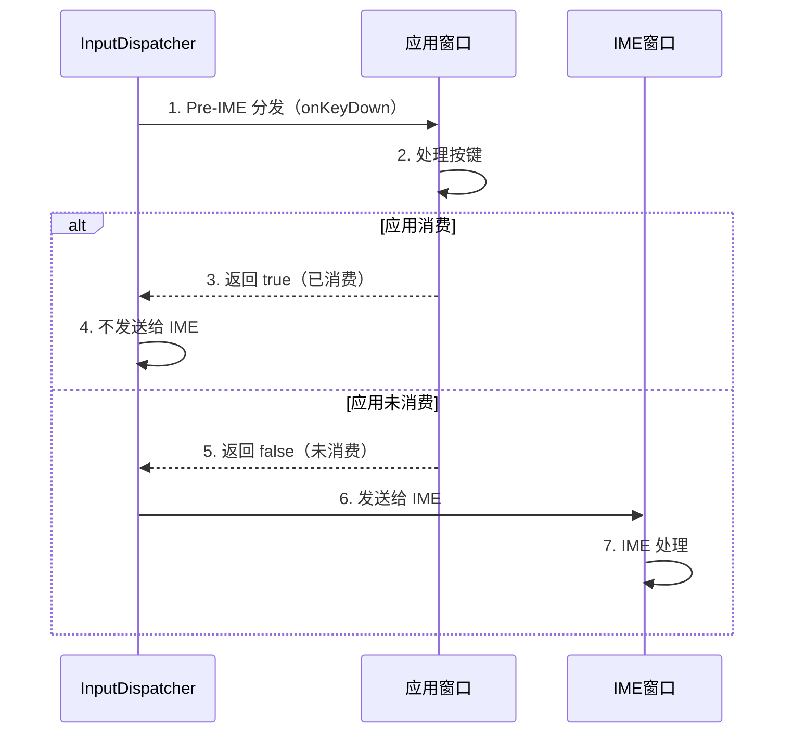
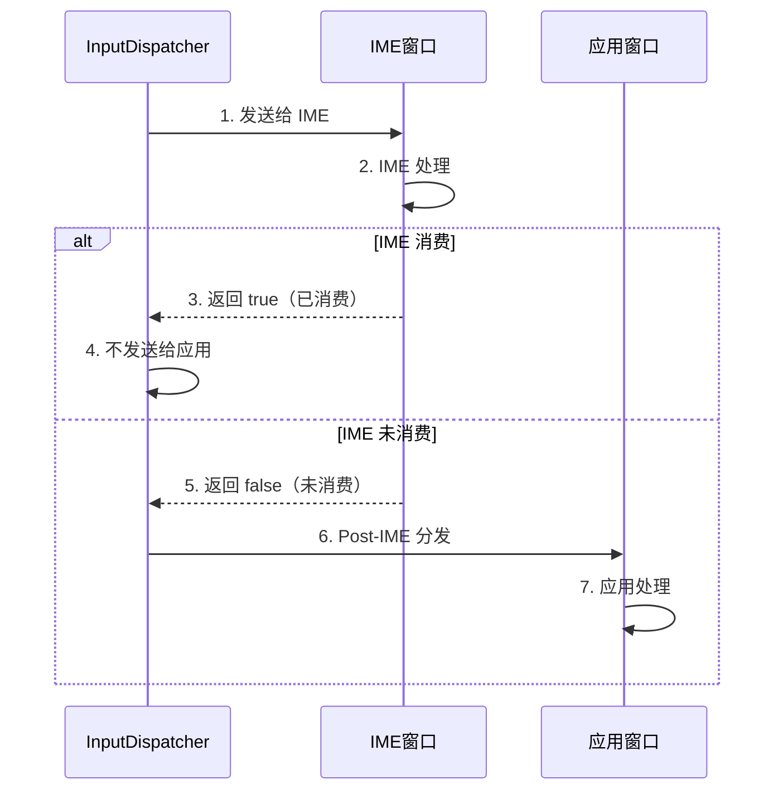

# Input 系统进阶篇：层级详解与交互机制

## 📋 概述

在基础篇中，我们建立了对 Android 输入系统架构的整体认知。本篇将深入各层级的实现细节，详细分析层级之间的交互机制，以及输入与其他系统模块（窗口系统、ANR 机制、输入法、Activity）的协作方式。通过源码级别的分析，帮助读者理解输入系统的内部工作原理。

---

## 一、各层级详解

### 1.1 应用层详解

#### 1.1.1 ViewRootImpl 接收输入事件

**ViewRootImpl 是应用层接收输入事件的入口**。

```java
// ViewRootImpl.java (简化)
public final class ViewRootImpl implements ViewParent {
    private InputChannel mInputChannel;  // 输入通道
    private InputEventReceiver mInputEventReceiver;  // 事件接收器
    
    public void setView(View view, WindowManager.LayoutParams attrs, ...) {
        mView = view;
        
        // 创建 InputChannel
        InputChannel[] inputChannels = InputChannel.openInputChannelPair(getTitle().toString());
        mInputChannel = inputChannels[0];  // 服务端
        InputChannel clientChannel = inputChannels[1];  // 客户端
        
        // 注册到 WindowManagerService
        mWindowSession.addToDisplay(mWindow, ..., clientChannel, ...);
        
        // 创建事件接收器
        mInputEventReceiver = new WindowInputEventReceiver(clientChannel, Looper.myLooper());
    }
    
    // 接收输入事件
    final class WindowInputEventReceiver extends InputEventReceiver {
        @Override
        public void onInputEvent(InputEvent event) {
            // 分发到主线程处理
            enqueueInputEvent(event);
        }
    }
}
```

**关键点**：
- InputChannel 在窗口创建时创建
- InputEventReceiver 在主线程的 Looper 上接收事件
- 事件通过 `enqueueInputEvent()` 进入主线程队列

#### 1.1.2 View 树的事件分发机制

**View 树的事件分发采用责任链模式**。

```java
// ViewGroup.java (简化)
public class ViewGroup extends View {
    @Override
    public boolean dispatchTouchEvent(MotionEvent ev) {
        // 1. 检查是否拦截事件
        boolean intercepted = onInterceptTouchEvent(ev);
        
        if (!intercepted) {
            // 2. 不拦截，分发给子 View
            for (View child : mChildren) {
                if (child.dispatchTouchEvent(ev)) {
                    return true;  // 子 View 消费了事件
                }
            }
        }
        
        // 3. 子 View 未消费，自己处理
        return onTouchEvent(ev);
    }
}
```

**事件分发流程**：



**关键方法**：

| 方法 | 作用 | 返回值 |
| :--- | :--- | :--- |
| `dispatchTouchEvent()`` | 分发事件 | true=事件已消费，false=事件未消费 |
| `onInterceptTouchEvent()` | 拦截事件（仅 ViewGroup） | true=拦截，false=不拦截 |
| `onTouchEvent()` | 处理事件 | true=事件已消费，false=事件未消费 |

#### 1.1.3 Activity 的输入事件处理

**Activity 通过 Window 接收输入事件**。

```java
// Activity.java (简化)
public class Activity {
    @Override
    public boolean dispatchTouchEvent(MotionEvent ev) {
        // Activity 可以拦截事件
        if (ev.getAction() == MotionEvent.ACTION_DOWN) {
            onUserInteraction();  // 用户交互回调
        }
        
        // 分发给 Window
        if (getWindow().superDispatchTouchEvent(ev)) {
            return true;
        }
        
        // Window 未处理，Activity 处理
        return onTouchEvent(ev);
    }
}
```

#### 1.1.4 输入事件的消费机制

**事件消费的判断**：
- 返回 `true`：事件已消费，不再向上传递
- 返回 `false`：事件未消费，继续向上传递

**消费链**：
```
View → ViewGroup → ... → ViewGroup → Activity → Window
```

### 1.2 Framework 层详解

#### 1.2.1 InputManagerService 核心功能

##### 输入设备管理

```java
// InputManagerService.java (简化)
public class InputManagerService extends IInputManager.Stub {
    private final InputManagerHandler mHandler;
    private final NativeInputManager mNative;
    
    // 获取输入设备列表
    @Override
    public InputDevice[] getInputDevices() {
        return mNative.getInputDeviceIds();
    }
    
    // 输入设备变化回调
    private void onInputDeviceChanged(int deviceId) {
        // 通知监听器
        for (InputDeviceListener listener : mInputDeviceListeners) {
            listener.onInputDeviceChanged(deviceId);
        }
    }
}
```

##### 输入策略（interceptKeyBeforeQueueing）

```java
// InputManagerService.java
@Override
public int interceptKeyBeforeQueueing(KeyEvent event, int policyFlags) {
    // 系统级按键拦截
    // 例如：电源键、音量键等
    return WindowManagerPolicy.INTERCEPT_KEY_RESULT_CONTINUE;
}
```

##### 与 WindowManagerService 的协调

```java
// InputManagerService.java
public void setInputWindows(InputWindowHandle[] windowHandles) {
    // 更新窗口信息到 Native 层
    mNative.setInputWindows(windowHandles);
}
```

#### 1.2.2 WindowManagerService 的输入相关功能

##### InputChannel 的创建和管理

```java
// WindowManagerService.java (简化)
public int addWindow(Session session, IWindow client, ...) {
    WindowState win = new WindowState(...);
    
    // 创建 InputChannel
    InputChannel[] inputChannels = InputChannel.openInputChannelPair(win.getName());
    win.mInputChannel = inputChannels[0];  // 服务端
    InputChannel clientChannel = inputChannels[1];  // 客户端
    
    // 注册到 InputManagerService
    mInputManager.registerInputChannel(win.mInputChannel, win.mInputWindowHandle);
    
    // 返回客户端 InputChannel
    outInputChannel = clientChannel;
}
```

**InputChannel 的作用**：
- 建立窗口与输入系统的连接
- 基于 Unix Domain Socket
- 双向通信（系统发送事件，应用返回确认）

##### 焦点窗口的选择和管理

```java
// WindowManagerService.java
void updateFocusedWindowLocked(int mode, boolean updateInputWindows) {
    // 查找焦点窗口
    WindowState newFocus = findFocusedWindowLocked();
    
    if (newFocus != mCurrentFocus) {
        // 焦点窗口变化
        mCurrentFocus = newFocus;
        
        // 更新输入焦点
        mInputMonitor.setInputFocusLw(newFocus, updateInputWindows);
    }
}

WindowState findFocusedWindowLocked() {
    // 1. 查找可见且可接收按键的窗口
    // 2. 优先选择前台应用的窗口
    // 3. 考虑窗口类型和层级
    return focusedWindow;
}
```

##### 窗口的触摸区域计算

```java
// WindowState.java
void updateTouchableRegion() {
    Rect touchableRegion = new Rect();
    
    // 计算窗口的可触摸区域
    // 考虑窗口大小、裁剪区域、系统 UI 等
    mTouchableRegion.set(touchableRegion);
    
    // 更新到 InputWindowHandle
    mInputWindowHandle.touchableRegion.set(touchableRegion);
}
```

##### 多显示器下的输入路由

```java
// WindowManagerService.java
void updateInputWindowsLw(boolean force) {
    // 为每个显示器更新输入窗口
    for (DisplayContent display : mDisplays) {
        List<InputWindowHandle> windowHandles = new ArrayList<>();
        
        // 收集该显示器上的所有窗口
        for (WindowState w : display.getWindows()) {
            if (w.canReceiveInput()) {
                windowHandles.add(w.mInputWindowHandle);
            }
        }
        
        // 更新到 InputManagerService
        mInputManager.setInputWindows(display.getDisplayId(), windowHandles);
    }
}
```

### 1.3 Native 层详解

#### 1.3.1 EventHub：监听输入设备

##### 监听 /dev/input/ 设备

```cpp
// EventHub.cpp (简化)
EventHub::EventHub() {
    // 打开 /dev/input 目录
    mINotifyFd = inotify_init();
    inotify_add_watch(mINotifyFd, DEVICE_PATH, IN_CREATE | IN_DELETE);
    
    // 扫描现有设备
    scanDevicesLocked();
}

void EventHub::scanDevicesLocked() {
    // 扫描 /dev/input/ 目录
    DIR* dir = opendir(DEVICE_PATH);
    while ((entry = readdir(dir)) != nullptr) {
        if (entry->d_name[0] != '.') {
            // 打开设备
            openDeviceLocked(entry->d_name);
        }
    }
}
```

##### 读取原始输入事件

```cpp
// EventHub.cpp
size_t EventHub::getEvents(int timeoutMillis, RawEvent* buffer, size_t bufferSize) {
    // 使用 epoll 监听设备
    int pollResult = epoll_wait(mEpollFd, mPendingEventItems, EPOLL_MAX_EVENTS, timeoutMillis);
    
    for (int i = 0; i < pollResult; i++) {
        if (mPendingEventItems[i].events & EPOLLIN) {
            // 读取 input_event
            struct input_event iev;
            read(mPendingEventItems[i].data.fd, &iev, sizeof(iev));
            
            // 转换为 RawEvent
            buffer[count].when = iev.time;
            buffer[count].deviceId = deviceId;
            buffer[count].type = iev.type;
            buffer[count].code = iev.code;
            buffer[count].value = iev.value;
            count++;
        }
    }
    
    return count;
}
```

##### 设备热插拔处理

```cpp
// EventHub.cpp
void EventHub::handleDeviceAdded(const char* devicePath) {
    // 打开设备
    int deviceId = openDeviceLocked(devicePath);
    
    // 通知 InputReader
    RawEvent event;
    event.type = DEVICE_ADDED;
    event.deviceId = deviceId;
    // 发送到 InputReader
}

void EventHub::handleDeviceRemoved(int deviceId) {
    // 关闭设备
    closeDeviceLocked(deviceId);
    
    // 通知 InputReader
    RawEvent event;
    event.type = DEVICE_REMOVED;
    event.deviceId = deviceId;
    // 发送到 InputReader
}
```

#### 1.3.2 InputReader：处理输入事件

##### 事件映射（scan code → key code）

```cpp
// InputReader.cpp
void InputReader::processEventsLocked(const RawEvent* rawEvents, size_t count) {
    for (size_t i = 0; i < count; i++) {
        const RawEvent* rawEvent = &rawEvents[i];
        
        // 查找设备
        InputDevice* device = getDeviceLocked(rawEvent->deviceId);
        
        // 处理事件
        device->process(rawEvent);
    }
}

// KeyboardInputMapper.cpp
void KeyboardInputMapper::processKey(nsecs_t when, int32_t deviceId, 
        int32_t scanCode, int32_t usageCode, bool down, int32_t repeatCount) {
    // 映射 scan code 到 key code
    int32_t keyCode = mKeyMap->mapKey(scanCode, usageCode);
    
    // 创建 KeyEvent
    KeyEvent event;
    event.initialize(deviceId, AINPUT_SOURCE_KEYBOARD, 
                     down ? AKEY_EVENT_ACTION_DOWN : AKEY_EVENT_ACTION_UP,
                     keyCode, scanCode, ...);
    
    // 发送到 InputDispatcher
    getListener()->notifyKey(&event);
}
```

##### 设备配置处理

```cpp
// InputReader.cpp
void InputReader::addDeviceLocked(nsecs_t when, int32_t deviceId) {
    // 读取设备信息
    InputDeviceIdentifier identifier;
    getDeviceIdentifier(deviceId, &identifier);
    
    // 加载 Key Layout 文件
    KeyMap keyMap;
    keyMap.load(identifier);
    
    // 加载 IDC 文件
    InputDeviceConfigurationFile config;
    config.load(identifier);
    
    // 创建 InputDevice
    InputDevice* device = new InputDevice(deviceId, identifier, keyMap, config);
    mDevices.add(deviceId, device);
}
```

##### 事件批处理（MotionEvent batching）

```cpp
// TouchInputMapper.cpp
void TouchInputMapper::process(const RawEvent* rawEvent) {
    // 收集触摸样本
    TouchSample sample;
    sample.x = rawEvent->x;
    sample.y = rawEvent->y;
    sample.time = rawEvent->when;
    
    mSamples.push_back(sample);
    
    // 检查是否需要立即发送
    if (shouldSendBatch()) {
        // 创建批处理的 MotionEvent
        MotionEvent* event = createMotionEvent();
        event->addBatch(mSamples);
        
        // 发送到 InputDispatcher
        getListener()->notifyMotion(event);
        
        mSamples.clear();
    }
}
```

**批处理的优势**：
- 减少事件数量，降低系统开销
- 提高滑动流畅度
- 支持历史样本（historical samples）

#### 1.3.3 InputDispatcher：分发输入事件

##### 事件队列管理

```cpp
// InputDispatcher.cpp
class InputDispatcher {
    // 待分发队列
    Queue<EventEntry> mInboundQueue;
    
    // 等待确认的队列（用于 ANR 检测）
    Queue<DispatchEntry> mWaitQueue;
    
    void enqueueInboundEventLocked(EventEntry* entry) {
        mInboundQueue.enqueueAtTail(entry);
        // 唤醒分发线程
        mLooper->wake();
    }
};
```

##### 窗口匹配和焦点选择

```cpp
// InputDispatcher.cpp
sp<InputWindowHandle> InputDispatcher::findTouchedWindowAtLocked(
        int32_t displayId, float x, float y) {
    // 从后往前遍历窗口（Z-order 从高到低）
    for (size_t i = mWindowHandles.size(); i > 0; i--) {
        sp<InputWindowHandle> windowHandle = mWindowHandles[i - 1];
        
        // 检查窗口是否可见
        if (!windowHandle->getInfo()->visible) {
            continue;
        }
        
        // 检查触摸点是否在窗口内
        if (windowHandle->getInfo()->touchableRegion.contains(x, y)) {
            return windowHandle;
        }
    }
    
    return nullptr;
}

sp<InputWindowHandle> InputDispatcher::findFocusedWindowLocked() {
    // 查找有焦点的窗口
    for (size_t i = 0; i < mWindowHandles.size(); i++) {
        sp<InputWindowHandle> windowHandle = mWindowHandles[i];
        if (windowHandle->getInfo()->hasFocus) {
            return windowHandle;
        }
    }
    return nullptr;
}
```

##### 通过 InputChannel 发送事件

```cpp
// InputDispatcher.cpp
status_t InputDispatcher::publishMotionEvent(Connection* connection,
        const DispatchEntry* dispatchEntry) {
    // 获取事件
    const MotionEntry* motionEntry = static_cast<const MotionEntry*>(dispatchEntry->eventEntry);
    
    // 创建 MotionEvent
    MotionEvent event;
    event.initialize(motionEntry->deviceId, motionEntry->source, 
                     motionEntry->action, ...);
    
    // 通过 InputChannel 发送
    status_t status = connection->inputChannel->sendMessage(&msg);
    
    if (status == OK) {
        // 添加到等待队列（用于 ANR 检测）
        connection->outboundQueue.enqueueAtTail(dispatchEntry);
        connection->waitQueue.enqueueAtTail(dispatchEntry);
    }
    
    return status;
}
```

##### 事件合并（coalescing）- 3ms 阈值

```cpp
// InputDispatcher.cpp
void InputDispatcher::coalesceMotionEventLocked(MotionEntry* motionEntry) {
    // 查找队列中相同设备的最后一个 MotionEntry
    MotionEntry* lastMotionEntry = findLastMotionEntryLocked(motionEntry->deviceId);
    
    if (lastMotionEntry != nullptr) {
        // 计算时间差
        nsecs_t timeDelta = motionEntry->eventTime - lastMotionEntry->eventTime;
        
        // 如果时间差 < 3ms，合并事件
        if (timeDelta < MOTION_SAMPLE_COALESCE_INTERVAL) {
            // 更新最后一个样本，而不是添加新样本
            lastMotionEntry->updateSample(motionEntry);
            return;
        }
    }
    
    // 时间差 >= 3ms，添加新样本
    mInboundQueue.enqueueAtTail(motionEntry);
}
```

**合并机制**：
- **阈值**：3ms（`MOTION_SAMPLE_COALESCE_INTERVAL`）
- **效果**：减少事件数量，降低系统开销
- **影响**：可能略微增加延迟，但通常可忽略

##### ANR 检测机制

```cpp
// InputDispatcher.cpp
void InputDispatcher::dispatchOnceInnerLocked(nsecs_t* nextWakeupTime) {
    // 检查等待队列中的超时事件
    nsecs_t currentTime = now();
    
    // 查找最早的事件
    DispatchEntry* oldestEntry = findOldestEntryLocked();
    if (oldestEntry != nullptr) {
        nsecs_t timeoutTime = oldestEntry->timeoutTime;
        
        if (currentTime >= timeoutTime) {
            // 超时，触发 ANR
            onAnrLocked(oldestEntry->connection);
            return;
        }
        
        // 计算下次唤醒时间
        *nextWakeupTime = timeoutTime;
    }
}

void InputDispatcher::onAnrLocked(Connection* connection) {
    // 构建 ANR 消息
    String8 reason = String8::format(
        "Input dispatching timed out (Waiting because %s is not responding)",
        connection->getWindowName());
    
    // 通知 InputManagerService
    mPolicy->notifyANR(connection->inputWindowHandle, reason);
}
```

---

## 二、层级之间的交互

### 2.1 Kernel 层 ↔ Native 层

#### 2.1.1 EventHub 读取 /dev/input/ 设备

**交互流程**：



**关键点**：
- 使用 `epoll` 高效监听多个设备
- 读取标准的 `input_event` 结构
- 转换为 Android 的 `RawEvent` 结构

#### 2.1.2 原始事件转换为 Android 事件

```cpp
// EventHub.cpp
void EventHub::convertRawEventToAndroidEvent(const struct input_event& rawEvent,
        RawEvent* androidEvent) {
    androidEvent->when = rawEvent.time.tv_sec * 1000000000LL + rawEvent.time.tv_usec * 1000;
    androidEvent->deviceId = mDeviceId;
    androidEvent->type = rawEvent.type;
    androidEvent->code = rawEvent.code;
    androidEvent->value = rawEvent.value;
}
```

#### 2.1.3 设备热插拔事件的处理

```cpp
// EventHub.cpp
void EventHub::handleDeviceChange() {
    // 使用 inotify 监听设备目录变化
    struct inotify_event* event = (struct inotify_event*)buffer;
    
    if (event->mask & IN_CREATE) {
        // 设备添加
        handleDeviceAdded(event->name);
    } else if (event->mask & IN_DELETE) {
        // 设备移除
        handleDeviceRemoved(event->name);
    }
}
```

### 2.2 Native 层 ↔ Framework 层

#### 2.2.1 InputDispatcher 与 InputManagerService 的交互

**交互方式**：通过 JNI 和回调接口

```cpp
// NativeInputManager.cpp
class NativeInputManager : public InputDispatcherPolicyInterface {
    // 策略回调：拦截按键
    virtual nsecs_t interceptKeyBeforeQueueing(const KeyEvent* keyEvent,
            uint32_t& policyFlags) {
        // 调用 Java 层的 InputManagerService
        return mServiceObj->callLongMethod(
            gServiceClassInfo.interceptKeyBeforeQueueing,
            keyEvent, policyFlags);
    }
    
    // 通知 ANR
    virtual void notifyANR(const sp<InputApplicationHandle>& inputApplicationHandle,
            const sp<InputWindowHandle>& inputWindowHandle) {
        // 调用 Java 层的 InputManagerService
        mServiceObj->callVoidMethod(
            gServiceClassInfo.notifyANR,
            inputApplicationHandle, inputWindowHandle);
    }
};
```

#### 2.2.2 窗口信息同步

```java
// InputManagerService.java
public void setInputWindows(InputWindowHandle[] windowHandles) {
    // 更新窗口信息到 Native 层
    nativeSetInputWindows(mPtr, windowHandles);
}
```

```cpp
// android_view_InputManager.cpp
static void nativeSetInputWindows(JNIEnv* env, jclass clazz,
        jlong ptr, jobjectArray windowHandleObjArray) {
    NativeInputManager* im = reinterpret_cast<NativeInputManager*>(ptr);
    
    // 转换 Java 对象为 Native 对象
    std::vector<sp<InputWindowHandle>> windowHandles;
    for (int i = 0; i < len; i++) {
        jobject windowHandleObj = env->GetObjectArrayElement(windowHandleObjArray, i);
        sp<InputWindowHandle> windowHandle = getInputWindowHandle(env, windowHandleObj);
        windowHandles.push_back(windowHandle);
    }
    
    // 更新到 InputDispatcher
    im->getInputManager()->getDispatcher()->setInputWindows(windowHandles);
}
```

#### 2.2.3 设备状态同步

```java
// InputManagerService.java
private void onInputDeviceChanged(int deviceId) {
    // 通知 Java 层监听器
    for (InputDeviceListener listener : mInputDeviceListeners) {
        listener.onInputDeviceChanged(deviceId);
    }
}
```

### 2.3 Framework 层 ↔ 应用层

#### 2.3.1 InputChannel 的创建和注册

**创建流程**：

```java
// InputChannel.java
public static InputChannel[] openInputChannelPair(String name) {
    // 创建一对 InputChannel（服务端和客户端）
    return nativeOpenInputChannelPair(name);
}
```

```cpp
// android_view_InputChannel.cpp
static jobjectArray nativeOpenInputChannelPair(JNIEnv* env, jclass clazz, jstring nameStr) {
    // 创建 Unix Domain Socket 对
    int sockets[2];
    socketpair(AF_UNIX, SOCK_SEQPACKET, 0, sockets);
    
    // 创建服务端和客户端 InputChannel
    sp<InputChannel> serverChannel = new InputChannel(name, sockets[0]);
    sp<InputChannel> clientChannel = new InputChannel(name, sockets[1]);
    
    // 返回 Java 对象数组
    return channels;
}
```

#### 2.3.2 输入事件通过 InputChannel 传递

**发送事件**：

```cpp
// InputChannel.cpp
status_t InputChannel::sendMessage(const InputMessage* msg) {
    // 通过 socket 发送消息
    ssize_t nWrite = ::send(mFd, msg, sizeof(InputMessage), MSG_DONTWAIT);
    return nWrite == sizeof(InputMessage) ? OK : -errno;
}
```

**接收事件**：

```java
// InputEventReceiver.java
public InputEvent receiveInputEvent() {
    // 从 socket 接收消息
    InputMessage msg = nativeReceiveMessage(mReceiverPtr, mInputChannel);
    
    // 转换为 Java InputEvent
    return InputEvent.fromMessage(msg);
}
```

#### 2.3.3 ViewRootImpl 接收和分发事件

```java
// ViewRootImpl.java
final class WindowInputEventReceiver extends InputEventReceiver {
    @Override
    public void onInputEvent(InputEvent event) {
        // 分发到主线程
        enqueueInputEvent(event, this, 0, true);
    }
}

void enqueueInputEvent(InputEvent event, InputEventReceiver receiver,
        int flags, boolean processImmediately) {
    QueuedInputEvent q = obtainQueuedInputEvent(event, receiver, flags);
    
    QueuedInputEvent last = mPendingInputEventTail;
    if (last == null) {
        mPendingInputEventHead = q;
        mPendingInputEventTail = q;
    } else {
        last.mNext = q;
        mPendingInputEventTail = q;
    }
    
    if (processImmediately) {
        doProcessInputEvents();
    }
}

void doProcessInputEvents() {
    while (mPendingInputEventHead != null) {
        QueuedInputEvent q = mPendingInputEventHead;
        mPendingInputEventHead = q.mNext;
        
        // 分发事件
        deliverInputEvent(q);
    }
}

private void deliverInputEvent(QueuedInputEvent q) {
    // 分发给 View 树
    if (q.mEvent instanceof MotionEvent) {
        mView.dispatchPointerEvent((MotionEvent) q.mEvent);
    } else if (q.mEvent instanceof KeyEvent) {
        mView.dispatchKeyEvent((KeyEvent) q.mEvent);
    }
    
    // 确认事件已处理
    finishInputEvent(q, true);
}
```

---

## 三、输入与其他模块的交互

### 3.1 输入与窗口系统

#### 3.1.1 InputChannel 的创建时机

**InputChannel 在窗口创建时创建**：

```java
// WindowManagerService.java
public int addWindow(Session session, IWindow client, ...) {
    WindowState win = new WindowState(...);
    
    // 创建 InputChannel
    InputChannel[] inputChannels = InputChannel.openInputChannelPair(win.getName());
    win.mInputChannel = inputChannels[0];  // 服务端
    InputChannel clientChannel = inputChannels[1];  // 客户端
    
    // 注册到 InputManagerService
    mInputManager.registerInputChannel(win.mInputChannel, win.mInputWindowHandle);
    
    // 返回客户端 InputChannel 给应用
    outInputChannel = clientChannel;
}
```

#### 3.1.2 窗口焦点与输入事件的关系

**焦点窗口优先接收按键事件**：

```cpp
// InputDispatcher.cpp
void InputDispatcher::dispatchKeyLocked(nsecs_t currentTime, KeyEntry* entry) {
    // 按键事件需要焦点窗口
    sp<InputWindowHandle> focusedWindow = findFocusedWindowLocked();
    
    if (focusedWindow == nullptr) {
        // 没有焦点窗口，触发 No Focus Window ANR
        onNoFocusWindowAnrLocked();
        return;
    }
    
    // 发送到焦点窗口
    dispatchEventToWindowLocked(focusedWindow, entry);
}
```

**触摸事件根据触摸位置选择窗口**：

```cpp
// InputDispatcher.cpp
void InputDispatcher::dispatchMotionLocked(nsecs_t currentTime, MotionEntry* entry) {
    // 触摸事件根据坐标选择窗口
    float x = entry->pointerCoords[0].getX();
    float y = entry->pointerCoords[0].getY();
    
    sp<InputWindowHandle> touchedWindow = findTouchedWindowAtLocked(displayId, x, y);
    
    if (touchedWindow != nullptr) {
        // 发送到触摸窗口
        dispatchEventToWindowLocked(touchedWindow, entry);
    }
}
```

#### 3.1.3 窗口触摸区域的计算

```java
// WindowState.java
void updateTouchableRegion() {
    Rect touchableRegion = new Rect();
    
    // 1. 窗口的可见区域
    touchableRegion.set(mFrame);
    
    // 2. 减去被其他窗口遮挡的区域
    // 3. 减去系统 UI 区域（状态栏、导航栏）
    // 4. 应用窗口的裁剪区域
    
    // 更新到 InputWindowHandle
    mInputWindowHandle.touchableRegion.set(touchableRegion);
}
```

#### 3.1.4 多显示器下的输入路由

```java
// WindowManagerService.java
void updateInputWindowsLw(boolean force) {
    // 为每个显示器更新输入窗口
    for (DisplayContent display : mDisplays) {
        List<InputWindowHandle> windowHandles = new ArrayList<>();
        
        // 收集该显示器上的所有窗口
        for (WindowState w : display.getWindows()) {
            if (w.canReceiveInput()) {
                // 设置窗口所属的显示器
                w.mInputWindowHandle.displayId = display.getDisplayId();
                windowHandles.add(w.mInputWindowHandle);
            }
        }
        
        // 更新到 InputManagerService
        mInputManager.setInputWindows(display.getDisplayId(), windowHandles);
    }
}
```

**多显示器输入路由的关键点**：
- 每个显示器有独立的窗口列表
- 输入设备可以关联到特定显示器
- 触摸事件根据设备关联的显示器路由

### 3.2 输入与 ANR 机制

#### 3.2.1 Input ANR 的分类

**Input ANR 分为两类**：

| ANR 类型 | 触发条件 | 超时时间 | 说明 |
| :--- | :--- | :--- | :--- |
| **Input Dispatch Timeout ANR** | 应用主线程无法在 5 秒内处理输入事件 | 5 秒 | 最常见，主线程阻塞导致 |
| **No Focus Window ANR** | 有焦点应用但无焦点窗口，按键事件无法分发 | 5 秒 | 较少见，窗口创建延迟或焦点丢失导致 |

#### 3.2.2 Input ANR 的监控机制

##### InputDispatcher 的超时检测（waitQueue 监控）

```cpp
// InputDispatcher.cpp
class InputDispatcher {
    // 等待确认的队列
    Queue<DispatchEntry> mWaitQueue;
    
    void dispatchOnceInnerLocked(nsecs_t* nextWakeupTime) {
        // 检查等待队列
        nsecs_t currentTime = now();
        DispatchEntry* oldestEntry = findOldestEntryLocked();
        
        if (oldestEntry != nullptr) {
            nsecs_t timeoutTime = oldestEntry->timeoutTime;
            
            if (currentTime >= timeoutTime) {
                // 超时，触发 ANR
                onAnrLocked(oldestEntry->connection);
                return;
            }
            
            // 计算下次检查时间
            *nextWakeupTime = timeoutTime;
        }
    }
    
    DispatchEntry* findOldestEntryLocked() {
        // 查找等待队列中最早的事件
        DispatchEntry* oldest = nullptr;
        for (Connection* connection : mConnectionsByFd) {
            if (!connection->waitQueue.isEmpty()) {
                DispatchEntry* entry = connection->waitQueue.head;
                if (oldest == nullptr || entry->timeoutTime < oldest->timeoutTime) {
                    oldest = entry;
                }
            }
        }
        return oldest;
    }
};
```

##### AnrTracker 的作用

```cpp
// InputDispatcher.cpp
class AnrTracker {
    // 跟踪最早的超时时间
    nsecs_t mFirstTimeout;
    
    void addTimeout(nsecs_t timeoutTime) {
        if (mFirstTimeout == 0 || timeoutTime < mFirstTimeout) {
            mFirstTimeout = timeoutTime;
        }
    }
    
    nsecs_t getFirstTimeout() {
        return mFirstTimeout;
    }
};
```

**AnrTracker 的优势**：
- 高效跟踪多个连接的超时时间
- 只关注最早的超时时间
- 减少超时检查的开销

##### 超时时间的计算

```cpp
// InputDispatcher.cpp
nsecs_t InputDispatcher::getDispatchingTimeoutLocked(
        const sp<InputWindowHandle>& windowHandle) {
    // 1. 使用窗口指定的超时时间
    if (windowHandle != nullptr && windowHandle->getDispatchingTimeout() > 0) {
        return windowHandle->getDispatchingTimeout();
    }
    
    // 2. 使用默认超时时间（5秒）
    return DEFAULT_INPUT_DISPATCHING_TIMEOUT_NANOS;
}

void InputDispatcher::dispatchEventToConnectionLocked(
        Connection* connection, DispatchEntry* dispatchEntry) {
    // 计算超时时间
    nsecs_t timeoutTime = now() + getDispatchingTimeoutLocked(connection->inputWindowHandle);
    dispatchEntry->timeoutTime = timeoutTime;
    
    // 添加到等待队列
    connection->waitQueue.enqueueAtTail(dispatchEntry);
    
    // 更新 AnrTracker
    mAnrTracker.addTimeout(timeoutTime);
}
```

#### 3.2.3 Input ANR 的触发条件

##### Input Dispatch Timeout ANR

**触发条件**：
1. InputDispatcher 发送输入事件到应用
2. 应用的主线程在 5 秒内没有处理完该事件
3. InputDispatcher 检测到超时

**常见原因**：
- 主线程阻塞（死锁、等待锁、IO 阻塞）
- 主线程执行耗时操作（复杂计算、文件 IO、网络请求）
- 主线程等待其他线程

##### No Focus Window ANR

**触发条件**：
1. 有焦点应用（Activity 在前台）
2. 但该应用没有焦点窗口（窗口未创建或不可见）
3. 按键事件无法分发，等待超时（5 秒）

**常见原因**：
- Activity 启动时窗口创建延迟
- 窗口被设置为不可聚焦（FLAG_NOT_FOCUSABLE）
- 窗口被其他窗口完全遮挡
- 窗口销毁但应用仍在前台

```cpp
// InputDispatcher.cpp
void InputDispatcher::onNoFocusWindowAnrLocked() {
    // 构建 ANR 消息
    String8 reason = String8::format(
        "No focus window, but keys are being sent to it. "
        "Make sure the input method is started and connected, "
        "and that the current activity has a window with input focus.");
    
    // 通知 InputManagerService
    mPolicy->notifyANR(nullptr, reason);
}
```

#### 3.2.4 ANR 的处理流程



**ANR 处理流程**：

1. **InputDispatcher 检测超时**
   ```cpp
   void InputDispatcher::onAnrLocked(Connection* connection) {
       mPolicy->notifyANR(connection->inputWindowHandle, reason);
   }
   ```

2. **InputManagerService 处理**
   ```java
   // InputManagerService.java
   private void notifyANR(InputApplicationHandle inputApplicationHandle,
           InputWindowHandle inputWindowHandle, String reason) {
       // 通知 ActivityManagerService
       mService.inputDispatchingTimedOut(
           inputApplicationHandle, inputWindowHandle, reason);
   }
   ```

3. **ActivityManagerService 处理**
   ```java
   // ActivityManagerService.java
   void inputDispatchingTimedOut(ProcessRecord proc, boolean aboveSystem, String reason) {
       // 生成 ANR 信息
       String anrMessage = "Input dispatching timed out";
       if (reason != null) {
           anrMessage += " (" + reason + ")";
       }
       
       // 触发 ANR
       mAnrHelper.appNotResponding(proc, anrMessage);
   }
   ```

### 3.3 输入焦点管理

#### 3.3.1 焦点窗口的切换机制

##### WindowManagerService.updateFocusedWindowLocked() 的作用

```java
// WindowManagerService.java
boolean updateFocusedWindowLocked(int mode, boolean updateInputWindows) {
    // 查找新的焦点窗口
    WindowState newFocus = findFocusedWindowLocked();
    
    if (newFocus != mCurrentFocus) {
        // 焦点窗口变化
        WindowState oldFocus = mCurrentFocus;
        mCurrentFocus = newFocus;
        
        // 更新输入焦点
        if (updateInputWindows) {
            mInputMonitor.setInputFocusLw(newFocus, true);
        }
        
        // 通知窗口焦点变化
        if (oldFocus != null) {
            oldFocus.onWindowFocusChanged(false);
        }
        if (newFocus != null) {
            newFocus.onWindowFocusChanged(true);
        }
        
        return true;  // 焦点已变化
    }
    
    return false;  // 焦点未变化
}
```

##### InputMonitor.setInputFocusLw() 的实现

```java
// InputMonitor.java
void setInputFocusLw(WindowState newWindow, boolean updateInputWindows) {
    WindowState oldWindow = mInputFocus;
    
    if (newWindow == oldWindow) {
        return;  // 焦点未变化
    }
    
    // 更新焦点窗口
    mInputFocus = newWindow;
    
    // 更新 InputWindowHandle 的焦点标志
    if (oldWindow != null) {
        oldWindow.mInputWindowHandle.hasFocus = false;
    }
    if (newWindow != null) {
        newWindow.mInputWindowHandle.hasFocus = true;
    }
    
    // 更新输入窗口信息
    if (updateInputWindows) {
        updateInputWindowsLw(false);
    }
}
```

##### 焦点窗口的选择条件

```java
// DisplayContent.java
WindowState findFocusedWindowIfNeeded() {
    // 1. 查找可见且可接收按键的窗口
    for (WindowState w : mWindows) {
        if (w.canReceiveKeys()) {
            // 2. 检查窗口是否属于前台应用
            if (w.mToken != null && w.mToken.appToken != null) {
                if (w.mToken.appToken.isClientVisible()) {
                    // 3. 排除启动窗口
                    if (w.mAttrs.type != TYPE_APPLICATION_STARTING) {
                        return w;
                    }
                }
            }
        }
    }
    
    return null;
}

boolean WindowState.canReceiveKeys() {
    // 窗口必须可见
    if (!mVisible) {
        return false;
    }
    
    // 窗口必须可聚焦
    if ((mAttrs.flags & FLAG_NOT_FOCUSABLE) != 0) {
        return false;
    }
    
    // 窗口的 Token 不能是暂停状态
    if (mToken != null && mToken.paused) {
        return false;
    }
    
    return true;
}
```

##### 焦点窗口切换的时机

**焦点窗口在以下情况下会切换**：

1. **窗口添加**：新窗口获得焦点
   ```java
   // WindowManagerService.addWindow()
   performLayoutAndPlaceSurfacesLocked();
   // 内部会调用 updateFocusedWindowLocked()
   ```

2. **窗口删除**：焦点窗口被删除，选择新的焦点窗口
   ```java
   // WindowManagerService.removeWindow()
   performLayoutAndPlaceSurfacesLocked();
   ```

3. **窗口显示/隐藏**：窗口可见性变化
   ```java
   // WindowState.show()
   // WindowState.hide()
   performLayoutAndPlaceSurfacesLocked();
   ```

4. **Activity 生命周期**：Activity onResume/onPause
   ```java
   // ActivityThread.handleResumeActivity()
   // 窗口变为可见，可能获得焦点
   ```

##### DisplayContent.findFocusedWindowIfNeeded() 的算法

```java
// DisplayContent.java
WindowState findFocusedWindowIfNeeded() {
    // 1. 获取前台应用
    AppWindowToken focusedApp = getFocusedAppToken();
    if (focusedApp == null) {
        return null;
    }
    
    // 2. 查找该应用的焦点窗口
    for (WindowState w : focusedApp.allAppWindows) {
        if (w.canReceiveKeys() && w.isVisible()) {
            // 排除启动窗口
            if (w.mAttrs.type != TYPE_APPLICATION_STARTING) {
                return w;
            }
        }
    }
    
    // 3. 如果没有找到，查找系统窗口（如 IME）
    for (WindowState w : mWindows) {
        if (w.canReceiveKeys() && w.isVisible()) {
            if (w.mAttrs.type == TYPE_INPUT_METHOD) {
                return w;
            }
        }
    }
    
    return null;
}
```

#### 3.3.2 焦点应用的切换时机

##### InputMonitor.setFocusedAppLw() 的作用

```java
// InputMonitor.java
void setFocusedAppLw(AppWindowToken newApp) {
    AppWindowToken oldApp = mFocusedApp;
    
    if (newApp == oldApp) {
        return;  // 焦点应用未变化
    }
    
    // 更新焦点应用
    mFocusedApp = newApp;
    
    // 更新 InputApplicationHandle
    if (oldApp != null) {
        oldApp.mInputApplicationHandle = null;
    }
    if (newApp != null) {
        // 创建或更新 InputApplicationHandle
        if (newApp.mInputApplicationHandle == null) {
            newApp.mInputApplicationHandle = new InputApplicationHandle(newApp.token);
        }
        newApp.mInputApplicationHandle.name = newApp.toString();
        newApp.mInputApplicationHandle.dispatchingTimeout = 
            newApp.inputDispatchingTimeout;
    }
    
    // 更新到 InputManagerService
    updateInputApplicationHandleLw();
}
```

##### 焦点应用切换的时机

**焦点应用在以下情况下会切换**：

1. **Activity onResume**：Activity 变为前台
   ```java
   // ActivityThread.handleResumeActivity()
   // → Activity.onResume()
   // → WindowManagerService.setFocusedApp()
   ```

2. **Activity onPause**：Activity 变为后台
   ```java
   // ActivityThread.handlePauseActivity()
   // → Activity.onPause()
   // → WindowManagerService.setFocusedApp(null)
   ```

3. **应用切换**：用户切换到其他应用
   ```java
   // ActivityManagerService.setResumedActivityUncheckLocked()
   // → WindowManagerService.setFocusedApp()
   ```

##### 应用焦点与窗口焦点的关系

**关系**：
- **应用焦点**：哪个应用在前台（InputApplicationHandle）
- **窗口焦点**：哪个窗口可以接收按键事件（InputWindowHandle.hasFocus）

**规则**：
- 只有焦点应用的窗口才能获得窗口焦点
- 一个应用可以有多个窗口，但只有一个窗口有焦点
- 应用失去焦点时，所有窗口都失去焦点

##### InputApplicationHandle 的作用

```java
// InputApplicationHandle.java
public class InputApplicationHandle {
    public final IBinder token;  // 应用的 Token
    public String name;           // 应用名称
    public long dispatchingTimeout;  // 分发超时时间
}
```

**作用**：
- 标识当前焦点应用
- 传递给 InputDispatcher，用于 ANR 检测
- 用于日志和调试

### 3.4 输入与输入法（InputMethod）的交互

#### 3.4.1 InputMethod 系统架构

##### InputMethodManager 的作用

```java
// InputMethodManager.java (简化)
public class InputMethodManager {
    // 显示输入法
    public void showSoftInput(View view, int flags) {
        // 请求显示输入法
        mService.showSoftInput(mClient, flags, resultReceiver);
    }
    
    // 隐藏输入法
    public void hideSoftInputFromWindow(IBinder windowToken, int flags) {
        // 请求隐藏输入法
        mService.hideSoftInput(mClient, flags, resultReceiver);
    }
    
    // 获取 InputConnection
    public InputConnection getInputConnection() {
        // 返回当前编辑器的 InputConnection
        return mCurMethod != null ? mCurMethod.getCurrentInputConnection() : null;
    }
}
```

##### InputMethodService 的实现

```java
// InputMethodService.java (简化)
public abstract class InputMethodService extends AbstractInputMethodService {
    private InputConnection mInputConnection;  // 与编辑器的连接
    
    // 输入法启动
    @Override
    public void onStartInput(EditorInfo attribute, boolean restarting) {
        // 获取 InputConnection
        mInputConnection = getCurrentInputConnection();
    }
    
    // 处理按键事件
    @Override
    public boolean onKeyDown(int keyCode, KeyEvent event) {
        // IME 可以处理某些按键（如方向键）
        if (keyCode == KeyEvent.KEYCODE_DPAD_UP) {
            // 处理方向键
            return true;
        }
        return super.onKeyDown(keyCode, event);
    }
    
    // 提交文本
    public void commitText(CharSequence text, int newCursorPosition) {
        if (mInputConnection != null) {
            mInputConnection.commitText(text, newCursorPosition);
        }
    }
}
```

##### InputConnection 接口的作用

```java
// InputConnection.java (简化)
public interface InputConnection {
    // 提交文本
    boolean commitText(CharSequence text, int newCursorPosition);
    
    // 设置组合文本（用于输入法预测）
    boolean setComposingText(CharSequence text, int newCursorPosition);
    
    // 完成组合
    boolean finishComposingText();
    
    // 删除文本
    boolean deleteSurroundingText(int beforeLength, int afterLength);
    
    // 设置选择
    boolean setSelection(int start, int end);
    
    // 获取文本
    CharSequence getTextBeforeCursor(int n, int flags);
    CharSequence getTextAfterCursor(int n, int flags);
    
    // 发送按键事件
    boolean sendKeyEvent(KeyEvent event);
}
```

**InputConnection 的作用**：
- IME 与编辑器通信的接口
- 基于 Binder IPC
- 支持文本编辑、选择、查询等操作

#### 3.4.2 按键事件与 IME 的交互流程

##### InputDispatcher 如何判断事件发送给应用还是 IME

```cpp
// InputDispatcher.cpp
void InputDispatcher::dispatchKeyLocked(nsecs_t currentTime, KeyEntry* entry) {
    // 1. 查找焦点窗口
    sp<InputWindowHandle> focusedWindow = findFocusedWindowLocked();
    
    // 2. 查找 IME 窗口
    sp<InputWindowHandle> imeWindow = findImeWindowLocked();
    
    // 3. 判断分发策略
    if (imeWindow != nullptr && shouldSendToIme(focusedWindow, imeWindow, entry)) {
        // 发送给 IME（Pre-IME 分发）
        dispatchEventToWindowLocked(imeWindow, entry, true);  // preIme = true
    } else {
        // 发送给应用（Post-IME 分发）
        dispatchEventToWindowLocked(focusedWindow, entry, false);  // preIme = false
    }
}

bool InputDispatcher::shouldSendToIme(sp<InputWindowHandle> focusedWindow,
        sp<InputWindowHandle> imeWindow, KeyEntry* entry) {
    // IME 窗口存在且可见
    if (imeWindow == nullptr || !imeWindow->getInfo()->visible) {
        return false;
    }
    
    // 某些按键总是发送给 IME（如方向键、Back 键）
    if (entry->keyCode == AKEYCODE_DPAD_UP || 
        entry->keyCode == AKEYCODE_DPAD_DOWN ||
        entry->keyCode == AKEYCODE_BACK) {
        return true;
    }
    
    // 其他按键：IME 可以请求 Pre-IME 分发
    return imeWindow->getInfo()->receiveKeyEvent;
}
```

##### Pre-IME 分发：应用先处理按键



**Pre-IME 分发的特点**：
- 应用优先处理按键
- 如果应用消费了，IME 不会收到
- 用于应用自定义按键处理

##### IME 处理：如果应用未消费，IME 可以处理

```java
// InputMethodService.java
@Override
public boolean onKeyDown(int keyCode, KeyEvent event) {
    // IME 处理按键
    switch (keyCode) {
        case KeyEvent.KEYCODE_DPAD_UP:
            // 处理方向键（选择候选词）
            return true;
        case KeyEvent.KEYCODE_BACK:
            // 处理返回键（关闭输入法）
            requestHideSelf(0);
            return true;
    }
    return super.onKeyDown(keyCode, event);
}
```

##### Post-IME 分发：IME 未处理时，应用再次处理



**Post-IME 分发的特点**：
- IME 优先处理按键
- 如果 IME 未消费，应用可以处理
- 用于 IME 处理特殊按键（如方向键、Back 键）

#### 3.4.3 InputConnection 通信机制

##### IME 通过 InputConnection 与编辑器通信

```java
// InputMethodService.java
public void commitText(CharSequence text, int newCursorPosition) {
    InputConnection ic = getCurrentInputConnection();
    if (ic != null) {
        // 提交文本到编辑器
        ic.commitText(text, newCursorPosition);
    }
}

public void setComposingText(CharSequence text, int newCursorPosition) {
    InputConnection ic = getCurrentInputConnection();
    if (ic != null) {
        // 设置组合文本（用于输入法预测）
        ic.setComposingText(text, newCursorPosition);
    }
}
```

##### commitText()、setComposingText() 等方法的调用

**commitText()**：立即提交文本
```java
// BaseInputConnection.java
@Override
public boolean commitText(CharSequence text, int newCursorPosition) {
    // 通过 Binder 调用编辑器的 commitText
    return mTargetView.onCommitText(text, newCursorPosition);
}
```

**setComposingText()**：设置组合文本（用于输入法预测）
```java
// BaseInputConnection.java
@Override
public boolean setComposingText(CharSequence text, int newCursorPosition) {
    // 设置组合文本（带下划线）
    return mTargetView.onSetComposingText(text, newCursorPosition);
}
```

##### 编辑器通过 InputConnection 响应 IME 查询

```java
// EditText.java (简化)
@Override
public InputConnection onCreateInputConnection(EditorInfo outAttrs) {
    // 创建 InputConnection
    return new BaseInputConnection(this, false);
}

// BaseInputConnection.java
@Override
public CharSequence getTextBeforeCursor(int n, int flags) {
    // 返回光标前的文本
    Editable content = getEditable();
    int start = Math.max(0, mTargetView.getSelectionStart() - n);
    int end = mTargetView.getSelectionStart();
    return content.subSequence(start, end);
}
```

#### 3.4.4 IME 窗口的特殊处理

##### IME 窗口的层级和焦点处理

```java
// WindowManagerService.java
int windowTypeToLayerLw(int type) {
    switch (type) {
        case TYPE_INPUT_METHOD:
            // IME 窗口显示在应用窗口之上
            WindowState focused = getFocusedWindow();
            if (focused != null) {
                return focused.mLayer + 1;  // 动态调整层级
            }
            return INPUT_METHOD_LAYER;
    }
}
```

**IME 窗口的特点**：
- 层级动态调整：显示在焦点窗口之上
- 可以接收按键事件
- 不阻塞应用窗口的触摸事件

##### 按键事件优先发送给 IME 窗口的情况

**以下情况按键事件优先发送给 IME**：

1. **IME 窗口可见且请求接收按键**
   ```cpp
   // InputDispatcher.cpp
   if (imeWindow->getInfo()->receiveKeyEvent) {
       // 发送给 IME
   }
   ```

2. **特定按键总是发送给 IME**
   - 方向键（DPAD_UP、DPAD_DOWN 等）
   - Back 键（IME 可以处理关闭）
   - 某些功能键

3. **应用未消费 Pre-IME 事件**
   - 应用返回 false，IME 可以处理

##### IME 窗口与输入焦点的关系

**关系**：
- IME 窗口可以同时存在，但不一定有输入焦点
- 输入焦点在应用窗口，IME 通过 InputConnection 与编辑器通信
- IME 窗口主要用于显示软键盘 UI

**焦点分配**：
- **窗口焦点**：应用窗口（用于接收按键事件）
- **编辑焦点**：编辑器 View（通过 InputConnection 与 IME 通信）
- **IME 窗口**：显示软键盘，可以接收某些按键事件

### 3.5 输入与 Activity 生命周期

#### 3.5.1 Activity 获得焦点时接收输入

**Activity onResume 时的输入处理**：

```java
// ActivityThread.java
final void handleResumeActivity(IBinder token, ...) {
    // 1. 调用 Activity.onResume()
    r.activity.onResume();
    
    // 2. 窗口变为可见
    r.window.setVisible(true);
    
    // 3. 更新焦点窗口
    wm.updateFocusedWindowLocked();
    
    // 4. 窗口获得焦点，可以接收输入
}
```

**关键时机**：
- `onResume()` 调用后，窗口变为可见
- `updateFocusedWindowLocked()` 选择焦点窗口
- 焦点窗口可以接收输入事件

#### 3.5.2 Activity 失去焦点时停止接收输入

**Activity onPause 时的输入处理**：

```java
// ActivityThread.java
final void handlePauseActivity(IBinder token, ...) {
    // 1. 调用 Activity.onPause()
    r.activity.onPause();
    
    // 2. 窗口失去焦点
    wm.updateFocusedWindowLocked();
    
    // 3. 窗口不再接收输入事件
}
```

**关键时机**：
- `onPause()` 调用后，窗口可能失去焦点
- 新的 Activity 获得焦点
- 旧的 Activity 不再接收输入事件

#### 3.5.3 窗口焦点与 Activity 生命周期的协调

**协调机制**：

| Activity 状态 | 窗口状态 | 输入接收 |
| :--- | :--- | :--- |
| **onCreate()** | 窗口创建但不可见 | 不接收输入 |
| **onStart()** | 窗口准备显示 | 不接收输入 |
| **onResume()** | 窗口可见，可能获得焦点 | 可以接收输入 |
| **onPause()** | 窗口可能失去焦点 | 停止接收输入 |
| **onStop()** | 窗口不可见 | 不接收输入 |
| **onDestroy()** | 窗口销毁 | 不接收输入 |

---

## 四、总结

### 4.1 核心要点

1. **ViewRootImpl 是应用层接收输入事件的入口**
2. **View 树采用责任链模式分发事件**
3. **InputManagerService 管理输入设备和策略**
4. **InputReader 处理原始事件，InputDispatcher 分发事件**
5. **InputChannel 是应用与系统通信的通道**
6. **焦点管理分为窗口焦点和应用焦点**
7. **IME 通过 InputConnection 与编辑器通信**

### 4.2 交互机制

- **Kernel ↔ Native**：EventHub 读取 /dev/input/ 设备
- **Native ↔ Framework**：通过 JNI 和回调接口交互
- **Framework ↔ 应用**：通过 InputChannel 传递事件

### 4.3 与其他模块的协作

- **窗口系统**：InputChannel 创建、焦点管理、触摸区域
- **ANR 机制**：Input ANR 的检测和处理
- **输入法**：按键事件分发、InputConnection 通信
- **Activity**：生命周期与输入焦点的协调

---

**提示**：理解输入系统的交互机制是分析 ANR、性能问题的基础。建议结合源码和调试工具（如 `dumpsys input`、`systrace`）来加深理解。
