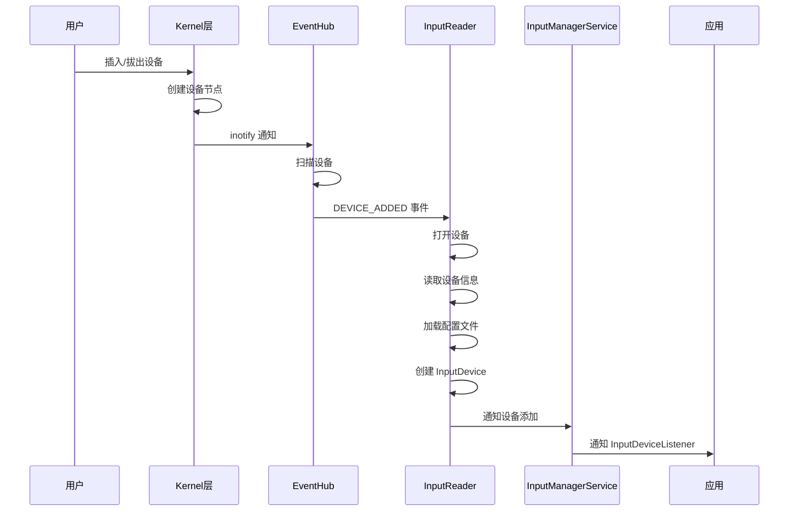
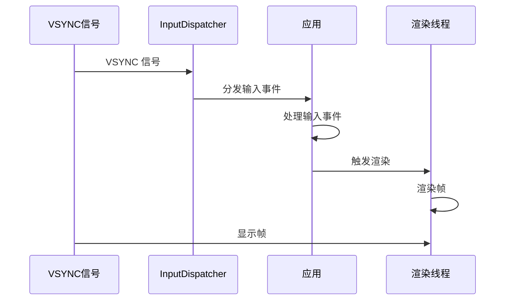

# Input 系统专家篇：高级特性、性能优化与问题诊断

## 📋 概述

在前两篇中，我们深入理解了 Android 输入系统的架构、实现和交互机制。本篇将聚焦于输入系统的高级特性、性能优化策略以及问题诊断方法。通过源码级别的分析和实战案例，帮助读者掌握输入系统的深度优化和问题排查技能。

---

## 一、高级特性

### 1.1 输入设备管理

#### 1.1.1 设备热插拔的完整流程

**设备热插拔的完整流程**：



**详细步骤**：

1. **设备插入**：
   ```cpp
   // EventHub.cpp
   void EventHub::handleDeviceChange() {
       // inotify 检测到设备目录变化
       struct inotify_event* event = (struct inotify_event*)buffer;
       
       if (event->mask & IN_CREATE) {
           // 设备添加
           String8 devicePath = String8::format("%s/%s", DEVICE_PATH, event->name);
           openDeviceLocked(devicePath.string());
       }
   }
   ```

2. **打开设备**：
   ```cpp
   // EventHub.cpp
   int32_t EventHub::openDeviceLocked(const char* devicePath) {
       // 打开设备文件
       int fd = open(devicePath, O_RDONLY | O_NONBLOCK);
       
       // 读取设备信息
       ioctl(fd, EVIOCGNAME(sizeof(name)), name);
       ioctl(fd, EVIOCGID, &id);
       
       // 添加到设备列表
       mDevices.add(deviceId, new Device(fd, deviceId, name, id));
       
       return deviceId;
   }
   ```

3. **通知 InputReader**：
   ```cpp
   // EventHub.cpp
   void EventHub::getEvents(int timeoutMillis, RawEvent* buffer, size_t bufferSize) {
       // 生成 DEVICE_ADDED 事件
       RawEvent* event = &buffer[count++];
       event->when = now();
       event->deviceId = deviceId;
       event->type = DEVICE_ADDED;
   }
   ```

4. **InputReader 处理**：
   ```cpp
   // InputReader.cpp
   void InputReader::processEventsLocked(const RawEvent* rawEvents, size_t count) {
       for (size_t i = 0; i < count; i++) {
           if (rawEvents[i].type == DEVICE_ADDED) {
               addDeviceLocked(rawEvents[i].when, rawEvents[i].deviceId);
           } else if (rawEvents[i].type == DEVICE_REMOVED) {
               removeDeviceLocked(rawEvents[i].when, rawEvents[i].deviceId);
           }
       }
   }
   ```

#### 1.1.2 设备配置文件的解析

##### Key Layout 文件

**Key Layout 文件的作用**：
- 映射 Linux scan code 到 Android key code
- 位置：`/system/usr/keylayout/` 或 `/vendor/usr/keylayout/`

**文件格式示例**：
```
# Generic.kl
key 1     ESCAPE
key 2     ONE
key 3     TWO
key 4     THREE
key 11    MINUS
key 14    BACKSPACE
key 15    TAB
key 28    ENTER
```

**解析过程**：
```cpp
// KeyLayoutMap.cpp
status_t KeyLayoutMap::load(const String8& filename, KeyLayoutMap** outMap) {
    // 1. 读取文件
    FILE* file = fopen(filename.string(), "r");
    
    // 2. 解析每一行
    while (fgets(line, sizeof(line), file)) {
        if (line[0] == 'k' && line[1] == 'e' && line[2] == 'y') {
            // 解析 key 映射
            int scanCode = atoi(&line[4]);
            const char* keyCodeName = strchr(line, ' ');
            int keyCode = getKeyCodeByName(keyCodeName);
            
            // 添加到映射表
            mKeys.add(scanCode, keyCode);
        }
    }
}
```

##### IDC 文件（Input Device Configuration）

**IDC 文件的作用**：
- 设备特定的配置
- 触摸校准、按键映射、设备属性等
- 位置：`/system/usr/idc/` 或 `/vendor/usr/idc/`

**文件格式示例**：
```
# touchscreen.idc
touch.deviceType = touchScreen
touch.orientationAware = 1
touch.size.calibration = geometric
touch.size.scale = 10
touch.size.bias = 0
touch.size.isSummed = 0
```

**解析过程**：
```cpp
// InputDeviceConfigurationFile.cpp
status_t InputDeviceConfigurationFile::load(const String8& filename) {
    // 解析配置项
    while (fgets(line, sizeof(line), file)) {
        if (strncmp(line, "touch.", 6) == 0) {
            // 解析触摸配置
            parseTouchConfiguration(line);
        } else if (strncmp(line, "key.", 4) == 0) {
            // 解析按键配置
            parseKeyConfiguration(line);
        }
    }
}
```

#### 1.1.3 设备特定的配置

**触摸校准**：
```cpp
// TouchInputMapper.cpp
void TouchInputMapper::configure(nsecs_t when, const InputReaderConfiguration* config) {
    // 应用触摸校准
    if (mDevice->getConfiguration().hasTouchCalibration()) {
        TouchCalibration cal = mDevice->getConfiguration().getTouchCalibration();
        // 应用校准矩阵
        mCalibrationMatrix = cal.getMatrix();
    }
}
```

**按键映射**：
```cpp
// KeyboardInputMapper.cpp
void KeyboardInputMapper::configure(nsecs_t when, const InputReaderConfiguration* config) {
    // 应用按键映射
    if (mDevice->getConfiguration().hasKeyMapping()) {
        KeyMapping mapping = mDevice->getConfiguration().getKeyMapping();
        // 应用映射
        mKeyMap = mapping;
    }
}
```

#### 1.1.4 多显示器下的设备关联

**设备与显示器的关联**：

```java
// InputManagerService.java
public void setInputDeviceAssociation(int deviceId, int displayId) {
    // 关联输入设备到显示器
    nativeSetInputDeviceAssociation(mPtr, deviceId, displayId);
}
```

**关联方式**：

1. **物理端口关联**：
   - USB 端口与 HDMI 端口关联
   - 触摸屏控制器与显示器关联

2. **配置文件关联**：
   ```xml
   <!-- input_device_associations.xml -->
   <input-device-association>
       <input-device name="touchscreen0" />
       <display port="0" />
   </input-device-association>
   ```

3. **动态关联**：
   - 通过 API 动态设置
   - 用于外接显示器场景

### 1.2 输入事件批处理和合并

#### 1.2.1 MotionEvent 的批处理机制（batching）

**批处理的作用**：
- 将多个触摸样本合并到一个 MotionEvent 中
- 减少事件数量，降低系统开销
- 提高滑动流畅度

**批处理的实现**：

```cpp
// TouchInputMapper.cpp
void TouchInputMapper::process(const RawEvent* rawEvent) {
    // 收集触摸样本
    TouchSample sample;
    sample.x = rawEvent->x;
    sample.y = rawEvent->y;
    sample.pressure = rawEvent->pressure;
    sample.time = rawEvent->when;
    
    mSamples.push_back(sample);
    
    // 检查是否需要立即发送
    if (shouldSendBatch()) {
        // 创建批处理的 MotionEvent
        MotionEvent* event = createMotionEvent();
        
        // 添加所有样本
        for (const TouchSample& sample : mSamples) {
            event->addSample(sample.time, sample.x, sample.y, sample.pressure);
        }
        
        // 发送到 InputDispatcher
        getListener()->notifyMotion(event);
        
        mSamples.clear();
    }
}

bool TouchInputMapper::shouldSendBatch() {
    // 1. ACTION_DOWN/UP 立即发送
    if (mSamples.back().action == ACTION_DOWN || 
        mSamples.back().action == ACTION_UP) {
        return true;
    }
    
    // 2. 样本数量达到阈值
    if (mSamples.size() >= MAX_BATCH_SIZE) {
        return true;
    }
    
    // 3. 时间间隔超过阈值
    nsecs_t timeDelta = mSamples.back().time - mSamples.front().time;
    if (timeDelta > MAX_BATCH_TIME) {
        return true;
    }
    
    return false;
}
```

#### 1.2.2 历史样本（historical samples）的使用

**历史样本的作用**：
- 保存批处理中的历史触摸点
- 应用可以获取完整的触摸轨迹
- 用于平滑的滑动效果

**使用示例**：

```java
// View.java
@Override
public boolean onTouchEvent(MotionEvent event) {
    // 获取当前坐标
    float x = event.getX();
    float y = event.getY();
    
    // 获取历史样本
    int historySize = event.getHistorySize();
    for (int i = 0; i < historySize; i++) {
        float historicalX = event.getHistoricalX(i);
        float historicalY = event.getHistoricalY(i);
        long historicalTime = event.getHistoricalEventTime(i);
        
        // 处理历史触摸点
        drawTouchPoint(historicalX, historicalY);
    }
    
    // 处理当前触摸点
    drawTouchPoint(x, y);
    
    return true;
}
```

#### 1.2.3 事件合并（coalescing）- 3ms 阈值机制

**合并机制**：

```cpp
// InputDispatcher.cpp
void InputDispatcher::coalesceMotionEventLocked(MotionEntry* motionEntry) {
    // 查找队列中相同设备的最后一个 MotionEntry
    MotionEntry* lastMotionEntry = findLastMotionEntryLocked(motionEntry->deviceId);
    
    if (lastMotionEntry != nullptr) {
        // 计算时间差
        nsecs_t timeDelta = motionEntry->eventTime - lastMotionEntry->eventTime;
        
        // 如果时间差 < 3ms，合并事件
        if (timeDelta < MOTION_SAMPLE_COALESCE_INTERVAL) {
            // 更新最后一个样本，而不是添加新样本
            lastMotionEntry->updateSample(motionEntry->eventTime,
                                         motionEntry->pointerCoords[0]);
            return;  // 不添加新事件
        }
    }
    
    // 时间差 >= 3ms，添加新样本
    mInboundQueue.enqueueAtTail(motionEntry);
}
```

**合并的影响**：
- **优势**：减少事件数量，降低系统开销
- **劣势**：可能略微增加延迟（< 3ms）
- **权衡**：延迟增加可忽略，性能提升明显

#### 1.2.4 批处理对延迟的影响

**延迟分析**：

| 阶段 | 延迟 | 说明 |
| :--- | :--- | :--- |
| **硬件延迟** | 1-5ms | 触摸屏响应时间 |
| **驱动延迟** | 0.5-2ms | Kernel 驱动处理 |
| **EventHub 延迟** | 0.1-1ms | 事件读取 |
| **InputReader 延迟** | 0.5-3ms | 事件处理和批处理 |
| **InputDispatcher 延迟** | 0.5-2ms | 事件分发 |
| **应用延迟** | 可变 | 应用处理时间 |

**批处理延迟**：
- 批处理可能增加 0-3ms 延迟
- 但减少了事件数量，整体性能提升
- 历史样本可以补偿延迟

### 1.3 多点触控支持

#### 1.3.1 多指手势的处理

**多点触控事件结构**：

```java
// MotionEvent.java
public class MotionEvent {
    // 获取触摸点数量
    public int getPointerCount();
    
    // 获取指定触摸点的坐标
    public float getX(int pointerIndex);
    public float getY(int pointerIndex);
    
    // 获取触摸点 ID（手指标识）
    public int getPointerId(int pointerIndex);
    
    // 获取触摸点动作
    public int getActionMasked();  // ACTION_POINTER_DOWN, ACTION_POINTER_UP
    public int getActionIndex();   // 触发动作的手指索引
}
```

**多指手势处理**：

```java
// View.java
@Override
public boolean onTouchEvent(MotionEvent event) {
    int action = event.getActionMasked();
    int pointerIndex = event.getActionIndex();
    int pointerId = event.getPointerId(pointerIndex);
    
    switch (action) {
        case MotionEvent.ACTION_DOWN:
            // 第一个手指按下
            handlePointerDown(pointerId, event.getX(pointerIndex), event.getY(pointerIndex));
            break;
            
        case MotionEvent.ACTION_POINTER_DOWN:
            // 额外手指按下
            handlePointerDown(pointerId, event.getX(pointerIndex), event.getY(pointerIndex));
            break;
            
        case MotionEvent.ACTION_MOVE:
            // 手指移动（可能多个手指）
            for (int i = 0; i < event.getPointerCount(); i++) {
                int id = event.getPointerId(i);
                handlePointerMove(id, event.getX(i), event.getY(i));
            }
            break;
            
        case MotionEvent.ACTION_POINTER_UP:
            // 额外手指抬起
            handlePointerUp(pointerId);
            break;
            
        case MotionEvent.ACTION_UP:
            // 最后一个手指抬起
            handlePointerUp(pointerId);
            break;
    }
    
    return true;
}
```

#### 1.3.2 手势识别（缩放、旋转等）

**缩放手势识别**：

```java
// ScaleGestureDetector.java (简化)
public class ScaleGestureDetector {
    private float mFocusX, mFocusY;  // 焦点（两指中点）
    private float mCurrentSpan;      // 当前距离
    private float mPreviousSpan;     // 之前距离
    
    public boolean onTouchEvent(MotionEvent event) {
        if (event.getPointerCount() == 2) {
            // 计算两指距离
            float x1 = event.getX(0);
            float y1 = event.getY(0);
            float x2 = event.getX(1);
            float y2 = event.getY(1);
            
            mCurrentSpan = (float) Math.hypot(x2 - x1, y2 - y1);
            mFocusX = (x1 + x2) / 2;
            mFocusY = (y1 + y2) / 2;
            
            // 计算缩放比例
            float scale = mCurrentSpan / mPreviousSpan;
            
            // 通知监听器
            mListener.onScale(this, scale, mFocusX, mFocusY);
            
            mPreviousSpan = mCurrentSpan;
        }
    }
}
```

**旋转手势识别**：

```java
// RotateGestureDetector.java (简化)
public class RotateGestureDetector {
    private float mPreviousAngle;  // 之前的角度
    private float mCurrentAngle;   // 当前角度
    
    public boolean onTouchEvent(MotionEvent event) {
        if (event.getPointerCount() == 2) {
            // 计算两指连线的角度
            float x1 = event.getX(0);
            float y1 = event.getY(0);
            float x2 = event.getX(1);
            float y2 = event.getY(1);
            
            mCurrentAngle = (float) Math.atan2(y2 - y1, x2 - x1);
            
            // 计算旋转角度
            float rotation = mCurrentAngle - mPreviousAngle;
            
            // 通知监听器
            mListener.onRotate(this, rotation);
            
            mPreviousAngle = mCurrentAngle;
        }
    }
}
```

#### 1.3.3 多点触控事件的数据结构

**MotionEvent 中的多点触控数据**：

```cpp
// MotionEvent.cpp
class MotionEvent {
    struct Pointer {
        int32_t id;           // 触摸点 ID
        float x, y;           // 坐标
        float pressure;       // 压力
        float size;           // 触摸大小
        int32_t toolType;     // 工具类型（手指、触控笔等）
    };
    
    Pointer mPointers[MAX_POINTERS];  // 最多 10 个触摸点
    size_t mPointerCount;             // 当前触摸点数量
};
```

### 1.4 输入事件预测

#### 1.4.1 触摸事件预测算法

**预测的作用**：
- 预测下一个触摸点的位置
- 减少输入延迟的感知
- 提高滑动流畅度

**预测算法（简化）**：

```cpp
// InputReader.cpp
void TouchInputMapper::predictNextSample(nsecs_t predictionTime) {
    if (mSamples.size() < 2) {
        return;  // 样本不足，无法预测
    }
    
    // 使用线性预测
    const TouchSample& last = mSamples.back();
    const TouchSample& prev = mSamples[mSamples.size() - 2];
    
    // 计算速度
    float vx = (last.x - prev.x) / (last.time - prev.time);
    float vy = (last.y - prev.y) / (last.time - prev.time);
    
    // 预测下一个位置
    nsecs_t timeDelta = predictionTime - last.time;
    float predictedX = last.x + vx * timeDelta;
    float predictedY = last.y + vy * timeDelta;
    
    // 添加到预测样本
    mPredictedSamples.push_back({predictionTime, predictedX, predictedY});
}
```

#### 1.4.2 减少输入延迟的策略

**策略**：

1. **预测性处理**：提前预测触摸位置
2. **异步处理**：非关键路径异步处理
3. **批处理优化**：减少批处理延迟
4. **VSYNC 对齐**：与 VSYNC 同步，减少等待

### 1.5 输入事件过滤和拦截

#### 1.5.1 系统级按键拦截

**拦截机制**：

```java
// PhoneWindowManager.java
@Override
public int interceptKeyBeforeQueueing(KeyEvent event, int policyFlags) {
    int keyCode = event.getKeyCode();
    
    // 拦截电源键
    if (keyCode == KeyEvent.KEYCODE_POWER) {
        if (event.getAction() == KeyEvent.ACTION_DOWN) {
            // 处理电源键（锁屏、关机菜单等）
            handlePowerKey(event);
            return INTERCEPT_KEY_RESULT_SKIP;  // 跳过，不发送给应用
        }
    }
    
    // 拦截音量键
    if (keyCode == KeyEvent.KEYCODE_VOLUME_UP || 
        keyCode == KeyEvent.KEYCODE_VOLUME_DOWN) {
        // 处理音量键
        handleVolumeKey(event);
        return INTERCEPT_KEY_RESULT_SKIP;
    }
    
    return INTERCEPT_KEY_RESULT_CONTINUE;  // 继续，发送给应用
}
```

#### 1.5.2 输入事件过滤策略

**InputFilter 的作用**：

```java
// InputFilter.java
public interface InputFilter {
    void onInputEvent(InputEvent event, int policyFlags);
}
}

// 自定义 InputFilter
public class MyInputFilter implements InputFilter {
    @Override
    public void onInputEvent(InputEvent event, int policyFlags) {
        if (event instanceof KeyEvent) {
            KeyEvent keyEvent = (KeyEvent) event;
            
            // 过滤某些按键
            if (keyEvent.getKeyCode() == KeyEvent.KEYCODE_HOME) {
                // 拦截 Home 键
                return;
            }
        }
        
        // 继续传递
        sendInputEvent(event);
    }
}
```

#### 1.5.3 权限和安全机制

**输入事件的权限控制**：

```java
// InputManagerService.java
public void registerInputChannel(InputChannel inputChannel, 
        InputWindowHandle inputWindowHandle) {
    // 检查权限
    if (!checkInputChannelPermission(inputWindowHandle)) {
        throw new SecurityException("Not allowed to register input channel");
    }
    
    // 注册
    nativeRegisterInputChannel(mPtr, inputChannel, inputWindowHandle);
}
```

### 1.6 虚拟按键处理

#### 1.6.1 导航栏按键映射

**虚拟按键的实现**：

```java
// NavigationBarView.java
public class NavigationBarView {
    private void setupNavigationBar() {
        // 创建虚拟按键
        mBackButton = findViewById(R.id.back);
        mHomeButton = findViewById(R.id.home);
        mRecentButton = findViewById(R.id.recent);
        
        // 设置点击监听
        mBackButton.setOnClickListener(v -> {
            // 发送按键事件
            sendKeyEvent(KeyEvent.KEYCODE_BACK);
        });
    }
    
    private void sendKeyEvent(int keyCode) {
        // 注入按键事件
        InputManager.getInstance().injectInputEvent(
            new KeyEvent(KeyEvent.ACTION_DOWN, keyCode), 
            InputManager.INJECT_INPUT_EVENT_MODE_ASYNC);
    }
}
```

#### 1.6.2 虚拟按键的配置

**配置方式**：

1. **系统属性**：
   ```bash
   # 启用/禁用虚拟按键
   setprop qemu.hw.mainkeys 0  # 0=启用虚拟按键，1=禁用
   ```

2. **配置文件**：
   ```xml
   <!-- config.xml -->
   <bool name="config_showNavigationBar">true</bool>
   ```

---

## 二、性能优化

### 2.1 输入延迟优化

#### 2.1.1 输入延迟的组成

**延迟分解**：

| 阶段 | 典型延迟 | 优化方法 |
| :--- | :--- | :--- |
| **硬件延迟** | 1-5ms | 硬件优化（触摸屏响应速度） |
| **驱动延迟** | 0.5-2ms | 驱动优化（中断处理） |
| **EventHub 延迟** | 0.1-1ms | epoll 优化 |
| **InputReader 延迟** | 0.5-3ms | 批处理优化、事件合并 |
| **InputDispatcher 延迟** | 0.5-2ms | 队列优化、窗口匹配优化 |
| **应用延迟** | 可变 | 主线程优化、异步处理 |

**总延迟**：通常 3-15ms（不包括应用处理时间）

#### 2.1.2 减少事件处理延迟的方法

**优化策略**：

1. **减少批处理延迟**：
   ```cpp
   // 减少批处理阈值
   #define MAX_BATCH_TIME 8ms  // 从 16ms 减少到 8ms
   ```

2. **优化事件合并**：
   ```cpp
   // 减少合并阈值（可能增加事件数量）
   #define MOTION_SAMPLE_COALESCE_INTERVAL 2ms  // 从 3ms 减少到 2ms
   ```

3. **优化窗口匹配**：
   ```cpp
   // 缓存焦点窗口，减少查找时间
   sp<InputWindowHandle> mCachedFocusedWindow;
   ```

#### 2.1.3 预测性输入处理

**预测机制**：

```cpp
// InputReader.cpp
void TouchInputMapper::predictAndSend(nsecs_t currentTime) {
    // 预测下一个 VSYNC 时的触摸位置
    nsecs_t nextVsyncTime = getNextVsyncTime();
    nsecs_t predictionTime = nextVsyncTime - currentTime;
    
    if (predictionTime > 0 && predictionTime < MAX_PREDICTION_TIME) {
        // 预测触摸位置
        TouchSample predicted = predictNextSample(predictionTime);
        
        // 添加到事件中
        mCurrentEvent->addPredictedSample(predicted);
    }
}
```

### 2.2 事件队列优化

#### 2.2.1 事件合并（MotionEvent 合并）

**合并策略**：

```cpp
// InputDispatcher.cpp
void InputDispatcher::coalesceMotionEventsLocked() {
    // 查找可以合并的事件
    MotionEntry* lastEntry = findLastMotionEntry();
    
    while (mInboundQueue.size() > 0) {
        MotionEntry* nextEntry = mInboundQueue.head;
        
        // 检查是否可以合并
        if (canCoalesce(lastEntry, nextEntry)) {
            // 合并事件
            lastEntry->merge(nextEntry);
            mInboundQueue.dequeueAtHead();
            delete nextEntry;
        } else {
            break;
        }
    }
}

bool InputDispatcher::canCoalesce(MotionEntry* e1, MotionEntry* e2) {
    // 1. 相同设备
    if (e1->deviceId != e2->deviceId) {
        return false;
    }
    
    // 2. 相同动作
    if (e1->action != e2->action) {
        return false;
    }
    
    // 3. 时间间隔 < 阈值
    nsecs_t timeDelta = e2->eventTime - e1->eventTime;
    if (timeDelta >= COALESCE_THRESHOLD) {
        return false;
    }
    
    return true;
}
```

#### 2.2.2 事件丢弃策略

**丢弃策略**：

```cpp
// InputDispatcher.cpp
void InputDispatcher::dropOldEventsLocked() {
    // 如果队列过长，丢弃旧事件
    while (mInboundQueue.size() > MAX_QUEUE_SIZE) {
        EventEntry* oldEntry = mInboundQueue.dequeueAtHead();
        
        // 只丢弃 MOVE 事件，保留 DOWN/UP
        if (oldEntry->type == TYPE_MOTION) {
            MotionEntry* motionEntry = static_cast<MotionEntry*>(oldEntry);
            if (motionEntry->action == AMOTION_EVENT_ACTION_MOVE) {
                delete oldEntry;
                continue;
            }
        }
        
        // 重要事件不丢弃，重新入队
        mInboundQueue.enqueueAtHead(oldEntry);
        break;
    }
}
```

#### 2.2.3 队列大小管理

**队列大小限制**：

```cpp
// InputDispatcher.cpp
class InputDispatcher {
    static const size_t MAX_INBOUND_QUEUE_SIZE = 1000;  // 最大队列大小
    
    void enforceQueueSizeLimit() {
        if (mInboundQueue.size() > MAX_INBOUND_QUEUE_SIZE) {
            // 丢弃旧事件或拒绝新事件
            dropOldEventsLocked();
        }
    }
};
```

### 2.3 输入与 VSYNC 同步

#### 2.3.1 输入事件与 VSYNC 的对齐

**VSYNC 对齐机制**：

```cpp
// InputDispatcher.cpp
void InputDispatcher::dispatchOnceInnerLocked(nsecs_t* nextWakeupTime) {
    nsecs_t currentTime = now();
    nsecs_t nextVsyncTime = getNextVsyncTime();
    
    // 如果距离下一个 VSYNC 很近，等待 VSYNC
    nsecs_t timeToVsync = nextVsyncTime - currentTime;
    if (timeToVsync > 0 && timeToVsync < VSYNC_WAIT_THRESHOLD) {
        *nextWakeupTime = nextVsyncTime;
        return;  // 等待 VSYNC
    }
    
    // 否则立即分发
    dispatchPendingEventsLocked();
}
```

**对齐的优势**：
- 输入事件与渲染同步
- 减少输入到显示的延迟
- 提高流畅度

#### 2.3.2 批处理模式 vs 非批处理模式

**批处理模式（Buffered）**：
- 事件等待 VSYNC 再分发
- 每帧最多一个事件
- 延迟较高，但更稳定

**非批处理模式（Unbuffered）**：
- 事件立即分发
- 每帧可能有多个事件
- 延迟较低，但可能不稳定

**模式选择**：

```java
// ViewRootImpl.java
void setInputEventMode(int mode) {
    // 设置输入事件模式
    // INPUT_EVENT_MODE_BUFFERED: 批处理模式
    // INPUT_EVENT_MODE_UNBUFFERED: 非批处理模式
    mInputEventMode = mode;
}
```

#### 2.3.3 VSYNC 偏移对输入延迟的影响

**VSYNC 偏移**：

```cpp
// InputDispatcher.cpp
nsecs_t InputDispatcher::getInputVsyncOffset() {
    // 输入事件的 VSYNC 偏移
    // 提前接收 VSYNC，给应用更多时间处理
    return VSYNC_EVENT_PHASE_OFFSET_NS;
}
```

**偏移的作用**：
- 应用提前收到 VSYNC 信号
- 有更多时间处理输入事件
- 减少输入到显示的延迟

#### 2.3.4 输入事件与渲染的同步

**同步机制**：



**同步的优势**：
- 输入事件和渲染在同一 VSYNC 周期
- 减少输入到显示的延迟
- 提高响应速度

### 2.4 多线程优化

#### 2.4.1 InputReaderThread 和 InputDispatcherThread

**线程架构**：

```cpp
// InputManager.cpp
InputManager::InputManager(...) {
    // 创建 InputReader 线程
    mReaderThread = new InputReaderThread(mReader);
    mReaderThread->run("InputReader", PRIORITY_URGENT_DISPLAY);
    
    // 创建 InputDispatcher 线程
    mDispatcherThread = new InputDispatcherThread(mDispatcher);
    mDispatcherThread->run("InputDispatcher", PRIORITY_URGENT_DISPLAY);
}
```

**线程职责**：

| 线程 | 职责 | 优先级 |
| :--- | :--- | :--- |
| **InputReaderThread** | 读取和处理输入事件 | PRIORITY_URGENT_DISPLAY |
| **InputDispatcherThread** | 分发输入事件 | PRIORITY_URGENT_DISPLAY |

#### 2.4.2 线程间通信优化

**通信方式**：

```cpp
// InputReader 和 InputDispatcher 通过 Listener 通信
class QueuedInputListener : public InputListenerInterface {
    void notifyKey(const NotifyKeyArgs* args) {
        // 添加到队列
        mArgsQueue.push_back(new NotifyKeyArgs(*args));
    }
    
    void flush() {
        // 批量处理
        for (Args* args : mArgsQueue) {
            mInnerListener->notifyKey(args);
        }
        mArgsQueue.clear();
    }
};
```

#### 2.4.3 锁竞争优化

**锁优化策略**：

1. **减少锁持有时间**：
   ```cpp
   // 不好的做法
   {
       AutoMutex _l(mLock);
       // 长时间操作
       processEvents();  // 可能很耗时
   }
   
   // 好的做法
   {
       AutoMutex _l(mLock);
       // 只做必要的操作
       EventEntry* entry = mQueue.dequeue();
   }
   // 锁外处理
   processEvent(entry);
   ```

2. **使用无锁数据结构**：
   ```cpp
   // 使用 LockFreeQueue
   LockFreeQueue<EventEntry> mEventQueue;
   ```

3. **减少锁粒度**：
   ```cpp
   // 使用多个细粒度锁
   Mutex mDeviceLock;      // 设备锁
   Mutex mQueueLock;       // 队列锁
   Mutex mWindowLock;      // 窗口锁
   ```

---

## 三、问题诊断

### 3.1 输入相关问题的分析方法

#### 3.1.1 使用 getevent 查看原始输入事件

**getevent 工具**：

```bash
# 查看所有输入设备
adb shell getevent -l

# 查看特定设备
adb shell getevent -l /dev/input/event0

# 实时监控
adb shell getevent -l | grep ABS_MT
```

**输出示例**：
```
/dev/input/event0: EV_ABS       ABS_MT_TRACKING_ID   00000001
/dev/input/event0: EV_ABS       ABS_MT_POSITION_X    00000234
/dev/input/event0: EV_ABS       ABS_MT_POSITION_Y    00000456
/dev/input/event0: EV_SYN       SYN_REPORT           00000000
```

**分析要点**：
- 检查事件是否正常产生
- 检查坐标范围是否合理
- 检查事件时间戳

#### 3.1.2 使用 dumpsys input 查看输入系统状态

**dumpsys input 命令**：

```bash
# 查看输入系统状态
adb shell dumpsys input

# 查看输入设备信息
adb shell dumpsys input devices

# 查看窗口信息
adb shell dumpsys input windows
```

**关键信息**：

1. **输入设备列表**：
   ```
   Input Devices:
     1: touchscreen
         Classes: TOUCHSCREEN
         Path: /dev/input/event0
   ```

2. **窗口信息**：
   ```
   Windows:
     Window 0: name=com.example.app
       Focus: true
       Touchable Region: [0,0][1080,1920]
   ```

3. **ANR 信息**：
   ```
   ANR History:
     Time: 1234567890
     Reason: Input dispatching timed out
     Window: com.example.app
   ```

#### 3.1.3 使用 systrace 分析输入延迟

**systrace 命令**：

```bash
# 捕获输入相关的 trace
python systrace.py -t 10 -o trace.html input view gfx
```

**关键 trace 点**：

1. **InputReader**：
   - `InputReader::loopOnce()`：读取事件
   - `InputReader::processEventsLocked()`：处理事件

2. **InputDispatcher**：
   - `InputDispatcher::dispatchOnce()`：分发事件
   - `InputDispatcher::dispatchEventToConnection()`：发送到应用

3. **应用层**：
   - `ViewRootImpl::dispatchInputEvent()`：接收事件
   - `View::onTouchEvent()`：处理事件

**分析要点**：
- 事件从 InputReader 到应用的延迟
- 应用处理事件的时间
- VSYNC 对齐情况

#### 3.1.4 使用 WALT 测量输入延迟

**WALT（Wooden Android Latency Tester）**：

- 硬件工具，测量触摸到显示的延迟
- 使用加速度计检测触摸
- 使用光电二极管检测显示

**测量指标**：
- **Tap Latency**：点击延迟
- **Drag Latency**：拖拽延迟
- **Frame Time**：帧时间

### 3.2 输入 ANR 分析

#### 3.2.1 Input ANR 的分类识别

##### Input Dispatch Timeout ANR 的日志特征

**日志特征**：

```
ANR in com.example.app (com.example.app/.MainActivity)
PID: 12345
Reason: Input dispatching timed out (Waiting because no window has focus but there is a focused application that may eventually add a window when it finishes starting up.)
```

**关键信息**：
- `Input dispatching timed out`：输入分发超时
- `Waiting because...`：等待原因
- `PID`：进程 ID

##### No Focus Window ANR 的日志特征

**日志特征**：

```
ANR in com.example.app (com.example.app/.MainActivity)
PID: 12345
Reason: Input dispatching timed out (No focus window, but keys are being sent to it. Make sure the input method is started and connected, and that the current activity has a window with input focus.)
```

**关键信息**：
- `No focus window`：无焦点窗口
- `keys are being sent`：按键事件无法分发

#### 3.2.2 Input ANR 的日志分析

##### dumpsys input 查看 ANR 信息

```bash
# 查看 ANR 历史
adb shell dumpsys input | grep -A 20 "ANR"
```

**输出示例**：
```
ANR History:
  Time: 1234567890
  Reason: Input dispatching timed out
  Window: com.example.app/.MainActivity
  Event: MotionEvent(ACTION_MOVE)
  Wait Time: 5000ms
```

##### traces.txt 分析主线程堆栈

**traces.txt 位置**：
- `/data/anr/traces.txt`

**分析要点**：
1. 查找主线程堆栈
2. 查看主线程在做什么
3. 检查是否有阻塞操作

**示例**：
```
"main" prio=5 tid=1 Blocked
  | group="main" sCount=1 dsCount=0 flags=1 obj=0x12345678
  | sysTid=12345 nice=0 cgrp=default sched=0/0 handle=0xabcdef
  at java.lang.Object.wait(Native method)
  at com.example.app.MainActivity.onCreate(MainActivity.java:123)
  - locked <0x12345678> (a java.lang.Object)
```

#### 3.2.3 输入事件处理时间分析

**分析方法**：

1. **使用 systrace**：
   - 查看 `ViewRootImpl::dispatchInputEvent()` 的时间
   - 查看 `View::onTouchEvent()` 的时间

2. **代码埋点**：
   ```java
   @Override
   public boolean onTouchEvent(MotionEvent event) {
       long startTime = System.nanoTime();
       
       // 处理事件
       boolean result = handleTouch(event);
       
       long duration = System.nanoTime() - startTime;
       if (duration > 16_000_000) {  // > 16ms
           Log.w(TAG, "Touch event handling took " + duration / 1_000_000 + "ms");
       }
       
       return result;
   }
   ```

#### 3.2.4 焦点窗口缺失问题的诊断

**诊断步骤**：

1. **检查窗口状态**：
   ```bash
   adb shell dumpsys window | grep -A 10 "mCurrentFocus"
   ```

2. **检查窗口是否可见**：
   ```bash
   adb shell dumpsys window windows | grep "mVisible"
   ```

3. **检查窗口标志**：
   ```bash
   adb shell dumpsys window windows | grep "FLAG_NOT_FOCUSABLE"
   ```

4. **检查 Activity 状态**：
   ```bash
   adb shell dumpsys activity activities | grep "mResumedActivity"
   ```

### 3.3 性能问题定位

#### 3.3.1 输入延迟问题定位

**定位步骤**：

1. **使用 systrace 分析**：
   ```bash
   python systrace.py -t 10 -o trace.html input
   ```

2. **查看关键指标**：
   - InputReader → InputDispatcher 延迟
   - InputDispatcher → 应用延迟
   - 应用处理延迟

3. **优化建议**：
   - 减少批处理延迟
   - 优化窗口匹配
   - 优化应用处理

#### 3.3.2 输入事件丢失问题定位

**定位步骤**：

1. **使用 getevent 监控**：
   ```bash
   adb shell getevent -l | tee events.log
   ```

2. **检查事件数量**：
   - 硬件产生的事件数量
   - 应用收到的事件数量
   - 对比差异

3. **可能原因**：
   - 队列溢出
   - 事件被丢弃
   - 窗口不接收事件

#### 3.3.3 输入事件批处理问题分析

**分析步骤**：

1. **检查批处理配置**：
   ```bash
   adb shell getprop | grep input
   ```

2. **分析批处理效果**：
   - 使用 systrace 查看批处理
   - 检查历史样本数量
   - 分析延迟影响

### 3.4 输入事件重放和测试

#### 3.4.1 输入事件的记录和重放

**记录事件**：

```bash
# 使用 getevent 记录
adb shell getevent -t > events.log

# 使用 input 命令记录（高级）
adb shell input record events.log
```

**重放事件**：

```bash
# 使用 sendevent 重放
adb shell sendevent < events.log

# 使用 input 命令重放
adb shell input replay events.log
```

**重放的用途**：
- 问题复现
- 自动化测试
- 性能测试

#### 3.4.2 测试工具和方法

**CTS 输入测试**：

```java
// InputTestCase.java
public void testInputEventInjection() {
    // 注入触摸事件
    MotionEvent event = MotionEvent.obtain(
        SystemClock.uptimeMillis(),
        SystemClock.uptimeMillis(),
        MotionEvent.ACTION_DOWN,
        x, y, 0);
    
    Instrumentation.getInstance().sendPointerSync(event);
    
    // 验证事件被处理
    assertTrue(mView.wasTouched());
}
```

**Monkey 测试**：

```bash
# 随机输入事件
adb shell monkey -p com.example.app 1000

# 指定事件类型
adb shell monkey -p com.example.app --pct-touch 50 --pct-motion 50 1000
```

#### 3.4.3 CTS 输入测试

**CTS 输入测试覆盖**：

1. **事件注入测试**：
   - 触摸事件注入
   - 按键事件注入
   - 鼠标事件注入

2. **事件分发测试**：
   - 焦点窗口选择
   - 事件路由
   - 多显示器输入

3. **性能测试**：
   - 输入延迟
   - 事件吞吐量
   - VSYNC 对齐

---

## 四、总结

### 4.1 高级特性

1. **设备管理**：热插拔、配置解析、多显示器关联
2. **事件批处理**：MotionEvent 批处理、历史样本、事件合并
3. **多点触控**：多指手势、手势识别
4. **事件预测**：触摸预测、延迟优化
5. **事件拦截**：系统级拦截、权限控制

### 4.2 性能优化

1. **延迟优化**：减少各阶段延迟、预测性处理
2. **队列优化**：事件合并、丢弃策略、大小管理
3. **VSYNC 同步**：事件对齐、批处理模式、偏移优化
4. **多线程优化**：线程间通信、锁竞争优化

### 4.3 问题诊断

1. **工具使用**：getevent、dumpsys、systrace、WALT
2. **ANR 分析**：分类识别、日志分析、堆栈分析
3. **性能定位**：延迟分析、事件丢失分析、批处理分析
4. **测试方法**：事件重放、CTS 测试、Monkey 测试

---

**提示**：输入系统的性能优化和问题诊断需要深入理解系统机制，建议结合实际项目经验，不断积累和总结。
