# Input 系统面试题篇：常见问题与深度解析

## 📋 概述

本文档整理了 Android 输入系统相关的常见面试题，按照难度分为基础、进阶、高级三个层次，并提供详细的答案和扩展知识点。这些问题涵盖了输入系统的架构、实现、性能优化等各个方面，是 Android 系统开发面试的重点内容。

---

## 一、基础面试题

### 1.1 InputManagerService、InputReader、InputDispatcher 的区别是什么？

**答案**：

| 组件 | 位置 | 作用 | 关系 |
| :--- | :--- | :--- | :--- |
| **InputManagerService** | Framework 层，SystemServer 进程 | 输入系统的核心服务，管理输入设备和策略 | 协调 InputReader 和 InputDispatcher |
| **InputReader** | Native 层，InputReaderThread 线程 | 读取和处理原始输入事件 | 从 EventHub 读取，处理后发送给 InputDispatcher |
| **InputDispatcher** | Native 层，InputDispatcherThread 线程 | 分发输入事件到目标窗口 | 从 InputReader 接收，分发到应用 |

**详细说明**：

1. **InputManagerService**：
   - 运行在 SystemServer 进程中
   - 管理输入设备（添加、删除、配置）
   - 执行输入策略（按键拦截等）
   - 协调 WindowManagerService 进行焦点管理
   - 通过 JNI 与 Native 层的 InputReader 和 InputDispatcher 交互

2. **InputReader**：
   - 运行在独立的 InputReaderThread 线程中
   - 从 EventHub 读取原始输入事件
   - 进行事件映射（scan code → key code）
   - 处理设备配置（Key Layout、IDC 文件）
   - 进行事件批处理（MotionEvent batching）
   - 通过 Listener 接口将处理后的事件发送给 InputDispatcher

3. **InputDispatcher**：
   - 运行在独立的 InputDispatcherThread 线程中
   - 从 InputReader 接收处理后的输入事件
   - 管理事件队列（待分发队列、等待确认队列）
   - 选择目标窗口（根据焦点或触摸位置）
   - 通过 InputChannel 发送事件到应用
   - 检测 ANR（超时检测）

**工作流程**：
```
EventHub → InputReader → InputDispatcher → 应用
           ↑                              ↑
           └── InputManagerService 协调 ──┘
```

**扩展**：
- InputReader 和 InputDispatcher 运行在不同的线程，通过队列通信
- InputManagerService 是 Java 层服务，InputReader 和 InputDispatcher 是 Native 层组件
- InputManagerService 通过 JNI 与 Native 层交互

---

### 1.2 InputChannel 的作用是什么？

**答案**：

**InputChannel 是应用与系统通信的通道**，用于传递输入事件。

**核心作用**：

1. **传递输入事件**：
   - 系统通过 InputChannel 发送输入事件到应用
   - 应用通过 InputChannel 接收输入事件

2. **事件确认**：
   - 应用处理完事件后，通过 InputChannel 返回确认
   - 系统根据确认判断是否触发 ANR

3. **双向通信**：
   - 系统 → 应用：发送输入事件
   - 应用 → 系统：返回处理结果

**实现原理**：

```java
// InputChannel.java
public static InputChannel[] openInputChannelPair(String name) {
    // 创建一对 InputChannel（服务端和客户端）
    return nativeOpenInputChannelPair(name);
}
```

```cpp
// android_view_InputChannel.cpp
static jobjectArray nativeOpenInputChannelPair(JNIEnv* env, jclass clazz, jstring nameStr) {
    // 创建 Unix Domain Socket 对
    int sockets[2];
    socketpair(AF_UNIX, SOCK_SEQPACKET, 0, sockets);
    
    // 创建服务端和客户端 InputChannel
    sp<InputChannel> serverChannel = new InputChannel(name, sockets[0]);
    sp<InputChannel> clientChannel = new InputChannel(name, sockets[1]);
    
    return channels;
}
```

**特点**：
- 基于 Unix Domain Socket
- 每个窗口有一个 InputChannel
- 高效的双向通信
- 支持事件确认机制

**扩展**：
- InputChannel 在窗口创建时创建
- 服务端 InputChannel 在 WindowManagerService 中，客户端在应用进程中
- 通过 Binder 传递客户端 InputChannel 给应用

---

### 1.3 输入事件的类型有哪些？

**答案**：

Android 支持多种输入事件类型：

| 事件类型 | 说明 | 使用场景 | 数据结构 |
| :--- | :--- | :--- | :--- |
| **触摸事件（Touch Event）** | 手指触摸屏幕 | 点击、滑动、多指手势 | MotionEvent |
| **按键事件（Key Event）** | 物理按键或虚拟键盘 | 返回键、音量键、软键盘输入 | KeyEvent |
| **鼠标事件（Mouse Event）** | 鼠标操作 | 鼠标移动、点击、滚轮 | MotionEvent |
| **游戏手柄事件（Gamepad Event）** | 游戏手柄操作 | 游戏控制 | MotionEvent / KeyEvent |
| **触控笔事件（Stylus Event）** | 触控笔操作 | 手写输入、绘图 | MotionEvent |

**详细说明**：

1. **触摸事件（MotionEvent）**：
   ```java
   // 事件动作
   ACTION_DOWN          // 手指按下
   ACTION_UP            // 手指抬起
   ACTION_MOVE          // 手指移动
   ACTION_CANCEL        // 事件取消
   ACTION_POINTER_DOWN  // 多点触控，额外手指按下
   ACTION_POINTER_UP    // 多点触控，额外手指抬起
   ```

2. **按键事件（KeyEvent）**：
   ```java
   // 事件动作
   ACTION_DOWN    // 按键按下
   ACTION_UP      // 按键抬起
   
   // 常见按键码
   KEYCODE_BACK      // 返回键
   KEYCODE_HOME      // Home 键
   KEYCODE_VOLUME_UP // 音量加
   ```

**扩展**：
- 所有输入事件都继承自 InputEvent
- MotionEvent 支持多点触控（最多 10 个手指）
- MotionEvent 支持历史样本（批处理机制）

---

### 1.4 View 的事件分发机制是什么？

**答案**：

**View 树的事件分发采用责任链模式**，从父 View 到子 View，再从子 View 到父 View。

**分发流程**：

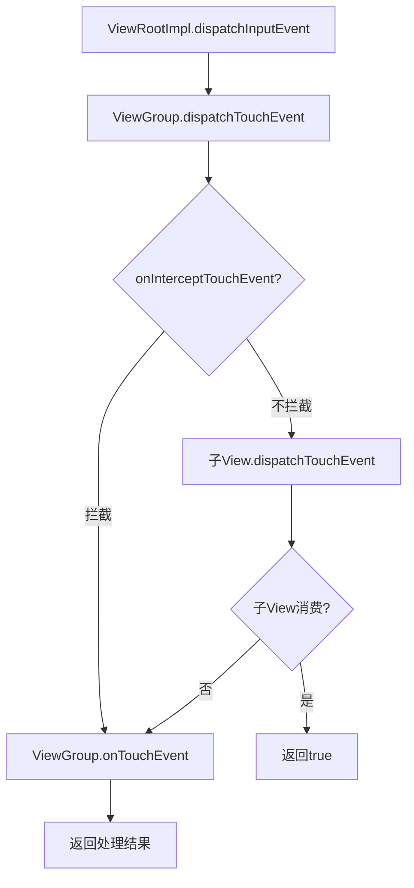

**关键方法**：

| 方法 | 作用 | 返回值 | 说明 |
| :--- | :--- | :--- | :--- |
| `dispatchTouchEvent()` | 分发事件 | true=已消费，false=未消费 | View 和 ViewGroup 都有 |
| `onInterceptTouchEvent()` | 拦截事件 | true=拦截，false=不拦截 | 仅 ViewGroup 有 |
| `onTouchEvent()` | 处理事件 | true=已消费，false=未消费 | View 和 ViewGroup 都有 |

**代码示例**：

```java
// ViewGroup.java
@Override
public boolean dispatchTouchEvent(MotionEvent ev) {
    // 1. 检查是否拦截
    boolean intercepted = onInterceptTouchEvent(ev);
    
    if (!intercepted) {
        // 2. 不拦截，分发给子 View
        for (View child : mChildren) {
            if (child.dispatchTouchEvent(ev)) {
                return true;  // 子 View 消费了事件
            }
        }
    }
    
    // 3. 子 View 未消费，自己处理
    return onTouchEvent(ev);
}

// View.java
@Override
public boolean dispatchTouchEvent(MotionEvent event) {
    // 1. 检查 OnTouchListener
    if (mOnTouchListener != null && mOnTouchListener.onTouch(this, event)) {
        return true;
    }
    
    // 2. 调用 onTouchEvent
    return onTouchEvent(event);
}
```

**分发规则**：
- 事件从 ViewRootImpl 开始，向下分发到 View 树
- ViewGroup 可以拦截事件（onInterceptTouchEvent）
- 如果事件未被消费，会向上返回
- 返回 true 表示事件已消费，不再向上传递

**扩展**：
- 事件分发是递归的
- 可以设置 OnTouchListener 优先处理事件
- 事件分发过程中可以修改事件

---

### 1.5 EventHub 的作用是什么？

**答案**：

**EventHub 是 Native 层监听输入设备的组件**，负责读取原始输入事件。

**核心作用**：

1. **监听输入设备**：
   - 监听 `/dev/input/` 目录
   - 检测设备节点的添加和删除

2. **读取原始事件**：
   - 从设备文件读取 Linux input_event 结构
   - 转换为 Android 的 RawEvent 结构

3. **设备热插拔**：
   - 处理设备添加（DEVICE_ADDED）
   - 处理设备移除（DEVICE_REMOVED）

**实现原理**：

```cpp
// EventHub.cpp
EventHub::EventHub() {
    // 使用 inotify 监听设备目录
    mINotifyFd = inotify_init();
    inotify_add_watch(mINotifyFd, DEVICE_PATH, IN_CREATE | IN_DELETE);
    
    // 使用 epoll 监听设备文件
    mEpollFd = epoll_create(EPOLL_SIZE_HINT);
    
    // 扫描现有设备
    scanDevicesLocked();
}

size_t EventHub::getEvents(int timeoutMillis, RawEvent* buffer, size_t bufferSize) {
    // 使用 epoll 等待事件
    int pollResult = epoll_wait(mEpollFd, mPendingEventItems, EPOLL_MAX_EVENTS, timeoutMillis);
    
    for (int i = 0; i < pollResult; i++) {
        if (mPendingEventItems[i].events & EPOLLIN) {
            // 读取 input_event
            struct input_event iev;
            read(mPendingEventItems[i].data.fd, &iev, sizeof(iev));
            
            // 转换为 RawEvent
            buffer[count].when = iev.time;
            buffer[count].deviceId = deviceId;
            buffer[count].type = iev.type;
            buffer[count].code = iev.code;
            buffer[count].value = iev.value;
            count++;
        }
    }
    
    return count;
}
```

**关键点**：
- 使用 `epoll` 高效监听多个设备
- 使用 `inotify` 监听设备目录变化
- 读取标准的 Linux `input_event` 结构

**扩展**：
- EventHub 是 InputReader 的数据源
- EventHub 运行在 InputReaderThread 中
- 支持设备热插拔（USB 设备、蓝牙设备等）

---

## 二、进阶面试题

### 2.1 请详细说明输入事件从硬件到应用的完整流程

**答案**：

输入事件从硬件到应用的完整流程如下：

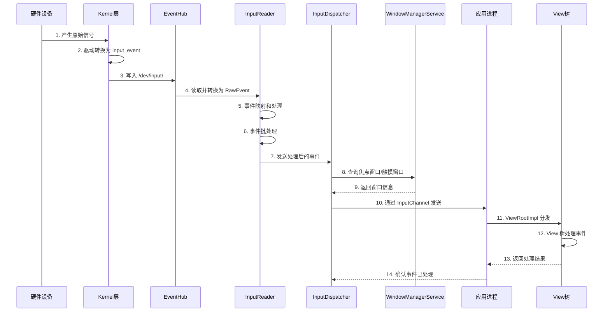

**详细步骤**：

1. **硬件产生信号**：
   - 用户触摸屏幕或按下按键
   - 硬件产生电信号

2. **Kernel 驱动处理**：
   ```c
   // 驱动代码（简化）
   static irqreturn_t touchscreen_interrupt(int irq, void *dev_id) {
       // 读取触摸数据
       int x = read_touch_x();
       int y = read_touch_y();
       
       // 转换为 input_event
       input_event(dev, EV_ABS, ABS_MT_POSITION_X, x);
       input_event(dev, EV_ABS, ABS_MT_POSITION_Y, y);
       input_sync(dev);
   }
   ```

3. **EventHub 读取**：
   ```cpp
   // EventHub.cpp
   size_t EventHub::getEvents(int timeoutMillis, RawEvent* buffer, size_t bufferSize) {
       // epoll 等待事件
       int pollResult = epoll_wait(mEpollFd, mPendingEventItems, EPOLL_MAX_EVENTS, timeoutMillis);
       
       // 读取 input_event
       struct input_event iev;
       read(fd, &iev, sizeof(iev));
       
       // 转换为 RawEvent
       buffer[count].when = iev.time;
       buffer[count].type = iev.type;
       buffer[count].code = iev.code;
       buffer[count].value = iev.value;
   }
   ```

4. **InputReader 处理**：
   ```cpp
   // InputReader.cpp
   void InputReader::processEventsLocked(const RawEvent* rawEvents, size_t count) {
       for (size_t i = 0; i < count; i++) {
           // 查找设备
           InputDevice* device = getDeviceLocked(rawEvents[i].deviceId);
           
           // 处理事件
           device->process(&rawEvents[i]);
       }
   }
   
   // TouchInputMapper.cpp
   void TouchInputMapper::process(const RawEvent* rawEvent) {
       // 映射坐标
       float x = rawEvent->x * mScaleX + mOffsetX;
       float y = rawEvent->y * mScaleY + mOffsetY;
       
       // 创建 MotionEvent
       MotionEvent* event = createMotionEvent(x, y, rawEvent->when);
       
       // 发送到 InputDispatcher
       getListener()->notifyMotion(event);
   }
   ```

5. **InputDispatcher 分发**：
   ```cpp
   // InputDispatcher.cpp
   void InputDispatcher::dispatchOnceInnerLocked(nsecs_t* nextWakeupTime) {
       // 获取事件
       EventEntry* eventEntry = mInboundQueue.dequeueAtHead();
       
       // 选择目标窗口
       sp<InputWindowHandle> targetWindow = findTargetWindow(eventEntry);
       
       // 发送到目标窗口
       dispatchEventToWindowLocked(targetWindow, eventEntry);
   }
   ```

6. **应用接收和处理**：
   ```java
   // ViewRootImpl.java
   final class WindowInputEventReceiver extends InputEventReceiver {
       @Override
       public void onInputEvent(InputEvent event) {
           // 分发到主线程
           enqueueInputEvent(event);
       }
   }
   
   private void deliverInputEvent(QueuedInputEvent q) {
       // 分发给 View 树
       mView.dispatchPointerEvent((MotionEvent) q.mEvent);
   }
   ```

**扩展**：
- 整个过程涉及多个进程和线程
- 事件经过多次转换和映射
- 每个阶段都可能影响延迟

---

### 2.2 InputDispatcher 如何选择目标窗口？

**答案**：

**InputDispatcher 根据事件类型选择目标窗口**：触摸事件根据触摸位置，按键事件根据焦点窗口。

**选择策略**：

1. **触摸事件（MotionEvent）**：
   ```cpp
   // InputDispatcher.cpp
   sp<InputWindowHandle> InputDispatcher::findTouchedWindowAtLocked(
           int32_t displayId, float x, float y) {
       // 从后往前遍历窗口（Z-order 从高到低）
       for (size_t i = mWindowHandles.size(); i > 0; i--) {
           sp<InputWindowHandle> windowHandle = mWindowHandles[i - 1];
           
           // 1. 检查窗口是否可见
           if (!windowHandle->getInfo()->visible) {
               continue;
           }
           
           // 2. 检查触摸点是否在窗口的可触摸区域内
           if (windowHandle->getInfo()->touchableRegion.contains(x, y)) {
               return windowHandle;
           }
       }
       
       return nullptr;
   }
   ```

2. **按键事件（KeyEvent）**：
   ```cpp
   // InputDispatcher.cpp
   sp<InputWindowHandle> InputDispatcher::findFocusedWindowLocked() {
       // 查找有焦点的窗口
       for (size_t i = 0; i < mWindowHandles.size(); i++) {
           sp<InputWindowHandle> windowHandle = mWindowHandles[i];
           if (windowHandle->getInfo()->hasFocus) {
               return windowHandle;
           }
       }
       return nullptr;
   }
   ```

**选择条件**：

| 事件类型 | 选择条件 | 遍历顺序 |
| :--- | :--- | :--- |
| **触摸事件** | 可见 + 触摸点在可触摸区域内 | 从后往前（Z-order 高→低） |
| **按键事件** | 可见 + 有焦点 + 可接收按键 | 查找第一个符合条件的窗口 |

**窗口匹配的优化**：

```cpp
// InputDispatcher.cpp
class InputDispatcher {
    // 缓存焦点窗口，减少查找时间
    sp<InputWindowHandle> mCachedFocusedWindow;
    
    sp<InputWindowHandle> findFocusedWindowLocked() {
        // 1. 检查缓存
        if (mCachedFocusedWindow != nullptr && 
            mCachedFocusedWindow->getInfo()->hasFocus) {
            return mCachedFocusedWindow;
        }
        
        // 2. 查找焦点窗口
        for (size_t i = 0; i < mWindowHandles.size(); i++) {
            sp<InputWindowHandle> windowHandle = mWindowHandles[i];
            if (windowHandle->getInfo()->hasFocus) {
                mCachedFocusedWindow = windowHandle;  // 更新缓存
                return windowHandle;
            }
        }
        
        mCachedFocusedWindow = nullptr;
        return nullptr;
    }
};
```

**扩展**：
- 触摸事件需要计算触摸区域
- 按键事件需要焦点窗口
- 窗口信息由 WindowManagerService 提供

---

### 2.3 Input ANR 的分类和触发机制是什么？

**答案**：

**Input ANR 分为两类**：Input Dispatch Timeout ANR 和 No Focus Window ANR。

#### Input Dispatch Timeout ANR

**触发条件**：
1. InputDispatcher 发送输入事件到应用
2. 应用的主线程在 5 秒内没有处理完该事件
3. InputDispatcher 检测到超时

**监控机制**：

```cpp
// InputDispatcher.cpp
void InputDispatcher::dispatchEventToConnectionLocked(
        Connection* connection, DispatchEntry* dispatchEntry) {
    // 计算超时时间
    nsecs_t timeoutTime = now() + getDispatchingTimeoutLocked(connection->inputWindowHandle);
    dispatchEntry->timeoutTime = timeoutTime;
    
    // 添加到等待队列
    connection->waitQueue.enqueueAtTail(dispatchEntry);
    
    // 更新 AnrTracker
    mAnrTracker.addTimeout(timeoutTime);
}

void InputDispatcher::dispatchOnceInnerLocked(nsecs_t* nextWakeupTime) {
    // 检查等待队列中的超时事件
    DispatchEntry* oldestEntry = findOldestEntryLocked();
    if (oldestEntry != nullptr) {
        nsecs_t timeoutTime = oldestEntry->timeoutTime;
        if (now() >= timeoutTime) {
            // 超时，触发 ANR
            onAnrLocked(oldestEntry->connection);
        }
    }
}
```

**超时时间**：
- 默认：5 秒（`DEFAULT_INPUT_DISPATCHING_TIMEOUT_NANOS`）
- 窗口可以指定自定义超时时间

#### No Focus Window ANR

**触发条件**：
1. 有焦点应用（Activity 在前台）
2. 但该应用没有焦点窗口（窗口未创建或不可见）
3. 按键事件无法分发，等待超时（5 秒）

**监控机制**：

```cpp
// InputDispatcher.cpp
void InputDispatcher::dispatchKeyLocked(nsecs_t currentTime, KeyEntry* entry) {
    // 查找焦点窗口
    sp<InputWindowHandle> focusedWindow = findFocusedWindowLocked();
    
    if (focusedWindow == nullptr) {
        // 没有焦点窗口，检查超时
        if (mNoFocusWindowTimeoutTime == 0) {
            // 第一次检测到，设置超时时间
            mNoFocusWindowTimeoutTime = currentTime + 
                DEFAULT_INPUT_DISPATCHING_TIMEOUT_NANOS;
        } else if (currentTime >= mNoFocusWindowTimeoutTime) {
            // 超时，触发 ANR
            onNoFocusWindowAnrLocked();
        }
        return;
    }
    
    // 有焦点窗口，重置超时时间
    mNoFocusWindowTimeoutTime = 0;
    
    // 分发事件
    dispatchEventToWindowLocked(focusedWindow, entry);
}
```

**常见原因**：
- Activity 启动时窗口创建延迟
- 窗口被设置为不可聚焦（FLAG_NOT_FOCUSABLE）
- 窗口被其他窗口完全遮挡

**扩展**：
- Input ANR 的超时时间最短（5 秒）
- Input ANR 是最常见的 ANR 类型
- AnrTracker 用于高效跟踪超时时间

---

### 2.4 View 的事件分发流程是什么？

**答案**：

**View 的事件分发采用责任链模式**，涉及三个关键方法。

**完整流程**：

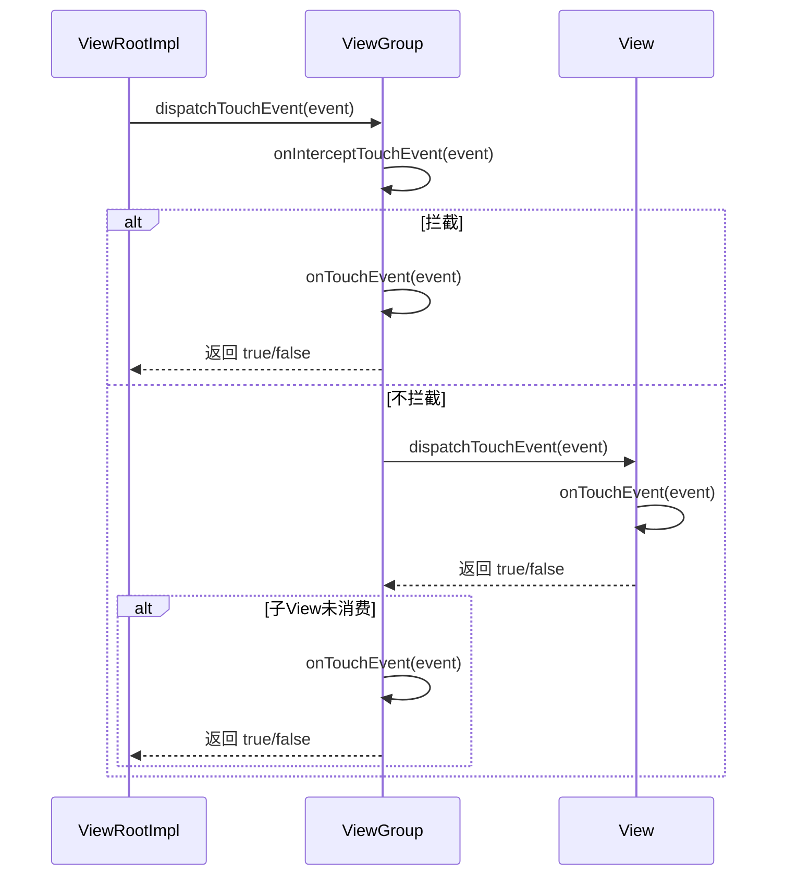

**三个关键方法**：

1. **dispatchTouchEvent()**：
   ```java
   // ViewGroup.java
   @Override
   public boolean dispatchTouchEvent(MotionEvent ev) {
       // 1. 检查是否拦截
       boolean intercepted = onInterceptTouchEvent(ev);
       
       if (!intercepted) {
           // 2. 不拦截，分发给子 View
           for (View child : mChildren) {
               if (isTransformedTouchPointInView(x, y, child, null)) {
                   if (child.dispatchTouchEvent(ev)) {
                       return true;  // 子 View 消费了
                   }
               }
           }
       }
       
       // 3. 子 View 未消费，自己处理
       return onTouchEvent(ev);
   }
   ```

2. **onInterceptTouchEvent()**：
   ```java
   // ViewGroup.java
   @Override
   public boolean onInterceptTouchEvent(MotionEvent ev) {
       // 默认不拦截
       // 子类可以重写此方法拦截事件
       return false;
   }
   ```

3. **onTouchEvent()**：
   ```java
   // View.java
   @Override
   public boolean onTouchEvent(MotionEvent event) {
       // 处理触摸事件
       // 返回 true 表示事件已消费
       return true;
   }
   ```

**分发规则**：

| 情况 | 行为 |
| :--- | :--- |
| **ViewGroup 拦截** | 事件不再分发给子 View，ViewGroup 自己处理 |
| **子 View 消费** | 事件不再向上传递，返回 true |
| **子 View 未消费** | 事件向上传递，ViewGroup 处理 |
| **ViewGroup 未消费** | 事件继续向上传递到父 ViewGroup |

**扩展**：
- 事件分发是递归的
- 可以设置 OnTouchListener 优先处理
- 事件分发过程中可以修改事件

---

### 2.5 输入焦点窗口是如何切换的？

**答案**：

**焦点窗口的切换由 WindowManagerService 管理**，通过 `updateFocusedWindowLocked()` 实现。

**切换流程**：

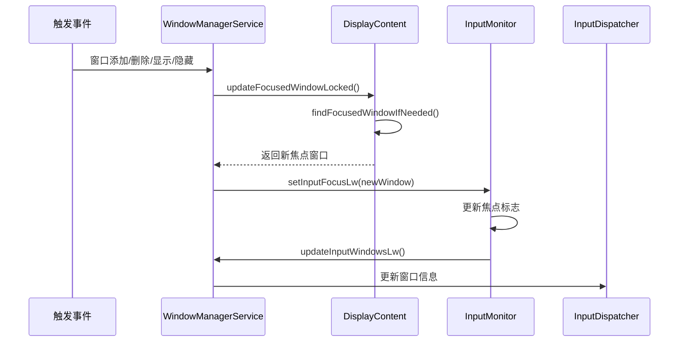

**详细步骤**：

1. **触发焦点更新**：
   ```java
   // WindowManagerService.java
   void performLayoutAndPlaceSurfacesLocked() {
       // 窗口布局后，更新焦点
       updateFocusedWindowLocked(UPDATE_FOCUS_NORMAL, true);
   }
   ```

2. **查找新焦点窗口**：
   ```java
   // DisplayContent.java
   WindowState findFocusedWindowIfNeeded() {
       // 1. 获取前台应用
       AppWindowToken focusedApp = getFocusedAppToken();
       if (focusedApp == null) {
           return null;
       }
       
       // 2. 查找该应用的焦点窗口
       for (WindowState w : focusedApp.allAppWindows) {
           if (w.canReceiveKeys() && w.isVisible()) {
               // 排除启动窗口
               if (w.mAttrs.type != TYPE_APPLICATION_STARTING) {
                   return w;
               }
           }
       }
       
       return null;
   }
   ```

3. **更新输入焦点**：
   ```java
   // InputMonitor.java
   void setInputFocusLw(WindowState newWindow, boolean updateInputWindows) {
       WindowState oldWindow = mInputFocus;
       
       if (newWindow == oldWindow) {
           return;  // 焦点未变化
       }
       
       // 更新焦点窗口
       mInputFocus = newWindow;
       
       // 更新 InputWindowHandle 的焦点标志
       if (oldWindow != null) {
           oldWindow.mInputWindowHandle.hasFocus = false;
       }
       if (newWindow != null) {
           newWindow.mInputWindowHandle.hasFocus = true;
       }
       
       // 更新输入窗口信息
       if (updateInputWindows) {
           updateInputWindowsLw(false);
       }
   }
   ```

**焦点窗口的选择条件**：

1. **窗口可见**：`mVisible == true`
2. **可接收按键**：`(mAttrs.flags & FLAG_NOT_FOCUSABLE) == 0`
3. **属于前台应用**：`mToken.appToken.isClientVisible()`
4. **不是启动窗口**：`mAttrs.type != TYPE_APPLICATION_STARTING`

**焦点窗口切换的时机**：

- 窗口添加：新窗口可能获得焦点
- 窗口删除：焦点窗口被删除，选择新的焦点窗口
- 窗口显示/隐藏：窗口可见性变化
- Activity 生命周期：onResume/onPause

**扩展**：
- 焦点窗口切换是原子操作
- 切换时会通知窗口焦点变化
- 切换时会更新 InputDispatcher 的窗口信息

---

### 2.6 焦点应用是什么时候切换的？

**答案**：

**焦点应用的切换时机与 Activity 生命周期相关**，主要在 `onResume()` 和 `onPause()` 时。

**切换流程**：

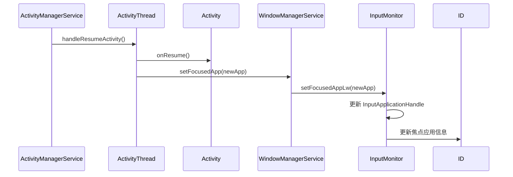

**详细步骤**：

1. **Activity onResume**：
   ```java
   // ActivityThread.java
   final void handleResumeActivity(IBinder token, ...) {
       // 1. 调用 Activity.onResume()
       r.activity.onResume();
       
       // 2. 窗口变为可见
       r.window.setVisible(true);
       
       // 3. 更新焦点应用
       wm.setFocusedApp(r.appToken);
   }
   ```

2. **WindowManagerService 更新焦点应用**：
   ```java
   // WindowManagerService.java
   void setFocusedApp(IBinder token) {
       AppWindowToken appToken = mRoot.getAppWindowToken(token);
       mInputMonitor.setFocusedAppLw(appToken);
   }
   ```

3. **InputMonitor 更新**：
   ```java
   // InputMonitor.java
   void setFocusedAppLw(AppWindowToken newApp) {
       AppWindowToken oldApp = mFocusedApp;
       
       if (newApp == oldApp) {
           return;  // 焦点应用未变化
       }
       
       // 更新焦点应用
       mFocusedApp = newApp;
       
       // 更新 InputApplicationHandle
       if (oldApp != null) {
           oldApp.mInputApplicationHandle = null;
       }
       if (newApp != null) {
           if (newApp.mInputApplicationHandle == null) {
               newApp.mInputApplicationHandle = new InputApplicationHandle(newApp.token);
           }
           newApp.mInputApplicationHandle.name = newApp.toString();
           newApp.mInputApplicationHandle.dispatchingTimeout = 
               newApp.inputDispatchingTimeout;
       }
       
       // 更新到 InputManagerService
       updateInputApplicationHandleLw();
   }
   ```

**切换时机**：

| Activity 状态 | 焦点应用 | 说明 |
| :--- | :--- | :--- |
| **onCreate()** | 无 | Activity 创建，但未获得焦点 |
| **onStart()** | 无 | Activity 启动，但未获得焦点 |
| **onResume()** | 有 | Activity 获得焦点，可以接收输入 |
| **onPause()** | 无 | Activity 失去焦点，不再接收输入 |
| **onStop()** | 无 | Activity 停止 |
| **onDestroy()** | 无 | Activity 销毁 |

**应用焦点与窗口焦点的关系**：

- **应用焦点**：哪个应用在前台（InputApplicationHandle）
- **窗口焦点**：哪个窗口可以接收按键事件（InputWindowHandle.hasFocus）

**规则**：
- 只有焦点应用的窗口才能获得窗口焦点
- 一个应用可以有多个窗口，但只有一个窗口有焦点
- 应用失去焦点时，所有窗口都失去焦点

**扩展**：
- 焦点应用切换是原子操作
- 切换时会通知 InputDispatcher
- InputApplicationHandle 用于 ANR 检测

---

### 2.7 按键下发后，如何与输入法交互？

**答案**：

**按键事件与输入法的交互采用 Pre-IME 和 Post-IME 分发机制**。

**完整流程**：

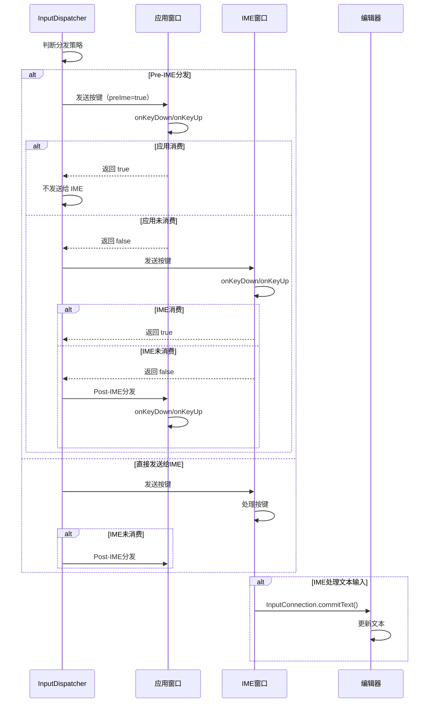

**分发策略**：

```cpp
// InputDispatcher.cpp
void InputDispatcher::dispatchKeyLocked(nsecs_t currentTime, KeyEntry* entry) {
    // 1. 查找焦点窗口
    sp<InputWindowHandle> focusedWindow = findFocusedWindowLocked();
    
    // 2. 查找 IME 窗口
    sp<InputWindowHandle> imeWindow = findImeWindowLocked();
    
    // 3. 判断分发策略
    if (imeWindow != nullptr && shouldSendToIme(focusedWindow, imeWindow, entry)) {
        // Pre-IME 分发：先发送给应用
        dispatchEventToWindowLocked(focusedWindow, entry, true);  // preIme = true
    } else {
        // 直接发送给 IME 或应用
        if (imeWindow != nullptr && imeWindow->getInfo()->receiveKeyEvent) {
            dispatchEventToWindowLocked(imeWindow, entry, false);
        } else {
            dispatchEventToWindowLocked(focusedWindow, entry, false);
        }
    }
}

bool InputDispatcher::shouldSendToIme(sp<InputWindowHandle> focusedWindow,
        sp<InputWindowHandle> imeWindow, KeyEntry* entry) {
    // IME 窗口存在且可见
    if (imeWindow == nullptr || !imeWindow->getInfo()->visible) {
        return false;
    }
    
    // 某些按键总是发送给 IME（如方向键、Back 键）
    if (entry->keyCode == AKEYCODE_DPAD_UP || 
        entry->keyCode == AKEYCODE_DPAD_DOWN ||
        entry->keyCode == AKEYCODE_BACK) {
        return false;  // 直接发送给 IME，不 Pre-IME
    }
    
    // 其他按键：应用可以请求 Pre-IME 分发
    return focusedWindow->getInfo()->receiveKeyEvent;
}
```

**Pre-IME 分发**：

```java
// View.java
@Override
public boolean onKeyDown(int keyCode, KeyEvent event) {
    // Pre-IME 分发：应用先处理
    if (keyCode == KeyEvent.KEYCODE_ENTER) {
        // 应用处理 Enter 键
        return true;  // 消费了，IME 不会收到
    }
    return super.onKeyDown(keyCode, event);
}
```

**IME 处理**：

```java
// InputMethodService.java
@Override
public boolean onKeyDown(int keyCode, KeyEvent event) {
    // IME 处理按键
    switch (keyCode) {
        case KeyEvent.KEYCODE_DPAD_UP:
            // 处理方向键（选择候选词）
            selectPreviousCandidate();
            return true;
        case KeyEvent.KEYCODE_BACK:
            // 处理返回键（关闭输入法）
            requestHideSelf(0);
            return true;
    }
    return super.onKeyDown(keyCode, event);
}
```

**InputConnection 通信**：

```java
// InputMethodService.java
public void commitText(CharSequence text, int newCursorPosition) {
    InputConnection ic = getCurrentInputConnection();
    if (ic != null) {
        // 通过 InputConnection 提交文本
        ic.commitText(text, newCursorPosition);
    }
}
```

**扩展**：
- Pre-IME 分发让应用优先处理按键
- Post-IME 分发让应用处理 IME 未处理的按键
- IME 通过 InputConnection 与编辑器通信，不直接发送按键事件

---

### 2.8 输入事件的批处理和合并机制是什么？

**答案**：

**输入事件的批处理和合并用于减少事件数量，提高性能**。

#### MotionEvent 批处理（Batching）

**批处理的作用**：
- 将多个触摸样本合并到一个 MotionEvent 中
- 减少事件数量，降低系统开销

**批处理实现**：

```cpp
// TouchInputMapper.cpp
void TouchInputMapper::process(const RawEvent* rawEvent) {
    // 收集触摸样本
    TouchSample sample;
    sample.x = rawEvent->x;
    sample.y = rawEvent->y;
    sample.time = rawEvent->when;
    
    mSamples.push_back(sample);
    
    // 检查是否需要立即发送
    if (shouldSendBatch()) {
        // 创建批处理的 MotionEvent
        MotionEvent* event = createMotionEvent();
        
        // 添加所有样本（包括历史样本）
        for (const TouchSample& sample : mSamples) {
            event->addSample(sample.time, sample.x, sample.y);
        }
        
        // 发送到 InputDispatcher
        getListener()->notifyMotion(event);
        
        mSamples.clear();
    }
}
```

**历史样本的使用**：

```java
// View.java
@Override
public boolean onTouchEvent(MotionEvent event) {
    // 获取当前坐标
    float x = event.getX();
    float y = event.getY();
    
    // 获取历史样本
    int historySize = event.getHistorySize();
    for (int i = 0; i < historySize; i++) {
        float historicalX = event.getHistoricalX(i);
        float historicalY = event.getHistoricalY(i);
        long historicalTime = event.getHistoricalEventTime(i);
        
        // 处理历史触摸点
        drawTouchPoint(historicalX, historicalY);
    }
    
    // 处理当前触摸点
    drawTouchPoint(x, y);
    
    return true;
}
```

#### 事件合并（Coalescing）

**合并机制**：

```cpp
// InputDispatcher.cpp
void InputDispatcher::coalesceMotionEventLocked(MotionEntry* motionEntry) {
    // 查找队列中相同设备的最后一个 MotionEntry
    MotionEntry* lastMotionEntry = findLastMotionEntryLocked(motionEntry->deviceId);
    
    if (lastMotionEntry != nullptr) {
        // 计算时间差
        nsecs_t timeDelta = motionEntry->eventTime - lastMotionEntry->eventTime;
        
        // 如果时间差 < 3ms，合并事件
        if (timeDelta < MOTION_SAMPLE_COALESCE_INTERVAL) {
            // 更新最后一个样本，而不是添加新样本
            lastMotionEntry->updateSample(motionEntry->eventTime,
                                         motionEntry->pointerCoords[0]);
            return;  // 不添加新事件
        }
    }
    
    // 时间差 >= 3ms，添加新样本
    mInboundQueue.enqueueAtTail(motionEntry);
}
```

**合并阈值**：
- **3ms**：`MOTION_SAMPLE_COALESCE_INTERVAL = 3 * 1000000LL` 纳秒
- 如果两个事件的时间差 < 3ms，合并为一个事件

**批处理 vs 合并**：

| 机制 | 作用 | 位置 | 影响 |
| :--- | :--- | :--- | :--- |
| **批处理（Batching）** | 将多个样本合并到一个 MotionEvent | InputReader | 减少事件数量 |
| **合并（Coalescing）** | 将时间相近的事件合并 | InputDispatcher | 减少队列大小 |

**扩展**：
- 批处理可能增加 0-16ms 延迟
- 合并可能增加 0-3ms 延迟
- 但整体性能提升明显

---

## 三、高级面试题

### 3.1 多点触控的处理机制是什么？

**答案**：

**多点触控通过 MotionEvent 的指针索引和指针 ID 机制处理**。

**关键概念**：

1. **指针索引（Pointer Index）**：
   - 当前事件中触摸点的索引（0, 1, 2, ...）
   - 通过 `getPointerId(index)` 获取指针 ID

2. **指针 ID（Pointer ID）**：
   - 触摸点的唯一标识（在整个手势过程中不变）
   - 通过 `getPointerId(index)` 获取

**处理机制**：

```java
// View.java
@Override
public boolean onTouchEvent(MotionEvent event) {
    int action = event.getActionMasked();
    int pointerIndex = event.getActionIndex();
    int pointerId = event.getPointerId(pointerIndex);
    
    switch (action) {
        case MotionEvent.ACTION_DOWN:
            // 第一个手指按下
            handlePointerDown(pointerId, event.getX(0), event.getY(0));
            break;
            
        case MotionEvent.ACTION_POINTER_DOWN:
            // 额外手指按下
            handlePointerDown(pointerId, 
                event.getX(pointerIndex), event.getY(pointerIndex));
            break;
            
        case MotionEvent.ACTION_MOVE:
            // 手指移动（可能多个手指）
            for (int i = 0; i < event.getPointerCount(); i++) {
                int id = event.getPointerId(i);
                handlePointerMove(id, event.getX(i), event.getY(i));
            }
            break;
            
        case MotionEvent.ACTION_POINTER_UP:
            // 额外手指抬起
            handlePointerUp(pointerId);
            break;
            
        case MotionEvent.ACTION_UP:
            // 最后一个手指抬起
            handlePointerUp(pointerId);
            break;
    }
    
    return true;
}
```

**手势识别示例**：

```java
// 缩放手势
public class ScaleGestureDetector {
    private float mFocusX, mFocusY;  // 焦点（两指中点）
    private float mCurrentSpan;      // 当前距离
    private float mPreviousSpan;     // 之前距离
    
    public boolean onTouchEvent(MotionEvent event) {
        if (event.getPointerCount() == 2) {
            // 计算两指距离
            float x1 = event.getX(0);
            float y1 = event.getY(0);
            float x2 = event.getX(1);
            float y2 = event.getY(1);
            
            mCurrentSpan = (float) Math.hypot(x2 - x1, y2 - y1);
            mFocusX = (x1 + x2) / 2;
            mFocusY = (y1 + y2) / 2;
            
            // 计算缩放比例
            float scale = mCurrentSpan / mPreviousSpan;
            
            // 通知监听器
            mListener.onScale(this, scale, mFocusX, mFocusY);
            
            mPreviousSpan = mCurrentSpan;
        }
    }
}
```

**扩展**：
- Android 支持最多 10 个触摸点
- 指针 ID 在整个手势过程中保持不变
- 指针索引可能变化（手指抬起后，其他手指的索引会变化）

---

### 3.2 输入事件预测的原理是什么？

**答案**：

**输入事件预测通过线性预测算法，预测下一个触摸点的位置**。

**预测算法**：

```cpp
// TouchInputMapper.cpp
TouchSample TouchInputMapper::predictNextSample(nsecs_t predictionTime) {
    if (mSamples.size() < 2) {
        return TouchSample();  // 样本不足，无法预测
    }
    
    // 使用线性预测
    const TouchSample& last = mSamples.back();
    const TouchSample& prev = mSamples[mSamples.size() - 2];
    
    // 计算速度
    nsecs_t timeDelta = last.time - prev.time;
    float vx = (last.x - prev.x) / timeDelta;
    float vy = (last.y - prev.y) / timeDelta;
    
    // 预测下一个位置
    nsecs_t predictDelta = predictionTime - last.time;
    float predictedX = last.x + vx * predictDelta;
    float predictedY = last.y + vy * predictDelta;
    
    return TouchSample(predictionTime, predictedX, predictedY);
}
```

**预测的应用**：

```cpp
// InputReader.cpp
void TouchInputMapper::predictAndSend(nsecs_t currentTime) {
    // 预测下一个 VSYNC 时的触摸位置
    nsecs_t nextVsyncTime = getNextVsyncTime();
    nsecs_t predictionTime = nextVsyncTime - currentTime;
    
    if (predictionTime > 0 && predictionTime < MAX_PREDICTION_TIME) {
        // 预测触摸位置
        TouchSample predicted = predictNextSample(predictionTime);
        
        // 添加到事件中
        mCurrentEvent->addPredictedSample(predicted);
    }
}
```

**预测的优势**：
- 减少输入延迟的感知
- 提高滑动流畅度
- 提前准备渲染内容

**扩展**：
- 预测时间通常 < 16ms（一个 VSYNC 周期）
- 预测可能不准确，需要应用处理
- 预测主要用于滑动场景

---

### 3.3 输入延迟优化的方法有哪些？

**答案**：

**输入延迟优化需要从多个方面入手**。

**优化方法**：

1. **减少批处理延迟**：
   ```cpp
   // 减少批处理阈值
   #define MAX_BATCH_TIME 8ms  // 从 16ms 减少到 8ms
   ```

2. **优化事件合并**：
   ```cpp
   // 减少合并阈值（可能增加事件数量）
   #define MOTION_SAMPLE_COALESCE_INTERVAL 2ms  // 从 3ms 减少到 2ms
   ```

3. **优化窗口匹配**：
   ```cpp
   // 缓存焦点窗口，减少查找时间
   sp<InputWindowHandle> mCachedFocusedWindow;
   ```

4. **VSYNC 对齐**：
   ```cpp
   // 输入事件与 VSYNC 对齐，减少等待时间
   nsecs_t nextVsyncTime = getNextVsyncTime();
   if (timeToVsync < VSYNC_WAIT_THRESHOLD) {
       waitForVsync();
   }
   ```

5. **应用层优化**：
   - 减少主线程阻塞
   - 异步处理非关键操作
   - 优化 View 树复杂度

**延迟分解和优化**：

| 阶段 | 典型延迟 | 优化方法 |
| :--- | :--- | :--- |
| **硬件延迟** | 1-5ms | 硬件优化（触摸屏响应速度） |
| **驱动延迟** | 0.5-2ms | 驱动优化（中断处理） |
| **EventHub 延迟** | 0.1-1ms | epoll 优化 |
| **InputReader 延迟** | 0.5-3ms | 批处理优化、事件合并 |
| **InputDispatcher 延迟** | 0.5-2ms | 队列优化、窗口匹配优化 |
| **应用延迟** | 可变 | 主线程优化、异步处理 |

**扩展**：
- 总延迟通常 3-15ms（不包括应用处理时间）
- 应用处理时间是最大的延迟来源
- 优化需要权衡性能和功耗

---

### 3.4 系统级按键拦截的实现是什么？

**答案**：

**系统级按键拦截通过 `interceptKeyBeforeQueueing()` 实现**。

**拦截机制**：

```java
// PhoneWindowManager.java
@Override
public int interceptKeyBeforeQueueing(KeyEvent event, int policyFlags) {
    int keyCode = event.getKeyCode();
    
    // 拦截电源键
    if (keyCode == KeyEvent.KEYCODE_POWER) {
        if (event.getAction() == KeyEvent.ACTION_DOWN) {
            // 处理电源键（锁屏、关机菜单等）
            handlePowerKey(event);
            return WindowManagerPolicy.INTERCEPT_KEY_RESULT_SKIP;  // 跳过，不发送给应用
        }
    }
    
    // 拦截音量键
    if (keyCode == KeyEvent.KEYCODE_VOLUME_UP || 
        keyCode == KeyEvent.KEYCODE_VOLUME_DOWN) {
        // 处理音量键
        handleVolumeKey(event);
        return WindowManagerPolicy.INTERCEPT_KEY_RESULT_SKIP;
    }
    
    // 拦截 Home 键（某些情况下）
    if (keyCode == KeyEvent.KEYCODE_HOME) {
        if (isKeyguardShowing()) {
            // 锁屏时拦截 Home 键
            return WindowManagerPolicy.INTERCEPT_KEY_RESULT_SKIP;
        }
    }
    
    return WindowManagerPolicy.INTERCEPT_KEY_RESULT_CONTINUE;  // 继续，发送给应用
}
```

**拦截流程**：

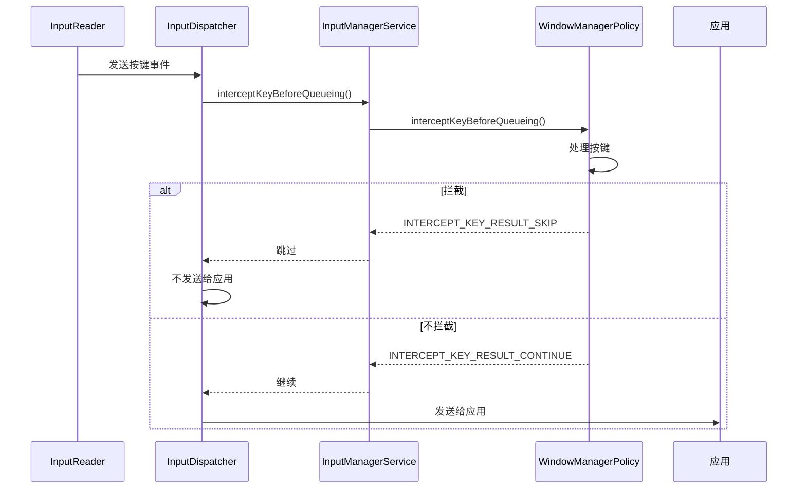

**拦截返回值**：

| 返回值 | 说明 | 行为 |
| :--- | :--- | :--- |
| `INTERCEPT_KEY_RESULT_SKIP` | 拦截按键 | 不发送给应用 |
| `INTERCEPT_KEY_RESULT_CONTINUE` | 不拦截按键 | 发送给应用 |
| `INTERCEPT_KEY_RESULT_TRY_AGAIN_LATER` | 稍后重试 | 延迟处理 |

**扩展**：
- 拦截发生在事件入队之前
- 拦截是系统级行为，应用无法绕过
- 拦截主要用于系统功能键

---

### 3.5 InputDispatcher 与 InputMethod 的交互机制是什么？

**答案**：

**InputDispatcher 通过 Pre-IME 和 Post-IME 分发机制与 InputMethod 交互**。

**交互流程**：

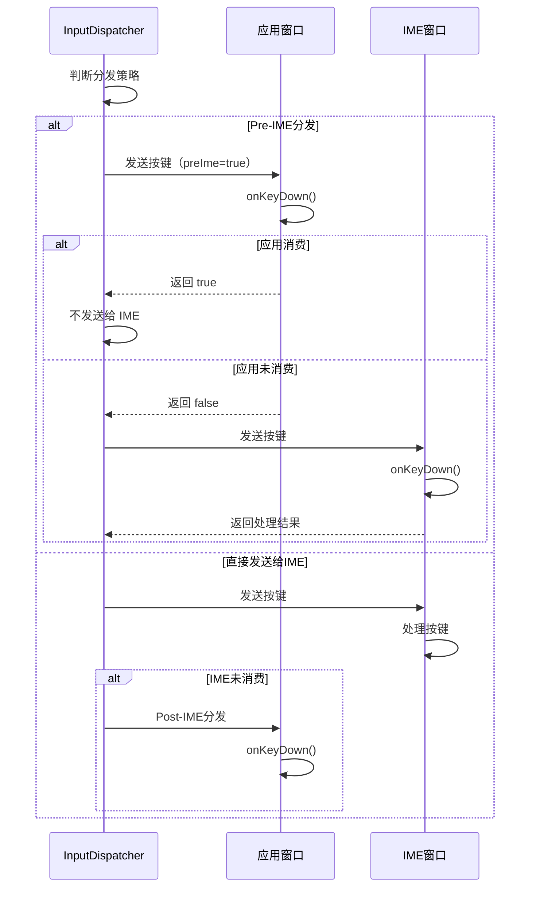

**分发策略判断**：

```cpp
// InputDispatcher.cpp
bool InputDispatcher::shouldSendToIme(sp<InputWindowHandle> focusedWindow,
        sp<InputWindowHandle> imeWindow, KeyEntry* entry) {
    // IME 窗口存在且可见
    if (imeWindow == nullptr || !imeWindow->getInfo()->visible) {
        return false;
    }
    
    // 某些按键总是发送给 IME（如方向键、Back 键）
    if (entry->keyCode == AKEYCODE_DPAD_UP || 
        entry->keyCode == AKEYCODE_DPAD_DOWN ||
        entry->keyCode == AKEYCODE_BACK) {
        return false;  // 直接发送给 IME，不 Pre-IME
    }
    
    // 其他按键：应用可以请求 Pre-IME 分发
    return focusedWindow->getInfo()->receiveKeyEvent;
}
```

**Pre-IME vs Post-IME**：

| 分发方式 | 顺序 | 说明 |
| :--- | :--- | :--- |
| **Pre-IME** | 应用 → IME | 应用优先处理，未消费时 IME 处理 |
| **Post-IME** | IME → 应用 | IME 优先处理，未消费时应用处理 |

**扩展**：
- Pre-IME 用于应用自定义按键处理
- Post-IME 用于 IME 处理特殊按键
- IME 通过 InputConnection 与编辑器通信，不直接发送按键事件

---

### 3.6 Pre-IME 和 Post-IME 分发的区别是什么？

**答案**：

**Pre-IME 和 Post-IME 的区别在于按键事件的处理顺序**。

**Pre-IME 分发**：

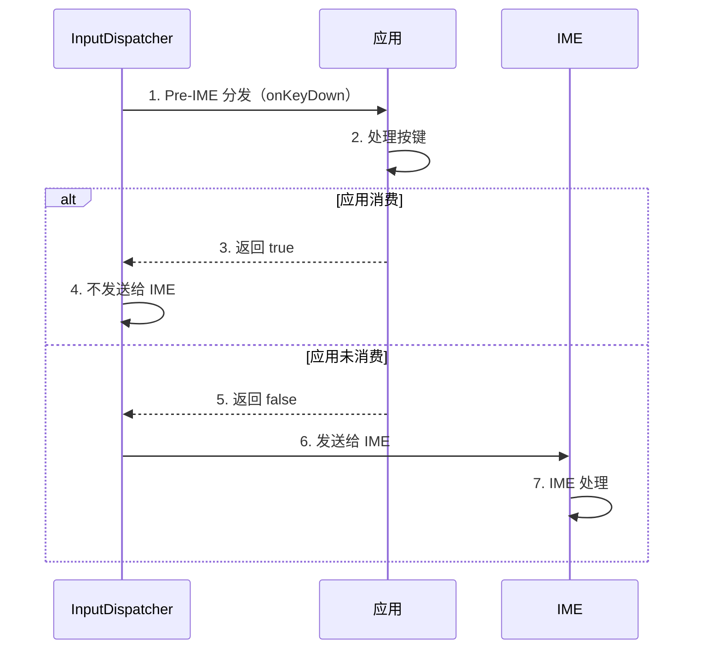

**特点**：
- 应用优先处理按键
- 如果应用消费了，IME 不会收到
- 用于应用自定义按键处理

**Post-IME 分发**：

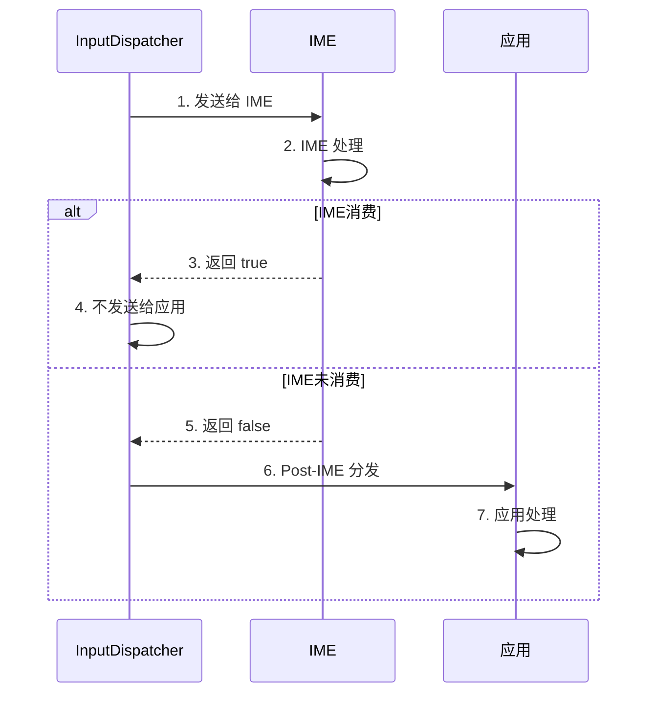

**特点**：
- IME 优先处理按键
- 如果 IME 未消费，应用可以处理
- 用于 IME 处理特殊按键（如方向键、Back 键）

**使用场景**：

| 场景 | 分发方式 | 说明 |
| :--- | :--- | :--- |
| **应用自定义按键** | Pre-IME | 应用优先处理（如游戏控制） |
| **IME 特殊按键** | Post-IME | IME 优先处理（如方向键选择候选词） |
| **普通文本输入** | InputConnection | IME 通过 InputConnection 提交文本 |

**扩展**：
- Pre-IME 和 Post-IME 是按键事件的分发方式
- 文本输入通过 InputConnection，不经过按键分发
- 应用可以通过 `setOnKeyPreImeListener()` 监听 Pre-IME 事件

---

### 3.7 InputConnection 的作用和实现原理是什么？

**答案**：

**InputConnection 是 IME 与编辑器通信的接口**，用于文本编辑操作。

**作用**：

1. **文本编辑**：
   - `commitText()`：提交文本
   - `setComposingText()`：设置组合文本
   - `deleteSurroundingText()`：删除文本

2. **选择操作**：
   - `setSelection()`：设置选择
   - `getSelectedText()`：获取选中文本

3. **查询操作**：
   - `getTextBeforeCursor()`：获取光标前文本
   - `getTextAfterCursor()`：获取光标后文本

**实现原理**：

```java
// BaseInputConnection.java
public class BaseInputConnection implements InputConnection {
    private final View mTargetView;
    
    @Override
    public boolean commitText(CharSequence text, int newCursorPosition) {
        // 通过 Binder 调用编辑器的 commitText
        return mTargetView.onCommitText(text, newCursorPosition);
    }
    
    @Override
    public boolean setComposingText(CharSequence text, int newCursorPosition) {
        // 设置组合文本（带下划线）
        return mTargetView.onSetComposingText(text, newCursorPosition);
    }
}
```

**通信流程**：

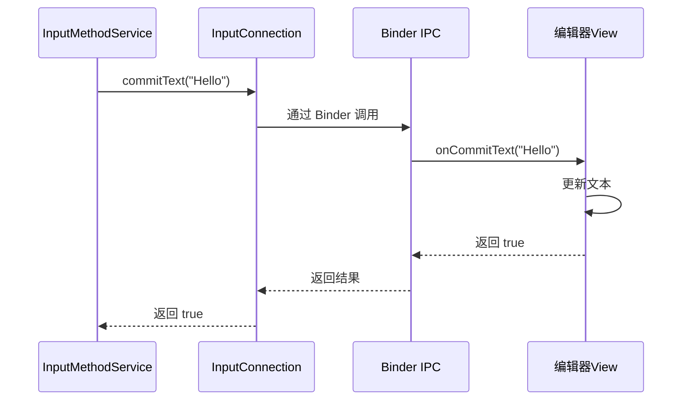

**InputConnection 的创建**：

```java
// EditText.java
@Override
public InputConnection onCreateInputConnection(EditorInfo outAttrs) {
    // 创建 InputConnection
    return new BaseInputConnection(this, false);
}
```

**扩展**：
- InputConnection 基于 Binder IPC
- 支持异步操作
- 编辑器必须正确处理 InputConnection 的方法

---

### 3.8 输入事件与 VSYNC 的同步机制是什么？

**答案**：

**输入事件与 VSYNC 同步，减少输入到显示的延迟**。

**同步机制**：

```cpp
// InputDispatcher.cpp
void InputDispatcher::dispatchOnceInnerLocked(nsecs_t* nextWakeupTime) {
    nsecs_t currentTime = now();
    nsecs_t nextVsyncTime = getNextVsyncTime();
    
    // 如果距离下一个 VSYNC 很近，等待 VSYNC
    nsecs_t timeToVsync = nextVsyncTime - currentTime;
    if (timeToVsync > 0 && timeToVsync < VSYNC_WAIT_THRESHOLD) {
        *nextWakeupTime = nextVsyncTime;
        return;  // 等待 VSYNC
    }
    
    // 否则立即分发
    dispatchPendingEventsLocked();
}
```

**同步的优势**：
- 输入事件和渲染在同一 VSYNC 周期
- 减少输入到显示的延迟
- 提高响应速度

**批处理模式 vs 非批处理模式**：

| 模式 | 行为 | 延迟 | 稳定性 |
| :--- | :--- | :--- | :--- |
| **批处理模式** | 事件等待 VSYNC 再分发 | 较高 | 更稳定 |
| **非批处理模式** | 事件立即分发 | 较低 | 可能不稳定 |

**VSYNC 偏移**：

```cpp
// InputDispatcher.cpp
nsecs_t InputDispatcher::getInputVsyncOffset() {
    // 输入事件的 VSYNC 偏移
    // 提前接收 VSYNC，给应用更多时间处理
    return VSYNC_EVENT_PHASE_OFFSET_NS;
}
```

**扩展**：
- VSYNC 同步可以减少输入延迟
- 批处理模式可能增加延迟，但更稳定
- VSYNC 偏移可以优化延迟

---

### 3.9 多显示器下的输入路由是什么？

**答案**：

**多显示器下的输入路由通过设备与显示器的关联实现**。

**关联方式**：

1. **物理端口关联**：
   - USB 端口与 HDMI 端口关联
   - 触摸屏控制器与显示器关联

2. **配置文件关联**：
   ```xml
   <!-- input_device_associations.xml -->
   <input-device-association>
       <input-device name="touchscreen0" />
       <display port="0" />
   </input-device-association>
   ```

3. **动态关联**：
   ```java
   // InputManagerService.java
   public void setInputDeviceAssociation(int deviceId, int displayId) {
       nativeSetInputDeviceAssociation(mPtr, deviceId, displayId);
   }
   ```

**路由机制**：

```java
// WindowManagerService.java
void updateInputWindowsLw(boolean force) {
    // 为每个显示器更新输入窗口
    for (DisplayContent display : mDisplays) {
        List<InputWindowHandle> windowHandles = new ArrayList<>();
        
        // 收集该显示器上的所有窗口
        for (WindowState w : display.getWindows()) {
            if (w.canReceiveInput()) {
                // 设置窗口所属的显示器
                w.mInputWindowHandle.displayId = display.getDisplayId();
                windowHandles.add(w.mInputWindowHandle);
            }
        }
        
        // 更新到 InputManagerService
        mInputManager.setInputWindows(display.getDisplayId(), windowHandles);
    }
}
```

**路由规则**：
- 触摸事件根据设备关联的显示器路由
- 按键事件根据焦点窗口的显示器路由
- 每个显示器有独立的窗口列表和焦点

**扩展**：
- Android 10+ 支持输入设备与显示器的关联
- 关联可以通过配置文件或 API 设置
- 多显示器场景下，输入路由很重要

---

## 四、实战问题

### 4.1 如何实现自定义手势识别？

**答案**：

**实现自定义手势识别需要处理多点触控事件**。

**实现步骤**：

1. **创建手势检测器**：
   ```java
   public class CustomGestureDetector {
       private OnGestureListener mListener;
       
       public boolean onTouchEvent(MotionEvent event) {
           int action = event.getActionMasked();
           
           switch (action) {
               case MotionEvent.ACTION_DOWN:
                   handleDown(event);
                   break;
               case MotionEvent.ACTION_MOVE:
                   handleMove(event);
                   break;
               case MotionEvent.ACTION_UP:
                   handleUp(event);
                   break;
           }
           
           return true;
       }
   }
   ```

2. **识别手势**：
   ```java
   private void handleMove(MotionEvent event) {
       if (event.getPointerCount() == 2) {
           // 两指手势
           float x1 = event.getX(0);
           float y1 = event.getY(0);
           float x2 = event.getX(1);
           float y2 = event.getY(1);
           
           // 计算距离（缩放）
           float distance = (float) Math.hypot(x2 - x1, y2 - y1);
           
           // 计算角度（旋转）
           float angle = (float) Math.atan2(y2 - y1, x2 - x1);
           
           // 通知监听器
           mListener.onGesture(distance, angle);
       }
   }
   ```

3. **使用手势检测器**：
   ```java
   @Override
   public boolean onTouchEvent(MotionEvent event) {
       return mGestureDetector.onTouchEvent(event);
   }
   ```

---

### 4.2 输入性能问题的分析方法是什么？

**答案**：

**使用多种工具综合分析输入性能问题**。

**分析步骤**：

1. **使用 systrace 分析**：
   ```bash
   python systrace.py -t 10 -o trace.html input view gfx
   ```

2. **查看关键指标**：
   - InputReader → InputDispatcher 延迟
   - InputDispatcher → 应用延迟
   - 应用处理延迟

3. **使用 dumpsys 查看状态**：
   ```bash
   adb shell dumpsys input
   ```

4. **代码埋点**：
   ```java
   @Override
   public boolean onTouchEvent(MotionEvent event) {
       long startTime = System.nanoTime();
       
       // 处理事件
       boolean result = handleTouch(event);
       
       long duration = System.nanoTime() - startTime;
       if (duration > 16_000_000) {  // > 16ms
           Log.w(TAG, "Touch event handling took " + duration / 1_000_000 + "ms");
       }
       
       return result;
   }
   ```

---

### 4.3 如何处理输入事件冲突？

**答案**：

**通过事件分发机制和优先级处理输入事件冲突**。

**处理方法**：

1. **ViewGroup 拦截**：
   ```java
   @Override
   public boolean onInterceptTouchEvent(MotionEvent ev) {
       // 根据条件决定是否拦截
       if (shouldIntercept(ev)) {
           return true;  // 拦截，子 View 不会收到
       }
       return false;
   }
   ```

2. **设置优先级**：
   ```java
   // 设置 OnTouchListener，优先处理
   view.setOnTouchListener(new View.OnTouchListener() {
       @Override
       public boolean onTouch(View v, MotionEvent event) {
           // 优先处理
           return true;  // 消费事件，onTouchEvent 不会调用
       }
   });
   ```

3. **自定义分发逻辑**：
   ```java
   @Override
   public boolean dispatchTouchEvent(MotionEvent ev) {
       // 自定义分发逻辑
       if (shouldHandle(ev)) {
           return onTouchEvent(ev);
       } else {
           return super.dispatchTouchEvent(ev);
       }
   }
   ```

---

### 4.4 如何测量输入延迟？

**答案**：

**使用 WALT 工具或代码埋点测量输入延迟**。

**WALT 工具**：

- 硬件工具，测量触摸到显示的延迟
- 使用加速度计检测触摸
- 使用光电二极管检测显示

**代码埋点**：

```java
// 在 onTouchEvent 中埋点
@Override
public boolean onTouchEvent(MotionEvent event) {
    // 获取事件时间戳
    long eventTime = event.getEventTime();
    
    // 获取当前时间
    long currentTime = SystemClock.uptimeMillis();
    
    // 计算延迟
    long latency = currentTime - eventTime;
    
    if (latency > 16) {  // > 16ms
        Log.w(TAG, "Input latency: " + latency + "ms");
    }
    
    return true;
}
```

**systrace 分析**：

```bash
# 捕获输入相关的 trace
python systrace.py -t 10 -o trace.html input view gfx

# 分析关键时间点
# - InputReader 接收事件时间
# - InputDispatcher 分发事件时间
# - 应用接收事件时间
# - 应用处理事件时间
```

---

### 4.5 如何实现输入事件的记录和重放？

**答案**：

**使用 getevent 记录，使用 sendevent 重放**。

**记录事件**：

```bash
# 使用 getevent 记录
adb shell getevent -t > events.log

# 记录特定设备
adb shell getevent -t /dev/input/event0 > touch_events.log
```

**重放事件**：

```bash
# 使用 sendevent 重放
adb shell sendevent < events.log

# 或使用 input 命令
adb shell input replay events.log
```

**自动化测试**：

```java
// 使用 Instrumentation 注入事件
Instrumentation inst = getInstrumentation();
inst.sendPointerSync(MotionEvent.obtain(
    SystemClock.uptimeMillis(),
    SystemClock.uptimeMillis(),
    MotionEvent.ACTION_DOWN,
    x, y, 0));
```

---

## 五、总结

### 5.1 核心知识点

1. **输入系统架构**：五层架构（应用层、Framework 层、Native 层、HAL 层、Kernel 层）
2. **核心组件**：InputManagerService、InputReader、InputDispatcher、EventHub、InputChannel
3. **事件流程**：从硬件到应用的完整流程
4. **事件分发**：View 树的事件分发机制
5. **ANR 机制**：Input ANR 分类、监控、触发
6. **焦点管理**：窗口焦点、应用焦点
7. **IME 交互**：Pre-IME、Post-IME、InputConnection
8. **性能优化**：延迟优化、批处理、VSYNC 同步

### 5.2 面试重点

- **基础**：InputManagerService、InputReader、InputDispatcher 的区别
- **进阶**：输入事件流程、ANR 机制、焦点管理、IME 交互
- **高级**：多点触控、事件预测、性能优化、VSYNC 同步

### 5.3 实战能力

- 实现自定义手势识别
- 分析输入性能问题
- 处理输入事件冲突
- 测量输入延迟
- 记录和重放输入事件

---

**提示**：输入系统是 Android 系统的核心，理解输入系统是深入理解 Android 系统的基础。建议结合实际项目经验，不断加深理解。
