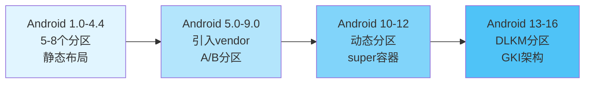
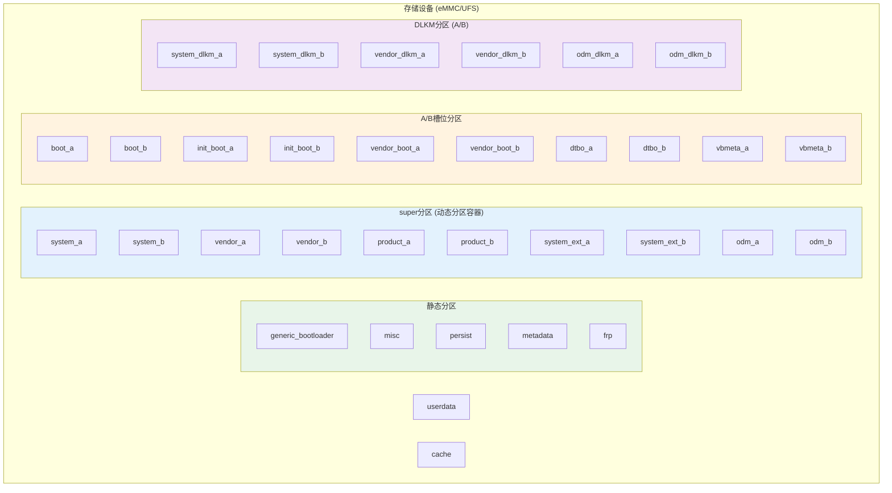
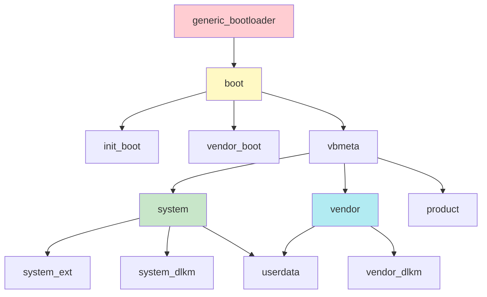

# Android 分区系统概述

## 📋 目录

1. [分区系统的基本概念](#1-分区系统的基本概念)
2. [Android分区系统的历史演进](#2-android分区系统的历史演进)
3. [分区与文件系统的关系](#3-分区与文件系统的关系)
4. [分区命名规则和约定](#4-分区命名规则和约定)
5. [分区系统架构](#5-分区系统架构)

---

## 1. 分区系统的基本概念

### 1.1 什么是分区（Partition）

**分区**是存储设备（如eMMC、UFS、NVMe）上的逻辑划分区域，每个分区可以：
- 独立格式化文件系统
- 独立挂载和使用
- 独立更新和维护
- 设置不同的访问权限

### 1.2 为什么需要分区

Android系统使用分区系统的主要原因：

1. **功能隔离**：不同功能模块分离，互不影响
2. **安全隔离**：系统分区只读，防止被恶意修改
3. **更新便利**：可以单独更新某个分区，无需重刷整个系统
4. **性能优化**：不同分区可以使用不同的文件系统
5. **故障恢复**：某个分区损坏不影响其他分区

### 1.3 分区 vs 目录的区别

| 特性 | 分区 | 目录 |
|------|------|------|
| **存储位置** | 物理/逻辑存储区域 | 文件系统中的路径 |
| **文件系统** | 每个分区独立文件系统 | 共享父目录的文件系统 |
| **挂载** | 需要挂载才能访问 | 直接访问 |
| **更新** | 可以独立更新 | 需要更新整个文件系统 |
| **权限** | 分区级别权限控制 | 文件系统权限控制 |

---

## 2. Android分区系统的历史演进

### 2.1 Android 早期版本（1.0 - 4.4）

**特点**：
- 分区数量少（5-8个）
- 静态分区布局
- 简单的分区结构

**主要分区**：
```
boot        - 内核和ramdisk
system      - 系统文件
userdata    - 用户数据
cache       - 缓存
recovery    - 恢复模式
```

### 2.2 Android 5.0 - 9.0（Lollipop - Pie）

**重要变化**：
- 引入 **vendor分区**（Android 8.0）
- 引入 **A/B分区系统**（Android 7.0）
- 引入 **Treble架构**（Android 8.0）

**新增分区**：
```
vendor      - 供应商代码和HAL
boot_a/boot_b  - A/B槽位支持
system_a/system_b
```

### 2.3 Android 10 - 12

**重要变化**：
- 引入 **动态分区（Dynamic Partitions）**
- 引入 **super分区**作为容器
- 引入 **product分区**和 **system_ext分区**
- 引入 **vendor_boot分区**（Android 11）

**新增分区**：
```
super       - 动态分区容器
product     - 产品特定模块
system_ext  - 系统扩展
vendor_boot - 供应商启动分区
```

### 2.4 Android 13 - 16（当前）

**重要变化**：
- 引入 **init_boot分区**（分离通用ramdisk）
- 引入 **DLKM分区**（system_dlkm, vendor_dlkm, odm_dlkm）
- 完善 **GKI架构**支持
- 增强 **AVB验证**机制

**新增分区**：
```
init_boot       - 通用ramdisk（Android 13+）
system_dlkm     - 系统内核模块
vendor_dlkm     - 供应商内核模块
odm_dlkm        - ODM内核模块
```

### 2.5 演进趋势总结



---

## 3. 分区与文件系统的关系

### 3.1 分区、文件系统、挂载点的关系

```
存储设备（eMMC/UFS）
    ↓
分区（Partition）- 逻辑划分
    ↓
文件系统（File System）- 格式化
    ↓
挂载点（Mount Point）- 访问路径
```

### 3.2 Android常用文件系统

| 文件系统 | 用途 | 特点 |
|---------|------|------|
| **ext4** | system, vendor, product等 | 成熟稳定，支持日志 |
| **erofs** | system, vendor（Android 9+） | 只读，压缩率高 |
| **f2fs** | userdata, cache | 针对闪存优化 |
| **squashfs** | 某些只读分区 | 压缩只读文件系统 |
| **vfat** | 某些特殊分区 | FAT32格式 |

### 3.3 分区文件系统选择原则

1. **只读分区**（system, vendor等）：
   - 优先使用 **erofs**（压缩率高，性能好）
   - 或使用 **ext4**（兼容性好）

2. **读写分区**（userdata, cache）：
   - 使用 **f2fs**（针对闪存优化）
   - 或使用 **ext4**（稳定可靠）

3. **启动分区**（boot, vendor_boot）：
   - 使用特殊格式（boot.img格式）
   - 不是传统文件系统

### 3.4 分区挂载示例

```bash
# 查看分区挂载信息
adb shell mount | grep -E "system|vendor|product"

# 输出示例：
# /dev/block/dm-0 on /system type erofs (ro,seclabel,relatime)
# /dev/block/dm-1 on /vendor type erofs (ro,seclabel,relatime)
# /dev/block/dm-2 on /product type ext4 (ro,seclabel,relatime)
```

---

## 4. 分区命名规则和约定

### 4.1 分区命名方式

Android设备上的分区可以通过多种方式访问：

#### 方式1：通过设备节点（/dev/block/）

```bash
# 查看所有块设备
adb shell ls -l /dev/block/

# 示例输出：
# lrwxrwxrwx 1 root root 21 2024-01-01 10:00 boot -> /dev/block/sda1
# lrwxrwxrwx 1 root root 21 2024-01-01 10:00 system -> /dev/block/sda2
```

#### 方式2：通过by-name符号链接（推荐）

```bash
# 查看所有分区
adb shell ls -l /dev/block/by-name/

# 示例输出：
# lrwxrwxrwx 1 root root 21 2024-01-01 10:00 boot -> /dev/block/sda1
# lrwxrwxrwx 1 root root 21 2024-01-01 10:00 system_a -> /dev/block/sda2
# lrwxrwxrwx 1 root root 21 2024-01-01 10:00 system_b -> /dev/block/sda3
```

#### 方式3：通过平台路径

```bash
# 某些设备
/dev/block/platform/soc/by-name/boot
```

### 4.2 A/B分区命名规则

对于支持A/B分区的设备，分区命名规则：

**格式**：`{partition_name}_{slot}`

**示例**：
- `boot_a` / `boot_b` - boot分区的A槽和B槽
- `system_a` / `system_b` - system分区的A槽和B槽
- `vendor_a` / `vendor_b` - vendor分区的A槽和B槽

**当前活动槽位**：
- 通过 `getprop ro.boot.slot_suffix` 查看
- 输出：`_a` 或 `_b`

### 4.3 分区命名约定

| 分区类型 | 命名规则 | 示例 |
|---------|---------|------|
| **启动分区** | 小写，下划线分隔 | `boot`, `vendor_boot`, `init_boot` |
| **系统分区** | 小写 | `system`, `system_ext`, `product` |
| **供应商分区** | 小写 | `vendor`, `odm` |
| **DLKM分区** | 小写，下划线分隔 | `system_dlkm`, `vendor_dlkm` |
| **验证分区** | 小写，下划线分隔 | `vbmeta`, `vbmeta_system` |
| **数据分区** | 小写 | `userdata`, `cache`, `metadata` |

### 4.4 镜像文件命名规则

镜像文件通常与分区名对应，但使用 `.img` 扩展名：

| 分区名 | 镜像文件名 |
|--------|-----------|
| `boot` | `boot.img` |
| `system` | `system.img` |
| `vendor` | `vendor.img` |
| `system_ext` | `system_ext.img` |

**注意**：某些镜像可能是sparse格式，文件名可能包含 `-sparse` 后缀。

---

## 5. 分区系统架构

### 5.1 Android 16 分区架构概览



### 5.2 分区分类

#### 5.2.1 按功能分类

1. **启动相关分区**：
   - `boot`, `init_boot`, `vendor_boot`, `dtbo`
   - `generic_bootloader`

2. **系统分区**：
   - `system`, `system_ext`, `product`

3. **供应商分区**：
   - `vendor`, `odm`

4. **内核模块分区**：
   - `system_dlkm`, `vendor_dlkm`, `odm_dlkm`

5. **验证分区**：
   - `vbmeta`, `vbmeta_system`, `vbmeta_vendor`, `vbmeta_vendor_dlkm`

6. **数据分区**：
   - `userdata`, `cache`, `metadata`, `misc`, `persist`, `frp`

7. **特殊分区**：
   - `recovery`, `super`

#### 5.2.2 按更新方式分类

1. **可OTA更新分区**（A/B槽位）：
   - 所有系统分区、启动分区、DLKM分区

2. **不可更新分区**：
   - `generic_bootloader`（需要特殊工具）

3. **条件更新分区**：
   - `userdata`（会丢失数据）
   - `vbmeta`（需要签名）

#### 5.2.3 按访问权限分类

1. **只读分区**：
   - `system`, `vendor`, `product`, `system_ext`, `odm`
   - 所有启动分区

2. **读写分区**：
   - `userdata`, `cache`, `metadata`, `misc`, `persist`

### 5.3 分区依赖关系



---

## 总结

Android分区系统是一个复杂而精密的架构，它：

1. **实现了功能隔离**：不同模块分离，互不影响
2. **支持灵活更新**：A/B分区和动态分区支持无缝更新
3. **保障系统安全**：只读分区和AVB验证防止恶意修改
4. **优化存储利用**：动态分区可以根据需要调整大小

**下一步学习**：
- 详细了解每个分区的具体作用，请阅读 [分区类型详解](02_Partition_Types_And_Details.md)
- 了解分区布局和结构，请阅读 [分区布局和结构](03_Partition_Layout_And_Structure.md)
