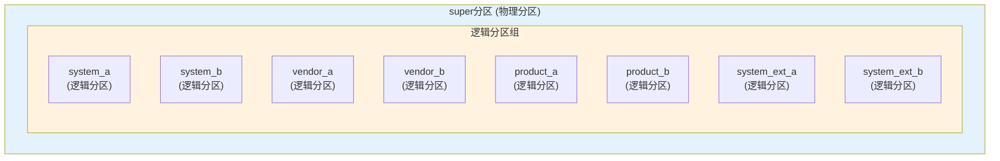
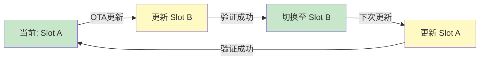

# 分区布局和结构

## 📋 目录

1. [分区表格式](#1-分区表格式)
2. [动态分区系统](#2-动态分区系统)
3. [分区布局示例](#3-分区布局示例)
4. [分区大小规划](#4-分区大小规划)
5. [分区对齐要求](#5-分区对齐要求)
6. [分区命名规则](#6-分区命名规则)
7. [A/B槽位物理布局](#7-ab槽位物理布局)

---

## 1. 分区表格式

### 1.1 GPT vs MBR

Android 设备主要使用 **GPT（GUID Partition Table）** 分区表：

| 特性 | GPT | MBR |
|------|-----|-----|
| **最大分区数** | 128（标准）或更多 | 4个主分区 |
| **最大分区大小** | 9.4 ZB | 2 TB |
| **备份** | 有分区表备份 | 无备份 |
| **Android使用** | ✅ 标准 | ❌ 已弃用 |

### 1.2 GPT 结构

GPT 分区表包含以下部分：

```
存储设备布局：
┌─────────────────────────────────────┐
│  Protective MBR (LBA 0)             │  ← 兼容MBR
├─────────────────────────────────────┤
│  Primary GPT Header (LBA 1)         │  ← GPT表头
├─────────────────────────────────────┤
│  Primary Partition Entries          │  ← 分区条目（LBA 2-33）
│  (128 entries × 128 bytes)          │
├─────────────────────────────────────┤
│  实际分区数据                        │
│  (system, vendor, userdata等)       │
├─────────────────────────────────────┤
│  Backup Partition Entries           │  ← 备份分区条目
├─────────────────────────────────────┤
│  Backup GPT Header                  │  ← 备份GPT表头
└─────────────────────────────────────┘
```

### 1.3 查看分区表

```bash
# 使用gdisk查看GPT分区表
adb shell gdisk -l /dev/block/sda

# 使用parted查看
adb shell parted /dev/block/sda print

# 查看分区UUID
adb shell blkid
```

---

## 2. 动态分区系统

### 2.1 动态分区概述

**动态分区（Dynamic Partitions）** 是 Android 10+ 引入的新分区系统：

**特点**：
- 使用 `super` 分区作为容器
- 内部包含多个逻辑分区
- 支持动态调整分区大小
- 支持更灵活的 OTA 更新

### 2.2 super 分区结构



### 2.3 逻辑分区 vs 物理分区

| 特性 | 物理分区 | 逻辑分区 |
|------|---------|---------|
| **位置** | 直接在存储设备上 | 在super分区内 |
| **大小** | 固定大小 | 可以动态调整 |
| **创建** | 分区表定义 | 动态创建 |
| **更新** | 需要重新分区 | 可以动态调整 |
| **示例** | boot, userdata | system, vendor（在super中） |

### 2.4 动态分区优势

1. **灵活的大小调整**：
   - OTA更新时可以调整分区大小
   - 不需要预先分配固定大小

2. **更好的空间利用**：
   - 多个逻辑分区共享super分区空间
   - 避免空间浪费

3. **简化的OTA更新**：
   - 可以添加或删除逻辑分区
   - 不需要修改分区表

### 2.5 动态分区工具

```bash
# 创建super分区镜像
lpmake --device-size 8G \
       --metadata-size 65536 \
       --metadata-slots 2 \
       --partition system_a:readonly:2G:group_a \
       --partition system_b:readonly:2G:group_b \
       --partition vendor_a:readonly:512M:group_a \
       --partition vendor_b:readonly:512M:group_b \
       --group group_a:2.5G \
       --group group_b:2.5G \
       --sparse \
       --output super.img

# 查看super分区内容
lpdump super.img

# 在设备上查看（需要root）
adb shell lpdump /dev/block/by-name/super
```

---

## 3. 分区布局示例

### 3.1 典型 Android 16 设备布局

```
存储设备 (64GB eMMC)
├── [0-1MB]        Protective MBR + GPT Header
├── [1-2MB]        generic_bootloader
├── [2-34MB]       boot_a (32MB)
├── [34-66MB]      boot_b (32MB)
├── [66-98MB]      init_boot_a (32MB)
├── [98-130MB]     init_boot_b (32MB)
├── [130-194MB]     vendor_boot_a (64MB)
├── [194-258MB]    vendor_boot_b (64MB)
├── [258-266MB]    dtbo_a (8MB)
├── [266-274MB]    dtbo_b (8MB)
├── [274-338MB]    vbmeta_a (64MB)
├── [338-402MB]    vbmeta_b (64MB)
├── [402-466MB]    vbmeta_system_a (64MB)
├── [466-530MB]    vbmeta_system_b (64MB)
├── [530-594MB]    vbmeta_vendor_a (64MB)
├── [594-658MB]    vbmeta_vendor_b (64MB)
├── [658-722MB]    vbmeta_vendor_dlkm_a (64MB)
├── [722-786MB]    vbmeta_vendor_dlkm_b (64MB)
├── [786-850MB]    misc (64MB)
├── [850-914MB]    persist (64MB)
├── [914-978MB]    metadata (64MB)
├── [978-1042MB]   frp (64MB)
├── [1042-18GB]    super (16GB) ← 动态分区容器
│   ├── system_a (3GB)
│   ├── system_b (3GB)
│   ├── vendor_a (512MB)
│   ├── vendor_b (512MB)
│   ├── product_a (512MB)
│   ├── product_b (512MB)
│   ├── system_ext_a (256MB)
│   ├── system_ext_b (256MB)
│   ├── system_dlkm_a (32MB)
│   ├── system_dlkm_b (32MB)
│   ├── vendor_dlkm_a (64MB)
│   ├── vendor_dlkm_b (64MB)
│   └── (剩余空间可用于调整)
├── [18-19GB]      cache (1GB) - 可选
└── [19-64GB]      userdata (45GB)
```

### 3.2 不同厂商的布局差异

#### Google Pixel 设备

```
- 使用动态分区
- super分区包含所有系统分区
- 没有独立的recovery分区（使用boot）
- 没有cache分区（使用userdata）
```

#### Samsung 设备

```
- 可能有额外的OEM分区
- 可能有Knox相关分区
- 分区命名可能不同
```

#### Xiaomi 设备

```
- 可能有MIUI特定分区
- 可能有cust分区
```

---

## 4. 分区大小规划

### 4.1 分区大小计算原则

1. **系统分区**：
   - 基于实际编译产物大小
   - 预留20-30%的余量用于更新

2. **数据分区**：
   - 尽可能大（用户数据）
   - 通常是设备上最大的分区

3. **启动分区**：
   - 基于内核和ramdisk大小
   - 预留压缩后的空间

### 4.2 各分区大小估算

| 分区 | 估算方法 | 典型大小 |
|------|---------|---------|
| **system** | 编译产物大小 × 1.3 | 2-4GB |
| **vendor** | HAL和二进制大小 × 1.2 | 200MB-1GB |
| **product** | 产品模块大小 × 1.2 | 200MB-1GB |
| **boot** | 内核+ramdisk压缩后 | 32-128MB |
| **userdata** | 总容量 - 其他分区 | 16GB-512GB+ |

### 4.3 动态分区大小规划

对于super分区：

```bash
# 计算所需空间
system_size = system_image_size × 2 (A/B) × 1.3 (余量)
vendor_size = vendor_image_size × 2 (A/B) × 1.2 (余量)
product_size = product_image_size × 2 (A/B) × 1.2 (余量)

super_size = system_size + vendor_size + product_size + 
             system_ext_size + odm_size + dlkm_sizes + 
             预留空间(10-20%)
```

### 4.4 分区大小配置

在 `BoardConfig.mk` 中配置：

```makefile
# 静态分区大小
BOARD_BOOTIMAGE_PARTITION_SIZE := 67108864  # 64MB
BOARD_SYSTEMIMAGE_PARTITION_SIZE := 3221225472  # 3GB

# 动态分区大小
BOARD_SUPER_PARTITION_SIZE := 17179869184  # 16GB
BOARD_SUPER_PARTITION_GROUPS := group_a group_b

# 逻辑分区大小
BOARD_GROUP_A_PARTITION_LIST := system vendor product
BOARD_GROUP_A_SIZE := 8589934592  # 8GB per group
```

---

## 5. 分区对齐要求

### 5.1 对齐的重要性

分区对齐可以提高：
- I/O 性能
- 闪存寿命
- 兼容性

### 5.2 对齐要求

**标准对齐**：
- **4KB对齐**：大多数现代设备
- **1MB对齐**：某些设备要求
- **擦除块大小对齐**：最佳性能

### 5.3 对齐计算

```bash
# 计算对齐后的分区大小
partition_size = ((raw_size + alignment - 1) / alignment) * alignment

# 示例：64MB分区，1MB对齐
raw_size = 67108864  # 64MB
alignment = 1048576  # 1MB
aligned_size = ((67108864 + 1048576 - 1) / 1048576) * 1048576
             = 67108864  # 已经是1MB对齐
```

### 5.4 对齐配置

在 `BoardConfig.mk` 中：

```makefile
# 分区对齐（字节）
BOARD_FLASH_BLOCK_SIZE := 4096
BOARD_BOOTIMAGE_PARTITION_SIZE := 67108864  # 必须是4096的倍数
```

---

## 6. 分区命名规则

### 6.1 标准命名规则

1. **小写字母**：所有分区名使用小写
2. **下划线分隔**：多个单词用下划线连接
3. **A/B槽位后缀**：`_a` 或 `_b`

### 6.2 命名示例

| 分区类型 | 命名格式 | 示例 |
|---------|---------|------|
| **启动分区** | `{name}_{slot}` | `boot_a`, `boot_b` |
| **系统分区** | `{name}_{slot}` | `system_a`, `system_b` |
| **数据分区** | `{name}` | `userdata`, `cache` |
| **验证分区** | `vbmeta_{target}_{slot}` | `vbmeta_system_a` |

### 6.3 分区名映射

设备上的分区名可能通过符号链接访问：

```bash
# by-name目录
/dev/block/by-name/boot_a -> /dev/block/sda2
/dev/block/by-name/system_a -> /dev/block/dm-0

# 查看所有分区
adb shell ls -l /dev/block/by-name/
```

---

## 7. A/B槽位物理布局

### 7.1 A/B槽位概念

A/B分区系统使用两个槽位（slot）存储相同的分区：

- **Slot A**：当前活动槽位
- **Slot B**：备用槽位

### 7.2 物理布局

```
存储设备
├── boot_a (物理分区)
├── boot_b (物理分区)
├── system_a (逻辑分区，在super中)
├── system_b (逻辑分区，在super中)
├── vendor_a (逻辑分区，在super中)
├── vendor_b (逻辑分区，在super中)
└── ...
```

### 7.3 槽位切换



### 7.4 查看当前槽位

```bash
# 查看当前槽位
adb shell getprop ro.boot.slot_suffix
# 输出: _a 或 _b

# 查看所有槽位分区
adb shell ls -l /dev/block/by-name/*_a
adb shell ls -l /dev/block/by-name/*_b
```

---

## 总结

分区布局和结构是 Android 系统的基础：

1. **GPT分区表**：现代Android设备的标准
2. **动态分区**：Android 10+的灵活分区系统
3. **A/B槽位**：支持无缝更新的双槽位系统
4. **分区对齐**：提高性能和兼容性
5. **大小规划**：确保有足够空间用于更新

**下一步学习**：
- 了解分区与镜像的关系，请阅读 [分区与镜像的关系](04_Partition_vs_Image_Relationship.md)
- 了解如何编译这些分区，请阅读 [分区编译流程](../02_Build_System/02_Partition_Build_Process.md)
