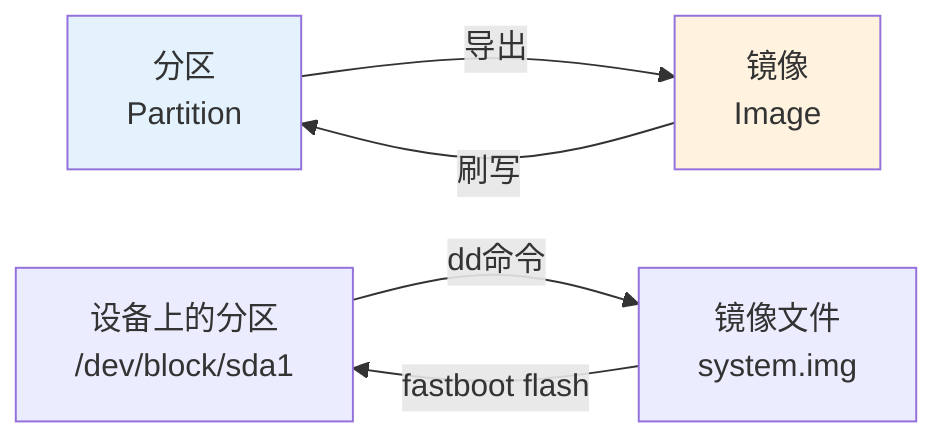

# 分区与镜像的关系

## 📋 目录

1. [分区 vs 镜像的概念](#1-分区-vs-镜像的概念)
2. [镜像文件格式](#2-镜像文件格式)
3. [分区到镜像的映射](#3-分区到镜像的映射)
4. [镜像生成和刷写](#4-镜像生成和刷写)
5. [镜像文件命名规则](#5-镜像文件命名规则)
6. [镜像大小与分区大小](#6-镜像大小与分区大小)
7. [镜像验证和完整性](#7-镜像验证和完整性)

---

## 1. 分区 vs 镜像的概念

### 1.1 基本概念

**分区（Partition）**：
- 存储设备上的物理/逻辑区域
- 在设备上实际存在
- 通过设备节点访问（如 `/dev/block/sda1`）

**镜像（Image）**：
- 分区的文件表示形式
- 存储在文件系统中的文件
- 可以传输、备份、刷写

### 1.2 关系图



### 1.3 关键区别

| 特性 | 分区 | 镜像 |
|------|------|------|
| **位置** | 存储设备上 | 文件系统中 |
| **访问** | 通过设备节点 | 通过文件路径 |
| **格式** | 原始数据 | 可能是压缩/稀疏格式 |
| **传输** | 不能直接传输 | 可以传输 |
| **备份** | 需要导出为镜像 | 直接是文件 |

---

## 2. 镜像文件格式

### 2.1 Raw Image（原始镜像）

**特点**：
- 完全复制分区内容
- 文件大小 = 分区大小
- 未压缩
- 可以直接使用 `dd` 命令创建

**创建方法**：
```bash
# 从分区创建raw镜像
adb shell dd if=/dev/block/by-name/system of=/sdcard/system.raw.img

# 或使用fastboot
fastboot boot recovery.img
# 在recovery中使用dd命令
```

**使用场景**：
- 完整备份
- 直接刷写
- 文件系统分析

### 2.2 Sparse Image（稀疏镜像）

**特点**：
- Android 标准格式
- 压缩格式，只存储非零数据块
- 文件大小 << 分区大小
- 需要解压后刷写

**结构**：
```
Sparse Image Header
├── Chunk 1: Don't care (全零块，不存储)
├── Chunk 2: Raw (实际数据)
├── Chunk 3: Fill (填充相同值)
├── Chunk 4: Don't care
└── ...
```

**优势**：
- 大幅减小文件大小
- 传输速度快
- OTA更新包使用

**创建方法**：
```bash
# 从raw镜像创建sparse镜像
img2simg system.raw.img system.sparse.img

# 编译时自动生成
make systemimage
# 输出: out/target/product/{device}/system.img (sparse格式)
```

**转换方法**：
```bash
# sparse转raw
simg2img system.sparse.img system.raw.img

# raw转sparse
img2simg system.raw.img system.sparse.img
```

### 2.3 特殊格式镜像

#### 2.3.1 boot.img 格式

**结构**：
```
boot.img
├── Header (Android Boot Image Header)
├── Kernel (压缩的内核镜像)
├── Ramdisk (cpio格式的ramdisk)
├── Second Stage (可选)
└── Device Tree (可选)
```

**创建方法**：
```bash
mkbootimg \
    --kernel Image.lz4 \
    --ramdisk ramdisk.cpio \
    --output boot.img \
    --pagesize 4096 \
    --base 0x00000000
```

#### 2.3.2 vendor_boot.img 格式

**结构**（Android 11+）：
```
vendor_boot.img
├── Header (Boot Image Header v3+)
├── Vendor Ramdisk
├── DTB (Device Tree Blob)
└── Vendor Ramdisk Table
```

#### 2.3.3 vbmeta.img 格式

**结构**：
```
vbmeta.img
├── Header
├── Authentication Data
├── Auxiliary Data
└── Footer
```

---

## 3. 分区到镜像的映射

### 3.1 完整映射表

| 分区名称 | 镜像文件名 | 镜像格式 | 说明 |
|---------|-----------|---------|------|
| `boot` | `boot.img` | boot.img | 内核+ramdisk（Android 12-） |
| `boot` | `Image.lz4` | 压缩内核 | 仅内核（Android 13+ GKI） |
| `init_boot` | `init_boot.img` | boot.img | 通用ramdisk |
| `vendor_boot` | `vendor_boot.img` | vendor_boot.img | 供应商ramdisk |
| `dtbo` | `dtbo.img` | dtbo.img | 设备树覆盖层 |
| `system` | `system.img` | sparse/raw | 系统分区 |
| `system_ext` | `system_ext.img` | sparse/raw | 系统扩展 |
| `product` | `product.img` | sparse/raw | 产品分区 |
| `vendor` | `vendor.img` | sparse/raw | 供应商分区 |
| `odm` | `odm.img` | sparse/raw | ODM分区 |
| `system_dlkm` | `system_dlkm.img` | sparse/raw | 系统内核模块 |
| `vendor_dlkm` | `vendor_dlkm.img` | sparse/raw | 供应商内核模块 |
| `odm_dlkm` | `odm_dlkm.img` | sparse/raw | ODM内核模块 |
| `vbmeta` | `vbmeta.img` | vbmeta | 验证元数据 |
| `vbmeta_system` | `vbmeta_system.img` | vbmeta | system验证 |
| `vbmeta_vendor` | `vbmeta_vendor.img` | vbmeta | vendor验证 |
| `vbmeta_vendor_dlkm` | `vbmeta_vendor_dlkm.img` | vbmeta | vendor_dlkm验证 |
| `userdata` | `userdata.img` | sparse/raw | 用户数据（初始空） |
| `cache` | `cache.img` | sparse/raw | 缓存（初始空） |
| `metadata` | `metadata.img` | sparse/raw | 元数据 |
| `misc` | `misc.img` | misc | OTA状态 |
| `persist` | `persist.img` | sparse/raw | 持久化数据 |
| `frp` | `frp.img` | frp | FRP状态 |
| `recovery` | `recovery.img` | boot.img | 恢复模式 |
| `super` | `super.img` | sparse/raw | 动态分区容器 |

### 3.2 A/B槽位镜像命名

对于A/B分区，镜像文件通常不包含槽位后缀：

```
分区: system_a, system_b
镜像: system.img (用于两个槽位)

# 刷写时指定槽位
fastboot flash system_a system.img
fastboot flash system_b system.img
```

---

## 4. 镜像生成和刷写

### 4.1 从分区生成镜像

#### 方法1：使用 dd 命令

```bash
# 在设备上（需要root）
adb shell su -c "dd if=/dev/block/by-name/system of=/sdcard/system.img bs=1M"

# 拉取到电脑
adb pull /sdcard/system.img ./
```

#### 方法2：使用 fastboot

```bash
# 某些设备支持直接读取
fastboot getvar partition-size:system
fastboot download system.img
```

#### 方法3：从编译产物

```bash
# 编译时自动生成
make systemimage
# 输出: out/target/product/{device}/system.img
```

### 4.2 将镜像刷写到分区

#### 方法1：使用 fastboot

```bash
# 刷写镜像到分区
fastboot flash system system.img

# 刷写到指定槽位
fastboot flash system_a system.img
fastboot flash system_b system.img

# 刷写boot分区
fastboot flash boot boot.img

# 刷写多个分区
fastboot flash system system.img
fastboot flash vendor vendor.img
fastboot flash product product.img
```

#### 方法2：使用 dd 命令（需要root）

```bash
# 在设备上
adb shell su -c "dd if=/sdcard/system.img of=/dev/block/by-name/system bs=1M"

# ⚠️ 危险操作，可能导致设备变砖
```

#### 方法3：使用 adb sideload

```bash
# 在recovery模式
adb sideload update.zip
# update.zip包含镜像文件
```

### 4.3 镜像格式转换

```bash
# sparse转raw
simg2img system.sparse.img system.raw.img

# raw转sparse
img2simg system.raw.img system.sparse.img

# 查看镜像信息
file system.img
# 输出: Android sparse image, version: 1.0, Total of 524288 4096-byte output blocks

# 检查镜像大小
ls -lh system.img
```

---

## 5. 镜像文件命名规则

### 5.1 标准命名规则

1. **分区名对应**：镜像文件名通常与分区名相同
2. **.img扩展名**：所有镜像文件使用 `.img` 扩展名
3. **无槽位后缀**：镜像文件不包含 `_a` 或 `_b` 后缀

### 5.2 命名示例

| 分区 | 镜像文件 |
|------|---------|
| `system` | `system.img` |
| `vendor` | `vendor.img` |
| `boot` | `boot.img` 或 `Image.lz4` |
| `system_ext` | `system_ext.img` |

### 5.3 特殊命名

某些镜像可能有特殊命名：

- `boot-5.15.img` - 带内核版本的boot镜像
- `system-sparse.img` - 明确标识sparse格式
- `vendor-raw.img` - 明确标识raw格式

---

## 6. 镜像大小与分区大小

### 6.1 大小关系

**Raw镜像**：
```
镜像大小 = 分区大小
```

**Sparse镜像**：
```
镜像大小 << 分区大小（通常小50-90%）
```

### 6.2 实际示例

| 分区 | 分区大小 | Raw镜像大小 | Sparse镜像大小 |
|------|---------|------------|---------------|
| `system` | 3GB | 3GB | 800MB-1.2GB |
| `vendor` | 512MB | 512MB | 150MB-250MB |
| `boot` | 64MB | 64MB | 15MB-25MB |

### 6.3 大小计算

```bash
# 查看分区大小
adb shell blockdev --getsize64 /dev/block/by-name/system
# 输出: 3221225472 (3GB in bytes)

# 查看镜像大小
ls -lh system.img
# 输出: -rw-r--r-- 1 user user 850M system.img

# 查看sparse镜像的实际大小
simg2img system.img system.raw.img
ls -lh system.raw.img
# 输出: -rw-r--r-- 1 user user 3.0G system.raw.img
```

---

## 7. 镜像验证和完整性

### 7.1 镜像完整性检查

#### 方法1：文件完整性

```bash
# 检查文件是否损坏
file system.img
# 应该显示正确的格式信息

# 检查文件大小是否合理
ls -lh system.img
```

#### 方法2：哈希验证

```bash
# 计算MD5
md5sum system.img
# 输出: a1b2c3d4e5f6... system.img

# 计算SHA256
sha256sum system.img
# 输出: 1a2b3c4d5e6f... system.img

# 与预期哈希值对比
echo "expected_hash" | sha256sum -c
```

#### 方法3：AVB验证

```bash
# 验证vbmeta签名
avbtool verify_image --image vbmeta.img

# 验证分区镜像
avbtool verify_image --image system.img --key public_key.pem
```

### 7.2 镜像内容验证

```bash
# 挂载raw镜像查看内容
sudo mount -o loop system.raw.img /mnt
ls -l /mnt
sudo umount /mnt

# 查看sparse镜像内容（先转换）
simg2img system.sparse.img system.raw.img
sudo mount -o loop system.raw.img /mnt
```

### 7.3 刷写前验证

```bash
# 1. 检查镜像格式
file boot.img
# 应该显示: Android bootimg

# 2. 检查镜像大小
ls -lh boot.img
# 应该小于等于分区大小

# 3. 检查签名（如果使用AVB）
avbtool verify_image --image boot.img

# 4. 验证分区大小
fastboot getvar partition-size:boot
# 确保镜像大小 <= 分区大小
```

---

## 总结

分区和镜像的关系：

1. **分区是设备上的存储区域**，镜像是分区的文件表示
2. **镜像可以刷写到分区**，分区可以导出为镜像
3. **镜像格式**：raw（原始）或 sparse（压缩）
4. **命名规则**：镜像文件名通常与分区名对应
5. **大小关系**：sparse镜像 << raw镜像 = 分区大小

**关键操作**：
- 从分区生成镜像：`dd` 命令
- 将镜像刷写到分区：`fastboot flash`
- 格式转换：`simg2img` / `img2simg`

**下一步学习**：
- 了解如何编译生成这些镜像，请阅读 [镜像生成和打包](../02_Build_System/03_Image_Generation_And_Packaging.md)
- 了解分区编译流程，请阅读 [分区编译流程](../02_Build_System/02_Partition_Build_Process.md)
