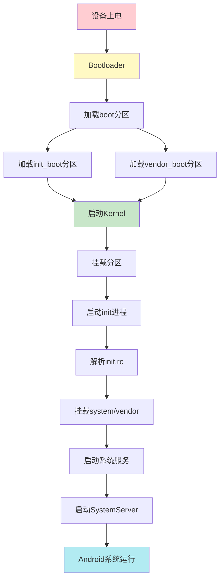
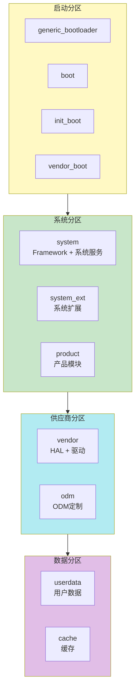

# 系统组成和启动流程

## 📋 目录

1. [Android系统启动流程](#1-android系统启动流程)
2. [各分区在启动中的作用](#2-各分区在启动中的作用)
3. [启动阶段详解](#3-启动阶段详解)
4. [分区加载顺序](#4-分区加载顺序)
5. [系统组成架构](#5-系统组成架构)

---

## 1. Android系统启动流程

### 1.1 完整启动流程



### 1.2 启动阶段

1. **Bootloader阶段**：硬件初始化，加载内核
2. **Kernel阶段**：内核启动，初始化硬件
3. **Init阶段**：用户空间初始化
4. **System Server阶段**：Android框架启动
5. **应用启动阶段**：启动系统应用和用户应用

---

## 2. 各分区在启动中的作用

### 2.1 启动相关分区

| 分区 | 启动阶段 | 作用 |
|------|---------|------|
| `generic_bootloader` | Bootloader | 初始化硬件，加载boot分区 |
| `boot` | Bootloader→Kernel | 包含内核镜像 |
| `init_boot` | Kernel→Init | 包含通用ramdisk和init |
| `vendor_boot` | Kernel→Init | 包含供应商ramdisk和DTB |
| `dtbo` | Bootloader | 设备树覆盖层 |

### 2.2 系统分区

| 分区 | 启动阶段 | 作用 |
|------|---------|------|
| `system` | Init→SystemServer | Android框架和系统服务 |
| `system_ext` | Init | 系统扩展模块 |
| `product` | Init | 产品特定模块 |
| `vendor` | Init | HAL实现和供应商代码 |
| `odm` | Init | ODM定制化 |

### 2.3 DLKM分区

| 分区 | 启动阶段 | 作用 |
|------|---------|------|
| `system_dlkm` | Kernel | 系统内核模块 |
| `vendor_dlkm` | Kernel | 供应商内核模块 |
| `odm_dlkm` | Kernel | ODM内核模块 |

### 2.4 验证分区

| 分区 | 启动阶段 | 作用 |
|------|---------|------|
| `vbmeta` | Bootloader | 验证链根 |
| `vbmeta_system` | Bootloader | 验证system分区 |
| `vbmeta_vendor` | Bootloader | 验证vendor分区 |

---

## 3. 启动阶段详解

### 3.1 Bootloader阶段

**流程**：
1. 硬件上电
2. Bootloader初始化硬件（CPU、内存、存储）
3. 读取分区表
4. 验证vbmeta分区
5. 加载boot分区（内核）
6. 加载init_boot分区（ramdisk）
7. 加载vendor_boot分区（供应商ramdisk）
8. 应用dtbo（设备树覆盖）
9. 启动内核

**涉及分区**：
- `generic_bootloader`
- `vbmeta`
- `boot`
- `init_boot`
- `vendor_boot`
- `dtbo`

### 3.2 Kernel阶段

**流程**：
1. 内核解压和初始化
2. 初始化硬件驱动
3. 挂载ramdisk（从init_boot和vendor_boot）
4. 加载内核模块（从DLKM分区）
5. 初始化进程管理
6. 启动第一个用户空间进程（init）

**涉及分区**：
- `boot`（内核）
- `init_boot`（ramdisk）
- `vendor_boot`（供应商ramdisk）
- `system_dlkm`、`vendor_dlkm`、`odm_dlkm`（内核模块）

### 3.3 Init阶段

**流程**：
1. init进程启动
2. 解析init.rc脚本
3. 创建文件系统目录
4. 挂载分区（system, vendor, product等）
5. 设置权限和SELinux策略
6. 启动系统服务（zygote, servicemanager等）

**涉及分区**：
- `system`
- `vendor`
- `product`
- `system_ext`
- `odm`
- `userdata`
- `metadata`

### 3.4 System Server阶段

**流程**：
1. Zygote进程启动
2. SystemServer启动
3. 加载Framework库
4. 启动系统服务（ActivityManager, WindowManager等）
5. 启动系统应用
6. 显示启动画面
7. 启动Launcher

**涉及分区**：
- `system`（Framework和系统应用）
- `product`（产品应用）
- `userdata`（用户数据）

---

## 4. 分区加载顺序

### 4.1 启动时分区加载顺序

```
1. generic_bootloader (硬件加载)
   ↓
2. vbmeta (验证)
   ↓
3. boot (内核)
   ↓
4. init_boot (ramdisk)
   ↓
5. vendor_boot (供应商ramdisk)
   ↓
6. dtbo (设备树覆盖)
   ↓
7. Kernel启动
   ↓
8. system_dlkm, vendor_dlkm, odm_dlkm (内核模块)
   ↓
9. Init进程启动
   ↓
10. system, vendor, product, system_ext, odm (挂载)
    ↓
11. userdata, metadata (挂载)
    ↓
12. SystemServer启动
```

### 4.2 分区挂载顺序

在init.rc中定义的挂载顺序：

```bash
# 早期挂载（在init阶段）
mount system /system
mount vendor /vendor
mount product /product
mount system_ext /system_ext
mount odm /odm

# 后期挂载（在系统服务启动后）
mount userdata /data
mount metadata /metadata
```

---

## 5. 系统组成架构

### 5.1 分区与系统组件的关系



### 5.2 系统服务依赖关系

```
SystemServer
├── ActivityManagerService (system)
├── WindowManagerService (system)
├── PackageManagerService (system)
├── CameraService (vendor - HAL)
├── AudioService (vendor - HAL)
└── ...
```

### 5.3 分区访问权限

| 分区 | 访问权限 | 说明 |
|------|---------|------|
| `system` | 只读 | 系统框架，不可修改 |
| `vendor` | 只读 | HAL实现，不可修改 |
| `product` | 只读 | 产品模块，不可修改 |
| `userdata` | 读写 | 用户数据，可读写 |
| `cache` | 读写 | 缓存数据，可擦除 |

---

## 总结

Android系统启动和组成要点：

1. **启动流程**：Bootloader → Kernel → Init → SystemServer
2. **分区作用**：每个分区在特定阶段加载和使用
3. **加载顺序**：严格按照启动阶段顺序加载
4. **系统组成**：多个分区协同工作组成完整系统

**关键分区**：
- 启动：boot, init_boot, vendor_boot
- 系统：system, vendor, product
- 数据：userdata

**下一步学习**：
- 了解分区挂载和使用，请阅读 [分区挂载和使用](02_Partition_Mount_And_Usage.md)
- 了解系统初始化流程，请阅读 [系统初始化流程](03_System_Initialization_Flow.md)
