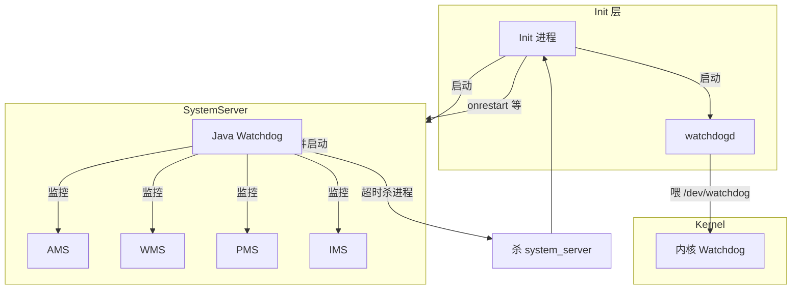

# Watchdog 概述与在 Android 体系中的位置

## 学习目标

- 理解 Watchdog 是什么：系统级无响应检测与恢复机制
- 理解为什么需要 Watchdog：防止系统服务僵死导致整机卡死
- 掌握 Watchdog 在 Android 整体架构中的位置
- 明确 Watchdog 为谁服务、上游与下游分别是谁
- 区分 Watchdog 与 ANR 的适用场景与关系

## 一、Watchdog 是什么

### 定义

**Watchdog（看门狗）** 是 Android 中用于**检测系统关键组件无响应并触发恢复**的监控机制。当被监控的线程或服务在约定时间内未能“喂狗”（即未能完成一次健康检查），Watchdog 会认为系统可能僵死，进而执行打栈、日志、杀进程或重启等恢复动作。

在 Android 语境下，通常有三类“看门狗”概念，本系列主要讨论其中两类与体系位置直接相关者：

1. **Java Watchdog**：运行在 **system_server** 进程内，监控 AMS、PMS、WMS、IMS 等核心系统服务的 Handler 线程是否能在超时内处理检查任务。超时则杀 system_server，由 Init 重启。
2. **内核 Watchdog**：运行在内核中，检测 CPU 是否长时间不调度（soft/hard lockup），以及用户态是否持续喂 `/dev/watchdog`；若不喂狗则触发整机重启。
3. **watchdogd**：用户态守护进程，定期向 `/dev/watchdog` 写入以“喂狗”，表示用户态仍在运行；若 watchdogd 停止，内核看门狗超时会导致重启。

其他“类 Watchdog”机制（如 **FinalizerWatchdogDaemon**、**CCodecWatchdog**、**Okio Watchdog** 等）仅在各自模块内做超时检测，不直接参与系统级恢复，在 [03-多层Watchdog架构](03-多层Watchdog架构.md) 中会简要提及。

## 二、为什么要有 Watchdog

### 要解决的问题

- **系统服务僵死**：若 ActivityManagerService、WindowManagerService 等核心服务的线程长时间阻塞（持锁、死锁、Binder 阻塞或主线程做重活），系统将无法正常响应输入、启动应用、管理窗口等，用户感知为“系统卡死”。
- **内核/调度器挂起**：若内核或调度器本身卡住，用户态进程都无法得到调度，此时需要内核级看门狗在超时后触发整机重启，作为最后一道防线。

### Watchdog 的作用

- **检测**：定期检查被监控的线程/服务是否在超时内完成一次“心跳”或健康检查。
- **恢复**：  
  - Java Watchdog：超时后打栈、记日志、杀 system_server，由 Init 重新拉起，实现“系统服务进程重启”级别的恢复。  
  - 内核 Watchdog：若无人喂狗或检测到 lockup，则触发整机重启，从硬件层面恢复。

因此，Watchdog 的存在是为了**在系统或内核出现无响应时，自动检测并恢复**，避免设备长期卡死、需用户强制断电。

### 与 ANR 的关系与区别

| 维度 | ANR（Application Not Responding） | Watchdog（本系列讨论的系统级 Watchdog） |
|------|-----------------------------------|------------------------------------------|
| **监控对象** | 应用进程（如主线程 5 秒无响应） | system_server 及核心系统服务、或内核 |
| **触发条件** | 输入派发、Service、Broadcast 等超时 | 系统服务线程/Handler 超时未完成检查，或内核 lockup/未喂狗 |
| **典型后果** | 弹 ANR 对话框、可杀应用 | 杀 system_server（Init 重启）或整机重启 |
| **目的** | 避免单个应用卡住用户体验 | 避免整个系统或内核卡死 |

二者**互补**：ANR 管“应用无响应”，Watchdog 管“系统/内核无响应”。系统服务若卡住，可能先由 Watchdog 发现并恢复；应用卡住则由 ANR 机制处理。

## 三、Watchdog 在 Android 体系中的位置

### 在启动与运行链中的位置

Watchdog 依赖系统启动与进程管理，在整体链路中的位置可概括为：

- **Init** 是 PID 1，负责解析 init.rc、启动 **watchdogd** 与 **SystemServer** 等（详见 [09-Init进程与系统服务启动](../09-Init进程与系统服务启动.md)）。
- **SystemServer** 进程启动后会创建并启动 **Java Watchdog**（单例线程），并让各系统服务向 Watchdog 注册（Monitor 或 HandlerChecker）。
- **Java Watchdog** 定期检查已注册的服务/线程；若超时则杀死 **system_server**；**Init** 监听到 system_server 退出后会重新启动它，从而完成一次“系统服务进程级”恢复。
- **watchdogd** 与 **内核 Watchdog** 的配合：watchdogd 周期写 `/dev/watchdog` 表示用户态仍存活；若 watchdogd 或整个用户态卡死，内核看门狗超时后会触发整机重启。

### 为谁服务

- **系统稳定性**：防止因单个或多个核心服务线程卡死导致整机“假死”。
- **系统服务健康**：通过定期检查，暴露哪些服务/线程长期不处理消息或持锁过久，便于日志与 trace 排查。

### 上游与下游

- **上游**  
  - **Java Watchdog**：由 **SystemServer** 在启动系统服务的过程中创建并启动；各系统服务（AMS、PMS、WMS、IMS 等）通过 `addMonitor()` / `addThreadChecker()` 注册到 Watchdog，即“谁注册谁就是被监控对象”，上游即 **SystemServer 的启动流程** 与 **各系统服务**。  
  - **watchdogd**：由 **Init** 按 init.rc 配置启动，上游即 **Init**。  
  - **内核 Watchdog**：由内核在启动时初始化，上游即 **内核调度与设备驱动**。
- **下游**  
  - **Java Watchdog 超时**：打栈、写日志（如 "SERVICE TIMEOUT"）、**杀死 system_server**；**Init** 检测到退出后**重启 system_server**（以及可能触发的重启策略）。  
  - **内核 Watchdog 超时（无人喂狗或 lockup）**：**整机重启**。

因此，从“为谁服务、上下游”的角度：Watchdog 为**系统稳定性与可恢复性**服务；上游是 **Init/SystemServer 及被注册的服务**；下游是 **杀 system_server → Init 重启** 或 **整机重启**。

## 四、小结

- **Watchdog 是什么**：系统级（及内核级）无响应检测与恢复机制，包括 Java Watchdog（监控 system_server 内核心服务）、watchdogd（喂内核看门狗）、内核 Watchdog（lockup 与未喂狗时重启）。
- **为什么要有 Watchdog**：在系统服务或内核僵死时自动检测并恢复，避免整机长期无响应。
- **在体系中的位置**：Init 启动 watchdogd 与 SystemServer；SystemServer 内运行 Java Watchdog，监控各注册服务；超时后杀 system_server 由 Init 重启，或由内核看门狗触发整机重启。
- **与 ANR**：ANR 针对应用无响应，Watchdog 针对系统/内核无响应，二者互补。

下一篇文章将介绍 [Watchdog 发展历史与未来](02-Watchdog发展历史与未来.md)，包括超时策略演进与未来方向。
