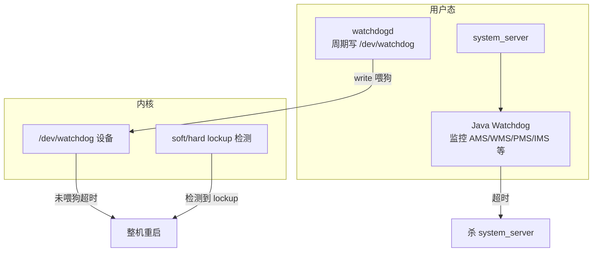

# 多层 Watchdog 架构

## 学习目标

- 分清 Android 中三层 Watchdog：内核 Watchdog、用户态 watchdogd、Java Watchdog
- 理解每层的触发条件与恢复后果（重启 system_server vs 整机重启）
- 掌握三层如何配合形成“应用 → 系统 → 内核”的防护体系
- 了解与冷启动时间线中 `ro.boottime.watchdogd` 的衔接

## 一、三层总览

Android 的“看门狗”并非单一模块，而是**内核、用户态守护进程、Framework 内监控**三层协同工作：

| 层次 | 组件 | 主要职责 | 触发条件 | 典型后果 |
|------|------|----------|----------|----------|
| **Framework** | Java Watchdog | 监控 system_server 内核心服务/线程是否在超时内完成检查 | 某 HandlerChecker 或 Monitor 超时 | 打栈、写日志、杀 system_server，Init 重启 system_server |
| **用户态** | watchdogd | 定期向 `/dev/watchdog` 写数据“喂狗”，表示用户态仍在运行 | 无需“触发”，只要持续喂狗即可避免内核看门狗超时 | 若停止喂狗 → 内核看门狗超时 → 整机重启 |
| **内核** | 内核 Watchdog | 1) soft/hard lockup 检测；2) 管理 `/dev/watchdog`，超时未喂狗则重启 | 1) CPU 长时间不调度；2) 无人对 `/dev/watchdog` 喂狗 | 整机重启（或 panic，视配置） |

## 二、各层职责与配合

### 1. Java Watchdog（Framework 层）

- **位置**：运行在 **system_server** 进程内，单例线程。
- **监控对象**：通过 `addMonitor()` / `addThreadChecker()` 注册的服务或 Handler 线程（如 AMS、PMS、WMS、IMS 等）。
- **检查方式**：定期（约 30 秒）向被监控线程 post Runnable 或调用 `Monitor.monitor()`，若在超时内未完成则判定为超时。
- **触发条件**：某个被监控的线程/服务在约定超时时间内未完成一次检查。
- **后果**：打栈、写 "SERVICE TIMEOUT" 等日志、**杀死 system_server**；Init 监听到进程退出后按配置**重启 system_server**（可能伴随重启策略）。  
- **特点**：恢复粒度是“系统服务进程”，不直接导致整机重启，有利于快速恢复且保留内核状态。

详见 [04-Java-Watchdog设计与实现](04-Java-Watchdog设计与实现.md)。

### 2. watchdogd（用户态守护进程）

- **位置**：独立进程，由 **Init** 在启动早期按 init.rc 配置启动。
- **职责**：打开 `/dev/watchdog`，设置超时（如通过 `WDIOC_SETTIMEOUT`），然后**周期性地向设备写数据**（如 `write(fd, "", 1)`），即“喂狗”。
- **触发/后果**：  
  - 正常情况：持续喂狗，内核看门狗不会因“未喂狗”而重启。  
  - 异常情况：若 watchdogd 崩溃、被杀死或整个用户态卡死无法调度到 watchdogd，则无人喂狗；内核看门狗在设定时间后超时，触发**整机重启**。
- **与冷启动时间线**：启动时间会记录在属性 `ro.boottime.watchdogd` 中，可用于分析启动阶段耗时。详见 [17-Android冷启动时间线属性详解](../17-Android冷启动时间线属性详解.md)（如“系统监控”中的 watchdogd 约 2.284 秒）。

详见 [05-内核Watchdog与watchdogd](05-内核Watchdog与watchdogd.md)。

### 3. 内核 Watchdog（Kernel 层）

- **位置**：内核代码，如 `kernel/watchdog.c`，以及各平台 `/dev/watchdog` 驱动。
- **职责**：  
  1. **Soft/Hard lockup 检测**：检测是否有 CPU 长时间不调度、长时间关中断等，发现则报错或触发重启（视配置）。  
  2. **看门狗设备**：管理 `/dev/watchdog`；若在设定时间内未收到“喂狗”（如 write），则触发重启或 panic。
- **触发条件**：  
  - Lockup：调度器或某 CPU 长时间不进展。  
  - 未喂狗：用户态（watchdogd）在超时时间内未对 `/dev/watchdog` 进行 write。
- **后果**：通常为**整机重启**（或 kernel panic），是最后一道防线。

与用户态/内核态边界的关系可参考 [process/19-用户态与内核态深入解析](../../process/19-用户态与内核态深入解析.md) 中关于“watchdog/*：检测 CPU 死锁”的提及。

## 三、三层协作关系

- **Java Watchdog** 只关心 system_server 内服务是否“假死”；超时后只杀 system_server，由 Init 重启，**不直接动内核**。
- **watchdogd** 只负责“代表用户态”定期喂 `/dev/watchdog`；若用户态整体卡死（包括 system_server 卡死且 Watchdog 线程也得不到调度），watchdogd 也会停喂，从而**间接**让内核看门狗超时并整机重启。
- **内核 Watchdog** 在“无人喂狗”或“检测到 lockup”时触发整机重启，保证即使内核或用户态完全卡死也能恢复。

因此：

- 若仅是 **system_server 内某服务线程卡死**，但进程内 Watchdog 线程仍能运行 → Java Watchdog 超时 → 杀 system_server → Init 重启，**无需整机重启**。
- 若 **整个用户态卡死**（如所有进程都无法被调度）→ watchdogd 无法喂狗 → 内核看门狗超时 → **整机重启**。
- 若 **内核自身卡死**（如调度器挂起）→ 内核 lockup 检测或未喂狗超时 → **整机重启**。

## 四、其他“类 Watchdog”机制（简要）

以下机制仅在各自模块内做超时检测，不参与系统级恢复，可与本系列讨论的 Watchdog 区分开：

- **FinalizerWatchdogDaemon**：监控 finalize 执行是否过久，超时可能抛异常，不杀 system_server。
- **CCodecWatchdog**：MediaCodec 相关，监控编解码是否卡住。
- **Okio Watchdog**：OkHttp/Okio 中的异步超时检测。

遇到 trace 或日志中出现这些名字时，可判断为“应用或媒体栈内的超时”，而非系统级 Watchdog。

## 五、小结

- **三层**：Java Watchdog（system_server 内）→ 杀 system_server、Init 重启；watchdogd（用户态）→ 喂 `/dev/watchdog`；内核 Watchdog → lockup 与未喂狗时整机重启。
- **触发与后果**：Framework 层超时只重启 system_server；用户态停喂或内核 lockup 导致整机重启。
- **与冷启动**：watchdogd 启动时间见 `ro.boottime.watchdogd`，见 [17-Android冷启动时间线属性详解](../17-Android冷启动时间线属性详解.md)。

下一篇文章将介绍 [Java Watchdog 设计与实现](04-Java-Watchdog设计与实现.md)，包括 HandlerChecker、Monitor 与检查循环。
