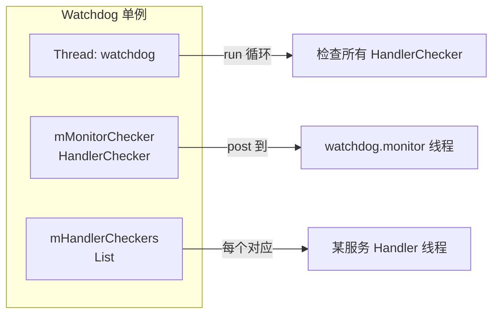

# Java Watchdog 设计与实现

## 学习目标

- 掌握 Java Watchdog 的源码位置与整体结构
- 理解 HandlerChecker、Monitor 接口与注册方式（addMonitor / addThreadChecker）
- 理解检查循环与超时判定（约 30 秒周期、各 HandlerChecker 超时）
- 掌握超时后的处理流程：打栈、日志、杀 system_server
- 了解被监控对象：AMS、PMS、WMS、IMS 等与 Monitor 的对应关系

## 一、源码位置与整体结构

### 源码路径

- **AOSP**：`frameworks/base/services/core/java/com/android/server/Watchdog.java`

Watchdog 以**单例**形式存在，通过 `Watchdog.getInstance()` 获取；由 **SystemServer** 在启动系统服务过程中创建并调用 `start()` 启动其内部线程。

### 类与线程

- **Watchdog** 实现 `Runnable`，内部持有一个 **Thread**（名为 `"watchdog"`），该线程执行 `run()` 中的**检查循环**。
- 另有一个 **ServiceThread** 名为 `"watchdog.monitor"`，用于执行 **Monitor 回调**（`monitor()`），避免在受检线程上直接做可能持锁的检查；对应一个 **HandlerChecker**，即 **mMonitorChecker**。



## 二、核心抽象

### 1. HandlerChecker

**HandlerChecker** 用于监控**某一个 Handler 所在线程**是否能在给定超时内执行完一次“检查”。

- **绑定**：持有一个 `Handler`、一个名称（如 `"foreground thread"`、`"main thread"`、`"i/o thread"`）、以及可选的 `Object lock` 和 `Clock`。
- **检查方式**：Watchdog 线程调用 `scheduleCheckLocked(timeoutMs)`，向该 Handler **post 一个 Runnable**（即 HandlerChecker 自身，因实现 `Runnable`）；该 Runnable 在目标线程上执行时，会依次调用已注册到该 HandlerChecker 的 **Monitor 的 `monitor()`**，然后标记本次检查完成。
- **超时判定**：Watchdog 线程在下一轮检查时通过 `getCompletionStateLocked()` 查看状态：
  - **COMPLETED**：已执行完本次检查。
  - **WAITING**：已 post 但尚未执行完。
  - **WAITED_UNTIL_PRE_WATCHDOG**：已超过“pre-watchdog”时间（一般为完整超时的一半），但未超过完整超时。
  - **OVERDUE**：超过完整超时，判定为超时。

因此，**HandlerChecker = 对一个 Handler 线程的“定时心跳检查”**：若该线程在 timeoutMs 内没有执行完这次 post 的 Runnable（即没机会执行各 Monitor 的 `monitor()`），就被视为阻塞。

### 2. Monitor 接口

```java
// Watchdog.java
public interface Monitor {
    void monitor();
}
```

- 实现类在 `monitor()` 中做**轻量健康检查**，例如尝试获取某把锁、或调用 `Binder.blockUntilThreadAvailable()` 等；若被检线程正常，应能很快完成。
- **注册方式**：通过 `Watchdog.getInstance().addMonitor(monitor)` 将 Monitor 加入 **mMonitorChecker** 的队列；即该 Monitor 会在 **watchdog.monitor** 线程上被调用，而该次调用的“是否在超时内完成”由 mMonitorChecker 对应的 Handler 线程（即 watchdog.monitor 线程）的调度来体现。
- 另外，各**服务**可将自己实现的 Monitor 通过 `addMonitor(this)` 注册；Watchdog 还会把 **BinderThreadMonitor**（内部调用 `Binder.blockUntilThreadAvailable()`）加入，用于检测 Binder 线程是否可用。

### 3. 注册方式小结

| 方式 | 含义 | 典型用法 |
|------|------|----------|
| **addMonitor(Monitor)** | 向 **mMonitorChecker** 增加一个 Monitor | 各系统服务实现 `Watchdog.Monitor` 并 `addMonitor(this)`，在 [window/07-WindowManagerService架构详解](../../window/07-WindowManagerService架构详解.md)、[input/10-InputManagerService详解](../../input/10-InputManagerService详解.md) 中可见 |
| **addThreadChecker(Handler, name)** 或内部等价 | 为某个 Handler 线程新增一个 HandlerChecker，使用默认超时 | 为特定线程单独做“心跳”检查 |
| **HandlerChecker + 自定义超时** | 构造 HandlerChecker 时传入自定义 timeout | 长时间操作线程可申请更长超时 |

例如 **WindowManagerService** 实现 `implements Watchdog.Monitor`，**InputManagerService** 在 `start()` 中调用 `Watchdog.getInstance().addMonitor(this)`，这样 WMS/IMS 的“健康”会通过 Monitor 在 Watchdog 的检查流程中被调用。

## 三、检查循环与超时判定

### 检查周期与超时常量

- **默认超时**：`DEFAULT_TIMEOUT` 为 60 秒（调试构建可能更短）；可通过设置等配置更新 `mWatchdogTimeoutMillis`。
- **Pre-watchdog**：在超时一半时（如 30 秒）可先打 pre-watchdog 相关日志或事件，不立即杀进程；比例由 `PRE_WATCHDOG_TIMEOUT_RATIO`（如 4，即 1/4 为 pre 超时）决定。
- Watchdog 线程 **run()** 中循环：**睡眠约一半超时时间**（如 30 秒），醒来后对所有 **mHandlerCheckers** 和 **mMonitorChecker** 调用 `scheduleCheckLocked(...)` 启动本轮检查，再根据各 checker 的 `getCompletionStateLocked()` 判断是否 COMPLETED / WAITING / WAITED_UNTIL_PRE_WATCHDOG / OVERDUE。

### 单轮流程简述

1. Watchdog 线程 sleep 到下一检查点（约 30 秒）。
2. 对每个 HandlerChecker（含 mMonitorChecker）调用 `scheduleCheckLocked(timeoutMs)`：  
   - 若该 checker 当前无未完成检查，则 post 自身 Runnable 到对应 Handler，记录开始时间。  
   - 若目标线程正在 poll 且无 Monitor 待执行，可能本轮不 post（避免无意义切换）。
3. 再次 sleep 到“判定点”（或立即判定，视实现）。
4. 遍历所有 checker，调用 `getCompletionStateLocked()`：  
   - 若有 **OVERDUE**，则收集超时的 checker 信息，进入“超时处理”流程。  
   - 若有 **WAITED_UNTIL_PRE_WATCHDOG**，可能只打 pre-watchdog 日志/事件，不杀进程。

### 超时后流程

当存在 OVERDUE 的 HandlerChecker 时：

1. **打栈**：对 system_server 及关心的 Native 进程触发 dump，收集 Java 与 Native 栈。
2. **日志**：输出如 `"*** WATCHDOG KILLING SYSTEM PROCESS ***"`、`"SERVICE TIMEOUT"`、以及被阻塞的 checker 描述（如 “Blocked in monitor com.android.server.Watchdog$BinderThreadMonitor on monitor thread (watchdog.monitor) for 60s”）。
3. **杀进程**：调用 `Process.killProcess(Process.myPid())` 杀死 system_server；Init 监听到退出后按配置重启 system_server。
4. **防抖**：有“致命循环”检测（如短时间内多次 Watchdog 超时），可通过属性配置是否允许重启或直接进入更严格恢复策略。

## 四、被监控的线程与服务

### 内置 HandlerChecker（大致对应关系）

Watchdog 在构造时已为以下线程创建 HandlerChecker（名称与线程对应关系以源码为准）：

- **watchdog.monitor**：mMonitorChecker，执行所有通过 `addMonitor()` 注册的 Monitor。
- **foreground thread**：FgThread 的 Handler。
- **main thread**：主线程 Looper。
- **ui thread**：UiThread。
- **i/o thread**：IoThread。
- **display thread**：DisplayThread。
- **animation thread**：AnimationThread（如 Choreographer 相关）。
- **surface animation thread**：SurfaceAnimationThread。

此外会 **addMonitor(new BinderThreadMonitor())**，用于检测 Binder 线程是否可用。

### 实现 Monitor 的系统服务（举例）

- **ActivityManagerService**
- **PackageManagerService**
- **WindowManagerService**（见 [07-WindowManagerService架构详解](../../window/07-WindowManagerService架构详解.md)）
- **InputManagerService**（见 [10-InputManagerService详解](../../input/10-InputManagerService详解.md)）
- **PowerManagerService**
- 以及其他核心服务

这些服务实现 `Watchdog.Monitor` 并在合适时机调用 `Watchdog.getInstance().addMonitor(this)`，其 `monitor()` 会在 mMonitorChecker 的 run 中被调用；若 **watchdog.monitor** 线程本身或这些 Monitor 中某一步长时间不返回，对应 HandlerChecker 会进入 OVERDUE。

## 五、小结

- **源码**：`frameworks/base/services/core/java/com/android/server/Watchdog.java`；单例，内有一条 “watchdog” 线程和 “watchdog.monitor” 线程。
- **HandlerChecker**：绑定一个 Handler/线程，通过 post Runnable 做“心跳”，超时未完成则记为 OVERDUE。
- **Monitor**：`void monitor()` 轻量检查；通过 `addMonitor()` 挂到 mMonitorChecker，与各服务实现（如 WMS、IMS）对应。
- **检查循环**：约 30 秒周期，对每个 checker schedule 检查并判 COMPLETED/WAITING/WAITED_UNTIL_PRE_WATCHDOG/OVERDUE；有 OVERDUE 则打栈、写 "SERVICE TIMEOUT" 等日志、杀 system_server。
- **被监控对象**：内置 Fg/main/UI/IO/Display/Animation/SurfaceAnimation 等线程 + BinderThreadMonitor + 各系统服务实现的 Monitor。

下一篇文章将介绍 [内核 Watchdog 与 watchdogd](05-内核Watchdog与watchdogd.md)，包括 soft/hard lockup 与用户态喂狗逻辑。
