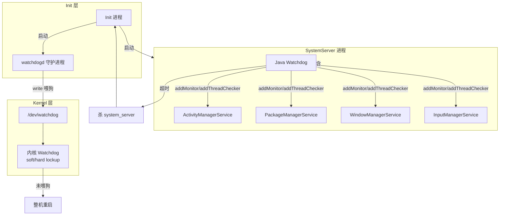

# Android Watchdog 系列文章（共 6 篇）

## 系列概述

本系列从架构师视角全面介绍 Android Watchdog 机制，涵盖「是什么、为什么、历史与未来、体系位置与上下游、内部设计」等维度，并补充多层 Watchdog 区分、与 ANR 的关系、实战排查等内容，与现有 android、process、window、input 等系列形成衔接。

### 设计原则

1. **全局架构视角**：建立 Init → SystemServer → Watchdog → 各系统服务的完整视图
2. **模块关系清晰**：明确内核 Watchdog、watchdogd、Java Watchdog 三层及其上下游
3. **中等深度**：聚焦架构设计、关键机制、注册与检查流程，不过度深入实现细节
4. **Android 特化**：以 system_server 内 Java Watchdog 为主线，兼顾内核与 watchdogd

---

## 文章目录

### 第一部分：概念与体系（01-02）

| 序号 | 文章 | 核心内容 |
|-----|------|---------|
| 01 | [Watchdog 概述与在 Android 体系中的位置](01-Watchdog概述与体系位置.md) | 定义、为什么需要、为谁服务、上下游、与 ANR 对比 |
| 02 | [Watchdog 发展历史与未来](02-Watchdog发展历史与未来.md) | 起源、超时策略演进、未来方向 |

### 第二部分：多层架构与实现（03-05）

| 序号 | 文章 | 核心内容 |
|-----|------|---------|
| 03 | [多层 Watchdog 架构](03-多层Watchdog架构.md) | 内核 / watchdogd / Java 三层总览与配合 |
| 04 | [Java Watchdog 设计与实现](04-Java-Watchdog设计与实现.md) | HandlerChecker、Monitor、检查循环、超时处理 |
| 05 | [内核 Watchdog 与 watchdogd](05-内核Watchdog与watchdogd.md) | soft/hard lockup、/dev/watchdog、watchdogd 喂狗 |

### 第三部分：实战与索引（06）

| 序号 | 文章 | 核心内容 |
|-----|------|---------|
| 06 | [Watchdog 超时排查与调优](06-Watchdog超时排查与调优.md) | 典型日志、trace、常见根因、排查步骤 |

---

## 模块关系总图

---

## 与已有系列的关系

| 系列 | 关系 | 交互点 |
|-----|------|-------|
| android | 上游/下游 | Init 启动 SystemServer 与 watchdogd；Watchdog 超时后 Init 重启 system_server |
| process | 平级/交叉 | 用户态与内核态、watchdog 检测 CPU 死锁（process/19） |
| window | 平级 | WMS 实现 Watchdog.Monitor，被 Watchdog 监控 |
| input | 平级 | IMS 实现 Watchdog.Monitor，被 Watchdog 监控 |

---

## 学习路径建议

1. **入门**：先阅读 01-02 建立概念与演进认知
2. **架构**：阅读 03 理解三层 Watchdog 的划分与配合
3. **实现**：阅读 04-05 掌握 Java Watchdog 与内核/watchdogd 的实现要点
4. **实战**：阅读 06 掌握日志与 trace 排查方法

---

## 参考资源

- AOSP 源码：
  - `frameworks/base/services/core/java/com/android/server/Watchdog.java` - Java Watchdog
  - `system/core/watchdogd/` 或 `system/core/init/watchdogd.cpp` - watchdogd
  - `kernel/watchdog.c` - 内核 soft/hard lockup 与 watchdog 设备
- 相关系列：
  - `../09-Init进程与系统服务启动.md` - Init 与系统服务启动
  - `../17-Android冷启动时间线属性详解.md` - ro.boottime.watchdogd
  - `../../process/19-用户态与内核态深入解析.md` - 内核 watchdog 简要提及

## 更新记录

- 2026-02-10：初始创建，包含 6 篇 Watchdog 系列文章与 README
