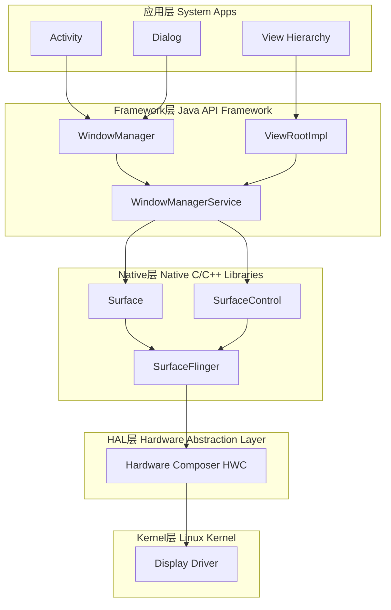
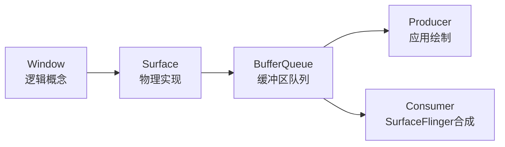
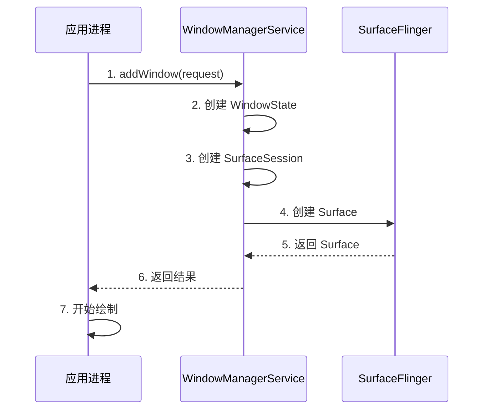
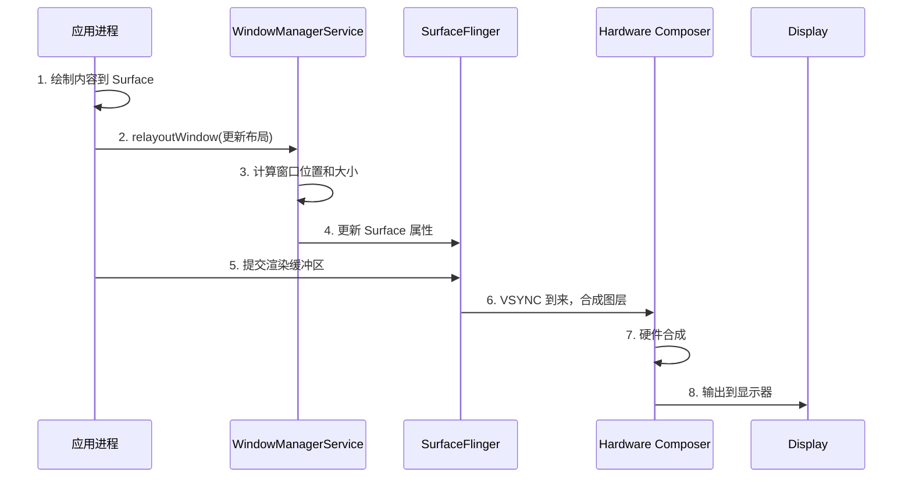
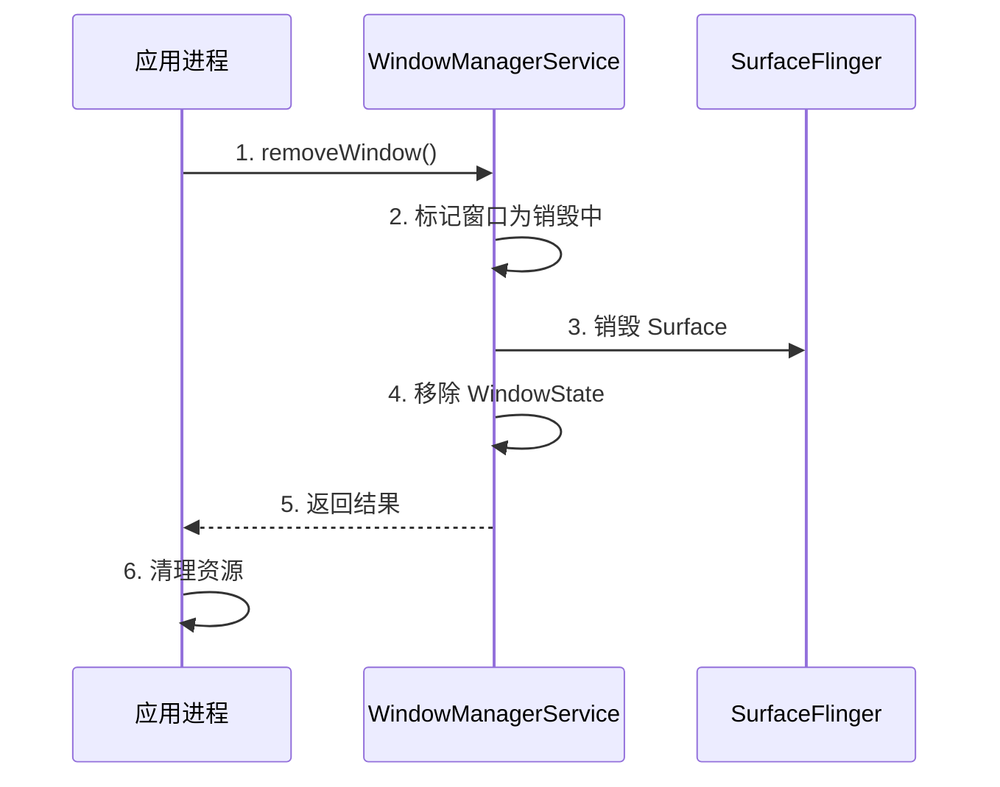

# Window 系统基础篇：Android 窗口架构与核心概念

## 📋 概述

Window（窗口）是 Android 图形系统的核心概念，所有的 UI 元素最终都需要通过窗口来显示。理解 Android 窗口系统是深入理解 Android 图形渲染、ANR 机制、输入事件分发等核心机制的基础。本篇将从架构概述、基本概念、层级简介和生命周期四个维度，建立对 Android 窗口系统的基础认知。

---

## 一、Android 窗口架构概述

### 1.1 整体架构图

Android 窗口系统采用分层架构，从应用层到硬件层，共分为五层：



### 1.2 五层架构详解

| 层级 | 主要组件 | 核心职责 |
| :--- | :--- | :--- |
| **应用层** | Activity、Dialog、PopupWindow、View | 创建窗口、定义 UI 内容、处理用户交互 |
| **Framework层** | WindowManager、WindowManagerService、ViewRootImpl | 窗口管理、布局计算、Z-order 管理、与 Native 层通信 |
| **Native层** | Surface、SurfaceControl、SurfaceFlinger | 缓冲区管理、图层合成、VSYNC 同步 |
| **HAL层** | Hardware Composer (HWC) | 硬件加速合成、显示输出优化 |
| **Kernel层** | Display Driver | 驱动物理显示器 |

### 1.3 核心组件简介

#### WindowManager
- **位置**：Framework 层，应用进程
- **作用**：应用访问窗口系统的入口，提供窗口操作的 API
- **实现**：`WindowManagerImpl` 是实际实现，通过 Binder 与 WindowManagerService 通信

#### WindowManagerService (WMS)
- **位置**：Framework 层，SystemServer 进程
- **作用**：窗口管理的核心服务，管理所有窗口的状态、位置、层级
- **职责**：
  - 窗口的创建、删除、更新
  - 窗口 Z-order（层级）的计算和管理
  - 窗口布局和位置计算
  - 与 SurfaceFlinger 协调窗口的显示

#### SurfaceFlinger
- **位置**：Native 层，独立进程
- **作用**：图形合成服务，负责将所有窗口的 Surface 合成为最终画面
- **职责**：
  - 接收各个窗口的渲染缓冲区
  - 按照 Z-order 合成所有可见窗口
  - 处理 VSYNC 同步
  - 与 HWC 协调硬件合成

#### Surface
- **位置**：Native 层
- **作用**：窗口的绘制画布，应用将 UI 内容绘制到 Surface 上
- **特点**：
  - 每个窗口对应一个 Surface
  - Surface 背后是 BufferQueue（缓冲区队列）
  - 应用作为 Producer 生产缓冲区，SurfaceFlinger 作为 Consumer 消费缓冲区

---

## 二、窗口的基本概念

### 2.1 什么是 Window

在 Android 中，**Window 是一个抽象概念**，代表一个可以绘制内容的矩形区域。Window 本身不包含 UI 内容，它只是一个容器，真正的 UI 内容由 View 树来定义。

**关键理解**：
- Window 是逻辑概念，Surface 是物理实现
- 一个 Window 对应一个 Surface
- Window 定义了窗口的属性（大小、位置、类型等）
- View 树定义了窗口的内容

### 2.2 Window 的类型

Android 将窗口分为三大类：

#### 2.2.1 Application Window（应用窗口）

应用窗口是应用的主要窗口，通常对应一个 Activity。

| 窗口类型 | TYPE 常量 | 说明 | 使用场景 |
| :--- | :--- | :--- | :--- |
| **主窗口** | `TYPE_BASE_APPLICATION` | Activity 的主窗口 | 普通 Activity |
| **应用窗口** | `TYPE_APPLICATION` | 应用窗口的基础类型 | 大多数应用窗口的基类 |
| **应用启动窗口** | `TYPE_APPLICATION_STARTING` | 应用启动时的占位窗口 | 应用启动动画 |

**特点**：
- 层级范围：`TYPE_BASE_APPLICATION` (1) 到 `TYPE_APPLICATION` (2)
- 通常占据整个屏幕（除了状态栏和导航栏）
- 可以有输入焦点

#### 2.2.2 Sub Window（子窗口）

子窗口必须依附于一个父窗口，不能独立存在。

| 窗口类型 | TYPE 常量 | 说明 | 使用场景 |
| :--- | :--- | :--- | :--- |
| **面板窗口** | `TYPE_APPLICATION_PANEL` | 应用面板 | 自定义面板 |
| **子面板** | `TYPE_APPLICATION_SUB_PANEL` | 子面板 | 嵌套面板 |
| **媒体覆盖** | `TYPE_APPLICATION_MEDIA_OVERLAY` | 媒体覆盖层 | 视频播放控制栏 |

**特点**：
- 必须设置 `parentWindow`
- 层级受父窗口影响
- 不能独立获得输入焦点

#### 2.2.3 System Window（系统窗口）

系统窗口由系统创建和管理，不受应用控制。

| 窗口类型 | TYPE 常量 | 说明 | 使用场景 |
| :--- | :--- | :--- | :--- |
| **状态栏** | `TYPE_STATUS_BAR` | 状态栏窗口 | 系统状态栏 |
| **导航栏** | `TYPE_NAVIGATION_BAR` | 导航栏窗口 | 系统导航栏 |
| **系统提示** | `TYPE_SYSTEM_ALERT` | 系统提示窗口 | 系统级对话框 |
| **输入法** | `TYPE_INPUT_METHOD` | 输入法窗口 | 软键盘 |
| **壁纸** | `TYPE_WALLPAPER` | 壁纸窗口 | 桌面壁纸 |
| **悬浮窗** | `TYPE_APPLICATION_OVERLAY` | 应用悬浮窗 | 悬浮球、悬浮通知 |

**特点**：
- 需要系统权限才能创建
- 层级通常较高，可以覆盖应用窗口
- 不受 Activity 生命周期影响

### 2.3 Window 与 Activity 的关系

**重要理解**：Activity 不是 Window，但每个 Activity 都有一个 Window。

```java
// Activity.java (简化)
public class Activity {
    private Window mWindow;
    
    public Window getWindow() {
        return mWindow;
    }
    
    // Activity 创建时，会创建一个 PhoneWindow
    final void attach(Context context, ...) {
        mWindow = new PhoneWindow(this, window, activityConfigCallback);
        mWindow.setWindowManager(...);
    }
}
```

**关系链**：
```
Activity → PhoneWindow → DecorView → View 树
```

- **Activity**：管理窗口的生命周期
- **PhoneWindow**：Window 的具体实现，管理窗口的装饰（DecorView）
- **DecorView**：窗口的根 View，包含标题栏、内容区域等
- **View 树**：实际的 UI 内容

### 2.4 Window 与 View 的关系

**关键点**：
- Window 是容器，View 是内容
- 一个 Window 包含一个 View 树（以 DecorView 为根）
- View 的绘制最终会输出到 Window 对应的 Surface 上

```java
// ViewRootImpl.java (简化)
public final class ViewRootImpl {
    private Surface mSurface;  // Window 对应的 Surface
    
    // 绘制 View 树到 Surface
    private void performDraw() {
        // 1. 获取 Surface 的 Canvas
        Canvas canvas = mSurface.lockCanvas(...);
        
        // 2. 绘制 View 树
        mView.draw(canvas);
        
        // 3. 提交到 Surface
        mSurface.unlockCanvasAndPost(canvas);
    }
}
```

### 2.5 Window 与 Surface 的关系

**核心关系**：**一个 Window 对应一个 Surface**



**Surface 的作用**：
1. **绘制目标**：应用将 UI 内容绘制到 Surface 的缓冲区
2. **合成单元**：SurfaceFlinger 将多个 Surface 合成为最终画面
3. **缓冲区管理**：通过 BufferQueue 管理渲染缓冲区

---

## 三、窗口层级详解（基础）

### 3.1 应用层：Activity、Dialog、PopupWindow

#### Activity 窗口

```java
// Activity 创建窗口的流程（简化）
public class Activity {
    public void setContentView(int layoutResID) {
        getWindow().setContentView(layoutResID);
        // getWindow() 返回 PhoneWindow
        // setContentView() 会创建 DecorView 并设置内容
    }
}
```

**特点**：
- 每个 Activity 默认有一个窗口
- 窗口类型通常是 `TYPE_BASE_APPLICATION`
- 窗口生命周期与 Activity 生命周期绑定

#### Dialog 窗口

```java
// Dialog 创建窗口
Dialog dialog = new Dialog(context);
dialog.setContentView(R.layout.dialog_layout);
dialog.show();  // 创建并显示窗口
```

**特点**：
- Dialog 会创建一个新的窗口
- 窗口类型通常是 `TYPE_APPLICATION`
- 可以设置窗口属性（大小、位置、样式等）

#### PopupWindow 窗口

```java
// PopupWindow 创建窗口
PopupWindow popup = new PopupWindow(contentView, width, height);
popup.showAtLocation(parentView, Gravity.CENTER, x, y);
```

**特点**：
- PopupWindow 也会创建窗口
- 窗口类型通常是 `TYPE_APPLICATION_PANEL`
- 可以相对于某个 View 定位

### 3.2 Framework 层：WindowManager、WindowManagerService

#### WindowManager

**作用**：应用访问窗口系统的接口

```java
// 获取 WindowManager
WindowManager wm = (WindowManager) context.getSystemService(Context.WINDOW_SERVICE);

// 添加窗口
wm.addView(view, params);

// 更新窗口
wm.updateViewLayout(view, params);

// 删除窗口
wm.removeView(view);
```

**实现层次**：
```
WindowManager (接口)
    ↓
WindowManagerImpl (实现)
    ↓
WindowManagerGlobal (全局管理)
    ↓
IWindowSession (Binder IPC)
    ↓
WindowManagerService (系统服务)
```

#### WindowManagerService

**作用**：窗口管理的核心系统服务

**核心类**：
- `WindowState`：表示一个窗口的状态
- `WindowToken`：窗口令牌，用于权限和分组
- `DisplayContent`：显示器内容，管理某个显示器上的所有窗口
- `WindowLayersController`：管理窗口的 Z-order

**主要功能**：
1. 窗口的创建、删除、更新
2. 窗口布局计算
3. 窗口 Z-order 管理
4. 与 SurfaceFlinger 协调

### 3.3 Native 层：Surface、SurfaceControl

#### Surface

**作用**：窗口的绘制画布

```java
// Surface 的基本使用（简化）
Surface surface = new Surface();
Canvas canvas = surface.lockCanvas(null);
// 绘制内容
canvas.drawColor(Color.WHITE);
surface.unlockCanvasAndPost(canvas);
```

**关键概念**：
- **BufferQueue**：Surface 背后是缓冲区队列
- **Producer/Consumer**：应用生产缓冲区，SurfaceFlinger 消费缓冲区
- **双缓冲/三缓冲**：使用多个缓冲区避免等待

#### SurfaceControl

**作用**：控制 Surface 的属性（位置、大小、变换等）

```java
// SurfaceControl 用于控制 Surface 的属性
SurfaceControl surfaceControl = new SurfaceControl.Builder()
    .setName("MyWindow")
    .setBufferSize(width, height)
    .build();

Surface surface = new Surface(surfaceControl);
```

**控制的内容**：
- 位置（x, y）
- 大小（width, height）
- 变换（旋转、缩放）
- 透明度（alpha）
- Z-order（层级）

#### SurfaceFlinger

**作用**：图形合成服务

**工作流程**：
1. 接收各个窗口的 Surface
2. 按照 Z-order 排序
3. 在 VSYNC 信号到来时合成
4. 将合成结果发送到显示器

### 3.4 HAL 层：Hardware Composer

#### Hardware Composer (HWC)

**作用**：硬件抽象层，决定如何最优地合成窗口

**两种合成方式**：
1. **硬件合成（Overlay）**：由显示控制器硬件直接合成，功耗低
2. **客户端合成（GPU合成）**：由 GPU 合成，灵活性高但功耗较高

**HWC 的决策**：
- 根据窗口数量、大小、变换等决定使用哪种合成方式
- 优先使用硬件合成以节省功耗
- 当硬件能力不足时，回退到 GPU 合成

---

## 四、窗口生命周期

### 4.1 窗口创建流程（简化版）



**详细步骤**：

1. **应用请求创建窗口**
   ```java
   WindowManager wm = getWindowManager();
   wm.addView(view, layoutParams);
   ```

2. **WindowManagerService 创建 WindowState**
   - 验证权限
   - 创建 WindowState 对象
   - 分配 WindowToken

3. **创建 SurfaceSession**
   - 建立与 SurfaceFlinger 的连接
   - 用于后续创建 Surface

4. **创建 Surface**
   - 通过 SurfaceSession 创建 Surface
   - 分配缓冲区

5. **返回 Surface 给应用**
   - 应用获得 Surface 后可以开始绘制

### 4.2 窗口显示流程



**关键点**：
- **relayoutWindow**：窗口布局发生变化时调用
- **VSYNC 同步**：SurfaceFlinger 只在 VSYNC 信号到来时合成，避免画面撕裂
- **缓冲区提交**：应用绘制完成后，将缓冲区提交到 BufferQueue

### 4.3 窗口销毁流程



**详细步骤**：

1. **应用请求删除窗口**
   ```java
   WindowManager wm = getWindowManager();
   wm.removeView(view);
   ```

2. **WindowManagerService 处理删除**
   - 标记窗口为销毁状态
   - 停止窗口动画
   - 从窗口列表中移除

3. **销毁 Surface**
   - 通知 SurfaceFlinger 销毁 Surface
   - 释放缓冲区资源

4. **清理资源**
   - 应用清理 View 树
   - 释放相关资源

---

## 五、总结

### 5.1 核心概念回顾

1. **Window 是逻辑概念，Surface 是物理实现**
2. **一个 Window 对应一个 Surface**
3. **Window 包含 View 树，View 的绘制输出到 Surface**
4. **WindowManagerService 管理所有窗口，SurfaceFlinger 合成所有窗口**

### 5.2 架构层次

- **应用层**：创建窗口、定义内容
- **Framework 层**：管理窗口、计算布局
- **Native 层**：缓冲区管理、图层合成
- **HAL 层**：硬件加速合成
- **Kernel 层**：驱动显示器

### 5.3 下一步学习

- **进阶篇**：深入各层级的实现细节
- **交互机制**：层级之间的通信方式
- **与其他模块的交互**：窗口与输入、动画、Activity 的关系

---

**提示**：理解窗口系统是理解 Android 图形渲染、ANR 机制、输入事件分发的基础。建议结合实际代码和调试工具（如 `dumpsys window`）来加深理解。
