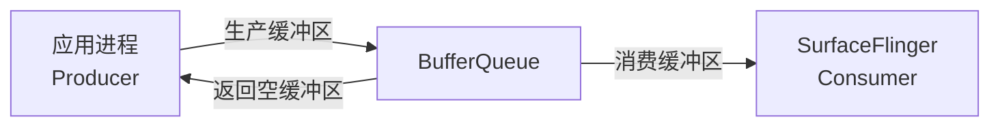
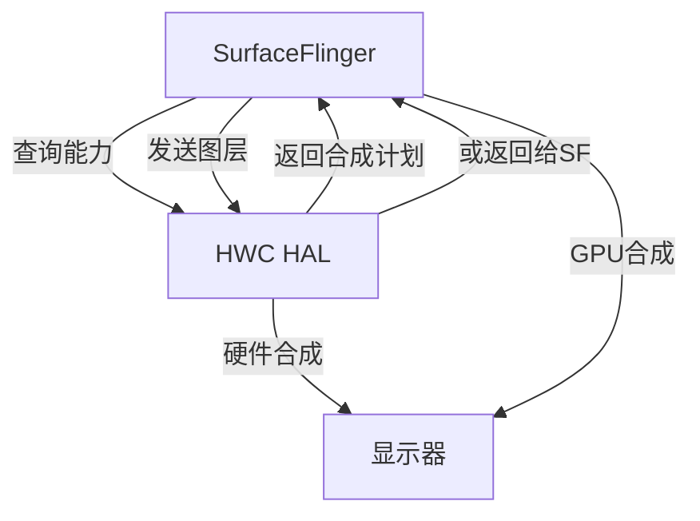
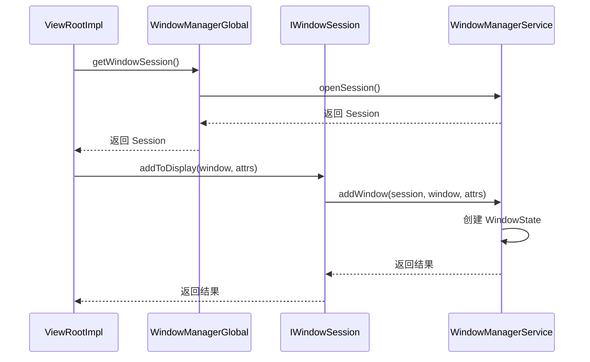
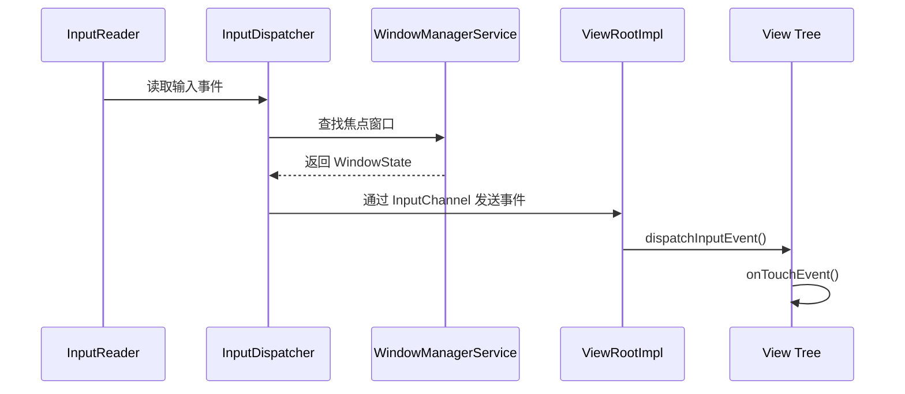

# Window 系统进阶篇：层级详解与交互机制

## 📋 概述

在基础篇中，我们建立了对 Android 窗口系统架构的整体认知。本篇将深入各层级的实现细节，详细分析层级之间的交互机制，以及窗口与其他系统模块（输入系统、动画系统、Activity）的协作方式。通过源码级别的分析，帮助读者理解窗口系统的内部工作原理。

---

## 一、各层级详解

### 1.1 应用层详解

#### 1.1.1 ViewRootImpl 的作用和实现

**ViewRootImpl 是连接应用层和 Framework 层的桥梁**，它是窗口系统中最重要的类之一。

**核心职责**：

1. **管理 View 树的生命周期**
   ```java
   // ViewRootImpl.java (简化)
   public final class ViewRootImpl implements ViewParent {
       private View mView;  // 根 View（通常是 DecorView）
       
       public void setView(View view, WindowManager.LayoutParams attrs, View panelParentView) {
           mView = view;
           // 请求布局
           requestLayout();
           // 添加到 WindowManagerService
           mWindowSession.addToDisplay(mWindow, ..., mWindowAttributes);
       }
   }
   ```

2. **驱动 View 的测量、布局、绘制**
   ```java
   // ViewRootImpl.java
   private void performTraversals() {
       // 1. 测量阶段
       performMeasure(childWidthMeasureSpec, childHeightMeasureSpec);
       
       // 2. 布局阶段
       performLayout(lp, desiredWindowWidth, desiredWindowHeight);
       
       // 3. 绘制阶段
       performDraw();
   }
   ```

3. **管理 Surface 和绘制**
   ```java
   // ViewRootImpl.java
   private void performDraw() {
       // 获取 Surface
       Surface surface = mSurface;
       if (!surface.isValid()) {
           return;
       }
       
       // 绘制到 Surface
       Canvas canvas = surface.lockCanvas(dirty);
       try {
           mView.draw(canvas);
       } finally {
           surface.unlockCanvasAndPost(canvas);
       }
   }
   ```

4. **处理输入事件**
   ```java
   // ViewRootImpl.java
   public void dispatchInputEvent(InputEvent event) {
       // 将输入事件分发给 View 树
       mView.dispatchPointerEvent(event);
   }
   ```

**关键成员变量**：

| 变量 | 类型 | 说明 |
| :--- | :--- | :--- |
| `mWindowSession` | `IWindowSession` | 与 WindowManagerService 通信的 Binder 接口 |
| `mWindow` | `IWindow.Stub` | 窗口的 Binder 接口，用于接收 WMS 的回调 |
| `mSurface` | `Surface` | 窗口对应的 Surface |
| `mView` | `View` | 根 View（通常是 DecorView） |

#### 1.1.2 Window 的创建和管理

**PhoneWindow 是 Window 的具体实现**，每个 Activity 都有一个 PhoneWindow。

```java
// PhoneWindow.java (简化)
public class PhoneWindow extends Window {
    private DecorView mDecor;  // 窗口的根 View
    
    @Override
    public void setContentView(int layoutResID) {
        if (mContentParent == null) {
            installDecor();  // 创建 DecorView
        }
        // 将内容添加到 DecorView
        mLayoutInflater.inflate(layoutResID, mContentParent);
    }
    
    private void installDecor() {
        if (mDecor == null) {
            mDecor = generateDecor();  // 创建 DecorView
        }
        if (mContentParent == null) {
            mContentParent = generateLayout(mDecor);  // 创建内容区域
        }
    }
}
```

**Window 的创建时机**：

```java
// Activity.java
final void attach(Context context, ...) {
    // Activity 创建时，创建 PhoneWindow
    mWindow = new PhoneWindow(this, window, activityConfigCallback);
    mWindow.setWindowManager(
        (WindowManager)context.getSystemService(Context.WINDOW_SERVICE),
        mToken, mComponent.flattenToString(),
        (info.flags & ActivityInfo.FLAG_HARDWARE_ACCELERATED) != 0);
}
```

#### 1.1.3 DecorView 和 Window 的关系

**DecorView 是窗口的根 View**，它包含了窗口的装饰（标题栏、状态栏等）和内容区域。

```java
// DecorView.java (简化)
public class DecorView extends FrameLayout {
    // DecorView 包含：
    // 1. 标题栏（可选）
    // 2. 内容区域（mContentParent）
    // 3. 状态栏背景（可选）
}
```

**结构关系**：
```
PhoneWindow
    └── DecorView (根 View)
        ├── 标题栏（可选）
        └── mContentParent (内容区域)
            └── 应用设置的 View 树
```

### 1.2 Framework 层详解

#### 1.2.1 WindowManagerService 核心类

##### WindowState：窗口状态管理

**WindowState 表示一个窗口的完整状态**，是 WMS 中最重要的类之一。

```java
// WindowState.java (简化)
public class WindowState extends WindowContainer<WindowState> {
    final Session mSession;  // 窗口所属的 Session
    final IWindow mClient;   // 窗口的客户端接口
    WindowToken mToken;      // 窗口令牌
    
    // 窗口属性
    int mRequestedWidth;     // 请求的宽度
    int mRequestedHeight;    // 请求的高度
    int mLayer;              // Z-order 层级
    
    // Surface 相关
    SurfaceControl mSurfaceControl;  // Surface 控制
    Surface mSurface;                // Surface（已废弃，使用 mSurfaceControl）
    
    // 窗口状态
    boolean mHasSurface;     // 是否有 Surface
    boolean mVisible;        // 是否可见
    boolean mAnimating;      // 是否在动画中
}
```

**WindowState 的生命周期**：

1. **创建**：`addWindow()` 时创建
2. **布局**：`performLayoutAndPlaceSurfacesLocked()` 时更新
3. **显示**：`show()` 时显示
4. **隐藏**：`hide()` 时隐藏
5. **销毁**：`removeWindow()` 时销毁

##### WindowToken：窗口令牌机制

**WindowToken 用于窗口的分组和权限控制**。

```java
// WindowToken.java (简化)
public class WindowToken extends WindowContainer<WindowState> {
    final IBinder token;     // 令牌标识
    final int windowType;    // 窗口类型
    final boolean persistOnEmpty;  // 是否持久化
    
    // 该令牌下的所有窗口
    final ArrayList<WindowState> windows = new ArrayList<>();
}
```

**WindowToken 的作用**：

1. **权限控制**：某些窗口类型需要特定的权限
2. **分组管理**：同一 Activity 的多个窗口共享一个 Token
3. **生命周期管理**：Token 销毁时，所有相关窗口都会被销毁

**Token 的创建**：

```java
// WindowManagerService.java
public int addWindow(Session session, IWindow client, ...) {
    // 获取或创建 WindowToken
    WindowToken token = mTokenMap.get(attrs.token);
    if (token == null) {
        token = new WindowToken(this, attrs.token, windowType, ...);
        mTokenMap.put(attrs.token, token);
    }
    
    // 创建 WindowState
    WindowState win = new WindowState(this, session, client, token, ...);
    token.addWindow(win);
}
```

##### DisplayContent：多显示器支持

**DisplayContent 管理某个显示器上的所有窗口**。

```java
// DisplayContent.java (简化)
public class DisplayContent extends WindowContainer<WindowState> {
    final int mDisplayId;  // 显示器 ID
    
    // 该显示器上的所有窗口
    final WindowList<WindowState> mWindows = new WindowList<>();
    
    // 窗口层级管理
    final WindowLayersController mLayersController;
}
```

**多显示器支持**：

- Android 支持多个物理显示器（手机屏幕、外接显示器等）
- 每个显示器有独立的 DisplayContent
- 窗口可以指定显示在哪个显示器上

##### WindowLayersController：Z-order 管理

**WindowLayersController 负责计算窗口的 Z-order（层级）**。

```java
// WindowLayersController.java (简化)
class WindowLayersController {
    void assignLayersLocked(WindowList<WindowState> windows) {
        // 1. 按窗口类型分配基础层级
        for (WindowState w : windows) {
            int baseLayer = mPolicy.windowTypeToLayerLw(w.mAttrs.type);
            w.mBaseLayer = baseLayer;
        }
        
        // 2. 应用子层级调整
        // 3. 处理动画层级
        // 4. 处理特殊窗口（IME、壁纸等）
        
        // 5. 最终计算层级
        for (WindowState w : windows) {
            w.mLayer = calculateLayer(w);
        }
    }
}
```

**层级计算规则**：

1. **基础层级**：根据窗口类型确定
2. **子层级**：同一类型的窗口按添加顺序分配子层级
3. **动画层级**：动画中的窗口可能临时提升层级
4. **特殊调整**：IME、壁纸等特殊窗口有特殊处理

#### 1.2.2 WindowManagerPolicy：窗口策略

**WindowManagerPolicy 定义了窗口管理的策略**，PhoneWindowManager 是其具体实现。

```java
// PhoneWindowManager.java (简化)
public class PhoneWindowManager implements WindowManagerPolicy {
    // 窗口类型到层级的映射
    @Override
    public int windowTypeToLayerLw(int type) {
        switch (type) {
            case TYPE_BASE_APPLICATION:
                return APPLICATION_LAYER;
            case TYPE_APPLICATION:
                return APPLICATION_LAYER;
            case TYPE_STATUS_BAR:
                return STATUS_BAR_LAYER;
            case TYPE_NAVIGATION_BAR:
                return NAVIGATION_BAR_LAYER;
            // ...
        }
    }
    
    // 布局策略
    @Override
    public void layoutWindowLw(WindowState win, WindowState attached) {
        // 计算窗口的位置和大小
        // 考虑状态栏、导航栏等系统 UI
    }
}
```

**策略的作用**：

1. **层级映射**：定义窗口类型到层级的映射关系
2. **布局策略**：定义窗口的布局规则
3. **权限控制**：定义哪些窗口类型需要权限
4. **特殊处理**：处理系统 UI、输入法等特殊窗口

#### 1.2.3 Session 和 IWindowSession：IPC 通信

**Session 是应用进程与 WMS 通信的桥梁**。

```java
// Session.java (简化)
class Session extends IWindowSession.Stub {
    final WindowManagerService mService;
    final SurfaceSession mSurfaceSession;  // 用于创建 Surface
    
    @Override
    public int addToDisplay(IWindow window, ...) {
        return mService.addWindow(this, window, ...);
    }
    
    @Override
    public int relayout(IWindow window, ...) {
        return mService.relayoutWindow(this, window, ...);
    }
    
    @Override
    public void remove(IWindow window) {
        mService.removeWindow(this, window);
    }
}
```

**通信流程**：

```
应用进程                    SystemServer 进程
    |                            |
    |-- addToDisplay() --------> |
    |                            |-- Session.addToDisplay()
    |                            |-- WMS.addWindow()
    |<-- 返回结果 -------------- |
```

### 1.3 Native 层详解

#### 1.3.1 Surface 和 BufferQueue

**Surface 背后是 BufferQueue（缓冲区队列）**。



**BufferQueue 的工作流程**：

1. **应用请求缓冲区**：`dequeueBuffer()` 获取一个空闲缓冲区
2. **应用绘制内容**：在缓冲区上绘制 UI
3. **应用提交缓冲区**：`queueBuffer()` 将缓冲区加入队列
4. **SurfaceFlinger 获取缓冲区**：`acquireBuffer()` 获取已绘制的缓冲区
5. **SurfaceFlinger 合成**：将缓冲区合成到最终画面
6. **SurfaceFlinger 释放缓冲区**：`releaseBuffer()` 释放缓冲区，返回给应用

**双缓冲机制**：

- **Front Buffer**：当前显示的缓冲区
- **Back Buffer**：应用正在绘制的缓冲区
- 应用绘制完成后，交换 Front 和 Back Buffer

**三缓冲机制**（Android 4.1+）：

- 增加一个额外的缓冲区，减少等待时间
- 应用可以在 SurfaceFlinger 合成时继续绘制下一帧

#### 1.3.2 SurfaceControl 和 SurfaceTransaction

**SurfaceControl 用于控制 Surface 的属性**。

```java
// SurfaceControl.java (简化)
public class SurfaceControl {
    private final long mNativeObject;  // Native 对象指针
    
    // 创建 SurfaceControl
    public static class Builder {
        public SurfaceControl build() {
            return new SurfaceControl(...);
        }
    }
    
    // 通过 Transaction 修改属性
    public static class Transaction {
        public Transaction setPosition(SurfaceControl sc, float x, float y) { ... }
        public Transaction setSize(SurfaceControl sc, int w, int h) { ... }
        public Transaction setLayer(SurfaceControl sc, int z) { ... }
        public Transaction setAlpha(SurfaceControl sc, float alpha) { ... }
        public void apply() { ... }  // 原子提交所有更改
    }
}
```

**SurfaceTransaction 的作用**：

- **原子性**：多个属性更改可以原子提交
- **性能优化**：减少与 SurfaceFlinger 的通信次数
- **一致性**：确保所有更改同时生效

#### 1.3.3 SurfaceFlinger 的组成

**SurfaceFlinger 是图形合成服务**，运行在独立的进程中。

**核心组件**：

1. **Layer**：合成单元
   ```cpp
   // Layer.h (简化)
   class Layer {
       sp<BufferQueueLayer> mBufferQueueLayer;  // 缓冲区队列层
       int32_t mZ;                              // Z-order
       bool mVisible;                           // 是否可见
   };
   ```

2. **VSYNC 机制**：
   ```cpp
   // SurfaceFlinger.cpp
   void SurfaceFlinger::onMessageReceived(int32_t what) {
       if (what == MessageQueue::INVALIDATE) {
           // VSYNC 信号到来
           onMessageInvalidate();
       }
   }
   
   void SurfaceFlinger::onMessageInvalidate() {
       // 合成所有可见的 Layer
       composeSurfaces();
   }
   ```

3. **合成策略**：
   - **硬件合成（Overlay）**：由 HWC 处理
   - **客户端合成（GPU）**：由 SurfaceFlinger 使用 GPU 合成

### 1.4 HAL 层详解

#### 1.4.1 Hardware Composer (HWC) 的作用

**HWC 是硬件抽象层，决定如何最优地合成窗口**。

**HWC 的决策流程**：



**合成类型**：

| 类型 | 说明 | 功耗 | 性能 |
| :--- | :--- | :--- | :--- |
| **HWC_OVERLAY** | 硬件 Overlay 合成 | 低 | 高 |
| **HWC_CLIENT** | 客户端（GPU）合成 | 高 | 中 |
| **HWC_SOLID_COLOR** | 纯色层 | 极低 | 极高 |

**HWC 的优势**：

1. **功耗优化**：硬件合成比 GPU 合成功耗更低
2. **性能优化**：硬件合成延迟更低
3. **灵活性**：可以根据硬件能力动态选择合成方式

---

## 二、层级之间的交互

### 2.1 应用层 ↔ Framework 层

#### 2.1.1 ViewRootImpl 与 WindowManagerService 的交互

**交互流程**：



#### 2.1.2 addWindow 流程详解

**完整流程**：

```java
// WindowManagerService.java (简化)
public int addWindow(Session session, IWindow client, ...) {
    // 1. 权限检查
    int res = mPolicy.checkAddPermission(attrs, ...);
    if (res != WindowManagerGlobal.ADD_OKAY) {
        return res;
    }
    
    // 2. 获取或创建 WindowToken
    WindowToken token = mTokenMap.get(attrs.token);
    if (token == null) {
        token = new WindowToken(this, attrs.token, windowType, ...);
        mTokenMap.put(attrs.token, token);
    }
    
    // 3. 创建 WindowState
    WindowState win = new WindowState(this, session, client, token, ...);
    
    // 4. 添加到窗口列表
    token.addWindow(win);
    mWindowMap.put(client.asBinder(), win);
    
    // 5. 执行布局
    performLayoutAndPlaceSurfacesLocked();
    
    return WindowManagerGlobal.ADD_OKAY;
}
```

#### 2.1.3 relayoutWindow 流程详解

**relayoutWindow 在窗口布局发生变化时调用**。

```java
// WindowManagerService.java (简化)
public int relayoutWindow(Session session, IWindow client, ...) {
    WindowState win = windowForClientLocked(session, client, false);
    if (win == null) {
        return 0;
    }
    
    // 1. 更新窗口属性
    win.mRequestedWidth = requestedWidth;
    win.mRequestedHeight = requestedHeight;
    
    // 2. 执行布局
    performLayoutAndPlaceSurfacesLocked();
    
    // 3. 创建或更新 Surface
    if (win.mHasSurface) {
        // 更新 Surface 属性
        win.mSurfaceControl.setSize(win.mFrame.width(), win.mFrame.height());
    } else {
        // 创建 Surface
        win.createSurfaceControl();
    }
    
    // 4. 返回 Surface 信息
    outSurface.copyFrom(win.mSurface);
    return (win.mVisible ? 1 : 0);
}
```

#### 2.1.4 removeWindow 流程详解

```java
// WindowManagerService.java (简化)
public void removeWindow(Session session, IWindow client) {
    WindowState win = windowForClientLocked(session, client, false);
    if (win == null) {
        return;
    }
    
    // 1. 标记为销毁中
    win.mRemoved = true;
    
    // 2. 移除窗口
    win.removeIfPossible();
    
    // 3. 销毁 Surface
    win.destroySurface();
    
    // 4. 从列表中移除
    mWindowMap.remove(client.asBinder());
    win.mToken.removeWindow(win);
    
    // 5. 重新布局
    performLayoutAndPlaceSurfacesLocked();
}
```

### 2.2 Framework 层 ↔ Native 层

#### 2.2.1 WindowManagerService 如何创建 Surface

**Surface 的创建流程**：

```java
// WindowState.java (简化)
void createSurfaceControl() {
    // 1. 创建 SurfaceControl
    mSurfaceControl = new SurfaceControl.Builder(mSession.mSurfaceSession)
        .setName(getName())
        .setBufferSize(mRequestedWidth, mRequestedHeight)
        .setFormat(PixelFormat.TRANSLUCENT)
        .build();
    
    // 2. 设置 Surface 属性
    SurfaceControl.Transaction t = new SurfaceControl.Transaction();
    t.setLayer(mSurfaceControl, mLayer);
    t.setPosition(mSurfaceControl, mFrame.left, mFrame.top);
    t.setSize(mSurfaceControl, mFrame.width(), mFrame.height());
    t.apply();
    
    // 3. 创建 Surface（用于绘制）
    mSurface = new Surface(mSurfaceControl);
    mHasSurface = true;
}
```

**SurfaceSession 的作用**：

- SurfaceSession 代表一个应用进程与 SurfaceFlinger 的连接
- 一个 Session 下的所有 Surface 共享一个连接
- 减少与 SurfaceFlinger 的通信开销

#### 2.2.2 SurfaceControl 的创建和管理

**SurfaceControl 的创建**：

```java
// SurfaceControl.java (简化)
public static class Builder {
    public SurfaceControl build() {
        // 调用 Native 方法创建 SurfaceControl
        long nativeObject = nativeCreate(session, name, width, height, format, flags);
        return new SurfaceControl(nativeObject);
    }
}
```

**Native 层的实现**：

```cpp
// android_view_SurfaceControl.cpp
static jlong nativeCreate(JNIEnv* env, jclass clazz, ...) {
    // 创建 SurfaceControl
    sp<SurfaceControl> surfaceControl = new SurfaceControl(
        session, name, width, height, format, flags);
    return reinterpret_cast<jlong>(surfaceControl.get());
}
```

#### 2.2.3 窗口元数据如何传递给 SurfaceFlinger

**元数据传递流程**：

```java
// WindowState.java
void updateSurfacePosition() {
    SurfaceControl.Transaction t = new SurfaceControl.Transaction();
    t.setPosition(mSurfaceControl, mFrame.left, mFrame.top);
    t.setSize(mSurfaceControl, mFrame.width(), mFrame.height());
    t.setLayer(mSurfaceControl, mLayer);
    t.setAlpha(mSurfaceControl, mAlpha);
    t.setVisibility(mSurfaceControl, mVisible);
    t.apply();  // 原子提交所有更改
}
```

**Transaction 的原子性**：

- 多个属性更改可以打包在一个 Transaction 中
- `apply()` 时原子提交，SurfaceFlinger 看到一致的状态
- 避免中间状态导致的视觉问题

### 2.3 Native 层 ↔ HAL 层

#### 2.3.1 SurfaceFlinger 与 HWC 的交互

**交互流程**：

```cpp
// SurfaceFlinger.cpp (简化)
void SurfaceFlinger::composeSurfaces() {
    // 1. 收集所有可见的 Layer
    Vector<Layer*> layers;
    collectVisibleLayers(layers);
    
    // 2. 查询 HWC 的合成能力
    hwc_display_contents_1_t* hwcList = mHwc->prepare(layers);
    
    // 3. 根据 HWC 的决策处理每个 Layer
    for (size_t i = 0; i < layers.size(); i++) {
        Layer* layer = layers[i];
        if (hwcList->hwLayers[i].compositionType == HWC_OVERLAY) {
            // HWC 处理
            // 不需要 SurfaceFlinger 合成
        } else {
            // SurfaceFlinger 使用 GPU 合成
            composeLayer(layer);
        }
    }
    
    // 4. 提交给 HWC
    mHwc->set(hwcList);
}
```

#### 2.3.2 合成策略的选择

**HWC 的决策因素**：

1. **Layer 数量**：硬件 Overlay 数量有限
2. **Layer 大小**：某些大小可能不支持 Overlay
3. **变换**：旋转、缩放可能不支持 Overlay
4. **透明度**：某些透明度可能不支持 Overlay

**优化策略**：

- 优先使用硬件 Overlay（功耗低）
- 当硬件能力不足时，回退到 GPU 合成
- 动态调整合成策略

---

## 三、窗口与其他模块的交互

### 3.1 窗口与输入系统

#### 3.1.1 InputChannel 的创建

**InputChannel 用于窗口接收输入事件**。

```java
// WindowManagerService.java (简化)
public int addWindow(Session session, IWindow client, ...) {
    WindowState win = new WindowState(...);
    
    // 创建 InputChannel
    InputChannel[] inputChannels = InputChannel.openInputChannelPair(win.getName());
    win.mInputChannel = inputChannels[0];  // 服务端
    InputChannel clientChannel = inputChannels[1];  // 客户端
    
    // 注册到 InputManagerService
    mInputManager.registerInputChannel(win.mInputChannel, win.mInputWindowHandle);
    
    // 返回客户端 InputChannel
    outInputChannel = clientChannel;
}
```

**InputChannel 的作用**：

- 建立窗口与输入系统的连接
- 输入事件通过 InputChannel 传递给窗口
- 每个窗口有独立的 InputChannel

#### 3.1.2 输入事件的分发路径

**完整分发路径**：



**焦点窗口的选择**：

```java
// WindowManagerService.java
WindowState findFocusedWindow() {
    // 1. 获取当前焦点窗口
    WindowState focused = getFocusedWindow();
    
    // 2. 检查窗口是否可见、可接收输入
    if (focused != null && focused.canReceiveInput()) {
        return focused;
    }
    
    // 3. 查找下一个可接收输入的窗口
    return findNextFocusableWindow();
}
```

### 3.2 窗口与动画系统

#### 3.2.1 窗口动画的实现

**窗口动画由 WindowStateAnimator 处理**。

```java
// WindowStateAnimator.java (简化)
class WindowStateAnimator {
    Animation mAnimation;  // 窗口动画
    
    void startAnimation(Animation anim) {
        mAnimation = anim;
        mAnimation.initialize(mWin.mFrame.width(), mWin.mFrame.height(), ...);
        mAnimation.start();
    }
    
    boolean stepAnimationLocked(long currentTime) {
        if (mAnimation == null || !mAnimation.isInitialized()) {
            return false;
        }
        
        // 计算动画进度
        Transformation trans = mAnimation.getTransformation(currentTime, mTransformation);
        
        // 应用变换
        mWin.mSurfaceControl.setAlpha(trans.getAlpha());
        mWin.mSurfaceControl.setMatrix(trans.getMatrix());
        
        return mAnimation.hasEnded();
    }
}
```

#### 3.2.2 WindowStateAnimator 的作用

**WindowStateAnimator 负责窗口动画的执行**。

**动画类型**：

1. **进入动画**：窗口显示时的动画
2. **退出动画**：窗口隐藏时的动画
3. **过渡动画**：Activity 切换时的动画

**动画对 Z-order 的影响**：

- 动画中的窗口可能临时提升层级
- 确保动画窗口显示在其他窗口之上
- 动画结束后恢复原始层级

### 3.3 窗口与 Activity 生命周期

#### 3.3.1 Activity 窗口的创建时机

**窗口创建流程**：

```java
// ActivityThread.java (简化)
private Activity performLaunchActivity(ActivityClientRecord r, Intent customIntent) {
    // 1. 创建 Activity 实例
    Activity activity = mInstrumentation.newActivity(...);
    
    // 2. 创建 Application
    Application app = r.packageInfo.makeApplication(false, mInstrumentation);
    
    // 3. 调用 Activity.attach()
    activity.attach(appContext, this, ...);
    // attach() 中创建 PhoneWindow
    
    // 4. 调用 onCreate()
    mInstrumentation.callActivityOnCreate(activity, r.state);
    // onCreate() 中调用 setContentView()
}
```

**关键时机**：

- **attach()**：创建 PhoneWindow
- **onCreate()**：设置内容 View
- **onResume()**：窗口变为可见

#### 3.3.2 窗口可见性与 Activity 状态的关系

**状态对应关系**：

| Activity 状态 | 窗口状态 | 说明 |
| :--- | :--- | :--- |
| **onCreate()** | 创建但不可见 | 窗口已创建，但未显示 |
| **onStart()** | 准备显示 | 窗口准备显示 |
| **onResume()** | 可见且可交互 | 窗口可见，可接收输入 |
| **onPause()** | 部分可见 | 窗口可能被其他窗口覆盖 |
| **onStop()** | 不可见 | 窗口隐藏 |
| **onDestroy()** | 销毁 | 窗口被销毁 |

#### 3.3.3 窗口销毁与 Activity 销毁的协调

**销毁流程**：

```java
// ActivityThread.java (简化)
void handleDestroyActivity(IBinder token, ...) {
    ActivityClientRecord r = mActivities.get(token);
    
    // 1. 调用 onPause()
    performPauseActivity(r, false, ...);
    
    // 2. 调用 onStop()
    performStopActivity(r, false, ...);
    
    // 3. 调用 onDestroy()
    performDestroyActivity(r, false, ...);
    // onDestroy() 中会调用 WindowManager.removeView()
    
    // 4. 清理资源
    r.activity = null;
}
```

**协调机制**：

- Activity 销毁时，自动销毁窗口
- 窗口销毁时，通知 Activity
- 确保资源正确释放

---

## 四、总结

### 4.1 核心要点

1. **ViewRootImpl 是应用层和 Framework 层的桥梁**
2. **WindowState 管理窗口的完整状态**
3. **Surface 和 BufferQueue 实现双缓冲/三缓冲**
4. **SurfaceFlinger 在 VSYNC 时合成所有窗口**
5. **HWC 优化合成策略，降低功耗**

### 4.2 交互机制

- **应用 ↔ Framework**：通过 IWindowSession Binder IPC
- **Framework ↔ Native**：通过 SurfaceControl 和 Surface
- **Native ↔ HAL**：通过 HWC HAL 接口

### 4.3 与其他模块的协作

- **输入系统**：通过 InputChannel 传递输入事件
- **动画系统**：通过 WindowStateAnimator 执行动画
- **Activity**：窗口生命周期与 Activity 生命周期绑定

---

**提示**：理解窗口系统的交互机制是分析 ANR、性能问题的基础。建议结合源码和调试工具（如 `dumpsys window`、`dumpsys SurfaceFlinger`）来加深理解。
