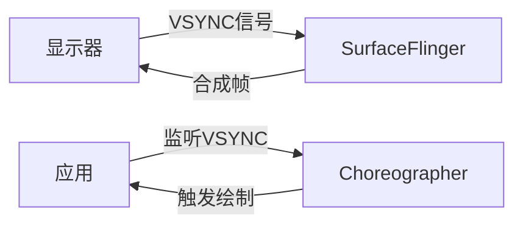

# Window 系统专家篇：高级特性、性能优化与问题诊断

## 📋 概述

在前两篇中，我们深入理解了 Android 窗口系统的架构、实现和交互机制。本篇将聚焦于窗口系统的高级特性、性能优化策略以及问题诊断方法。通过源码级别的分析和实战案例，帮助读者掌握窗口系统的深度优化和问题排查技能。

---

## 一、高级特性

### 1.1 多显示器支持

#### 1.1.1 DisplayContent 的实现

**DisplayContent 管理某个显示器上的所有窗口**，Android 支持多个物理显示器。

```java
// DisplayContent.java (简化)
public class DisplayContent extends WindowContainer<WindowState> {
    final int mDisplayId;  // 显示器 ID（0=主屏，1=外接显示器等）
    
    // 该显示器上的所有窗口
    final WindowList<WindowState> mWindows = new WindowList<>();
    
    // 窗口层级管理
    final WindowLayersController mLayersController;
    
    // 显示器信息
    DisplayInfo mDisplayInfo;
    
    DisplayContent(WindowManagerService service, Display display) {
        mDisplayId = display.getDisplayId();
        mDisplayInfo = display.getDisplayInfo();
        mLayersController = new WindowLayersController(this);
    }
}
```

**多显示器的窗口管理**：

```java
// WindowManagerService.java
public int addWindow(Session session, IWindow client, int seq, ...) {
    // 获取目标显示器
    DisplayContent displayContent = getDisplayContent(displayId);
    if (displayContent == null) {
        displayContent = createDisplayContent(displayId);
    }
    
    // 在指定显示器上创建窗口
    WindowState win = new WindowState(this, session, client, ...);
    displayContent.addWindow(win);
}
```

**多显示器的特点**：

1. **独立的窗口列表**：每个显示器有独立的窗口列表
2. **独立的 Z-order**：每个显示器的窗口层级独立计算
3. **独立的布局**：每个显示器的窗口布局独立计算
4. **跨显示器窗口**：某些窗口可以跨显示器显示（如某些系统窗口）

#### 1.1.2 窗口在不同显示器间的管理

**窗口可以指定显示在哪个显示器上**：

```java
// WindowManager.LayoutParams.java
public static class LayoutParams {
    // 指定窗口显示的显示器 ID
    public int displayId = Display.INVALID_DISPLAY;
}
```

**窗口迁移**：

```java
// WindowState.java
void setDisplayContent(DisplayContent displayContent) {
    if (mDisplayContent == displayContent) {
        return;
    }
    
    // 从旧显示器移除
    if (mDisplayContent != null) {
        mDisplayContent.removeWindow(this);
    }
    
    // 添加到新显示器
    mDisplayContent = displayContent;
    displayContent.addWindow(this);
    
    // 重新布局
    mService.performLayoutAndPlaceSurfacesLocked();
}
```

### 1.2 窗口动画的高级实现

#### 1.2.1 动画层的管理

**动画中的窗口需要临时提升层级**，确保动画效果正确显示。

```java
// WindowLayersController.java
void assignLayersLocked(WindowList<WindowState> windows) {
    // 1. 分配基础层级
    for (WindowState w : windows) {
        w.mBaseLayer = mPolicy.windowTypeToLayerLw(w.mAttrs.type);
    }
    
    // 2. 处理动画层级
    for (WindowState w : windows) {
        if (w.isAnimating()) {
            // 动画中的窗口提升到动画层
            w.mLayer = ANIMATION_LAYER_BASE + w.mAnimLayer;
        } else {
            // 普通窗口使用基础层级
            w.mLayer = w.mBaseLayer + w.mSubLayer;
        }
    }
}
```

**动画层级的计算**：

```java
// WindowStateAnimator.java
void updateLayer() {
    if (mAnimation != null && mAnimation.hasStarted()) {
        // 计算动画层级
        int animLayer = mWin.mBaseLayer;
        
        // 根据动画类型调整层级
        if (mAnimation.getZAdjustment() == Animation.ZORDER_TOP) {
            animLayer += ANIMATION_LAYER_OFFSET;
        } else if (mAnimation.getZAdjustment() == Animation.ZORDER_BOTTOM) {
            animLayer -= ANIMATION_LAYER_OFFSET;
        }
        
        mWin.mAnimLayer = animLayer;
    }
}
```

#### 1.2.2 动画对合成的影响

**窗口动画会影响合成性能**：

1. **频繁更新**：动画需要每帧更新窗口属性
2. **层级变化**：动画可能改变窗口层级，触发重新排序
3. **透明度变化**：透明度动画需要 Alpha 混合，增加合成开销

**优化策略**：

```java
// WindowStateAnimator.java
boolean stepAnimationLocked(long currentTime) {
    if (mAnimation == null) {
        return false;
    }
    
    // 计算动画变换
    Transformation trans = mAnimation.getTransformation(currentTime, mTransformation);
    
    // 批量更新 Surface 属性
    SurfaceControl.Transaction t = new SurfaceControl.Transaction();
    t.setAlpha(mWin.mSurfaceControl, trans.getAlpha());
    t.setMatrix(mWin.mSurfaceControl, trans.getMatrix());
    t.setPosition(mWin.mSurfaceControl, trans.getTranslationX(), trans.getTranslationY());
    t.apply();  // 原子提交，减少通信次数
    
    return !mAnimation.hasEnded();
}
```

### 1.3 窗口裁剪和变换

#### 1.3.1 窗口裁剪的实现

**窗口可以被裁剪**，只显示部分区域。

```java
// WindowState.java
void updateCrop() {
    Rect crop = new Rect();
    
    // 计算裁剪区域
    if (mAttrs.cropToPadding) {
        // 裁剪到 padding 区域
        crop.set(mPaddingLeft, mPaddingTop, 
                 mFrame.width() - mPaddingRight, 
                 mFrame.height() - mPaddingBottom);
    } else {
        // 使用指定的裁剪区域
        crop.set(mAttrs.crop);
    }
    
    // 应用裁剪
    SurfaceControl.Transaction t = new SurfaceControl.Transaction();
    t.setCrop(mSurfaceControl, crop);
    t.apply();
}
```

**裁剪的应用场景**：

1. **ScrollView**：只显示可见区域
2. **ListView/RecyclerView**：只显示可见项
3. **窗口动画**：动画过程中的裁剪效果

#### 1.3.2 窗口变换（旋转、缩放）的处理

**窗口可以应用变换**（旋转、缩放、平移等）。

```java
// WindowState.java
void updateTransform() {
    Matrix matrix = new Matrix();
    
    // 应用旋转
    if (mRotation != 0) {
        matrix.postRotate(mRotation, mFrame.centerX(), mFrame.centerY());
    }
    
    // 应用缩放
    if (mScaleX != 1.0f || mScaleY != 1.0f) {
        matrix.postScale(mScaleX, mScaleY, mFrame.centerX(), mFrame.centerY());
    }
    
    // 应用变换
    SurfaceControl.Transaction t = new SurfaceControl.Transaction();
    t.setMatrix(mSurfaceControl, matrix, new float[9]);
    t.apply();
}
```

**变换对合成的影响**：

- **硬件支持**：某些变换可能不支持硬件 Overlay
- **性能影响**：复杂变换需要 GPU 合成，增加功耗
- **精度问题**：变换可能导致像素对齐问题

### 1.4 窗口层级（Z-order）的复杂计算

#### 1.4.1 assignLayersLocked 算法详解

**Z-order 的计算是窗口系统最复杂的部分之一**。

```java
// WindowLayersController.java
void assignLayersLocked(WindowList<WindowState> windows) {
    // 第一步：按窗口类型分配基础层级
    for (WindowState w : windows) {
        int baseLayer = mPolicy.windowTypeToLayerLw(w.mAttrs.type);
        w.mBaseLayer = baseLayer;
    }
    
    // 第二步：在同一类型内分配子层级
    Map<Integer, Integer> subLayerCount = new HashMap<>();
    for (WindowState w : windows) {
        int type = w.mAttrs.type;
        int subLayer = subLayerCount.getOrDefault(type, 0);
        w.mSubLayer = subLayer;
        subLayerCount.put(type, subLayer + 1);
    }
    
    // 第三步：处理特殊窗口
    // 3.1 IME（输入法）窗口
    for (WindowState w : windows) {
        if (w.mAttrs.type == TYPE_INPUT_METHOD) {
            // IME 窗口显示在应用窗口之上
            w.mBaseLayer = APPLICATION_LAYER + 1;
        }
    }
    
    // 3.2 壁纸窗口
    for (WindowState w : windows) {
        if (w.mAttrs.type == TYPE_WALLPAPER) {
            // 壁纸窗口显示在应用窗口之下
            w.mBaseLayer = APPLICATION_LAYER - 1;
        }
    }
    
    // 第四步：处理动画层级
    for (WindowState w : windows) {
        if (w.isAnimating()) {
            w.mLayer = ANIMATION_LAYER_BASE + w.mAnimLayer;
        } else {
            w.mLayer = w.mBaseLayer + w.mSubLayer;
        }
    }
    
    // 第五步：处理窗口关系（父子窗口、附加窗口）
    for (WindowState w : windows) {
        if (w.mAttachedWindow != null) {
            // 子窗口的层级受父窗口影响
            w.mLayer = w.mAttachedWindow.mLayer + w.mAttrs.subtype;
        }
    }
    
    // 第六步：最终计算并应用
    for (WindowState w : windows) {
        int finalLayer = calculateFinalLayer(w);
        w.mLayer = finalLayer;
        
        // 应用到 Surface
        SurfaceControl.Transaction t = new SurfaceControl.Transaction();
        t.setLayer(w.mSurfaceControl, finalLayer);
        t.apply();
    }
}
```

**层级计算的关键点**：

1. **基础层级**：由窗口类型决定
2. **子层级**：同一类型的窗口按添加顺序分配
3. **特殊调整**：IME、壁纸等特殊窗口有特殊处理
4. **动画调整**：动画中的窗口临时提升层级
5. **关系调整**：父子窗口、附加窗口的层级关系

#### 1.4.2 特殊窗口类型的层级处理

**特殊窗口的层级规则**：

| 窗口类型 | 基础层级 | 说明 |
| :--- | :--- | :--- |
| **TYPE_STATUS_BAR** | 210000 | 状态栏，最高层级 |
| **TYPE_NAVIGATION_BAR** | 201000 | 导航栏 |
| **TYPE_SYSTEM_ALERT** | 200300 | 系统提示窗口 |
| **TYPE_INPUT_METHOD** | 201000 | 输入法窗口 |
| **TYPE_APPLICATION** | 2 | 应用窗口 |
| **TYPE_WALLPAPER** | -200000 | 壁纸，最低层级 |

**动态调整**：

```java
// PhoneWindowManager.java
int windowTypeToLayerLw(int type) {
    switch (type) {
        case TYPE_STATUS_BAR:
            return STATUS_BAR_LAYER;
        case TYPE_NAVIGATION_BAR:
            return NAVIGATION_BAR_LAYER;
        case TYPE_INPUT_METHOD:
            // IME 层级动态调整：显示在焦点窗口之上
            WindowState focused = getFocusedWindow();
            if (focused != null) {
                return focused.mLayer + 1;
            }
            return INPUT_METHOD_LAYER;
        // ...
    }
}
```

---

## 二、性能优化

### 2.1 VSYNC 同步机制

#### 2.1.1 VSYNC 的作用

**VSYNC（Vertical Synchronization）是垂直同步信号**，用于同步显示刷新和图形渲染。



**VSYNC 的好处**：

1. **避免画面撕裂**：只在垂直消隐期更新画面
2. **同步渲染**：应用和 SurfaceFlinger 同步工作
3. **减少延迟**：预测性的 VSYNC 减少延迟

#### 2.1.2 Choreographer 的作用

**Choreographer 协调应用的渲染时机**。

```java
// Choreographer.java (简化)
public final class Choreographer {
    private static final int MSG_DO_FRAME = 0;
    
    public void postCallback(int callbackType, Runnable action, Object token) {
        // 请求在下一帧执行
        postCallbackDelayed(callbackType, action, token, 0);
    }
    
    void doFrame(long frameTimeNanos, int frame) {
        // 1. 输入事件处理
        doCallbacks(Choreographer.CALLBACK_INPUT, frameTimeNanos);
        
        // 2. 动画处理
        doCallbacks(Choreographer.CALLBACK_ANIMATION, frameTimeNanos);
        
        // 3. 布局和绘制
        doCallbacks(Choreographer.CALLBACK_TRAVERSAL, frameTimeNanos);
        
        // 4. 提交帧
        doCallbacks(Choreographer.CALLBACK_COMMIT, frameTimeNanos);
    }
}
```

**VSYNC 同步流程**：

```java
// ViewRootImpl.java
void scheduleTraversals() {
    if (!mTraversalScheduled) {
        mTraversalScheduled = true;
        // 请求在下一帧执行
        mChoreographer.postCallback(
            Choreographer.CALLBACK_TRAVERSAL, mTraversalRunnable, null);
    }
}

final TraversalRunnable mTraversalRunnable = new TraversalRunnable() {
    @Override
    public void run() {
        // VSYNC 信号到来时执行
        doTraversal();
    }
};
```

### 2.2 三重缓冲

#### 2.2.1 双缓冲的问题

**双缓冲机制的问题**：

```
时间线：
Frame N:  应用绘制 Back Buffer
          SurfaceFlinger 合成 Front Buffer
          
Frame N+1: 应用等待 SurfaceFlinger 释放 Back Buffer
           SurfaceFlinger 合成 Back Buffer（现在是 Front）
           
Frame N+2: 应用绘制 Back Buffer（刚释放的）
           SurfaceFlinger 合成 Front Buffer
```

**问题**：如果应用绘制很快，但 SurfaceFlinger 合成较慢，应用需要等待缓冲区释放。

#### 2.2.2 三重缓冲的优势

**三重缓冲增加一个缓冲区**，减少等待时间。

```
时间线（三重缓冲）：
Frame N:   应用绘制 Buffer 1
           SurfaceFlinger 合成 Buffer 0
           
Frame N+1: 应用绘制 Buffer 2（不需要等待）
           SurfaceFlinger 合成 Buffer 1
           
Frame N+2: 应用绘制 Buffer 0（Buffer 0 已释放）
           SurfaceFlinger 合成 Buffer 2
```

**优势**：

1. **减少等待**：应用不需要等待缓冲区释放
2. **提高流畅度**：减少掉帧
3. **增加延迟**：多一帧延迟（通常可接受）

**实现**：

```cpp
// BufferQueue.cpp
status_t BufferQueue::dequeueBuffer(int* outSlot, ...) {
    // 查找空闲缓冲区
    int found = -1;
    for (int i = 0; i < NUM_BUFFER_SLOTS; i++) {
        if (mSlots[i].mBufferState == BufferSlot::FREE) {
            found = i;
            break;
        }
    }
    
    // 如果没有空闲缓冲区，等待或返回错误
    if (found == -1) {
        // 三重缓冲：最多等待一个缓冲区
        // 双缓冲：必须等待
        return waitForFreeSlotThenRelock(...);
    }
    
    *outSlot = found;
    return NO_ERROR;
}
```

### 2.3 合成优化策略

#### 2.3.1 硬件合成优化

**优先使用硬件 Overlay**：

```cpp
// SurfaceFlinger.cpp
void SurfaceFlinger::composeSurfaces() {
    // 1. 查询 HWC 能力
    hwc_display_contents_1_t* hwcList = mHwc->prepare(layers);
    
    // 2. 统计合成类型
    int overlayCount = 0;
    int clientCount = 0;
    
    for (size_t i = 0; i < layers.size(); i++) {
        if (hwcList->hwLayers[i].compositionType == HWC_OVERLAY) {
            overlayCount++;
        } else {
            clientCount++;
        }
    }
    
    // 3. 优化策略
    if (overlayCount > MAX_OVERLAY_COUNT) {
        // 硬件 Overlay 数量有限
        // 将部分 Overlay 降级为 Client 合成
        downgradeOverlays(hwcList, MAX_OVERLAY_COUNT);
    }
}
```

#### 2.3.2 图层合并优化

**合并相似的图层**，减少合成开销。

```cpp
// SurfaceFlinger.cpp
void SurfaceFlinger::mergeLayers(Vector<Layer*>& layers) {
    // 查找可以合并的图层
    for (size_t i = 0; i < layers.size() - 1; i++) {
        Layer* layer1 = layers[i];
        Layer* layer2 = layers[i + 1];
        
        // 检查是否可以合并
        if (canMergeLayers(layer1, layer2)) {
            // 合并图层
            mergeLayer(layer1, layer2);
            layers.removeAt(i + 1);
            i--;  // 重新检查
        }
    }
}

bool SurfaceFlinger::canMergeLayers(Layer* layer1, Layer* layer2) {
    // 条件：
    // 1. 相邻且层级相近
    // 2. 大小和位置相似
    // 3. 没有复杂的变换
    return (layer2->getZ() - layer1->getZ() <= 1) &&
           (layer1->getBounds() == layer2->getBounds()) &&
           (!layer1->hasComplexTransform() && !layer2->hasComplexTransform());
}
```

### 2.4 窗口重排优化

#### 2.4.1 减少重排次数

**窗口重排是昂贵的操作**，需要优化。

```java
// WindowManagerService.java
void performLayoutAndPlaceSurfacesLocked() {
    // 1. 检查是否需要重排
    boolean needsLayout = false;
    for (WindowState w : mWindows) {
        if (w.needsLayout()) {
            needsLayout = true;
            break;
        }
    }
    
    if (!needsLayout) {
        return;  // 跳过重排
    }
    
    // 2. 批量重排
    for (DisplayContent display : mDisplays) {
        display.performLayout();
    }
    
    // 3. 批量更新 Surface
    SurfaceControl.Transaction t = new SurfaceControl.Transaction();
    for (WindowState w : mWindows) {
        if (w.needsSurfaceUpdate()) {
            updateSurface(w, t);
        }
    }
    t.apply();  // 原子提交
}
```

#### 2.4.2 增量更新

**只更新变化的窗口**，而不是所有窗口。

```java
// WindowState.java
boolean needsLayout() {
    // 检查窗口属性是否变化
    return mRequestedWidth != mLastRequestedWidth ||
           mRequestedHeight != mLastRequestedHeight ||
           mAttrs.flags != mLastAttrs.flags;
}

boolean needsSurfaceUpdate() {
    // 检查 Surface 属性是否变化
    return mFrame.left != mLastFrame.left ||
           mFrame.top != mLastFrame.top ||
           mFrame.width() != mLastFrame.width() ||
           mFrame.height() != mLastFrame.height() ||
           mLayer != mLastLayer;
}
```

---

## 三、问题诊断

### 3.1 窗口相关问题的分析方法

#### 3.1.1 dumpsys window 的使用

**dumpsys window 是诊断窗口问题的主要工具**。

```bash
# 查看所有窗口信息
adb shell dumpsys window

# 查看窗口层级
adb shell dumpsys window | grep -A 20 "Window #"

# 查看焦点窗口
adb shell dumpsys window | grep -A 10 "mCurrentFocus"

# 查看窗口状态
adb shell dumpsys window windows | grep -E "Window|mSurface"
```

**关键信息**：

1. **窗口列表**：所有窗口及其状态
2. **焦点窗口**：当前获得焦点的窗口
3. **窗口层级**：窗口的 Z-order
4. **Surface 状态**：Surface 的创建和销毁状态

#### 3.1.2 dumpsys SurfaceFlinger 的使用

**dumpsys SurfaceFlinger 查看合成相关信息**。

```bash
# 查看所有 Layer
adb shell dumpsys SurfaceFlinger

# 查看特定 Layer
adb shell dumpsys SurfaceFlinger | grep -A 30 "Layer"

# 查看合成统计
adb shell dumpsys SurfaceFlinger --latency
```

**关键信息**：

1. **Layer 列表**：所有合成的 Layer
2. **合成类型**：每个 Layer 的合成方式（Overlay/Client）
3. **缓冲区状态**：缓冲区的使用情况
4. **性能统计**：合成延迟、掉帧等

### 3.2 SurfaceFlinger 日志分析

#### 3.2.1 日志级别设置

```bash
# 设置 SurfaceFlinger 日志级别
adb shell setprop log.tag.SurfaceFlinger VERBOSE

# 查看 SurfaceFlinger 日志
adb logcat | grep SurfaceFlinger
```

#### 3.2.2 关键日志信息

**合成相关日志**：

```
SurfaceFlinger: onMessageReceived(INVALIDATE)
SurfaceFlinger: composeSurfaces()
SurfaceFlinger: Layer[xxx]: compositionType=HWC_OVERLAY
SurfaceFlinger: Layer[xxx]: compositionType=HWC_CLIENT
SurfaceFlinger: set() completed
```

**性能相关日志**：

```
SurfaceFlinger: Frame missed (expected vsync at xxx, actual vsync at yyy)
SurfaceFlinger: Composition too slow (took xxx ms, budget was yyy ms)
```

### 3.3 性能问题定位

#### 3.3.1 掉帧分析

**掉帧的常见原因**：

1. **应用绘制过慢**：View 树太复杂、过度绘制
2. **合成过慢**：Layer 太多、合成类型不当
3. **VSYNC 丢失**：系统负载过高

**分析方法**：

```bash
# 使用 systrace 分析
python systrace.py -t 10 -o trace.html gfx input view wm

# 查看关键指标
# - Frame 时间：每帧的渲染时间
# - VSYNC：VSYNC 信号
# - SurfaceFlinger：合成时间
```

#### 3.3.2 内存问题分析

**窗口相关的内存问题**：

1. **Surface 泄漏**：窗口销毁后 Surface 未释放
2. **缓冲区泄漏**：BufferQueue 缓冲区未释放
3. **窗口泄漏**：窗口未正确销毁

**分析方法**：

```bash
# 查看 Surface 数量
adb shell dumpsys SurfaceFlinger | grep "Total allocated"

# 查看窗口数量
adb shell dumpsys window | grep "Window #" | wc -l

# 使用内存分析工具
adb shell dumpsys meminfo <package_name>
```

#### 3.3.3 输入延迟分析

**输入延迟的常见原因**：

1. **窗口层级过深**：查找焦点窗口耗时
2. **输入事件处理过慢**：View 树事件分发耗时
3. **VSYNC 延迟**：输入事件等待 VSYNC

**分析方法**：

```bash
# 使用 systrace 分析输入延迟
python systrace.py -t 10 -o trace.html input

# 关键指标
# - Input event：输入事件时间戳
# - VSYNC：VSYNC 信号时间戳
# - Frame：帧渲染时间戳
```

---

## 四、实战案例

### 4.1 案例：窗口动画卡顿

**问题描述**：Activity 切换动画卡顿，掉帧严重。

**分析步骤**：

1. **使用 systrace 分析**：
   ```bash
   python systrace.py -t 5 -o trace.html gfx view wm
   ```

2. **发现问题**：
   - Frame 时间超过 16.67ms（60fps 的预算）
   - SurfaceFlinger 合成时间过长
   - 多个 Layer 使用 Client 合成

3. **优化方案**：
   - 减少窗口数量
   - 优化窗口层级
   - 使用硬件 Overlay

### 4.2 案例：窗口泄漏

**问题描述**：应用长时间运行后，窗口数量不断增加，导致内存泄漏。

**分析步骤**：

1. **使用 dumpsys 检查**：
   ```bash
   adb shell dumpsys window | grep "Window #" | wc -l
   ```

2. **发现问题**：
   - 窗口数量持续增加
   - Dialog 窗口未正确销毁

3. **解决方案**：
   - 确保 Dialog 调用 `dismiss()`
   - 在 Activity 销毁时清理所有窗口
   - 使用弱引用避免窗口泄漏

### 4.3 案例：多显示器窗口显示异常

**问题描述**：应用窗口在外接显示器上显示异常，位置和大小不正确。

**分析步骤**：

1. **检查显示器信息**：
   ```bash
   adb shell dumpsys display
   ```

2. **检查窗口信息**：
   ```bash
   adb shell dumpsys window | grep -A 20 "Display #1"
   ```

3. **发现问题**：
   - 窗口未正确适配外接显示器
   - 窗口大小计算错误

4. **解决方案**：
   - 使用正确的 DisplayMetrics
   - 考虑不同显示器的 DPI
   - 正确处理窗口布局

---

## 五、总结

### 5.1 高级特性

1. **多显示器支持**：DisplayContent 管理每个显示器的窗口
2. **窗口动画**：WindowStateAnimator 处理动画，临时提升层级
3. **窗口裁剪和变换**：支持复杂的视觉效果
4. **Z-order 计算**：复杂的算法确保窗口正确显示

### 5.2 性能优化

1. **VSYNC 同步**：Choreographer 协调渲染时机
2. **三重缓冲**：减少等待时间，提高流畅度
3. **合成优化**：优先使用硬件 Overlay
4. **窗口重排优化**：减少不必要的重排

### 5.3 问题诊断

1. **dumpsys 工具**：window 和 SurfaceFlinger
2. **日志分析**：SurfaceFlinger 日志
3. **性能分析**：systrace 工具
4. **实战案例**：常见问题的分析和解决

---

**提示**：窗口系统的性能优化和问题诊断需要深入理解系统机制，建议结合实际项目经验，不断积累和总结。
