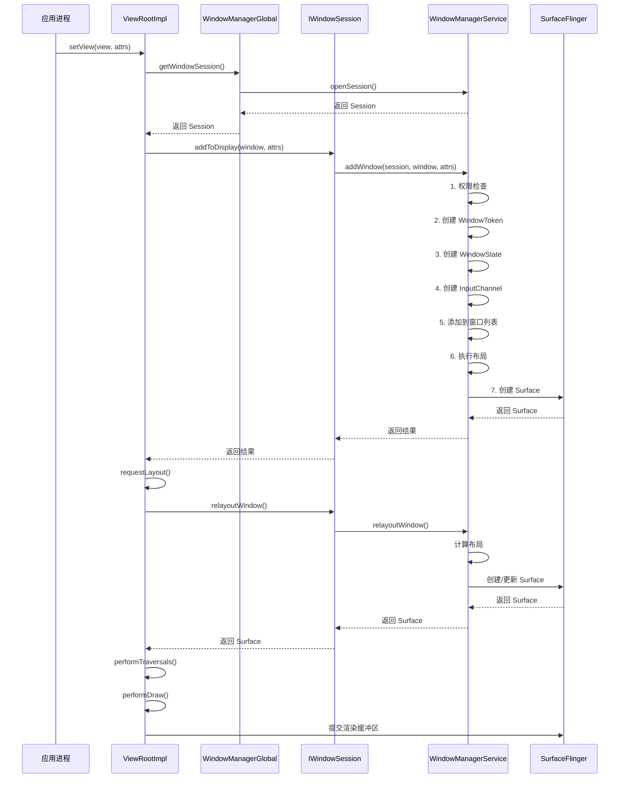
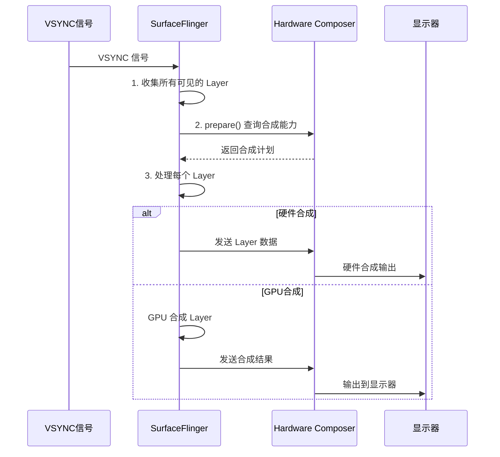
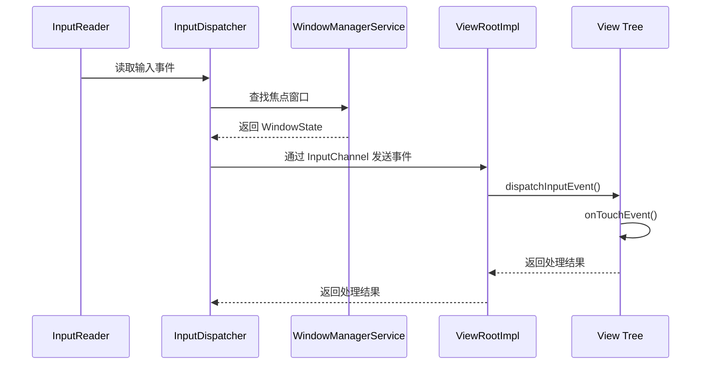
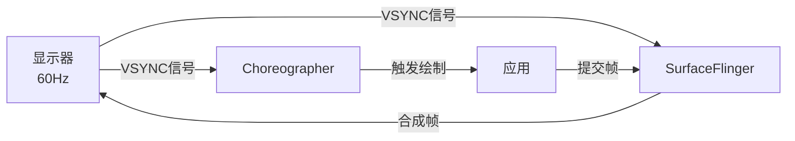

# Window 系统面试题篇：常见问题与深度解析

## 📋 概述

本文档整理了 Android 窗口系统相关的常见面试题，按照难度分为基础、进阶、高级三个层次，并提供详细的答案和扩展知识点。这些问题涵盖了窗口系统的架构、实现、性能优化等各个方面，是 Android 系统开发面试的重点内容。

---

## 一、基础面试题

### 1.1 Window、WindowManager、WindowManagerService 的区别是什么？

**答案**：

| 组件 | 位置 | 作用 | 关系 |
| :--- | :--- | :--- | :--- |
| **Window** | 应用进程 | 窗口的抽象概念，逻辑容器 | 每个 Activity 有一个 PhoneWindow |
| **WindowManager** | 应用进程 | 应用访问窗口系统的接口 | WindowManagerImpl 是具体实现 |
| **WindowManagerService** | SystemServer 进程 | 窗口管理的核心系统服务 | 管理所有窗口的状态和布局 |

**详细说明**：

1. **Window**：
   - 是一个抽象类，`PhoneWindow` 是其具体实现
   - 每个 Activity 都有一个 Window
   - Window 包含 DecorView，DecorView 包含应用的 View 树

2. **WindowManager**：
   - 是一个接口，提供窗口操作的 API（addView、updateViewLayout、removeView）
   - `WindowManagerImpl` 是具体实现
   - 通过 Binder IPC 与 WindowManagerService 通信

3. **WindowManagerService**：
   - 运行在 SystemServer 进程中
   - 管理所有窗口的状态（WindowState）
   - 计算窗口的布局和 Z-order
   - 与 SurfaceFlinger 协调窗口的显示

**扩展**：
- WindowManager 是客户端，WindowManagerService 是服务端
- 应用通过 WindowManager 操作窗口，WindowManager 通过 Binder 调用 WindowManagerService

---

### 1.2 Surface 和 SurfaceView 的区别是什么？

**答案**：

| 组件 | 类型 | 作用 | 使用场景 |
| :--- | :--- | :--- | :--- |
| **Surface** | 类 | 窗口的绘制画布，背后是 BufferQueue | 所有窗口都有 Surface |
| **SurfaceView** | View | 特殊的 View，有独立的 Surface | 视频播放、相机预览、游戏 |

**详细说明**：

1. **Surface**：
   - 是 Native 层的概念，Java 层有对应的封装
   - 每个 Window 对应一个 Surface
   - Surface 背后是 BufferQueue，应用绘制到 Surface，SurfaceFlinger 合成 Surface

2. **SurfaceView**：
   - 是一个 View 子类
   - 有自己独立的 Surface（不在窗口的 View 树中）
   - Surface 在独立的线程中更新，不阻塞主线程
   - 可以设置 Z-order，显示在其他 View 之上或之下

**代码示例**：

```java
// Surface 的使用（普通窗口）
Surface surface = window.getSurface();
Canvas canvas = surface.lockCanvas(null);
// 绘制内容
canvas.drawColor(Color.WHITE);
surface.unlockCanvasAndPost(canvas);

// SurfaceView 的使用
SurfaceView surfaceView = new SurfaceView(context);
surfaceView.getHolder().addCallback(new SurfaceHolder.Callback() {
    @Override
    public void surfaceCreated(SurfaceHolder holder) {
        Surface surface = holder.getSurface();
        // 在独立线程中绘制
        new Thread(() -> {
            Canvas canvas = surface.lockCanvas(null);
            // 绘制内容
            canvas.drawColor(Color.BLUE);
            surface.unlockCanvasAndPost(canvas);
        }).start();
    }
});
```

**扩展**：
- TextureView 也有独立的 Surface，但属于窗口的 View 树
- SurfaceView 的 Surface 在独立的 Layer 中，可以设置 Z-order

---

### 1.3 Window 的类型有哪些？

**答案**：

Window 分为三大类：

1. **Application Window（应用窗口）**：
   - `TYPE_BASE_APPLICATION`：Activity 的主窗口
   - `TYPE_APPLICATION`：应用窗口的基础类型
   - `TYPE_APPLICATION_STARTING`：应用启动窗口

2. **Sub Window（子窗口）**：
   - `TYPE_APPLICATION_PANEL`：应用面板
   - `TYPE_APPLICATION_SUB_PANEL`：子面板
   - `TYPE_APPLICATION_MEDIA_OVERLAY`：媒体覆盖层

3. **System Window（系统窗口）**：
   - `TYPE_STATUS_BAR`：状态栏
   - `TYPE_NAVIGATION_BAR`：导航栏
   - `TYPE_SYSTEM_ALERT`：系统提示窗口
   - `TYPE_INPUT_METHOD`：输入法窗口
   - `TYPE_WALLPAPER`：壁纸窗口
   - `TYPE_APPLICATION_OVERLAY`：应用悬浮窗

**层级关系**：

```
TYPE_STATUS_BAR (最高)
    ↓
TYPE_NAVIGATION_BAR
    ↓
TYPE_SYSTEM_ALERT
    ↓
TYPE_INPUT_METHOD
    ↓
TYPE_APPLICATION
    ↓
TYPE_WALLPAPER (最低)
```

**扩展**：
- 窗口类型决定了窗口的基础层级（Z-order）
- 系统窗口需要系统权限才能创建
- 子窗口必须依附于父窗口

---

### 1.4 ViewRootImpl 的作用是什么？

**答案**：

**ViewRootImpl 是连接应用层和 Framework 层的桥梁**，是窗口系统中最重要的类之一。

**核心职责**：

1. **管理 View 树的生命周期**：
   - 负责 View 树的添加、更新、删除
   - 管理 View 树的测量、布局、绘制

2. **驱动 View 的测量、布局、绘制**：
   ```java
   private void performTraversals() {
       // 测量
       performMeasure(...);
       // 布局
       performLayout(...);
       // 绘制
       performDraw();
   }
   ```

3. **管理 Surface 和绘制**：
   - 获取窗口的 Surface
   - 将 View 树绘制到 Surface 上
   - 提交渲染缓冲区

4. **处理输入事件**：
   - 接收 WindowManagerService 发送的输入事件
   - 将输入事件分发给 View 树

5. **与 WindowManagerService 通信**：
   - 通过 IWindowSession 与 WMS 通信
   - 处理窗口的创建、更新、删除

**关键成员变量**：

- `mWindowSession`：与 WindowManagerService 通信的 Binder 接口
- `mWindow`：窗口的 Binder 接口，用于接收 WMS 的回调
- `mSurface`：窗口对应的 Surface
- `mView`：根 View（通常是 DecorView）

**扩展**：
- 每个窗口有一个 ViewRootImpl
- ViewRootImpl 是 View 树的根节点（虽然不在 View 树中）
- ViewRootImpl 驱动整个 View 树的渲染流程

---

## 二、进阶面试题

### 2.1 请详细说明窗口创建的完整流程

**答案**：

窗口创建的完整流程如下：



**详细步骤**：

1. **应用调用 setView()**：
   ```java
   ViewRootImpl.setView(view, attrs);
   ```

2. **获取 WindowSession**：
   ```java
   mWindowSession = WindowManagerGlobal.getWindowSession();
   ```

3. **调用 addToDisplay()**：
   ```java
   mWindowSession.addToDisplay(mWindow, ..., mWindowAttributes);
   ```

4. **WindowManagerService 处理**：
   - 权限检查
   - 创建或获取 WindowToken
   - 创建 WindowState
   - 创建 InputChannel
   - 添加到窗口列表
   - 执行布局

5. **创建 Surface**：
   - 通过 SurfaceSession 创建 Surface
   - 分配缓冲区

6. **relayoutWindow()**：
   - 计算窗口的位置和大小
   - 创建或更新 Surface

7. **开始绘制**：
   - performTraversals() 驱动测量、布局、绘制
   - 将内容绘制到 Surface
   - 提交渲染缓冲区

**扩展**：
- 窗口创建是异步的，Surface 可能在 relayoutWindow() 时才创建
- InputChannel 用于接收输入事件
- WindowToken 用于窗口的分组和权限控制

---

### 2.2 WindowManagerService 如何管理窗口的 Z-order？

**答案**：

**WindowManagerService 通过 WindowLayersController 管理窗口的 Z-order**。

**计算流程**：

1. **基础层级分配**：
   ```java
   int baseLayer = mPolicy.windowTypeToLayerLw(window.mAttrs.type);
   window.mBaseLayer = baseLayer;
   ```
   - 根据窗口类型确定基础层级
   - 由 PhoneWindowManager.windowTypeToLayerLw() 决定

2. **子层级分配**：
   ```java
   // 同一类型的窗口按添加顺序分配子层级
   int subLayer = getSubLayerForType(type);
   window.mSubLayer = subLayer;
   ```

3. **特殊窗口处理**：
   - IME 窗口：显示在焦点窗口之上
   - 壁纸窗口：显示在应用窗口之下
   - 动画窗口：临时提升层级

4. **最终层级计算**：
   ```java
   if (window.isAnimating()) {
       window.mLayer = ANIMATION_LAYER_BASE + window.mAnimLayer;
   } else {
       window.mLayer = window.mBaseLayer + window.mSubLayer;
   }
   ```

5. **应用到 Surface**：
   ```java
   SurfaceControl.Transaction t = new SurfaceControl.Transaction();
   t.setLayer(window.mSurfaceControl, window.mLayer);
   t.apply();
   ```

**层级规则**：

| 窗口类型 | 基础层级 | 说明 |
| :--- | :--- | :--- |
| TYPE_STATUS_BAR | 210000 | 最高层级 |
| TYPE_NAVIGATION_BAR | 201000 | 导航栏 |
| TYPE_INPUT_METHOD | 201000 | 输入法（动态调整） |
| TYPE_APPLICATION | 2 | 应用窗口 |
| TYPE_WALLPAPER | -200000 | 最低层级 |

**扩展**：
- Z-order 是动态计算的，窗口状态变化时会重新计算
- 动画中的窗口会临时提升层级
- 子窗口的层级受父窗口影响

---

### 2.3 SurfaceFlinger 的合成流程是什么？

**答案**：

**SurfaceFlinger 在 VSYNC 信号到来时合成所有可见的窗口**。

**合成流程**：



**详细步骤**：

1. **VSYNC 信号到来**：
   ```cpp
   void SurfaceFlinger::onMessageReceived(int32_t what) {
       if (what == MessageQueue::INVALIDATE) {
           onMessageInvalidate();
       }
   }
   ```

2. **收集可见 Layer**：
   ```cpp
   Vector<Layer*> visibleLayers;
   collectVisibleLayers(visibleLayers);
   ```

3. **查询 HWC 能力**：
   ```cpp
   hwc_display_contents_1_t* hwcList = mHwc->prepare(visibleLayers);
   ```

4. **处理每个 Layer**：
   ```cpp
   for (size_t i = 0; i < visibleLayers.size(); i++) {
       Layer* layer = visibleLayers[i];
       if (hwcList->hwLayers[i].compositionType == HWC_OVERLAY) {
           // 硬件合成，HWC 处理
       } else {
           // GPU 合成，SurfaceFlinger 处理
           composeLayer(layer);
       }
   }
   ```

5. **提交给 HWC**：
   ```cpp
   mHwc->set(hwcList);
   ```

**合成类型**：

- **HWC_OVERLAY**：硬件 Overlay 合成，功耗低，性能高
- **HWC_CLIENT**：客户端（GPU）合成，灵活性高，功耗较高

**扩展**：
- SurfaceFlinger 只在 VSYNC 时合成，避免画面撕裂
- HWC 根据硬件能力决定合成方式
- 优先使用硬件合成以节省功耗

---

### 2.4 窗口与输入系统的交互机制是什么？

**答案**：

**窗口通过 InputChannel 接收输入事件**。

**交互流程**：



**详细机制**：

1. **InputChannel 的创建**：
   ```java
   // WindowManagerService.addWindow()
   InputChannel[] inputChannels = InputChannel.openInputChannelPair(name);
   win.mInputChannel = inputChannels[0];  // 服务端
   InputChannel clientChannel = inputChannels[1];  // 客户端
   
   // 注册到 InputManagerService
   mInputManager.registerInputChannel(win.mInputChannel, win.mInputWindowHandle);
   ```

2. **焦点窗口的选择**：
   ```java
   // WindowManagerService.findFocusedWindow()
   WindowState focused = getFocusedWindow();
   if (focused != null && focused.canReceiveInput()) {
       return focused;
   }
   ```

3. **输入事件分发**：
   ```java
   // ViewRootImpl.dispatchInputEvent()
   public void dispatchInputEvent(InputEvent event) {
       // 分发给 View 树
       mView.dispatchPointerEvent(event);
   }
   ```

**关键点**：

- 每个窗口有独立的 InputChannel
- InputDispatcher 通过 InputChannel 发送事件
- 焦点窗口优先接收输入事件
- 输入事件通过 View 树分发

**扩展**：
- InputChannel 是 Unix Domain Socket
- 输入事件是异步的，不阻塞主线程
- 可以设置输入事件过滤器

---

## 三、高级面试题

### 3.1 VSYNC 机制的作用是什么？如何工作的？

**答案**：

**VSYNC（Vertical Synchronization）是垂直同步信号**，用于同步显示刷新和图形渲染。

**作用**：

1. **避免画面撕裂**：只在垂直消隐期更新画面
2. **同步渲染**：应用和 SurfaceFlinger 同步工作
3. **减少延迟**：预测性的 VSYNC 减少延迟

**工作机制**：



**详细流程**：

1. **显示器发出 VSYNC 信号**（通常 60Hz，每 16.67ms 一次）

2. **SurfaceFlinger 接收 VSYNC**：
   ```cpp
   void SurfaceFlinger::onMessageInvalidate() {
       // VSYNC 信号到来，开始合成
       composeSurfaces();
   }
   ```

3. **Choreographer 接收 VSYNC**：
   ```java
   // Choreographer.doFrame()
   void doFrame(long frameTimeNanos, int frame) {
       // 触发应用的渲染
       doCallbacks(Choreographer.CALLBACK_TRAVERSAL, frameTimeNanos);
   }
   ```

4. **应用在 VSYNC 时绘制**：
   ```java
   // ViewRootImpl.scheduleTraversals()
   mChoreographer.postCallback(
       Choreographer.CALLBACK_TRAVERSAL, mTraversalRunnable, null);
   ```

**VSYNC 的优化**：

- **预测性 VSYNC**：提前通知应用，减少延迟
- **VSYNC 偏移**：应用和 SurfaceFlinger 使用不同的 VSYNC 偏移
- **自适应 VSYNC**：根据帧率动态调整 VSYNC

**扩展**：
- VSYNC 是硬件信号，由显示控制器发出
- 应用可以通过 Choreographer 监听 VSYNC
- 掉帧通常是因为错过了 VSYNC

---

### 3.2 Hardware Composer 的作用和优势是什么？

**答案**：

**Hardware Composer (HWC) 是硬件抽象层**，决定如何最优地合成窗口。

**作用**：

1. **合成策略决策**：决定使用硬件合成还是 GPU 合成
2. **硬件加速**：利用显示控制器的硬件能力
3. **功耗优化**：硬件合成比 GPU 合成功耗更低

**优势**：

| 方面 | 硬件合成 | GPU 合成 |
| :--- | :--- | :--- |
| **功耗** | 低 | 高 |
| **性能** | 高 | 中 |
| **灵活性** | 有限 | 高 |
| **延迟** | 低 | 中 |

**工作流程**：

1. **SurfaceFlinger 查询 HWC**：
   ```cpp
   hwc_display_contents_1_t* hwcList = mHwc->prepare(layers);
   ```

2. **HWC 决策合成方式**：
   - 根据 Layer 数量、大小、变换等决定
   - 优先使用硬件 Overlay
   - 当硬件能力不足时，回退到 GPU 合成

3. **执行合成**：
   - 硬件合成：HWC 直接处理
   - GPU 合成：SurfaceFlinger 使用 GPU 合成后交给 HWC

**HWC 的决策因素**：

- **Overlay 数量**：硬件 Overlay 数量有限（通常 4-8 个）
- **Layer 大小**：某些大小可能不支持 Overlay
- **变换**：旋转、缩放可能不支持 Overlay
- **透明度**：某些透明度可能不支持 Overlay

**扩展**：
- HWC 是 HAL 层，由硬件厂商实现
- 不同设备的 HWC 能力不同
- HWC 2.0 提供了更灵活的接口

---

### 3.3 窗口动画的实现原理是什么？

**答案**：

**窗口动画由 WindowStateAnimator 处理**，通过修改窗口的 Surface 属性实现。

**实现原理**：

1. **动画对象**：
   ```java
   // WindowStateAnimator.java
   Animation mAnimation;  // 窗口动画对象
   ```

2. **动画执行**：
   ```java
   boolean stepAnimationLocked(long currentTime) {
       if (mAnimation == null) {
           return false;
       }
       
       // 计算动画进度
       Transformation trans = mAnimation.getTransformation(currentTime, mTransformation);
       
       // 应用变换到 Surface
       SurfaceControl.Transaction t = new SurfaceControl.Transaction();
       t.setAlpha(mWin.mSurfaceControl, trans.getAlpha());
       t.setMatrix(mWin.mSurfaceControl, trans.getMatrix());
       t.setPosition(mWin.mSurfaceControl, trans.getTranslationX(), trans.getTranslationY());
       t.apply();
       
       return !mAnimation.hasEnded();
   }
   ```

3. **层级调整**：
   ```java
   // 动画中的窗口临时提升层级
   if (mAnimation.getZAdjustment() == Animation.ZORDER_TOP) {
       mWin.mLayer = ANIMATION_LAYER_BASE + mWin.mAnimLayer;
   }
   ```

**动画类型**：

- **进入动画**：窗口显示时的动画（如 Activity 进入）
- **退出动画**：窗口隐藏时的动画（如 Activity 退出）
- **过渡动画**：Activity 切换时的动画

**性能优化**：

- **批量更新**：使用 Transaction 批量更新属性
- **硬件加速**：利用 Surface 的硬件加速
- **减少重绘**：只更新动画属性，不重绘内容

**扩展**：
- 窗口动画不影响窗口内容的绘制
- 动画通过修改 Surface 的变换矩阵实现
- 动画结束后恢复窗口的原始层级

---

### 3.4 多显示器支持的实现原理是什么？

**答案**：

**多显示器通过 DisplayContent 管理**，每个显示器有独立的窗口列表和布局。

**实现原理**：

1. **DisplayContent 管理**：
   ```java
   // DisplayContent.java
   public class DisplayContent {
       final int mDisplayId;  // 显示器 ID
       final WindowList<WindowState> mWindows;  // 该显示器上的窗口
   }
   ```

2. **窗口指定显示器**：
   ```java
   // WindowManager.LayoutParams
   public int displayId = Display.INVALID_DISPLAY;
   ```

3. **独立的窗口管理**：
   - 每个显示器有独立的窗口列表
   - 每个显示器有独立的 Z-order
   - 每个显示器有独立的布局

**关键点**：

- **DisplayContent**：管理某个显示器上的所有窗口
- **窗口迁移**：窗口可以在不同显示器间迁移
- **跨显示器窗口**：某些系统窗口可以跨显示器显示

**扩展**：
- Android 支持多个物理显示器
- 每个显示器可以有不同的分辨率、DPI
- 窗口可以指定显示在哪个显示器上

---

## 四、实战问题

### 4.1 如何实现悬浮窗？

**答案**：

**悬浮窗是系统窗口，需要系统权限**。

**实现步骤**：

1. **申请权限**：
   ```xml
   <!-- AndroidManifest.xml -->
   <uses-permission android:name="android.permission.SYSTEM_ALERT_WINDOW"/>
   ```

2. **检查权限**：
   ```java
   if (Build.VERSION.SDK_INT >= Build.VERSION_CODES.M) {
       if (!Settings.canDrawOverlays(context)) {
           // 跳转到设置页面
           Intent intent = new Intent(Settings.ACTION_MANAGE_OVERLAY_PERMISSION);
           context.startActivity(intent);
           return;
       }
   }
   ```

3. **创建悬浮窗**：
   ```java
   WindowManager wm = (WindowManager) context.getSystemService(Context.WINDOW_SERVICE);
   
   WindowManager.LayoutParams params = new WindowManager.LayoutParams(
       WindowManager.LayoutParams.WRAP_CONTENT,
       WindowManager.LayoutParams.WRAP_CONTENT,
       WindowManager.LayoutParams.TYPE_APPLICATION_OVERLAY,  // 悬浮窗类型
       WindowManager.LayoutParams.FLAG_NOT_FOCUSABLE,  // 不获取焦点
       PixelFormat.TRANSLUCENT);
   
   params.gravity = Gravity.TOP | Gravity.START;
   params.x = 100;
   params.y = 100;
   
   View floatView = LayoutInflater.from(context).inflate(R.layout.float_view, null);
   wm.addView(floatView, params);
   ```

4. **更新位置**：
   ```java
   params.x = newX;
   params.y = newY;
   wm.updateViewLayout(floatView, params);
   ```

5. **移除悬浮窗**：
   ```java
   wm.removeView(floatView);
   ```

**注意事项**：

- 需要系统权限
- 悬浮窗类型是 `TYPE_APPLICATION_OVERLAY`
- 可以设置不获取焦点（`FLAG_NOT_FOCUSABLE`）
- 需要处理触摸事件实现拖拽

---

### 4.2 如何分析窗口性能问题？

**答案**：

**使用 systrace 和 dumpsys 工具分析**。

**分析步骤**：

1. **使用 systrace**：
   ```bash
   python systrace.py -t 10 -o trace.html gfx input view wm
   ```

2. **关键指标**：
   - **Frame 时间**：每帧的渲染时间（应该 < 16.67ms for 60fps）
   - **VSYNC**：VSYNC 信号
   - **SurfaceFlinger**：合成时间
   - **Choreographer**：应用渲染时间

3. **使用 dumpsys**：
   ```bash
   # 查看窗口信息
   adb shell dumpsys window
   
   # 查看 SurfaceFlinger 信息
   adb shell dumpsys SurfaceFlinger
   
   # 查看性能统计
   adb shell dumpsys SurfaceFlinger --latency
   ```

4. **常见问题**：
   - **掉帧**：Frame 时间 > 16.67ms
   - **合成慢**：SurfaceFlinger 合成时间过长
   - **窗口过多**：窗口数量过多导致性能下降
   - **Client 合成过多**：应该使用硬件 Overlay

**优化建议**：

- 减少窗口数量
- 优化窗口层级
- 使用硬件 Overlay
- 减少窗口动画
- 优化 View 树复杂度

---

### 4.3 如何实现自定义窗口？

**答案**：

**通过 WindowManager 添加自定义 View 实现**。

**实现步骤**：

1. **创建自定义 View**：
   ```java
   public class CustomWindowView extends FrameLayout {
       public CustomWindowView(Context context) {
           super(context);
           init();
       }
       
       private void init() {
           // 初始化 UI
           inflate(getContext(), R.layout.custom_window, this);
       }
   }
   ```

2. **设置窗口参数**：
   ```java
   WindowManager.LayoutParams params = new WindowManager.LayoutParams(
       WindowManager.LayoutParams.MATCH_PARENT,
       WindowManager.LayoutParams.WRAP_CONTENT,
       WindowManager.LayoutParams.TYPE_APPLICATION,  // 窗口类型
       WindowManager.LayoutParams.FLAG_DIM_BEHIND,   // 背景变暗
       PixelFormat.TRANSLUCENT);
   
   params.gravity = Gravity.BOTTOM;
   params.dimAmount = 0.5f;  // 背景变暗程度
   ```

3. **添加窗口**：
   ```java
   WindowManager wm = (WindowManager) context.getSystemService(Context.WINDOW_SERVICE);
   CustomWindowView customView = new CustomWindowView(context);
   wm.addView(customView, params);
   ```

4. **更新窗口**：
   ```java
   params.width = newWidth;
   params.height = newHeight;
   wm.updateViewLayout(customView, params);
   ```

5. **移除窗口**：
   ```java
   wm.removeView(customView);
   ```

**注意事项**：

- 窗口类型决定窗口的层级和权限
- 可以设置窗口的标志（FLAG）控制行为
- 需要正确处理窗口的生命周期
- 避免窗口泄漏

---

## 五、总结

### 5.1 核心知识点

1. **窗口架构**：应用层 → Framework 层 → Native 层 → HAL 层
2. **核心组件**：Window、WindowManager、WindowManagerService、SurfaceFlinger
3. **交互机制**：Binder IPC、Surface、BufferQueue
4. **性能优化**：VSYNC、三重缓冲、硬件合成

### 5.2 面试重点

- **基础**：Window、WindowManager、WindowManagerService 的区别
- **进阶**：窗口创建流程、Z-order 管理、SurfaceFlinger 合成
- **高级**：VSYNC 机制、HWC 作用、窗口动画实现

### 5.3 实战能力

- 实现悬浮窗
- 分析性能问题
- 实现自定义窗口

---

**提示**：窗口系统是 Android 系统的核心，理解窗口系统有助于深入理解 Android 的图形渲染、输入事件分发、ANR 机制等。建议结合实际项目经验，不断加深理解。
