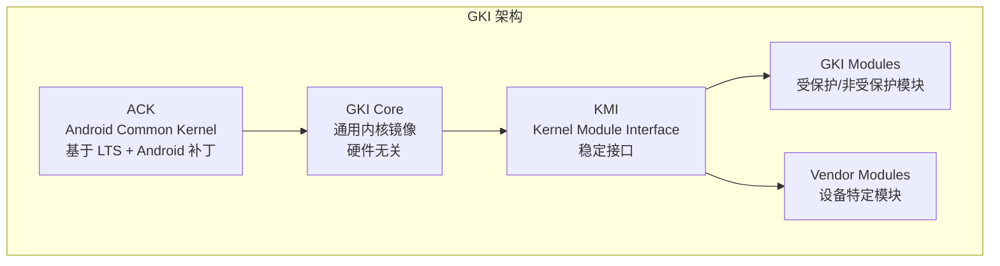
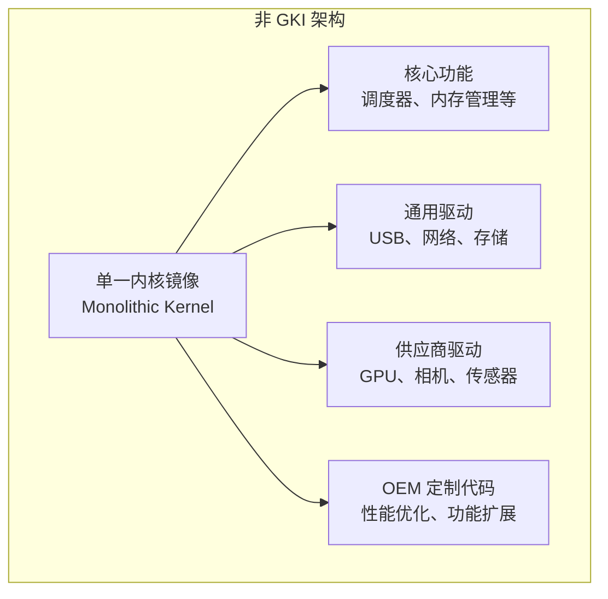
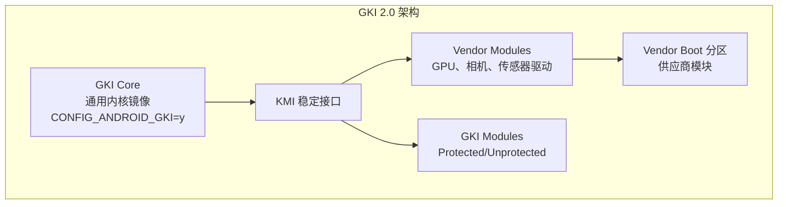

# GKI 2.0 vs 非 GKI：核心架构对比指南

## 目录

1. [引言：为什么需要 GKI](#引言为什么需要-gki)
2. [核心概念](#核心概念)
3. [架构对比](#架构对比)
4. [GKI 2.0 关键机制](#gki-20-关键机制)
5. [KMI 稳定性与版本管理](#kmi-稳定性与版本管理)
6. [如何判断设备是否为 GKI](#如何判断设备是否为-gki)
7. [总结与对比](#总结与对比)

---

## 引言：为什么需要 GKI

### Android 内核的碎片化问题

在 GKI（Generic Kernel Image，通用内核镜像）出现之前，Android 设备面临严重的碎片化问题：

- **每个设备独立内核**：OEM 厂商为每个设备维护独立的内核树，包含 SoC、板级和供应商特定代码
- **更新困难**：内核与驱动紧密耦合，安全补丁需要为每个设备单独适配和测试
- **维护成本高**：OEM 需要维护完整的内核树，代码重复，难以统一管理

### GKI 的解决方案

GKI 通过以下方式解决这些问题：

1. **统一内核基础**：所有设备使用相同的通用内核（GKI Core）
2. **模块化驱动**：设备特定代码作为可加载内核模块（Vendor Modules）
3. **稳定接口**：通过 KMI（Kernel Module Interface）提供稳定的内核模块接口
4. **快速更新**：内核可以独立更新，无需重新编译驱动

### GKI 演进历程

```
Android 11: GKI 1.0 引入（可选）
    ↓
Android 12: GKI 1.0 强制要求（内核 5.10+）
    ↓
Android 13+: GKI 2.0 引入
    ↓
Android 14+: GKI 2.0 成为标准
```

---

## 核心概念

### GKI 架构分层



### 关键术语

- **ACK (Android Common Kernel)**：基于 Linux LTS 内核，加上 Android 特定补丁
- **GKI Core**：从 ACK 构建的通用内核，不包含 SoC/板级/供应商特定代码
- **KMI (Kernel Module Interface)**：GKI 内核向模块提供的稳定接口，保证版本兼容性
- **Vendor Modules**：设备/SoC/板级特定的可加载内核模块
- **GKI Modules**：与 GKI Core 一起交付的模块，分为受保护（Protected）和非受保护（Unprotected）两类

### KMI 的作用

KMI 是 GKI 架构的核心，它提供：

1. **稳定的函数接口**：模块只能使用 KMI 导出的符号
2. **稳定的数据结构布局**：KMI 版本内数据结构布局保持不变
3. **版本兼容性保证**：相同 KMI 版本下，模块可以在不同内核子版本上工作

---

## 架构对比

### 非 GKI 架构（传统单体内核）



**特点**：
- ❌ 所有代码编译在一个内核镜像中
- ❌ 内核与驱动紧密耦合
- ❌ 每个设备有独立的内核配置和代码
- ❌ 更新需要整体重新编译
- ❌ 无稳定接口保证

### GKI 2.0 架构（模块化分离）



**特点**：
- ✅ 内核与驱动完全分离
- ✅ 所有设备使用相同的 GKI Core
- ✅ 设备特定代码作为可加载模块
- ✅ 内核可独立更新，无需重新编译驱动
- ✅ KMI 提供稳定接口保证

### 分区布局对比

**非 GKI 设备**：
```
boot 分区
└── zImage/Image.gz  # 完整内核（包含所有驱动）
```

**GKI 设备**：
```
boot 分区
└── Image.lz4        # GKI Core（仅通用内核）

vendor_boot 分区
└── modules/         # 供应商模块
    ├── gpu.ko
    ├── camera.ko
    └── sensor.ko
```

---

## GKI 2.0 关键机制

### Vendor Hooks（供应商钩子）

GKI 2.0 的核心创新：**禁止在内核核心中直接修改代码**，所有供应商定制必须通过钩子机制实现。

#### 钩子类型

1. **Normal Hooks（普通钩子）**：可分离的钩子
   ```c
   // 内核核心中声明
   DECLARE_HOOK(android_vh_xxx, void (*callback)(args));
   
   // 供应商模块中注册
   register_trace_android_vh_xxx(my_callback);
   ```

2. **Restricted Hooks（受限钩子）**：持久化/上下文敏感的钩子
   ```c
   // 内核核心中声明
   DECLARE_RESTRICTED_HOOK(android_vh_xxx, void (*callback)(args));
   ```

#### 钩子的优势

- ✅ 允许供应商在不修改内核核心的情况下扩展功能
- ✅ 保持内核核心的通用性和可维护性
- ✅ 通过 Google 审核的钩子机制，确保接口稳定性

### Vendor Data Fields（供应商数据字段）

允许供应商在内核核心数据结构中存储私有数据，而不破坏 ABI。

```c
// 内核核心数据结构
struct task_struct {
    // ... 核心字段 ...
    ANDROID_VENDOR_DATA(1);  // 供应商可用的填充字段
    ANDROID_VENDOR_DATA(2);
};
```

**优势**：
- ✅ 供应商可以在核心数据结构中存储私有数据
- ✅ 不影响核心 ABI 的稳定性
- ✅ 避免供应商直接修改核心数据结构

### Protected vs Unprotected GKI Modules

GKI 2.0 区分两类模块：

| 特性 | Protected Modules | Unprotected Modules |
|------|------------------|---------------------|
| **提供者** | Google 或 Google 信任的实体 | 供应商 |
| **可覆盖性** | ❌ 不可被供应商模块覆盖 | ✅ 可被供应商模块覆盖 |
| **符号导出** | ✅ 可导出受保护符号（可能成为 KMI 的一部分） | ❌ 只能使用导出的符号，不能导出受保护符号 |
| **用途** | 核心功能模块（如 DRM、网络栈等） | 可选的、可替换的功能模块 |

---

## KMI 稳定性与版本管理

### KMI 版本格式

完整的内核发布版本格式：
```
{Version.PatchLevel}.{SubLevel}-{AndroidRelease}-{KmiGeneration}-{suffix}
```

**KMI 版本**（用于模块兼容性判断）：
```
{Version.PatchLevel}-{AndroidRelease}-{KmiGeneration}
例如：5.10-android12-0, 6.1-android14-1
```

**组成部分**：
- **Version.PatchLevel**：基础内核版本（如 `5.10`、`6.1`）
- **SubLevel**：同一 KMI 版本内的增量更新号（如 `.101`、`.223`），用于安全补丁和bug修复
- **AndroidRelease**：Android 版本（如 `android12`、`android14`）
- **KmiGeneration**：KMI 接口的生成号，接口不兼容变更时递增

**示例**：`5.10.101-android12-0-abcdef12345`
- KMI 版本：`5.10-android12-0`
- SubLevel：`101`（同一 KMI 版本内的更新）
- 后缀：构建元数据（忽略）

### 版本兼容性规则

1. **相同 KMI 版本**：完全兼容，模块无需重新编译
   - 例如：`5.10.101-android12-0` 和 `5.10.223-android12-0` 的模块可以互换
2. **相同 KMI Generation，更高 SubLevel**：向后兼容，模块无需修改
   - 可以从较低 SubLevel 更新到较高 SubLevel，但不能降级
3. **不同 KMI Generation**：不兼容，需要重新编译模块

### KMI 稳定性保证

- **函数接口**：KMI 版本内，导出的函数签名保持不变
- **数据结构布局**：KMI 版本内，数据结构的内存布局保持不变
- **符号导出**：只有 KMI 白名单中的符号才会导出给模块使用

### 符号隐藏机制

GKI 使用符号隐藏机制，确保模块只能使用 KMI 接口：

```c
// 只有标记为 KMI 的符号才会导出
EXPORT_SYMBOL_GPL(kmalloc);  // 在 KMI 白名单中

// 内部符号不导出
static void internal_function(void) {
    // 模块无法使用此函数
}
```

配置项示例：
- `CONFIG_ANDROID_GKI_HIDDEN_SYMBOLS=y`
- `CONFIG_ANDROID_GKI_HIDDEN_GPU_SYMBOLS=y`
- `CONFIG_ANDROID_GKI_HIDDEN_DRM_SYMBOLS=y`

---

## 如何判断设备是否为 GKI

### 最可靠的方法：检查内核配置

```bash
# 通过 ADB 连接设备
adb shell

# 检查 CONFIG_ANDROID_GKI
zcat /proc/config.gz | grep CONFIG_ANDROID_GKI
```

**判断标准**：
- ✅ **GKI 设备**：输出 `CONFIG_ANDROID_GKI=y`
- ❌ **非 GKI 设备**：无输出或 `CONFIG_ANDROID_GKI is not set`

### 辅助判断方法

#### 1. 检查内核版本格式

```bash
uname -r
```

**GKI 设备典型格式**：
- `5.15.123-android14-5.15-xxx-g12345678`
- `5.15.180-android13-8-g5490053e196d-ab29631`

**非 GKI 设备典型格式**：
- `5.4.210-vendor-xxx`
- `5.10.123-samsung-xxx`

**注意**：版本格式可能误导，必须结合 `CONFIG_ANDROID_GKI` 确认。

#### 2. 检查供应商模块

```bash
# 查看已加载模块
lsmod | grep -E "gpu|camera|sensor"

# 检查 vendor_boot 分区
ls /vendor_boot/modules/*.ko 2>/dev/null
```

**GKI 设备**：存在大量供应商模块（GPU、相机、传感器等）

#### 3. 检查 GKI 相关配置

```bash
zcat /proc/config.gz | grep -i gki
```

**GKI 设备**：会显示多个 `CONFIG_ANDROID_GKI_*` 配置项

### 特殊情况：部分 GKI（非标准 GKI）

**现象**：
- ❌ `CONFIG_ANDROID_GKI` 不存在
- ✅ 符号表中存在 GKI 相关符号
- ✅ 存在 `CONFIG_GKI_HIDDEN_*` 配置项

**判断**：这不是标准的 GKI 设备，而是基于 GKI 代码但未完全启用 GKI 配置的构建。

**影响**：
- ⚠️ 无法享受完整 GKI 优势（统一更新、KMI 保证等）
- ❌ 不符合 Google 认证要求

### 快速检查清单

| 检查项 | GKI 设备 | 非 GKI 设备 |
|--------|---------|------------|
| `CONFIG_ANDROID_GKI=y` | ✅ | ❌ |
| 内核版本包含 `androidXX` | ✅ | ❌ |
| 存在 `vendor_boot` 分区和模块 | ✅ | ⚠️ 可能没有 |
| 大量供应商模块（GPU、相机等） | ✅ | ❌ |
| `CONFIG_ANDROID_GKI_HIDDEN_*` 配置 | ✅ | ❌ |

**判断原则**：`CONFIG_ANDROID_GKI=y` 是最可靠的判断依据，其他方法仅作为辅助。

---

## 总结与对比

### 核心差异总结

| 维度 | GKI 2.0 | 非 GKI |
|------|---------|--------|
| **架构模式** | 模块化：内核与驱动分离 | 单体：所有代码编译在一起 |
| **内核统一性** | ✅ 所有设备使用相同的 GKI Core | ❌ 每个设备有独立内核 |
| **接口稳定性** | ✅ KMI 提供稳定接口保证 | ❌ 无稳定接口保证 |
| **更新机制** | ✅ 内核可独立更新 | ❌ 必须整体重新编译 |
| **安全补丁** | ✅ 快速推送到所有设备 | ❌ 需要为每个设备单独适配 |
| **维护成本** | ✅ 低（只需维护模块） | ❌ 高（需维护完整内核树） |
| **定制方式** | ✅ Vendor Hooks + Vendor Data | ❌ 直接修改内核源码 |
| **模块类型** | ✅ Protected/Unprotected 区分 | ❌ 无此概念 |
| **Google 认证** | ✅ 符合要求 | ❌ 不符合（Android 12+） |

### GKI 2.0 的优势

1. **统一性**：所有设备使用相同的通用内核，减少碎片化
2. **可维护性**：内核与驱动分离，可以独立更新和维护
3. **安全性**：快速推送安全补丁，及时修复漏洞
4. **开发效率**：可以使用预构建的 GKI，专注于设备特定功能
5. **标准化**：通过 Vendor Hooks 和 Vendor Data 提供标准化的定制方式

### 非 GKI 的问题

1. **碎片化严重**：每个设备独立内核，难以统一管理
2. **更新困难**：必须整体重新编译，更新周期长
3. **安全风险**：安全补丁延迟，漏洞修复困难
4. **维护成本高**：需要维护完整的内核树
5. **不符合要求**：Android 12+（内核 5.10+）必须使用 GKI

### 技术发展趋势

- **GKI 2.0 成为标准**：Android 14+ 所有新设备必须使用 GKI 2.0
- **非 GKI 逐渐淘汰**：仅用于旧设备维护，新项目不应使用
- **持续演进**：更严格的 KMI 保证、更好的模块兼容性、更完善的工具链

### 建议

**对于新项目**：
- ✅ 必须使用 GKI 2.0 架构
- ✅ 遵循 KMI 规范
- ✅ 使用 Vendor Hooks 和 Vendor Data 进行定制
- ✅ 使用 Google 提供的 GKI

**对于现有非 GKI 项目**：
- ✅ 评估迁移可行性
- ✅ 制定迁移计划
- ✅ 渐进式迁移到 GKI 2.0

---

## 参考资料

### 官方文档

- [Android Kernel Architecture](https://source.android.com/docs/core/architecture/kernel)
- [Generic Kernel Image (GKI)](https://source.android.com/docs/core/architecture/kernel/generic-kernel-image)
- [Kernel Module Interface (KMI)](https://source.android.com/docs/core/architecture/kernel/gki#kmi)
- [Android Common Kernel](https://source.android.com/docs/core/architecture/kernel/android-common)

### 代码仓库

- [Android Common Kernel](https://android.googlesource.com/kernel/common/)

---

**文档版本**：v2.0  
**最后更新**：2026年1月  
**维护者**：稳定性学习项目
