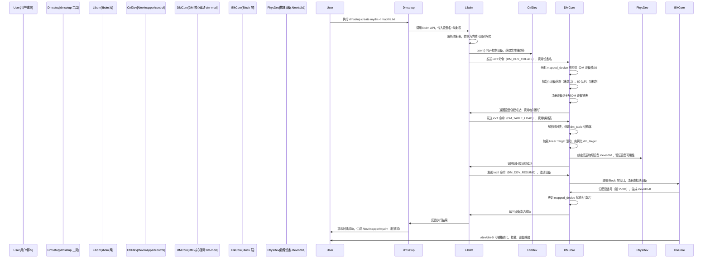
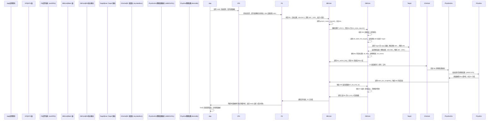

# 原理篇 ——DM 设备的 “诞生” 与 IO 的 “旅程”：从创建到 IO 处理全流程

在上一篇架构篇中，我们搞懂了 DM 层“用户态管理 + 内核态执行”的双态协同模式，也认识了 libdm、dmsetup、dm-mod 这些核心组件，以及 mapped_device、dm_table 等关键数据结构。但你可能还有疑问：

当我们在终端输入 `dmsetup create mydm` 后，用户态的指令如何穿透到内核态？一个 DM 设备（/dev/dm-*）是如何从无到有，最终被文件系统识别为“普通块设备”的？

当应用发起 read/write 请求时，IO 数据又是如何被 DM 层拦截、映射、转发，最终到达物理设备，再带着结果返回应用的？

本篇文章，我们将以“DM 设备的诞生”和“IO 请求的完整旅程”为两条主线，结合时序图、核心函数和实操验证，拆解每一个关键步骤，让你彻底摸清 DM 层的核心工作原理——这也是后续读懂源码、排查问题的基础。

# 一、DM 设备的“诞生”：从用户态指令到内核态设备就绪（全流程拆解）

DM 设备的创建，本质是“用户态配置映射规则 + 内核态实例化设备”的协同过程，全程围绕 `/dev/mapper/control` 通信桥梁和 ioctl 命令展开。我们以“创建一个 linear 类型的 DM 设备”为例，拆解从指令输入到设备就绪的 5 个核心阶段，结合时序图直观呈现。

## 1. 前置准备：用户态定义映射规则

创建 DM 设备前，必须先定义“映射表”——这是 DM 设备的“导航图”，规定了逻辑地址（DM 设备）与物理地址（底层物理设备）的对应关系。

示例映射表（mapfile.txt，linear 线性映射）：

```txt
0 1048576 linear /dev/sdb1 0
```

解读：将 DM 设备的 **0~1048575 扇区**（逻辑地址），线性映射到底层物理分区 /dev/sdb1 的 **0~1048575 扇区**（物理地址），映射长度为 1048576 扇区（约 512MB）。

## 2. 设备创建全流程时序图



## 3. 关键阶段详解（结合核心函数与数据结构）

整个创建流程的核心，是“用户态通过 ioctl 向内核态传递指令，内核态逐步实例化数据结构、绑定资源”，以下是 5 个阶段的核心细节，重点关注数据结构的变化和函数调用。

### 阶段1：用户态指令封装（dmsetup + libdm）

用户输入的 `dmsetup create` 并非直接与内核通信，而是由 libdm 完成“指令封装”：

- dmsetup 调用 libdm 的 `dm_task_create(DM_DEVICE_CREATE)` 接口，创建一个“创建设备”的任务。

- libdm 解析映射表文本，将其转换为内核可识别的二进制格式（避免内核重复解析字符串，提升效率）。

- libdm 调用 `open("/dev/mapper/control", O_RDWR)` 打开控制设备，获取通信文件描述符。

- 最终通过 `ioctl(fd, DM_IOCTL, &cmd)` 将指令发送到内核态，核心 cmd 是 `DM_DEV_CREATE`（创建设备实体）。

### 阶段2：内核态创建 mapped_device（设备实体）

内核态 DM 核心驱动（dm-mod）收到 `DM_DEV_CREATE` 指令后，核心工作是“实例化 mapped_device 结构体”——这是 DM 设备的“身份证”，所有设备属性都存在这里：

- 调用 `dm_alloc_md()` 函数，分配 mapped_device 结构体，初始化默认值（如 io_lock、table_lock 锁机制，避免并发冲突）。

- 将该设备添加到全局 DM 设备链表（`dm_devices`），便于后续管理和查询。

- 此时设备处于“未激活”状态，仅分配了核心结构体，未加载映射表、未绑定物理设备。

### 阶段3：加载映射表，实例化 Target 驱动

这是 DM 设备“有灵魂”的一步——映射表（dm_table）和 Target 驱动（dm_target）的绑定，决定了 DM 设备的功能：

- 用户态通过 `DM_TABLE_LOAD` 指令，将解析后的映射表发送到内核，内核调用 `dm_table_load()` 函数，创建 dm_table 结构体。

- dm_table 内部会根据映射表中的“Target 类型”（如 linear），调用 `dm_target_lookup()` 加载对应的 Target 驱动。

- 实例化 dm_target 结构体，将其添加到 dm_table 的 targets 数组中，同时绑定底层物理设备（如 /dev/sdb1），验证物理设备是否可用。

- 关键：此时 dm_table 已关联到 mapped_device（md->map = dm_table），DM 设备已知道“如何将逻辑地址映射到物理地址”。

### 阶段4：激活设备，注册到 Block 层

这是 DM 设备“可用”的关键一步——将 DM 设备注册到 Block 层，使其被系统识别为“普通块设备”：

- 用户态发送 `DM_DEV_RESUME` 指令，内核调用 `dm_resume()` 函数，将 mapped_device 状态改为“激活”。

- 调用 Block 层的 `blk_alloc_queue()` 为 DM 设备分配 IO 队列，调用 `register_blkdev()` 注册块设备，分配设备号（如主设备号 253，次设备号 0）。

- 生成 /dev/dm-0 设备文件，同时创建 /dev/mapper/mydm 软链接（指向 /dev/dm-0），方便用户访问。

- 关键：DM 设备注册到 Block 层后，文件系统即可像操作普通物理设备一样，对其进行格式化、挂载（如 mkfs.ext4 /dev/mapper/mydm）。

### 阶段5：设备销毁（补充）

当执行 `dmsetup remove mydm` 时，流程与创建相反：

- 用户态发送 `DM_DEV_SUSPEND` 暂停 IO，再发送 `DM_DEV_REMOVE` 指令。

- 内核注销 Block 层的 DM 设备，删除 /dev/dm-* 和软链接，释放 dm_table、dm_target、mapped_device 结构体。

- 解除与底层物理设备的绑定，从全局 DM 设备链表中移除该设备。

# 二、IO 的“旅程”：从应用请求到物理设备，再返回的全链路

DM 设备就绪后，应用发起的 IO 请求（read/write）会经历“上层 → DM 层 → 底层物理设备”的下行流程，以及“物理设备 → DM 层 → 上层应用”的上行流程。全程 DM 层扮演“拦截者 + 映射者 + 转发者”的角色，对上层透明。

我们仍以“linear 类型 DM 设备的读请求”为例，结合时序图和核心函数，拆解 IO 的完整旅程（写请求流程类似，仅多了 Target 驱动的加工步骤，如加密）。

## 1. IO 全流程时序图（下行 + 上行）



## 2. 关键步骤详解（聚焦 DM 层的核心作用）

IO 旅程的核心的是“DM 层对 Bio 的拦截、映射和转发”，以下重点拆解 DM 层的处理步骤，以及与 Block 层、Target 驱动的交互细节。

### （1）下行流程：DM 层如何拦截并映射 Bio？

下行流程的核心是“将上层 Bio 的逻辑地址，转换为底层物理设备的物理地址”，关键函数和步骤如下：

1. **Bio 拦截：dm_make_request() 是入口**DM 核心驱动注册块设备时，会将自己的 Bio 处理函数 `dm_make_request()` 注册到 Block 层。当 Block 层分发 Bio 时，会根据设备号（253:0），自动将 Bio 转发到这个函数——这就是 DM 层拦截 Bio 的核心机制。

2. **LBA 映射：dm_table_find_target() 是核心**DM 层拿到 Bio 后，首先调用 `dm_table_find_target(md->map, bio->bi_sector)`，根据 Bio 中的逻辑 LBA，在 dm_table 中查找对应的 dm_target 条目。对于 linear Target，Target 的 map() 函数会执行简单的线性偏移计算（物理 LBA = 逻辑 LBA + 物理设备起始偏移），最终返回物理设备和物理 LBA。

3. **Bio 更新与转发：dm_submit_bio()**映射完成后，DM 层会更新 Bio 的两个关键字段：之后调用 `dm_submit_bio()`（封装了 Block 层的 `generic_make_request()`），将更新后的 Bio 转发到底层 Block 层，后续流程与普通物理设备的 IO 处理一致。

    - `bio->bi_bdev`：将目标设备从 /dev/dm-0 改为底层物理设备 /dev/sdb1。

    - `bio->bi_sector`：将逻辑 LBA 改为映射后的物理 LBA。

### （2）上行流程：DM 层如何处理 IO 完成回调？

物理设备完成 IO 后，会通过回调函数通知上层，DM 层的核心作用是“处理回调收尾，再将结果转发给上层 Bio”：

1. 物理设备驱动调用 `block_bio_complete()`，标记 Bio 完成，并触发 Bio 的 `bi_end_io` 回调函数——这个回调函数是 DM 层提交 Bio 时设置的 `dm_bio_end_io()`。

2. **DM 层回调处理（dm_bio_end_io()）**：
        

    - 校验 IO 结果（成功/失败），如果是拆分后的子 Bio，等待所有子 Bio 完成后合并结果。

    - 调用对应 Target 驱动的 `end_io()` 函数，进行 Target 专属收尾（如 dm-crypt 的解密收尾、dm-snapshot 的 COW 操作；linear Target 无额外操作）。

    - 清理 DM 层为该 Bio 分配的临时资源（如子 Bio 缓冲区、锁）。

3. DM 层调用 **原始上层 Bio** 的 `bi_end_io` 回调函数，将 IO 完成结果转发给 Block 层，最终传递到文件系统和应用，完成整个 read() 系统调用。

### （3）写请求的额外处理（补充）

写请求的流程与读请求基本一致，唯一的区别是：在 DM 层映射 Bio 后，会增加“Target 驱动的加工步骤”：

- 如果是 dm-crypt Target：调用 map() 函数时，对 Bio 缓冲区中的数据进行加密。

- 如果是 dm-snapshot Target：调用 map() 函数时，执行写时复制（COW），将原始数据备份到快照分区，再写入新数据。

- linear Target 无额外加工，仅完成 LBA 映射即可。

# 三、实操彩蛋：跟踪 DM 设备创建与 IO 流程

结合本篇内容，我们通过几个简单的命令，跟踪 DM 设备的创建过程和 IO 流转，直观验证上述原理（Linux 系统或安卓 root 设备均可）。

## 1. 跟踪 DM 设备创建流程（内核日志）

```bash
# 1. 清空内核日志，便于查看
dmesg -c

# 2. 创建 DM 设备（沿用之前的 mapfile.txt）
dmsetup create mydm < mapfile.txt

# 3. 查看内核日志，过滤 DM 相关信息
dmesg | grep -i device-mapper
```

预期输出（关键信息标注）：

```txt
# 1. 加载 linear Target 驱动
device-mapper: table: 253:0: linear: dm-0: bound to device /dev/sdb1
# 2. DM 设备注册到 Block 层，分配设备号 253:0
device-mapper: core: new device mydm (253:0)
# 3. DM 设备激活成功
device-mapper: core: device mydm resumed
```

## 2. 跟踪 IO 流转（ftrace + DM 专属 trace 点）

我们可以通过 ftrace 开启 DM 层和 Block 层的 trace 点，查看 IO 请求的流转过程：

```bash
# 1. 进入 ftrace 目录（需 root 权限）
cd /sys/kernel/debug/tracing

# 2. 开启 DM 层和 Block 层的 trace 点
echo 1 > events/dm/enable
echo 1 > events/block/enable

# 3. 清空之前的 trace 记录
echo > trace

# 4. 发起 IO 请求（读取 DM 设备的 1000 扇区，长度 8 扇区）
dd if=/dev/mapper/mydm of=/dev/null bs=4096 count=1 skip=1000

# 5. 查看 trace 记录（重点关注 dm_bio_mapped 和 block_bio_queue）
cat trace | grep -E "dm_bio_mapped|block_bio_queue"
```

预期输出（关键信息标注）：

```txt
# 1. Block 层记录：Bio 提交到 DM 设备（/dev/dm-0，逻辑 LBA 1000）
block_bio_queue: 253,0 R 1000 + 8 [dd]
# 2. DM 层记录：逻辑 LBA 1000 映射到物理设备 8:17（/dev/sdb1）的物理 LBA 1000
dm_bio_mapped: dm-0: bio 1000->1000, dev 253:0->8:17
# 3. Block 层记录：Bio 转发到底层物理设备（/dev/sdb1，物理 LBA 1000）
block_bio_queue: 8,17 R 1000 + 8 [dd]
```

解读：这三条记录完美对应我们之前的 IO 流程——Bio 先提交到 DM 设备（253:0），经 DM 层映射后，转发到底层物理设备（8:17 即 /dev/sdb1），与我们的理论分析完全一致。

# 四、总结与预告

## 核心要点回顾

1. **DM 设备的“诞生”**：用户态通过 dmsetup + libdm 发送 ioctl 指令，内核态逐步分配 mapped_device、加载 dm_table、绑定 Target 驱动和物理设备，最终注册到 Block 层，生成 /dev/dm-* 设备文件。
      

2. **IO 的“旅程”**：下行（应用→DM→物理设备）核心是“Bio 拦截 + LBA 映射 + 转发”，上行（物理设备→DM→应用）核心是“回调处理 + 结果转发”，全程对上层透明。
      

3. **DM 层的核心函数**：dm_make_request()（Bio 拦截入口）、dm_table_find_target()（LBA 映射核心）、dm_bio_end_io()（IO 回调入口）。
      

4. **Target 驱动的作用**：实现具体的 IO 处理逻辑（如 linear 的 LBA 映射、crypt 的加密），是 DM 层“功能插件”的核心体现。
      

## 下一篇预告

本篇我们讲解了 DM 设备创建和 IO 处理的“流程层面”的原理，但你可能还有更深的疑问：dm_make_request() 函数内部到底是如何实现 Bio 拦截的？dm_table_find_target() 是如何快速查找 LBA 对应的 Target 的？

**下一篇《源码篇——DM 层核心源码精读：dm.c 与 dm-table.c 的关键函数》**，我们将聚焦 DM 层的核心源码，精读 dm.c（DM 核心入口）和 dm-table.c（映射表核心）中的关键函数，拆解其内部实现逻辑，带你从“流程理解”深入到“源码落地”，真正读懂 DM 层的底层实现。
> （注：文档部分内容可能由 AI 生成）