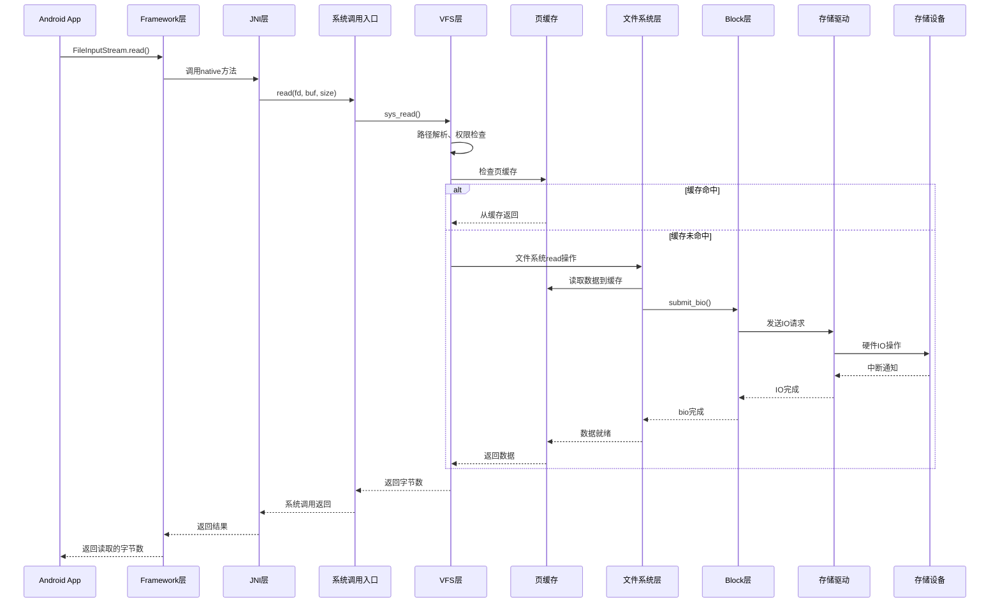
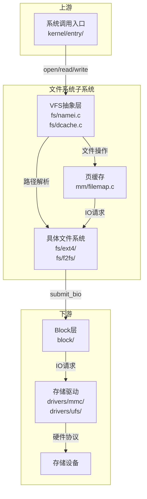
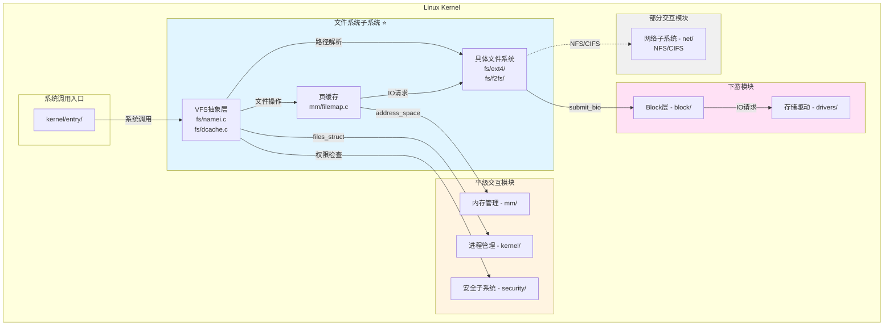
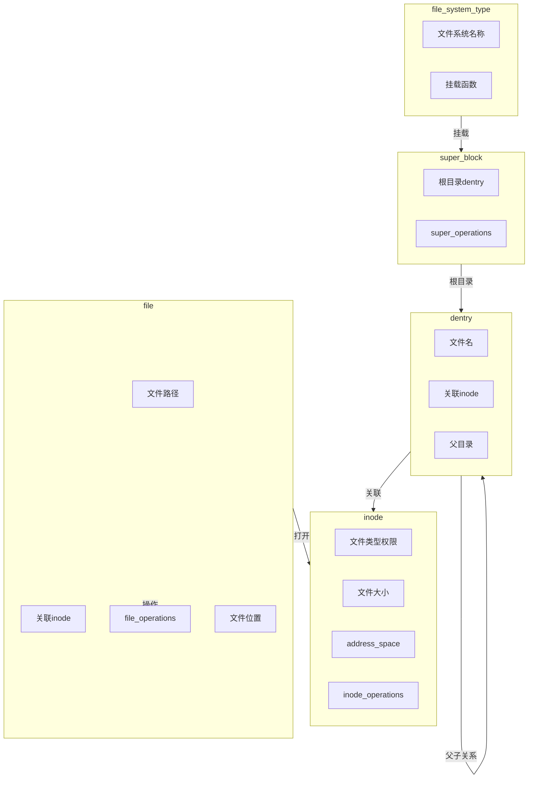

# 文件系统概述与架构设计

## 学习目标

- 从 Framework 层视角理解文件系统在整个系统架构中的位置
- 理解 Framework → Kernel → 存储设备 的完整交互链路
- 掌握文件系统子系统在 Kernel 内部的位置和上下游关系
- 了解文件系统子系统与其他 Kernel 模块的关系（平级交互、无直接联系）
- 理解文件系统子系统的核心职责和主要组件

## 一、系统整体架构视角（Framework → Kernel → 存储设备）

### Framework 层在 Android 系统架构中的位置

Android 系统采用分层架构，从应用层到硬件层，文件系统贯穿其中：

```
┌─────────────────────────────────────────────────────────────┐
│                   应用层（Application）                       │
│              Android App（Java/Kotlin）                      │
└────────────────────┬────────────────────────────────────────┘
                      │ Java API
┌─────────────────────▼────────────────────────────────────────┐
│              Framework 层（Java Framework）                   │
│  ┌────────────────────────────────────────────────────────┐ │
│  │  StorageManager / MediaProvider                        │ │
│  │  DocumentsProvider / File API                          │ │
│  │  Scoped Storage / SAF                                  │ │
│  └────────────────────┬───────────────────────────────────┘ │
│  ┌────────────────────▼───────────────────────────────────┐ │
│  │  Native 层（libcore, libc等）                         │ │
│  └────────────────────┬───────────────────────────────────┘ │
└───────────────────────┼─────────────────────────────────────┘
                        │ 系统调用（open, read, write, close, stat, mmap等）
┌───────────────────────▼─────────────────────────────────────┐
│                  Kernel 层（Linux Kernel）                   │
│  ┌────────────────────────────────────────────────────────┐ │
│  │  系统调用入口（kernel/entry/）                         │ │
│  └────────────────────┬───────────────────────────────────┘ │
│  ┌────────────────────▼───────────────────────────────────┐ │
│  │  VFS 抽象层 ⭐（本系列重点）                           │ │
│  │  fs/namei.c, fs/dcache.c, fs/inode.c                  │ │
│  └────────────────────┬───────────────────────────────────┘ │
│  ┌────────────────────▼───────────────────────────────────┐ │
│  │  页缓存（Page Cache）                                  │ │
│  │  mm/filemap.c, mm/readahead.c                          │ │
│  └────────────────────┬───────────────────────────────────┘ │
│  ┌────────────────────▼───────────────────────────────────┐ │
│  │  具体文件系统实现                                      │ │
│  │  fs/ext4/, fs/f2fs/, fs/erofs/                        │ │
│  └────────────────────┬───────────────────────────────────┘ │
│  ┌────────────────────▼───────────────────────────────────┐ │
│  │  Block 层                                              │ │
│  │  block/blk-core.c, block/blk-mq.c                     │ │
│  └────────────────────┬───────────────────────────────────┘ │
│  ┌────────────────────▼───────────────────────────────────┐ │
│  │  存储驱动（eMMC/UFS/NVMe）                            │ │
│  │  drivers/mmc/, drivers/ufs/, drivers/nvme/            │ │
│  └────────────────────┬───────────────────────────────────┘ │
└───────────────────────┼─────────────────────────────────────┘
                        │ 硬件接口（eMMC/UFS/NVMe协议）
┌───────────────────────▼─────────────────────────────────────┐
│                   硬件层（Hardware）                          │
│           存储设备（eMMC, UFS, NVMe SSD等）                  │
└─────────────────────────────────────────────────────────────┘
```

### Framework 层文件系统的核心组件

#### 1. StorageManager

**作用**：管理存储设备和卷

```java
// frameworks/base/core/java/android/os/storage/StorageManager.java
public class StorageManager {
    // 获取存储卷信息
    public List<StorageVolume> getStorageVolumes();
    
    // 挂载/卸载存储卷
    public void mount(String volId);
    public void unmount(String volId);
    
    // 获取存储统计信息
    public StorageStatsManager getStorageStatsManager();
}
```

#### 2. MediaProvider

**作用**：管理媒体文件（图片、视频、音频）

```java
// packages/providers/MediaProvider/src/com/android/providers/media/MediaProvider.java
public class MediaProvider extends ContentProvider {
    // 媒体文件扫描
    private void scanFile(File file, int volumeId);
    
    // 媒体文件查询
    @Override
    public Cursor query(Uri uri, String[] projection, ...);
}
```

#### 3. DocumentsProvider

**作用**：提供文档访问框架（Storage Access Framework）

```java
// frameworks/base/core/java/android/provider/DocumentsProvider.java
public abstract class DocumentsProvider extends ContentProvider {
    // 列出文档
    public abstract Cursor queryChildDocuments(String parentDocumentId, ...);
    
    // 打开文档
    public abstract ParcelFileDescriptor openDocument(String documentId, ...);
}
```

### Framework → Kernel 的完整交互链路

当 Android 应用执行文件操作时，数据流经过以下路径：



### Framework 层如何通过系统调用与 Kernel 交互

Framework 层通过以下系统调用与 Kernel 文件系统子系统交互：

#### 1. 文件操作类系统调用

| 系统调用 | 功能 | Framework 使用场景 |
|---------|------|-------------------|
| `open()` | 打开文件 | FileInputStream/FileOutputStream |
| `read()` | 读取文件 | FileInputStream.read() |
| `write()` | 写入文件 | FileOutputStream.write() |
| `close()` | 关闭文件 | 文件流关闭 |
| `stat()` | 获取文件信息 | File.exists(), File.length() |
| `mmap()` | 内存映射 | Binder, ashmem |

```c
// fs/open.c
SYSCALL_DEFINE3(open, const char __user *, filename, int, flags, umode_t, mode)
{
    if (force_o_largefile())
        flags |= O_LARGEFILE;
    return do_sys_open(AT_FDCWD, filename, flags, mode);
}

// fs/read_write.c
SYSCALL_DEFINE3(read, unsigned int, fd, char __user *, buf, size_t, count)
{
    return ksys_read(fd, buf, count);
}
```

#### 2. 目录操作类系统调用

| 系统调用 | 功能 | Framework 使用场景 |
|---------|------|-------------------|
| `mkdir()` | 创建目录 | File.mkdir() |
| `rmdir()` | 删除目录 | File.delete() |
| `getdents()` | 读取目录 | File.listFiles() |
| `chdir()` | 切换目录 | 进程工作目录 |

#### 3. 文件系统操作类系统调用

| 系统调用 | 功能 | Framework 使用场景 |
|---------|------|-------------------|
| `mount()` | 挂载文件系统 | Vold 挂载分区 |
| `umount()` | 卸载文件系统 | Vold 卸载分区 |
| `statfs()` | 获取文件系统统计 | StorageManager 获取空间信息 |

---

## 二、Kernel 内部架构视角

### Kernel 内部的主要子系统划分

Linux Kernel 内部主要分为以下几个子系统：

```
┌─────────────────────────────────────────────────────────────┐
│                  Linux Kernel 内部架构                        │
│                                                              │
│  ┌──────────────┐  ┌──────────────┐  ┌──────────────┐      │
│  │ 进程管理     │  │  内存管理    │  │  文件系统 ⭐ │      │
│  │ kernel/      │  │   mm/        │  │   fs/        │      │
│  │ fork.c       │  │              │  │              │      │
│  │ exit.c       │  │              │  │              │      │
│  │ sched/       │  │              │  │              │      │
│  └──────┬───────┘  └──────┬───────┘  └──────┬───────┘      │
│         │                 │                 │               │
│         │    平级交互     │    平级交互     │               │
│         ├─────────────────┼─────────────────┤               │
│         │                 │                 │               │
│  ┌──────▼───────┐  ┌──────▼───────┐  ┌──────▼───────┐      │
│  │  网络子系统  │  │  IPC 子系统  │  │  设备驱动    │      │
│  │   net/       │  │   ipc/       │  │  drivers/    │      │
│  └──────────────┘  └──────────────┘  └──────────────┘      │
│                                                              │
│  ┌──────────────┐  ┌──────────────┐                        │
│  │  Block 层    │  │  安全子系统  │  ← 与文件系统有交互    │
│  │  block/      │  │  security/   │                        │
│  └──────────────┘  └──────────────┘                        │
└─────────────────────────────────────────────────────────────┘
```

### 文件系统子系统在 Kernel 中的位置

文件系统子系统是 Linux Kernel 的核心子系统之一，负责：
- 文件与目录的管理
- 路径解析与权限检查
- 文件操作的统一接口
- 与存储设备的交互

**源码位置**：
- `fs/namei.c` - 路径解析
- `fs/dcache.c` - dentry 缓存
- `fs/inode.c` - inode 管理
- `fs/open.c` - 文件打开
- `fs/read_write.c` - 文件读写
- `fs/ext4/` - ext4 文件系统
- `fs/f2fs/` - f2fs 文件系统

### 文件系统子系统的上下游关系



#### 上游：系统调用入口

**系统调用入口如何调用文件系统子系统**：

```c
// arch/arm64/kernel/syscall.c
static void invoke_syscall(struct pt_regs *regs, unsigned int scno,
                           unsigned int sc_nr,
                           const syscall_fn_t syscall_table[])
{
    long ret;
    
    if (scno < sc_nr) {
        syscall_fn_t syscall_fn;
        syscall_fn = syscall_table[array_index_nospec(scno, sc_nr)];
        ret = __invoke_syscall(regs, syscall_fn);
    } else {
        ret = do_ni_syscall(regs);
    }
    
    regs->regs[0] = ret;
}
```

**关键转换点**：
- `sys_open()` → `do_sys_open()` → `do_filp_open()` → VFS
- `sys_read()` → `ksys_read()` → `vfs_read()` → VFS
- `sys_write()` → `ksys_write()` → `vfs_write()` → VFS

#### 下游：Block 层与存储驱动

**文件系统如何调用下游**：

```c
// fs/ext4/inode.c
static int ext4_readpage(struct file *file, struct page *page)
{
    // 创建 bio
    struct bio *bio = bio_alloc(GFP_KERNEL, 1);
    
    // 设置 bio 参数
    bio->bi_iter.bi_sector = block * (PAGE_SIZE >> 9);
    bio->bi_bdev = inode->i_sb->s_bdev;
    bio_add_page(bio, page, PAGE_SIZE, 0);
    
    // 提交到 Block 层
    submit_bio(REQ_OP_READ, bio);
    
    return 0;
}
```

### 文件系统子系统的同级模块关系

#### 1. 与内存管理（mm/）的关系 —— 有直接联系

**交互场景**：
- 页缓存（Page Cache）：文件数据缓存
- mmap：文件内存映射
- 缺页处理：文件映射的缺页

```c
// mm/filemap.c - 页缓存与文件系统的交互
ssize_t generic_file_read_iter(struct kiocb *iocb, struct iov_iter *iter)
{
    struct file *file = iocb->ki_filp;
    struct address_space *mapping = file->f_mapping;
    
    // 1. 检查页缓存
    page = find_get_page(mapping, index);
    if (page) {
        // 缓存命中，直接返回
        copy_page_to_iter(page, offset, count, iter);
        return count;
    }
    
    // 2. 缓存未命中，调用文件系统读取
    ret = mapping->a_ops->readpage(file, page);
    
    // 3. 将数据加入页缓存
    add_to_page_cache_lru(page, mapping, index, GFP_KERNEL);
    
    return ret;
}
```

**关系图**：
```
文件系统（fs/ext4/）
      │
      │ readpage() / writepage()
      ▼
页缓存（mm/filemap.c）
      │
      │ address_space
      ▼
内存管理（mm/）
      │
      ├── 页分配与回收
      ├── 缺页处理
      └── 内存映射
```

#### 2. 与进程管理的关系 —— 有直接联系

**交互场景**：
- 文件描述符表（files_struct）
- 文件系统信息（fs_struct）
- 进程的工作目录和根目录

```c
// kernel/fork.c - 进程创建时与文件系统的交互
static int copy_files(unsigned long clone_flags, struct task_struct *tsk)
{
    struct files_struct *oldf, *newf;
    
    oldf = current->files;
    if (!oldf)
        goto out;
    
    if (clone_flags & CLONE_FILES) {
        // 线程：共享文件描述符表
        atomic_inc(&oldf->count);
        tsk->files = oldf;
        return 0;
    }
    
    // 进程：复制文件描述符表
    newf = dup_fd(oldf, NR_OPEN_MAX, &error);
    tsk->files = newf;
    return 0;
}
```

**关系图**：
```
进程管理（kernel/fork.c）
      │
      ├── copy_files() ──► files_struct（文件描述符表）
      │
      └── copy_fs() ──► fs_struct（工作目录、根目录）
```

#### 3. 与 Block 层的关系 —— 有直接联系（下游）

**交互场景**：
- 文件系统通过 submit_bio 向 Block 层提交 IO
- Block 层完成 IO 后回调文件系统

```c
// fs/ext4/inode.c
static int ext4_readpage(struct file *file, struct page *page)
{
    // 创建 bio
    struct bio *bio = bio_alloc(GFP_KERNEL, 1);
    
    // 设置完成回调
    bio->bi_end_io = ext4_end_bio;
    
    // 提交到 Block 层
    submit_bio(REQ_OP_READ, bio);
}

static void ext4_end_bio(struct bio *bio)
{
    // Block 层 IO 完成后的回调
    // 通知等待的进程
    end_page_writeback(page);
}
```

#### 4. 与网络子系统（net/）的关系 —— 部分交互

**交互场景**：
- NFS（Network File System）：通过网络访问远程文件
- CIFS/SMB：Windows 文件共享协议

```c
// fs/nfs/file.c
static ssize_t nfs_file_read(struct kiocb *iocb, struct iov_iter *to)
{
    // NFS 通过网络协议读取文件
    // 调用网络子系统发送 RPC 请求
    return nfs_file_read_iter(iocb, to);
}
```

**关系说明**：
- NFS/CIFS 是文件系统与网络子系统的交叉
- 普通文件系统（ext4, f2fs）与网络子系统无直接联系

#### 5. 与安全子系统（security/）的关系 —— 有直接联系

**交互场景**：
- 文件权限检查
- SELinux 文件标签
- 文件访问控制

```c
// security/security.c
int security_inode_permission(struct inode *inode, int mask)
{
    // 调用安全子系统的权限检查
    return call_int_hook(inode_permission, 0, inode, mask);
}
```

### Kernel 内部模块关系总图



**图例说明**：
- **蓝色背景**：文件系统子系统（本系列重点）
- **黄色背景**：与文件系统有直接联系的模块
- **粉色背景**：下游模块
- **灰色背景**：部分交互模块（仅 NFS/CIFS）
- **实线箭头**：直接调用关系
- **虚线箭头**：部分交互关系

---

## 三、文件系统子系统内部架构

### 文件系统子系统的核心职责

文件系统子系统是 Linux 内核的核心子系统，主要职责包括：

1. **文件与目录管理**
   - 文件的创建、删除、重命名
   - 目录的创建、删除、遍历
   - 文件元数据管理（权限、大小、时间等）

2. **路径解析与缓存**
   - 将路径名解析为 inode
   - dentry 缓存管理
   - 符号链接与硬链接处理

3. **文件操作统一接口**
   - 通过 VFS 提供统一的系统调用接口
   - 多态分发到具体文件系统实现

4. **与存储设备的交互**
   - 通过 Block 层提交 IO 请求
   - 处理 IO 完成回调

### 文件系统子系统的主要组件

```
┌─────────────────────────────────────────────────────────────┐
│                 文件系统子系统内部架构                        │
│                                                              │
│  ┌──────────────────────────────────────────────────────┐  │
│  │                  VFS 抽象层                          │  │
│  │  fs/namei.c - 路径解析                               │  │
│  │  fs/dcache.c - dentry 缓存                           │  │
│  │  fs/inode.c - inode 管理                             │  │
│  │  fs/open.c - 文件打开                                │  │
│  │  fs/read_write.c - 文件读写                          │  │
│  └──────────────────────────────────────────────────────┘  │
│                           │                                 │
│  ┌──────────────────────────────────────────────────────┐  │
│  │                  页缓存层                            │  │
│  │  mm/filemap.c - 文件映射与缓存                       │  │
│  │  mm/readahead.c - 预读机制                           │  │
│  │  mm/writeback.c - 脏页回写                           │  │
│  └──────────────────────────────────────────────────────┘  │
│                           │                                 │
│  ┌──────────────────────────────────────────────────────┐  │
│  │              具体文件系统实现                         │  │
│  │  fs/ext4/ - ext4 文件系统                            │  │
│  │  fs/f2fs/ - f2fs 文件系统                            │  │
│  │  fs/erofs/ - erofs 只读文件系统                      │  │
│  │  fs/proc/ - procfs 虚拟文件系统                      │  │
│  │  fs/sysfs/ - sysfs 虚拟文件系统                      │  │
│  └──────────────────────────────────────────────────────┘  │
│                           │                                 │
│  ┌──────────────────────────────────────────────────────┐  │
│  │                  Block 层接口                         │  │
│  │  submit_bio() - 提交 IO 请求                         │  │
│  └──────────────────────────────────────────────────────┘  │
└─────────────────────────────────────────────────────────────┘
```

### 关键数据结构概览

#### 1. struct file_system_type

**作用**：文件系统类型注册

```c
// include/linux/fs.h
struct file_system_type {
    const char *name;           // 文件系统名称（如 "ext4"）
    int fs_flags;               // 文件系统标志
    struct dentry *(*mount)(struct file_system_type *, int,
                            const char *, void *);
    void (*kill_sb)(struct super_block *);
    struct module *owner;
    struct file_system_type *next;
    struct hlist_head fs_supers;
};
```

#### 2. struct super_block

**作用**：文件系统实例（每个挂载点一个）

```c
// include/linux/fs.h
struct super_block {
    struct list_head s_list;           // 超级块链表
    dev_t s_dev;                      // 设备号
    unsigned char s_blocksize_bits;    // 块大小（位）
    unsigned long s_blocksize;          // 块大小（字节）
    struct super_operations *s_op;     // 超级块操作
    struct dentry *s_root;            // 根目录
    struct rw_semaphore s_umount;     // 卸载信号量
    // ...
};
```

#### 3. struct inode

**作用**：文件元数据

```c
// include/linux/fs.h
struct inode {
    umode_t i_mode;                   // 文件类型和权限
    uid_t i_uid;                      // 用户ID
    gid_t i_gid;                      // 组ID
    loff_t i_size;                    // 文件大小
    struct timespec64 i_atime;        // 访问时间
    struct timespec64 i_mtime;        // 修改时间
    struct timespec64 i_ctime;        // 状态改变时间
    struct inode_operations *i_op;     // inode操作
    struct file_operations *i_fop;    // 文件操作（设备文件）
    struct address_space *i_mapping;  // 页缓存映射
    // ...
};
```

#### 4. struct dentry

**作用**：目录项缓存

```c
// include/linux/dcache.h
struct dentry {
    struct qstr d_name;                // 文件名
    struct inode *d_inode;            // 关联的inode
    struct dentry *d_parent;          // 父目录
    struct list_head d_subdirs;       // 子目录列表
    struct hlist_node d_hash;         // 哈希表节点
    // ...
};
```

#### 5. struct file

**作用**：打开的文件

```c
// include/linux/fs.h
struct file {
    struct path f_path;                // 文件路径
    struct inode *f_inode;            // 关联的inode
    const struct file_operations *f_op; // 文件操作函数表
    loff_t f_pos;                     // 文件位置
    unsigned int f_flags;              // 打开标志
    fmode_t f_mode;                   // 文件模式
    // ...
};
```

### 数据结构关系图



---

## 总结

### 核心要点

1. **文件系统子系统的位置**：
   - 位于系统调用入口和 Block 层之间
   - 是 Kernel 的核心子系统之一

2. **上下游关系**：
   - **上游**：系统调用入口通过 `sys_open()`、`sys_read()` 等调用文件系统
   - **下游**：文件系统通过 `submit_bio()` 调用 Block 层

3. **同级模块关系**：
   - **有直接联系**：内存管理（页缓存、mmap）、进程管理（文件描述符表）、安全子系统（权限检查）
   - **部分交互**：网络子系统（仅 NFS/CIFS）

4. **Framework 与 Kernel 的交互**：
   - Framework 层通过系统调用触发文件操作
   - Kernel 层通过系统调用返回值通知 Framework 层
   - Framework 层通过 /proc、/sys 文件系统查询状态

5. **文件系统子系统的核心组件**：
   - VFS 抽象层（统一接口）
   - 页缓存层（性能优化）
   - 具体文件系统实现（ext4, f2fs, erofs等）

### 关键概念

- **VFS（虚拟文件系统）**：内核中的文件系统抽象层
- **页缓存（Page Cache）**：文件数据的内存缓存
- **inode**：文件元数据对象
- **dentry**：目录项缓存对象
- **file**：打开的文件对象
- **super_block**：文件系统实例对象

### 后续学习

- [文件系统核心数据结构](02-文件系统核心数据结构.md) - 深入理解核心数据结构
- [文件操作路径总览](03-文件操作路径总览.md) - 理解文件操作的完整路径
- [VFS设计理念与统一接口](04-VFS设计理念与统一接口.md) - 深入理解 VFS 抽象层

## 参考资源

- 内核文档：`Documentation/filesystems/`
- 内核源码：
  - `fs/namei.c` - 路径解析
  - `fs/dcache.c` - dentry 缓存
  - `fs/inode.c` - inode 管理
  - `include/linux/fs.h` - 核心结构定义
- 相关文章：
  - `../block/01-Block层概述与架构设计.md` - Block 层架构
  - `../process/01-进程管理概述与架构设计.md` - 进程管理架构

## 更新记录

- 2026-01-28：初始创建，包含文件系统概述和三层递进架构设计
