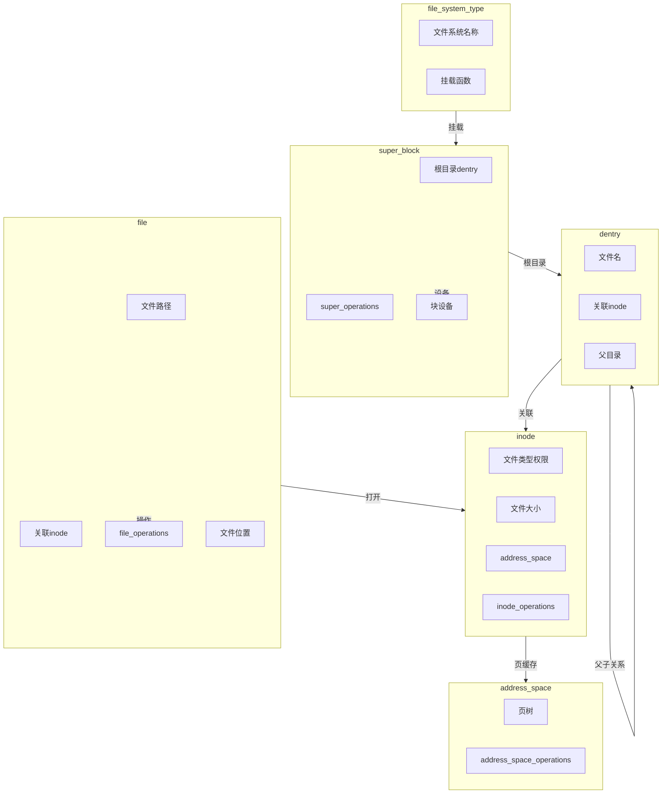

# 文件系统核心数据结构

## 学习目标

- 理解文件系统子系统的核心数据结构及其作用
- 掌握 file_system_type、super_block、inode、dentry、file 等关键数据结构
- 理解数据结构之间的关系和生命周期
- 了解数据结构在文件操作中的使用场景

## 概述

文件系统子系统的核心数据结构构成了整个文件系统的基础。理解这些数据结构对于深入理解 Linux 文件系统至关重要。

本文档将介绍以下核心数据结构：

1. **struct file_system_type** - 文件系统类型注册
2. **struct super_block** - 文件系统实例
3. **struct inode** - 文件元数据
4. **struct dentry** - 目录项缓存
5. **struct file** - 打开的文件
6. **struct address_space** - 页缓存映射

---

## 一、struct file_system_type - 文件系统类型

### 定义位置

**头文件**：`include/linux/fs.h`

### 作用

`struct file_system_type` 描述一种文件系统类型，用于注册和识别文件系统。

### 关键字段

```c
// include/linux/fs.h
struct file_system_type {
    const char *name;           // 文件系统名称（如 "ext4", "f2fs"）
    int fs_flags;               // 文件系统标志
    struct dentry *(*mount)(struct file_system_type *fs_type,
                            int flags, const char *dev_name, void *data);
    void (*kill_sb)(struct super_block *);
    struct module *owner;       // 模块所有者
    struct file_system_type *next;  // 链表下一个
    struct hlist_head fs_supers;    // 该类型的所有 super_block
};
```

### 文件系统标志

```c
// include/linux/fs.h
#define FS_REQUIRES_DEV         1   // 需要块设备
#define FS_BINARY_MOUNTDATA     2   // 二进制挂载数据
#define FS_HAS_SUBTYPE          4   // 有子类型
#define FS_USERNS_MOUNT         8   // 支持用户命名空间挂载
#define FS_DISALLOW_NOTIFY_PERM 16  // 不允许通知权限
#define FS_ALLOW_IDMAP          32  // 允许 ID 映射
#define FS_MGTIME               64  // 管理时间
```

### 文件系统注册

```c
// fs/filesystems.c
int register_filesystem(struct file_system_type *fs)
{
    int res = 0;
    struct file_system_type **p;
    
    BUG_ON(strchr(fs->name, '.'));
    if (fs->next)
        return -EBUSY;
    
    write_lock(&file_systems_lock);
    p = find_filesystem(fs->name, strlen(fs->name));
    if (*p)
        res = -EBUSY;
    else
        *p = fs;
    write_unlock(&file_systems_lock);
    
    return res;
}

// ext4 文件系统注册示例
// fs/ext4/super.c
static struct file_system_type ext4_fs_type = {
    .owner      = THIS_MODULE,
    .name       = "ext4",
    .mount      = ext4_mount,
    .kill_sb    = kill_block_super,
    .fs_flags   = FS_REQUIRES_DEV,
};
MODULE_ALIAS_FS("ext4");
```

---

## 二、struct super_block - 文件系统实例

### 定义位置

**头文件**：`include/linux/fs.h`

### 作用

`struct super_block` 表示一个已挂载的文件系统实例。每个挂载点对应一个 super_block。

### 关键字段

```c
// include/linux/fs.h
struct super_block {
    struct list_head s_list;           // 超级块链表
    dev_t s_dev;                      // 设备号
    unsigned char s_blocksize_bits;    // 块大小（位）
    unsigned long s_blocksize;          // 块大小（字节）
    unsigned char s_dirt;              // 脏标志
    unsigned long long s_maxbytes;      // 最大文件大小
    struct file_system_type *s_type;    // 文件系统类型
    const struct super_operations *s_op; // 超级块操作
    const struct dquot_operations *dq_op; // 配额操作
    const struct quotactl_ops *s_qcop;  // 配额控制
    const struct export_operations *s_export_op; // 导出操作
    unsigned long s_flags;             // 挂载标志
    unsigned long s_iflags;            // 内部标志
    unsigned long s_magic;              // 文件系统魔数
    struct dentry *s_root;             // 根目录
    struct rw_semaphore s_umount;      // 卸载信号量
    int s_count;                       // 引用计数
    atomic_t s_active;                 // 活动引用计数
    void *s_security;                  // 安全数据
    struct xattr_handler **s_xattr;    // 扩展属性处理
    struct hlist_bl_head s_roots;      // 备用根
    struct list_head s_mounts;         // 挂载点列表
    struct block_device *s_bdev;        // 块设备
    struct backing_dev_info *s_bdi;    // 后备设备信息
    struct mtd_info *s_mtd;            // MTD 设备
    struct hlist_node s_instances;     // 实例节点
    struct quota_info s_dquot;         // 配额信息
    struct sb_writers s_writers;       // 写者信息
    char s_id[32];                     // 标识符
    u8 s_uuid[16];                     // UUID
    void *s_fs_info;                   // 文件系统私有数据
    // ...
};
```

### super_operations

```c
// include/linux/fs.h
struct super_operations {
    struct inode *(*alloc_inode)(struct super_block *sb);
    void (*destroy_inode)(struct inode *);
    void (*free_inode)(struct inode *);
    void (*dirty_inode)(struct inode *, int flags);
    int (*write_inode)(struct inode *, struct writeback_control *wbc);
    int (*drop_inode)(struct inode *);
    void (*evict_inode)(struct inode *);
    void (*put_super)(struct super_block *);
    int (*sync_fs)(struct super_block *sb, int wait);
    int (*freeze_super)(struct super_block *);
    int (*freeze_fs)(struct super_block *);
    int (*thaw_super)(struct super_block *);
    int (*unfreeze_fs)(struct super_block *);
    int (*statfs)(struct dentry *, struct kstatfs *);
    int (*remount_fs)(struct super_block *, int *, char *);
    void (*umount_begin)(struct super_block *);
    int (*show_options)(struct seq_file *, struct dentry *);
    int (*write_inode)(struct inode *, struct writeback_control *);
    // ...
};
```

### ext4 的 super_operations

```c
// fs/ext4/super.c
static const struct super_operations ext4_sops = {
    .alloc_inode    = ext4_alloc_inode,
    .free_inode     = ext4_free_inode,
    .dirty_inode    = ext4_dirty_inode,
    .write_inode    = ext4_write_inode,
    .drop_inode     = ext4_drop_inode,
    .evict_inode    = ext4_evict_inode,
    .put_super      = ext4_put_super,
    .sync_fs        = ext4_sync_fs,
    .freeze_fs      = ext4_freeze,
    .unfreeze_fs    = ext4_unfreeze,
    .statfs         = ext4_statfs,
    .remount_fs     = ext4_remount,
    .show_options   = ext4_show_options,
};
```

---

## 三、struct inode - 文件元数据

### 定义位置

**头文件**：`include/linux/fs.h`

### 作用

`struct inode` 存储文件或目录的元数据，包括权限、大小、时间戳等。

### 关键字段

```c
// include/linux/fs.h
struct inode {
    umode_t i_mode;                   // 文件类型和权限
    unsigned short i_opflags;          // 操作标志
    kuid_t i_uid;                      // 用户ID
    kgid_t i_gid;                      // 组ID
    unsigned int i_flags;              // 文件标志
    const struct inode_operations *i_op; // inode操作
    struct super_block *i_sb;          // 所属超级块
    struct address_space *i_mapping;   // 页缓存映射
    struct address_space i_data;       // 内嵌的address_space
    unsigned long i_ino;               // inode号
    dev_t i_rdev;                     // 设备号（设备文件）
    loff_t i_size;                    // 文件大小
    struct timespec64 i_atime;        // 访问时间
    struct timespec64 i_mtime;        // 修改时间
    struct timespec64 i_ctime;        // 状态改变时间
    spinlock_t i_lock;                // 自旋锁
    unsigned short i_bytes;            // 块内字节数
    u8 i_blkbits;                     // 块大小（位）
    u8 i_write_hint;                  // 写提示
    blkcnt_t i_blocks;                // 块数
    union {
        struct pipe_inode_info *i_pipe; // 管道
        struct block_device *i_bdev;    // 块设备
        struct cdev *i_cdev;            // 字符设备
        char *i_link;                   // 符号链接
    };
    __u32 i_generation;               // 生成号
    void *i_private;                   // 文件系统私有数据
    // ...
};
```

### 文件类型

```c
// include/linux/stat.h
#define S_IFMT  00170000  // 文件类型掩码
#define S_IFSOCK 0140000  // socket
#define S_IFLNK  0120000  // 符号链接
#define S_IFREG  0100000  // 普通文件
#define S_IFBLK  0060000  // 块设备
#define S_IFDIR  0040000  // 目录
#define S_IFCHR  0020000  // 字符设备
#define S_IFIFO  0010000  // FIFO

// 权限位
#define S_IRWXU 00700     // 用户读写执行
#define S_IRUSR 00400     // 用户读
#define S_IWUSR 00200     // 用户写
#define S_IXUSR 00100     // 用户执行
// ... 组和其他权限类似
```

### inode_operations

```c
// include/linux/fs.h
struct inode_operations {
    struct dentry *(*lookup)(struct inode *, struct dentry *, unsigned int);
    const char *(*get_link)(struct dentry *, struct inode *, struct delayed_call *);
    int (*permission)(struct inode *, int);
    struct dentry *(*get_acl)(struct inode *, int, bool);
    int (*readlink)(struct dentry *, char __user *, int);
    int (*create)(struct inode *, struct dentry *, umode_t, bool);
    int (*link)(struct dentry *, struct inode *, struct dentry *);
    int (*unlink)(struct inode *, struct dentry *);
    int (*symlink)(struct inode *, struct dentry *, const char *);
    int (*mkdir)(struct inode *, struct dentry *, umode_t);
    int (*rmdir)(struct inode *, struct dentry *);
    int (*mknod)(struct inode *, struct dentry *, umode_t, dev_t);
    int (*rename)(struct inode *, struct dentry *,
                  struct inode *, struct dentry *, unsigned int);
    int (*setattr)(struct dentry *, struct iattr *);
    int (*getattr)(const struct path *, struct kstat *, u32, unsigned int);
    // ...
};
```

### ext4 的 inode_operations

```c
// fs/ext4/namei.c
const struct inode_operations ext4_dir_inode_operations = {
    .create     = ext4_create,
    .lookup     = ext4_lookup,
    .link       = ext4_link,
    .unlink     = ext4_unlink,
    .symlink    = ext4_symlink,
    .mkdir      = ext4_mkdir,
    .rmdir      = ext4_rmdir,
    .mknod      = ext4_mknod,
    .rename     = ext4_rename2,
    .setattr    = ext4_setattr,
    .getattr    = ext4_getattr,
    .listxattr  = ext4_listxattr,
    .get_acl    = ext4_get_acl,
    .set_acl    = ext4_set_acl,
    .fiemap     = ext4_fiemap,
};
```

---

## 四、struct dentry - 目录项缓存

### 定义位置

**头文件**：`include/linux/dcache.h`

### 作用

`struct dentry` 缓存路径名到 inode 的映射，加速路径解析。

### 关键字段

```c
// include/linux/dcache.h
struct dentry {
    unsigned int d_flags;              // 标志
    seqcount_spinlock_t d_seq;         // 序列锁
    struct hlist_bl_node d_hash;       // 哈希表节点
    struct dentry *d_parent;           // 父目录
    struct qstr d_name;                // 文件名
    struct inode *d_inode;            // 关联的inode
    unsigned char d_iname[DNAME_INLINE_LEN]; // 短文件名内联存储
    struct lockref d_lockref;          // 锁和引用计数
    const struct dentry_operations *d_op; // dentry操作
    struct super_block *d_sb;          // 所属超级块
    void *d_fsdata;                    // 文件系统私有数据
    union {
        struct list_head d_lru;        // LRU链表
        wait_queue_head_t *d_wait;     // 等待队列
    };
    struct list_head d_child;         // 父目录的子项链表
    struct list_head d_subdirs;       // 子目录列表
    struct hlist_node d_alias;         // inode别名链表（硬链接）
    // ...
};
```

### dentry 状态

```c
// include/linux/dcache.h
#define DCACHE_OP_HASH         0x00000001  // 已哈希
#define DCACHE_OP_REVALIDATE   0x00000002  // 需要重新验证
#define DCACHE_OP_DELETE        0x00000004  // 需要删除
#define DCACHE_OP_PRUNE         0x00000008  // 需要修剪
#define DCACHE_DISCONNECTED     0x00000010  // 已断开连接
#define DCACHE_REFERENCED       0x00000020  // 被引用
#define DCACHE_RCUACCESS        0x00000040  // RCU访问
#define DCACHE_CANT_MOUNT       0x00000100  // 不能挂载
#define DCACHE_GENOCIDE         0x00000200  // 删除所有
#define DCACHE_SHRINK_LIST      0x00000400  // 在收缩列表中
#define DCACHE_OP_WEAK_REVALIDATE 0x00000800  // 弱重新验证
#define DCACHE_OP_NOSYNC        0x00001000  // 不同步
#define DCACHE_NFSFS_RENAMED    0x00002000  // NFS重命名
#define DCACHE_COOKIE           0x00004000  // 有cookie
#define DCACHE_FSNOTIFY_PARENT_WATCHED 0x00008000  // 父目录被监视
#define DCACHE_DENTRY_KILLED    0x00010000  // dentry已死亡
#define DCACHE_MOUNTED          0x00020000  // 挂载点
#define DCACHE_NEED_AUTOMOUNT   0x00040000  // 需要自动挂载
#define DCACHE_MANAGE_TRANSIT   0x00080000  // 管理传输
#define DCACHE_MANAGED_DENTRY   0x00100000  // 管理的dentry
#define DCACHE_ONLY_MANAGE_TRANSIT 0x00200000  // 仅管理传输
#define DCACHE_DENTRY_CURSOR    0x00400000  // dentry游标
```

### dentry_operations

```c
// include/linux/dcache.h
struct dentry_operations {
    int (*d_revalidate)(struct dentry *, unsigned int);
    int (*d_weak_revalidate)(struct dentry *, unsigned int);
    int (*d_hash)(const struct dentry *, struct qstr *);
    int (*d_compare)(const struct dentry *, unsigned int,
                     const char *, const struct qstr *);
    int (*d_delete)(const struct dentry *);
    int (*d_init)(struct dentry *);
    void (*d_release)(struct dentry *);
    void (*d_prune)(struct dentry *);
    void (*d_iput)(struct dentry *, struct inode *);
    char *(*d_dname)(struct dentry *, char *, int);
    struct vfsmount *(*d_automount)(struct path *);
    int (*d_manage)(const struct path *, bool);
    struct dentry *(*d_real)(struct dentry *, const struct inode *);
    // ...
};
```

---

## 五、struct file - 打开的文件

### 定义位置

**头文件**：`include/linux/fs.h`

### 作用

`struct file` 表示一个打开的文件描述符，存储文件操作状态。

### 关键字段

```c
// include/linux/fs.h
struct file {
    union {
        struct llist_node fu_llist;    // 文件链表节点
        struct rcu_head fu_rcuhead;    // RCU头
    } f_u;
    struct path f_path;                // 文件路径
    struct inode *f_inode;            // 关联的inode
    const struct file_operations *f_op; // 文件操作函数表
    spinlock_t f_lock;                 // 文件锁
    atomic_long_t f_count;             // 引用计数
    unsigned int f_flags;              // 打开标志
    fmode_t f_mode;                   // 文件模式
    struct mutex f_pos_lock;           // 位置锁
    loff_t f_pos;                     // 文件位置
    struct fown_struct f_owner;        // 文件所有者
    const struct cred *f_cred;         // 凭证
    struct file_ra_state f_ra;         // 预读状态
    u64 f_version;                     // 版本号
    void *f_security;                  // 安全数据
    void *private_data;                // 私有数据
    struct address_space *f_mapping;   // 页缓存映射
    // ...
};
```

### 打开标志

```c
// include/uapi/asm-generic/fcntl.h
#define O_ACCMODE       00000003  // 访问模式掩码
#define O_RDONLY        00000000  // 只读
#define O_WRONLY        00000001  // 只写
#define O_RDWR          00000002  // 读写
#define O_CREAT         00000100  // 创建文件
#define O_EXCL          00000200  // 独占创建
#define O_NOCTTY        00000400  // 不控制终端
#define O_TRUNC         00001000  // 截断
#define O_APPEND        00002000  // 追加
#define O_NONBLOCK      00004000  // 非阻塞
#define O_DSYNC         00010000  // 数据同步
#define FASYNC          00020000  // 异步通知
#define O_DIRECT        00040000  // 直接IO
#define O_LARGEFILE     00100000  // 大文件
#define O_DIRECTORY     00200000  // 必须是目录
#define O_NOFOLLOW      00400000  // 不跟随符号链接
#define O_NOATIME       01000000  // 不更新访问时间
#define O_CLOEXEC       02000000  // 执行时关闭
#define __O_SYNC        04000000  // 同步IO
#define O_PATH          010000000 // 路径文件描述符
#define __O_TMPFILE     020000000 // 临时文件
```

### file_operations

```c
// include/linux/fs.h
struct file_operations {
    struct module *owner;
    loff_t (*llseek)(struct file *, loff_t, int);
    ssize_t (*read)(struct file *, char __user *, size_t, loff_t *);
    ssize_t (*write)(struct file *, const char __user *, size_t, loff_t *);
    ssize_t (*read_iter)(struct kiocb *, struct iov_iter *);
    ssize_t (*write_iter)(struct kiocb *, struct iov_iter *);
    int (*iopoll)(struct kiocb *kiocb, bool spin);
    int (*iterate)(struct file *, struct dir_context *);
    int (*iterate_shared)(struct file *, struct dir_context *);
    __poll_t (*poll)(struct file *, struct poll_table_struct *);
    long (*unlocked_ioctl)(struct file *, unsigned int, unsigned long);
    long (*compat_ioctl)(struct file *, unsigned int, unsigned long);
    int (*mmap)(struct file *, struct vm_area_struct *);
    unsigned long mmap_supported_flags;
    int (*open)(struct inode *, struct file *);
    int (*flush)(struct file *, fl_owner_t id);
    int (*release)(struct inode *, struct file *);
    int (*fsync)(struct file *, loff_t, loff_t, int datasync);
    int (*fasync)(int, struct file *, int);
    int (*lock)(struct file *, int, struct file_lock *);
    ssize_t (*sendpage)(struct file *, struct page *, int, size_t, loff_t *, int);
    unsigned long (*get_unmapped_area)(struct file *, unsigned long, unsigned long, unsigned long, unsigned long);
    int (*check_flags)(int);
    int (*flock)(struct file *, int, struct file_lock *);
    ssize_t (*splice_write)(struct pipe_inode_info *, struct file *, loff_t *, size_t, unsigned int);
    ssize_t (*splice_read)(struct file *, loff_t *, struct pipe_inode_info *, size_t, unsigned int);
    int (*setlease)(struct file *, long, struct file_lock **, void **);
    long (*fallocate)(struct file *file, int mode, loff_t offset, loff_t len);
    void (*show_fdinfo)(struct seq_file *m, struct file *f);
    // ...
};
```

---

## 六、struct address_space - 页缓存映射

### 定义位置

**头文件**：`include/linux/fs.h`

### 作用

`struct address_space` 管理文件的页缓存，连接文件系统和内存管理。

### 关键字段

```c
// include/linux/fs.h
struct address_space {
    struct inode *host;                // 所属inode
    struct radix_tree_root page_tree;  // 页树
    spinlock_t tree_lock;              // 树锁
    atomic_t i_mmap_writable;          // 可写映射计数
    struct rb_root_cached i_mmap;      // 映射红黑树
    struct rw_semaphore i_mmap_rwsem;  // 映射读写信号量
    unsigned long nrpages;             // 页数
    unsigned long nrexceptional;       // 特殊页数
    pgoff_t writeback_index;           // 回写索引
    const struct address_space_operations *a_ops; // 地址空间操作
    unsigned long flags;               // 标志
    struct backing_dev_info *backing_dev_info; // 后备设备信息
    spinlock_t private_lock;           // 私有锁
    struct list_head private_list;     // 私有列表
    void *private_data;                // 私有数据
    // ...
};
```

### address_space_operations

```c
// include/linux/fs.h
struct address_space_operations {
    int (*writepage)(struct page *page, struct writeback_control *wbc);
    int (*readpage)(struct file *file, struct page *page);
    int (*writepages)(struct address_space *, struct writeback_control *);
    int (*readpages)(struct file *filp, struct address_space *mapping,
                     struct list_head *pages, unsigned nr_pages);
    int (*set_page_dirty)(struct page *page);
    int (*readpage)(struct file *, struct page *);
    int (*migratepage)(struct address_space *, struct page *, struct page *, enum migrate_mode);
    int (*launder_page)(struct page *);
    int (*is_partially_uptodate)(struct page *, unsigned long, unsigned long);
    void (*is_dirty_writeback)(struct page *, bool *, bool *);
    int (*error_remove_page)(struct address_space *, struct page *);
    int (*swap_activate)(struct swap_info_struct *sis, struct file *file, sector_t *span);
    void (*swap_deactivate)(struct file *file);
    // ...
};
```

---

## 七、数据结构之间的关系

### 关系图



### 生命周期

```
1. 文件系统注册
   file_system_type 注册到内核

2. 文件系统挂载
   mount() → file_system_type.mount() → 创建 super_block

3. 路径解析
   open("/path/to/file") → 查找/创建 dentry → 获取 inode

4. 文件打开
   创建 file 对象 → file->f_inode = inode → file->f_op = inode->i_fop

5. 文件操作
   read() → file->f_op->read() → address_space->a_ops->readpage()

6. 文件关闭
   close() → file->f_op->release() → 释放 file 对象

7. 文件系统卸载
   umount() → super_block.s_op->put_super() → 释放 super_block
```

---

## 总结

### 核心要点

1. **file_system_type**：
   - 文件系统类型注册
   - 每个文件系统类型一个实例

2. **super_block**：
   - 文件系统实例
   - 每个挂载点一个实例

3. **inode**：
   - 文件元数据
   - 每个文件/目录一个实例

4. **dentry**：
   - 目录项缓存
   - 加速路径解析

5. **file**：
   - 打开的文件
   - 每个文件描述符一个实例

6. **address_space**：
   - 页缓存映射
   - 连接文件系统和内存管理

### 后续学习

- [文件操作路径总览](03-文件操作路径总览.md) - 理解数据结构在文件操作中的使用
- [VFS设计理念与统一接口](04-VFS设计理念与统一接口.md) - 深入理解 VFS 抽象层

## 参考资源

- 内核源码：
  - `include/linux/fs.h` - 核心结构定义
  - `include/linux/dcache.h` - dentry 定义
  - `fs/super.c` - super_block 管理
  - `fs/inode.c` - inode 管理

## 更新记录

- 2026-01-28：初始创建，包含文件系统核心数据结构详解
