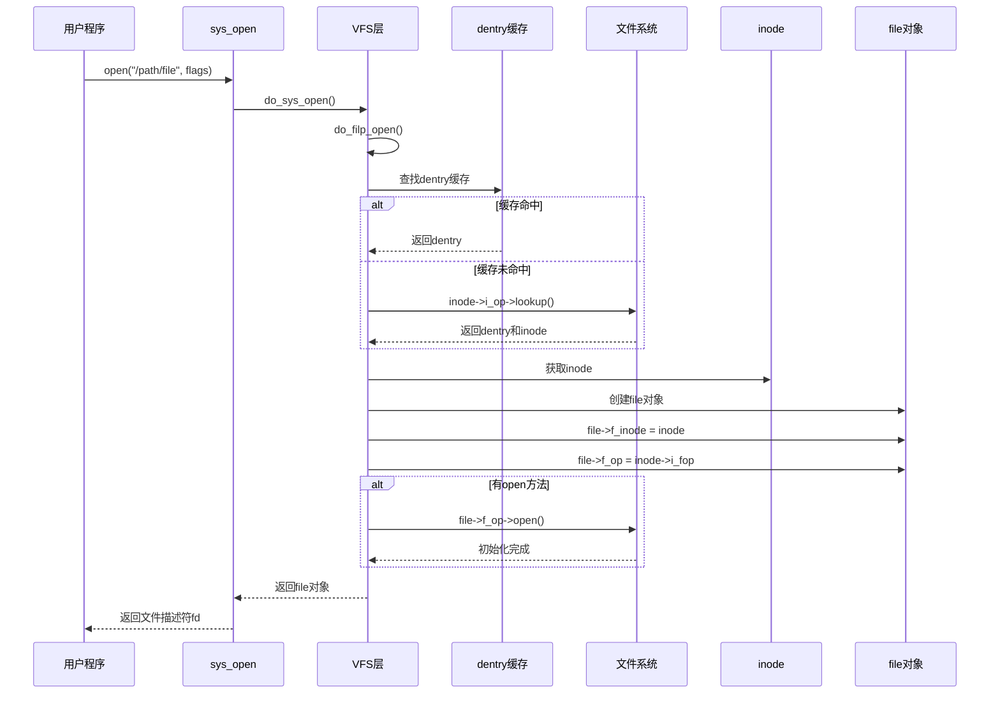
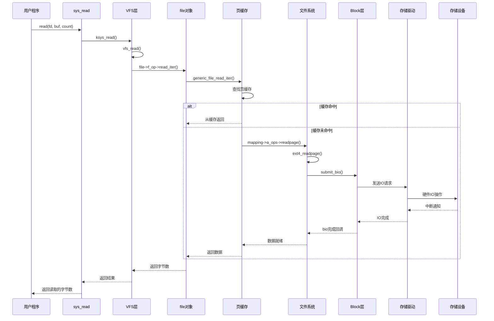
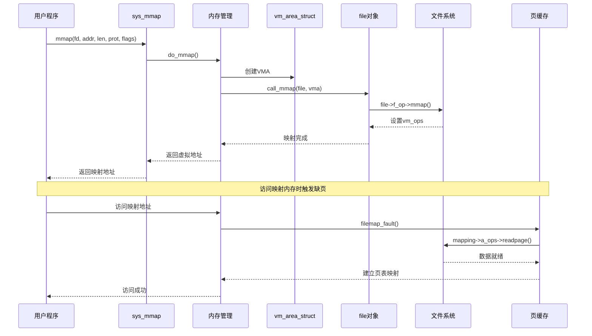

# 文件操作路径总览

## 学习目标

- 理解文件操作的完整路径（从系统调用到存储设备）
- 掌握 open()、read()、write() 的完整流程
- 理解缓冲 IO 与直接 IO 的区别
- 了解 mmap 文件映射的路径

## 概述

文件操作路径是指从用户空间调用文件操作（如 open、read、write）到最终完成存储设备 IO 的完整流程。理解这个路径对于深入理解文件系统至关重要。

---

## 一、open() 完整路径

### 用户空间调用

```c
// 用户程序
int fd = open("/data/file.txt", O_RDONLY);
```

### 系统调用入口

```c
// fs/open.c
SYSCALL_DEFINE3(open, const char __user *, filename, int, flags, umode_t, mode)
{
    if (force_o_largefile())
        flags |= O_LARGEFILE;
    return do_sys_open(AT_FDCWD, filename, flags, mode);
}
```

### do_sys_open() 流程

```c
// fs/open.c
long do_sys_open(int dfd, const char __user *filename, int flags, umode_t mode)
{
    struct open_flags op;
    int fd = build_open_flags(flags, mode, &op);
    struct filename *tmp = getname(filename);
    
    if (IS_ERR(tmp))
        return PTR_ERR(tmp);
    
    fd = get_unused_fd_flags(flags);
    if (fd >= 0) {
        struct file *f = do_filp_open(dfd, tmp, &op);
        if (IS_ERR(f)) {
            put_unused_fd(fd);
            fd = PTR_ERR(f);
        } else {
            fsnotify_open(f);
            fd_install(fd, f);
        }
    }
    putname(tmp);
    return fd;
}
```

### do_filp_open() 流程

```c
// fs/namei.c
struct file *do_filp_open(int dfd, struct filename *pathname,
                          const struct open_flags *op)
{
    struct nameidata nd;
    struct file *filp;
    
    // 1. 路径解析
    filp = path_openat(&nd, op, flags | LOOKUP_RCU);
    if (unlikely(filp == ERR_PTR(-ECHILD)))
        filp = path_openat(&nd, op, flags);
    if (unlikely(filp == ERR_PTR(-ESTALE)))
        filp = path_openat(&nd, op, flags | LOOKUP_REVAL);
    
    return filp;
}
```

### 路径解析（path_lookup）

```c
// fs/namei.c
static struct file *path_openat(struct nameidata *nd,
                                 const struct open_flags *op,
                                 unsigned flags)
{
    struct file *file;
    struct path path;
    
    // 1. 解析路径，获取 dentry 和 inode
    file = get_empty_filp();
    if (IS_ERR(file))
        return file;
    
    // 2. 路径查找
    error = path_init(nd, flags);
    if (unlikely(error))
        goto out;
    
    error = link_path_walk(nd->path.dentry, nd);
    if (unlikely(error))
        goto out;
    
    // 3. 最终组件查找
    error = do_last(nd, file, op);
    
    return file;
}
```

### 创建 file 对象

```c
// fs/namei.c
static int do_last(struct nameidata *nd, struct file *file,
                   const struct open_flags *op)
{
    struct dentry *dentry;
    struct path path;
    int error;
    
    // 1. 获取 dentry
    dentry = lookup_dcache(&nd->last, nd->path.dentry, nd->flags);
    if (dentry == NULL) {
        // 缓存未命中，调用文件系统 lookup
        dentry = nd->path.dentry->d_inode->i_op->lookup(
            nd->path.dentry->d_inode, &nd->last, 0);
    }
    
    // 2. 获取 inode
    path.dentry = dentry;
    path.mnt = nd->path.mnt;
    follow_mount(&path);
    
    // 3. 创建 file 对象
    file->f_path = path;
    file->f_inode = path.dentry->d_inode;
    file->f_op = fops_get(path.dentry->d_inode->i_fop);
    
    // 4. 调用文件系统的 open 方法
    if (file->f_op->open) {
        error = file->f_op->open(path.dentry->d_inode, file);
        if (error)
            goto cleanup_file;
    }
    
    return 0;
}
```

### open() 完整流程图



---

## 二、read() 完整路径

### 用户空间调用

```c
// 用户程序
char buf[1024];
ssize_t n = read(fd, buf, sizeof(buf));
```

### 系统调用入口

```c
// fs/read_write.c
SYSCALL_DEFINE3(read, unsigned int, fd, char __user *, buf, size_t, count)
{
    return ksys_read(fd, buf, count);
}

ssize_t ksys_read(unsigned int fd, char __user *buf, size_t count)
{
    struct fd f = fdget_pos(fd);
    ssize_t ret = -EBADF;
    
    if (f.file) {
        loff_t pos = file_pos_read(f.file);
        ret = vfs_read(f.file, buf, count, &pos);
        if (ret >= 0)
            file_pos_write(f.file, pos);
        fdput_pos(f);
    }
    return ret;
}
```

### vfs_read() 流程

```c
// fs/read_write.c
ssize_t vfs_read(struct file *file, char __user *buf, size_t count, loff_t *pos)
{
    ssize_t ret;
    
    if (!(file->f_mode & FMODE_READ))
        return -EBADF;
    if (!(file->f_mode & FMODE_CAN_READ))
        return -EINVAL;
    if (unlikely(!access_ok(buf, count)))
        return -EFAULT;
    
    ret = rw_verify_area(READ, file, pos, count);
    if (ret)
        return ret;
    
    if (count > 0) {
        ret = __vfs_read(file, buf, count, pos);
        if (ret > 0)
            fsnotify_access(file);
    }
    
    return ret;
}

ssize_t __vfs_read(struct file *file, char __user *buf, size_t count,
                   loff_t *pos)
{
    if (file->f_op->read)
        return file->f_op->read(file, buf, count, pos);
    else if (file->f_op->read_iter)
        return new_sync_read(file, buf, count, pos);
    else
        return -EINVAL;
}
```

### 文件系统 read 实现（ext4 示例）

```c
// fs/ext4/file.c
static ssize_t ext4_file_read_iter(struct kiocb *iocb, struct iov_iter *to)
{
    struct inode *inode = file_inode(iocb->ki_filp);
    
    if (unlikely(ext4_forced_shutdown(EXT4_SB(inode->i_sb))))
        return -EIO;
    
    if (!iov_iter_count(to))
        return 0;
    
    // 调用通用文件读取
    return generic_file_read_iter(iocb, to);
}
```

### 页缓存读取（generic_file_read_iter）

```c
// mm/filemap.c
ssize_t generic_file_read_iter(struct kiocb *iocb, struct iov_iter *iter)
{
    struct file *file = iocb->ki_filp;
    struct address_space *mapping = file->f_mapping;
    struct inode *inode = mapping->host;
    ssize_t retval = 0;
    loff_t *ppos = &iocb->ki_pos;
    
    // 1. 检查直接IO
    if (iocb->ki_flags & IOCB_DIRECT) {
        return generic_file_direct_read(iocb, iter);
    }
    
    // 2. 缓冲读
    for (;;) {
        struct page *page;
        pgoff_t index = *ppos >> PAGE_SHIFT;
        unsigned long offset = *ppos & ~PAGE_MASK;
        
        // 查找页缓存
        page = find_get_page(mapping, index);
        if (!page) {
            // 缓存未命中，读取页
            page = __page_cache_alloc(gfp_mask);
            if (!page)
                break;
            error = add_to_page_cache_lru(page, mapping, index, gfp_mask);
            if (unlikely(error)) {
                put_page(page);
                if (error == -EEXIST) {
                    error = 0;
                    continue;
                }
                break;
            }
            error = mapping->a_ops->readpage(file, page);
            if (error) {
                put_page(page);
                break;
            }
        }
        
        // 从页缓存复制到用户空间
        ret = copy_page_to_iter(page, offset, nr, iter);
        put_page(page);
        
        *ppos += ret;
        retval += ret;
        if (!iov_iter_count(iter))
            break;
    }
    
    return retval;
}
```

### 文件系统 readpage（ext4 示例）

```c
// fs/ext4/inode.c
static int ext4_readpage(struct file *file, struct page *page)
{
    return mpage_readpage(page, ext4_get_block);
}

// fs/mpage.c
int mpage_readpage(struct page *page, get_block_t get_block)
{
    struct bio *bio = NULL;
    sector_t last_block_in_bio = 0;
    struct buffer_head map_bh;
    unsigned int first_block;
    
    // 1. 计算块号
    first_block = (page->index << (PAGE_SHIFT - inode->i_blkbits));
    
    // 2. 创建 bio
    bio = bio_alloc(GFP_KERNEL, 1);
    bio->bi_iter.bi_sector = first_block * (PAGE_SIZE >> 9);
    bio->bi_bdev = inode->i_sb->s_bdev;
    bio_add_page(bio, page, PAGE_SIZE, 0);
    
    // 3. 提交到 Block 层
    submit_bio(REQ_OP_READ, bio);
    
    return 0;
}
```

### read() 完整流程图



---

## 三、write() 完整路径

### 用户空间调用

```c
// 用户程序
const char *data = "Hello, World!";
ssize_t n = write(fd, data, strlen(data));
```

### 系统调用入口

```c
// fs/read_write.c
SYSCALL_DEFINE3(write, unsigned int, fd, const char __user *, buf, size_t, count)
{
    return ksys_write(fd, buf, count);
}

ssize_t ksys_write(unsigned int fd, const char __user *buf, size_t count)
{
    struct fd f = fdget_pos(fd);
    ssize_t ret = -EBADF;
    
    if (f.file) {
        loff_t pos = file_pos_read(f.file);
        ret = vfs_write(f.file, buf, count, &pos);
        if (ret >= 0)
            file_pos_write(f.file, pos);
        fdput_pos(f);
    }
    return ret;
}
```

### vfs_write() 流程

```c
// fs/read_write.c
ssize_t vfs_write(struct file *file, const char __user *buf, size_t count, loff_t *pos)
{
    ssize_t ret;
    
    if (!(file->f_mode & FMODE_WRITE))
        return -EBADF;
    if (!(file->f_mode & FMODE_CAN_WRITE))
        return -EINVAL;
    if (unlikely(!access_ok(buf, count)))
        return -EFAULT;
    
    ret = rw_verify_area(WRITE, file, pos, count);
    if (ret)
        return ret;
    
    if (count > 0) {
        ret = __vfs_write(file, buf, count, pos);
        if (ret > 0) {
            fsnotify_modify(file);
            add_wchar(current, ret);
        }
    }
    
    return ret;
}
```

### 页缓存写入（generic_file_write_iter）

```c
// mm/filemap.c
ssize_t generic_file_write_iter(struct kiocb *iocb, struct iov_iter *from)
{
    struct file *file = iocb->ki_filp;
    struct address_space *mapping = file->f_mapping;
    struct inode *inode = mapping->host;
    ssize_t ret;
    
    // 1. 检查直接IO
    if (iocb->ki_flags & IOCB_DIRECT) {
        return generic_file_direct_write(iocb, from);
    }
    
    // 2. 缓冲写
    ret = generic_perform_write(file, from, iocb->ki_pos);
    if (ret > 0) {
        iocb->ki_pos += ret;
        write_len += ret;
    }
    
    // 3. 同步写入（如果需要）
    if (file->f_flags & O_SYNC || file->f_flags & O_DSYNC) {
        ret = generic_write_sync(iocb, ret);
    }
    
    return ret;
}
```

### 脏页回写

```c
// mm/page-writeback.c
int write_cache_pages(struct address_space *mapping,
                      struct writeback_control *wbc,
                      writepage_t writepage, void *data)
{
    // 遍历脏页
    while (!done && (index <= end)) {
        // 查找脏页
        page = find_get_entry(mapping, index);
        if (PageDirty(page)) {
            // 调用文件系统的 writepage
            ret = (*writepage)(page, wbc, data);
            if (unlikely(ret)) {
                if (ret == AOP_WRITEPAGE_ACTIVATE) {
                    unlock_page(page);
                } else {
                    done = 1;
                    break;
                }
            }
        }
        index++;
    }
}
```

---

## 四、缓冲 IO vs 直接 IO

### 缓冲 IO（Buffered IO）

**特点**：
- 数据经过页缓存
- 读写操作在内存中完成
- 异步回写到磁盘

**流程**：
```
用户空间
    │
    ▼
系统调用 read/write
    │
    ▼
VFS 层
    │
    ▼
页缓存（Page Cache）
    │
    ├─ 缓存命中：直接返回
    └─ 缓存未命中：从磁盘读取
    │
    ▼
文件系统层
    │
    ▼
Block 层 → 存储设备
```

### 直接 IO（Direct IO, O_DIRECT）

**特点**：
- 绕过页缓存
- 直接从用户空间到存储设备
- 需要用户空间缓冲区对齐

**流程**：
```
用户空间（对齐的缓冲区）
    │
    ▼
系统调用 read/write (O_DIRECT)
    │
    ▼
VFS 层
    │
    ▼
文件系统层（直接IO路径）
    │
    ▼
Block 层 → 存储设备
```

**使用场景**：
- 数据库系统（自己管理缓存）
- 大文件传输（避免占用页缓存）
- 实时应用（减少延迟）

```c
// 直接IO示例
int fd = open("/data/file", O_RDONLY | O_DIRECT);
char *buf = aligned_alloc(512, 4096);  // 必须对齐
read(fd, buf, 4096);
```

---

## 五、mmap 文件映射路径

### 用户空间调用

```c
// 用户程序
void *addr = mmap(NULL, size, PROT_READ | PROT_WRITE,
                   MAP_SHARED, fd, 0);
```

### 系统调用入口

```c
// arch/arm64/kernel/sys.c
SYSCALL_DEFINE6(mmap, unsigned long, addr, unsigned long, len,
                unsigned long, prot, unsigned long, flags,
                unsigned long, fd, unsigned long, off)
{
    return ksys_mmap_pgoff(addr, len, prot, flags, fd, off >> PAGE_SHIFT);
}
```

### do_mmap() 流程

```c
// mm/mmap.c
unsigned long do_mmap(struct file *file, unsigned long addr,
                      unsigned long len, unsigned long prot,
                      unsigned long flags, unsigned long pgoff,
                      unsigned long *populate, struct list_head *uf)
{
    struct mm_struct *mm = current->mm;
    struct vm_area_struct *vma;
    
    // 1. 参数检查
    len = PAGE_ALIGN(len);
    if (!len)
        return -EINVAL;
    
    // 2. 查找映射区域
    addr = get_unmapped_area(file, addr, len, pgoff, flags);
    
    // 3. 创建 VMA
    vma = vm_area_alloc(mm);
    vma->vm_start = addr;
    vma->vm_end = addr + len;
    vma->vm_flags = flags;
    vma->vm_file = get_file(file);
    
    // 4. 调用文件系统的 mmap
    if (file) {
        vma->vm_ops = &generic_file_vm_ops;
        error = call_mmap(file, vma);
    }
    
    // 5. 插入 VMA
    vma_set_page_prot(vma);
    insert_vm_struct(mm, vma);
    
    return addr;
}
```

### 文件系统 mmap（ext4 示例）

```c
// fs/ext4/file.c
static int ext4_file_mmap(struct file *file, struct vm_area_struct *vma)
{
    if (unlikely(ext4_forced_shutdown(EXT4_SB(file_inode(file)->i_sb))))
        return -EIO;
    
    // 使用通用文件映射
    file_accessed(file);
    vma->vm_ops = &ext4_file_vm_ops;
    return 0;
}
```

### 缺页处理

```c
// mm/filemap.c
vm_fault_t filemap_fault(struct vm_fault *vmf)
{
    struct address_space *mapping = vmf->vma->vm_file->f_mapping;
    struct file *file = vmf->vma->vm_file;
    struct page *page;
    pgoff_t offset = vmf->pgoff;
    
    // 1. 查找页缓存
    page = find_get_page(mapping, offset);
    if (likely(page)) {
        // 缓存命中
        vmf->page = page;
        return 0;
    }
    
    // 2. 缓存未命中，读取页
    page = __page_cache_alloc(gfp_mask);
    error = add_to_page_cache_lru(page, mapping, offset, gfp_mask);
    error = mapping->a_ops->readpage(file, page);
    
    vmf->page = page;
    return 0;
}
```

### mmap 完整流程图



---

## 六、同步 IO（fsync, sync）

### fsync() 系统调用

```c
// fs/sync.c
SYSCALL_DEFINE1(fsync, unsigned int, fd)
{
    return do_fsync(fd, 0);
}

int do_fsync(unsigned int fd, int datasync)
{
    struct fd f = fdget(fd);
    int ret = -EBADF;
    
    if (f.file) {
        ret = vfs_fsync(f.file, datasync);
        fdput(f);
    }
    return ret;
}
```

### vfs_fsync() 流程

```c
// fs/sync.c
int vfs_fsync(struct file *file, int datasync)
{
    if (!file->f_op->fsync)
        return -EINVAL;
    
    return file->f_op->fsync(file, 0, LLONG_MAX, datasync);
}
```

### 文件系统 fsync（ext4 示例）

```c
// fs/ext4/file.c
static int ext4_sync_file(struct file *file, loff_t start, loff_t end, int datasync)
{
    struct inode *inode = file->f_mapping->host;
    int ret;
    
    // 1. 回写脏页
    ret = file_write_and_wait_range(file, start, end);
    
    // 2. 同步文件系统元数据
    ret = sync_mapping_buffers(inode->i_mapping);
    
    // 3. 提交日志（ext4 journal）
    ret = jbd2_complete_transaction(handle, inode);
    
    return ret;
}
```

---

## 总结

### 核心要点

1. **open() 路径**：
   - 系统调用 → VFS → 路径解析 → 创建 file 对象
   - 关键：dentry 缓存加速路径解析

2. **read() 路径**：
   - 系统调用 → VFS → 页缓存 → 文件系统 → Block 层
   - 关键：页缓存减少磁盘访问

3. **write() 路径**：
   - 系统调用 → VFS → 页缓存（脏页）→ 异步回写
   - 关键：延迟写入提高性能

4. **mmap() 路径**：
   - 系统调用 → 内存管理 → 文件系统 → 缺页时读取
   - 关键：零拷贝访问文件数据

5. **缓冲 IO vs 直接 IO**：
   - 缓冲 IO：经过页缓存，性能好但占用内存
   - 直接 IO：绕过页缓存，适合大文件或自管理缓存

### 后续学习

- [VFS设计理念与统一接口](04-VFS设计理念与统一接口.md) - 深入理解 VFS 抽象层
- [页缓存机制详解](08-页缓存机制详解.md) - 深入理解页缓存

## 参考资源

- 内核源码：
  - `fs/open.c` - 文件打开
  - `fs/read_write.c` - 文件读写
  - `mm/filemap.c` - 页缓存
  - `mm/mmap.c` - 内存映射

## 更新记录

- 2026-01-28：初始创建，包含文件操作路径总览
