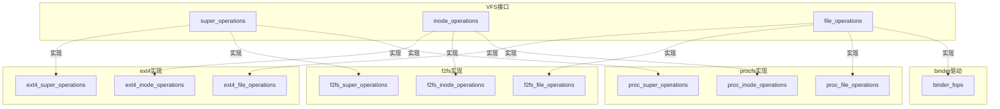
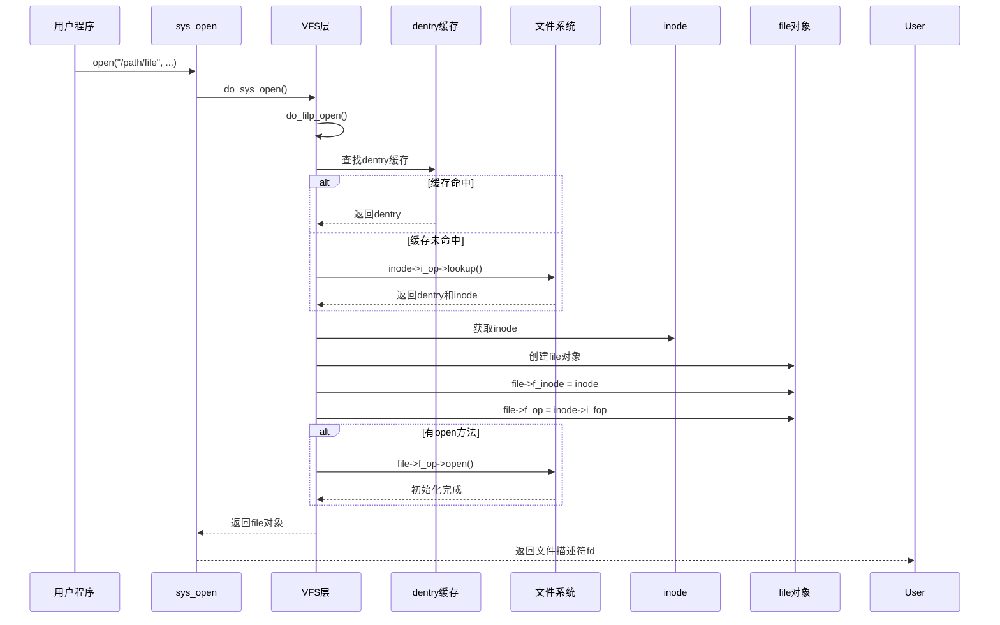

# VFS 设计理念与统一接口

## 学习目标

- 理解 VFS（虚拟文件系统）的设计目标和解决的问题
- 掌握 VFS 的四个核心设计目标：统一接口、多态分发、抽象差异、性能优化
- 了解 VFS 在 Linux 内核中的位置和作用
- 理解 VFS 与具体文件系统的关系
- 掌握文件系统注册机制

## 概述

VFS（Virtual File System，虚拟文件系统）是 Linux 内核中的一个抽象层，它为所有文件系统提供统一的接口，屏蔽不同文件系统的实现细节，实现多态分发机制。

---

## 一、为什么需要 VFS

### 文件系统多样性

在 Linux 系统中，存在多种不同类型的文件系统：

1. **磁盘文件系统**：ext4、xfs、btrfs、f2fs 等，用于存储持久化数据
2. **网络文件系统**：NFS、CIFS 等，通过网络访问远程文件
3. **虚拟文件系统**：procfs、sysfs、debugfs 等，提供系统信息接口
4. **设备文件**：字符设备、块设备，用于访问硬件设备

### 没有 VFS 的问题

如果没有 VFS，每个文件系统都需要提供自己的系统调用实现，导致：

- **接口不统一**：不同文件系统有不同的操作方式
- **代码重复**：每个文件系统都要实现路径解析、权限检查等
- **难以扩展**：添加新文件系统需要修改大量内核代码
- **用户体验差**：用户需要了解不同文件系统的差异

### VFS 的解决方案

VFS（Virtual File System，虚拟文件系统）是 Linux 内核中的一个软件层，它：

- **提供统一接口**：为所有文件系统提供统一的系统调用接口
- **抽象文件系统差异**：屏蔽不同文件系统的实现细节
- **实现多态分发**：根据文件类型自动选择正确的操作函数
- **简化开发**：新文件系统只需实现 VFS 定义的接口

---

## 二、VFS 的设计目标

### 1. 统一接口（Unified Interface）

**目标**：为所有文件系统提供相同的系统调用接口

**实现**：
- 所有文件操作都通过相同的系统调用（open、read、write 等）
- 用户程序无需知道底层文件系统类型
- 可以在不同文件系统间无缝切换

**示例**：
```c
// 用户程序无需知道是 ext4 还是 f2fs
int fd = open("/data/file.txt", O_RDONLY);
read(fd, buf, size);
close(fd);
```

### 2. 多态分发（Polymorphic Dispatch）

**目标**：根据文件类型自动选择正确的操作函数

**实现**：
- 通过 `file_operations` 结构体实现多态
- 每个文件系统/设备驱动提供自己的操作函数
- VFS 根据文件类型调用对应的函数

**示例**：
```c
// binder 设备提供自己的 file_operations
const struct file_operations binder_fops = {
    .open = binder_open,
    .mmap = binder_mmap,
    .ioctl = binder_ioctl,
};

// 普通文件系统提供自己的 file_operations
const struct file_operations ext4_file_operations = {
    .open = ext4_file_open,
    .read_iter = ext4_file_read_iter,
    .write_iter = ext4_file_write_iter,
};
```

### 3. 抽象文件系统差异（Abstraction）

**目标**：屏蔽不同文件系统的实现细节

**实现**：
- 定义统一的接口（super_operations、inode_operations、file_operations）
- 每个文件系统实现这些接口
- VFS 通过接口调用，不关心具体实现

### 4. 性能优化（Performance）

**目标**：提供高效的路径解析和文件操作

**实现**：
- **dentry 缓存**：缓存目录项，加速路径解析
- **inode 缓存**：缓存文件元数据，减少磁盘访问
- **统一的缓存管理**：所有文件系统共享缓存机制

---

## 三、VFS 在 Linux 内核中的位置

### 架构层次

VFS 位于用户空间和具体文件系统之间：

```
┌─────────────────────────────────────┐
│        用户空间（User Space）        │
│  ┌───────────────────────────────┐  │
│  │  应用程序（open, read, write） │  │
│  └───────────────┬───────────────┘  │
└──────────────────┼──────────────────┘
                   │ 系统调用
┌──────────────────┼──────────────────┐
│      内核空间（Kernel Space）        │
│  ┌───────────────▼───────────────┐  │
│  │  系统调用入口（sys_open等）    │  │
│  └───────────────┬───────────────┘  │
│  ┌───────────────▼───────────────┐  │
│  │      VFS 层（统一接口）        │  │
│  │  - 路径解析（path_lookup）     │  │
│  │  - 对象管理（inode, dentry）  │  │
│  │  - 操作分发（file_operations）│  │
│  └───────────────┬───────────────┘  │
│  ┌───────────────▼───────────────┐  │
│  │   具体文件系统实现            │  │
│  │  - ext4, f2fs, erofs         │  │
│  │  - procfs, sysfs            │  │
│  │  - 设备驱动（binder等）      │  │
│  └───────────────────────────────┘  │
└─────────────────────────────────────┘
```

### VFS 的抽象层次

VFS 通过多个抽象层次实现文件系统抽象：

#### 1. 文件系统类型层（File System Type）

**作用**：定义文件系统类型和挂载操作

**关键结构**：
```c
struct file_system_type {
    const char *name;           // 文件系统名称（如 "ext4"）
    int fs_flags;               // 文件系统标志
    struct dentry *(*mount)(...); // 挂载函数
    void (*kill_sb)(struct super_block *); // 卸载函数
    struct module *owner;       // 模块所有者
    // ...
};
```

#### 2. Superblock 层（文件系统实例）

**作用**：表示一个已挂载的文件系统实例

**关键结构**：
```c
struct super_block {
    struct list_head s_list;           // 超级块链表
    dev_t s_dev;                      // 设备号
    struct super_operations *s_op;    // 超级块操作
    struct dentry *s_root;            // 根目录
    // ...
};
```

#### 3. Inode 层（文件元数据）

**作用**：表示文件或目录的元数据

**关键结构**：
```c
struct inode {
    umode_t i_mode;                   // 文件类型和权限
    struct inode_operations *i_op;     // inode操作
    struct file_operations *i_fop;   // 文件操作（用于设备文件）
    // ...
};
```

#### 4. Dentry 层（目录项缓存）

**作用**：缓存路径名到 inode 的映射

**关键结构**：
```c
struct dentry {
    struct qstr d_name;                // 文件名
    struct inode *d_inode;            // 关联的inode
    struct dentry *d_parent;          // 父目录
    // ...
};
```

#### 5. File 层（打开的文件）

**作用**：表示一个打开的文件描述符

**关键结构**：
```c
struct file {
    struct path f_path;                // 文件路径
    struct inode *f_inode;            // 关联的inode
    const struct file_operations *f_op; // 文件操作函数表
    loff_t f_pos;                     // 文件位置
    // ...
};
```

---

## 四、VFS 与具体文件系统的关系

### 接口定义与实现

VFS 定义了统一的接口，具体文件系统实现这些接口：



### 接口实现示例

#### ext4 文件系统

```c
// fs/ext4/super.c
static const struct super_operations ext4_sops = {
    .alloc_inode    = ext4_alloc_inode,
    .free_inode     = ext4_free_inode,
    .dirty_inode    = ext4_dirty_inode,
    .write_inode    = ext4_write_inode,
    .drop_inode     = ext4_drop_inode,
    .evict_inode    = ext4_evict_inode,
    .put_super      = ext4_put_super,
    .sync_fs        = ext4_sync_fs,
    .statfs         = ext4_statfs,
    .remount_fs     = ext4_remount,
    .show_options   = ext4_show_options,
};

// fs/ext4/namei.c
const struct inode_operations ext4_dir_inode_operations = {
    .create     = ext4_create,
    .lookup     = ext4_lookup,
    .link       = ext4_link,
    .unlink     = ext4_unlink,
    .symlink    = ext4_symlink,
    .mkdir      = ext4_mkdir,
    .rmdir      = ext4_rmdir,
    .mknod      = ext4_mknod,
    .rename     = ext4_rename2,
    .setattr    = ext4_setattr,
    .getattr    = ext4_getattr,
};

// fs/ext4/file.c
const struct file_operations ext4_file_operations = {
    .llseek     = ext4_llseek,
    .read_iter  = ext4_file_read_iter,
    .write_iter = ext4_file_write_iter,
    .unlocked_ioctl = ext4_ioctl,
    .mmap       = ext4_file_mmap,
    .open       = ext4_file_open,
    .release    = ext4_release_file,
    .fsync      = ext4_sync_file,
    .fallocate  = ext4_fallocate,
};
```

---

## 五、文件系统注册机制

### register_filesystem()

**作用**：注册文件系统类型到内核

```c
// fs/filesystems.c
int register_filesystem(struct file_system_type *fs)
{
    int res = 0;
    struct file_system_type **p;
    
    BUG_ON(strchr(fs->name, '.'));
    if (fs->next)
        return -EBUSY;
    
    write_lock(&file_systems_lock);
    p = find_filesystem(fs->name, strlen(fs->name));
    if (*p)
        res = -EBUSY;
    else
        *p = fs;
    write_unlock(&file_systems_lock);
    
    return res;
}
```

### 文件系统注册示例

#### ext4 注册

```c
// fs/ext4/super.c
static struct file_system_type ext4_fs_type = {
    .owner      = THIS_MODULE,
    .name       = "ext4",
    .mount      = ext4_mount,
    .kill_sb    = kill_block_super,
    .fs_flags   = FS_REQUIRES_DEV,
};
MODULE_ALIAS_FS("ext4");

static int __init init_ext4_fs(void)
{
    int err;
    
    err = init_ext4_mballoc();
    if (err)
        return err;
    
    err = init_ext4_xattr();
    if (err)
        goto out2;
    
    err = register_filesystem(&ext4_fs_type);
    if (err)
        goto out;
    
    return 0;
}
```

#### f2fs 注册

```c
// fs/f2fs/super.c
static struct file_system_type f2fs_fs_type = {
    .owner      = THIS_MODULE,
    .name       = "f2fs",
    .mount      = f2fs_mount,
    .kill_sb    = kill_f2fs_super,
    .fs_flags   = FS_REQUIRES_DEV | FS_HAS_SUBTYPE,
};
MODULE_ALIAS_FS("f2fs");
```

### 查看已注册的文件系统

```bash
# 查看内核支持的文件系统
cat /proc/filesystems

# 输出示例
nodev   sysfs
nodev   tmpfs
nodev   bdev
nodev   proc
nodev   cgroup
nodev   cgroup2
        ext4
        f2fs
        erofs
        vfat
```

---

## 六、VFS 的关键特性

### 1. 多态分发机制

**不是 Hook，而是多态**：

很多人误以为 `file_operations` 是 hook 机制，实际上这是**面向对象的多态**：

- **统一接口**：所有文件系统都实现相同的 `file_operations` 接口
- **不同实现**：每个文件系统提供自己的实现函数
- **运行时分发**：VFS 根据文件类型在运行时选择正确的实现

**类比**：
```c
// 类似于面向对象的多态
interface FileOperations {
    int open();
    int read();
    int write();
}

class Ext4File implements FileOperations {
    int open() { /* ext4实现 */ }
}

class BinderFile implements FileOperations {
    int open() { /* binder实现 */ }
}
```

### 2. 统一的缓存机制

**dentry 缓存**：
- 缓存路径名到 inode 的映射
- 加速路径解析
- 所有文件系统共享

**inode 缓存**：
- 缓存文件元数据
- 减少磁盘访问
- 提高性能

### 3. 透明的文件系统切换

用户程序无需修改代码，就可以在不同文件系统间切换：

```c
// 同样的代码可以访问不同文件系统
int fd1 = open("/data/file.txt", O_RDONLY);  // ext4
int fd2 = open("/proc/version", O_RDONLY);    // procfs
int fd3 = open("/dev/binder", O_RDWR);        // 设备文件
```

---

## 七、VFS 系统调用流程

以 `open()` 系统调用为例，展示完整的 VFS 流程：



---

## 八、VFS 在 Android 中的应用

在 Android 系统中，VFS 发挥着关键作用：

### 1. 设备文件访问

- `/dev/binder` - Binder IPC 驱动
- `/dev/ashmem` - 匿名共享内存
- `/dev/ion` - ION 内存管理

### 2. 虚拟文件系统

- `/proc` - 进程信息
- `/sys` - 系统信息
- `/dev` - 设备文件

### 3. 存储文件系统

- `/data` - ext4 或 f2fs 文件系统
- `/system` - erofs 只读文件系统
- `/cache` - ext4 或 f2fs 文件系统

### 理解 Binder 的 VFS 集成

当 Android 应用打开 `/dev/binder` 时：

1. **系统调用**：`open("/dev/binder", ...)`
2. **VFS 路径解析**：解析路径，找到设备文件的 inode
3. **获取 file_operations**：从 inode 获取 `binder_fops`
4. **创建 file 对象**：设置 `file->f_op = binder_fops`
5. **调用驱动函数**：`binder_fops->open()` → `binder_open()`

这**不是 hook**，而是 VFS 的正常多态分发机制。

---

## 总结

### 核心要点

1. **VFS 是统一接口层**：为所有文件系统提供统一的系统调用接口
2. **VFS 实现多态分发**：通过 `file_operations` 实现运行时多态
3. **VFS 抽象文件系统差异**：屏蔽不同文件系统的实现细节
4. **VFS 提供性能优化**：通过缓存机制提高访问性能

### 关键概念

- **VFS（虚拟文件系统）**：内核中的文件系统抽象层
- **file_operations**：文件操作函数表，实现多态分发
- **inode**：文件元数据对象
- **dentry**：目录项缓存对象
- **file**：打开的文件对象
- **superblock**：文件系统实例对象

### 后续学习

- [VFS核心对象详解](05-VFS核心对象详解.md) - 深入理解 superblock、inode、dentry、file 四个核心对象
- [file_operations多态机制](06-file_operations多态机制.md) - 理解多态分发机制
- [路径解析与挂载机制](07-路径解析与挂载机制.md) - 理解路径解析和挂载

## 参考资源

- 内核文档：`Documentation/filesystems/vfs.rst`
- 内核源码：
  - `include/linux/fs.h` - VFS 核心定义
  - `fs/namei.c` - 路径解析
  - `fs/filesystems.c` - 文件系统注册

## 更新记录

- 2026-01-28：初始创建，整合原 VFS 概述内容，包含 VFS 设计理念与统一接口
