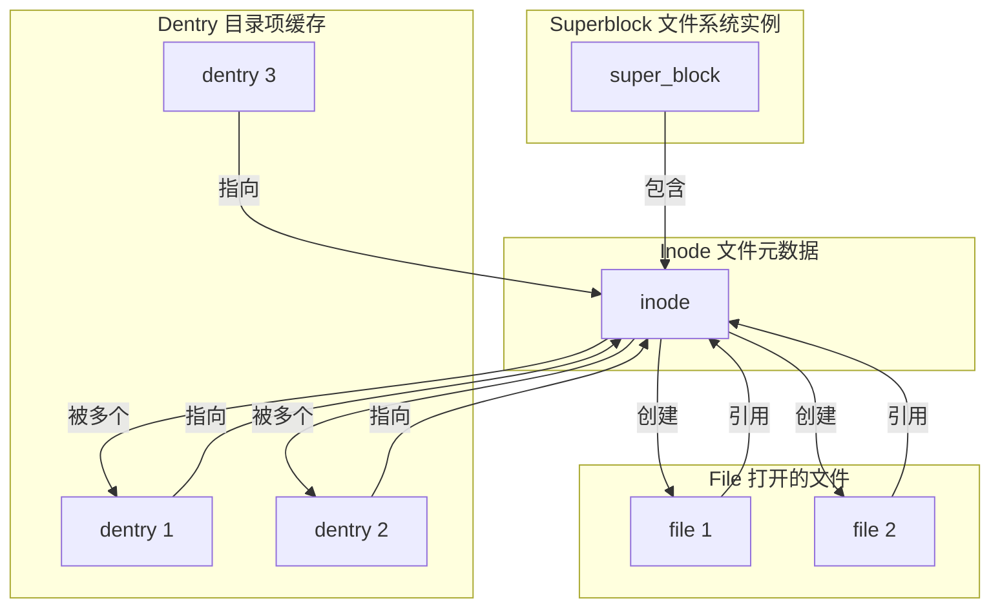
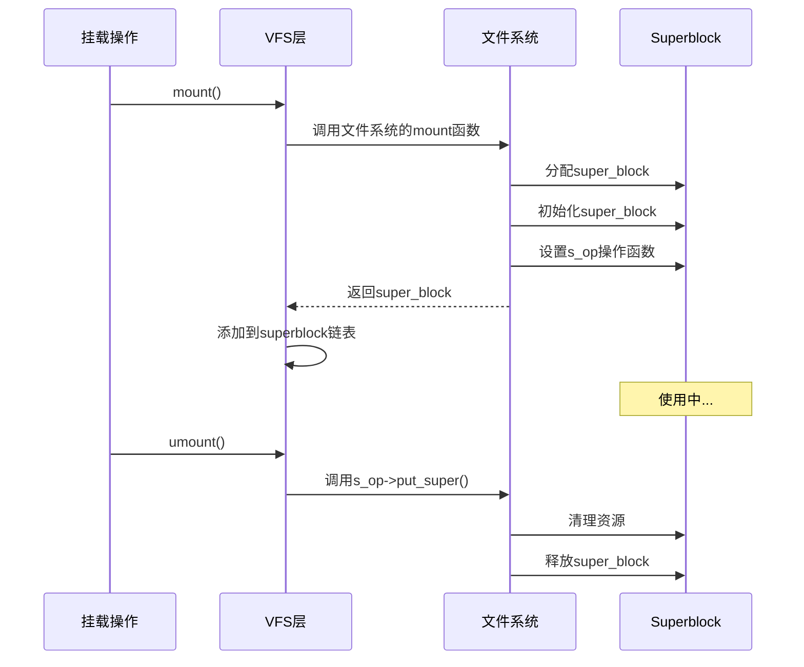
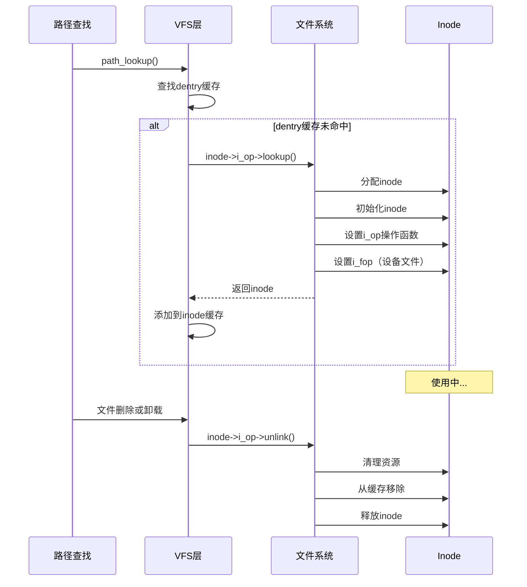
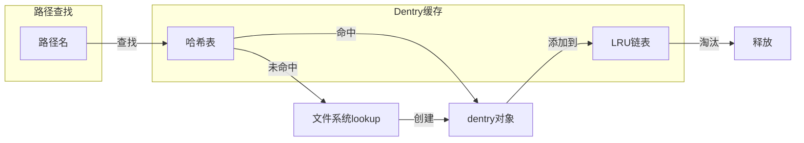
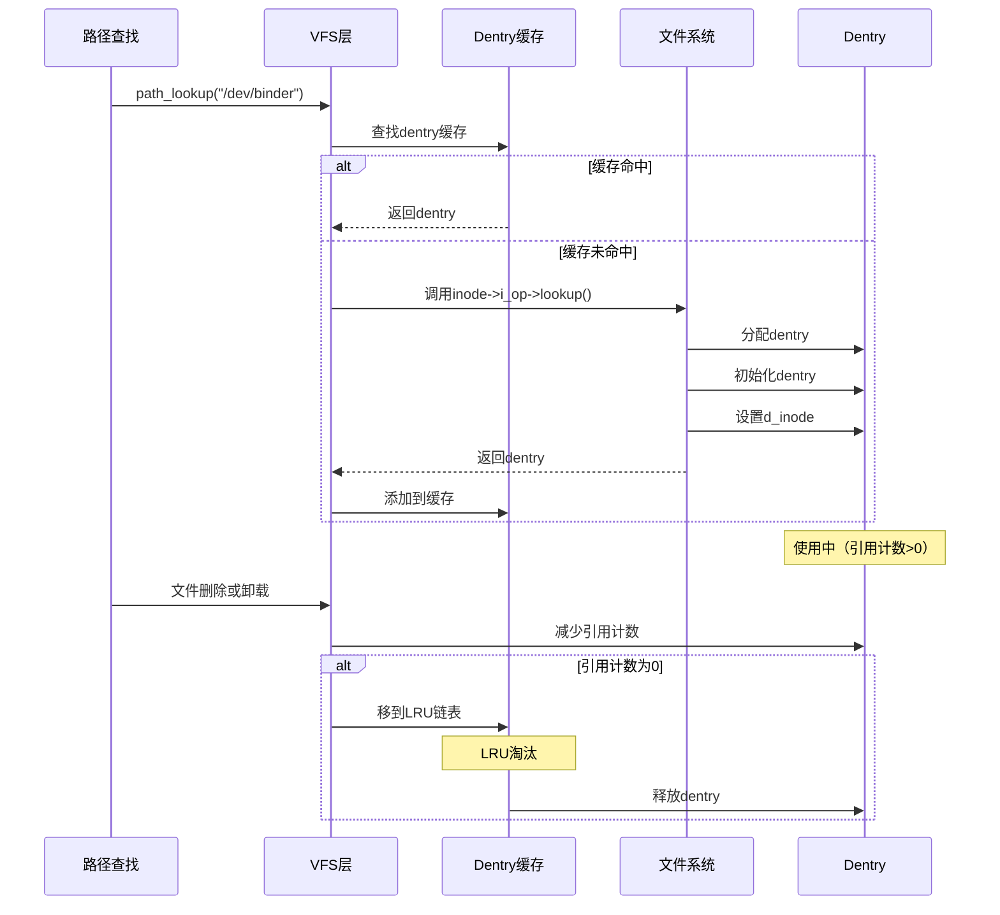
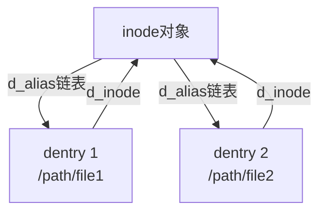
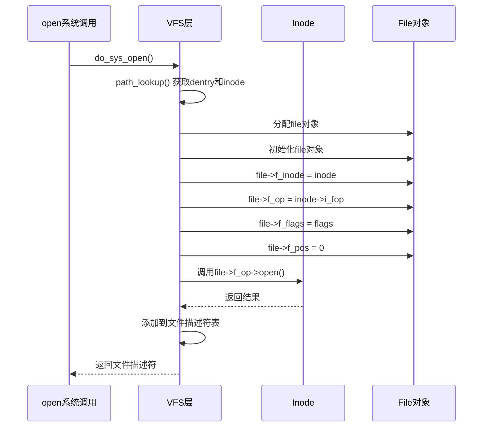
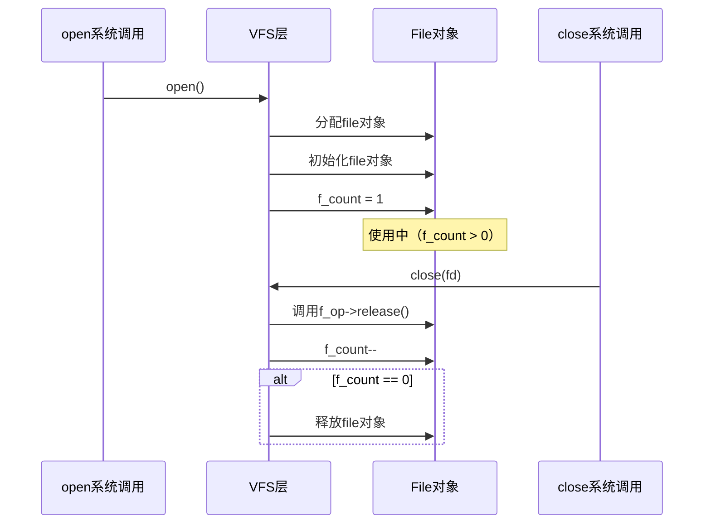
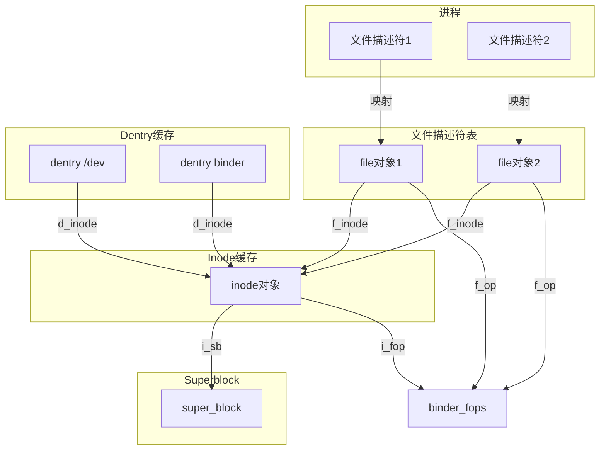

# VFS 核心对象详解

## 学习目标

- 深入理解 VFS 的四个核心对象：superblock、inode、dentry、file
- 掌握每个对象的作用、生命周期和关系
- 理解对象如何与具体文件系统交互
- 了解源码中的关键结构体定义

## 概述

VFS 通过四个核心对象来抽象和管理文件系统：**superblock**、**inode**、**dentry** 和 **file**。理解这些对象是深入理解 VFS 机制的基础。

---

## 一、对象关系总览

### 对象关系图



### 对象层次关系

```
superblock (文件系统实例)
    ↓ 包含
inode (文件元数据)
    ↑ 被多个
dentry (目录项，路径名到inode的映射)
    ↓ 打开时创建
file (打开的文件描述符)
```

---

## 二、Superblock 对象

### 定义和作用

**Superblock（超级块）** 表示一个已挂载的文件系统实例。每个挂载点对应一个 superblock 对象。

### 关键结构体

**位置**：`include/linux/fs.h`

```c
struct super_block {
    struct list_head        s_list;           // 超级块链表
    dev_t                  s_dev;             // 设备号
    unsigned char          s_blocksize_bits;  // 块大小（位）
    unsigned long          s_blocksize;       // 块大小（字节）
    loff_t                 s_maxbytes;        // 最大文件大小
    struct file_system_type *s_type;          // 文件系统类型
    const struct super_operations *s_op;      // 超级块操作
    const struct dquot_operations *dq_op;     // 配额操作
    const struct quotactl_ops *s_qcop;       // 配额控制操作
    const struct export_operations *s_export_op; // 导出操作
    unsigned long          s_flags;          // 挂载标志
    unsigned long          s_iflags;         // 内部标志
    unsigned long          s_magic;         // 文件系统魔数
    struct dentry          *s_root;          // 根目录
    struct rw_semaphore    s_umount;         // 卸载信号量
    int                    s_count;          // 引用计数
    atomic_t               s_active;         // 活动引用计数
    void                   *s_fs_info;       // 文件系统私有数据
    // ... 更多字段
};
```

### 关键字段说明

#### 1. s_list
- **类型**：`struct list_head`
- **作用**：将 superblock 链接到全局 superblock 链表
- **用途**：内核管理所有已挂载的文件系统

#### 2. s_dev
- **类型**：`dev_t`
- **作用**：标识文件系统所在的设备
- **用途**：区分不同的存储设备

#### 3. s_type
- **类型**：`struct file_system_type *`
- **作用**：指向文件系统类型（如 ext4、f2fs）
- **用途**：确定文件系统的操作函数

#### 4. s_op
- **类型**：`const struct super_operations *`
- **作用**：文件系统提供的超级块操作函数
- **用途**：inode 分配、销毁、同步等操作

#### 5. s_root
- **类型**：`struct dentry *`
- **作用**：指向文件系统的根目录 dentry
- **用途**：文件系统挂载点

### Superblock 操作

**位置**：`include/linux/fs.h`

```c
struct super_operations {
    struct inode *(*alloc_inode)(struct super_block *sb);
    void (*destroy_inode)(struct inode *);
    void (*dirty_inode)(struct inode *, int flags);
    int (*write_inode)(struct inode *, struct writeback_control *wbc);
    int (*drop_inode)(struct inode *);
    void (*evict_inode)(struct inode *);
    void (*put_super)(struct super_block *);
    int (*sync_fs)(struct super_block *sb, int wait);
    int (*freeze_super)(struct super_block *sb);
    int (*freeze_fs)(struct super_block *);
    int (*thaw_super)(struct super_block *sb);
    int (*unfreeze_fs)(struct super_block *);
    int (*statfs)(struct dentry *, struct kstatfs *);
    int (*remount_fs)(struct super_block *, int *, char *);
    void (*umount_begin)(struct super_block *);
    // ... 更多操作
};
```

### Superblock 生命周期



---

## 三、Inode 对象

### 定义和作用

**Inode（索引节点）** 表示文件或目录的元数据。每个文件或目录在内核中都有一个对应的 inode 对象。

### 关键结构体

**位置**：`include/linux/fs.h`

```c
struct inode {
    umode_t                     i_mode;         // 文件类型和权限
    unsigned short              i_opflags;      // 操作标志
    kuid_t                      i_uid;          // 用户ID
    kgid_t                      i_gid;          // 组ID
    unsigned int                i_flags;        // 文件标志
    
    const struct inode_operations *i_op;         // inode操作
    struct super_block          *i_sb;          // 所属superblock
    struct address_space        *i_mapping;     // 地址空间
    
    unsigned long               i_ino;          // inode号
    dev_t                       i_rdev;         // 设备号（设备文件）
    loff_t                      i_size;         // 文件大小
    struct timespec64           i_atime;        // 访问时间
    struct timespec64           i_mtime;        // 修改时间
    struct timespec64           i_ctime;        // 状态改变时间
    
    spinlock_t                  i_lock;         // inode锁
    unsigned short              i_bytes;        // 文件尾字节数
    u8                          i_blkbits;      // 块大小（位）
    blkcnt_t                    i_blocks;       // 块数
    
    union {
        const struct file_operations *i_fop;    // 文件操作（设备文件）
        void (*free_inode)(struct inode *);
    };
    
    struct list_head            i_sb_list;      // superblock链表
    struct list_head            i_lru;          // LRU链表
    struct hlist_node           i_hash;         // 哈希表节点
    // ... 更多字段
};
```

### 关键字段说明

#### 1. i_mode
- **类型**：`umode_t`
- **作用**：文件类型和权限
- **包含**：
  - 文件类型（普通文件、目录、设备文件等）
  - 权限位（rwxrwxrwx）

#### 2. i_ino
- **类型**：`unsigned long`
- **作用**：inode 号，文件系统内唯一标识
- **用途**：区分不同的文件

#### 3. i_sb
- **类型**：`struct super_block *`
- **作用**：指向所属的 superblock
- **用途**：确定文件系统类型和操作

#### 4. i_op
- **类型**：`const struct inode_operations *`
- **作用**：inode 操作函数（lookup、create、unlink 等）
- **用途**：文件系统提供的 inode 级别操作

#### 5. i_fop
- **类型**：`const struct file_operations *`
- **作用**：文件操作函数（用于设备文件）
- **用途**：当打开设备文件时，file->f_op 会从 inode->i_fop 获取

### Inode 操作

**位置**：`include/linux/fs.h`

```c
struct inode_operations {
    struct dentry *(*lookup)(struct inode *, struct dentry *, unsigned int);
    int (*create)(struct user_namespace *, struct inode *, struct dentry *,
                   umode_t, bool);
    int (*link)(struct dentry *, struct inode *, struct dentry *);
    int (*unlink)(struct inode *, struct dentry *);
    int (*symlink)(struct user_namespace *, struct inode *, struct dentry *,
                   const char *);
    int (*mkdir)(struct user_namespace *, struct inode *, struct dentry *,
                 umode_t);
    int (*rmdir)(struct inode *, struct dentry *);
    int (*mknod)(struct user_namespace *, struct inode *, struct dentry *,
                 umode_t, dev_t);
    int (*rename)(struct user_namespace *, struct inode *, struct dentry *,
                  struct inode *, struct dentry *, unsigned int);
    int (*getattr)(struct user_namespace *, const struct path *,
                   struct kstat *, u32, unsigned int);
    int (*setattr)(struct user_namespace *, struct dentry *,
                   struct iattr *);
    // ... 更多操作
};
```

### Inode 生命周期



### 设备文件的特殊处理

对于设备文件（如 `/dev/binder`），inode 的 `i_fop` 字段会指向驱动的 `file_operations`：

```c
// 设备文件创建时
inode->i_fop = &binder_fops;  // 设置设备驱动的操作函数

// 打开文件时
file->f_op = inode->i_fop;    // 从inode获取操作函数
```

---

## 四、Dentry 对象

### 定义和作用

**Dentry（目录项）** 缓存路径名到 inode 的映射。Dentry 对象只存在于内存中，用于加速路径解析。

### 关键结构体

**位置**：`include/linux/dcache.h`

```c
struct dentry {
    unsigned int            d_flags;          // dentry标志
    seqcount_spinlock_t     d_seq;            // 序列锁
    struct hlist_bl_node    d_hash;           // 哈希表节点
    struct dentry           *d_parent;        // 父目录dentry
    struct qstr              d_name;           // 文件名
    struct inode             *d_inode;        // 关联的inode
    unsigned char            d_iname[DNAME_INLINE_LEN]; // 小文件名内联存储
    
    struct lockref           d_lockref;       // 锁和引用计数
    const struct dentry_operations *d_op;     // dentry操作
    struct super_block       *d_sb;           // 所属superblock
    unsigned long            d_time;          // 验证时间
    void                     *d_fsdata;       // 文件系统特定数据
    
    union {
        struct list_head     d_lru;           // LRU链表
        wait_queue_head_t    *d_wait;         // 等待队列（查找中）
    };
    struct list_head         d_child;         // 父目录的子项链表
    struct list_head         d_subdirs;       // 子目录列表
    
    union {
        struct hlist_node    d_alias;         // inode别名链表（硬链接）
        struct hlist_bl_node d_in_lookup_hash; // 查找中哈希
        struct rcu_head      d_rcu;           // RCU释放
    } d_u;
};
```

### 关键字段说明

#### 1. d_name
- **类型**：`struct qstr`
- **作用**：文件名（包含长度和哈希值）
- **用途**：路径解析和缓存查找

#### 2. d_inode
- **类型**：`struct inode *`
- **作用**：指向关联的 inode
- **用途**：获取文件元数据

#### 3. d_parent
- **类型**：`struct dentry *`
- **作用**：指向父目录的 dentry
- **用途**：构建目录树结构

#### 4. d_child
- **类型**：`struct list_head`
- **作用**：链接到父目录的子项链表
- **用途**：维护目录结构

#### 5. d_subdirs
- **类型**：`struct list_head`
- **作用**：子目录列表
- **用途**：遍历子目录

#### 6. d_alias
- **类型**：`struct hlist_node`
- **作用**：inode 别名链表（硬链接）
- **用途**：多个 dentry 可以指向同一个 inode

### Dentry 操作

**位置**：`include/linux/dcache.h`

```c
struct dentry_operations {
    int (*d_revalidate)(struct dentry *, unsigned int);
    int (*d_weak_revalidate)(struct dentry *, unsigned int);
    int (*d_hash)(const struct dentry *, struct qstr *);
    int (*d_compare)(const struct dentry *, unsigned int,
                     const char *, const struct qstr *);
    int (*d_delete)(const struct dentry *);
    int (*d_init)(struct dentry *);
    void (*d_release)(struct dentry *);
    void (*d_prune)(struct dentry *);
    void (*d_iput)(struct dentry *, struct inode *);
    char *(*d_dname)(struct dentry *, char *, int);
    struct vfsmount *(*d_automount)(struct path *);
    int (*d_manage)(const struct path *, bool);
    struct dentry *(*d_real)(struct dentry *, const struct inode *);
};
```

### Dentry 缓存机制

Dentry 缓存（dcache）是 VFS 性能优化的关键：



### Dentry 生命周期



### 硬链接的实现

多个 dentry 可以指向同一个 inode（硬链接）：



---

## 五、File 对象

### 定义和作用

**File（文件对象）** 表示一个打开的文件描述符。每个 `open()` 调用都会创建一个 file 对象。

### 关键结构体

**位置**：`include/linux/fs.h`

```c
struct file {
    union {
        struct llist_node   fu_llist;          // 延迟释放链表
        struct rcu_head     fu_rcuhead;       // RCU释放
    } f_u;
    struct path             f_path;            // 文件路径
    struct inode            *f_inode;           // 关联的inode
    const struct file_operations *f_op;        // 文件操作函数表
    
    spinlock_t              f_lock;            // 文件锁
    enum rw_hint            f_write_hint;       // 写入提示
    atomic_long_t           f_count;           // 引用计数
    unsigned int            f_flags;            // 打开标志（O_RDONLY等）
    fmode_t                 f_mode;            // 文件模式
    struct mutex            f_pos_lock;         // 位置锁
    loff_t                  f_pos;             // 文件位置（偏移量）
    struct fown_struct      f_owner;           // 文件所有者
    const struct cred        *f_cred;          // 凭证
    struct file_ra_state    f_ra;              // 预读状态
    
    u64                     f_version;         // 版本号
    void                    *private_data;     // 私有数据（驱动使用）
    struct address_space    *f_mapping;        // 地址空间
    // ... 更多字段
};
```

### 关键字段说明

#### 1. f_inode
- **类型**：`struct inode *`
- **作用**：指向关联的 inode
- **用途**：获取文件元数据

#### 2. f_op
- **类型**：`const struct file_operations *`
- **作用**：文件操作函数表
- **用途**：**这是多态分发的关键**！VFS 通过 `f_op` 调用具体的操作函数

#### 3. f_pos
- **类型**：`loff_t`
- **作用**：文件当前位置（偏移量）
- **用途**：`read()`、`write()` 等操作的位置

#### 4. f_flags
- **类型**：`unsigned int`
- **作用**：打开标志（O_RDONLY、O_WRONLY、O_RDWR 等）
- **用途**：控制文件访问模式

#### 5. f_count
- **类型**：`atomic_long_t`
- **作用**：引用计数
- **用途**：管理 file 对象的生命周期

#### 6. private_data
- **类型**：`void *`
- **作用**：私有数据指针
- **用途**：设备驱动可以存储设备特定的数据

### File 对象的创建

当打开文件时，file 对象的创建流程：



### File 对象生命周期



### 文件描述符到 File 对象的映射

用户空间的文件描述符（fd）映射到内核的 file 对象：

```c
// 用户空间
int fd = open("/dev/binder", O_RDWR);

// 内核空间
struct file *file = fget(fd);  // 通过fd获取file对象
// 使用file对象
fput(file);  // 释放引用
```

---

## 六、对象之间的关系

### 完整关系图



### 对象查找流程

以打开 `/dev/binder` 为例：

```
1. 路径解析："/dev/binder"
   ↓
2. 查找dentry缓存：dentry("/dev/binder")
   ↓
3. 获取inode：dentry->d_inode
   ↓
4. 创建file对象：file->f_inode = inode
   ↓
5. 设置操作函数：file->f_op = inode->i_fop (binder_fops)
   ↓
6. 调用打开函数：file->f_op->open() → binder_open()
```

---

## 七、对象生命周期管理

### 引用计数

所有 VFS 对象都使用引用计数管理生命周期：

```c
// superblock
atomic_inc(&sb->s_active);  // 增加引用
atomic_dec(&sb->s_active);  // 减少引用

// inode
iget(inode);  // 增加引用
iput(inode);  // 减少引用

// dentry
dget(dentry);  // 增加引用
dput(dentry);  // 减少引用

// file
get_file(file);  // 增加引用
fput(file);      // 减少引用
```

### 缓存管理

**Inode 缓存**：
- 使用 LRU 链表管理
- 引用计数为 0 时移到 LRU 链表
- 内存压力时释放 LRU 链表中的 inode

**Dentry 缓存**：
- 使用哈希表快速查找
- 使用 LRU 链表管理未使用的 dentry
- 引用计数为 0 时移到 LRU 链表

---

## 总结

### 核心要点

1. **Superblock**：表示文件系统实例，每个挂载点一个
2. **Inode**：表示文件元数据，每个文件一个
3. **Dentry**：缓存路径名到 inode 的映射，加速路径解析
4. **File**：表示打开的文件，每个文件描述符一个

### 对象关系

- **Superblock** 包含多个 **Inode**
- **Inode** 可以被多个 **Dentry** 引用（硬链接）
- **Dentry** 指向 **Inode**
- **File** 引用 **Inode**，并包含操作函数表（**f_op**）

### 关键机制

- **引用计数**：管理对象生命周期
- **缓存机制**：dentry 和 inode 缓存提高性能
- **多态分发**：通过 `file->f_op` 实现操作分发

### 后续学习

- [file_operations多态机制](06-file_operations多态机制.md) - 理解多态分发机制
- [路径解析与挂载机制](07-路径解析与挂载机制.md) - 深入理解路径解析

## 参考资源

- 内核源码：
  - `include/linux/fs.h` - 核心结构定义
  - `include/linux/dcache.h` - dentry 定义
  - `fs/super.c` - superblock 管理
  - `fs/inode.c` - inode 管理
  - `fs/dcache.c` - dentry 缓存

## 更新记录

- 2026-01-28：初始创建，整合原 VFS 核心对象内容，包含四个核心对象详解
