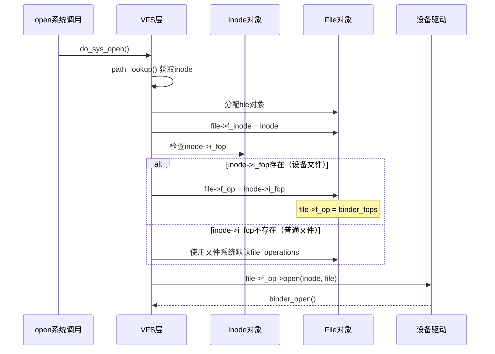
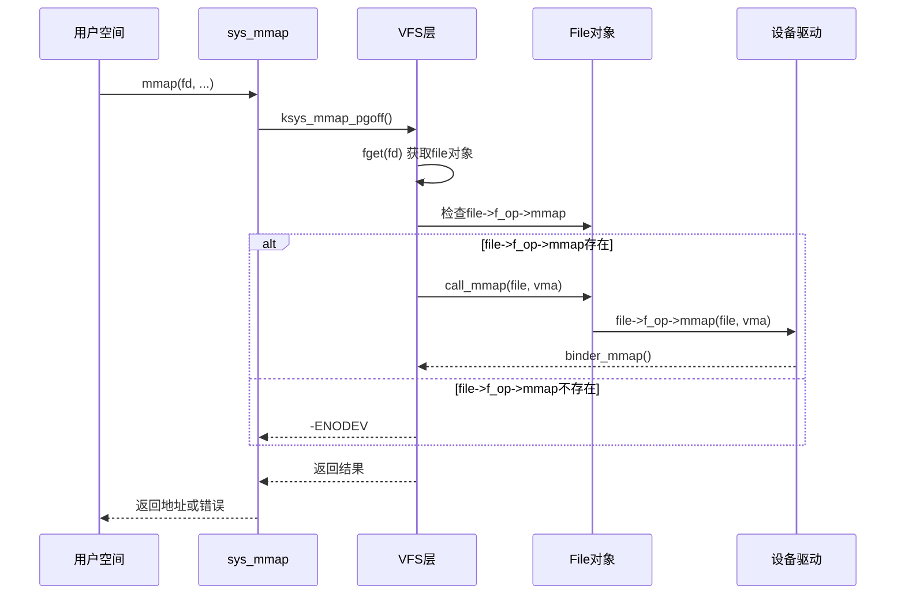
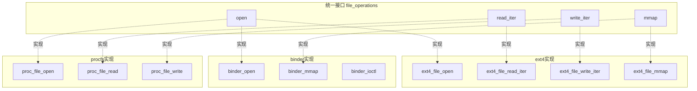
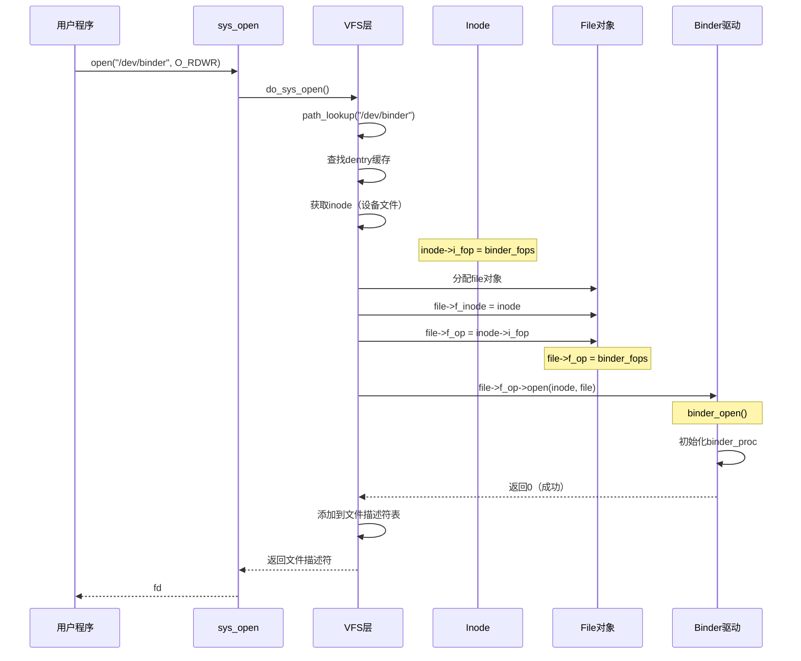
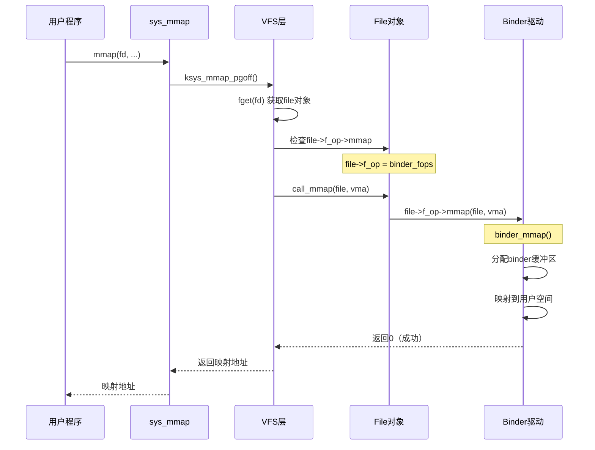

# file_operations 多态机制

## 学习目标

- 理解 file_operations 结构体的作用和设计思想
- **重点理解：这不是 hook，而是多态分发机制**
- 掌握 file_operations 如何被设置和调用
- 理解系统调用如何通过 file_operations 分发到具体实现
- 了解不同文件类型如何提供不同的 file_operations

## 概述

很多开发者误以为 `file_operations` 是 hook 机制，实际上这是 **面向对象的多态分发机制**。理解这个机制对于深入理解 Linux 内核和 VFS 至关重要。

---

## 一、核心概念

### 什么是 file_operations

**file_operations** 是一个函数指针结构体，定义了文件操作的标准接口。每个文件系统或设备驱动通过实现这个接口来提供自己的操作函数。

### 关键误解：Hook vs 多态

#### 常见的误解

很多人认为 `file_operations` 是 hook 机制：
- ❌ **错误理解**：系统调用被"hook"到驱动函数
- ❌ **错误理解**：这是运行时替换函数指针
- ❌ **错误理解**：这是对系统调用的拦截

#### 正确的理解

`file_operations` 是**多态分发机制**：
- ✅ **正确理解**：统一的接口，不同的实现
- ✅ **正确理解**：编译时确定，运行时分发
- ✅ **正确理解**：这是面向对象的多态在 C 语言中的实现

### 类比理解

#### 面向对象的多态

```java
// Java 中的多态
interface FileOperations {
    int open();
    int read();
    int write();
}

class Ext4File implements FileOperations {
    int open() { /* ext4实现 */ }
    int read() { /* ext4实现 */ }
    int write() { /* ext4实现 */ }
}

class BinderFile implements FileOperations {
    int open() { /* binder实现 */ }
    int read() { /* binder实现 */ }
    int write() { /* binder实现 */ }
}

// 使用多态
FileOperations file = getFile();  // 可能是Ext4File或BinderFile
file.open();  // 根据实际类型调用对应实现
```

#### C 语言中的实现

```c
// C 语言中的"多态"（通过函数指针）
struct file_operations {
    int (*open)(struct inode *, struct file *);
    ssize_t (*read)(struct file *, char *, size_t, loff_t *);
    ssize_t (*write)(struct file *, const char *, size_t, loff_t *);
};

// ext4 的实现
const struct file_operations ext4_file_operations = {
    .open = ext4_file_open,
    .read_iter = ext4_file_read_iter,
    .write_iter = ext4_file_write_iter,
};

// binder 的实现
const struct file_operations binder_fops = {
    .open = binder_open,
    .mmap = binder_mmap,
    .ioctl = binder_ioctl,
};

// 多态分发
struct file *file = get_file();  // 可能是ext4文件或binder设备
file->f_op->open(file->f_inode, file);  // 根据f_op调用对应实现
```

---

## 二、file_operations 结构体定义

### 完整定义

**位置**：`include/linux/fs.h`

```c
struct file_operations {
    struct module *owner;
    loff_t (*llseek) (struct file *, loff_t, int);
    ssize_t (*read) (struct file *, char __user *, size_t, loff_t *);
    ssize_t (*write) (struct file *, const char __user *, size_t, loff_t *);
    ssize_t (*read_iter) (struct kiocb *, struct iov_iter *);
    ssize_t (*write_iter) (struct kiocb *, struct iov_iter *);
    int (*iopoll)(struct kiocb *kiocb, bool spin);
    int (*iterate) (struct file *, struct dir_context *);
    int (*iterate_shared) (struct file *, struct dir_context *);
    __poll_t (*poll) (struct file *, struct poll_table_struct *);
    long (*unlocked_ioctl) (struct file *, unsigned int, unsigned long);
    long (*compat_ioctl) (struct file *, unsigned int, unsigned long);
    int (*mmap) (struct file *, struct vm_area_struct *);
    int (*open) (struct inode *, struct file *);
    int (*flush) (struct file *, fl_owner_t id);
    int (*release) (struct inode *, struct file *);
    int (*fsync) (struct file *, loff_t, loff_t, int datasync);
    int (*fasync) (int, struct file *, int);
    int (*lock) (struct file *, int, struct file_lock *);
    ssize_t (*sendpage)(struct file *, struct page *, int, size_t, loff_t *, int);
    unsigned long (*get_unmapped_area)(struct file *, unsigned long, unsigned long, unsigned long, unsigned long);
    int (*check_flags)(int);
    int (*flock) (struct file *, int, struct file_lock *);
    ssize_t (*splice_write)(struct pipe_inode_info *, struct file *, loff_t *, size_t, unsigned int);
    ssize_t (*splice_read)(struct file *, loff_t *, struct pipe_inode_info *, size_t, size_t, unsigned int);
    int (*setlease)(struct file *, long, struct file_lock **, void **);
    long (*fallocate)(struct file *file, int mode, loff_t offset, loff_t len);
    void (*show_fdinfo)(struct seq_file *m, struct file *f);
    ssize_t (*copy_file_range)(struct file *, loff_t, struct file *, loff_t, size_t, unsigned int);
    loff_t (*remap_file_range)(struct file *file_in, loff_t pos_in, struct file *file_out, loff_t pos_out, loff_t len, unsigned int remap_flags);
    int (*fadvise)(struct file *, loff_t, loff_t, int);
};
```

### 关键字段说明

#### 1. owner
- **类型**：`struct module *`
- **作用**：指向拥有这个 file_operations 的模块
- **用途**：防止模块卸载时文件仍在使用

#### 2. open
- **类型**：`int (*open)(struct inode *, struct file *)`
- **作用**：打开文件时调用
- **用途**：初始化文件特定的数据结构

#### 3. read_iter / write_iter
- **类型**：`ssize_t (*read_iter)(struct kiocb *, struct iov_iter *)`
- **作用**：读取/写入文件（向量IO）
- **用途**：文件 I/O 操作（推荐使用）

#### 4. mmap
- **类型**：`int (*mmap)(struct file *, struct vm_area_struct *)`
- **作用**：内存映射文件
- **用途**：将文件映射到进程地址空间

#### 5. unlocked_ioctl
- **类型**：`long (*unlocked_ioctl)(struct file *, unsigned int, unsigned long)`
- **作用**：设备控制
- **用途**：设备特定的操作

---

## 三、file_operations 的设置时机

### 设置流程

`file->f_op` 的赋值发生在文件打开时：



### 关键代码

**位置**：`fs/open.c` - `do_dentry_open()`

```c
static int do_dentry_open(struct file *f,
                          struct inode *inode,
                          int (*open)(struct inode *, struct file *))
{
    // ...
    
    // 关键：从inode获取file_operations
    f->f_op = fops_get(inode->i_fop);
    if (WARN_ON(!f->f_op)) {
        error = -ENODEV;
        goto cleanup_file;
    }
    
    // 如果file_operations有open函数，调用它
    if (open) {
        error = open(inode, f);
        if (error)
            goto cleanup_all;
    }
    
    // ...
}
```

### 设备文件的特殊处理

对于设备文件（如 `/dev/binder`），inode 的 `i_fop` 在设备文件创建时设置：

```c
// 设备文件创建时（mknod）
inode->i_fop = &binder_fops;  // 设置设备驱动的操作函数

// 打开文件时
file->f_op = inode->i_fop;    // 从inode获取操作函数
```

---

## 四、file_operations 的调用机制

### 调用流程

以 `mmap()` 系统调用为例：



### 关键调用函数

**位置**：`include/linux/fs.h`

```c
// mmap 调用
static inline int call_mmap(struct file *file, struct vm_area_struct *vma)
{
    return file->f_op->mmap(file, vma);
}

// read 调用
static inline ssize_t call_read_iter(struct file *file, struct kiocb *kio,
                                     struct iov_iter *iter)
{
    return file->f_op->read_iter(kio, iter);
}

// write 调用
static inline ssize_t call_write_iter(struct file *file, struct kiocb *kio,
                                      struct iov_iter *iter)
{
    return file->f_op->write_iter(kio, iter);
}
```

### 为什么这不是 Hook

#### Hook 机制的特点

1. **运行时替换**：在运行时修改函数指针
2. **拦截调用**：在原有函数前后添加代码
3. **可动态修改**：可以随时添加或移除 hook

#### file_operations 的特点

1. **编译时确定**：每个文件系统的 file_operations 在编译时确定
2. **统一接口**：所有文件系统实现相同的接口
3. **静态绑定**：文件打开时确定，之后不再改变
4. **多态分发**：根据文件类型选择不同的实现

#### 对比示例

```c
// Hook 机制（不是 file_operations）
int (*original_mmap)(struct file *, struct vm_area_struct *);

int hook_mmap(struct file *file, struct vm_area_struct *vma)
{
    // 拦截：在原有函数前执行
    printk("Before mmap\n");
    
    // 调用原有函数
    int ret = original_mmap(file, vma);
    
    // 拦截：在原有函数后执行
    printk("After mmap\n");
    
    return ret;
}

// 运行时替换（Hook）
original_mmap = file->f_op->mmap;
file->f_op->mmap = hook_mmap;  // 这是 Hook！

// file_operations 机制（多态）
// 编译时确定，不会在运行时替换
const struct file_operations binder_fops = {
    .mmap = binder_mmap,  // 编译时确定
};

// 打开文件时设置（不是替换）
file->f_op = inode->i_fop;  // 这是多态分发，不是 Hook！
```

---

## 五、不同文件类型的 file_operations

### 普通文件系统（ext4）

**位置**：`fs/ext4/file.c`

```c
const struct file_operations ext4_file_operations = {
    .llseek		= ext4_llseek,
    .read_iter	= ext4_file_read_iter,
    .write_iter	= ext4_file_write_iter,
    .unlocked_ioctl = ext4_ioctl,
    .mmap		= ext4_file_mmap,
    .open		= ext4_file_open,
    .release	= ext4_release_file,
    .fsync		= ext4_sync_file,
    .splice_read	= generic_file_splice_read,
    .splice_write	= iter_file_splice_write,
    .fallocate	= ext4_fallocate,
};
```

### 设备文件（binder）

**位置**：`drivers/android/binder.c`

```c
const struct file_operations binder_fops = {
    .owner = THIS_MODULE,
    .poll = binder_poll,
    .unlocked_ioctl = binder_ioctl,
    .compat_ioctl = compat_ptr_ioctl,
    .mmap = binder_mmap,
    .open = binder_open,
    .flush = binder_flush,
    .release = binder_release,
};
```

### 虚拟文件系统（procfs）

**位置**：`fs/proc/inode.c`

```c
static const struct file_operations proc_file_operations = {
    .llseek		= proc_file_lseek,
    .read		= proc_file_read,
    .write		= proc_file_write,
    .poll		= proc_file_poll,
    .unlocked_ioctl = proc_file_unlocked_ioctl,
    .mmap		= proc_file_mmap,
    .open		= proc_file_open,
    .release	= proc_file_release,
};
```

### 对比分析



---

## 六、完整的调用链分析

### 以 binder 的 open 和 mmap 为例

#### 1. open("/dev/binder") 的完整流程



#### 2. mmap(fd) 的完整流程



---

## 七、为什么这是多态而不是 Hook

### 多态的特征

1. **统一接口**：所有实现都遵循相同的接口定义
2. **不同实现**：每个类型提供自己的实现
3. **运行时选择**：根据对象类型在运行时选择实现
4. **编译时确定**：实现函数在编译时确定，不会改变

### file_operations 符合多态特征

1. ✅ **统一接口**：`struct file_operations` 定义了统一接口
2. ✅ **不同实现**：ext4、binder、procfs 都有自己的实现
3. ✅ **运行时选择**：根据文件类型（inode->i_fop）选择实现
4. ✅ **编译时确定**：每个实现的函数在编译时确定

### Hook 的特征（file_operations 不符合）

1. ❌ **运行时替换**：file_operations 不会在运行时被替换
2. ❌ **拦截调用**：file_operations 不是拦截，而是直接实现
3. ❌ **动态修改**：file_operations 在文件打开后不会改变

### 对比表

| 特征 | Hook 机制 | file_operations |
|------|----------|----------------|
| 运行时替换 | ✅ 是 | ❌ 否 |
| 拦截调用 | ✅ 是 | ❌ 否 |
| 统一接口 | ❌ 否 | ✅ 是 |
| 多态分发 | ❌ 否 | ✅ 是 |
| 编译时确定 | ❌ 否 | ✅ 是 |

---

## 八、实际应用

### 理解 Binder 的 VFS 集成

当 Android 应用打开 `/dev/binder` 时：

1. **设备文件创建**（系统初始化时）：
   ```c
   // 创建设备文件时
   inode->i_fop = &binder_fops;  // 设置操作函数
   ```

2. **打开设备文件**（应用调用 open）：
   ```c
   // VFS 层
   file->f_op = inode->i_fop;  // 从inode获取操作函数
   file->f_op->open(inode, file);  // 调用binder_open
   ```

3. **内存映射**（应用调用 mmap）：
   ```c
   // VFS 层
   file->f_op->mmap(file, vma);  // 调用binder_mmap
   ```

**这不是 hook**，而是：
- 设备驱动在初始化时注册自己的操作函数
- VFS 在打开文件时获取这些操作函数
- 后续操作通过函数指针调用驱动实现

---

## 总结

### 核心要点

1. **file_operations 是多态分发机制，不是 hook**
   - 统一接口，不同实现
   - 编译时确定，运行时分发
   - 符合面向对象的多态特征

2. **file_operations 的设置时机**
   - 设备文件：在设备文件创建时设置 `inode->i_fop`
   - 普通文件：在文件打开时从文件系统获取
   - 打开文件时：`file->f_op = inode->i_fop`

3. **file_operations 的调用机制**
   - 通过函数指针调用：`file->f_op->xxx()`
   - VFS 提供统一的调用接口：`call_mmap()`、`call_read()` 等
   - 根据文件类型自动选择正确的实现

### 关键区别

| 特征 | Hook 机制 | file_operations |
|------|----------|----------------|
| 运行时替换 | ✅ 是 | ❌ 否 |
| 拦截调用 | ✅ 是 | ❌ 否 |
| 统一接口 | ❌ 否 | ✅ 是 |
| 多态分发 | ❌ 否 | ✅ 是 |
| 编译时确定 | ❌ 否 | ✅ 是 |

### 后续学习

- [路径解析与挂载机制](07-路径解析与挂载机制.md) - 理解路径解析和挂载
- [页缓存机制详解](08-页缓存机制详解.md) - 深入理解页缓存

## 参考资源

- 内核源码：
  - `include/linux/fs.h` - file_operations 定义
  - `fs/open.c` - 文件打开实现
  - `drivers/android/binder.c` - Binder 驱动实现

## 更新记录

- 2026-01-28：初始创建，整合原 file_operations 内容，重点解释多态分发机制
