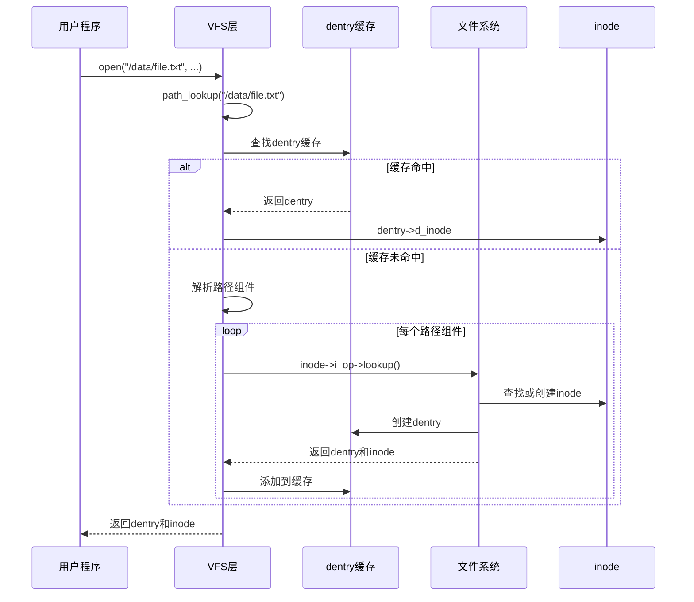
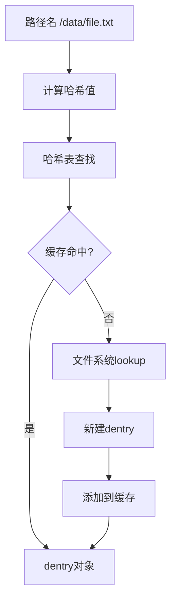
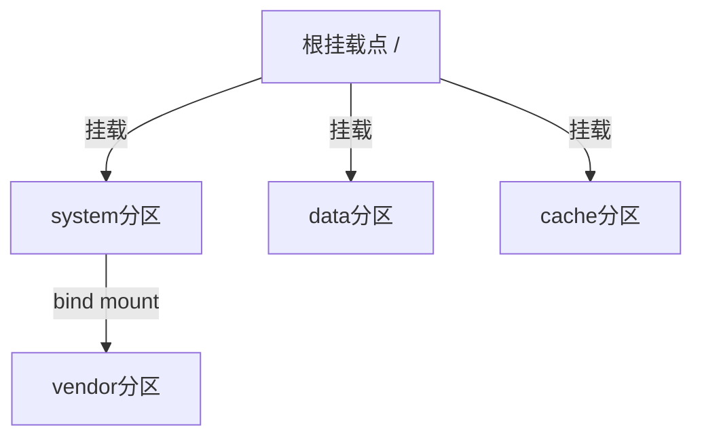

# 路径解析与挂载机制

## 学习目标

- 理解路径解析（path_lookup）的完整流程
- 掌握 dentry 缓存机制的工作原理
- 理解文件系统挂载（mount）和卸载（umount）机制
- 了解挂载命名空间（mount namespace）
- 理解 bind mount 与 overlay 机制

## 概述

路径解析和挂载机制是 VFS 的核心功能：
- **路径解析**：将路径名转换为 dentry 和 inode
- **挂载机制**：将文件系统挂载到目录树中
- **dentry 缓存**：加速路径解析

---

## 一、路径解析（Path Lookup）

### 路径解析的作用

路径解析是将用户空间提供的路径名（如 "/data/file.txt"）转换为内核中的 dentry 和 inode 对象的过程。

### 路径解析流程



### path_lookup() 实现

```c
// fs/namei.c
static struct file *path_openat(struct nameidata *nd,
                                 const struct open_flags *op,
                                 unsigned flags)
{
    struct file *file;
    struct path path;
    int error;
    
    // 1. 分配 file 对象
    file = get_empty_filp();
    if (IS_ERR(file))
        return file;
    
    // 2. 初始化路径查找
    error = path_init(nd, flags);
    if (unlikely(error))
        goto out;
    
    // 3. 路径查找
    error = link_path_walk(nd->path.dentry, nd);
    if (unlikely(error))
        goto out;
    
    // 4. 最终组件查找
    error = do_last(nd, file, op);
    
    return file;
}
```

### link_path_walk() - 路径组件遍历

```c
// fs/namei.c
static int link_path_walk(const char *name, struct nameidata *nd)
{
    while (*name == '/')
        name++;
    
    if (unlikely(!*name))
        return 0;
    
    for (;;) {
        u64 hash_len;
        int type;
        
        // 1. 获取下一个路径组件
        name = hash_name(nd->path.dentry, name);
        hash_len = hashlen_string(nd->path.dentry, name);
        type = LAST_NORM;
        
        // 2. 查找路径组件
        if (name[0] == '.') {
            if (unlikely(name[1] == '\0')) {
                // "."
                type = LAST_DOT;
            } else if (unlikely(name[1] == '.' && name[2] == '\0')) {
                // ".."
                type = LAST_DOTDOT;
                nd->flags |= LOOKUP_JUMPED;
            }
        }
        
        // 3. 查找 dentry
        if (likely(type == LAST_NORM)) {
            struct dentry *parent = nd->path.dentry;
            nd->flags &= ~LOOKUP_JUMPED;
            dentry = lookup_fast(nd, &hash_len);
            if (IS_ERR(dentry))
                return PTR_ERR(dentry);
            if (likely(dentry))
                goto found;
            dentry = lookup_slow(nd, name);
            if (IS_ERR(dentry))
                return PTR_ERR(dentry);
found:
            // 4. 处理挂载点
            if (unlikely(d_mountpoint(dentry))) {
                error = follow_mount(nd, dentry);
                if (unlikely(error < 0))
                    return error;
            }
        }
        
        // 5. 检查是否到达末尾
        if (unlikely(type != LAST_NORM)) {
            if (unlikely(type == LAST_DOTDOT)) {
                error = handle_dots(nd, type);
                if (unlikely(error))
                    return error;
            }
        }
        
        // 6. 移动到下一个组件
        if (likely(type == LAST_NORM)) {
            error = walk_component(nd, 0);
            if (unlikely(error))
                return error;
        }
        
        // 7. 检查是否完成
        if (unlikely(*name == '\0'))
            break;
        
        name++;
    }
    
    return 0;
}
```

### lookup_fast() - 快速查找（缓存）

```c
// fs/namei.c
static struct dentry *lookup_fast(struct nameidata *nd,
                                   u64 *hashp)
{
    struct dentry *dentry;
    struct hlist_bl_head *head;
    struct hlist_bl_node *node;
    u64 hash = *hashp;
    
    // 1. 计算哈希值
    head = d_hash(nd->path.dentry, hash);
    
    // 2. 在哈希表中查找
    hlist_bl_for_each_entry(dentry, node, head, d_hash) {
        if (dentry->d_parent != nd->path.dentry)
            continue;
        if (d_unhashed(dentry))
            continue;
        if (!dentry_cmp(dentry, hash, nd->last.name, nd->last.len))
            continue;
        
        // 3. 找到匹配的 dentry
        if (d_revalidate(dentry, nd->flags)) {
            dget(dentry);
            return dentry;
        }
    }
    
    return NULL;
}
```

### lookup_slow() - 慢速查找（文件系统）

```c
// fs/namei.c
static struct dentry *lookup_slow(struct nameidata *nd, const char *name)
{
    struct dentry *dentry;
    
    // 1. 分配 dentry
    dentry = d_alloc_parallel(nd->path.dentry, &nd->last, &wq);
    if (IS_ERR(dentry))
        return dentry;
    
    // 2. 调用文件系统的 lookup
    if (unlikely(dentry->d_flags & DCACHE_PAR_LOOKUP)) {
        dentry = __d_lookup(nd->path.dentry, &nd->last);
        if (dentry) {
            dput(dentry);
            dentry = NULL;
        }
        dentry = d_alloc_and_lookup(nd->path.dentry, &nd->last, nd);
    } else {
        dentry = d_alloc_and_lookup(nd->path.dentry, &nd->last, nd);
    }
    
    return dentry;
}

static struct dentry *d_alloc_and_lookup(struct dentry *parent,
                                          struct qstr *name,
                                          struct nameidata *nd)
{
    struct inode *inode = parent->d_inode;
    struct dentry *dentry;
    
    // 1. 分配 dentry
    dentry = d_alloc(parent, name);
    if (unlikely(!dentry))
        return NULL;
    
    // 2. 调用文件系统的 lookup
    inode = inode->i_op->lookup(inode, dentry, 0);
    if (unlikely(IS_ERR(inode))) {
        dput(dentry);
        return ERR_CAST(inode);
    }
    
    // 3. 设置 dentry 的 inode
    d_add(dentry, inode);
    
    return dentry;
}
```

---

## 二、Dentry 缓存机制

### Dentry 缓存的作用

Dentry 缓存（dcache）是 VFS 性能优化的关键：
- 缓存路径名到 inode 的映射
- 加速路径解析
- 减少文件系统查找次数

### 缓存结构

```c
// fs/dcache.c
// 全局 dentry 哈希表
static struct hlist_bl_head *dentry_hashtable __read_mostly;

// LRU 链表
static LIST_HEAD(dentry_unused);

// 缓存统计
struct dentry_stat_t {
    int nr_dentry;
    int nr_unused;
    int age_limit;
    int want_pages;
};
```

### 缓存查找流程



### 缓存管理

#### 1. 缓存添加

```c
// fs/dcache.c
void d_add(struct dentry *entry, struct inode *inode)
{
    // 1. 设置 inode
    entry->d_inode = inode;
    
    // 2. 添加到哈希表
    __d_add(entry, inode);
}

static void __d_add(struct dentry *dentry, struct inode *inode)
{
    struct hlist_bl_head *b = d_hash(dentry->d_parent, dentry->d_name.hash);
    
    // 添加到哈希表
    hlist_bl_lock(b);
    hlist_bl_add_head(&dentry->d_hash, b);
    hlist_bl_unlock(b);
    
    // 添加到 inode 的别名链表
    if (inode) {
        spin_lock(&inode->i_lock);
        hlist_add_head(&dentry->d_u.d_alias, &inode->i_dentry);
        spin_unlock(&inode->i_lock);
    }
}
```

#### 2. 缓存淘汰

```c
// fs/dcache.c
static void shrink_dcache_list(struct list_head *list)
{
    struct dentry *dentry, *parent;
    
    while (!list_empty(list)) {
        dentry = list_entry(list->prev, struct dentry, d_lru);
        
        // 检查是否可以删除
        if (dentry->d_count) {
            // 仍在使用，不能删除
            list_move(&dentry->d_lru, &referenced);
            continue;
        }
        
        // 可以删除
        d_shrink_one(dentry, &list);
    }
}
```

---

## 三、文件系统挂载机制

### mount() 系统调用

```c
// fs/namespace.c
SYSCALL_DEFINE5(mount, char __user *, dev_name, char __user *, dir_name,
                char __user *, type, unsigned long, flags, void __user *, data)
{
    return ksys_mount(dev_name, dir_name, type, flags, data);
}
```

### do_mount() 流程

```c
// fs/namespace.c
long do_mount(const char *dev_name, const char __user *dir_name,
              const char *type_page, unsigned long flags, void *data_page)
{
    struct path path;
    int retval = 0;
    int mnt_flags = 0;
    
    // 1. 查找挂载点
    retval = user_path_at(AT_FDCWD, dir_name, LOOKUP_FOLLOW, &path);
    if (retval)
        return retval;
    
    // 2. 检查挂载标志
    if (flags & MS_REMOUNT)
        retval = do_remount(&path, flags, data_page);
    else if (flags & MS_BIND)
        retval = do_loopback(&path, dev_name, flags & MS_REC);
    else if (flags & (MS_SHARED | MS_PRIVATE | MS_SLAVE | MS_UNBINDABLE))
        retval = do_change_type(&path, flags);
    else if (flags & MS_MOVE)
        retval = do_move_mount_old(&path, dev_name);
    else
        retval = do_new_mount(&path, type_page, flags, mnt_flags,
                              dev_name, data_page);
    
    path_put(&path);
    return retval;
}
```

### do_new_mount() - 新挂载

```c
// fs/namespace.c
static int do_new_mount(struct path *path, const char *fstype, int sb_flags,
                        int mnt_flags, const char *name, void *data)
{
    struct file_system_type *type;
    struct vfsmount *mnt;
    int err;
    
    // 1. 查找文件系统类型
    type = get_fs_type(fstype);
    if (!type)
        return -ENODEV;
    
    // 2. 调用文件系统的 mount 函数
    mnt = vfs_kern_mount(type, sb_flags, name, data);
    if (IS_ERR(mnt))
        return PTR_ERR(mnt);
    
    // 3. 添加到挂载树
    err = do_add_mount(real_mount(mnt), path, mnt_flags);
    if (err)
        mntput(mnt);
    
    return err;
}
```

### 文件系统 mount 函数（ext4 示例）

```c
// fs/ext4/super.c
static struct dentry *ext4_mount(struct file_system_type *fs_type, int flags,
                                 const char *dev_name, void *data)
{
    return mount_bdev(fs_type, flags, dev_name, data, ext4_fill_super);
}

static int ext4_fill_super(struct super_block *sb, void *data, int silent)
{
    struct ext4_sb_info *sbi;
    struct ext4_super_block *es = NULL;
    struct dentry *root;
    int ret = -ENOMEM;
    
    // 1. 分配文件系统私有数据
    sbi = kzalloc(sizeof(*sbi), GFP_KERNEL);
    if (!sbi)
        return -ENOMEM;
    sb->s_fs_info = sbi;
    
    // 2. 读取超级块
    if (!sb_set_blocksize(sb, EXT4_MIN_BLOCK_SIZE))
        goto failed_mount;
    
    es = (struct ext4_super_block *)(
        (char *)bh->b_data + EXT4_SB(sb)->s_sb_block * EXT4_MIN_BLOCK_SIZE);
    
    // 3. 验证文件系统
    if (le32_to_cpu(es->s_magic) != EXT4_SUPER_MAGIC)
        goto cantfind_ext4;
    
    // 4. 设置 super_operations
    sb->s_op = &ext4_sops;
    
    // 5. 读取 inode 表
    ret = ext4_group_desc_init(sb);
    if (ret)
        goto failed_mount;
    
    // 6. 创建根目录
    root = ext4_get_root(sb, es);
    if (!root) {
        ext4_msg(sb, KERN_ERR, "get root dentry failed");
        ret = -ENOMEM;
        goto failed_mount;
    }
    
    sb->s_root = root;
    
    return 0;
}
```

---

## 四、挂载命名空间（Mount Namespace）

### 概念

挂载命名空间允许不同的进程看到不同的文件系统挂载视图，实现容器隔离。

### 命名空间结构

```c
// include/linux/mnt_namespace.h
struct mnt_namespace {
    atomic_t count;
    struct ns_common ns;
    struct mount *root;
    struct list_head list;
    struct user_namespace *user_ns;
    struct ucounts *ucounts;
    u64 seq;
    wait_queue_head_t poll;
    u64 event;
};
```

### 命名空间创建

```c
// fs/namespace.c
static struct mnt_namespace *alloc_mnt_ns(struct user_namespace *user_ns)
{
    struct mnt_namespace *new_ns;
    
    new_ns = kmalloc(sizeof(struct mnt_namespace), GFP_KERNEL);
    if (!new_ns)
        return ERR_PTR(-ENOMEM);
    
    atomic_set(&new_ns->count, 1);
    new_ns->ns.ops = &mntns_operations;
    new_ns->seq = atomic64_add_return(1, &mnt_ns_seq);
    new_ns->root = NULL;
    INIT_LIST_HEAD(&new_ns->list);
    init_waitqueue_head(&new_ns->poll);
    new_ns->event = 0;
    new_ns->user_ns = get_user_ns(user_ns);
    
    return new_ns;
}
```

### 使用场景

```bash
# 创建新的挂载命名空间
unshare --mount

# 在新的命名空间中挂载
mount --bind /tmp /mnt

# 其他进程看不到这个挂载
```

---

## 五、Bind Mount

### 概念

Bind mount 将一个目录或文件挂载到另一个位置，实现目录树的重新组织。

### 实现

```c
// fs/namespace.c
static int do_loopback(struct path *path, const char *old_name, int recurse)
{
    struct path old_path;
    struct mount *mnt = NULL;
    int err;
    
    // 1. 查找源路径
    err = kern_path(old_name, LOOKUP_FOLLOW, &old_path);
    if (err)
        return err;
    
    // 2. 创建挂载点
    err = -EINVAL;
    if (old_path.dentry != old_path.mnt->mnt_root)
        goto out;
    
    // 3. 执行 bind mount
    err = attach_recursive_mnt(old_path.mnt, path, NULL);
    
out:
    path_put(&old_path);
    return err;
}
```

### 使用示例

```bash
# 将 /data 目录 bind mount 到 /mnt/data
mount --bind /data /mnt/data

# 查看挂载信息
mount | grep /mnt/data
# /data on /mnt/data type none (rw,bind)
```

---

## 六、Overlay 文件系统

### 概念

Overlay 文件系统将多个目录层叠在一起，上层目录覆盖下层目录，实现联合挂载。

### 结构

```
overlay 文件系统结构：

upperdir (上层，可写)
    │
    ├── file1.txt (修改)
    └── file2.txt (新增)
    
lowerdir (下层，只读)
    │
    ├── file1.txt (原始)
    ├── file2.txt (原始)
    └── file3.txt (原始)
    
merged (合并视图)
    │
    ├── file1.txt (来自 upperdir)
    ├── file2.txt (来自 upperdir)
    └── file3.txt (来自 lowerdir)
```

### 实现

```c
// fs/overlayfs/super.c
static struct dentry *ovl_mount(struct file_system_type *fs_type, int flags,
                                 const char *dev_name, void *raw_data)
{
    return mount_nodev(fs_type, flags, raw_data, ovl_fill_super);
}

static int ovl_fill_super(struct super_block *sb, void *data, int silent)
{
    struct ovl_fs *ofs;
    struct ovl_layer *layers;
    struct cred *cred;
    int err;
    
    // 1. 解析挂载选项
    err = ovl_parse_opt((char *)data, &ofs);
    if (err)
        goto out_err;
    
    // 2. 设置 super_operations
    sb->s_op = &ovl_super_operations;
    
    // 3. 创建根目录
    root = ovl_get_root(sb, upperpath.dentry, lowerpath.dentry);
    if (!root)
        return -ENOMEM;
    
    sb->s_root = root;
    
    return 0;
}
```

### 使用示例

```bash
# 创建 overlay 文件系统
mount -t overlay overlay \
    -o lowerdir=/lower,upperdir=/upper,workdir=/work \
    /merged
```

---

## 七、挂载点管理

### 挂载树结构



### 挂载点查找

```c
// fs/namespace.c
static struct mountpoint *get_mountpoint(struct dentry *dentry)
{
    struct mountpoint *mp, *new = NULL;
    int ret;
    
    if (d_mountpoint(dentry)) {
        // 已经是挂载点
        mp = lookup_mountpoint(dentry);
        if (mp)
            goto out;
    }
    
    // 创建新的挂载点
    new = kmalloc(sizeof(struct mountpoint), GFP_KERNEL);
    if (!new)
        return ERR_PTR(-ENOMEM);
    
    new->m_dentry = dget(dentry);
    new->m_count = 1;
    list_add(&new->m_list, &mountpoint_hashtable[hash]);
    
    return new;
}
```

---

## 总结

### 核心要点

1. **路径解析**：
   - 将路径名转换为 dentry 和 inode
   - 利用 dentry 缓存加速查找
   - 处理符号链接、硬链接等特殊情况

2. **Dentry 缓存**：
   - 缓存路径名到 inode 的映射
   - 使用哈希表快速查找
   - LRU 机制管理缓存

3. **挂载机制**：
   - mount() 系统调用挂载文件系统
   - 每个挂载点对应一个 superblock
   - 支持 bind mount 和 overlay

4. **挂载命名空间**：
   - 实现容器隔离
   - 不同进程看到不同的挂载视图

### 后续学习

- [页缓存机制详解](08-页缓存机制详解.md) - 深入理解页缓存
- [文件读写流程详解](09-文件读写流程详解.md) - 理解文件 IO 流程

## 参考资源

- 内核源码：
  - `fs/namei.c` - 路径解析
  - `fs/dcache.c` - dentry 缓存
  - `fs/namespace.c` - 挂载机制
  - `fs/overlayfs/` - overlay 文件系统

## 更新记录

- 2026-01-28：初始创建，包含路径解析与挂载机制详解
