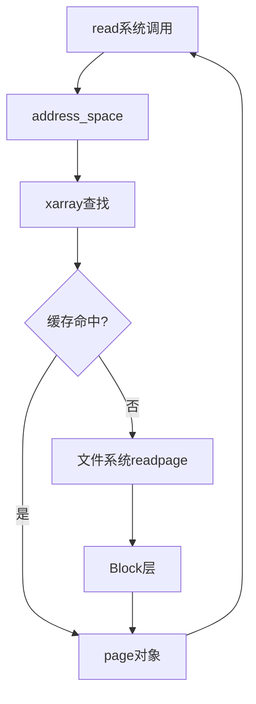

# 页缓存机制详解

## 学习目标

- 理解页缓存（Page Cache）的概念和作用
- 掌握 address_space 结构及其与文件系统的关系
- 理解页缓存与内存管理的交互
- 了解脏页回写（writeback）机制
- 理解页缓存在文件 IO 中的关键作用

## 概述

页缓存（Page Cache）是 Linux 内核中用于缓存文件数据的内存机制。它连接文件系统和内存管理，是文件 IO 性能优化的核心。

---

## 一、页缓存概念

### 什么是页缓存

页缓存是内核中用于缓存文件数据的内存区域：
- 以页（通常 4KB）为单位缓存文件数据
- 减少磁盘访问，提高 IO 性能
- 所有文件系统共享页缓存机制

### 页缓存的作用

1. **加速读取**：缓存的文件数据可以直接从内存返回
2. **延迟写入**：写入操作先写入缓存，异步回写到磁盘
3. **预读优化**：预测性读取相邻数据
4. **内存映射**：支持 mmap 文件映射

### 页缓存位置

```
用户空间
    │
    ▼
系统调用 read/write
    │
    ▼
VFS 层
    │
    ▼
页缓存（Page Cache）⭐
    │
    ├─ 缓存命中：直接返回
    └─ 缓存未命中：从磁盘读取
    │
    ▼
文件系统层
    │
    ▼
Block 层 → 存储设备
```

---

## 二、address_space 结构

### 定义和作用

`struct address_space` 管理文件的页缓存，连接文件系统和内存管理。

### 关键结构体

**位置**：`include/linux/fs.h`

```c
struct address_space {
    struct inode *host;                // 所属inode
    struct radix_tree_root page_tree;  // 页树（已废弃，使用 xarray）
    struct xarray i_pages;             // 页数组（新实现）
    spinlock_t i_pages_lock;           // 页树锁
    atomic_t i_mmap_writable;          // 可写映射计数
    struct rb_root_cached i_mmap;      // 映射红黑树
    struct rw_semaphore i_mmap_rwsem;  // 映射读写信号量
    unsigned long nrpages;             // 页数
    unsigned long nrexceptional;       // 特殊页数（空洞页）
    pgoff_t writeback_index;           // 回写索引
    const struct address_space_operations *a_ops; // 地址空间操作
    unsigned long flags;               // 标志
    struct backing_dev_info *backing_dev_info; // 后备设备信息
    spinlock_t private_lock;           // 私有锁
    struct list_head private_list;     // 私有列表
    void *private_data;                // 私有数据
    // ...
};
```

### address_space 与 inode 的关系

```c
// 每个 inode 有一个 address_space
struct inode {
    struct address_space *i_mapping;   // 页缓存映射
    struct address_space i_data;      // 内嵌的 address_space
    // ...
};

// 通常使用内嵌的 address_space
inode->i_mapping = &inode->i_data;
```

### address_space_operations

**位置**：`include/linux/fs.h`

```c
struct address_space_operations {
    int (*writepage)(struct page *page, struct writeback_control *wbc);
    int (*readpage)(struct file *file, struct page *page);
    int (*writepages)(struct address_space *, struct writeback_control *);
    int (*readpages)(struct file *filp, struct address_space *mapping,
                     struct list_head *pages, unsigned nr_pages);
    int (*set_page_dirty)(struct page *page);
    int (*readpage)(struct file *, struct page *);
    int (*migratepage)(struct address_space *, struct page *, struct page *, enum migrate_mode);
    int (*launder_page)(struct page *);
    int (*is_partially_uptodate)(struct page *, unsigned long, unsigned long);
    void (*is_dirty_writeback)(struct page *, bool *, bool *);
    int (*error_remove_page)(struct address_space *, struct page *);
    int (*swap_activate)(struct swap_info_struct *sis, struct file *file, sector_t *span);
    void (*swap_deactivate)(struct file *file);
    // ...
};
```

### ext4 的 address_space_operations

```c
// fs/ext4/inode.c
static const struct address_space_operations ext4_aops = {
    .readpage       = ext4_readpage,
    .readpages      = ext4_readpages,
    .writepage      = ext4_writepage,
    .writepages     = ext4_writepages,
    .write_begin    = ext4_write_begin,
    .write_end      = ext4_write_end,
    .set_page_dirty = __set_page_dirty_buffers,
    .invalidatepage = ext4_invalidatepage,
    .releasepage    = ext4_releasepage,
    .direct_IO      = ext4_direct_IO,
    .migratepage    = buffer_migrate_page,
    .is_partially_uptodate = block_is_partially_uptodate,
    .error_remove_page = generic_error_remove_page,
};
```

---

## 三、页缓存查找

### find_get_page() - 查找页

```c
// mm/filemap.c
struct page *find_get_page(struct address_space *mapping, pgoff_t index)
{
    struct page *page;
    
    rcu_read_lock();
repeat:
    // 1. 在 xarray 中查找
    page = xa_load(&mapping->i_pages, index);
    if (page) {
        // 2. 增加引用计数
        if (unlikely(!page_cache_get_speculative(page)))
            goto repeat;
        
        // 3. 验证页仍然有效
        if (unlikely(page != xa_load(&mapping->i_pages, index))) {
            put_page(page);
            goto repeat;
        }
    }
    rcu_read_unlock();
    
    return page;
}
```

### 页缓存查找流程



---

## 四、页缓存读取

### generic_file_read_iter() - 通用文件读取

```c
// mm/filemap.c
ssize_t generic_file_read_iter(struct kiocb *iocb, struct iov_iter *iter)
{
    struct file *file = iocb->ki_filp;
    struct address_space *mapping = file->f_mapping;
    struct inode *inode = mapping->host;
    ssize_t retval = 0;
    loff_t *ppos = &iocb->ki_pos;
    
    // 1. 检查直接IO
    if (iocb->ki_flags & IOCB_DIRECT) {
        return generic_file_direct_read(iocb, iter);
    }
    
    // 2. 缓冲读
    for (;;) {
        struct page *page;
        pgoff_t index = *ppos >> PAGE_SHIFT;
        unsigned long offset = *ppos & ~PAGE_MASK;
        unsigned long count = min_t(size_t, iov_iter_count(iter),
                                    PAGE_SIZE - offset);
        
        // 查找页缓存
        page = find_get_page(mapping, index);
        if (!page) {
            // 缓存未命中，读取页
            page = __page_cache_alloc(gfp_mask);
            if (!page)
                break;
            error = add_to_page_cache_lru(page, mapping, index, gfp_mask);
            if (error) {
                put_page(page);
                if (error == -EEXIST) {
                    error = 0;
                    continue;
                }
                break;
            }
            error = mapping->a_ops->readpage(file, page);
            if (error) {
                put_page(page);
                break;
            }
        }
        
        // 从页缓存复制到用户空间
        ret = copy_page_to_iter(page, offset, nr, iter);
        put_page(page);
        
        *ppos += ret;
        retval += ret;
        if (!iov_iter_count(iter))
            break;
    }
    
    return retval;
}
```

### 文件系统 readpage（ext4 示例）

```c
// fs/ext4/inode.c
static int ext4_readpage(struct file *file, struct page *page)
{
    return mpage_readpage(page, ext4_get_block);
}

// fs/mpage.c
int mpage_readpage(struct page *page, get_block_t get_block)
{
    struct bio *bio = NULL;
    sector_t last_block_in_bio = 0;
    struct buffer_head map_bh;
    unsigned int first_block;
    struct inode *inode = page->mapping->host;
    
    // 1. 计算块号
    first_block = (page->index << (PAGE_SHIFT - inode->i_blkbits));
    
    // 2. 创建 bio
    bio = bio_alloc(GFP_KERNEL, 1);
    bio->bi_iter.bi_sector = first_block * (PAGE_SIZE >> 9);
    bio->bi_bdev = inode->i_sb->s_bdev;
    bio_add_page(bio, page, PAGE_SIZE, 0);
    
    // 3. 提交到 Block 层
    submit_bio(REQ_OP_READ, bio);
    
    return 0;
}
```

---

## 五、页缓存写入

### generic_file_write_iter() - 通用文件写入

```c
// mm/filemap.c
ssize_t generic_file_write_iter(struct kiocb *iocb, struct iov_iter *from)
{
    struct file *file = iocb->ki_filp;
    struct address_space *mapping = file->f_mapping;
    struct inode *inode = mapping->host;
    ssize_t ret;
    
    // 1. 检查直接IO
    if (iocb->ki_flags & IOCB_DIRECT) {
        return generic_file_direct_write(iocb, from);
    }
    
    // 2. 缓冲写
    ret = generic_perform_write(file, from, iocb->ki_pos);
    if (ret > 0) {
        iocb->ki_pos += ret;
        write_len += ret;
    }
    
    // 3. 同步写入（如果需要）
    if (file->f_flags & O_SYNC || file->f_flags & O_DSYNC) {
        ret = generic_write_sync(iocb, ret);
    }
    
    return ret;
}
```

### generic_perform_write() - 执行写入

```c
// mm/filemap.c
ssize_t generic_perform_write(struct file *file,
                              struct iov_iter *i, loff_t pos)
{
    struct address_space *mapping = file->f_mapping;
    const struct address_space_operations *a_ops = mapping->a_ops;
    long status = 0;
    ssize_t written = 0;
    unsigned int flags = 0;
    
    do {
        struct page *page;
        unsigned long offset;
        unsigned long bytes;
        void *kaddr;
        
        // 1. 计算页索引和偏移
        offset = (pos & (PAGE_SIZE - 1));
        bytes = min_t(unsigned long, PAGE_SIZE - offset,
                      iov_iter_count(i));
        
        // 2. 准备写入页
        status = a_ops->write_begin(file, mapping, pos, bytes, flags,
                                    &page, &fsdata);
        if (unlikely(status))
            break;
        
        // 3. 从用户空间复制数据到页
        kaddr = kmap_atomic(page);
        copied = copy_from_iter(kaddr + offset, bytes, i);
        kunmap_atomic(kaddr);
        
        // 4. 完成写入
        status = a_ops->write_end(file, mapping, pos, bytes, copied,
                                  page, fsdata);
        if (unlikely(status < 0))
            break;
        
        // 5. 标记页为脏
        if (status > 0)
            written += status;
        
        pos += status;
    } while (iov_iter_count(i));
    
    return written ? written : status;
}
```

---

## 六、脏页回写（Writeback）

### 脏页概念

脏页（Dirty Page）是指已被修改但尚未写回磁盘的页。

### 脏页标记

```c
// include/linux/page-flags.h
// 页标志
PG_dirty: 页已被修改（脏页）
PG_writeback: 页正在回写

// 设置脏页
static inline void set_page_dirty(struct page *page)
{
    struct address_space *mapping = page_mapping(page);
    
    if (likely(mapping)) {
        int (*spd)(struct page *) = mapping->a_ops->set_page_dirty;
        if (spd)
            spd(page);
        else
            __set_page_dirty(page, mapping, 0);
    } else {
        __set_page_dirty_no_writeback(page);
    }
}
```

### 回写机制

```c
// mm/page-writeback.c
int write_cache_pages(struct address_space *mapping,
                      struct writeback_control *wbc,
                      writepage_t writepage, void *data)
{
    int ret = 0;
    int done = 0;
    struct pagevec pvec;
    int nr_pages;
    pgoff_t index;
    pgoff_t end;
    pgoff_t done_index;
    int range_whole = 0;
    xa_mark_t tag;
    
    pagevec_init(&pvec);
    if (wbc->range_cyclic) {
        index = mapping->writeback_index;
        end = -1;
    } else {
        index = wbc->range_start >> PAGE_SHIFT;
        end = wbc->range_end >> PAGE_SHIFT;
    }
    
    // 遍历脏页
    while (!done && (index <= end)) {
        int i;
        
        // 查找脏页
        nr_pages = pagevec_lookup_range_tag(&pvec, mapping, &index, end,
                                             tag);
        if (nr_pages == 0)
            break;
        
        for (i = 0; i < nr_pages; i++) {
            struct page *page = pvec.pages[i];
            
            if (PageWriteback(page)) {
                if (wbc->sync_mode != WB_SYNC_NONE)
                    wait_on_page_writeback(page);
                else
                    break;
            }
            
            if (PageDirty(page)) {
                // 调用文件系统的 writepage
                ret = (*writepage)(page, wbc, data);
                if (unlikely(ret)) {
                    if (ret == AOP_WRITEPAGE_ACTIVATE) {
                        unlock_page(page);
                    } else {
                        done = 1;
                        break;
                    }
                }
            }
        }
        
        pagevec_release(&pvec);
        cond_resched();
    }
    
    return ret;
}
```

### 回写触发时机

1. **定期回写**：内核线程定期回写脏页
2. **内存压力**：内存不足时强制回写
3. **同步调用**：fsync()、sync() 等系统调用
4. **页淘汰**：LRU 淘汰脏页时回写

---

## 七、页缓存与内存管理的关系

### 页分配

```c
// mm/filemap.c
static struct page *__page_cache_alloc(gfp_t gfp_mask)
{
    // 从内存管理分配页
    return alloc_pages(gfp_mask, 0);
}
```

### 页回收

```c
// mm/vmscan.c
static unsigned long shrink_page_list(struct list_head *page_list,
                                       struct pglist_data *pgdat,
                                       struct scan_control *sc,
                                       enum ttu_flags ttu_flags,
                                       struct reclaim_stat *stat,
                                       bool ignore_references)
{
    LIST_HEAD(ret_pages);
    LIST_HEAD(free_pages);
    unsigned nr_reclaimed = 0;
    unsigned nr_dirty = 0;
    unsigned nr_unqueued_dirty = 0;
    unsigned nr_congested = 0;
    unsigned nr_unqueued = 0;
    unsigned nr_activate = 0;
    unsigned nr_ref_keep = 0;
    unsigned nr_unmap_fail = 0;
    
    while (!list_empty(page_list)) {
        struct page *page;
        int may_enter_fs;
        enum page_references references = PAGEREF_RECLAIM;
        bool dirty, writeback;
        
        page = lru_to_page(page_list);
        list_del(&page->lru);
        
        // 检查页类型
        if (unlikely(!page_evictable(page))) {
            putback_lru_page(page);
            continue;
        }
        
        // 如果是脏页，需要回写
        if (PageDirty(page)) {
            if (PageWriteback(page)) {
                // 正在回写，等待完成
                wait_on_page_writeback(page);
            }
            
            // 回写脏页
            if (mapping->a_ops->writepage) {
                error = mapping->a_ops->writepage(page, &wbc);
                if (error) {
                    // 回写失败，保留页
                    putback_lru_page(page);
                    continue;
                }
            }
        }
        
        // 释放页
        __remove_mapping(mapping, page, true);
        list_add(&page->lru, &free_pages);
    }
    
    return nr_reclaimed;
}
```

---

## 八、页缓存统计

### 查看页缓存统计

```bash
# 查看系统内存和页缓存
cat /proc/meminfo

# 输出示例
MemTotal:        8192000 kB
MemFree:         2048000 kB
MemAvailable:    3072000 kB
Buffers:           51200 kB
Cached:          2048000 kB  # 页缓存大小
SwapCached:            0 kB
```

### 页缓存调优

```bash
# 调整脏页回写参数
# /proc/sys/vm/dirty_ratio: 系统内存的百分比，超过此值开始回写
echo 20 > /proc/sys/vm/dirty_ratio

# /proc/sys/vm/dirty_background_ratio: 后台回写阈值
echo 10 > /proc/sys/vm/dirty_background_ratio

# /proc/sys/vm/dirty_expire_centisecs: 脏页过期时间（秒）
echo 3000 > /proc/sys/vm/dirty_expire_centisecs

# /proc/sys/vm/dirty_writeback_centisecs: 回写间隔（秒）
echo 500 > /proc/sys/vm/dirty_writeback_centisecs
```

---

## 总结

### 核心要点

1. **页缓存作用**：
   - 缓存文件数据，减少磁盘访问
   - 延迟写入，提高写入性能
   - 支持预读和内存映射

2. **address_space**：
   - 管理文件的页缓存
   - 连接文件系统和内存管理
   - 提供页缓存操作接口

3. **脏页回写**：
   - 延迟写入提高性能
   - 定期或按需回写脏页
   - 内存压力时强制回写

4. **与内存管理的关系**：
   - 页缓存使用内存管理的页分配
   - 内存压力时回收页缓存
   - 脏页回写释放内存

### 后续学习

- [文件读写流程详解](09-文件读写流程详解.md) - 理解完整的 IO 流程
- [内存映射文件机制](10-内存映射文件机制.md) - 理解 mmap

## 参考资源

- 内核源码：
  - `mm/filemap.c` - 页缓存实现
  - `mm/page-writeback.c` - 脏页回写
  - `include/linux/fs.h` - address_space 定义

## 更新记录

- 2026-01-28：初始创建，包含页缓存机制详解
