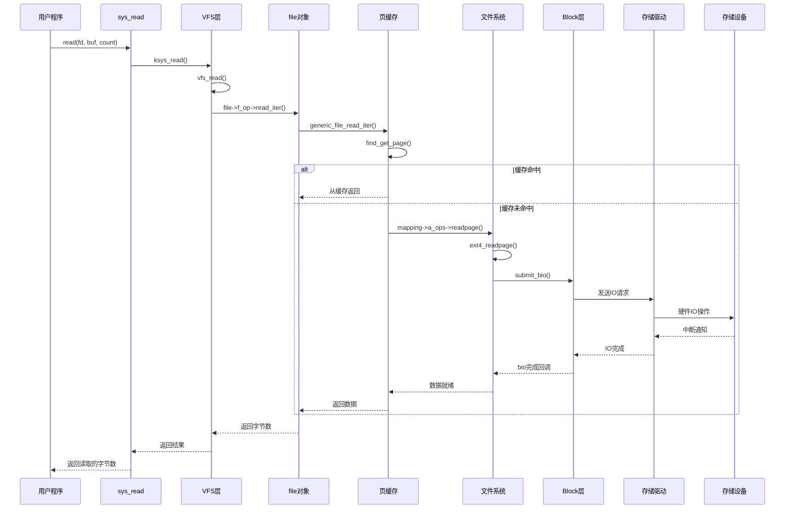
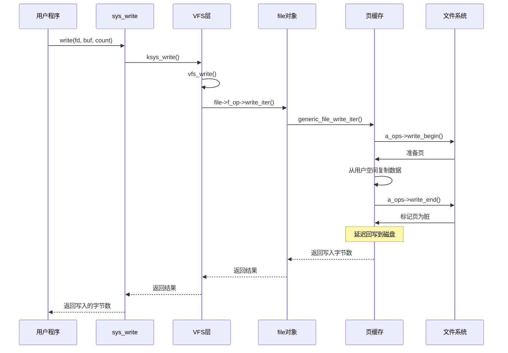
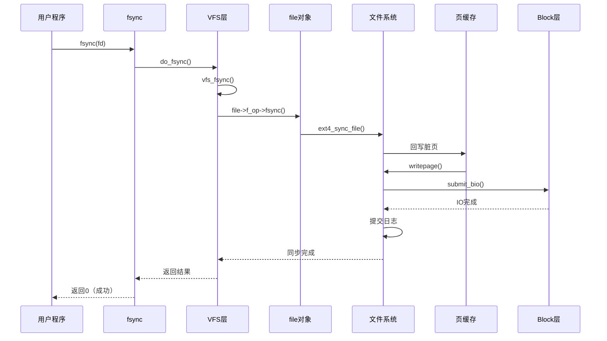

# 文件读写流程详解

## 学习目标

- 理解缓冲读（buffered read）的完整流程
- 掌握缓冲写（buffered write）的完整流程
- 理解预读（readahead）机制
- 了解直接 IO（O_DIRECT）流程
- 理解同步 IO（O_SYNC, fsync）流程

## 概述

文件读写是文件系统最核心的操作。理解文件读写的完整流程对于深入理解文件系统和性能优化至关重要。

---

## 一、缓冲读（Buffered Read）流程

### 用户空间调用

```c
// 用户程序
char buf[4096];
ssize_t n = read(fd, buf, sizeof(buf));
```

### 系统调用入口

```c
// fs/read_write.c
SYSCALL_DEFINE3(read, unsigned int, fd, char __user *, buf, size_t, count)
{
    return ksys_read(fd, buf, count);
}

ssize_t ksys_read(unsigned int fd, char __user *buf, size_t count)
{
    struct fd f = fdget_pos(fd);
    ssize_t ret = -EBADF;
    
    if (f.file) {
        loff_t pos = file_pos_read(f.file);
        ret = vfs_read(f.file, buf, count, &pos);
        if (ret >= 0)
            file_pos_write(f.file, pos);
        fdput_pos(f);
    }
    return ret;
}
```

### vfs_read() 流程

```c
// fs/read_write.c
ssize_t vfs_read(struct file *file, char __user *buf, size_t count, loff_t *pos)
{
    ssize_t ret;
    
    if (!(file->f_mode & FMODE_READ))
        return -EBADF;
    if (!(file->f_mode & FMODE_CAN_READ))
        return -EINVAL;
    if (unlikely(!access_ok(buf, count)))
        return -EFAULT;
    
    ret = rw_verify_area(READ, file, pos, count);
    if (ret)
        return ret;
    
    if (count > 0) {
        ret = __vfs_read(file, buf, count, pos);
        if (ret > 0)
            fsnotify_access(file);
    }
    
    return ret;
}
```

### 文件系统 read_iter（ext4 示例）

```c
// fs/ext4/file.c
static ssize_t ext4_file_read_iter(struct kiocb *iocb, struct iov_iter *to)
{
    struct inode *inode = file_inode(iocb->ki_filp);
    
    if (unlikely(ext4_forced_shutdown(EXT4_SB(inode->i_sb))))
        return -EIO;
    
    if (!iov_iter_count(to))
        return 0;
    
    // 调用通用文件读取
    return generic_file_read_iter(iocb, to);
}
```

### 页缓存读取流程

```c
// mm/filemap.c
ssize_t generic_file_read_iter(struct kiocb *iocb, struct iov_iter *iter)
{
    struct file *file = iocb->ki_filp;
    struct address_space *mapping = file->f_mapping;
    struct inode *inode = mapping->host;
    ssize_t retval = 0;
    loff_t *ppos = &iocb->ki_pos;
    
    // 1. 检查直接IO
    if (iocb->ki_flags & IOCB_DIRECT) {
        return generic_file_direct_read(iocb, iter);
    }
    
    // 2. 缓冲读
    for (;;) {
        struct page *page;
        pgoff_t index = *ppos >> PAGE_SHIFT;
        unsigned long offset = *ppos & ~PAGE_MASK;
        size_t count = min_t(size_t, iov_iter_count(iter),
                            PAGE_SIZE - offset);
        
        // 查找页缓存
        page = find_get_page(mapping, index);
        if (!page) {
            // 缓存未命中，读取页
            page = __page_cache_alloc(gfp_mask);
            if (!page)
                break;
            error = add_to_page_cache_lru(page, mapping, index, gfp_mask);
            if (unlikely(error)) {
                put_page(page);
                if (error == -EEXIST) {
                    error = 0;
                    continue;
                }
                break;
            }
            error = mapping->a_ops->readpage(file, page);
            if (error) {
                put_page(page);
                break;
            }
        }
        
        // 从页缓存复制到用户空间
        ret = copy_page_to_iter(page, offset, count, iter);
        put_page(page);
        
        *ppos += ret;
        retval += ret;
        if (!iov_iter_count(iter))
            break;
    }
    
    return retval;
}
```

### 缓冲读完整流程图



---

## 二、缓冲写（Buffered Write）流程

### 用户空间调用

```c
// 用户程序
const char *data = "Hello, World!";
ssize_t n = write(fd, data, strlen(data));
```

### 系统调用入口

```c
// fs/read_write.c
SYSCALL_DEFINE3(write, unsigned int, fd, const char __user *, buf, size_t, count)
{
    return ksys_write(fd, buf, count);
}

ssize_t ksys_write(unsigned int fd, const char __user *buf, size_t count)
{
    struct fd f = fdget_pos(fd);
    ssize_t ret = -EBADF;
    
    if (f.file) {
        loff_t pos = file_pos_read(f.file);
        ret = vfs_write(f.file, buf, count, &pos);
        if (ret >= 0)
            file_pos_write(f.file, pos);
        fdput_pos(f);
    }
    return ret;
}
```

### vfs_write() 流程

```c
// fs/read_write.c
ssize_t vfs_write(struct file *file, const char __user *buf, size_t count, loff_t *pos)
{
    ssize_t ret;
    
    if (!(file->f_mode & FMODE_WRITE))
        return -EBADF;
    if (!(file->f_mode & FMODE_CAN_WRITE))
        return -EINVAL;
    if (unlikely(!access_ok(buf, count)))
        return -EFAULT;
    
    ret = rw_verify_area(WRITE, file, pos, count);
    if (ret)
        return ret;
    
    if (count > 0) {
        ret = __vfs_write(file, buf, count, pos);
        if (ret > 0) {
            fsnotify_modify(file);
            add_wchar(current, ret);
        }
    }
    
    return ret;
}
```

### 页缓存写入流程

```c
// mm/filemap.c
ssize_t generic_file_write_iter(struct kiocb *iocb, struct iov_iter *from)
{
    struct file *file = iocb->ki_filp;
    struct address_space *mapping = file->f_mapping;
    struct inode *inode = mapping->host;
    ssize_t ret;
    
    // 1. 检查直接IO
    if (iocb->ki_flags & IOCB_DIRECT) {
        return generic_file_direct_write(iocb, from);
    }
    
    // 2. 缓冲写
    ret = generic_perform_write(file, from, iocb->ki_pos);
    if (ret > 0) {
        iocb->ki_pos += ret;
        write_len += ret;
    }
    
    // 3. 同步写入（如果需要）
    if (file->f_flags & O_SYNC || file->f_flags & O_DSYNC) {
        ret = generic_write_sync(iocb, ret);
    }
    
    return ret;
}
```

### generic_perform_write() - 执行写入

```c
// mm/filemap.c
ssize_t generic_perform_write(struct file *file,
                              struct iov_iter *i, loff_t pos)
{
    struct address_space *mapping = file->f_mapping;
    const struct address_space_operations *a_ops = mapping->a_operations;
    long status = 0;
    ssize_t written = 0;
    unsigned int flags = 0;
    
    do {
        struct page *page;
        unsigned long offset;
        unsigned long bytes;
        void *kaddr;
        void *fsdata;
        
        // 1. 计算页索引和偏移
        offset = (pos & (PAGE_SIZE - 1));
        bytes = min_t(unsigned long, PAGE_SIZE - offset,
                      iov_iter_count(i));
        
        // 2. 准备写入页（write_begin）
        status = a_ops->write_begin(file, mapping, pos, bytes, flags,
                                    &page, &fsdata);
        if (unlikely(status))
            break;
        
        // 3. 从用户空间复制数据到页
        kaddr = kmap_atomic(page);
        copied = copy_from_iter(kaddr + offset, bytes, i);
        kunmap_atomic(kaddr);
        flush_dcache_page(page);
        
        // 4. 完成写入（write_end）
        status = a_ops->write_end(file, mapping, pos, bytes, copied,
                                  page, fsdata);
        if (unlikely(status < 0))
            break;
        
        // 5. 标记页为脏
        if (status > 0)
            written += status;
        
        pos += status;
    } while (iov_iter_count(i));
    
    return written ? written : status;
}
```

### 文件系统 write_begin/write_end（ext4 示例）

```c
// fs/ext4/inode.c
static int ext4_write_begin(struct file *file, struct address_space *mapping,
                             loff_t pos, unsigned len, unsigned flags,
                             struct page **pagep, void **fsdata)
{
    struct inode *inode = mapping->host;
    struct page *page;
    pgoff_t index;
    int ret;
    
    // 1. 计算页索引
    index = pos >> PAGE_SHIFT;
    
    // 2. 查找或分配页
    page = grab_cache_page_write_begin(mapping, index, flags);
    if (!page)
        return -ENOMEM;
    
    // 3. 等待页就绪
    wait_for_stable_page(page);
    
    *pagep = page;
    return 0;
}

static int ext4_write_end(struct file *file, struct address_space *mapping,
                          loff_t pos, unsigned len, unsigned copied,
                          struct page *page, void *fsdata)
{
    struct inode *inode = mapping->host;
    loff_t old_size = inode->i_size;
    int ret = 0;
    int ret2;
    
    // 1. 更新文件大小
    if (pos + copied > inode->i_size)
        i_size_write(inode, pos + copied);
    
    // 2. 标记页为脏
    set_page_dirty(page);
    
    // 3. 解锁页
    unlock_page(page);
    put_page(page);
    
    // 4. 同步写入（如果需要）
    if (old_size < pos)
        pagecache_isize_extended(inode, old_size, pos);
    
    return copied;
}
```

### 缓冲写完整流程图



---

## 三、预读（Readahead）机制

### 预读的作用

预读（Readahead）是预测性读取相邻数据，提高顺序读取性能。

### 预读触发

```c
// mm/readahead.c
void page_cache_sync_readahead(struct address_space *mapping,
                                struct file_ra_state *ra,
                                struct file *filp, pgoff_t offset,
                                unsigned long req_size)
{
    // 同步预读
    if (!ra->ra_pages)
        return;
    
    do_page_cache_readahead(mapping, filp, offset, req_size, 0);
}

void page_cache_async_readahead(struct address_space *mapping,
                                struct file_ra_state *ra,
                                struct file *filp, struct page *page,
                                pgoff_t offset, unsigned long req_size)
{
    // 异步预读
    if (!ra->ra_pages)
        return;
    
    if (PageReadahead(page))
        do_page_cache_readahead(mapping, filp, offset, req_size, 0);
}
```

### 预读算法

```c
// mm/readahead.c
static unsigned long ondemand_readahead(struct address_space *mapping,
                                        struct file_ra_state *ra,
                                        struct file *filp, bool hit_readahead_marker,
                                        pgoff_t offset, unsigned long req_size)
{
    unsigned long max = ra->ra_pages;
    unsigned long min = max / 2;
    pgoff_t prev_offset;
    
    // 1. 检查是否是顺序读取
    if (offset != (ra->prev_pos >> PAGE_SHIFT) + 1) {
        // 随机读取，减少预读
        ra->size = 0;
        ra->async_size = 0;
        return 0;
    }
    
    // 2. 顺序读取，增加预读
    prev_offset = ra->prev_pos >> PAGE_SHIFT;
    ra->size = get_next_ra_size(ra, max);
    ra->async_size = ra->size;
    
    return ra->size;
}
```

---

## 四、直接 IO（O_DIRECT）

### 直接 IO 概念

直接 IO（Direct IO）绕过页缓存，直接从用户空间到存储设备。

### 直接 IO 特点

- **绕过页缓存**：不经过页缓存
- **需要对齐**：用户缓冲区必须页对齐
- **同步 IO**：等待 IO 完成
- **适用场景**：数据库、大文件传输

### 直接 IO 实现

```c
// mm/filemap.c
ssize_t generic_file_direct_read(struct kiocb *iocb, struct iov_iter *iter)
{
    struct file *file = iocb->ki_filp;
    struct address_space *mapping = file->f_mapping;
    struct inode *inode = mapping->host;
    ssize_t retval;
    size_t count = iov_iter_count(iter);
    loff_t *ppos = &iocb->ki_pos;
    
    // 1. 检查对齐
    if (!is_sector_aligned(iocb->ki_pos, inode->i_sb->s_blocksize))
        return -EINVAL;
    
    // 2. 调用文件系统的 direct_IO
    retval = mapping->a_ops->direct_IO(iocb, iter);
    
    return retval;
}
```

### 文件系统 direct_IO（ext4 示例）

```c
// fs/ext4/inode.c
static ssize_t ext4_direct_IO(struct kiocb *iocb, struct iov_iter *iter)
{
    struct address_space *mapping = iocb->ki_filp->f_mapping;
    struct inode *inode = mapping->host;
    size_t count = iov_iter_count(iter);
    loff_t offset = iocb->ki_pos;
    ssize_t ret;
    
    // 1. 检查文件系统是否支持直接IO
    if (ext4_test_inode_flag(inode, EXT4_INODE_EXTENTS))
        ret = ext4_ext_direct_IO(iocb, iter);
    else
        ret = ext4_ind_direct_IO(iocb, iter);
    
    return ret;
}
```

### 直接 IO vs 缓冲 IO

| 特性 | 缓冲 IO | 直接 IO |
|-----|--------|---------|
| 页缓存 | 使用 | 绕过 |
| 对齐要求 | 无 | 必须页对齐 |
| 性能 | 高（缓存命中） | 中（无缓存） |
| 适用场景 | 一般文件操作 | 数据库、大文件 |

---

## 五、同步 IO（O_SYNC, fsync）

### 同步 IO 标志

```c
// include/uapi/asm-generic/fcntl.h
#define O_SYNC        04000000  // 同步IO（数据和元数据）
#define O_DSYNC       01000000  // 数据同步（仅数据）
```

### fsync() 系统调用

```c
// fs/sync.c
SYSCALL_DEFINE1(fsync, unsigned int, fd)
{
    return do_fsync(fd, 0);
}

int do_fsync(unsigned int fd, int datasync)
{
    struct fd f = fdget(fd);
    int ret = -EBADF;
    
    if (f.file) {
        ret = vfs_fsync(f.file, datasync);
        fdput(f);
    }
    return ret;
}
```

### vfs_fsync() 流程

```c
// fs/sync.c
int vfs_fsync(struct file *file, int datasync)
{
    if (!file->f_op->fsync)
        return -EINVAL;
    
    return file->f_op->fsync(file, 0, LLONG_MAX, datasync);
}
```

### 文件系统 fsync（ext4 示例）

```c
// fs/ext4/file.c
static int ext4_sync_file(struct file *file, loff_t start, loff_t end, int datasync)
{
    struct inode *inode = file->f_mapping->host;
    struct ext4_inode_info *ei = EXT4_I(inode);
    int ret;
    bool needs_barrier = false;
    
    // 1. 回写脏页
    ret = file_write_and_wait_range(file, start, end);
    if (ret)
        return ret;
    
    // 2. 同步文件系统元数据
    ret = sync_mapping_buffers(inode->i_mapping);
    if (ret)
        return ret;
    
    // 3. 提交日志（ext4 journal）
    if (needs_barrier) {
        ret = blkdev_issue_flush(inode->i_sb->s_bdev, GFP_KERNEL, NULL);
        if (ret)
            return ret;
    }
    
    return ret;
}
```

### 同步 IO 流程



---

## 六、IO 路径对比

### 缓冲 IO 路径

```
用户空间
    │
    ▼
系统调用 read/write
    │
    ▼
VFS 层
    │
    ▼
页缓存（Page Cache）
    │
    ├─ 缓存命中：直接返回
    └─ 缓存未命中：从磁盘读取
    │
    ▼
文件系统层
    │
    ▼
Block 层 → 存储设备
```

### 直接 IO 路径

```
用户空间（对齐的缓冲区）
    │
    ▼
系统调用 read/write (O_DIRECT)
    │
    ▼
VFS 层
    │
    ▼
文件系统层（直接IO路径）
    │
    ▼
Block 层 → 存储设备
```

### 同步 IO 路径

```
用户空间
    │
    ▼
系统调用 write (O_SYNC) / fsync()
    │
    ▼
VFS 层
    │
    ▼
页缓存（写入并标记为脏）
    │
    ▼
文件系统层（立即回写）
    │
    ▼
Block 层 → 存储设备
    │
    ▼
等待 IO 完成
    │
    ▼
返回用户空间
```

---

## 总结

### 核心要点

1. **缓冲读流程**：
   - 系统调用 → VFS → 页缓存 → 文件系统 → Block 层
   - 缓存命中时直接返回，未命中时从磁盘读取

2. **缓冲写流程**：
   - 系统调用 → VFS → 页缓存（标记为脏）→ 异步回写
   - 延迟写入提高性能

3. **预读机制**：
   - 预测性读取相邻数据
   - 提高顺序读取性能

4. **直接 IO**：
   - 绕过页缓存
   - 需要对齐，适合特定场景

5. **同步 IO**：
   - 立即回写脏页
   - 保证数据持久化

### 后续学习

- [内存映射文件机制](10-内存映射文件机制.md) - 理解 mmap
- [文件系统性能分析](19-文件系统性能分析.md) - 性能优化

## 参考资源

- 内核源码：
  - `fs/read_write.c` - 文件读写
  - `mm/filemap.c` - 页缓存
  - `mm/readahead.c` - 预读机制

## 更新记录

- 2026-01-28：初始创建，包含文件读写流程详解
