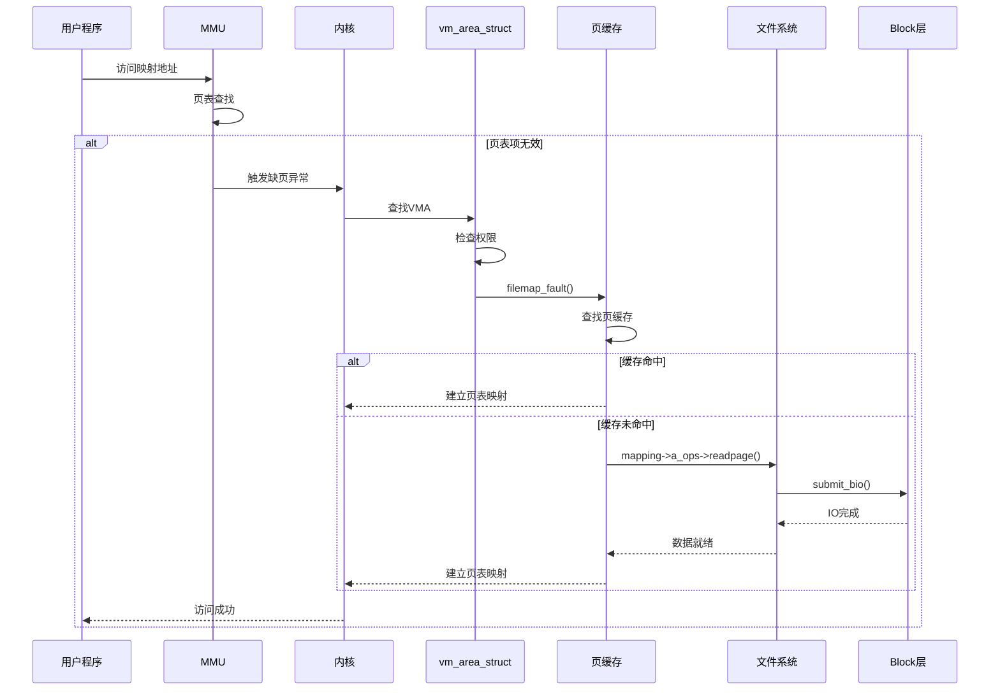

# 内存映射文件机制

## 学习目标

- 理解 mmap 系统调用的实现原理
- 掌握文件映射 vs 匿名映射的区别
- 理解共享映射 vs 私有映射
- 了解缺页处理（page fault）机制
- 理解 mmap 在 Android 中的应用（Binder, ashmem）

## 概述

内存映射文件（mmap）是将文件内容映射到进程地址空间的机制。它提供了零拷贝的文件访问方式，在 Android 系统中被广泛使用。

---

## 一、mmap 系统调用

### 用户空间调用

```c
// 用户程序
void *addr = mmap(NULL, size, PROT_READ | PROT_WRITE,
                   MAP_SHARED, fd, 0);
```

### 系统调用入口

```c
// arch/arm64/kernel/sys.c
SYSCALL_DEFINE6(mmap, unsigned long, addr, unsigned long, len,
                unsigned long, prot, unsigned long, flags,
                unsigned long, fd, unsigned long, off)
{
    return ksys_mmap_pgoff(addr, len, prot, flags, fd, off >> PAGE_SHIFT);
}
```

### do_mmap() 流程

```c
// mm/mmap.c
unsigned long do_mmap(struct file *file, unsigned long addr,
                      unsigned long len, unsigned long prot,
                      unsigned long flags, unsigned long pgoff,
                      unsigned long *populate, struct list_head *uf)
{
    struct mm_struct *mm = current->mm;
    struct vm_area_struct *vma;
    int error;
    
    // 1. 参数检查
    len = PAGE_ALIGN(len);
    if (!len)
        return -EINVAL;
    
    // 2. 查找映射区域
    addr = get_unmapped_area(file, addr, len, pgoff, flags);
    if (IS_ERR_VALUE(addr))
        return addr;
    
    // 3. 创建 VMA
    vma = vm_area_alloc(mm);
    vma->vm_start = addr;
    vma->vm_end = addr + len;
    vma->vm_flags = flags;
    vma->vm_file = get_file(file);
    
    // 4. 调用文件系统的 mmap
    if (file) {
        vma->vm_ops = &generic_file_vm_ops;
        error = call_mmap(file, vma);
    }
    
    // 5. 插入 VMA
    vma_set_page_prot(vma);
    insert_vm_struct(mm, vma);
    
    return addr;
}
```

### 文件系统 mmap（ext4 示例）

```c
// fs/ext4/file.c
static int ext4_file_mmap(struct file *file, struct vm_area_struct *vma)
{
    if (unlikely(ext4_forced_shutdown(EXT4_SB(file_inode(file)->i_sb))))
        return -EIO;
    
    // 使用通用文件映射
    file_accessed(file);
    vma->vm_ops = &ext4_file_vm_ops;
    return 0;
}
```

---

## 二、文件映射 vs 匿名映射

### 文件映射（File Mapping）

**特点**：
- 将文件内容映射到进程地址空间
- 通过文件描述符指定文件
- 映射区域与文件内容关联

**使用场景**：
- 大文件访问
- 共享库加载
- 进程间共享数据

```c
// 文件映射示例
int fd = open("/data/file.txt", O_RDONLY);
void *addr = mmap(NULL, 4096, PROT_READ, MAP_SHARED, fd, 0);
// 访问 addr 即访问文件内容
```

### 匿名映射（Anonymous Mapping）

**特点**：
- 不关联文件，映射到匿名内存
- 用于进程私有内存分配
- 常用于 malloc 大内存

**使用场景**：
- 大内存分配
- 进程私有数据
- 栈扩展

```c
// 匿名映射示例
void *addr = mmap(NULL, 1024 * 1024, PROT_READ | PROT_WRITE,
                  MAP_PRIVATE | MAP_ANONYMOUS, -1, 0);
// 分配 1MB 匿名内存
```

---

## 三、共享映射 vs 私有映射

### 共享映射（MAP_SHARED）

**特点**：
- 多个进程共享同一物理页
- 修改对所有进程可见
- 写入会同步到文件

**使用场景**：
- 进程间通信
- 共享内存
- 文件共享

```c
// 共享映射
void *addr = mmap(NULL, size, PROT_READ | PROT_WRITE,
                  MAP_SHARED, fd, 0);
// 多个进程映射同一文件，共享数据
```

### 私有映射（MAP_PRIVATE）

**特点**：
- 使用写时复制（COW）
- 修改不影响其他进程
- 修改不写回文件

**使用场景**：
- 进程私有数据
- 共享库代码段
- 大内存分配

```c
// 私有映射
void *addr = mmap(NULL, size, PROT_READ | PROT_WRITE,
                  MAP_PRIVATE, fd, 0);
// 修改时复制页，不影响其他进程
```

### 写时复制（COW）机制

```mermaid
graph TB
    Process1[进程1]
    Process2[进程2]
    SharedPage[共享物理页]
    NewPage[新物理页]
    
    Process1 -->|映射| SharedPage
    Process2 -->|映射| SharedPage
    Process1 -->|写入| NewPage
    Process2 -->|仍使用| SharedPage
    
    Note over Process1,NewPage: 写时复制
```

---

## 四、缺页处理（Page Fault）

### 缺页概念

当进程访问映射的内存但对应的物理页不存在时，触发缺页异常（page fault）。

### 缺页处理流程



### filemap_fault() 实现

```c
// mm/filemap.c
vm_fault_t filemap_fault(struct vm_fault *vmf)
{
    struct address_space *mapping = vmf->vma->vm_file->f_mapping;
    struct file *file = vmf->vma->vm_file;
    struct page *page;
    pgoff_t offset = vmf->pgoff;
    vm_fault_t ret = 0;
    
    // 1. 查找页缓存
    page = find_get_page(mapping, offset);
    if (likely(page)) {
        // 缓存命中
        vmf->page = page;
        return 0;
    }
    
    // 2. 缓存未命中，读取页
    page = __page_cache_alloc(gfp_mask);
    error = add_to_page_cache_lru(page, mapping, offset, gfp_mask);
    error = mapping->a_ops->readpage(file, page);
    
    vmf->page = page;
    return 0;
}
```

---

## 五、mmap 在 Android 中的应用

### Binder 内存映射

Binder 使用 mmap 实现零拷贝 IPC：

```c
// drivers/android/binder.c
static int binder_mmap(struct file *filp, struct vm_area_struct *vma)
{
    struct binder_proc *proc = filp->private_data;
    struct binder_buffer *buffer;
    unsigned long user_size = vma->vm_end - vma->vm_start;
    
    // 1. 分配 binder 缓冲区
    buffer = kzalloc(sizeof(*buffer), GFP_KERNEL);
    
    // 2. 分配物理内存
    buffer->data = kzalloc(user_size, GFP_KERNEL);
    
    // 3. 映射到用户空间
    ret = vm_insert_page(vma, vma->vm_start, virt_to_page(buffer->data));
    
    return 0;
}
```

### ashmem（匿名共享内存）

ashmem 使用匿名映射实现进程间共享内存：

```c
// drivers/staging/android/ashmem.c
static int ashmem_mmap(struct file *file, struct vm_area_struct *vma)
{
    struct ashmem_area *asma = file->private_data;
    int ret = 0;
    
    // 1. 检查权限
    if (unlikely((vma->vm_flags & ~calc_vm_prot_bits(asma->prot_mask)) &
                 calc_vm_prot_bits(PROT_MASK))) {
        return -EPERM;
    }
    
    // 2. 设置 VMA 操作
    vma->vm_ops = &ashmem_vm_ops;
    
    return 0;
}
```

### 使用示例

```java
// Android Framework
// frameworks/base/core/java/android/os/MemoryFile.java
public class MemoryFile {
    private FileDescriptor mFD;
    private long mAddress;
    private int mLength;
    
    private native long native_mmap(int fd, int length, int mode);
    
    public MemoryFile(String name, int length) throws IOException {
        mLength = length;
        mFD = native_open(name, length);
        mAddress = native_mmap(mFD, length, PROT_READ | PROT_WRITE);
    }
}
```

---

## 六、mmap 优势

### 1. 零拷贝访问

```
传统 read()：
文件 → 页缓存 → 用户空间（一次拷贝）

mmap()：
文件 → 页缓存 → 进程地址空间（零拷贝）
```

### 2. 延迟加载

- 只在实际访问时才读取文件内容
- 节省内存和 IO

### 3. 共享内存

- 多个进程可以映射同一文件
- 实现高效的进程间通信

---

## 总结

### 核心要点

1. **mmap 机制**：
   - 将文件映射到进程地址空间
   - 支持文件映射和匿名映射
   - 支持共享映射和私有映射

2. **缺页处理**：
   - 访问时触发缺页异常
   - 从页缓存或磁盘读取数据
   - 建立页表映射

3. **Android 应用**：
   - Binder：零拷贝 IPC
   - ashmem：匿名共享内存
   - 共享库加载

### 后续学习

- [ext4文件系统架构](11-ext4文件系统架构.md) - 深入理解 ext4
- [文件系统性能分析](19-文件系统性能分析.md) - 性能优化

## 参考资源

- 内核源码：
  - `mm/mmap.c` - 内存映射
  - `mm/filemap.c` - 文件映射
  - `drivers/android/binder.c` - Binder 驱动

## 更新记录

- 2026-01-28：初始创建，包含内存映射文件机制详解
