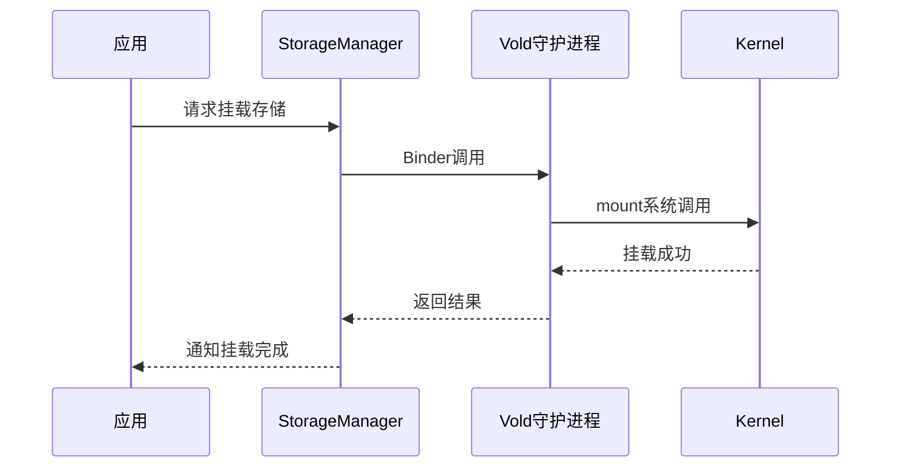

# Android 存储架构概述

## 学习目标

- 理解 Android 存储分区布局（system, vendor, data, cache）
- 了解存储框架演进（从传统到 Scoped Storage）
- 掌握 StorageManager 与 Vold
- 理解外部存储与可移动存储
- 了解 FUSE 在 Android 中的应用

## 概述

Android 存储架构包括分区管理、存储框架、权限控制等多个层面，是 Android 系统的核心组件。

---

## 一、Android 存储分区布局

### 分区类型

| 分区 | 挂载点 | 文件系统 | 说明 |
|-----|-------|---------|-----|
| system | /system | erofs | 系统分区（只读） |
| vendor | /vendor | erofs | 厂商分区（只读） |
| product | /product | erofs | 产品分区（只读） |
| data | /data | ext4/f2fs | 用户数据（读写） |
| cache | /cache | ext4/f2fs | 缓存数据（读写） |
| metadata | /metadata | ext4 | 元数据分区 |

### 分区布局图

```
Android 存储分区布局：

┌─────────────────────────────────────────────────────────────┐
│                    eMMC/UFS 存储设备                          │
├─────────────────────────────────────────────────────────────┤
│  ┌──────────┐  ┌──────────┐  ┌──────────┐  ┌──────────┐  │
│  │  system  │  │  vendor  │  │  product │  │  data    │  │
│  │ (erofs)  │  │ (erofs)  │  │ (erofs)  │  │(ext4/f2fs)│ │
│  │  只读    │  │  只读    │  │  只读    │  │  读写    │  │
│  └──────────┘  └──────────┘  └──────────┘  └──────────┘  │
│                                                              │
│  ┌──────────┐  ┌──────────┐  ┌──────────┐                │
│  │  cache   │  │ metadata │  │  userdata│                │
│  │(ext4/f2fs)│ │ (ext4)   │  │(ext4/f2fs)│                │
│  │  读写    │  │  读写    │  │  读写    │                │
│  └──────────┘  └──────────┘  └──────────┘                │
└─────────────────────────────────────────────────────────────┘
```

### 分区挂载

```bash
# 查看挂载信息
mount | grep -E "system|vendor|data|cache"

# 输出示例
/dev/block/sda2 on /system type erofs (ro,seclabel,relatime)
/dev/block/sda3 on /vendor type erofs (ro,seclabel,relatime)
/dev/block/sda5 on /data type f2fs (rw,seclabel,relatime,background_gc=on)
/dev/block/sda6 on /cache type f2fs (rw,seclabel,relatime)
```

---

## 二、存储框架演进

### 传统存储模型（Android 9 以前）

**特点**：
- 应用可以直接访问外部存储
- 使用路径权限控制
- 文件系统权限模型

**问题**：
- 权限控制不严格
- 应用可以随意访问其他应用数据
- 隐私保护不足

### Scoped Storage（Android 10+）

**特点**：
- 应用只能访问自己的文件
- 通过 MediaStore 访问媒体文件
- 通过 SAF 访问其他文件

**优势**：
- 更好的隐私保护
- 更严格的权限控制
- 更清晰的访问模型

---

## 三、StorageManager 与 Vold

### StorageManager

**作用**：管理存储设备和卷

```java
// frameworks/base/core/java/android/os/storage/StorageManager.java
public class StorageManager {
    // 获取存储卷
    public List<StorageVolume> getStorageVolumes();
    
    // 挂载/卸载
    public void mount(String volId);
    public void unmount(String volId);
    
    // 获取存储统计
    public StorageStatsManager getStorageStatsManager();
}
```

### Vold（Volume Daemon）

**作用**：底层存储管理守护进程

```cpp
// system/vold/main.cpp
int main(int argc, char** argv) {
    // 1. 初始化
    android::vold::VolumeManager* vm;
    vm = android::vold::VolumeManager::Instance();
    vm->start();
    
    // 2. 监听 Uevent
    android::vold::NetlinkManager* nm;
    nm = android::vold::NetlinkManager::Instance();
    nm->start();
    
    // 3. 进入事件循环
    android::IPCThreadState::self()->joinThreadPool();
    
    return 0;
}
```

### Vold 与 StorageManager 交互



---

## 四、外部存储与可移动存储

### 外部存储类型

| 类型 | 说明 | 挂载点 |
|-----|------|-------|
| 内部存储 | 设备内置存储 | /storage/emulated/0 |
| 外部存储 | SD 卡等 | /storage/XXXX-XXXX |
| USB 存储 | USB 设备 | /storage/XXXX-XXXX |

### 存储卷管理

```java
// frameworks/base/core/java/android/os/storage/StorageVolume.java
public class StorageVolume {
    private final String id;
    private final File path;
    private final String description;
    private final boolean primary;
    private final boolean removable;
    private final boolean emulated;
    // ...
}
```

---

## 五、FUSE 在 Android 中的应用

### FUSE 概念

FUSE（Filesystem in Userspace）允许在用户空间实现文件系统。

### Android 中的 FUSE

**使用场景**：
- 外部存储访问控制
- 文件权限管理
- 存储重定向

### FUSE 架构

```
用户空间
    │
    ▼
FUSE 文件系统（用户空间实现）
    │
    ▼
FUSE 库（libfuse）
    │
    ▼
/dev/fuse（内核FUSE驱动）
    │
    ▼
VFS 层
```

---

## 总结

### 核心要点

1. **分区布局**：
   - system/vendor：只读（erofs）
   - data/cache：读写（ext4/f2fs）

2. **存储框架**：
   - StorageManager：Java 层管理
   - Vold：Native 层管理

3. **存储演进**：
   - 传统模型 → Scoped Storage
   - 更好的隐私保护

### 后续学习

- [Scoped Storage与文件访问](16-Scoped%20Storage与文件访问.md) - 深入理解 Scoped Storage
- [文件权限与安全机制](17-文件权限与安全机制.md) - 权限管理

## 参考资源

- Android 源码：
  - `frameworks/base/core/java/android/os/storage/StorageManager.java`
  - `system/vold/` - Vold 实现

## 更新记录

- 2026-01-28：初始创建，包含 Android 存储架构概述
