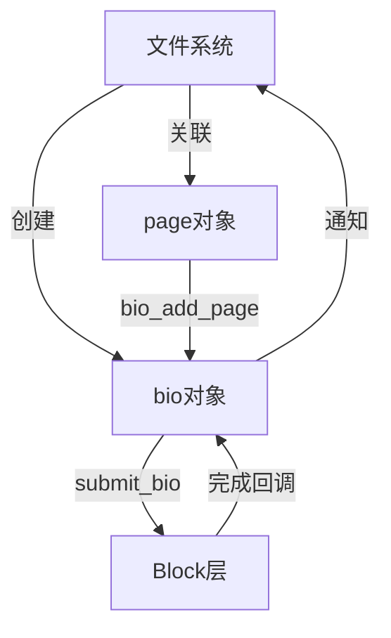

# 文件系统与 Block 层交互

## 学习目标

- 理解文件系统如何提交 IO（submit_bio）
- 掌握 bio 结构与文件系统的关系
- 了解 IO 调度对文件系统的影响
- 理解文件系统层面的 IO 优化

## 概述

文件系统与 Block 层是紧密相关的两个子系统。文件系统通过 submit_bio 向 Block 层提交 IO 请求，Block 层完成 IO 后回调文件系统。

---

## 一、文件系统如何提交 IO

### submit_bio() 函数

```c
// block/blk-core.c
void submit_bio(struct bio *bio)
{
    if (bio->bi_opf & REQ_OP_READ) {
        task_io_account_read(bio->bi_iter.bi_size);
        count_vm_events(PGPGIN, count);
    } else {
        task_io_account_write(bio->bi_iter.bi_size);
        count_vm_events(PGPGOUT, count);
    }
    
    // 提交到 Block 层
    generic_make_request(bio);
}
```

### 文件系统使用示例（ext4）

```c
// fs/ext4/inode.c
static int ext4_readpage(struct file *file, struct page *page)
{
    return mpage_readpage(page, ext4_get_block);
}

// fs/mpage.c
int mpage_readpage(struct page *page, get_block_t get_block)
{
    struct bio *bio = NULL;
    sector_t last_block_in_bio = 0;
    struct buffer_head map_bh;
    unsigned int first_block;
    struct inode *inode = page->mapping->host;
    
    // 1. 计算块号
    first_block = (page->index << (PAGE_SHIFT - inode->i_blkbits));
    
    // 2. 创建 bio
    bio = bio_alloc(GFP_KERNEL, 1);
    bio->bi_iter.bi_sector = first_block * (PAGE_SIZE >> 9);
    bio->bi_bdev = inode->i_sb->s_bdev;
    bio_add_page(bio, page, PAGE_SIZE, 0);
    
    // 3. 设置完成回调
    bio->bi_end_io = mpage_end_io;
    bio->bi_private = page;
    
    // 4. 提交到 Block 层
    submit_bio(REQ_OP_READ, bio);
    
    return 0;
}
```

---

## 二、bio 结构与文件系统

### bio 结构

```c
// include/linux/bio.h
struct bio {
    struct bio *bi_next;        // 下一个bio（链式）
    struct block_device *bi_bdev; // 块设备
    unsigned short bi_vcnt;     // 向量数
    unsigned short bi_max_vecs; // 最大向量数
    unsigned short bi_opf;      // 操作标志
    blk_status_t bi_status;     // 状态
    struct bvec_iter bi_iter;    // 迭代器
    bio_end_io_t *bi_end_io;    // 完成回调
    void *bi_private;            // 私有数据
    // ...
};
```

### bio 向量（bio_vec）

```c
// include/linux/bio.h
struct bio_vec {
    struct page *bv_page;       // 页
    unsigned int bv_len;        // 长度
    unsigned int bv_offset;     // 偏移
};
```

### 文件系统与 bio 的关系



---

## 三、IO 调度对文件系统的影响

### IO 调度器作用

IO 调度器决定 IO 请求的执行顺序，影响文件系统的性能。

### 调度器类型

| 调度器 | 特点 | 适用场景 |
|-------|------|---------|
| noop | 简单FIFO | 闪存设备 |
| deadline | 截止时间 | 数据库 |
| cfq | 完全公平 | 桌面系统 |
| bfq | 预算公平 | 交互式应用 |

### 调度器选择

```bash
# 查看当前调度器
cat /sys/block/sda/queue/scheduler
# [noop] deadline cfq

# 设置调度器
echo deadline > /sys/block/sda/queue/scheduler
```

---

## 四、文件系统层面的 IO 优化

### 1. 延迟分配（Delayed Allocation）

**ext4 延迟分配**：
- 写入时先分配逻辑块
- 实际写入时才分配物理块
- 减少碎片，提高性能

### 2. 多块分配（Multi-block Allocation）

**ext4 多块分配**：
- 一次分配多个连续块
- 减少碎片
- 提高顺序写入性能

### 3. 预分配（Preallocation）

**f2fs 预分配**：
- 预测性分配段
- 减少 GC 压力
- 提高写入性能

---

## 总结

### 核心要点

1. **文件系统提交 IO**：
   - 通过 submit_bio 提交
   - 创建 bio 对象
   - 设置完成回调

2. **bio 结构**：
   - 连接文件系统和 Block 层
   - 包含页和块信息

3. **IO 调度影响**：
   - 影响 IO 执行顺序
   - 影响文件系统性能

### 后续学习

- [文件系统性能分析](19-文件系统性能分析.md) - 性能优化
- [文件系统调试与问题排查](20-文件系统调试与问题排查.md) - 调试方法

## 参考资源

- 内核源码：
  - `block/blk-core.c` - Block 层核心
  - `fs/ext4/inode.c` - ext4 IO 提交
  - `include/linux/bio.h` - bio 定义

## 更新记录

- 2026-01-28：初始创建，包含文件系统与 Block 层交互详解
