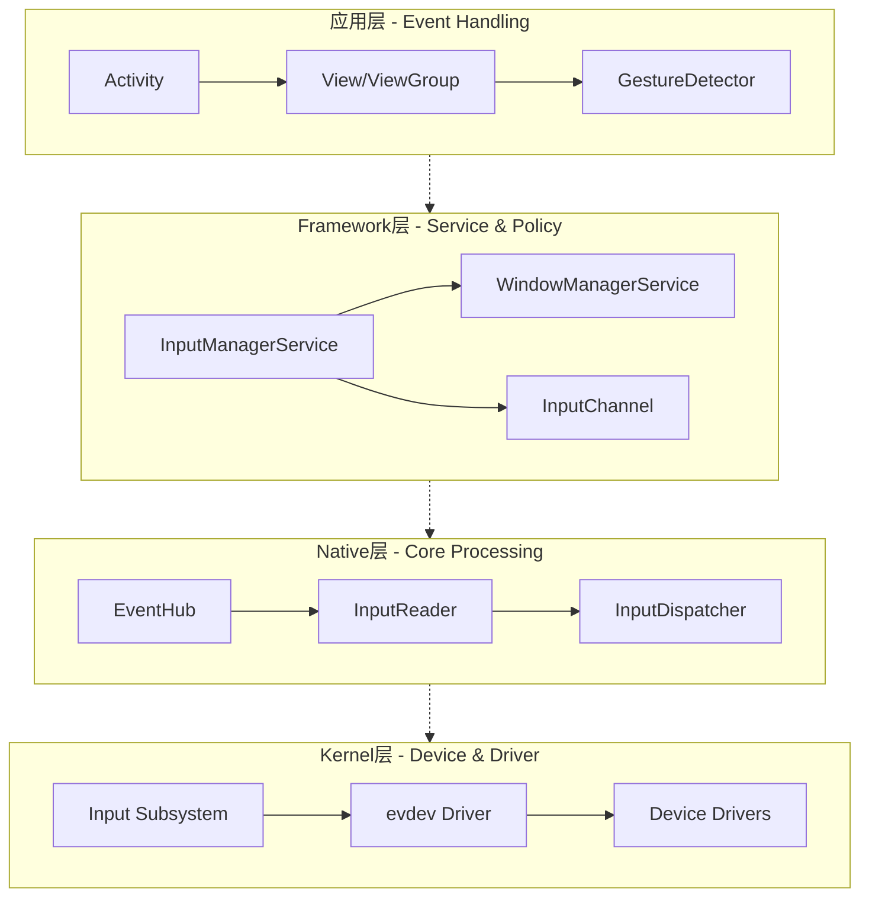
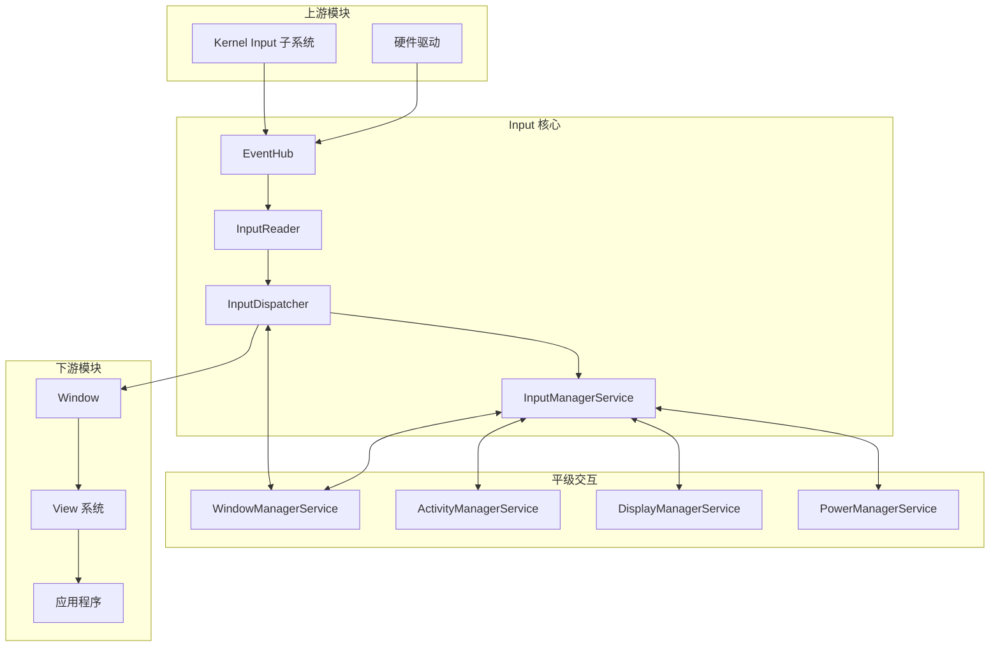

# Input 系统概述与架构设计

## 引言

Android Input 系统是连接用户和设备的关键桥梁，负责处理所有用户输入事件（触摸、按键、鼠标、手写笔等）。作为 Android 系统中最核心的子系统之一，Input 系统贯穿了从硬件驱动到应用层的整个技术栈，与 WindowManagerService、ActivityManagerService 等核心服务紧密协作。

本文从架构师视角出发，建立对 Input 系统的全局认知，帮助读者理解其分层设计、模块关系以及核心工作流程。

---

## 1. Input 系统在 Android 中的位置

### 1.1 系统架构定位

```
┌─────────────────────────────────────────────────────────────────────┐
│                         应用层 (Application)                         │
│  ┌─────────────┐ ┌─────────────┐ ┌─────────────┐ ┌─────────────┐   │
│  │   Activity  │ │   Dialog    │ │   PopupWin  │ │  InputMethod│   │
│  └──────┬──────┘ └──────┬──────┘ └──────┬──────┘ └──────┬──────┘   │
│         └────────────────┼──────────────┼──────────────┘           │
│                          ▼              ▼                          │
│                    View/ViewGroup 事件分发                          │
└─────────────────────────────────────────────────────────────────────┘
                                   │
                                   ▼
┌─────────────────────────────────────────────────────────────────────┐
│                       Framework 层 (Java)                           │
│  ┌─────────────────────┐      ┌─────────────────────────────────┐  │
│  │ InputManagerService │◄────►│    WindowManagerService         │  │
│  │       (IMS)         │      │         (WMS)                   │  │
│  └──────────┬──────────┘      └──────────────────────────────────┘  │
│             │ JNI                                                   │
└─────────────┼───────────────────────────────────────────────────────┘
              ▼
┌─────────────────────────────────────────────────────────────────────┐
│                        Native 层 (C++)                              │
│  ┌────────────────────────────────────────────────────────────────┐│
│  │                      InputFlinger                              ││
│  │  ┌───────────┐    ┌────────────┐    ┌─────────────────┐       ││
│  │  │ EventHub  │───►│InputReader │───►│ InputDispatcher │       ││
│  │  └───────────┘    └────────────┘    └─────────────────┘       ││
│  └────────────────────────────────────────────────────────────────┘│
└─────────────────────────────────────────────────────────────────────┘
                                   │
                                   ▼ /dev/input/eventX
┌─────────────────────────────────────────────────────────────────────┐
│                        Kernel 层 (Linux)                            │
│  ┌────────────────────────────────────────────────────────────────┐│
│  │                     Input Subsystem                            ││
│  │  ┌───────────┐    ┌──────────────┐    ┌─────────────────┐     ││
│  │  │ input_dev │    │input_handler │    │     evdev       │     ││
│  │  │ (设备抽象)│    │  (事件处理)  │    │  (字符设备驱动)  │     ││
│  │  └───────────┘    └──────────────┘    └─────────────────┘     ││
│  └────────────────────────────────────────────────────────────────┘│
└─────────────────────────────────────────────────────────────────────┘
                                   │
                                   ▼
┌─────────────────────────────────────────────────────────────────────┐
│                         硬件层 (Hardware)                           │
│      触摸屏控制器    │   按键矩阵   │   触摸板   │   遥控器         │
└─────────────────────────────────────────────────────────────────────┘
```

### 1.2 核心职责

Input 系统承担以下核心职责：

| 职责 | 描述 | 涉及层级 |
|-----|------|---------|
| 设备管理 | 发现、配置、监控输入设备 | Kernel/Native |
| 事件采集 | 从设备读取原始输入事件 | Kernel/Native |
| 事件处理 | 事件合成、坐标转换、手势识别 | Native |
| 事件分发 | 确定目标窗口并分发事件 | Native/Framework |
| 焦点管理 | 维护窗口焦点和应用焦点状态 | Framework |
| 超时监控 | ANR 检测与处理 | Native/Framework |

---

## 2. 四层递进架构

### 2.1 架构设计理念

Android Input 系统采用经典的**分层架构**设计：




### 2.2 各层职责详解

#### Kernel 层

**核心组件**：
- **input_dev**：输入设备的抽象表示
- **input_handler**：事件处理器（如 evdev）
- **evdev**：通用事件设备驱动，创建 `/dev/input/eventX`

**关键职责**：
1. 设备注册与管理
2. 原始事件采集
3. 事件标准化（input_event 结构）
4. 用户空间接口（字符设备）

```c
// 内核 input_event 结构
struct input_event {
    struct timeval time;    // 事件时间戳
    __u16 type;             // 事件类型 (EV_KEY, EV_ABS, EV_SYN...)
    __u16 code;             // 事件码
    __s32 value;            // 事件值
};
```

#### Native 层

**核心组件**：

- **EventHub**：设备管理与事件读取
- **InputReader**：事件处理与合成
- **InputDispatcher**：事件分发

**关键职责**：
1. 监控 `/dev/input/` 目录的设备变化
2. 读取原始事件并进行预处理
3. 坐标转换、多点触控合成
4. 确定目标窗口并分发事件
5. ANR 超时检测

```cpp
// Native 层核心处理流程
void InputReader::loopOnce() {
    // 1. 从 EventHub 读取事件
    size_t count = mEventHub->getEvents(timeout, mEventBuffer, EVENT_BUFFER_SIZE);
    
    // 2. 处理事件
    if (count) {
        processEventsLocked(mEventBuffer, count);
    }
    
    // 3. 刷新到 InputDispatcher
    mQueuedListener->flush();
}
```

#### Framework 层

**核心组件**：
- **InputManagerService (IMS)**：输入管理服务
- **WindowManagerService (WMS)**：窗口管理服务
- **InputChannel**：跨进程通信通道

**关键职责**：
1. 提供 Java 层输入管理接口
2. 窗口焦点和应用焦点管理
3. 输入策略（系统按键处理）
4. InputChannel 的创建与管理

```java
// IMS 初始化
public class InputManagerService extends IInputManager.Stub {
    private final long mPtr;  // Native 对象指针
    
    public InputManagerService(Context context) {
        mPtr = nativeInit(this, mContext, mHandler.getLooper().getQueue());
    }
}
```

#### 应用层

**核心组件**：
- **Activity/Window**：事件的最终消费者
- **View/ViewGroup**：事件分发链
- **GestureDetector**：手势识别

**关键职责**：
1. 接收并处理输入事件
2. 事件分发（dispatchTouchEvent/dispatchKeyEvent）
3. 手势识别与处理

---

## 3. 模块关系总图

### 3.1 上下游与平级模块



> **注意**：图中 `InputDispatcher --> Window` 表示通过 **InputChannel (Socket)** 直接跨进程通信，
> 事件**不经过** Java 层的 IMS/WMS 转发。IMS/WMS 的作用是建立 InputChannel 连接和焦点管理。
> 详见 [19-Input事件分发通信与拦截机制](19-Input事件分发通信与拦截机制.md)。

### 3.2 模块交互说明

| 交互关系 | 模块A | 模块B | 交互内容 |
|---------|-------|-------|---------|
| 上游 | Kernel | EventHub | 通过 /dev/input/ 读取事件 |
| 内部 | InputReader | InputDispatcher | 传递处理后的事件 |
| 平级 | IMS | WMS | 获取焦点窗口、窗口信息 |
| 平级 | IMS | AMS | 获取焦点应用、ANR 处理 |
| 平级 | IMS | PMS | 用户活动通知（唤醒屏幕） |
| 下游 | InputDispatcher | Window | 通过 InputChannel 分发事件 |

---

## 4. 核心数据流

### 4.1 事件流转全景

```
┌─────────┐    ┌─────────┐    ┌───────────┐    ┌───────────────┐
│ 硬件中断 │───►│input_dev│───►│input_event│───►│/dev/input/    │
└─────────┘    └─────────┘    └───────────┘    │  eventX       │
                                               └───────┬───────┘
                                                       │ read()
┌──────────────────────────────────────────────────────▼───────────┐
│                          EventHub                                 │
│  epoll_wait() → read() → RawEvent                                │
└──────────────────────────────────┬────────────────────────────────┘
                                   │
┌──────────────────────────────────▼────────────────────────────────┐
│                         InputReader                               │
│  RawEvent → InputMapper → NotifyArgs                             │
│  (KeyboardInputMapper, TouchInputMapper, ...)                    │
└──────────────────────────────────┬────────────────────────────────┘
                                   │
┌──────────────────────────────────▼────────────────────────────────┐
│                       InputDispatcher                             │
│  NotifyArgs → EventEntry → Connection → InputChannel             │
│  (查找焦点窗口, 事件队列管理, ANR检测)                              │
└──────────────────────────────────┬────────────────────────────────┘
                                   │ Socket
┌──────────────────────────────────▼────────────────────────────────┐
│                      InputChannel (App)                           │
│  InputPublisher → InputConsumer                                  │
└──────────────────────────────────┬────────────────────────────────┘
                                   │
┌──────────────────────────────────▼────────────────────────────────┐
│                         ViewRootImpl         todo?这里怎么会有IME这些，不是用户空间吗                      │
│  InputStage 链式处理                                               │
│  (NativePreIme → ViewPreIme → Ime → EarlyPost → Native → View)   │
└──────────────────────────────────┬────────────────────────────────┘
                                   │
┌──────────────────────────────────▼────────────────────────────────┐
│                          View 系统                                │
│  dispatchTouchEvent() / dispatchKeyEvent()                       │
└───────────────────────────────────────────────────────────────────┘
```

### 4.2 关键数据结构转换

| 阶段 | 数据结构 | 描述 |
|-----|---------|------|
| Kernel | input_event | 原始事件（type/code/value） |
| EventHub | RawEvent | 添加设备 ID |
| InputReader | NotifyArgs | 事件加工后（合成触摸点等） |
| InputDispatcher | EventEntry | 添加分发信息 |
| InputChannel | InputMessage | 序列化传输格式 |
| App | InputEvent | Java 层事件对象 |

---

## 5. 关键设计决策

### 5.1 为什么使用分层架构？

| 设计考量 | 解决方案 |
|---------|---------|
| 设备多样性 | Kernel 层统一抽象，Native 层差异化处理 |
| 性能要求 | Native 层 C++ 处理核心逻辑，低延迟 |
| 安全隔离 | 事件只发送给焦点窗口，权限校验 |
| 可扩展性 | 分层解耦，各层独立演进 |

### 5.2 为什么 InputDispatcher 在 Native 层？

1. **性能**：事件分发是高频操作，C++ 实现延迟更低
2. **实时性**：避免 Java GC 影响
3. **复杂性**：需要管理多个窗口的事件队列
4. **ANR 检测**：需要精确的超时控制

### 5.3 为什么使用 InputChannel？

1. **跨进程通信**：应用运行在独立进程
2. **双向通信**：需要事件完成反馈（finish 信号）
3. **低延迟**：使用 Socket 而非 Binder
4. **批量处理**：支持事件批处理提升效率

---

## 6. 源码目录结构

### 6.1 Kernel 层

```
drivers/input/
├── input.c              # Input 核心
├── evdev.c              # evdev 驱动
├── keyboard/            # 键盘驱动
├── touchscreen/         # 触摸屏驱动
└── misc/                # 其他设备驱动

include/uapi/linux/
├── input.h              # input_event 定义
└── input-event-codes.h  # 事件码定义
```

### 6.2 Native 层

```
frameworks/native/services/inputflinger/
├── InputManager.cpp           # InputManager 入口
├── reader/
│   ├── EventHub.cpp           # 设备管理、事件读取
│   ├── InputReader.cpp        # 事件处理主循环
│   └── InputMapper.cpp        # 各类型事件映射器
├── dispatcher/
│   ├── InputDispatcher.cpp    # 事件分发核心
│   └── Connection.cpp         # 窗口连接管理
└── InputChannel.cpp           # 通信通道
```

### 6.3 Framework 层

```
frameworks/base/services/core/java/com/android/server/input/
├── InputManagerService.java   # IMS 实现
└── InputManagerInternal.java  # 内部接口

frameworks/base/services/core/java/com/android/server/wm/
├── WindowManagerService.java  # WMS 实现
├── InputMonitor.java          # 输入监控
└── WindowState.java           # 窗口状态

frameworks/base/core/java/android/view/
├── InputEvent.java            # 事件基类
├── MotionEvent.java           # 触摸事件
├── KeyEvent.java              # 按键事件
├── InputChannel.java          # Java 层 InputChannel
└── ViewRootImpl.java          # 事件接收入口
```

---

## 7. 本章小结

本文从架构师视角介绍了 Android Input 系统的整体架构：

1. **四层递进架构**：Kernel → Native → Framework → App
2. **核心组件**：EventHub、InputReader、InputDispatcher、IMS
3. **模块关系**：上游（驱动）、平级（WMS/AMS）、下游（View系统）
4. **数据流转**：input_event → RawEvent → NotifyArgs → EventEntry → InputEvent

下一篇文章将深入介绍 Input 系统的核心数据结构与事件模型。

---

## 参考资料

1. Android 源码：`frameworks/native/services/inputflinger/`
2. Linux Kernel 文档：`Documentation/input/`
3. [Android Input System Architecture](https://source.android.com/docs/core/interaction/input)
