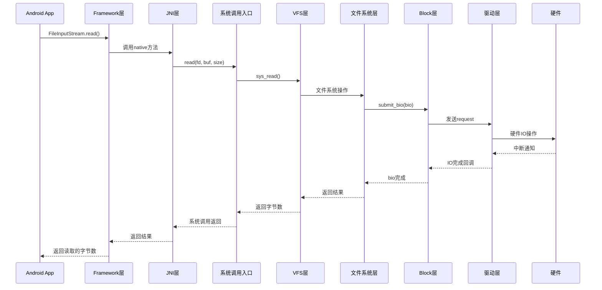
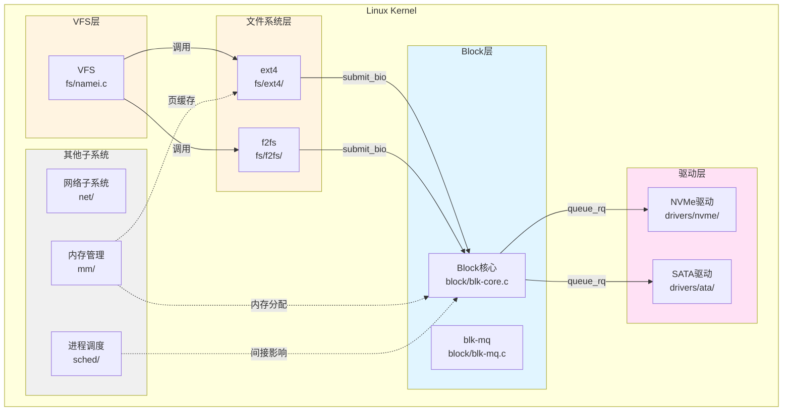
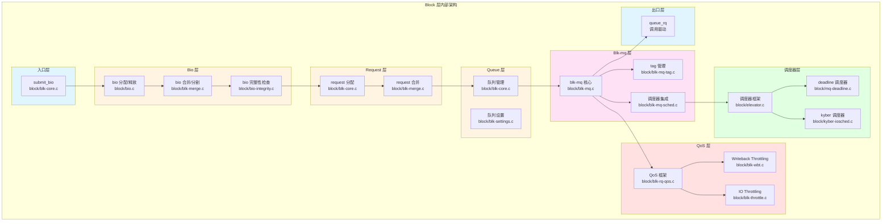
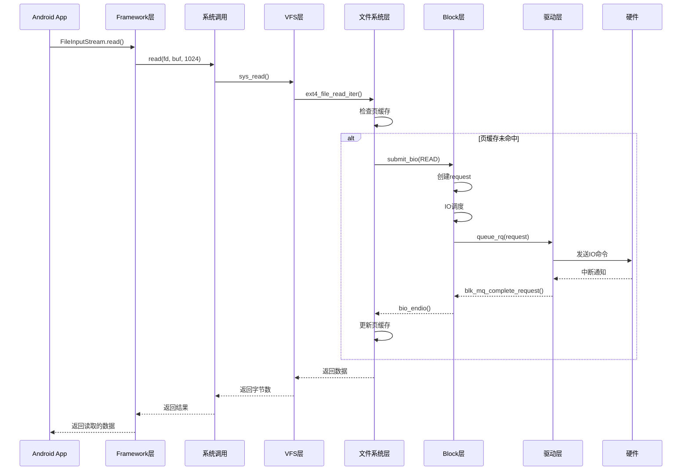

# Block 层概述与架构设计

## 学习目标

- 从 Framework 层视角理解 Block 层在整个系统架构中的位置
- 理解 Framework → Kernel → Hardware 的完整交互链路
- 掌握 Block 层在 Kernel 内部的位置和上下游关系
- 了解 Block 层的核心职责和主要组件
- 理解 Block 层与其他 Kernel 模块的关系

## 一、系统整体架构视角（Framework → Kernel → Hardware）

### Framework 层在 Android 系统架构中的位置

Android 系统采用分层架构，从应用层到硬件层，主要分为以下几个层次：

```
┌─────────────────────────────────────────────────────────┐
│                   应用层（Application）                   │
│              Android App（Java/Kotlin）                  │
└────────────────────┬────────────────────────────────────┘
                      │ JNI
┌─────────────────────▼────────────────────────────────────┐
│              Framework 层（Java Framework）               │
│  ┌────────────────────────────────────────────────────┐  │
│  │  Java API（FileInputStream, FileOutputStream等）   │  │
│  │  System Services（StorageManager等）                │  │
│  └────────────────────┬───────────────────────────────┘  │
│  ┌────────────────────▼───────────────────────────────┐  │
│  │  JNI 层（libcore, libnativehelper等）              │  │
│  └────────────────────┬───────────────────────────────┘  │
└───────────────────────┼───────────────────────────────────┘
                        │ 系统调用（sys_read, sys_write等）
┌───────────────────────▼───────────────────────────────────┐
│                  Kernel 层（Linux Kernel）                 │
│  ┌────────────────────────────────────────────────────┐  │
│  │  系统调用入口（entry_SYSCALL_64等）                │  │
│  └────────────────────┬───────────────────────────────┘  │
│  ┌────────────────────▼───────────────────────────────┐  │
│  │  VFS 层（虚拟文件系统层）                           │  │
│  └────────────────────┬───────────────────────────────┘  │
│  ┌────────────────────▼───────────────────────────────┐  │
│  │  文件系统层（ext4, f2fs等）                        │  │
│  └────────────────────┬───────────────────────────────┘  │
│  ┌────────────────────▼───────────────────────────────┐  │
│  │  Block 层（块设备层）                              │  │
│  └────────────────────┬───────────────────────────────┘  │
│  ┌────────────────────▼───────────────────────────────┐  │
│  │  设备驱动层（NVMe, SATA, eMMC驱动等）             │  │
│  └────────────────────┬───────────────────────────────┘  │
└───────────────────────┼───────────────────────────────────┘
                        │ 硬件接口（PCIe, SATA, eMMC等）
┌───────────────────────▼───────────────────────────────────┐
│                   硬件层（Hardware）                        │
│             存储设备（SSD, HDD, eMMC等）                  │
└───────────────────────────────────────────────────────────┘
```

### Framework → Kernel → Hardware 的完整交互链路

当 Android 应用执行文件 IO 操作时，数据流经过以下路径：

#### 1. Framework 层到 Kernel 层的转换

**Framework 层的操作**：
```java
// Android Framework 层代码示例
FileInputStream fis = new FileInputStream("/data/file.txt");
byte[] buffer = new byte[1024];
int bytesRead = fis.read(buffer);  // 触发 IO 操作
```

**转换过程**：
1. **Java API 调用**：`FileInputStream.read()` 是 Java 层的 API
2. **JNI 调用**：Java 代码通过 JNI 调用到 native 层（如 `libcore`）
3. **系统调用**：native 层调用 Linux 系统调用（如 `read()`）
4. **进入 Kernel**：通过系统调用入口（如 `entry_SYSCALL_64`）进入内核空间

**关键系统调用**：
- `sys_read()` / `sys_write()`：读写文件
- `sys_open()` / `sys_close()`：打开/关闭文件
- `sys_fsync()`：同步文件数据到磁盘
- `sys_ioctl()`：设备控制操作

#### 2. Kernel 层到硬件层的交互

**Kernel 层的处理**：
1. **VFS 层**：处理路径解析、权限检查、文件操作分发
2. **文件系统层**：处理文件系统特定的操作（如 ext4 的读写）
3. **Block 层**：将文件操作转换为块设备 IO 请求
4. **驱动层**：将 IO 请求发送给硬件设备

**硬件交互**：
1. **驱动与硬件通信**：通过 PCIe、SATA、eMMC 等接口与硬件通信
2. **硬件执行 IO**：硬件设备执行实际的读写操作
3. **中断通知**：硬件完成 IO 后，通过中断通知驱动
4. **回调链**：驱动 → Block 层 → 文件系统层 → VFS 层 → 系统调用返回 → Framework 层

### Framework 层如何通过系统调用与 Kernel 交互

Framework 层通过以下方式与 Kernel 交互：

#### 1. 系统调用接口

系统调用是用户空间（Framework 层）与内核空间（Kernel 层）的唯一标准接口：

```c
// 系统调用定义（简化示例）
SYSCALL_DEFINE3(read, unsigned int, fd, char __user *, buf, size_t, count)
{
    // 内核处理逻辑
    return ksys_read(fd, buf, count);
}
```

#### 2. 系统调用流程



#### 3. Framework 层如何感知 Block 层的状态

Framework 层**不能直接感知** Block 层的状态，但可以通过以下方式间接感知：

1. **系统调用返回值**：通过 `read()` / `write()` 的返回值判断 IO 是否成功
2. **错误码**：通过 `errno` 获取详细的错误信息
3. **阻塞/非阻塞**：通过文件描述符的标志位控制 IO 行为
4. **统计信息**：通过 `/proc` 或 `/sys` 文件系统查看 IO 统计信息

### Kernel 如何通过驱动与硬件交互

#### 1. 驱动与硬件的接口

**PCIe 设备**（如 NVMe SSD）：
- 通过 PCIe 配置空间识别设备
- 通过 MMIO（Memory-Mapped I/O）访问设备寄存器
- 通过 DMA 传输数据

**SATA 设备**：
- 通过 ATA 命令集与设备通信
- 通过 PIO（Programmed I/O）或 DMA 传输数据

**eMMC/UFS 设备**：
- 通过 MMC/UFS 协议与设备通信
- 通过命令队列发送 IO 请求

#### 2. 硬件中断处理

当硬件完成 IO 操作后，会触发中断：

```c
// 驱动中断处理示例（简化）
static irqreturn_t nvme_irq(int irq, void *data)
{
    struct nvme_queue *nvmeq = data;
    
    // 处理完成的中断
    nvme_process_cq(nvmeq);
    
    // 通知 Block 层 IO 完成
    blk_mq_complete_request(rq);
    
    return IRQ_HANDLED;
}
```

---

## 二、Kernel 内部架构视角

### Kernel 内部的主要子系统划分

Linux Kernel 内部主要分为以下几个子系统：

```
┌─────────────────────────────────────────────────────────┐
│                  Linux Kernel 内部架构                    │
│                                                           │
│  ┌──────────────┐  ┌──────────────┐  ┌──────────────┐   │
│  │  进程调度    │  │  内存管理    │  │  网络子系统  │   │
│  │  (sched/)    │  │   (mm/)      │  │   (net/)     │   │
│  └──────────────┘  └──────────────┘  └──────────────┘   │
│         │                │                    │          │
│         │                │                    │          │
│  ┌──────▼────────────────▼────────────────────▼──────┐  │
│  │            VFS 层（虚拟文件系统层）                │  │
│  │              fs/namei.c, fs/inode.c                │  │
│  └──────────────────────┬────────────────────────────┘  │
│                         │                                 │
│  ┌──────────────────────▼────────────────────────────┐  │
│  │           文件系统层（ext4, f2fs等）               │  │
│  │              fs/ext4/, fs/f2fs/                    │  │
│  └──────────────────────┬────────────────────────────┘  │
│                         │                                 │
│  ┌──────────────────────▼────────────────────────────┐  │
│  │            Block 层（块设备层）                    │  │
│  │              block/blk-core.c, block/blk-mq.c     │  │
│  └──────────────────────┬────────────────────────────┘  │
│                         │                                 │
│  ┌──────────────────────▼────────────────────────────┐  │
│  │           设备驱动层（NVMe, SATA等）              │  │
│  │              drivers/nvme/, drivers/ata/          │  │
│  └────────────────────────────────────────────────────┘  │
└─────────────────────────────────────────────────────────┘
```

### Block 层在 Kernel 整体架构中的位置

Block 层位于文件系统层和设备驱动层之间，是 IO 路径中的关键中间层：

**位置特点**：
- **上游**：接收来自 VFS 层和文件系统层的 IO 请求
- **下游**：将 IO 请求发送给设备驱动层
- **核心职责**：管理 IO 请求的队列、调度、合并等

### Block 层的上下游关系

#### 上游：VFS 层和文件系统层

**VFS 层如何调用 Block 层**：

1. **文件系统层调用**：当文件系统（如 ext4）需要执行实际的块设备 IO 时，会调用 Block 层的接口：

```c
// 文件系统层调用 Block 层（简化示例）
// fs/ext4/inode.c
static int ext4_readpage(struct file *file, struct page *page)
{
    // 创建 bio
    struct bio *bio = bio_alloc(GFP_NOFS, 1);
    
    // 设置 bio 参数
    bio->bi_bdev = inode->i_sb->s_bdev;
    bio->bi_iter.bi_sector = (page->index << (PAGE_SHIFT - 9));
    bio_add_page(bio, page, PAGE_SIZE, 0);
    
    // 提交到 Block 层
    submit_bio(REQ_OP_READ, bio);
    
    return 0;
}
```

2. **关键接口**：`submit_bio()` 是 VFS/文件系统层调用 Block 层的主要接口

**源码位置**：
- `block/blk-core.c:submit_bio()` - Block 层的入口函数
- `fs/ext4/inode.c` - ext4 文件系统调用 Block 层的示例

#### 下游：设备驱动层

**Block 层如何调用驱动层**：

1. **驱动注册接口**：驱动通过 `blk_mq_ops` 结构体向 Block 层注册操作函数：

```c
// 驱动层向 Block 层注册（简化示例）
// drivers/nvme/host/core.c
static const struct blk_mq_ops nvme_mq_ops = {
    .queue_rq       = nvme_queue_rq,      // 处理 IO 请求
    .complete       = nvme_complete_rq,  // IO 完成回调
    .init_hctx      = nvme_init_hctx,    // 初始化硬件队列
    .init_request   = nvme_init_request,  // 初始化请求
};
```

2. **Block 层调用驱动**：Block 层通过 `queue_rq()` 将 request 发送给驱动：

```c
// Block 层调用驱动（简化示例）
// block/blk-mq.c
static void blk_mq_dispatch_rq_list(...)
{
    // 获取驱动操作函数
    struct blk_mq_ops *ops = hctx->queue->mq_ops;
    
    // 调用驱动的 queue_rq 函数
    ret = ops->queue_rq(hctx, rq);
}
```

**关键接口**：
- `blk_mq_ops.queue_rq` - Block 层调用驱动处理请求
- `blk_mq_complete_request()` - 驱动通知 Block 层请求完成

### Block 层的同级模块

#### 1. 网络子系统（net/）- 同级但无直接联系

**特点**：
- 处理网络 IO（TCP/IP、UDP 等）
- 与 Block 层**无直接联系**，因为网络 IO 和块设备 IO 是完全不同的路径
- 都依赖内存管理子系统（mm/）进行内存分配

**关系**：
```
网络子系统（net/）          Block 层（block/）
      │                           │
      │                           │
      └───────────┬───────────────┘
                  │
          内存管理子系统（mm/）
```

#### 2. 进程调度子系统（sched/）- 同级但无直接联系

**特点**：
- 负责进程和线程的调度
- 与 Block 层**无直接联系**，但可能间接影响 IO 调度：
  - IO 调度器可能考虑进程优先级
  - IO 等待可能影响进程调度

**关系**：
```
进程调度子系统（sched/）    Block 层（block/）
      │                           │
      │        (间接影响)         │
      │      IO 优先级/等待       │
      └───────────┬───────────────┘
```

#### 3. 内存管理子系统（mm/）- 有间接联系

**特点**：
- 提供页缓存（Page Cache）机制
- 提供内存分配接口（kmalloc、vmalloc 等）
- 与 Block 层有**间接联系**：
  - Block 层的 bio 需要分配内存
  - 文件系统通过页缓存与 Block 层交互
  - Block 层的 IO 可能触发页缓存的读写

**关系**：
```
内存管理子系统（mm/）
      │
      ├─── 提供内存分配 ───> Block 层（分配 bio、request）
      │
      └─── 页缓存机制 ───> 文件系统层 ───> Block 层
```

**关键交互点**：
- `bio_alloc()` - Block 层分配 bio 时调用内存分配
- 页缓存的读写操作最终会调用 Block 层

### Kernel 内部模块关系图



**说明**：
- **实线箭头**：直接调用关系
- **虚线箭头**：间接联系关系
- **蓝色背景**：Block 层（本文重点）
- **黄色背景**：Block 层的上游
- **粉色背景**：Block 层的下游
- **灰色背景**：同级但无直接联系的模块

---

## 三、Block 层内部架构

### Block 层的核心职责

Block 层是 Linux 内核中负责块设备 IO 管理的核心子系统，主要职责包括：

1. **IO 请求管理**：接收、队列、调度 IO 请求
2. **请求合并**：将相邻扇区的多个请求合并为一个，提高效率
3. **IO 调度**：通过调度器优化 IO 请求的顺序，提高吞吐量和响应时间
4. **多队列支持**：通过 blk-mq 支持多队列并行处理
5. **QoS 控制**：提供 IO 限流、延迟控制等 QoS 机制
6. **设备抽象**：为上层提供统一的块设备接口

### Block 层的主要组件

#### 1. Bio 机制（Block IO）

**作用**：Block IO 的基本单位，表示一个 IO 操作

**关键文件**：
- `block/bio.c` - bio 的分配、释放、合并等操作
- `include/linux/bio.h` - bio 数据结构定义

**特点**：
- 可以包含多个不连续的内存段（通过 biovec）
- 支持合并和分割
- 支持完整性检查和加密

#### 2. Request 机制

**作用**：IO 请求，由一个或多个 bio 组成

**关键文件**：
- `block/blk-core.c` - request 的分配、释放
- `include/linux/blkdev.h` - request 数据结构定义

**特点**：
- 一个 request 可以包含多个 bio（合并后的结果）
- 支持请求的合并和重排序
- 通过 tag 机制实现高效的请求标识

#### 3. Request Queue 管理

**作用**：管理 IO 请求队列

**关键文件**：
- `block/blk-core.c` - 队列的创建、初始化
- `block/blk-settings.c` - 队列参数设置

**特点**：
- 每个块设备对应一个 request_queue
- 管理队列标志、限制、统计信息等

#### 4. Blk-mq 多队列机制

**作用**：多队列 IO 处理机制，提高多核系统的性能

**关键文件**：
- `block/blk-mq.c` - blk-mq 核心实现
- `block/blk-mq-tag.c` - tag 管理
- `block/blk-mq-sched.c` - 调度器集成

**特点**：
- 软件队列（按 CPU 分配）和硬件队列（按设备分配）
- 使用 tag 机制实现高效的请求标识
- 支持多队列并行处理

#### 5. IO 调度器

**作用**：优化 IO 请求的顺序，提高吞吐量和响应时间

**关键文件**：
- `block/elevator.c` - 调度器框架
- `block/mq-deadline.c` - deadline 调度器
- `block/kyber-iosched.c` - kyber 调度器
- `block/bfq-iosched.c` - BFQ 调度器

**特点**：
- 支持多种调度算法
- 可以动态切换调度器
- 支持无调度器模式（none）

#### 6. QoS 机制

**作用**：提供 IO 限流、延迟控制等 QoS 功能

**关键文件**：
- `block/blk-rq-qos.c` - QoS 框架
- `block/blk-wbt.c` - Writeback Throttling
- `block/blk-throttle.c` - IO Throttling
- `block/blk-iolatency.c` - IO Latency 控制
- `block/blk-iocost.c` - IO Cost 模型

**特点**：
- 支持多种 QoS 策略
- 可以组合使用多个 QoS 机制
- 支持 cgroup 集成

### Block 层内部架构图



### 关键数据结构概览

#### 1. struct bio

**定义位置**：`include/linux/bio.h`

**作用**：表示一个 Block IO 操作

**关键字段**：
```c
struct bio {
    struct bio *bi_next;           // bio 链表
    struct block_device *bi_bdev;  // 块设备
    unsigned short bi_vcnt;        // biovec 数量
    struct bio_vec *bi_io_vec;     // biovec 数组
    // ...
};
```

#### 2. struct request

**定义位置**：`include/linux/blkdev.h`

**作用**：表示一个 IO 请求

**关键字段**：
```c
struct request {
    struct request_queue *q;       // 所属队列
    struct bio *bio;               // bio 链表头
    struct bio *biotail;           // bio 链表尾
    unsigned int cmd_flags;        // 命令标志
    // ...
};
```

#### 3. struct request_queue

**定义位置**：`include/linux/blkdev.h`

**作用**：表示一个请求队列

**关键字段**：
```c
struct request_queue {
    struct elevator_queue *elevator;  // IO 调度器
    struct blk_mq_ops *mq_ops;         // blk-mq 操作函数
    unsigned int nr_hw_queues;         // 硬件队列数量
    // ...
};
```

---

## 四、Framework 与 Block 层的交互

### Framework 层如何触发 IO 操作

#### 1. 典型的 Framework 层 IO 操作

**Java 层代码**：
```java
// Android Framework 示例
FileInputStream fis = new FileInputStream("/data/file.txt");
byte[] buffer = new byte[1024];
int bytesRead = fis.read(buffer);
```

**调用链**：
```
FileInputStream.read()
    ↓
JNI: libcore_io_Posix.readBytes()
    ↓
系统调用: read(fd, buf, size)
    ↓
Kernel: sys_read()
    ↓
VFS: vfs_read()
    ↓
文件系统: ext4_file_read_iter()
    ↓
Block 层: submit_bio()
```

#### 2. 系统调用如何到达 Block 层

**完整路径**：
```
用户空间 read() 系统调用
    ↓
entry_SYSCALL_64 (系统调用入口)
    ↓
sys_read() (fs/read_write.c)
    ↓
vfs_read() (fs/read_write.c)
    ↓
file->f_op->read_iter() (VFS 分发)
    ↓
ext4_file_read_iter() (文件系统实现)
    ↓
generic_file_read_iter() (通用文件读取)
    ↓
do_generic_file_read() (页缓存处理)
    ↓
submit_bio() (调用 Block 层)
    ↓
blk_mq_submit_bio() (Block 层处理)
```

### Block 层如何向上返回结果

#### 1. IO 完成的回调链

```
硬件中断
    ↓
驱动中断处理函数
    ↓
blk_mq_complete_request() (Block 层)
    ↓
request->end_io() (请求完成回调)
    ↓
bio_endio() (bio 完成回调)
    ↓
文件系统完成处理
    ↓
VFS 层完成处理
    ↓
系统调用返回
    ↓
Framework 层收到结果
```

#### 2. 典型的交互流程示例

**读取文件的完整流程**：



---

## 总结

### 核心要点

1. **Block 层的位置**：
   - 位于文件系统层和设备驱动层之间
   - 是 IO 路径中的关键中间层

2. **上下游关系**：
   - **上游**：VFS 层和文件系统层通过 `submit_bio()` 调用 Block 层
   - **下游**：Block 层通过 `queue_rq()` 调用设备驱动层

3. **同级模块关系**：
   - 网络子系统、进程调度子系统：同级但无直接联系
   - 内存管理子系统：有间接联系（内存分配、页缓存）

4. **Framework 与 Block 层的交互**：
   - Framework 层通过系统调用触发 IO 操作
   - Block 层通过回调链向上返回结果
   - Framework 层不能直接感知 Block 层的状态

5. **Block 层的核心组件**：
   - Bio 机制、Request 机制、Request Queue 管理
   - Blk-mq 多队列机制、IO 调度器、QoS 机制

### 关键概念

- **Block 层**：Linux 内核中负责块设备 IO 管理的核心子系统
- **submit_bio()**：VFS/文件系统层调用 Block 层的主要接口
- **queue_rq()**：Block 层调用设备驱动层的主要接口
- **bio**：Block IO 的基本单位
- **request**：IO 请求，由一个或多个 bio 组成
- **request_queue**：IO 请求队列

### 后续学习

- [Block 层核心数据结构](02-Block层核心数据结构.md) - 深入理解 bio、request、request_queue 等核心数据结构
- [Block 层 IO 路径总览](03-Block层IO路径总览.md) - 理解 IO 从 Framework 层到硬件设备的完整路径
- [Bio 机制详解](04-Bio机制详解.md) - 深入理解 bio 的设计和实现

## 参考资源

- 内核文档：`Documentation/block/`
- 内核源码：
  - `block/blk-core.c` - Block 层核心实现
  - `block/blk-mq.c` - blk-mq 多队列实现
  - `include/linux/blkdev.h` - Block 层数据结构定义
  - `include/linux/bio.h` - Bio 数据结构定义
- 相关文章：
  - `../vfs/01-VFS概述和架构设计.md` - VFS 层概述
  - `../io/23-blk_mq基础架构与核心概念.md` - blk-mq 基础架构

## 更新记录

- 2026-01-26：初始创建，包含 Block 层概述和三层递进架构设计
