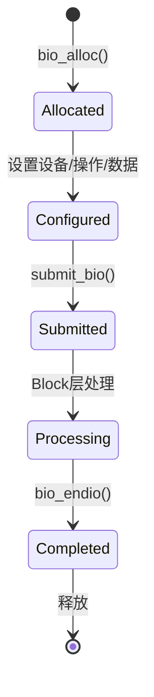
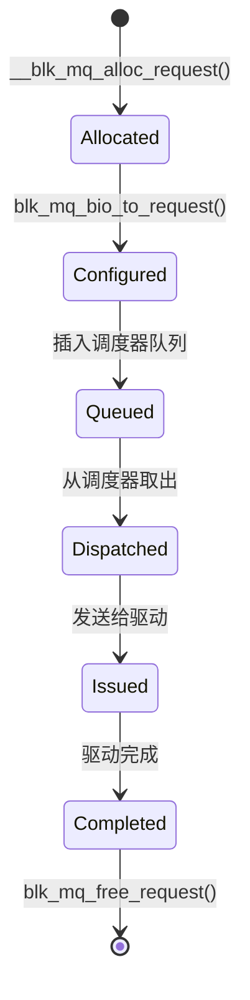
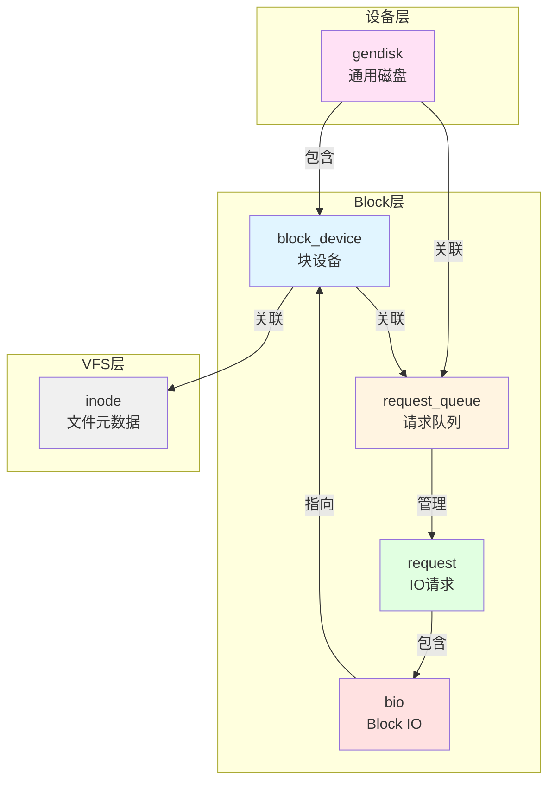
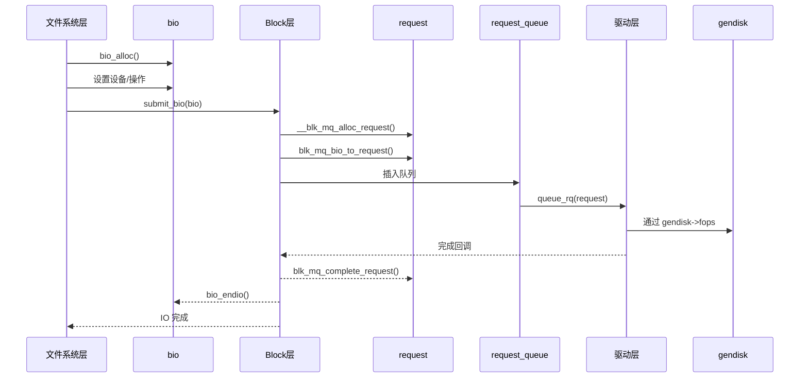

# Block 层核心数据结构

## 学习目标

- 理解 Block 层的核心数据结构及其作用
- 掌握 bio、request、request_queue 等关键数据结构
- 理解数据结构之间的关系和生命周期
- 了解数据结构在 IO 路径中的使用场景

## 概述

Block 层的核心数据结构构成了整个块设备 IO 系统的基础。理解这些数据结构对于深入理解 Block 层的工作原理至关重要。

本文档将介绍以下核心数据结构：

1. **struct bio** - Block IO 的基本单位
2. **struct request** - IO 请求
3. **struct request_queue** - 请求队列
4. **struct block_device** - 块设备
5. **struct gendisk** - 通用磁盘

---

## 一、struct bio - Block IO 的基本单位

### 定义位置

**头文件**：`include/linux/bio.h`  
**类型定义**：`include/linux/blk_types.h`

### 作用

`struct bio` 是 Block 层中最基本的数据结构，表示一个 Block IO 操作。它是文件系统层与 Block 层交互的主要接口。

### 关键字段

```c
struct bio {
    // 链表相关
    struct bio *bi_next;           // bio 链表中的下一个 bio
    
    // 设备相关
    struct block_device *bi_bdev;  // 目标块设备
    
    // IO 操作相关
    unsigned short bi_opf;          // 操作标志（REQ_OP_READ/WRITE等）
    unsigned short bi_flags;        // bio 标志
    unsigned short bi_ioprio;       // IO 优先级
    
    // 数据相关
    struct bvec_iter bi_iter;       // 迭代器（当前位置）
    unsigned short bi_vcnt;         // biovec 数量
    unsigned short bi_max_vecs;     // 最大 biovec 数量
    struct bio_vec *bi_io_vec;      // biovec 数组指针
    struct bio_vec bi_inline_vecs[]; // 内联 biovec 数组（小 bio）
    
    // 完整性检查
    struct bio_integrity_payload *bi_integrity;
    
    // 回调函数
    bio_end_io_t *bi_end_io;        // IO 完成回调
    void *bi_private;               // 私有数据
    
    // 统计相关
    atomic_t __bi_remaining;        // 剩余引用计数
    struct bio_crypt_ctx *bi_crypt_context; // 加密上下文
};
```

### 关键字段详解

#### 1. bi_bdev - 块设备指针

**作用**：指向目标块设备

**使用场景**：
```c
// 文件系统层创建 bio 时设置
struct bio *bio = bio_alloc(GFP_NOFS, 1);
bio->bi_bdev = inode->i_sb->s_bdev;  // 设置目标设备
```

#### 2. bi_opf - 操作标志

**作用**：指定 IO 操作类型和标志

**常见操作类型**：
- `REQ_OP_READ` - 读操作
- `REQ_OP_WRITE` - 写操作
- `REQ_OP_FLUSH` - 刷新操作
- `REQ_OP_DISCARD` - 丢弃操作

**常见标志**：
- `REQ_SYNC` - 同步 IO
- `REQ_META` - 元数据 IO
- `REQ_PRIO` - 高优先级 IO

#### 3. bi_iter - 迭代器

**作用**：跟踪当前处理位置

**结构**：
```c
struct bvec_iter {
    sector_t bi_sector;      // 当前扇区号
    unsigned int bi_size;    // 剩余大小
    unsigned int bi_idx;     // 当前 biovec 索引
    unsigned int bi_bvec_done; // 当前 biovec 已处理大小
};
```

#### 4. bi_io_vec - Bio 向量数组

**作用**：存储不连续的内存段

**特点**：
- 一个 bio 可以包含多个不连续的内存段
- 每个内存段用 `struct bio_vec` 表示
- 支持 scatter-gather IO

**bio_vec 结构**：
```c
struct bio_vec {
    struct page *bv_page;    // 页指针
    unsigned int bv_len;      // 长度
    unsigned int bv_offset;    // 页内偏移
};
```

### Bio 的生命周期



### 使用场景

#### 1. 文件系统层创建 bio

```c
// 文件系统层创建 bio 示例（简化）
static int ext4_readpage(struct file *file, struct page *page)
{
    struct inode *inode = page->mapping->host;
    struct bio *bio;
    
    // 分配 bio
    bio = bio_alloc(GFP_NOFS, 1);
    
    // 设置设备
    bio->bi_bdev = inode->i_sb->s_bdev;
    
    // 设置操作类型
    bio->bi_opf = REQ_OP_READ;
    
    // 添加页
    bio_add_page(bio, page, PAGE_SIZE, 0);
    
    // 设置完成回调
    bio->bi_end_io = end_page_read;
    bio->bi_private = page;
    
    // 提交到 Block 层
    submit_bio(bio);
    
    return 0;
}
```

#### 2. Bio 的合并

Block 层会尝试将相邻扇区的多个 bio 合并为一个 request：

```c
// Block 层合并 bio 示例（简化）
static bool blk_attempt_bio_merge(struct request_queue *q,
                                  struct request *rq,
                                  struct bio *bio)
{
    // 检查是否可以合并
    if (blk_rq_sectors(rq) + bio_sectors(bio) > 
        queue_max_sectors(q))
        return false;
    
    // 合并 bio
    blk_rq_bio_prep(rq, bio, nr_segs);
    
    return true;
}
```

---

## 二、struct request - IO 请求

### 定义位置

**头文件**：`include/linux/blkdev.h`

### 作用

`struct request` 表示一个 IO 请求，由一个或多个 bio 组成。它是 Block 层内部处理 IO 请求的主要数据结构。

### 关键字段

```c
struct request {
    // 队列相关
    struct request_queue *q;        // 所属请求队列
    struct blk_mq_ctx *mq_ctx;      // 软件队列上下文（blk-mq）
    struct blk_mq_hw_ctx *mq_hctx;  // 硬件队列上下文（blk-mq）
    
    // 请求标识
    unsigned int cmd_flags;          // 命令标志
    req_flags_t rq_flags;            // 请求标志
    int tag;                         // driver tag（驱动使用）
    int internal_tag;                // internal tag（调度器使用）
    
    // 数据相关
    unsigned int __data_len;         // 总数据长度
    sector_t __sector;               // 起始扇区号
    
    // Bio 链表
    struct bio *bio;                 // bio 链表头
    struct bio *biotail;             // bio 链表尾
    
    // 队列链表
    struct list_head queuelist;      // 队列链表节点
    
    // 调度器相关
    union {
        struct {
            struct io_cq *icq;       // IO 上下文
            void *priv[2];           // 调度器私有数据
        } elv;
        // ...
    };
    
    // 设备相关
    struct gendisk *rq_disk;        // 磁盘
    struct block_device *part;      // 分区
    
    // 时间戳
    u64 start_time_ns;               // 请求分配时间
    u64 io_start_time_ns;            // IO 提交时间
    
    // 完成回调
    rq_end_io_fn *end_io;           // 请求完成回调
    void *end_io_data;               // 完成回调数据
};
```

### 关键字段详解

#### 1. q - 请求队列

**作用**：指向所属的请求队列

**使用场景**：
```c
// 获取队列信息
struct request_queue *q = rq->q;
unsigned int max_sectors = queue_max_sectors(q);
```

#### 2. bio / biotail - Bio 链表

**作用**：存储组成该 request 的所有 bio

**特点**：
- `bio` 指向链表头
- `biotail` 指向链表尾
- 一个 request 可以包含多个 bio（合并后的结果）

#### 3. tag / internal_tag - Tag 标识

**作用**：用于标识请求

**区别**：
- **internal_tag**：调度器使用，在 Insert 阶段分配
- **driver tag**：驱动使用，在 Issue 阶段分配

**使用场景**：
```c
// 调度器使用 internal_tag
rq->internal_tag = blk_mq_get_tag(...);

// 驱动使用 driver tag
rq->tag = blk_mq_get_driver_tag(...);
```

#### 4. __sector / __data_len - 扇区和长度

**作用**：存储请求的起始扇区号和总长度

**注意**：这些字段是内部字段，应使用访问函数：
- `blk_rq_pos(rq)` - 获取起始扇区号
- `blk_rq_sectors(rq)` - 获取扇区数
- `blk_rq_bytes(rq)` - 获取字节数

### Request 的生命周期



### Request 与 Bio 的关系

**关系**：
- 一个 request 可以包含多个 bio
- bio 通过链表连接
- request 合并相邻扇区的多个 bio

**示例**：
```
Request:
  bio1 (扇区 0-10)  ->  bio2 (扇区 11-20)  ->  bio3 (扇区 21-30)
```

---

## 三、struct request_queue - 请求队列

### 定义位置

**头文件**：`include/linux/blkdev.h`

### 作用

`struct request_queue` 表示一个请求队列，每个块设备对应一个请求队列。它是 Block 层的核心管理结构。

### 关键字段

```c
struct request_queue {
    // 队列标识
    struct request_list rq;         // 请求列表
    
    // 调度器相关
    struct elevator_queue *elevator; // IO 调度器
    
    // blk-mq 相关
    struct blk_mq_ops *mq_ops;      // blk-mq 操作函数
    unsigned int nr_hw_queues;      // 硬件队列数量
    struct blk_mq_ctxs *queue_ctx;  // 软件队列集合
    
    // 队列限制
    struct queue_limits limits;     // 队列限制（最大扇区数等）
    
    // 队列标志
    unsigned long queue_flags;      // 队列标志
    
    // 设备相关
    struct gendisk *disk;           // 关联的磁盘
    
    // 统计信息
    struct blk_queue_stats *stats;  // 队列统计
    
    // 回调函数
    make_request_fn *make_request_fn; // 创建请求函数（传统方式）
    
    // 其他
    void *queuedata;                // 队列私有数据
    struct timer_list timeout;     // 超时定时器
};
```

### 关键字段详解

#### 1. elevator - IO 调度器

**作用**：指向 IO 调度器

**使用场景**：
```c
// 获取调度器
struct elevator_queue *e = q->elevator;
if (e && e->type->ops.mq.insert_requests)
    e->type->ops.mq.insert_requests(hctx, list, false);
```

#### 2. mq_ops - blk-mq 操作函数

**作用**：blk-mq 的操作函数表

**关键函数**：
- `queue_rq` - 处理请求
- `complete` - 完成回调
- `init_hctx` - 初始化硬件队列

#### 3. limits - 队列限制

**作用**：存储队列的各种限制

**关键限制**：
```c
struct queue_limits {
    unsigned long max_sectors;      // 最大扇区数
    unsigned int max_segments;      // 最大段数
    unsigned int max_segment_size;  // 最大段大小
    unsigned int logical_block_size; // 逻辑块大小
    unsigned int physical_block_size; // 物理块大小
};
```

#### 4. queue_flags - 队列标志

**作用**：存储队列的各种标志

**常见标志**：
- `QUEUE_FLAG_STOPPED` - 队列已停止
- `QUEUE_FLAG_DEAD` - 队列已死亡
- `QUEUE_FLAG_NOMERGES` - 禁用合并

### Request Queue 的创建

```c
// 创建请求队列示例（简化）
struct request_queue *q = blk_mq_init_queue(&tag_set, &ops);
if (IS_ERR(q))
    return PTR_ERR(q);

// 设置队列限制
blk_queue_max_hw_sectors(q, 512);
blk_queue_logical_block_size(q, 512);

// 关联磁盘
q->disk = disk;
disk->queue = q;
```

---

## 四、struct block_device - 块设备

### 定义位置

**头文件**：`include/linux/fs.h`

### 作用

`struct block_device` 表示一个块设备或分区。它是 VFS 层与 Block 层交互的桥梁。

### 关键字段

```c
struct block_device {
    dev_t bd_dev;                   // 设备号
    struct inode *bd_inode;         // 关联的 inode
    struct super_block *bd_super;    // 关联的超级块
    struct block_device *bd_contains; // 包含此分区的设备
    unsigned bd_block_size;          // 块大小
    struct hd_struct *bd_part;       // 分区信息
    unsigned bd_part_count;         // 分区引用计数
    struct gendisk *bd_disk;         // 关联的磁盘
    struct request_queue *bd_queue;   // 关联的请求队列
    struct list_head bd_list;        // 设备链表
    unsigned long bd_private;        // 私有数据
    int bd_fsfreeze_count;           // 冻结计数
    struct mutex bd_fsfreeze_mutex;  // 冻结互斥锁
};
```

### 关键字段详解

#### 1. bd_dev - 设备号

**作用**：唯一标识设备

**组成**：
- 主设备号（major）
- 次设备号（minor）

#### 2. bd_disk - 关联的磁盘

**作用**：指向关联的 `struct gendisk`

**关系**：
- 一个 `gendisk` 可以包含多个 `block_device`（主设备 + 分区）
- 每个分区对应一个 `block_device`

#### 3. bd_queue - 请求队列

**作用**：指向关联的请求队列

**使用场景**：
```c
// 获取请求队列
struct request_queue *q = bdev->bd_queue;

// 提交 bio
submit_bio(bio);
```

---

## 五、struct gendisk - 通用磁盘

### 定义位置

**头文件**：`include/linux/genhd.h`

### 作用

`struct gendisk` 表示一个通用磁盘设备。它是驱动层与 Block 层交互的主要接口。

### 关键字段

```c
struct gendisk {
    // 设备号
    int major;                      // 主设备号
    int first_minor;                 // 第一个次设备号
    int minors;                      // 次设备号数量
    
    // 设备名称
    char disk_name[DISK_NAME_LEN];   // 磁盘名称（如 "sda"）
    
    // 分区表
    struct xarray part_tbl;          // 分区表
    struct block_device *part0;      // 主设备（分区 0）
    
    // 操作函数
    const struct block_device_operations *fops; // 设备操作函数
    
    // 队列相关
    struct request_queue *queue;     // 请求队列
    
    // 私有数据
    void *private_data;              // 驱动私有数据
    
    // 标志
    int flags;                       // 磁盘标志
    unsigned long state;             // 磁盘状态
    
    // 其他
    struct backing_dev_info *bdi;    // 回写设备信息
    struct disk_events *ev;          // 磁盘事件
};
```

### 关键字段详解

#### 1. disk_name - 磁盘名称

**作用**：磁盘的设备名称

**示例**：
- `"sda"` - 第一个 SCSI/SATA 磁盘
- `"nvme0n1"` - 第一个 NVMe 磁盘

#### 2. fops - 设备操作函数

**作用**：驱动提供的设备操作函数

**关键函数**：
```c
struct block_device_operations {
    void (*submit_bio)(struct bio *bio);  // 提交 bio（可选）
    int (*open)(struct block_device *, fmode_t);
    void (*release)(struct gendisk *, fmode_t);
    int (*ioctl)(struct block_device *, fmode_t, unsigned, unsigned long);
    // ...
};
```

#### 3. queue - 请求队列

**作用**：关联的请求队列

**关系**：
- 每个 `gendisk` 对应一个 `request_queue`
- 所有分区的 IO 请求都通过这个队列处理

---

## 六、数据结构之间的关系

### 关系图



### 数据流

**IO 请求的数据流**：

```
文件系统层
    ↓ 创建 bio
bio (bi_bdev 指向 block_device)
    ↓ submit_bio()
Block 层
    ↓ 转换为 request
request (q 指向 request_queue, bio 链表)
    ↓ 插入队列
request_queue (disk 指向 gendisk)
    ↓ 发送给驱动
驱动层 (通过 gendisk->fops)
```

### 生命周期关系



---

## 总结

### 核心要点

1. **bio**：Block IO 的基本单位，文件系统层与 Block 层交互的接口
2. **request**：IO 请求，Block 层内部处理的主要数据结构
3. **request_queue**：请求队列，每个块设备对应一个队列
4. **block_device**：块设备，VFS 层与 Block 层交互的桥梁
5. **gendisk**：通用磁盘，驱动层与 Block 层交互的接口

### 关键关系

- **gendisk** 包含多个 **block_device**（主设备 + 分区）
- **block_device** 关联一个 **request_queue**
- **request_queue** 管理多个 **request**
- **request** 包含多个 **bio**
- **bio** 指向 **block_device**

### 后续学习

- [Bio 机制详解](04-Bio机制详解.md) - 深入理解 bio 的设计和实现
- [Request 机制详解](06-Request机制详解.md) - 深入理解 request 的设计和生命周期
- [Request 队列管理](07-Request队列管理.md) - 理解 request_queue 的管理机制

## 参考资源

- 内核源码：
  - `include/linux/bio.h` - bio 数据结构定义
  - `include/linux/blkdev.h` - request、request_queue 定义
  - `include/linux/fs.h` - block_device 定义
  - `include/linux/genhd.h` - gendisk 定义
- 相关文章：
  - [Block 层概述与架构设计](01-Block层概述与架构设计.md) - Block 层整体架构

## 更新记录

- 2026-01-26：初始创建，包含 Block 层核心数据结构的详细说明
