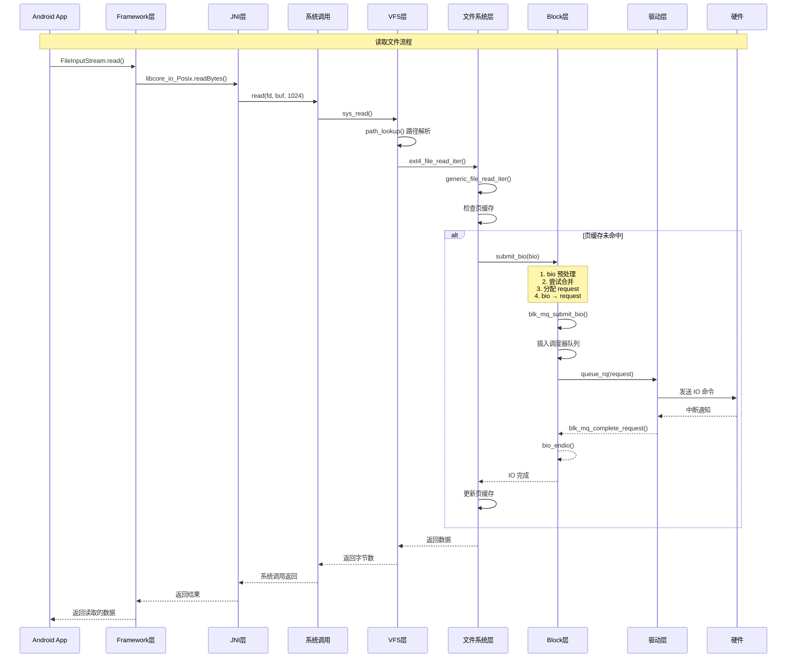

# Block 层 IO 路径总览

## 学习目标

- 理解 IO 从 Framework 层到硬件设备的完整路径
- 掌握各层之间的交互方式和数据转换
- 理解 Block 层在 IO 路径中的关键作用
- 了解 IO 完成的回调链机制

## 概述

本文档从 Block 层的视角，系统性地介绍 IO 请求从 Framework 层到硬件设备的完整路径。重点说明 Block 层在 IO 路径中的位置和作用，以及与其他层的交互方式。

---

## 一、完整 IO 路径概览

### Framework 层 → Kernel → Hardware 的完整路径

一次完整的 IO 操作涉及以下层次：

```
┌─────────────────────────────────────────────────────────────┐
│ Framework 层                                                 │
│  FileInputStream.read() / FileOutputStream.write()          │
└────────────────────┬────────────────────────────────────────┘
                      │ JNI 调用
┌─────────────────────▼──────────────────────────────────────┐
│ JNI 层                                                       │
│  libcore_io_Posix.readBytes() / writeBytes()               │
└────────────────────┬────────────────────────────────────────┘
                      │ 系统调用
┌─────────────────────▼──────────────────────────────────────┐
│ 系统调用层                                                   │
│  sys_read() / sys_write()                                   │
└────────────────────┬────────────────────────────────────────┘
                      │ VFS 分发
┌─────────────────────▼──────────────────────────────────────┐
│ VFS 层                                                       │
│  vfs_read() / vfs_write()                                   │
│  path_lookup() - 路径解析                                    │
└────────────────────┬────────────────────────────────────────┘
                      │ 文件系统操作
┌─────────────────────▼──────────────────────────────────────┐
│ 文件系统层                                                   │
│  ext4_file_read_iter() / ext4_file_write_iter()             │
│  generic_file_read_iter() / generic_file_write_iter()       │
└────────────────────┬────────────────────────────────────────┘
                      │ submit_bio()
┌─────────────────────▼──────────────────────────────────────┐
│ Block 层 ⭐（本文重点）                                       │
│  submit_bio()                                                │
│  blk_mq_submit_bio()                                         │
│  - bio → request 转换                                       │
│  - IO 调度                                                  │
│  - 请求队列管理                                             │
└────────────────────┬────────────────────────────────────────┘
                      │ queue_rq()
┌─────────────────────▼──────────────────────────────────────┐
│ 驱动层                                                       │
│  nvme_queue_rq() / ata_queue_rq()                          │
│  - 发送 IO 命令给硬件                                       │
└────────────────────┬────────────────────────────────────────┘
                      │ 硬件接口（PCIe/SATA/eMMC）
┌─────────────────────▼──────────────────────────────────────┐
│ 硬件层                                                       │
│  SSD / HDD / eMMC                                           │
│  - 执行实际的读写操作                                       │
└─────────────────────────────────────────────────────────────┘
```

### 各层的主要职责和转换点

| 层次 | 主要职责 | 关键转换点 |
|------|---------|-----------|
| Framework 层 | 提供 Java API | Java → JNI |
| JNI 层 | Java 与 Native 桥接 | JNI → 系统调用 |
| 系统调用层 | 用户空间到内核空间入口 | 系统调用 → VFS |
| VFS 层 | 路径解析、权限检查 | VFS → 文件系统 |
| 文件系统层 | 文件系统特定操作 | 文件系统 → Block 层 |
| **Block 层** | **IO 请求管理、调度** | **bio → request** |
| 驱动层 | 硬件交互 | request → 硬件命令 |
| 硬件层 | 实际 IO 操作 | 硬件命令 → 数据 |

---

## 二、Framework 层到 Kernel 的转换

### Framework 层的 IO 操作

#### 1. Java 层代码

**读取文件示例**：
```java
// Android Framework 层代码
FileInputStream fis = new FileInputStream("/data/file.txt");
byte[] buffer = new byte[1024];
int bytesRead = fis.read(buffer);
```

**写入文件示例**：
```java
// Android Framework 层代码
FileOutputStream fos = new FileOutputStream("/data/file.txt");
byte[] data = "Hello World".getBytes();
fos.write(data);
```

#### 2. JNI 调用

**FileInputStream.read() 的调用链**：
```
FileInputStream.read()
    ↓
FileInputStream.readBytes()
    ↓
JNI: libcore_io_Posix.readBytes()
    ↓
native: read(fd, buf, size)
```

**JNI 层代码**（简化示例）：
```c
// libcore_io_Posix.cpp
static jint Posix_readBytes(JNIEnv* env, jobject, jobject javaFd,
                            jbyteArray javaBytes, jint byteOffset, jint byteCount) {
    int fd = jniGetFDFromFileDescriptor(env, javaFd);
    if (fd == -1) return -1;
    
    ScopedByteArrayRW bytes(env, javaBytes);
    if (bytes.get() == NULL) return -1;
    
    // 调用系统调用
    ssize_t result = read(fd, bytes.get() + byteOffset, byteCount);
    return result;
}
```

#### 3. 系统调用入口

**系统调用定义**：
```c
// fs/read_write.c
SYSCALL_DEFINE3(read, unsigned int, fd, char __user *, buf, size_t, count)
{
    return ksys_read(fd, buf, count);
}

static ssize_t ksys_read(unsigned int fd, char __user *buf, size_t count)
{
    struct fd f = fdget_pos(fd);
    ssize_t ret = -EBADF;
    
    if (f.file) {
        loff_t pos = file_pos_read(f.file);
        ret = vfs_read(f.file, buf, count, &pos);
        if (ret >= 0)
            file_pos_write(f.file, pos);
        fdput_pos(f);
    }
    
    return ret;
}
```

#### 4. 系统调用如何进入 Kernel

**ARM64 架构的系统调用入口**：
```c
// arch/arm64/kernel/entry.S
ENTRY(vectors)
    kernel_ventry   1, sync_invalid          // Synchronous EL1t
    kernel_ventry   1, irq_invalid            // IRQ EL1t
    kernel_ventry   1, fiq_invalid            // FIQ EL1t
    kernel_ventry   1, error_invalid          // Error EL1t
    
    kernel_ventry   1, sync                   // Synchronous EL1h
    kernel_ventry   1, irq                    // IRQ EL1h
    kernel_ventry   1, fiq_invalid            // FIQ EL1h
    kernel_ventry   1, error_invalid          // Error EL1h
    
    kernel_ventry   0, sync                    // Synchronous EL0
    kernel_ventry   0, irq                    // IRQ EL0
    kernel_ventry   0, fiq_invalid            // FIQ EL0
    kernel_ventry   0, error_invalid          // Error EL0
END(vectors)
```

**系统调用处理流程**：
```
用户空间调用 read()
    ↓
svc #0 (ARM64 系统调用指令)
    ↓
entry_SYSCALL_64 (系统调用入口)
    ↓
do_syscall_64()
    ↓
sys_read() (根据系统调用号查找)
    ↓
ksys_read()
    ↓
vfs_read()
```

---

## 三、Kernel 内部的 IO 路径

### VFS 层的处理

#### 1. 路径解析

**vfs_read() 函数**：
```c
// fs/read_write.c
ssize_t vfs_read(struct file *file, char __user *buf, size_t count, loff_t *pos)
{
    ssize_t ret;
    
    if (!(file->f_mode & FMODE_READ))
        return -EBADF;
    if (!(file->f_mode & FMODE_CAN_READ))
        return -EINVAL;
    if (unlikely(!access_ok(buf, count)))
        return -EFAULT;
    
    ret = rw_verify_area(READ, file, pos, count);
    if (ret)
        return ret;
    
    if (count > 0) {
        ret = __vfs_read(file, buf, count, pos);
        if (ret > 0)
            fsnotify_access(file);
    }
    
    return ret;
}
```

#### 2. 文件操作分发

**VFS 分发机制**：
```c
// fs/read_write.c
ssize_t __vfs_read(struct file *file, char __user *buf, size_t count, loff_t *pos)
{
    if (file->f_op->read)
        return file->f_op->read(file, buf, count, pos);
    else if (file->f_op->read_iter)
        return new_sync_read(file, buf, count, pos);
    else
        return -EINVAL;
}
```

**关键点**：
- VFS 通过 `file->f_op` 获取文件操作函数表
- 根据文件类型（普通文件、设备文件等）调用不同的操作函数
- 这是多态分发机制，不是 hook

### 文件系统层的处理

#### 1. ext4 文件系统的处理

**ext4_file_read_iter()**：
```c
// fs/ext4/file.c
static ssize_t ext4_file_read_iter(struct kiocb *iocb, struct iov_iter *to)
{
    if (unlikely(ext4_forced_shutdown(EXT4_SB(file_inode(iocb->ki_filp)->i_sb))))
        return -EIO;
    
    if (!iov_iter_count(to))
        return 0;
    
#ifdef CONFIG_FS_DAX
    if (IS_DAX(file_inode(iocb->ki_filp)))
        return ext4_dax_read_iter(iocb, to);
#endif
    
    if (iocb->ki_flags & IOCB_DIRECT)
        return ext4_dio_read_iter(iocb, to);
    
    return generic_file_read_iter(iocb, to);
}
```

#### 2. 通用文件读取

**generic_file_read_iter()**：
```c
// mm/filemap.c
ssize_t generic_file_read_iter(struct kiocb *iocb, struct iov_iter *iter)
{
    size_t count = iov_iter_count(iter);
    ssize_t retval = 0;
    
    if (!count)
        return 0;
    
    if (iocb->ki_flags & IOCB_DIRECT) {
        // 直接 IO，绕过页缓存
        return generic_file_direct_read(iocb, iter, &retval);
    }
    
    // 通过页缓存读取
    return generic_file_buffered_read(iocb, iter, retval);
}
```

#### 3. VFS 如何调用 Block 层

**关键接口：submit_bio()**

当文件系统需要执行实际的块设备 IO 时，会调用 Block 层的 `submit_bio()` 函数：

```c
// fs/ext4/inode.c (简化示例)
static int ext4_readpage(struct file *file, struct page *page)
{
    struct inode *inode = page->mapping->host;
    struct bio *bio;
    int ret;
    
    // 创建 bio
    bio = bio_alloc(GFP_NOFS, 1);
    if (!bio)
        return -ENOMEM;
    
    // 设置 bio 参数
    bio->bi_bdev = inode->i_sb->s_bdev;  // 设置块设备
    bio->bi_iter.bi_sector = (page->index << (PAGE_SHIFT - 9));  // 设置扇区
    bio->bi_opf = REQ_OP_READ;  // 设置操作类型
    
    // 添加页到 bio
    bio_add_page(bio, page, PAGE_SIZE, 0);
    
    // 设置完成回调
    bio->bi_end_io = end_page_read;
    bio->bi_private = page;
    
    // 提交到 Block 层 ⭐
    submit_bio(bio);
    
    return 0;
}
```

### Block 层内部的处理

#### 1. bio 的创建和提交

**submit_bio() 函数**：
```c
// block/blk-core.c
blk_qc_t submit_bio(struct bio *bio)
{
    // IO 优先级设置
    bio_set_ioprio(bio);
    
    // 统计信息
    if (bio_has_data(bio)) {
        unsigned int count = bio_sectors(bio);
        if (op_is_write(bio_op(bio))) {
            count_vm_events(PGPGOUT, count);
        } else {
            task_io_account_read(bio->bi_iter.bi_size);
            count_vm_events(PGPGIN, count);
        }
    }
    
    // 提交 bio（无统计）
    return submit_bio_noacct(bio);
}
```

#### 2. request 的分配和调度

**blk_mq_submit_bio() 函数**（简化流程）：
```c
// block/blk-mq.c
blk_qc_t blk_mq_submit_bio(struct bio *bio)
{
    struct request_queue *q = bio->bi_bdev->bd_disk->queue;
    struct request *rq;
    
    // 1. Bio 预处理
    blk_queue_bounce(q, &bio);  // bounce 处理
    __blk_queue_split(&bio, &nr_segs);  // 分割大 bio
    
    // 2. 尝试合并
    if (blk_attempt_plug_merge(q, bio, nr_segs, &same_queue_rq))
        goto queue_exit;
    
    if (blk_mq_sched_bio_merge(q, bio, nr_segs))
        goto queue_exit;
    
    // 3. QoS 节流
    rq_qos_throttle(q, bio);
    
    // 4. 分配 request
    rq = __blk_mq_alloc_request(&data);
    if (!rq) {
        rq_qos_cleanup(q, bio);
        goto queue_exit;
    }
    
    // 5. bio 转换为 request
    blk_mq_bio_to_request(rq, bio, nr_segs);
    
    // 6. 插入调度器队列
    blk_mq_sched_insert_request(rq, false, true, true);
    
    // 7. 触发硬件队列运行
    blk_mq_run_hw_queue(data.hctx, true);
    
    return cookie;
}
```

#### 3. blk-mq 的处理流程

**关键阶段**：

1. **Insert 阶段**：bio → request，插入调度器队列
2. **Dispatch 阶段**：从调度器取出 request，准备发送
3. **Issue 阶段**：获取 driver tag，发送给驱动
4. **Complete 阶段**：IO 完成，回调处理

**详细流程**（参考后续文章）：
- [blk_mq 请求生命周期详解](12-blk_mq请求生命周期详解.md)

### 驱动层的处理

#### 1. 设备驱动如何接收 request

**驱动注册操作函数**：
```c
// drivers/nvme/host/core.c
static const struct blk_mq_ops nvme_mq_ops = {
    .queue_rq       = nvme_queue_rq,      // 处理 IO 请求
    .complete       = nvme_complete_rq,  // IO 完成回调
    .init_hctx      = nvme_init_hctx,    // 初始化硬件队列
    .init_request   = nvme_init_request,  // 初始化请求
};
```

**Block 层调用驱动**：
```c
// block/blk-mq.c
static void blk_mq_dispatch_rq_list(...)
{
    struct request *rq = list_first_entry(list, struct request, queuelist);
    struct blk_mq_hw_ctx *hctx = rq->mq_hctx;
    struct blk_mq_ops *ops = hctx->queue->mq_ops;
    
    // 调用驱动的 queue_rq 函数
    ret = ops->queue_rq(hctx, rq);
}
```

#### 2. 驱动处理 request

**nvme_queue_rq() 示例**（简化）：
```c
// drivers/nvme/host/core.c
static blk_status_t nvme_queue_rq(struct blk_mq_hw_ctx *hctx,
                                  const struct blk_mq_queue_data *bd)
{
    struct nvme_queue *nvmeq = hctx->driver_data;
    struct request *req = bd->rq;
    struct nvme_command cmnd;
    
    // 构建 NVMe 命令
    nvme_setup_cmd(req, &cmnd);
    
    // 发送命令到硬件
    nvme_submit_cmd(nvmeq, &cmnd);
    
    return BLK_STS_OK;
}
```

---

## 四、Kernel 到硬件的交互

### 驱动如何与硬件通信

#### 1. PCIe 设备（NVMe SSD）

**通信方式**：
- **MMIO（Memory-Mapped I/O）**：通过内存映射访问设备寄存器
- **DMA**：直接内存访问，传输数据
- **MSI/MSI-X 中断**：消息信号中断

**示例**：
```c
// drivers/nvme/host/pci.c
static void nvme_submit_cmd(struct nvme_queue *nvmeq, struct nvme_command *cmd)
{
    // 写入命令到设备寄存器
    memcpy_toio(&nvmeq->sq_db + (nvmeq->sq_tail << nvmeq->sqes),
                cmd, sizeof(*cmd));
    
    // 更新队列尾指针
    nvmeq->sq_tail++;
    if (nvmeq->sq_tail == nvmeq->q_depth)
        nvmeq->sq_tail = 0;
    
    // 通知设备有新命令
    writel(nvmeq->sq_tail, nvmeq->q_db);
}
```

#### 2. SATA 设备

**通信方式**：
- **ATA 命令集**：通过 ATA 命令与设备通信
- **PIO/DMA**：可编程 IO 或 DMA 传输

#### 3. eMMC/UFS 设备

**通信方式**：
- **MMC/UFS 协议**：通过协议命令与设备通信
- **命令队列**：支持命令队列并行处理

### 硬件如何完成 IO 操作

#### 1. 硬件执行流程

```
驱动发送 IO 命令
    ↓
硬件接收命令
    ↓
硬件执行 IO 操作（读取/写入数据）
    ↓
硬件完成 IO
    ↓
硬件触发中断
```

#### 2. 硬件中断处理

**中断处理函数**：
```c
// drivers/nvme/host/pci.c
static irqreturn_t nvme_irq(int irq, void *data)
{
    struct nvme_queue *nvmeq = data;
    
    // 处理完成队列
    nvme_process_cq(nvmeq);
    
    return IRQ_HANDLED;
}

static void nvme_process_cq(struct nvme_queue *nvmeq)
{
    struct nvme_completion *cqe;
    struct request *req;
    
    while ((cqe = nvme_cqe(nvmeq))) {
        // 获取对应的 request
        req = blk_mq_tag_to_rq(nvmeq->tags, cqe->command_id);
        
        // 处理完成
        nvme_complete_rq(req);
    }
}
```

---

## 五、IO 完成的回调链

### 完整的回调链

```
硬件中断
    ↓
驱动中断处理函数（nvme_irq）
    ↓
nvme_complete_rq()
    ↓
blk_mq_complete_request() ⭐ Block 层
    ↓
request->end_io() (如果有)
    ↓
blk_mq_end_request()
    ↓
bio_endio() ⭐ Block 层
    ↓
文件系统完成处理（end_page_read）
    ↓
VFS 层完成处理
    ↓
系统调用返回（返回读取的字节数）
    ↓
JNI 层返回
    ↓
Framework 层返回（FileInputStream.read() 返回）
```

### 关键回调函数

#### 1. blk_mq_complete_request()

**Block 层的完成处理**：
```c
// block/blk-mq.c
void blk_mq_complete_request(struct request *rq)
{
    if (!blk_mq_complete_request_remote(rq))
        __blk_mq_complete_request(rq);
}

static void __blk_mq_complete_request(struct request *rq)
{
    struct request_queue *q = rq->q;
    
    // 调用请求完成回调
    if (rq->end_io) {
        rq->end_io(rq, blk_mq_end_request_batch(rq));
    } else {
        blk_mq_end_request(rq, blk_status_to_errno(blk_status));
    }
}
```

#### 2. bio_endio()

**Bio 完成处理**：
```c
// block/bio.c
void bio_endio(struct bio *bio)
{
    // 调用 bio 完成回调
    if (bio->bi_end_io)
        bio->bi_end_io(bio);
}
```

#### 3. 文件系统完成处理

**end_page_read() 示例**：
```c
// fs/ext4/inode.c (简化)
static void end_page_read(struct bio *bio)
{
    struct page *page = bio->bi_private;
    
    if (bio->bi_status == BLK_STS_OK) {
        SetPageUptodate(page);
    } else {
        ClearPageUptodate(page);
        SetPageError(page);
    }
    
    unlock_page(page);
    bio_put(bio);
}
```

---

## 六、完整流程图

### Framework → Kernel → Hardware 的完整交互序列图



### 关键转换点和数据结构的转换

| 阶段 | 输入数据结构 | 输出数据结构 | 转换函数 |
|------|------------|------------|---------|
| Framework → JNI | Java byte[] | C char* | JNI 转换 |
| JNI → 系统调用 | C 参数 | 内核参数 | 系统调用入口 |
| VFS → 文件系统 | file, iov_iter | file, iov_iter | file_operations |
| 文件系统 → Block | page, inode | bio | bio_alloc(), bio_add_page() |
| Block Insert | bio | request | blk_mq_bio_to_request() |
| Block → 驱动 | request | 硬件命令 | queue_rq() |
| 驱动 → 硬件 | 硬件命令 | 硬件操作 | MMIO/DMA |
| 硬件 → 驱动 | 中断 | 完成通知 | 中断处理 |
| 驱动 → Block | 完成通知 | request 完成 | blk_mq_complete_request() |
| Block → 文件系统 | request 完成 | bio 完成 | bio_endio() |

---

## 总结

### 核心要点

1. **IO 路径的层次**：
   - Framework 层 → JNI 层 → 系统调用层 → VFS 层 → 文件系统层 → **Block 层** → 驱动层 → 硬件层

2. **Block 层的关键作用**：
   - 接收来自文件系统层的 bio
   - 将 bio 转换为 request
   - 管理 IO 请求队列和调度
   - 将 request 发送给驱动层

3. **关键转换点**：
   - **文件系统 → Block**：`submit_bio(bio)`
   - **Block → 驱动**：`queue_rq(request)`
   - **驱动 → Block**：`blk_mq_complete_request()`

4. **IO 完成的回调链**：
   - 硬件中断 → 驱动处理 → Block 层完成 → 文件系统完成 → VFS 完成 → 系统调用返回 → Framework 返回

### 关键函数

- `submit_bio()` - 文件系统层调用 Block 层的主要接口
- `blk_mq_submit_bio()` - Block 层处理 bio 的入口
- `queue_rq()` - Block 层调用驱动层的主要接口
- `blk_mq_complete_request()` - 驱动通知 Block 层请求完成

### 后续学习

- [Bio 机制详解](04-Bio机制详解.md) - 深入理解 bio 的设计和实现
- [Request 机制详解](06-Request机制详解.md) - 深入理解 request 的设计和生命周期
- [blk_mq 请求生命周期详解](12-blk_mq请求生命周期详解.md) - 理解 blk-mq 中请求的完整生命周期

## 参考资源

- 内核源码：
  - `block/blk-core.c` - submit_bio() 实现
  - `block/blk-mq.c` - blk_mq_submit_bio() 实现
  - `fs/read_write.c` - 系统调用实现
  - `fs/ext4/file.c` - ext4 文件系统实现
- 相关文章：
  - `../android/22-IO完整流程：从用户空间到内核空间.md` - IO 完整流程
  - [Block 层概述与架构设计](01-Block层概述与架构设计.md) - Block 层整体架构

## 更新记录

- 2026-01-26：初始创建，包含 Block 层 IO 路径的完整说明
