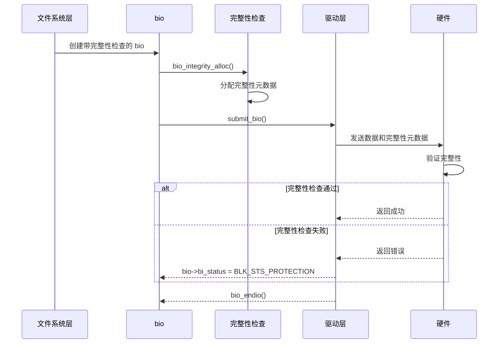
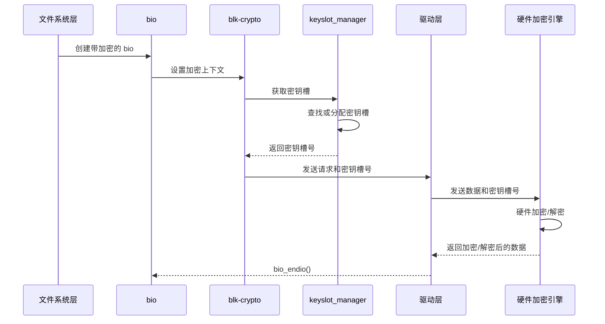

# Bio 完整性检查与加密

## 学习目标

- 理解数据完整性（Data Integrity）机制的作用和实现
- 了解 T10 PI（Protection Information）支持
- 理解内联加密（Inline Encryption）机制
- 掌握 blk-crypto 子系统的工作原理
- 了解加密回退机制

## 概述

现代存储系统需要保证数据的完整性和安全性。Block 层提供了两种机制来满足这些需求：

1. **数据完整性检查**：检测和纠正数据损坏
2. **内联加密**：在硬件层面加密数据，提高性能和安全性

本文档深入讲解这两种机制的实现原理和使用场景。

---

## 一、数据完整性（Data Integrity）机制

### 为什么需要数据完整性？

**数据损坏的原因**：
1. **硬件故障**：磁盘坏块、内存错误
2. **传输错误**：总线错误、DMA 错误
3. **软件错误**：驱动 bug、内存覆盖

**数据完整性的作用**：
- **检测**：发现数据损坏
- **纠正**：自动纠正错误（如果支持）
- **保护**：防止静默数据损坏

### 数据完整性的实现

#### 1. bio_integrity_payload - 完整性载荷

**结构定义**：
```c
struct bio_integrity_payload {
    struct bio *bip_bio;              // 关联的 bio
    struct bvec_iter bip_iter;        // 迭代器
    unsigned short bip_slab;          // 是否从 slab 分配
    unsigned short bip_vcnt;           // biovec 数量
    unsigned short bip_max_vcnt;       // 最大 biovec 数量
    struct bio_vec *bip_vec;           // biovec 数组
    struct bio_vec bip_inline_vecs[];  // 内联 biovec 数组
    struct work_struct bip_work;       // 工作队列
};
```

#### 2. bio_integrity_alloc() - 分配完整性载荷

**函数实现**（简化）：
```c
struct bio_integrity_payload *bio_integrity_alloc(struct bio *bio,
                                                  gfp_t gfp_mask,
                                                  unsigned int nr_vecs)
{
    struct bio_integrity_payload *bip;
    struct bio_set *bs = bio->bi_pool;
    
    // 分配 bip
    if (bs && mempool_initialized(&bs->bio_integrity_pool)) {
        bip = mempool_alloc(&bs->bio_integrity_pool, gfp_mask);
    } else {
        bip = kmalloc(struct_size(bip, bip_inline_vecs, nr_vecs), gfp_mask);
    }
    
    // 分配 biovec 数组
    if (nr_vecs > BIO_INLINE_VECS) {
        bip->bip_vec = bvec_alloc(&bs->bvec_integrity_pool,
                                  &bip->bip_max_vcnt, gfp_mask);
    } else {
        bip->bip_vec = bip->bip_inline_vecs;
    }
    
    // 关联到 bio
    bip->bip_bio = bio;
    bio->bi_integrity = bip;
    bio->bi_opf |= REQ_INTEGRITY;
    
    return bip;
}
```

#### 3. 完整性检查流程



### T10 PI（Protection Information）支持

#### 1. T10 PI 简介

**T10 PI** 是 SCSI 标准中定义的数据保护机制：

- **DIF（Data Integrity Field）**：8 字节的保护信息
- **DIX（Data Integrity Extension）**：扩展的保护信息

**保护信息包含**：
- **Guard Tag**：CRC 校验和
- **Application Tag**：应用标签
- **Reference Tag**：参考标签（LBA）

#### 2. T10 PI 的实现

**blk_integrity 结构**：
```c
struct blk_integrity {
    const struct blk_integrity_profile *profile;  // 完整性配置文件
    unsigned char flags;                           // 标志
    unsigned char tuple_size;                      // 元组大小
    unsigned char interval_exp;                    // 间隔指数
    unsigned char tag_size;                        // 标签大小
};
```

**完整性配置文件**：
```c
struct blk_integrity_profile {
    const char *name;                              // 配置名称
    integrity_gen_fn *generate_fn;                 // 生成函数
    integrity_vrfy_fn *verify_fn;                  // 验证函数
    integrity_prepare_fn *prepare_fn;              // 准备函数
    integrity_complete_fn *complete_fn;            // 完成函数
};
```

#### 3. T10 PI 的使用场景

**典型场景**：数据库存储

```c
// 数据库使用 T10 PI 保护数据
static int setup_t10_pi(struct block_device *bdev)
{
    struct blk_integrity integrity;
    
    // 设置 T10 PI 配置
    integrity.profile = &t10_pi_type1_profile;
    integrity.tuple_size = 8;  // 8 字节保护信息
    integrity.interval_exp = 9; // 每 512 字节一个保护信息
    
    // 注册完整性检查
    blk_integrity_register(bdev->bd_disk, &integrity);
    
    return 0;
}
```

---

## 二、内联加密（Inline Encryption）机制

### 为什么需要内联加密？

**传统加密的问题**：
1. **性能开销**：软件加密消耗 CPU 资源
2. **延迟增加**：加密操作增加 IO 延迟
3. **安全性**：数据在传输过程中可能暴露

**内联加密的优势**：
1. **硬件加速**：使用硬件加密引擎
2. **零拷贝**：数据直接在硬件中加密
3. **高性能**：几乎无性能开销

### blk-crypto 子系统

#### 1. blk_crypto_ctx - 加密上下文

**结构定义**：
```c
struct bio_crypt_ctx {
    struct blk_crypto_key *bc_key;     // 加密密钥
    u64 bc_dun[BLK_CRYPTO_DUN_ARRAY_SIZE]; // 数据单元号
    u32 bc_key_id;                     // 密钥 ID
};
```

#### 2. blk_crypto_rq_get_keyslot() - 获取密钥槽

**函数实现**（简化）：
```c
blk_status_t blk_crypto_rq_get_keyslot(struct request *rq)
{
    struct bio_crypt_ctx *bc = rq->crypt_ctx;
    struct keyslot_manager *ksm = rq->q->ksm;
    
    if (!bc)
        return BLK_STS_OK;
    
    // 从 keyslot manager 获取密钥槽
    return keyslot_manager_get_slot_for_key(ksm, bc->bc_key);
}
```

#### 3. keyslot_manager - 密钥槽管理器

**作用**：
- 管理硬件加密密钥槽
- 分配和释放密钥槽
- 处理密钥槽竞争

**结构定义**：
```c
struct keyslot_manager {
    unsigned int num_slots;            // 密钥槽数量
    struct keyslot *slots;              // 密钥槽数组
    struct list_head idle_slots;        // 空闲密钥槽列表
    spinlock_t lock;                    // 保护锁
    
    // 操作函数
    int (*ksm_ll_ops)(struct keyslot_manager *ksm,
                      const struct blk_crypto_key *key,
                      unsigned int slot);
};
```

### 内联加密流程



### 加密回退机制

#### 1. 为什么需要回退？

**场景**：
- 硬件不支持内联加密
- 密钥槽已满
- 硬件加密失败

**回退策略**：
- 使用软件加密（crypto API）
- 保证功能可用性

#### 2. blk_crypto_fallback - 回退实现

**回退流程**：
```c
// block/blk-crypto-fallback.c
static blk_status_t blk_crypto_fallback_encrypt_bio(struct bio **bio_ptr)
{
    struct bio *bio = *bio_ptr;
    struct bio_crypt_ctx *bc = bio->bi_crypt_context;
    struct bio_fallback_crypt_ctx *f_ctx;
    
    // 分配回退上下文
    f_ctx = mempool_alloc(&bio_fallback_crypt_ctx_pool, GFP_NOIO);
    
    // 使用软件加密
    blk_crypto_fallback_encrypt_bio(bio, f_ctx);
    
    return BLK_STS_OK;
}
```

#### 3. 回退条件

**触发回退的情况**：
1. 硬件不支持内联加密
2. 密钥槽分配失败
3. 硬件加密错误

**回退决策**：
```c
static bool blk_crypto_should_use_fallback(struct request_queue *q)
{
    // 检查硬件是否支持
    if (!q->ksm)
        return true;
    
    // 检查密钥槽是否可用
    if (keyslot_manager_is_full(q->ksm))
        return true;
    
    return false;
}
```

---

## 三、完整性和加密的交互

### 互斥关系

**重要限制**：完整性和内联加密**不能同时使用**

**原因**：
- 完整性检查需要访问原始数据
- 内联加密会改变数据格式
- 两者在硬件层面冲突

**代码检查**：
```c
// block/bio-integrity.c
struct bio_integrity_payload *bio_integrity_alloc(...)
{
    // 检查是否已有加密上下文
    if (WARN_ON_ONCE(bio_has_crypt_ctx(bio)))
        return ERR_PTR(-EOPNOTSUPP);
    
    // ...
}
```

### 使用建议

**选择完整性检查的场景**：
- 需要检测数据损坏
- 存储关键数据（如数据库）
- 硬件支持 T10 PI

**选择内联加密的场景**：
- 需要数据加密
- 性能要求高
- 硬件支持内联加密

---

## 四、实际应用场景

### 场景 1：数据库存储（完整性检查）

```c
// 数据库使用 T10 PI 保护数据
static int setup_database_integrity(struct block_device *bdev)
{
    struct blk_integrity integrity;
    
    // 配置 T10 PI
    integrity.profile = &t10_pi_type1_profile;
    integrity.tuple_size = 8;
    integrity.interval_exp = 9;
    
    // 注册完整性检查
    blk_integrity_register(bdev->bd_disk, &integrity);
    
    return 0;
}
```

### 场景 2：加密存储（内联加密）

```c
// 使用内联加密保护敏感数据
static int setup_encrypted_storage(struct request_queue *q)
{
    struct keyslot_manager *ksm;
    
    // 创建密钥槽管理器
    ksm = keyslot_manager_create(16, &ksm_ops);
    
    // 注册到队列
    q->ksm = ksm;
    
    return 0;
}
```

### 场景 3：Android 文件系统加密

**Android 使用场景**：
- **FBE（File-Based Encryption）**：基于文件的加密
- **FDE（Full Disk Encryption）**：全盘加密（已废弃）

**实现方式**：
```c
// Android 使用内联加密
static int android_setup_encryption(struct request_queue *q)
{
    // 设置密钥槽管理器
    q->ksm = android_ksm_create();
    
    // 配置加密策略
    blk_crypto_register(&android_crypto_profile);
    
    return 0;
}
```

---

## 总结

### 核心要点

1. **数据完整性检查**：
   - 使用 `bio_integrity_payload` 存储完整性元数据
   - 支持 T10 PI 标准
   - 检测和纠正数据损坏

2. **内联加密**：
   - 使用 `bio_crypt_ctx` 存储加密上下文
   - 通过 `keyslot_manager` 管理密钥槽
   - 支持硬件加速和软件回退

3. **互斥关系**：
   - 完整性和内联加密不能同时使用
   - 需要根据场景选择合适的技术

### 关键函数

- `bio_integrity_alloc()` - 分配完整性载荷
- `bio_integrity_free()` - 释放完整性载荷
- `blk_crypto_rq_get_keyslot()` - 获取加密密钥槽
- `keyslot_manager_get_slot_for_key()` - 从密钥槽管理器获取密钥槽

### 后续学习

- [Bio 机制详解](04-Bio机制详解.md) - 深入理解 bio 的设计和实现
- [Request 机制详解](06-Request机制详解.md) - 理解 request 如何处理完整性和加密

## 参考资源

- 内核源码：
  - `block/bio-integrity.c` - 完整性检查实现
  - `block/blk-crypto.c` - 内联加密实现
  - `block/blk-crypto-fallback.c` - 加密回退实现
  - `block/keyslot-manager.c` - 密钥槽管理
- 相关文档：
  - T10 PI 标准文档
  - Android FBE 文档

## 更新记录

- 2026-01-26：初始创建，包含 bio 完整性检查和加密机制的详细说明
