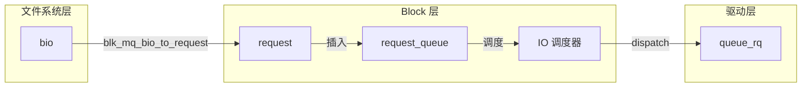
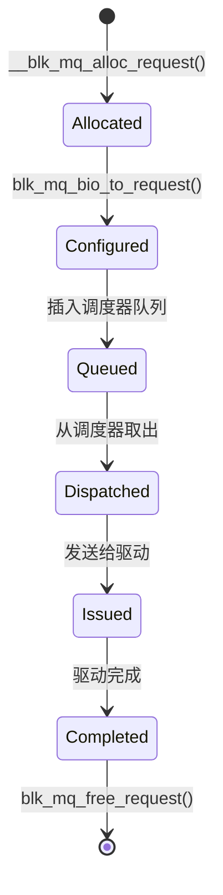

# Request 机制详解

## 学习目标

- 理解 request 的设计理念和生命周期
- 掌握 request 的结构和关键字段
- 理解 request 的分配和释放机制
- 了解 request 与 bio 的关系
- 理解 request 的状态转换和合并机制

## 概述

request 是 Block 层内部处理 IO 请求的主要数据结构。它由一个或多个 bio 组成，是 Block 层与驱动层交互的接口。

本文档深入讲解 request 的设计理念、实现机制和使用场景。

---

## 一、Request 的设计理念

### 为什么需要 request？

**bio 的局限性**：
- bio 是文件系统层与 Block 层的接口，不适合 Block 层内部处理
- 多个 bio 需要合并为一个 IO 请求
- 需要额外的元数据来管理 IO 请求

**request 的解决方案**：
1. **请求聚合**：将多个 bio 合并为一个 request
2. **元数据管理**：存储请求的调度信息、统计信息等
3. **生命周期管理**：管理请求从创建到完成的整个生命周期

### Request 在 IO 路径中的位置



---

## 二、Request 的结构和字段详解

### 完整结构定义

**定义位置**：`include/linux/blkdev.h`

**关键字段**（已在第2篇文章中详细介绍，这里补充说明）：

```c
struct request {
    // 队列相关
    struct request_queue *q;        // 所属请求队列
    struct blk_mq_ctx *mq_ctx;      // 软件队列上下文（blk-mq）
    struct blk_mq_hw_ctx *mq_hctx;  // 硬件队列上下文（blk-mq）
    
    // 请求标识
    unsigned int cmd_flags;          // 命令标志
    req_flags_t rq_flags;            // 请求标志
    int tag;                         // driver tag（驱动使用）
    int internal_tag;                // internal tag（调度器使用）
    
    // 数据相关
    unsigned int __data_len;         // 总数据长度
    sector_t __sector;               // 起始扇区号
    
    // Bio 链表
    struct bio *bio;                 // bio 链表头
    struct bio *biotail;             // bio 链表尾
    
    // 队列链表
    struct list_head queuelist;      // 队列链表节点
    
    // 调度器相关
    union {
        struct {
            struct io_cq *icq;       // IO 上下文
            void *priv[2];           // 调度器私有数据
        } elv;
        // ...
    };
    
    // 设备相关
    struct gendisk *rq_disk;        // 磁盘
    struct block_device *part;       // 分区
    
    // 时间戳
    u64 start_time_ns;               // 请求分配时间
    u64 io_start_time_ns;            // IO 提交时间
    
    // 完成回调
    rq_end_io_fn *end_io;            // 请求完成回调
    void *end_io_data;                // 完成回调数据
};
```

### 关键字段详解

#### 1. bio / biotail - Bio 链表

**关系**：
- 一个 request 可以包含多个 bio
- bio 通过链表连接
- `bio` 指向链表头，`biotail` 指向链表尾

**示例**：
```
Request:
  bio1 (扇区 0-10)  ->  bio2 (扇区 11-20)  ->  bio3 (扇区 21-30)
  ↑                                           ↑
  bio                                        biotail
```

#### 2. tag / internal_tag - Tag 标识

**区别**：
- **internal_tag**：调度器使用，在 Insert 阶段分配
- **driver tag**：驱动使用，在 Issue 阶段分配

**使用场景**：
```c
// Insert 阶段：分配 internal_tag
rq->internal_tag = blk_mq_get_tag(...);

// Issue 阶段：分配 driver tag
rq->tag = blk_mq_get_driver_tag(...);
```

#### 3. queuelist - 队列链表

**作用**：将 request 链接到队列中

**使用场景**：
- 插入调度器队列
- 插入硬件队列的 dispatch 列表
- 管理请求的顺序

---

## 三、Request 的分配和释放

### Request 分配

#### 1. __blk_mq_alloc_request() - 分配 request

**函数实现**（简化）：
```c
static struct request *__blk_mq_alloc_request(struct blk_mq_alloc_data *data)
{
    struct request *rq;
    unsigned int tag;
    
    // 1. 分配 tag（根据是否有调度器，从 sched_tags 或 tags 分配）
    tag = blk_mq_get_tag(data);
    if (tag == BLK_MQ_NO_TAG)
        return NULL;
    
    // 2. 从正确的 tag 池获取 request
    // blk_mq_tags_from_data() 根据是否有调度器返回 sched_tags 或 tags
    struct blk_mq_tags *tags = blk_mq_tags_from_data(data);
    rq = tags->static_rqs[tag];
    
    // 3. 初始化 request
    blk_mq_rq_ctx_init(data->q, data->ctx, tag, data->cmd_flags, rq);
    
    return rq;
}
```

#### 2. blk_mq_rq_ctx_init() - 初始化 request

**函数实现**（简化）：
```c
static void blk_mq_rq_ctx_init(struct request_queue *q,
                               struct blk_mq_ctx *ctx,
                               unsigned int tag,
                               unsigned int op,
                               struct request *rq)
{
    // 初始化基本字段
    rq->q = q;
    rq->mq_ctx = ctx;
    rq->cmd_flags = op;
    
    // 根据是否有调度器，设置不同的 tag 字段
    if (q->elevator) {
        rq->tag = BLK_MQ_NO_TAG;      // 有调度器：driver_tag 后面 Issue 时再分配
        rq->internal_tag = tag;        // internal_tag 现在分配
    } else {
        rq->tag = tag;                 // 无调度器：直接设置 driver_tag
        rq->internal_tag = BLK_MQ_NO_TAG;
    }
    
    // 初始化链表
    INIT_LIST_HEAD(&rq->queuelist);
    
    // 初始化时间戳
    rq->start_time_ns = ktime_get_ns();
}
```

#### 3. Request 池机制

**静态 request 池**：
- 每个硬件队列维护一个静态 request 池
- 使用 tag 作为索引
- 避免频繁分配和释放

**分配策略**：
```c
// 从正确的 tag 池获取 request
// 有调度器：从 sched_tags 获取
// 无调度器：从 tags 获取
struct blk_mq_tags *tags = blk_mq_tags_from_data(data);
rq = tags->static_rqs[tag];
```

### Request 释放

#### 1. blk_mq_free_request() - 释放 request

**函数实现**（简化）：
```c
void blk_mq_free_request(struct request *rq)
{
    struct request_queue *q = rq->q;
    struct blk_mq_hw_ctx *hctx = rq->mq_hctx;
    struct blk_mq_ctx *ctx = rq->mq_ctx;
    
    // 1. 释放 driver tag
    if (rq->tag != BLK_MQ_NO_TAG)
        blk_mq_put_tag(hctx->tags, ctx, rq->tag);
    
    // 2. 释放 internal tag（注意：是 sched_tags，不是 tags！）
    if (rq->internal_tag != BLK_MQ_NO_TAG)
        blk_mq_put_tag(hctx->sched_tags, ctx, rq->internal_tag);
    
    // 3. 调用驱动的清理函数
    if (q->mq_ops->exit_request)
        q->mq_ops->exit_request(hctx, rq, rq->tag);
    
    // 4. 释放 bio
    if (rq->bio) {
        bio_list_merge(&bio_list, &rq->bio_list);
        bio_list_init(&rq->bio_list);
    }
}
```

---

## 四、Request 与 Bio 的关系

### Bio 到 Request 的转换

#### 1. blk_mq_bio_to_request() - bio 转换为 request

**函数实现**（简化）：
```c
void blk_mq_bio_to_request(struct request *rq, struct bio *bio,
                           unsigned int nr_segs)
{
    // 1. 设置请求的基本信息
    rq->__sector = bio->bi_iter.bi_sector;
    rq->__data_len = bio->bi_iter.bi_size;
    rq->bio = rq->biotail = bio;
    
    // 2. 设置操作类型
    rq->cmd_flags = bio->bi_opf;
    
    // 3. 设置设备
    rq->rq_disk = bio->bi_bdev->bd_disk;
    rq->part = bio->bi_bdev;
    
    // 4. 初始化 bio 链表
    bio_list_init(&rq->bio_list);
    bio_list_add(&rq->bio_list, bio);
    
    // 5. 调用驱动的准备函数
    if (rq->q->mq_ops->prepare_request)
        rq->q->mq_ops->prepare_request(rq);
}
```

### Request 包含多个 Bio

#### 1. 合并场景

**相邻扇区的 bio 可以合并**：
```c
// 合并相邻的 bio 到同一个 request
static bool blk_attempt_bio_merge(struct request_queue *q,
                                  struct request *rq,
                                  struct bio *bio)
{
    // 检查是否可以合并
    if (blk_rq_sectors(rq) + bio_sectors(bio) > queue_max_sectors(q))
        return false;
    
    // 合并 bio
    blk_rq_bio_prep(rq, bio, nr_segs);
    
    return true;
}
```

#### 2. blk_rq_bio_prep() - 添加 bio 到 request

**函数实现**（简化）：
```c
void blk_rq_bio_prep(struct request *rq, struct bio *bio, unsigned int nr_segs)
{
    // 添加到 bio 链表
    if (rq->bio) {
        rq->biotail->bi_next = bio;
        rq->biotail = bio;
    } else {
        rq->bio = rq->biotail = bio;
    }
    
    // 更新数据长度
    rq->__data_len += bio->bi_iter.bi_size;
    
    // 更新段数
    rq->nr_phys_segments += nr_segs;
}
```

---

## 五、Request 的状态转换

### Request 生命周期



### 状态说明

#### 1. Allocated（已分配）
- request 已从池中分配
- internal tag 已分配
- 基本字段已初始化

#### 2. Configured（已配置）
- bio 已添加到 request
- 请求参数已设置
- 准备插入队列

#### 3. Queued（已入队）
- request 已插入调度器队列
- 等待调度器处理

#### 4. Dispatched（已分发）
- request 已从调度器取出
- 准备发送给驱动

#### 5. Issued（已发出）
- driver tag 已分配
- request 已发送给驱动
- 硬件正在处理

#### 6. Completed（已完成）
- 硬件处理完成
- 回调已执行
- 准备释放

---

## 六、Request 的合并机制

### 合并类型

#### 1. Front Merge（前向合并）

**场景**：新 bio 的起始扇区紧接在 request 的起始扇区之前

**示例**：
```
Request: [扇区 10-20]
New Bio: [扇区 0-9]
Result:  [扇区 0-20]  (前向合并)
```

#### 2. Back Merge（后向合并）

**场景**：新 bio 的起始扇区紧接在 request 的结束扇区之后

**示例**：
```
Request: [扇区 0-10]
New Bio: [扇区 11-20]
Result:  [扇区 0-20]  (后向合并)
```

### 合并检查

#### 1. elv_bio_merge_ok() - 检查是否可以合并

**函数实现**：
```c
bool elv_bio_merge_ok(struct request *rq, struct bio *bio)
{
    // 检查操作类型是否相同
    if (req_op(rq) != bio_op(bio))
        return false;
    
    // 检查是否可以合并标志
    if (!bio_mergeable(bio))
        return false;
    
    // 检查调度器是否允许合并
    if (!elv_iosched_allow_bio_merge(rq, bio))
        return false;
    
    return true;
}
```

#### 2. 合并限制

**不能合并的情况**：
- 操作类型不同（READ vs WRITE）
- 设置了 `REQ_NOMERGE` 标志
- 调度器不允许合并
- 超过队列最大扇区数

---

## 七、Request 的使用场景

### 场景 1：文件系统读取

```c
// bio 转换为 request
static void ext4_readpage_to_request(struct bio *bio)
{
    struct request *rq;
    
    // 分配 request
    rq = __blk_mq_alloc_request(&data);
    
    // bio 转换为 request
    blk_mq_bio_to_request(rq, bio, nr_segs);
    
    // 插入调度器队列
    blk_mq_sched_insert_request(rq, false, true, true);
}
```

### 场景 2：请求合并

```c
// 尝试合并 bio 到现有 request
static bool try_merge_bio(struct request_queue *q,
                          struct bio *bio)
{
    struct request *rq;
    
    // 查找可以合并的 request
    rq = elv_rqhash_find(q, bio->bi_iter.bi_sector);
    
    if (rq && elv_bio_merge_ok(rq, bio)) {
        // 合并 bio
        blk_rq_bio_prep(rq, bio, nr_segs);
        return true;
    }
    
    return false;
}
```

---

## 总结

### 核心要点

1. **Request 的设计理念**：
   - 聚合多个 bio 为一个 IO 请求
   - 管理请求的元数据和生命周期
   - 作为 Block 层与驱动层的接口

2. **Request 的关键机制**：
   - **分配和释放**：使用静态 request 池和 tag 机制
   - **与 bio 的关系**：一个 request 可以包含多个 bio
   - **状态转换**：从分配到完成的完整生命周期

3. **Request 的合并机制**：
   - 支持前向合并和后向合并
   - 提高 IO 效率
   - 减少设备寻道时间

### 关键函数

- `__blk_mq_alloc_request()` - 分配 request
- `blk_mq_free_request()` - 释放 request
- `blk_mq_bio_to_request()` - bio 转换为 request
- `blk_rq_bio_prep()` - 添加 bio 到 request

### 后续学习

- [Request 队列管理](07-Request队列管理.md) - 理解 request_queue 的管理机制
- [blk_mq 请求生命周期详解](12-blk_mq请求生命周期详解.md) - 深入理解 request 的完整生命周期

## 参考资源

- 内核源码：
  - `block/blk-mq.c` - request 的分配和释放
  - `include/linux/blkdev.h` - request 数据结构定义
- 相关文章：
  - [Block 层核心数据结构](02-Block层核心数据结构.md) - request 数据结构详解
  - [Bio 机制详解](04-Bio机制详解.md) - bio 如何转换为 request

## 更新记录

- 2026-01-26：初始创建，包含 request 机制的详细说明
