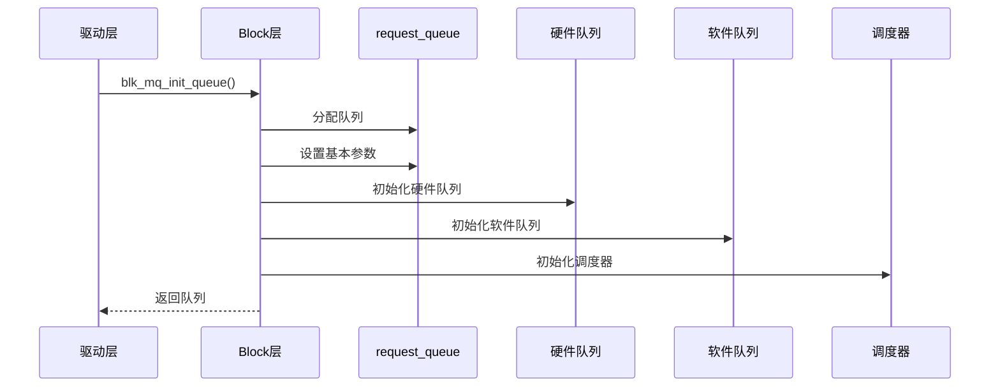
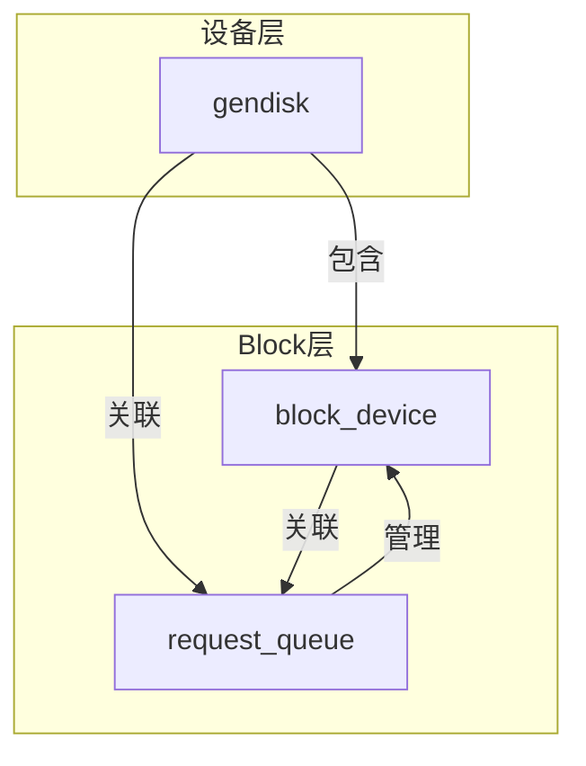

# Request 队列管理

## 学习目标

- 理解 request_queue 的创建和初始化过程
- 掌握队列标志和设置的管理
- 了解队列的注册和注销机制
- 理解队列与设备的绑定关系
- 了解队列的统计信息管理

## 概述

request_queue 是 Block 层的核心管理结构，每个块设备对应一个请求队列。它管理 IO 请求的队列、调度、统计等功能。

本文档深入讲解 request_queue 的管理机制和使用场景。

---

## 一、Request Queue 的创建和初始化

### 队列创建

#### 1. blk_mq_init_queue() - 创建 blk-mq 队列

**函数定义**：`block/blk-mq.c`

```c
struct request_queue *blk_mq_init_queue(struct blk_mq_tag_set *set,
                                       const struct blk_mq_ops *ops)
{
    struct request_queue *q;
    
    // 1. 分配队列
    q = blk_alloc_queue(set->driver_data, set->numa_node);
    if (!q)
        return ERR_PTR(-ENOMEM);
    
    // 2. 初始化队列
    q->mq_ops = ops;
    q->tag_set = set;
    
    // 3. 初始化 blk-mq
    blk_mq_init_allocated_queue(set, q);
    
    return q;
}
```

#### 2. blk_mq_init_allocated_queue() - 初始化队列

**函数实现**（简化）：
```c
int blk_mq_init_allocated_queue(struct blk_mq_tag_set *set,
                                struct request_queue *q)
{
    // 1. 初始化队列标志
    q->queue_flags = QUEUE_FLAG_MQ_DEFAULT;
    
    // 2. 初始化硬件队列
    q->nr_hw_queues = set->nr_hw_queues;
    blk_mq_init_hctx(q, set, hctx, hctx_idx);
    
    // 3. 初始化软件队列
    blk_mq_init_ctx(q, ctx);
    
    // 4. 初始化调度器
    if (set->elevator)
        blk_mq_init_sched(q, set->elevator);
    
    // 5. 初始化其他组件
    blk_queue_make_request(q, blk_mq_make_request);
    blk_mq_init_cpu_queues(q, set->nr_hw_queues);
    
    return 0;
}
```

### 队列初始化步骤



---

## 二、队列标志和设置

### 队列标志（queue_flags）

#### 1. 常见标志

**定义位置**：`include/linux/blkdev.h`

```c
#define QUEUE_FLAG_STOPPED        0  // 队列已停止
#define QUEUE_FLAG_DYING          1  // 队列正在死亡
#define QUEUE_FLAG_NOMERGES       2  // 禁用合并
#define QUEUE_FLAG_SAME_COMP       3  // 相同 CPU 完成
#define QUEUE_FLAG_FAIL_IO        4  // IO 失败
#define QUEUE_FLAG_NONROT         5  // 非旋转设备
#define QUEUE_FLAG_ADD_RANDOM     6  // 添加随机性
#define QUEUE_FLAG_SYNCHRONOUS    7  // 同步设备
#define QUEUE_FLAG_SAME_FORCE     8  // 强制相同 CPU
#define QUEUE_FLAG_INIT_DONE      9  // 初始化完成
#define QUEUE_FLAG_STABLE_WRITES  10 // 稳定写入
#define QUEUE_FLAG_POLL           11 // 支持轮询
#define QUEUE_FLAG_WC             12 // 写缓存
#define QUEUE_FLAG_FUA            13 // Force Unit Access
#define QUEUE_FLAG_DAX            14 // 支持 DAX
#define QUEUE_FLAG_STATS          15 // 统计信息
#define QUEUE_FLAG_REGISTERED     16 // 已注册
#define QUEUE_FLAG_QUIESCED       17 // 已静默
#define QUEUE_FLAG_PCI_P2PDMA     18 // PCI P2P DMA
#define QUEUE_FLAG_ZONE_RESET     19 // 区域重置
#define QUEUE_FLAG_RQ_ALLOC_TIME  20 // 请求分配时间
#define QUEUE_FLAG_HCTX_ACTIVE    21 // 硬件队列活跃
#define QUEUE_FLAG_NOWAIT         22 // 非阻塞
#define QUEUE_FLAG_SQ_SCHED       23 // 单队列调度
#define QUEUE_FLAG_SKIP_TAGSET_QUIESCE 24 // 跳过 tagset 静默
```

#### 2. 标志管理函数

**设置标志**：
```c
void blk_queue_flag_set(unsigned int flag, struct request_queue *q)
{
    set_bit(flag, &q->queue_flags);
}
```

**清除标志**：
```c
void blk_queue_flag_clear(unsigned int flag, struct request_queue *q)
{
    clear_bit(flag, &q->queue_flags);
}
```

**检查标志**：
```c
bool blk_queue_flag_test_and_set(unsigned int flag, struct request_queue *q)
{
    return test_and_set_bit(flag, &q->queue_flags);
}
```

### 队列限制（queue_limits）

#### 1. queue_limits 结构

**定义位置**：`include/linux/blkdev.h`

```c
struct queue_limits {
    unsigned long max_sectors;          // 最大扇区数
    unsigned int max_segments;          // 最大段数
    unsigned int max_segment_size;      // 最大段大小
    unsigned int logical_block_size;    // 逻辑块大小
    unsigned int physical_block_size;   // 物理块大小
    unsigned int alignment_offset;      // 对齐偏移
    unsigned int io_min;                // 最小 IO 大小
    unsigned int io_opt;                // 最优 IO 大小
    unsigned int max_discard_sectors;   // 最大丢弃扇区数
    unsigned int max_hw_discard_sectors; // 硬件最大丢弃扇区数
    unsigned int max_write_same_sectors; // 最大写入相同扇区数
    unsigned int max_zone_append_sectors; // 最大区域追加扇区数
    // ...
};
```

#### 2. 设置队列限制

**示例**：
```c
// 设置队列限制
blk_queue_max_hw_sectors(q, 512);
blk_queue_logical_block_size(q, 512);
blk_queue_physical_block_size(q, 4096);
blk_queue_max_segments(q, 128);
```

---

## 三、队列的注册和注销

### 队列注册

#### 1. device_add_disk() - 注册磁盘

**函数实现**（简化）：
```c
int device_add_disk(struct device *parent, struct gendisk *disk,
                   const struct attribute_group **groups)
{
    // 1. 注册块设备
    register_bdev(disk);
    
    // 2. 注册到 sysfs
    disk_add_events(disk);
    disk_register_events(disk);
    
    // 3. 扫描分区
    if (disk_part_scan_enabled(disk))
        bdev_add(disk, 0);
    
    return 0;
}
```

#### 2. 队列与设备的绑定

**绑定关系**：
```c
// 队列关联磁盘
q->disk = disk;
disk->queue = q;

// 队列关联块设备
bdev->bd_queue = q;
```

### 队列注销

#### 1. del_gendisk() - 注销磁盘

**函数实现**（简化）：
```c
void del_gendisk(struct gendisk *gp)
{
    // 1. 停止队列
    blk_queue_stop(gp->queue);
    
    // 2. 注销事件
    disk_del_events(gp);
    
    // 3. 注销块设备
    unregister_bdev(gp);
    
    // 4. 清理队列
    blk_put_queue(gp->queue);
}
```

#### 2. blk_cleanup_queue() - 清理队列

**函数实现**（简化）：
```c
void blk_cleanup_queue(struct request_queue *q)
{
    // 1. 标记队列为死亡
    blk_set_queue_dying(q);
    
    // 2. 停止队列
    blk_queue_stop(q);
    
    // 3. 清理调度器
    if (q->elevator)
        elevator_exit(q);
    
    // 4. 清理 blk-mq
    blk_mq_exit_queue(q);
    
    // 5. 释放队列
    blk_put_queue(q);
}
```

---

## 四、队列与设备的绑定关系

### 绑定关系图



### 绑定过程

#### 1. 驱动注册队列

```c
// 驱动注册队列示例
static int nvme_probe(struct pci_dev *pdev, const struct pci_device_id *id)
{
    struct nvme_dev *dev;
    struct request_queue *q;
    
    // 创建队列
    q = blk_mq_init_queue(&dev->tag_set, &nvme_mq_ops);
    
    // 关联磁盘
    dev->disk->queue = q;
    q->disk = dev->disk;
    
    // 注册磁盘
    device_add_disk(&pdev->dev, dev->disk, NULL);
    
    return 0;
}
```

#### 2. 文件系统使用队列

```c
// 文件系统获取队列
static int ext4_fill_super(struct super_block *sb, ...)
{
    struct block_device *bdev = sb->s_bdev;
    struct request_queue *q = bdev->bd_queue;
    
    // 使用队列
    unsigned int max_sectors = queue_max_sectors(q);
    
    return 0;
}
```

---

## 五、队列的统计信息

### 统计信息结构

#### 1. blk_queue_stats - 队列统计

**结构定义**：
```c
struct blk_queue_stats {
    struct blk_stat_callback __rcu *callback;
    struct blk_rq_stat cpu_stat[BLK_MQ_STAT_BATCH];
    struct blk_rq_stat stat[BLK_MQ_STAT_BATCH];
    unsigned int nr_samples;
    bool enable_accounting;
};
```

#### 2. 统计信息类型

**常见统计**：
- **IO 数量**：读取/写入的 IO 数量
- **IO 大小**：平均 IO 大小
- **IO 延迟**：平均 IO 延迟
- **队列深度**：平均队列深度

### 统计信息收集

#### 1. blk_stat_add() - 添加统计

**函数实现**（简化）：
```c
void blk_stat_add(struct request *rq, u64 now)
{
    struct request_queue *q = rq->q;
    struct blk_queue_stats *stats = q->stats;
    
    if (!stats)
        return;
    
    // 计算 IO 延迟
    u64 duration = now - rq->io_start_time_ns;
    
    // 添加到统计
    blk_rq_stat_add(&stats->stat[rq->mq_hctx->queue_num],
                    duration);
}
```

#### 2. 统计信息查看

**通过 sysfs 查看**：
```bash
# 查看队列统计信息
cat /sys/block/sda/queue/stats
```

---

## 总结

### 核心要点

1. **Request Queue 的创建**：
   - 使用 `blk_mq_init_queue()` 创建队列
   - 初始化硬件队列和软件队列
   - 设置队列标志和限制

2. **队列标志和设置**：
   - 使用 `queue_flags` 管理队列状态
   - 使用 `queue_limits` 设置队列限制
   - 影响 IO 行为和性能

3. **队列的注册和注销**：
   - 通过 `device_add_disk()` 注册队列
   - 通过 `del_gendisk()` 注销队列
   - 队列与设备绑定关系

### 关键函数

- `blk_mq_init_queue()` - 创建队列
- `blk_cleanup_queue()` - 清理队列
- `blk_queue_flag_set()` - 设置队列标志
- `blk_queue_max_hw_sectors()` - 设置队列限制

### 后续学习

- [Request 机制详解](06-Request机制详解.md) - 理解 request 在队列中的管理
- [blk_mq 基础架构与核心概念](09-blk_mq基础架构与核心概念.md) - 理解 blk-mq 队列管理

## 参考资源

- 内核源码：
  - `block/blk-mq.c` - 队列创建和初始化
  - `block/blk-core.c` - 队列管理函数
  - `include/linux/blkdev.h` - 队列数据结构定义
- 相关文章：
  - [Block 层核心数据结构](02-Block层核心数据结构.md) - request_queue 数据结构详解

## 更新记录

- 2026-01-26：初始创建，包含 request_queue 管理机制的详细说明
