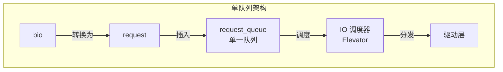
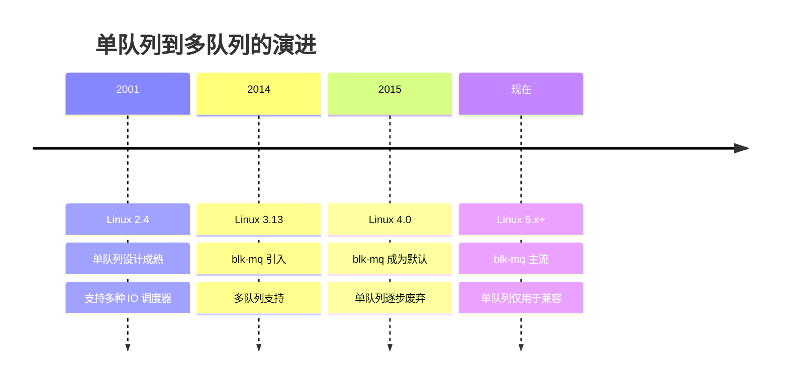

# 传统单队列机制

## 学习目标

- 理解传统单队列设计的历史背景
- 了解单队列的架构和实现
- 理解单队列的局限性
- 了解为什么需要多队列（blk-mq）
- 理解单队列到多队列的演进过程

## 概述

在 blk-mq（多队列）机制出现之前，Linux 内核使用传统的单队列设计来处理块设备 IO。虽然现在大多数设备都使用 blk-mq，但理解传统单队列设计有助于理解 blk-mq 的设计理念和优势。

本文档介绍传统单队列设计的历史背景、架构和局限性。

---

## 一、传统单队列设计的历史背景

### 设计时代

**时间线**：
- **Linux 2.4 及之前**：使用单队列设计
- **Linux 2.6**：单队列设计成熟
- **Linux 3.13（2014年）**：blk-mq 引入
- **Linux 4.0+**：blk-mq 成为主流

### 设计目标

**单队列设计的目标**：
1. **简单性**：单一队列，易于理解和实现
2. **兼容性**：支持所有类型的块设备
3. **调度灵活性**：支持多种 IO 调度算法

---

## 二、传统单队列的架构

### 架构设计



### 核心特点

#### 1. 单一全局队列

**特点**：
- 所有 IO 请求进入同一个队列
- 使用单一锁保护队列
- 所有 CPU 共享同一个队列

**实现**：
```c
// 传统单队列结构（简化）
struct request_queue {
    struct list_head queue_head;  // 单一队列头
    spinlock_t queue_lock;        // 队列锁
    struct elevator_queue *elevator; // IO 调度器
    // ...
};
```

#### 2. 队列锁竞争

**问题**：
- 多个 CPU 同时访问队列时，锁竞争严重
- 缓存行失效频繁
- 扩展性差

**锁竞争示例**：
```c
// 所有 CPU 竞争同一个锁
spin_lock_irq(&q->queue_lock);
list_add_tail(&rq->queuelist, &q->queue_head);
spin_unlock_irq(&q->queue_lock);
```

---

## 三、单队列的局限性

### 1. 锁竞争瓶颈

**问题描述**：
- 所有 CPU 竞争同一个队列锁
- 锁竞争成为性能瓶颈
- 无法充分利用多核 CPU

**性能影响**：
- CPU 核心数增加时，性能提升有限
- 锁等待时间增加
- 缓存行失效频繁

### 2. 缓存行失效

**问题描述**：
- 多个 CPU 修改同一队列
- 导致缓存行频繁失效
- 内存访问延迟增加

**示例**：
```
CPU 0: 修改 queue_head
CPU 1: 修改 queue_head  (导致 CPU 0 的缓存失效)
CPU 2: 修改 queue_head  (导致 CPU 0 和 CPU 1 的缓存失效)
```

### 3. 无法利用硬件并行性

**问题描述**：
- 现代 SSD 和 NVMe 设备支持多队列
- 单队列设计无法充分利用硬件并行性
- 硬件性能无法充分发挥

**硬件能力**：
- NVMe 设备支持多个提交队列和完成队列
- 单队列设计只能使用一个队列
- 硬件资源浪费

---

## 四、为什么需要多队列？

### 多队列的优势

#### 1. 减少锁竞争

**解决方案**：
- 每个 CPU 有独立的软件队列
- 减少锁竞争
- 提高并发性能

**对比**：
```
单队列：
  CPU 0, 1, 2, ... N  →  竞争同一个锁  →  性能瓶颈

多队列：
  CPU 0  →  队列 0  (独立锁)
  CPU 1  →  队列 1  (独立锁)
  CPU 2  →  队列 2  (独立锁)
  ...
  减少锁竞争，提高性能
```

#### 2. 利用硬件并行性

**解决方案**：
- 多个硬件队列映射到设备的多个队列
- 充分利用硬件并行性
- 提高 IO 吞吐量

**对比**：
```
单队列：
  软件队列  →  硬件队列 0  →  设备队列 0
  (只能使用一个硬件队列)

多队列：
  软件队列 0  →  硬件队列 0  →  设备队列 0
  软件队列 1  →  硬件队列 1  →  设备队列 1
  软件队列 2  →  硬件队列 2  →  设备队列 2
  ...
  (充分利用多个硬件队列)
```

#### 3. 更好的扩展性

**解决方案**：
- 性能随 CPU 核心数线性扩展
- 支持大规模 SMP 系统
- 适应现代硬件架构

---

## 五、单队列到多队列的演进

### 演进时间线



### 演进过程

#### 1. 问题识别（2000s）

**发现的问题**：
- 多核系统性能不佳
- 锁竞争成为瓶颈
- 硬件性能无法充分利用

#### 2. 设计阶段（2010-2013）

**设计目标**：
- 减少锁竞争
- 利用硬件并行性
- 保持向后兼容

#### 3. 实现阶段（2013-2014）

**关键里程碑**：
- 2013年：blk-mq 原型
- 2014年：Linux 3.13 引入 blk-mq
- 2015年：Linux 4.0 blk-mq 成为默认

#### 4. 成熟阶段（2015+）

**现状**：
- blk-mq 成为主流
- 单队列仅用于兼容旧设备
- 新设备都使用 blk-mq

---

## 六、单队列与多队列的对比

### 架构对比

| 特性 | 单队列 | 多队列（blk-mq） |
|------|--------|------------------|
| 队列数量 | 1 个全局队列 | 多个软件队列 + 多个硬件队列 |
| 锁竞争 | 严重（所有 CPU 竞争） | 轻微（每个 CPU 独立队列） |
| 硬件利用 | 只能使用一个硬件队列 | 可以使用多个硬件队列 |
| 扩展性 | 差（性能不随 CPU 数线性增长） | 好（性能随 CPU 数线性增长） |
| 适用场景 | 旧设备、简单设备 | 现代 SSD、NVMe 设备 |

### 性能对比

**单队列性能**：
- CPU 核心数增加时，性能提升有限
- 锁竞争导致性能瓶颈
- 无法充分利用硬件

**多队列性能**：
- 性能随 CPU 核心数线性增长
- 锁竞争大幅减少
- 充分利用硬件并行性

---

## 七、单队列的遗留代码

### 当前状态

**单队列代码**：
- 仍然存在于内核中（用于兼容）
- 主要用于旧设备驱动
- 新设备都使用 blk-mq

### 兼容性

**向后兼容**：
- 旧驱动可以继续使用单队列
- 新驱动应该使用 blk-mq
- 内核自动选择合适的方式

---

## 总结

### 核心要点

1. **传统单队列设计**：
   - 单一全局队列
   - 所有 CPU 竞争同一个锁
   - 简单但扩展性差

2. **单队列的局限性**：
   - 锁竞争瓶颈
   - 缓存行失效
   - 无法利用硬件并行性

3. **多队列的优势**：
   - 减少锁竞争
   - 利用硬件并行性
   - 更好的扩展性

4. **演进过程**：
   - 从单队列到多队列
   - blk-mq 成为主流
   - 单队列仅用于兼容

### 关键概念

- **单队列**：传统设计，单一全局队列
- **多队列**：现代设计，多个独立队列
- **锁竞争**：多 CPU 访问同一资源时的竞争
- **硬件并行性**：硬件支持多个队列并行处理

### 后续学习

- [blk_mq 基础架构与核心概念](09-blk_mq基础架构与核心概念.md) - 理解多队列设计的详细实现
- [blk_mq 队列映射与 CPU 亲和性](10-blk_mq队列映射与CPU亲和性.md) - 理解多队列的映射策略

## 参考资源

- 内核源码：
  - `block/blk-core.c` - 单队列实现（遗留代码）
  - `block/blk-mq.c` - 多队列实现
- 相关文档：
  - Linux 内核文档：`Documentation/block/`
  - blk-mq 设计文档

## 更新记录

- 2026-01-26：初始创建，包含传统单队列机制的历史背景和局限性说明
