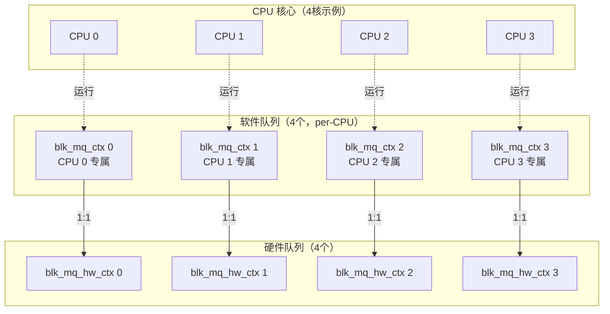
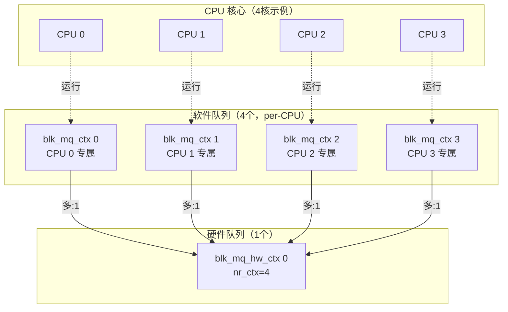
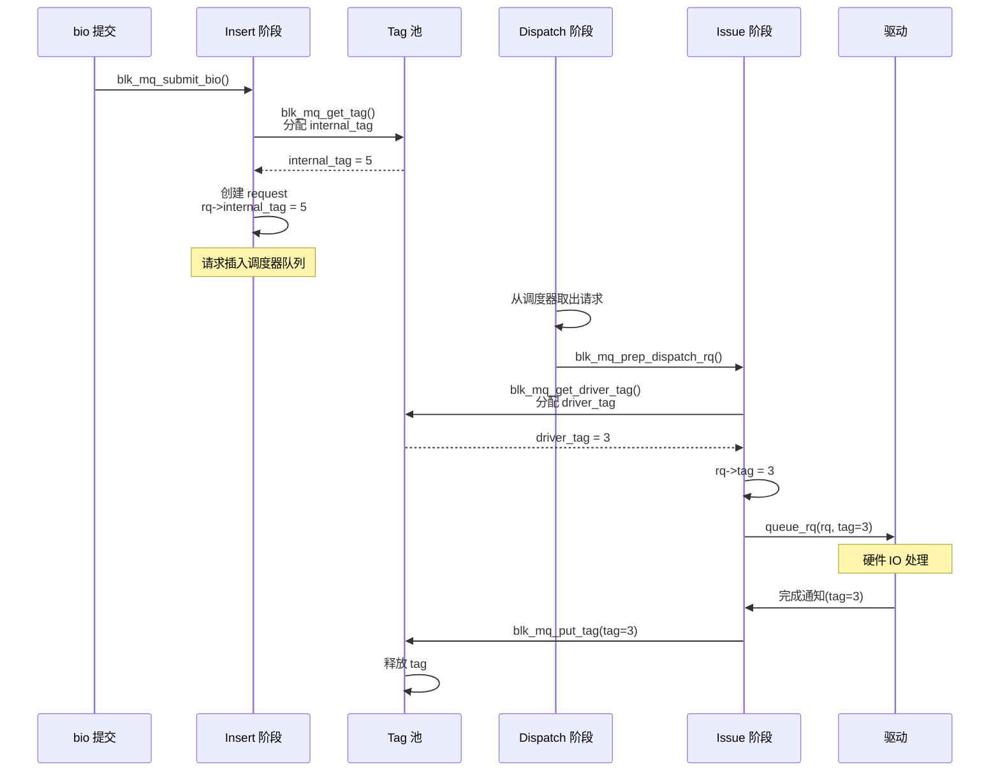
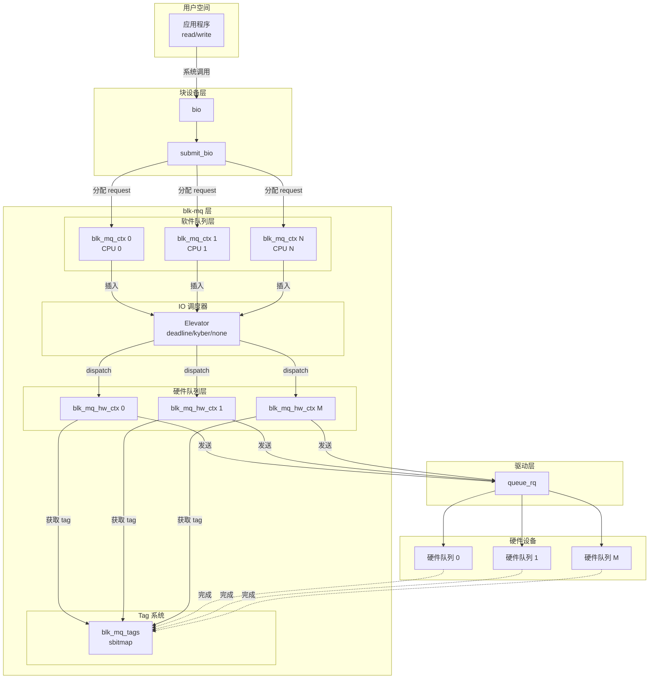

# blk_mq 基础架构与核心概念

## 学习目标

- 理解 blk-mq（Multi-Queue Block IO Queueing Mechanism）的设计理念
- 掌握软件队列和硬件队列的概念和关系
- 理解 Tag 机制的工作原理
- 了解 sbitmap 机制在 tag 管理中的作用
- 理解 blk-mq 的核心数据结构

## 概述

blk-mq（Multi-Queue Block IO Queueing Mechanism）是 Linux 内核中用于多队列块设备 IO 处理的核心机制。它解决了传统单队列设计在多核系统和现代存储设备上的性能瓶颈问题。

本文档深入讲解 blk-mq 的基础架构和核心概念，为理解 IO 请求的完整生命周期打下基础。

---

## 一、blk_mq 的诞生背景

### 为什么需要多队列？

在传统的单队列设计中，所有 IO 请求都进入一个全局队列，使用单一锁保护。这种设计在以下场景下存在瓶颈：

1. **SMP 系统的锁竞争**：多核 CPU 同时访问单一队列时，锁竞争成为瓶颈
2. **缓存行失效**：多个 CPU 修改同一队列导致缓存行频繁失效
3. **无法利用硬件并行性**：现代 SSD 和 NVMe 设备支持多队列并行处理

### blk_mq 的解决方案

blk_mq 引入了**多队列架构**：

- **软件队列（Software Staging Queues）**：每个 CPU 有独立的软件队列，减少锁竞争
- **硬件队列（Hardware Dispatch Queues）**：直接映射到设备的硬件队列
- **Tag 机制**：高效的请求标识和完成通知机制

---

## 二、核心数据结构

### 1. struct request_queue - 请求队列

**定义位置**：`include/linux/blkdev.h`

**作用**：代表一个块设备的 IO 请求队列，是 blk_mq 的顶层数据结构。

**关键字段**：
```c
struct request_queue {
    struct elevator_queue *elevator;      // IO 调度器
    struct blk_mq_ops *mq_ops;             // blk-mq 操作函数表
    unsigned int nr_hw_queues;             // 硬件队列数量
    struct blk_mq_ctxs *queue_ctx;         // 软件队列集合
    // ...
};
```

**说明**：
- 每个块设备对应一个 `request_queue`
- 可以关联 IO 调度器（如 deadline、kyber 等）
- 管理多个硬件队列和软件队列

### 2. struct blk_mq_hw_ctx - 硬件队列上下文

**定义位置**：`include/linux/blk-mq.h`

**作用**：代表一个硬件队列，直接映射到设备的硬件提交队列。

**关键字段**：
```c
struct blk_mq_hw_ctx {
    struct {
        spinlock_t lock;                   // 保护 dispatch 列表的锁
        struct list_head dispatch;         // dispatch 队列（临时存放无法发送的请求）
        unsigned long state;               // 硬件队列状态
    } ____cacheline_aligned_in_smp;
    
    struct delayed_work run_work;          // 延迟运行硬件队列的 work
    cpumask_var_t cpumask;                 // 可以运行此硬件队列的 CPU 掩码
    struct request_queue *queue;           // 所属的请求队列
    struct blk_mq_tags *tags;              // Tag 集合
    struct blk_mq_tags *sched_tags;        // 调度器 Tag 集合（如果有调度器）
    atomic_t nr_active;                    // 活跃请求数
    unsigned int queue_num;                 // 硬件队列编号
    // ...
};
```

**说明**：
- 每个硬件队列对应设备的一个硬件提交队列
- `dispatch` 列表用于临时存放因资源不足无法发送的请求
- 硬件队列数量通常等于设备支持的队列数，但不超过 CPU 核心数

### 3. struct blk_mq_ctx - 软件队列上下文

**定义位置**：`include/linux/blk-mq.h`

**作用**：代表一个软件队列，按 CPU 或 NUMA 节点分配，用于暂存和合并 IO 请求。

**关键字段**：
```c
struct blk_mq_ctx {
    struct {
        spinlock_t lock;                   // 保护软件队列的锁
        struct list_head rq_lists[HCTX_MAX_TYPES];  // 请求列表（按类型分类）
    } ____cacheline_aligned_in_smp;
    
    unsigned int cpu;                      // 所属 CPU
    struct blk_mq_hw_ctx *hctxs[HCTX_MAX_TYPES];  // 关联的硬件队列
    struct request_queue *queue;           // 所属的请求队列
    
    unsigned long rq_dispatched[2];        // dispatch 统计
    unsigned long rq_merged;                // 合并统计
    unsigned long rq_completed[2];         // 完成统计
    // ...
};
```

**说明**：
- 每个 CPU（或 NUMA 节点）有独立的软件队列
- 软件队列可以合并相邻扇区的请求
- 可以关联多个硬件队列（通过 `hctxs` 数组）

### 4. struct request - IO 请求

**定义位置**：`include/linux/blkdev.h`

**作用**：代表一个 IO 请求，由一个或多个 bio 组成。

**关键字段**：
```c
struct request {
    struct request_queue *q;               // 所属的请求队列
    struct blk_mq_ctx *mq_ctx;             // 所属的软件队列
    struct blk_mq_hw_ctx *mq_hctx;         // 所属的硬件队列
    
    unsigned int cmd_flags;                // 命令标志
    req_flags_t rq_flags;                  // 请求标志
    
    int tag;                               // driver tag（用于驱动）
    int internal_tag;                      // internal tag（用于调度器）
    
    struct bio *bio;                       // bio 链表头
    struct bio *biotail;                   // bio 链表尾
    
    struct list_head queuelist;            // 队列链表节点
    // ...
};
```

**说明**：
- `tag` 和 `internal_tag` 的区别：
  - **internal_tag**：调度器使用的 tag，在 Insert 阶段分配
  - **driver tag**：驱动使用的 tag，在 Issue 阶段分配
- 一个 request 可以包含多个 bio（通过 bio 链表）

### 5. struct blk_mq_tags - Tag 集合

**定义位置**：`block/blk-mq-tag.h`

**作用**：管理 tag 的分配和释放，使用 sbitmap 实现高效的 tag 管理。

**关键字段**：
```c
struct blk_mq_tags {
    unsigned int nr_tags;                  // tag 总数
    unsigned int nr_reserved_tags;          // 保留 tag 数量
    
    atomic_t active_queues;                 // 活跃队列数（用于共享 tag）
    
    struct sbitmap_queue *bitmap_tags;      // 普通 tag 的 bitmap
    struct sbitmap_queue *breserved_tags;   // 保留 tag 的 bitmap
    
    struct request **rqs;                   // tag 到 request 的映射
    struct request **static_rqs;            // 静态 request 池
    // ...
};
```

**说明**：
- 使用 sbitmap 实现高效的 tag 分配
- 支持保留 tag（用于高优先级请求）
- 每个 tag 对应一个 request 对象

---

## 三、软件队列 vs 硬件队列

### 软件队列（Software Staging Queues）

**特点**：
- 按 CPU 或 NUMA 节点分配，每个 CPU 有独立的软件队列
- 使用 `struct blk_mq_ctx` 表示
- 可以合并相邻扇区的请求
- 可以应用 IO 调度器进行重排序

**用途**：
1. **请求合并**：将相邻扇区的多个请求合并为一个
2. **IO 调度**：通过调度器重排序请求，提高 IO 效率
3. **减少锁竞争**：每个 CPU 有独立队列，减少锁竞争

### 硬件队列（Hardware Dispatch Queues）

**特点**：
- 直接映射到设备的硬件提交队列
- 使用 `struct blk_mq_hw_ctx` 表示
- 数量由设备硬件决定，但不超过 CPU 核心数
- 不支持重排序（FIFO 顺序）

**用途**：
1. **直接发送**：将请求直接发送给设备驱动
2. **资源管理**：管理 driver tag 等硬件资源
3. **dispatch 队列**：临时存放因资源不足无法发送的请求

### 队列映射关系

#### 数量关系

| 结构 | 数量 | 决定因素 |
|------|------|---------|
| **blk_mq_ctx（软件队列）** | = CPU 核心数 | `__percpu` 分配，每个 CPU 一个 |
| **blk_mq_hw_ctx（硬件队列）** | ≤ CPU 核心数 | 由设备驱动决定，受硬件限制 |

**典型场景**：
- **NVMe SSD**：硬件队列数通常 = CPU 核心数（1:1 映射）
- **传统 SATA/eMMC**：硬件队列数 = 1（多:1 映射）
- **中间情况**：硬件队列数 < CPU 核心数（部分共享）

#### 映射关系图

**场景 1：硬件队列数 = CPU 核心数（NVMe 典型场景，1:1 映射）**



**场景 2：硬件队列数 = 1（传统设备，多:1 映射）**



#### 关键说明

1. **软件队列是 per-CPU 的**：
   - 每个 CPU 核心有且只有**一个**专属的软件队列
   - 通过 `__percpu` 机制分配：`struct blk_mq_ctx __percpu *queue_ctx;`
   - CPU 0 只访问自己的 ctx，不会访问 CPU 1 的 ctx

2. **一个软件队列只映射到一个硬件队列**：
   - 对于特定请求类型，每个 ctx 只会将请求发送到**一个** hctx
   - 映射关系在初始化时确定，运行时不变

3. **一个硬件队列可以接收多个软件队列的请求**：
   - 当硬件队列数 < CPU 核心数时
   - `hctx->nr_ctx` 记录映射到此硬件队列的软件队列数量
   - `hctx->ctxs[]` 数组存储映射的软件队列指针

4. **访问其他 CPU 的软件队列**：
   - 正常情况下，每个 CPU 只访问自己的软件队列
   - 某些情况下（如请求完成可能在不同 CPU 上处理），会跨 CPU 访问
   - 通过 `per_cpu_ptr()` 宏访问其他 CPU 的 ctx

---

## 四、Tag 机制详解

### 为什么需要 Tag？

在传统的单队列设计中，完成 IO 请求需要线性搜索。blk_mq 使用**tag 机制**实现 O(1) 的请求查找：

1. **请求标识**：每个请求分配一个唯一的 tag（整数）
2. **快速查找**：通过 tag 直接定位到对应的 request
3. **驱动复用**：驱动可以使用 tag 标识请求，无需额外分配 ID

### Tag 的类型

#### 1. Internal Tag（内部 Tag）

- **分配时机**：Insert 阶段，分配 request 时
- **用途**：IO 调度器使用，用于标识调度器队列中的请求
- **范围**：0 到 `nr_tags - 1`
- **特点**：即使有调度器，也会分配 internal_tag

#### 2. Driver Tag（驱动 Tag）

- **分配时机**：Issue 阶段，准备发送给驱动时
- **用途**：驱动使用，用于标识硬件队列中的请求
- **范围**：0 到 `nr_tags - 1`
- **特点**：
  - 如果没有调度器，driver tag = internal tag
  - 如果有调度器，driver tag 在 dispatch 时分配

### Tag 的分配流程



### Tag 的共享机制

**共享 Tag 队列**（`BLK_MQ_F_TAG_QUEUE_SHARED`）：
- 多个硬件队列共享同一个 tag 池
- 通过 `hctx_may_queue()` 限制每个硬件队列的 tag 数量
- 防止某个硬件队列占用过多 tag

**独立 Tag 队列**：
- 每个硬件队列有独立的 tag 池
- 不需要 `hctx_may_queue()` 检查
- 适合硬件队列数量较少的情况

---

## 五、sbitmap 机制

### 什么是 sbitmap？

sbitmap（Sparse Bitmap）是 blk_mq 用于管理 tag 分配的核心数据结构，相比传统 bitmap 有以下优势：

1. **内存效率**：只存储已分配的 tag，节省内存
2. **并发性能**：支持多 CPU 并发分配 tag
3. **等待机制**：支持 tag 不足时的等待和唤醒

### sbitmap 的基本结构

```c
struct sbitmap_queue {
    struct sbitmap sb;                     // 底层 bitmap
    atomic_t wake_index;                   // 唤醒索引
    struct sbq_wait_state *ws;             // 等待状态数组
    // ...
};
```

### Tag 分配流程

1. **尝试分配**：`__sbitmap_queue_get()` 尝试从 bitmap 分配 tag
2. **分配成功**：直接返回 tag 值
3. **分配失败**：
   - 如果 `REQ_NOWAIT`，直接返回 `BLK_MQ_NO_TAG`
   - 否则，进入等待队列，等待 tag 释放

### Tag 等待机制

**⚠️ 重要区别**：internal_tag 和 driver_tag 的等待机制不同！

| Tag 类型 | 分配函数 | 等待行为 | 影响 |
|----------|----------|----------|------|
| **internal_tag** | `blk_mq_get_tag()` | **阻塞等待**（`io_schedule()`） | 进程进入 D 状态 |
| **driver_tag** | `blk_mq_get_driver_tag()` | **不阻塞**，请求放回 dispatch list | IO 延迟增加，但进程不阻塞 |

**Internal Tag 等待机制**（会阻塞进程）：

```c
// blk_mq_get_tag() 中的等待机制
tag = __sbitmap_queue_get(bt);
if (tag == BLK_MQ_NO_TAG) {
    // 准备等待
    sbitmap_prepare_to_wait(bt, ws, &wait);
    
    // 再次尝试（可能 tag 已经释放）
    tag = __sbitmap_queue_get(bt);
    if (tag == BLK_MQ_NO_TAG) {
        // 进入睡眠等待 - 进程会阻塞！
        io_schedule();
    }
    
    // 完成等待
    sbitmap_finish_wait(bt, ws, &wait);
}
```

**Driver Tag 等待机制**（不阻塞进程）：

```c
// blk_mq_get_driver_tag() 不会阻塞
bool blk_mq_get_driver_tag(struct request *rq)
{
    // 使用 __sbitmap_queue_get() 非阻塞获取
    tag = __sbitmap_queue_get(bt);
    if (tag == BLK_MQ_NO_TAG)
        return false;  // 直接返回 false，请求放回 dispatch list
    
    rq->tag = tag;
    return true;
}
```

### Tag 释放和唤醒

当请求完成时：
1. 释放 tag：`blk_mq_put_tag()` 将 tag 标记为可用
2. 唤醒等待者：`sbitmap_queue_wake_up()` 唤醒等待该 tag 的进程

---

## 六、blk_mq 的整体架构图



---

## 七、IO 请求的四个阶段

在 blk_mq 中，IO 请求经历四个主要阶段：

### 1. Insert 阶段
- **职责**：将 bio 转换为 request，分配 internal tag，插入调度器队列
- **关键函数**：`blk_mq_submit_bio()`, `__blk_mq_alloc_request()`, `blk_mq_sched_insert_request()`

### 2. Dispatch 阶段
- **职责**：从调度器队列取出请求，准备发送给驱动
- **关键函数**：`blk_mq_sched_dispatch_requests()`, `blk_mq_dispatch_rq_list()`

### 3. Issue 阶段
- **职责**：获取 driver tag，发送请求给驱动
- **关键函数**：`blk_mq_prep_dispatch_rq()`, `blk_mq_get_driver_tag()`, `blk_mq_mark_tag_wait()`, `queue_rq()`

### 4. Complete 阶段
- **职责**：IO 完成后的回调处理，释放 tag
- **关键函数**：`blk_mq_complete_request()`, `bio_endio()`

---

## 总结

### 核心要点

1. **多队列架构**：
   - **软件队列**：按 CPU 分配，减少锁竞争，支持合并和调度
   - **硬件队列**：映射到设备硬件，直接发送请求

2. **Tag 机制**：
   - **Internal Tag**：调度器使用，Insert 阶段分配
   - **Driver Tag**：驱动使用，Issue 阶段分配
   - **Tag 池**：使用 sbitmap 高效管理 tag 分配

3. **请求生命周期**：
   - **bio → request**：Insert 阶段转换
   - **request → 硬件**：Dispatch 和 Issue 阶段发送
   - **完成回调**：Complete 阶段处理

4. **并发控制**：
   - **软件队列锁**：每个 CPU 独立，减少竞争
   - **硬件队列锁**：保护 dispatch 列表
   - **Tag 分配**：sbitmap 支持并发分配

### 后续学习

- [blk_mq 队列映射与 CPU 亲和性](10-blk_mq队列映射与CPU亲和性.md) - 理解队列映射策略
- [blk_mq 调度器集成](11-blk_mq调度器集成.md) - 理解调度器与 blk-mq 的集成
- [blk_mq 请求生命周期详解](12-blk_mq请求生命周期详解.md) - 深入理解各阶段的详细流程

## 参考资源

- 内核文档：`Documentation/block/blk-mq.rst`
- 内核源码：
  - `block/blk-mq.c` - blk_mq 核心实现
  - `block/blk-mq-sched.c` - 调度器集成
  - `block/blk-mq-tag.c` - Tag 管理
  - `include/linux/blk-mq.h` - 数据结构定义
- 相关文章：
  - [Block 层概述与架构设计](01-Block层概述与架构设计.md) - Block 层整体架构
  - [Block 层 IO 路径总览](03-Block层IO路径总览.md) - IO 完整路径

## 更新记录

- 2026-01-26：初始创建，包含 blk-mq 基础架构和核心概念
