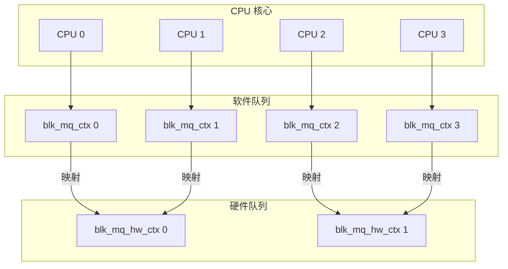

# blk_mq 队列映射与 CPU 亲和性

## 学习目标

- 理解软件队列到硬件队列的映射机制
- 掌握 CPU 亲和性设置的作用和方法
- 了解 NUMA 节点的考虑因素
- 理解队列映射策略的选择
- 了解性能优化的要点

## 概述

blk-mq 的多队列架构需要将软件队列映射到硬件队列。合理的映射策略可以提高 IO 性能，减少跨 CPU 和跨 NUMA 节点的开销。

本文档深入讲解队列映射机制和 CPU 亲和性设置。

---

## 一、队列映射的基本概念

### 映射关系

**三层映射**：
1. **CPU → 软件队列**：每个 CPU 对应一个软件队列（blk_mq_ctx）
2. **软件队列 → 硬件队列**：软件队列映射到硬件队列（blk_mq_hw_ctx）
3. **硬件队列 → 设备队列**：硬件队列直接映射到设备的硬件队列

### 映射关系图



---

## 二、队列映射策略

### 1. 默认映射策略

#### blk_mq_map_queues() - 默认映射

**函数实现**（简化）：
```c
int blk_mq_map_queues(struct blk_mq_queue_map *qmap)
{
    unsigned int *map = qmap->mq_map;
    unsigned int nr_queues = qmap->nr_queues;
    unsigned int cpu, q = 0;
    
    // 1. 初始化映射表
    for_each_possible_cpu(cpu)
        map[cpu] = -1;
    
    // 2. 先映射在线 CPU
    for_each_present_cpu(cpu) {
        if (q >= nr_queues)
            break;
        map[cpu] = queue_index(qmap, nr_queues, q++);
    }
    
    // 3. 映射其他 CPU（包括离线 CPU）
    for_each_possible_cpu(cpu) {
        if (map[cpu] != -1)
            continue;
        
        if (q < nr_queues) {
            // 顺序映射
            map[cpu] = queue_index(qmap, nr_queues, q++);
        } else {
            // 映射到兄弟线程的队列
            first_sibling = get_first_sibling(cpu);
            if (first_sibling == cpu)
                map[cpu] = queue_index(qmap, nr_queues, q++);
            else
                map[cpu] = map[first_sibling];
        }
    }
    
    return 0;
}
```

#### 映射策略说明

**策略 1：顺序映射**
- CPU 0 → 硬件队列 0
- CPU 1 → 硬件队列 1
- CPU 2 → 硬件队列 0（如果只有 2 个硬件队列）
- CPU 3 → 硬件队列 1

**策略 2：兄弟线程映射**
- 同一核心的多个线程映射到同一个硬件队列
- 减少硬件队列数量需求
- 提高缓存局部性

### 2. 自定义映射策略

#### 驱动自定义映射

**函数接口**：
```c
// 驱动可以提供自定义映射函数
struct blk_mq_ops {
    // ...
    int (*map_queues)(struct blk_mq_queue_map *qmap);
    // ...
};
```

**自定义映射示例**：
```c
// 驱动自定义映射
static int nvme_map_queues(struct blk_mq_queue_map *qmap)
{
    // 根据 NUMA 节点映射
    // 根据 CPU 拓扑映射
    // 根据设备特性映射
    return 0;
}
```

---

## 三、CPU 亲和性设置

### CPU 亲和性的作用

**作用**：
1. **减少跨 CPU 开销**：IO 完成在同一 CPU 处理
2. **提高缓存局部性**：减少缓存失效
3. **负载均衡**：合理分配 IO 负载

### CPU 亲和性设置

#### 1. 硬件队列的 CPU 掩码

**结构定义**：
```c
struct blk_mq_hw_ctx {
    cpumask_var_t cpumask;  // CPU 掩码
    // ...
};
```

**设置 CPU 掩码**：
```c
// 设置硬件队列可以运行的 CPU
cpumask_set_cpu(cpu, hctx->cpumask);
```

#### 2. 选择运行 CPU

**函数实现**（简化）：
```c
static int blk_mq_hctx_next_cpu(struct blk_mq_hw_ctx *hctx)
{
    int cpu = cpumask_first_and(hctx->cpumask, cpu_online_mask);
    
    if (cpu >= nr_cpu_ids)
        cpu = cpumask_first(hctx->cpumask);
    
    return cpu;
}
```

### CPU 亲和性的影响

#### 1. IO 完成处理

**完成路径**：
```
硬件中断
    ↓
中断处理函数（在中断 CPU 上）
    ↓
软中断处理（在 hctx->cpumask 指定的 CPU 上）
    ↓
IO 完成回调
```

#### 2. 性能优化

**优化点**：
- IO 提交和完成在同一 CPU
- 减少跨 CPU 通信
- 提高缓存命中率

---

## 四、NUMA 节点的考虑

### NUMA 架构

**NUMA（Non-Uniform Memory Access）**：
- 多 CPU 系统，每个 CPU 有本地内存
- 访问本地内存快，访问远程内存慢
- 需要考虑 NUMA 节点亲和性

### NUMA 感知的队列映射

#### 1. 按 NUMA 节点映射

**策略**：
- 同一 NUMA 节点的 CPU 映射到同一硬件队列
- 减少跨 NUMA 节点的内存访问
- 提高性能

**实现**：
```c
static int blk_mq_map_queues_numa(struct blk_mq_queue_map *qmap)
{
    int node, cpu, q = 0;
    
    // 按 NUMA 节点映射
    for_each_online_node(node) {
        for_each_cpu(cpu, cpumask_of_node(node)) {
            if (q >= qmap->nr_queues)
                break;
            qmap->mq_map[cpu] = queue_index(qmap, qmap->nr_queues, q++);
        }
    }
    
    return 0;
}
```

#### 2. NUMA 节点感知的分配

**内存分配**：
```c
// 在 NUMA 节点上分配 request
struct request *rq = __blk_mq_alloc_request(&data);
// data.node 指定 NUMA 节点
```

---

## 五、队列映射策略

### 策略 1：一对一映射

**特点**：
- 每个 CPU 对应一个硬件队列
- 硬件队列数量 = CPU 核心数
- 适合硬件队列数量充足的情况

**优势**：
- 无队列竞争
- 性能最优

**劣势**：
- 需要大量硬件队列
- 硬件可能不支持

### 策略 2：多对一映射

**特点**：
- 多个 CPU 共享一个硬件队列
- 硬件队列数量 < CPU 核心数
- 适合硬件队列数量有限的情况

**优势**：
- 适应硬件限制
- 资源利用充分

**劣势**：
- 可能存在队列竞争
- 需要合理的负载均衡

### 策略 3：NUMA 感知映射

**特点**：
- 同一 NUMA 节点的 CPU 映射到同一硬件队列
- 考虑 NUMA 拓扑
- 减少跨 NUMA 节点访问

**优势**：
- NUMA 感知
- 减少远程内存访问

**劣势**：
- 实现复杂
- 需要了解系统拓扑

---

## 六、性能优化要点

### 1. CPU 亲和性优化

**优化方法**：
- 设置合理的 CPU 掩码
- 避免频繁的 CPU 迁移
- 保持 IO 提交和完成在同一 CPU

### 2. NUMA 优化

**优化方法**：
- 按 NUMA 节点映射队列
- 在本地 NUMA 节点分配内存
- 减少跨 NUMA 节点的访问

### 3. 负载均衡

**优化方法**：
- 合理分配 CPU 到硬件队列
- 避免某些硬件队列过载
- 动态调整映射关系

---

## 总结

### 核心要点

1. **队列映射机制**：
   - CPU → 软件队列 → 硬件队列 → 设备队列
   - 支持多种映射策略
   - 可以自定义映射

2. **CPU 亲和性**：
   - 设置硬件队列可以运行的 CPU
   - 减少跨 CPU 开销
   - 提高缓存局部性

3. **NUMA 考虑**：
   - 按 NUMA 节点映射
   - 减少远程内存访问
   - 提高性能

### 关键函数

- `blk_mq_map_queues()` - 默认队列映射
- `blk_mq_hctx_next_cpu()` - 选择运行 CPU
- `cpumask_set_cpu()` - 设置 CPU 掩码

### 后续学习

- [blk_mq 调度器集成](11-blk_mq调度器集成.md) - 理解调度器与队列映射的关系
- [blk_mq 请求生命周期详解](12-blk_mq请求生命周期详解.md) - 理解请求在队列中的流转

## 参考资源

- 内核源码：
  - `block/blk-mq-cpumap.c` - CPU 映射实现
  - `block/blk-mq.c` - 队列映射相关函数
- 相关文章：
  - [blk_mq 基础架构与核心概念](09-blk_mq基础架构与核心概念.md) - blk-mq 基础架构

## 更新记录

- 2026-01-26：初始创建，包含队列映射和 CPU 亲和性的详细说明
