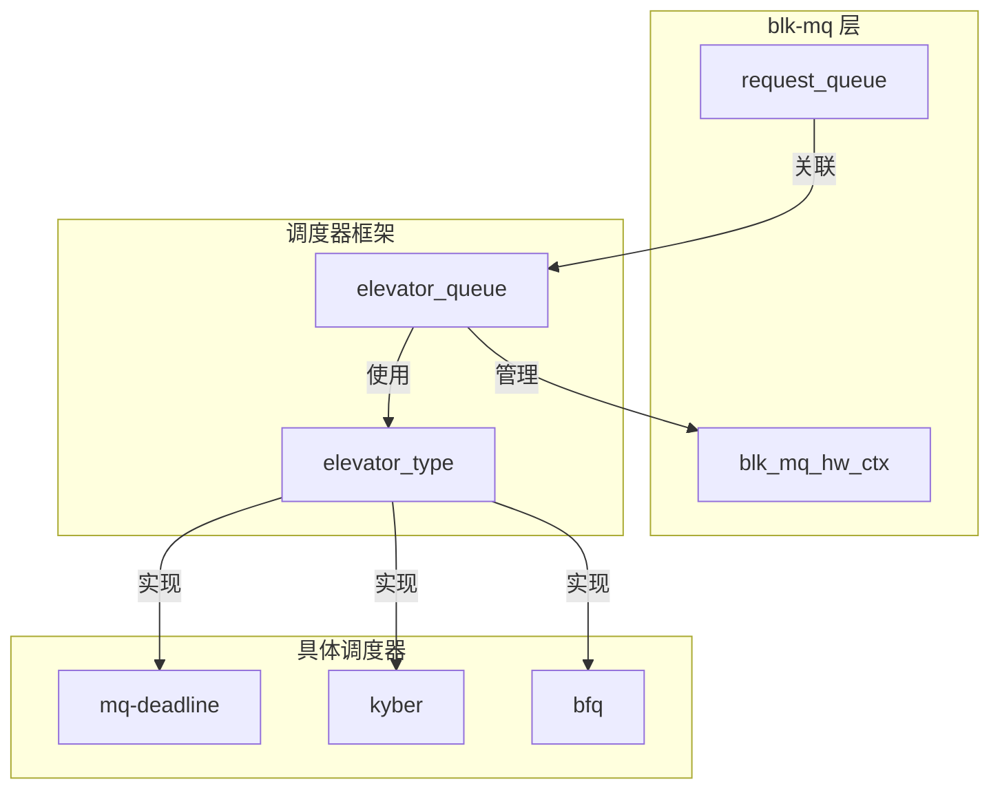
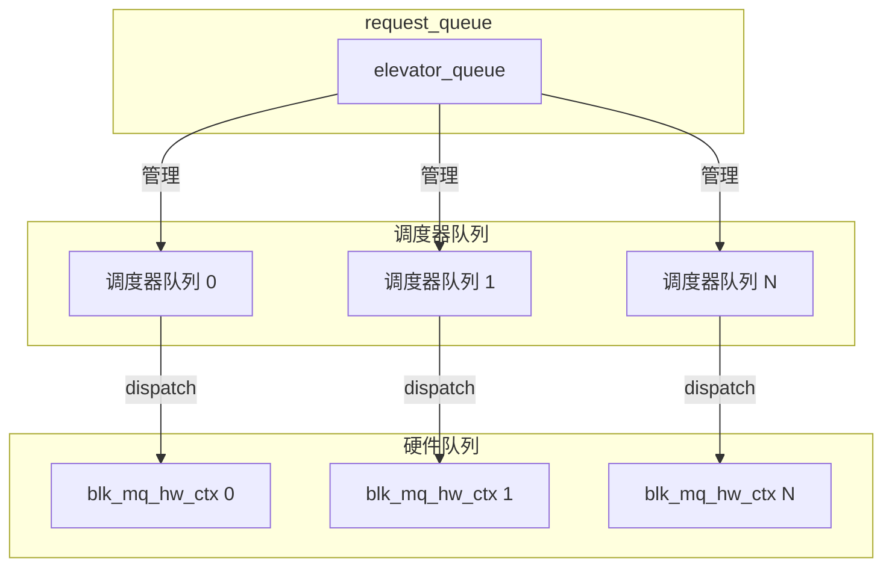
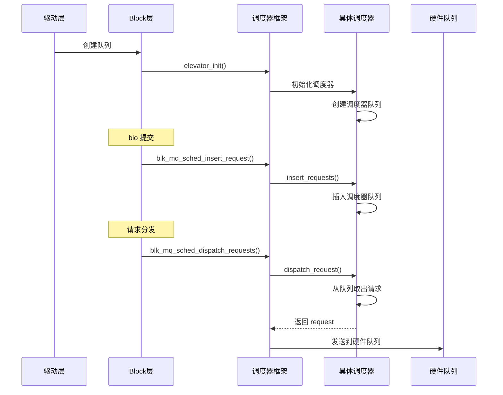

# blk_mq 调度器集成

## 学习目标

- 理解 blk-mq 与 IO 调度器的集成机制
- 掌握调度器框架（elevator）的工作原理
- 了解调度器接口（elevator_type）的定义
- 理解调度器队列管理机制
- 了解无调度器模式（none）的特点

## 概述

blk-mq 通过调度器框架（elevator）与 IO 调度器集成。调度器负责优化 IO 请求的顺序，提高吞吐量和响应时间。

本文档深入讲解 blk-mq 与调度器的集成机制。

---

## 一、blk-mq 调度器框架

### 调度器框架的作用

**作用**：
1. **统一接口**：为不同调度器提供统一的接口
2. **请求管理**：管理调度器队列中的请求
3. **调度决策**：决定请求的调度顺序

### 调度器框架结构



---

## 二、调度器接口（elevator_type）

### elevator_type 结构

**定义位置**：`include/linux/elevator.h`

```c
struct elevator_type {
    struct kmem_cache *icq_cache;      // IO 上下文缓存
    
    struct elevator_ops ops;            // 调度器操作函数
    
    size_t icq_size;                    // IO 上下文大小
    size_t icq_align;                   // IO 上下文对齐
    
    struct elv_fs_entry *elevator_attrs; // sysfs 属性
    struct elevator_attrs elevator_attr_group; // 属性组
    
    char elevator_name[ELV_NAME_MAX];   // 调度器名称
    char elevator_alias[ELV_NAME_MAX]; // 调度器别名
    
    unsigned int elevator_features;     // 调度器特性
    
    struct module *elevator_owner;      // 模块所有者
    struct list_head list;              // 链表节点
};
```

### 调度器操作函数（elevator_ops）

**定义位置**：`include/linux/elevator.h`

```c
struct elevator_ops {
    // blk-mq 操作
    bool (*has_work)(struct blk_mq_hw_ctx *);
    void (*insert_requests)(struct blk_mq_hw_ctx *, struct list_head *, bool);
    struct request *(*dispatch_request)(struct blk_mq_hw_ctx *);
    void (*completed_request)(struct request *, u64);
    void (*requeue_request)(struct request *);
    
    // bio 合并
    bool (*bio_merge)(struct request_queue *, struct bio *, unsigned int);
    void (*prepare_request)(struct request *);
    void (*finish_request)(struct request *);
    
    // 队列管理
    void (*init_sched)(struct request_queue *, struct elevator_type *);
    void (*exit_sched)(struct elevator_queue *);
    
    // 其他
    void (*depth_updated)(struct blk_mq_hw_ctx *);
};
```

---

## 三、调度器的注册和选择

### 调度器注册

#### 1. elv_register() - 注册调度器

**函数实现**（简化）：
```c
int elv_register(struct elevator_type *e)
{
    spin_lock(&elv_list_lock);
    
    // 检查是否已注册
    if (elevator_find(e->elevator_name, 0)) {
        spin_unlock(&elv_list_lock);
        return -EEXIST;
    }
    
    // 添加到调度器列表
    list_add_tail(&e->list, &elv_list);
    
    spin_unlock(&elv_list_lock);
    
    return 0;
}
```

#### 2. 调度器注册示例

**deadline 调度器注册**：
```c
// block/mq-deadline.c
static struct elevator_type mq_deadline = {
    .ops = {
        .insert_requests = dd_insert_requests,
        .dispatch_request = dd_dispatch_request,
        .prepare_request = dd_prepare_request,
        .finish_request = dd_finish_request,
        .bio_merge = dd_bio_merge,
        // ...
    },
    .elevator_name = "mq-deadline",
    .elevator_alias = "deadline",
    .elevator_features = ELEVATOR_F_ZBD_SEQ_WRITE,
    .elevator_owner = THIS_MODULE,
};

static int __init mq_deadline_init(void)
{
    return elv_register(&mq_deadline);
}
```

### 调度器选择

#### 1. elevator_init() - 初始化调度器

**函数实现**（简化）：
```c
static int elevator_init(struct request_queue *q, struct elevator_type *e)
{
    struct elevator_queue *eq;
    
    // 分配 elevator_queue
    eq = kzalloc_node(sizeof(*eq), GFP_KERNEL, q->node);
    
    // 设置调度器类型
    eq->type = e;
    q->elevator = eq;
    
    // 调用调度器的初始化函数
    if (e->ops.init_sched)
        e->ops.init_sched(q, e);
    
    return 0;
}
```

#### 2. 调度器切换

**切换调度器**：
```c
// 切换调度器
int elevator_change(struct request_queue *q, const char *name)
{
    struct elevator_type *e;
    
    // 查找调度器
    e = elevator_get(q, name, true);
    if (!e)
        return -EINVAL;
    
    // 退出旧调度器
    if (q->elevator)
        elevator_exit(q);
    
    // 初始化新调度器
    return elevator_init(q, e);
}
```

---

## 四、调度器队列管理

### 调度器队列结构

#### 1. elevator_queue - 调度器队列

**结构定义**：
```c
struct elevator_queue {
    struct elevator_type *type;         // 调度器类型
    void *elevator_data;                // 调度器私有数据
    struct kobject kobj;                // kobject
    struct mutex sysfs_lock;            // sysfs 锁
    unsigned int registered:1;          // 是否已注册
    DECLARE_HASHTABLE(hash, ELV_HASH_BITS); // 合并哈希表
};
```

#### 2. 调度器私有数据

**每个调度器有自己的数据结构**：
- **deadline**：`struct deadline_data`
- **kyber**：`struct kyber_queue_data`
- **BFQ**：`struct bfq_data`

### 请求插入

#### 1. blk_mq_sched_insert_request() - 插入请求

**函数实现**（简化）：
```c
void blk_mq_sched_insert_request(struct request *rq, bool at_head,
                                 bool run_queue, bool async)
{
    struct request_queue *q = rq->q;
    struct elevator_queue *e = q->elevator;
    
    // 如果有调度器，插入调度器队列
    if (e && e->type->ops.insert_requests) {
        LIST_HEAD(list);
        list_add(&rq->queuelist, &list);
        e->type->ops.insert_requests(hctx, &list, at_head);
    } else {
        // 无调度器，直接插入硬件队列
        blk_mq_request_bypass_insert(rq, at_head, run_queue);
    }
}
```

#### 2. 调度器插入请求

**deadline 调度器示例**：
```c
// block/mq-deadline.c
static void dd_insert_requests(struct blk_mq_hw_ctx *hctx,
                              struct list_head *list, bool at_head)
{
    struct request_queue *q = hctx->queue;
    struct deadline_data *dd = q->elevator->elevator_data;
    
    while (!list_empty(list)) {
        struct request *rq = list_first_entry(list, struct request, queuelist);
        
        list_del_init(&rq->queuelist);
        
        // 插入到 deadline 队列
        dd_insert_request(hctx, rq, at_head);
    }
}
```

### 请求分发

#### 1. blk_mq_sched_dispatch_requests() - 分发请求

**函数实现**（简化）：
```c
void blk_mq_sched_dispatch_requests(struct blk_mq_hw_ctx *hctx)
{
    struct request_queue *q = hctx->queue;
    struct elevator_queue *e = q->elevator;
    
    // 如果有调度器，从调度器队列取出
    if (e && e->type->ops.dispatch_request) {
        do {
            struct request *rq;
            
            rq = e->type->ops.dispatch_request(hctx);
            if (!rq)
                break;
            
            // 分发请求
            blk_mq_dispatch_rq_list(hctx, &rq_list, 1);
        } while (blk_mq_dispatch_rq_list(hctx, &rq_list, 0));
    } else {
        // 无调度器，直接从硬件队列取出
        blk_mq_flush_busy_ctxs(hctx, &rq_list);
        blk_mq_dispatch_rq_list(hctx, &rq_list, 0);
    }
}
```

#### 2. 调度器分发请求

**deadline 调度器示例**：
```c
// block/mq-deadline.c
static struct request *dd_dispatch_request(struct blk_mq_hw_ctx *hctx)
{
    struct deadline_data *dd = hctx->queue->elevator->elevator_data;
    struct request *rq;
    
    // 从 deadline 队列取出请求
    rq = dd_dispatch_request_from_fifo_list(dd, dd->per_prio[dd->prio].fifo_list[dd->prio]);
    
    return rq;
}
```

---

## 五、调度器与硬件队列的关系

### 关系图



### 调度器队列与硬件队列的对应

**关系**：
- 每个硬件队列对应一个调度器队列
- 调度器管理每个硬件队列的请求
- 调度器决定请求的分发顺序

---

## 六、无调度器模式（none）

### None 模式的特点

**特点**：
- 不使用 IO 调度器
- 请求直接插入硬件队列
- FIFO 顺序处理

### None 模式的使用

#### 1. 何时使用 None 模式

**适用场景**：
- 现代 SSD 设备（内部有调度）
- 性能要求极高的场景
- 不需要请求重排序

#### 2. None 模式的实现

**请求插入**：
```c
// 无调度器时，直接插入硬件队列
static void blk_mq_request_bypass_insert(struct request *rq,
                                         bool at_head, bool run_queue)
{
    struct blk_mq_hw_ctx *hctx = rq->mq_hctx;
    
    if (at_head)
        list_add(&rq->queuelist, &hctx->dispatch);
    else
        list_add_tail(&rq->queuelist, &hctx->dispatch);
    
    if (run_queue)
        blk_mq_run_hw_queue(hctx, true);
}
```

---

## 七、调度器集成流程

### 完整流程



---

## 总结

### 核心要点

1. **调度器框架**：
   - 提供统一的调度器接口
   - 管理调度器队列
   - 处理请求的插入和分发

2. **调度器接口**：
   - `elevator_type` 定义调度器类型
   - `elevator_ops` 定义调度器操作
   - 支持多种调度器实现

3. **调度器队列管理**：
   - 每个硬件队列对应一个调度器队列
   - 调度器决定请求的分发顺序
   - 支持无调度器模式（none）

### 关键函数

- `elv_register()` - 注册调度器
- `elevator_init()` - 初始化调度器
- `blk_mq_sched_insert_request()` - 插入请求到调度器
- `blk_mq_sched_dispatch_requests()` - 从调度器分发请求

### 后续学习

- [IO 调度器框架与接口](13-IO调度器框架与接口.md) - 深入理解调度器框架
- [主流 IO 调度器分析](14-主流IO调度器分析.md) - 了解各种调度器的特点
- [blk_mq 请求生命周期详解](12-blk_mq请求生命周期详解.md) - 理解请求在调度器中的流转

## 参考资源

- 内核源码：
  - `block/blk-mq-sched.c` - 调度器集成实现
  - `block/elevator.c` - 调度器框架
  - `include/linux/elevator.h` - 调度器接口定义
- 相关文章：
  - [blk_mq 基础架构与核心概念](09-blk_mq基础架构与核心概念.md) - blk-mq 基础架构

## 更新记录

- 2026-01-26：初始创建，包含 blk-mq 调度器集成的详细说明
