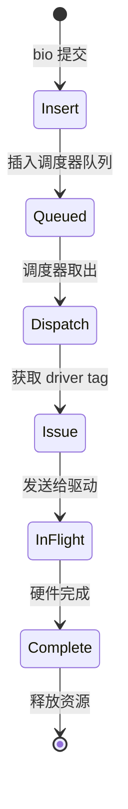
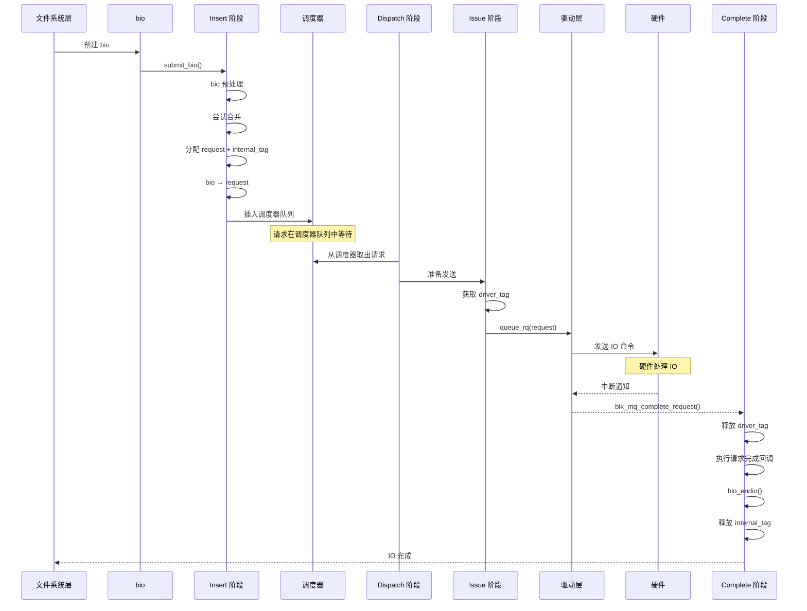

# blk_mq 请求生命周期详解

## 学习目标

- 深入理解 blk-mq 中请求的完整生命周期
- 掌握 Insert 阶段的详细流程
- 理解 Dispatch 阶段的工作机制
- 了解 Issue 阶段的处理过程
- 理解 Complete 阶段的回调链

## 概述

在 blk-mq 中，IO 请求经历四个主要阶段：Insert、Dispatch、Issue、Complete。每个阶段都有其特定的职责和处理流程。

本文档深入讲解每个阶段的详细实现和关键函数。

---

## 一、请求生命周期的四个阶段

### 阶段概览



### 各阶段职责

| 阶段 | 职责 | 关键函数 |
|------|------|---------|
| **Insert** | bio → request，分配 internal tag，插入调度器队列 | `blk_mq_submit_bio()`, `__blk_mq_alloc_request()`, `blk_mq_sched_insert_request()` |
| **Dispatch** | 从调度器队列取出请求，准备发送 | `blk_mq_sched_dispatch_requests()`, `blk_mq_dispatch_rq_list()` |
| **Issue** | 获取 driver tag，发送请求给驱动 | `blk_mq_prep_dispatch_rq()`, `blk_mq_get_driver_tag()`, `queue_rq()` |
| **Complete** | IO 完成后的回调处理，释放 tag | `blk_mq_complete_request()`, `bio_endio()` |

---

## 二、Insert 阶段详解

### Insert 阶段的职责

**主要任务**：
1. Bio 预处理（bounce、分割、完整性检查）
2. 尝试请求合并
3. 分配 request 和 internal tag
4. bio 转换为 request
5. 插入调度器队列

### 完整流程

#### 1. blk_mq_submit_bio() - Insert 阶段入口

**函数实现**（简化）：
```c
blk_qc_t blk_mq_submit_bio(struct bio *bio)
{
    struct request_queue *q = bio->bi_bdev->bd_disk->queue;
    struct request *rq;
    struct blk_mq_alloc_data data = {
        .q = q,
    };
    
    // 1. Bio 预处理
    blk_queue_bounce(q, &bio);              // bounce 处理
    __blk_queue_split(&bio, &nr_segs);     // 分割大 bio
    
    if (!bio)
        goto queue_exit;
    
    // 2. 完整性检查
    if (!bio_integrity_prep(bio))
        goto queue_exit;
    
    // 3. 尝试合并
    if (!is_flush_fua && !blk_queue_nomerges(q) &&
        blk_attempt_plug_merge(q, bio, nr_segs, &same_queue_rq))
        goto queue_exit;
    
    if (blk_mq_sched_bio_merge(q, bio, nr_segs))
        goto queue_exit;
    
    // 4. QoS 节流
    rq_qos_throttle(q, bio);
    
    // 5. 分配 request
    data.cmd_flags = bio->bi_opf;
    rq = __blk_mq_alloc_request(&data);
    if (!rq) {
        rq_qos_cleanup(q, bio);
        if (bio->bi_opf & REQ_NOWAIT)
            bio_wouldblock_error(bio);
        goto queue_exit;
    }
    
    // 6. bio 转换为 request
    blk_mq_bio_to_request(rq, bio, nr_segs);
    
    // 7. 加密处理
    ret = blk_crypto_rq_get_keyslot(rq);
    if (ret != BLK_STS_OK) {
        bio->bi_status = ret;
        bio_endio(bio);
        blk_mq_free_request(rq);
        return BLK_QC_T_NONE;
    }
    
    // 8. 插入调度器队列
    blk_mq_sched_insert_request(rq, false, true, true);
    
    return cookie;
}
```

#### 2. __blk_mq_alloc_request() - 分配 request

**函数实现**（简化）：
```c
static struct request *__blk_mq_alloc_request(struct blk_mq_alloc_data *data)
{
    struct request *rq;
    unsigned int tag;
    
    // 1. 分配 tag（会根据是否有调度器选择 sched_tags 或 tags）
    tag = blk_mq_get_tag(data);
    if (tag == BLK_MQ_NO_TAG)
        return NULL;
    
    // 2. 从正确的 tag 池获取 request
    // 关键：blk_mq_tags_from_data() 根据是否有调度器返回 sched_tags 或 tags
    struct blk_mq_tags *tags = blk_mq_tags_from_data(data);
    rq = tags->static_rqs[tag];
    
    // 3. 初始化 request，设置正确的 tag 字段
    if (data->q->elevator) {
        rq->tag = BLK_MQ_NO_TAG;      // 有调度器：driver_tag 后面再分配
        rq->internal_tag = tag;        // internal_tag 现在分配
    } else {
        rq->tag = tag;                 // 无调度器：直接设置 driver_tag
        rq->internal_tag = BLK_MQ_NO_TAG;
    }
    
    return rq;
}

// blk_mq_tags_from_data() 的实现
static inline struct blk_mq_tags *blk_mq_tags_from_data(struct blk_mq_alloc_data *data)
{
    if (data->q->elevator)
        return data->hctx->sched_tags;  // 有调度器用 sched_tags
    return data->hctx->tags;            // 无调度器用 tags
}
```

#### 3. blk_mq_sched_insert_request() - 插入调度器队列

**函数实现**（简化）：
```c
void blk_mq_sched_insert_request(struct request *rq, bool at_head,
                                 bool run_queue, bool async)
{
    struct request_queue *q = rq->q;
    struct elevator_queue *e = q->elevator;
    
    // 如果有调度器，插入调度器队列
    if (e && e->type->ops.insert_requests) {
        LIST_HEAD(list);
        list_add(&rq->queuelist, &list);
        e->type->ops.insert_requests(hctx, &list, at_head);
    } else {
        // 无调度器，直接插入硬件队列
        blk_mq_request_bypass_insert(rq, at_head, run_queue);
    }
    
    // 触发硬件队列运行
    if (run_queue)
        blk_mq_run_hw_queue(hctx, async);
}
```

---

## 三、Dispatch 阶段详解

### Dispatch 阶段的职责

**主要任务**：
1. 从调度器队列取出请求
2. 准备发送给驱动
3. 处理 dispatch 列表中的请求

### 完整流程

#### 1. blk_mq_sched_dispatch_requests() - Dispatch 入口

**函数实现**（简化）：
```c
void blk_mq_sched_dispatch_requests(struct blk_mq_hw_ctx *hctx)
{
    struct request_queue *q = hctx->queue;
    struct elevator_queue *e = q->elevator;
    
    // 如果有调度器，从调度器队列取出
    if (e && e->type->ops.dispatch_request) {
        do {
            struct request *rq;
            
            rq = e->type->ops.dispatch_request(hctx);
            if (!rq)
                break;
            
            // 分发请求
            list_add(&rq->queuelist, &rq_list);
        } while (blk_mq_dispatch_rq_list(hctx, &rq_list, 0));
    } else {
        // 无调度器，直接从硬件队列取出
        blk_mq_flush_busy_ctxs(hctx, &rq_list);
        blk_mq_dispatch_rq_list(hctx, &rq_list, 0);
    }
}
```

#### 2. blk_mq_dispatch_rq_list() - 分发请求列表

**函数实现**（简化）：
```c
static bool blk_mq_dispatch_rq_list(struct blk_mq_hw_ctx *hctx,
                                    struct list_head *rq_list,
                                    unsigned int max_dispatch)
{
    struct request_queue *q = hctx->queue;
    struct request *rq;
    int queued = 0;
    
    list_for_each_entry(rq, rq_list, queuelist) {
        // 准备请求
        if (!blk_mq_prep_dispatch_rq(rq))
            continue;
        
        // 发送给驱动
        list_del_init(&rq->queuelist);
        blk_mq_sched_dispatch_iocbs(q);
        blk_mq_try_issue_directly(hctx, rq);
        
        queued++;
        if (queued >= max_dispatch)
            break;
    }
    
    return queued > 0;
}
```

---

## 四、Issue 阶段详解

### Issue 阶段的职责

**主要任务**：
1. 获取 driver tag
2. 准备请求发送
3. 调用驱动的 queue_rq 函数

### 完整流程

#### 1. blk_mq_prep_dispatch_rq() - 准备请求

**函数实现**（简化）：
```c
enum prep_dispatch {
    PREP_DISPATCH_OK,
    PREP_DISPATCH_NO_TAG,
    PREP_DISPATCH_NO_BUDGET,
};

static enum prep_dispatch blk_mq_prep_dispatch_rq(struct request *rq,
                                                  bool need_budget)
{
    struct blk_mq_hw_ctx *hctx = rq->mq_hctx;
    int budget_token = -1;

    // 1. 获取 budget（如果需要）
    if (need_budget) {
        budget_token = blk_mq_get_dispatch_budget(rq->q);
        if (budget_token < 0) {
            blk_mq_put_driver_tag(rq);
            return PREP_DISPATCH_NO_BUDGET;
        }
        blk_mq_set_rq_budget_token(rq, budget_token);
    }

    // 2. 获取 driver tag（非阻塞）
    if (!blk_mq_get_driver_tag(rq)) {
        // tag 不足，标记等待
        if (!blk_mq_mark_tag_wait(hctx, rq)) {
            if (need_budget)
                blk_mq_put_dispatch_budget(rq->q, budget_token);
            return PREP_DISPATCH_NO_TAG;
        }
    }

    return PREP_DISPATCH_OK;
}
```

#### 2. blk_mq_get_driver_tag() - 获取 driver tag

**⚠️ 重要**：与 internal_tag 不同，driver_tag 分配**不会阻塞等待**！

**函数实现**（简化）：
```c
// 内部函数：非阻塞获取 driver tag
static bool __blk_mq_get_driver_tag(struct request *rq)
{
    struct sbitmap_queue *bt = rq->mq_hctx->tags->bitmap_tags;
    int tag;

    // 使用 __sbitmap_queue_get() 非阻塞获取
    tag = __sbitmap_queue_get(bt);
    if (tag == BLK_MQ_NO_TAG)
        return false;  // 直接返回 false，不阻塞！

    rq->tag = tag;
    return true;
}

bool blk_mq_get_driver_tag(struct request *rq)
{
    // 如果已有 driver tag，直接返回
    if (rq->tag != BLK_MQ_NO_TAG)
        return true;
    
    // 尝试获取 driver tag（非阻塞）
    if (!__blk_mq_get_driver_tag(rq))
        return false;  // 获取失败，请求放回 dispatch list
    
    return true;
}
```

#### 3. queue_rq() - 发送给驱动

**函数实现**（简化）：
```c
static void blk_mq_try_issue_directly(struct blk_mq_hw_ctx *hctx,
                                     struct request *rq)
{
    struct request_queue *q = hctx->queue;
    struct blk_mq_ops *ops = q->mq_ops;
    
    // 调用驱动的 queue_rq 函数
    ret = ops->queue_rq(hctx, rq);
    
    if (ret == BLK_STS_RESOURCE || ret == BLK_STS_DEV_RESOURCE) {
        // 资源不足，放入 dispatch 列表
        blk_mq_requeue_request(rq, false);
        blk_mq_delay_run_hw_queue(hctx, BLK_MQ_RESOURCE_DELAY);
    }
}
```

---

## 五、Complete 阶段详解

### Complete 阶段的职责

**主要任务**：
1. 处理硬件完成通知
2. 执行请求完成回调
3. 释放 driver tag 和 internal tag
4. 调用 bio 完成回调

### 完整流程

#### 1. blk_mq_complete_request() - 完成处理入口

**函数实现**（简化）：
```c
void blk_mq_complete_request(struct request *rq)
{
    if (!blk_mq_complete_request_remote(rq))
        __blk_mq_complete_request(rq);
}

static void __blk_mq_complete_request(struct request *rq)
{
    struct request_queue *q = rq->q;
    
    // 1. 更新统计信息
    blk_stat_add(rq, ktime_get_ns());
    
    // 2. 调用请求完成回调
    if (rq->end_io) {
        rq->end_io(rq, blk_mq_end_request_batch(rq));
    } else {
        blk_mq_end_request(rq, blk_status_to_errno(rq->result));
    }
}
```

#### 2. blk_mq_end_request() - 结束请求

**函数实现**（简化）：
```c
bool blk_mq_end_request(struct request *rq, blk_status_t error)
{
    if (blk_mq_need_time_stamp(rq))
        rq->io_start_time_ns = ktime_get_ns();
    
    // 处理 bio
    if (rq->bio && rq->bio != rq->biotail) {
        // 多个 bio，逐个处理
        struct bio *bio = rq->bio;
        do {
            bio = blk_mq_end_request_bio(rq, bio);
        } while (bio);
    } else {
        // 单个 bio
        blk_mq_end_request_bio(rq, rq->bio);
    }
    
    // 释放 request
    blk_mq_free_request(rq);
    
    return true;
}
```

#### 3. bio_endio() - bio 完成回调

**函数实现**（简化）：
```c
void bio_endio(struct bio *bio)
{
    // 调用 bio 完成回调
    if (bio->bi_end_io)
        bio->bi_end_io(bio);
}
```

---

## 六、完整生命周期序列图

### 完整序列图



---

## 七、关键函数调用链

### Insert 阶段调用链

```
submit_bio()
    ↓
blk_mq_submit_bio()
    ↓
__blk_mq_alloc_request()  [分配 request + internal_tag]
    ↓
blk_mq_bio_to_request()    [bio → request]
    ↓
blk_mq_sched_insert_request()  [插入调度器队列]
```

### Dispatch 阶段调用链

```
blk_mq_run_hw_queue()
    ↓
blk_mq_sched_dispatch_requests()
    ↓
elevator->ops.dispatch_request()  [从调度器取出]
    ↓
blk_mq_dispatch_rq_list()
```

### Issue 阶段调用链

```
blk_mq_prep_dispatch_rq()
    ↓
blk_mq_get_driver_tag()  [获取 driver_tag]
    ↓
blk_mq_try_issue_directly()
    ↓
ops->queue_rq()  [调用驱动]
```

### Complete 阶段调用链

```
硬件中断
    ↓
驱动中断处理
    ↓
blk_mq_complete_request()
    ↓
blk_mq_end_request()
    ↓
bio_endio()
    ↓
文件系统完成回调
```

---

## 总结

### 核心要点

1. **四个阶段的职责**：
   - **Insert**：bio → request，插入调度器队列
   - **Dispatch**：从调度器取出，准备发送
   - **Issue**：获取 driver tag，发送给驱动
   - **Complete**：处理完成，释放资源

2. **Tag 机制**：
   - **internal_tag**：Insert 阶段分配，调度器使用
   - **driver_tag**：Issue 阶段分配，驱动使用

3. **关键转换点**：
   - bio → request（Insert 阶段）
   - 调度器队列 → 硬件队列（Dispatch 阶段）
   - 硬件队列 → 驱动（Issue 阶段）
   - 驱动 → 完成回调（Complete 阶段）

### 关键函数

- `blk_mq_submit_bio()` - Insert 阶段入口
- `blk_mq_sched_dispatch_requests()` - Dispatch 阶段入口
- `blk_mq_get_driver_tag()` - Issue 阶段获取 tag
- `blk_mq_complete_request()` - Complete 阶段入口

### 后续学习

- [blk_mq 基础架构与核心概念](09-blk_mq基础架构与核心概念.md) - 理解 blk-mq 的基础架构
- [blk_mq 调度器集成](11-blk_mq调度器集成.md) - 理解调度器在生命周期中的作用

## 参考资源

- 内核源码：
  - `block/blk-mq.c` - blk-mq 核心实现
  - `block/blk-mq-sched.c` - 调度器集成
- 相关文章：
  - [Block 层 IO 路径总览](03-Block层IO路径总览.md) - IO 完整路径
  - [Request 机制详解](06-Request机制详解.md) - request 的详细机制

## 更新记录

- 2026-01-26：初始创建，包含 blk-mq 请求生命周期的详细说明
