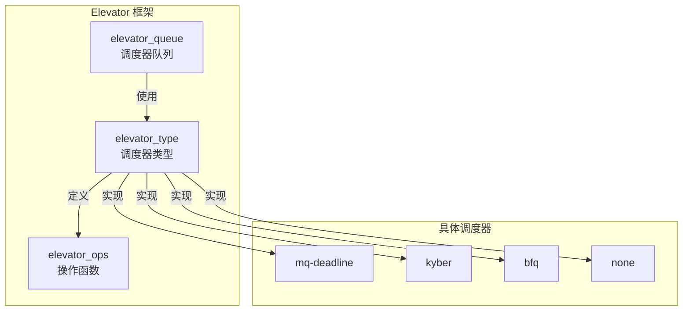

# IO 调度器框架与接口

## 学习目标

- 理解 IO 调度器的设计目标
- 掌握 Elevator 框架的工作原理
- 了解调度器接口的定义和使用
- 理解调度器的注册和选择机制
- 了解调度器队列管理

## 概述

IO 调度器（Elevator）是 Block 层中负责优化 IO 请求顺序的组件。它通过重排序请求来提高 IO 吞吐量和响应时间。

本文档深入讲解 IO 调度器的框架设计和接口定义。

---

## 一、IO 调度器的设计目标

### 设计目标

**主要目标**：
1. **提高吞吐量**：通过合并和重排序请求，减少寻道时间
2. **降低延迟**：优先处理高优先级请求
3. **公平性**：避免某些请求长时间等待
4. **可扩展性**：支持多种调度算法

### 调度器的作用

**作用**：
- **请求合并**：将相邻扇区的请求合并
- **请求重排序**：优化请求顺序，减少寻道时间
- **优先级管理**：根据优先级调度请求
- **延迟控制**：控制请求的最大等待时间

---

## 二、Elevator 框架

### 框架结构



### elevator_type - 调度器类型

**结构定义**：
```c
struct elevator_type {
    struct kmem_cache *icq_cache;      // IO 上下文缓存
    
    struct elevator_ops ops;            // 调度器操作函数
    
    size_t icq_size;                    // IO 上下文大小
    size_t icq_align;                    // IO 上下文对齐
    
    struct elv_fs_entry *elevator_attrs; // sysfs 属性
    struct elevator_attrs elevator_attr_group; // 属性组
    
    char elevator_name[ELV_NAME_MAX];   // 调度器名称
    char elevator_alias[ELV_NAME_MAX]; // 调度器别名
    
    unsigned int elevator_features;     // 调度器特性
    
    struct module *elevator_owner;      // 模块所有者
    struct list_head list;              // 链表节点
};
```

### elevator_queue - 调度器队列

**结构定义**：
```c
struct elevator_queue {
    struct elevator_type *type;         // 调度器类型
    void *elevator_data;                // 调度器私有数据
    struct kobject kobj;                // kobject
    struct mutex sysfs_lock;            // sysfs 锁
    unsigned int registered:1;          // 是否已注册
    DECLARE_HASHTABLE(hash, ELV_HASH_BITS); // 合并哈希表
};
```

---

## 三、调度器接口定义

### elevator_ops - 调度器操作函数

**定义位置**：`include/linux/elevator.h`

**关键操作**：
```c
struct elevator_ops {
    // blk-mq 操作
    bool (*has_work)(struct blk_mq_hw_ctx *);
    void (*insert_requests)(struct blk_mq_hw_ctx *, struct list_head *, bool);
    struct request *(*dispatch_request)(struct blk_mq_hw_ctx *);
    void (*completed_request)(struct request *, u64);
    void (*requeue_request)(struct request *);
    
    // bio 合并
    bool (*bio_merge)(struct request_queue *, struct bio *, unsigned int);
    void (*prepare_request)(struct request *);
    void (*finish_request)(struct request *);
    
    // 队列管理
    void (*init_sched)(struct request_queue *, struct elevator_type *);
    void (*exit_sched)(struct elevator_queue *);
    
    // 其他
    void (*depth_updated)(struct blk_mq_hw_ctx *);
};
```

### 关键操作说明

#### 1. insert_requests() - 插入请求

**作用**：将请求插入调度器队列

**函数签名**：
```c
void (*insert_requests)(struct blk_mq_hw_ctx *hctx,
                       struct list_head *list, bool at_head);
```

**实现示例**（deadline）：
```c
static void dd_insert_requests(struct blk_mq_hw_ctx *hctx,
                               struct list_head *list, bool at_head)
{
    struct request_queue *q = hctx->queue;
    struct deadline_data *dd = q->elevator->elevator_data;
    
    while (!list_empty(list)) {
        struct request *rq = list_first_entry(list, struct request, queuelist);
        list_del_init(&rq->queuelist);
        dd_insert_request(hctx, rq, at_head);
    }
}
```

#### 2. dispatch_request() - 分发请求

**作用**：从调度器队列取出请求

**函数签名**：
```c
struct request *(*dispatch_request)(struct blk_mq_hw_ctx *hctx);
```

**实现示例**（deadline）：
```c
static struct request *dd_dispatch_request(struct blk_mq_hw_ctx *hctx)
{
    struct deadline_data *dd = hctx->queue->elevator->elevator_data;
    struct request *rq;
    
    rq = dd_dispatch_request_from_fifo_list(dd, ...);
    
    return rq;
}
```

#### 3. bio_merge() - bio 合并

**作用**：检查 bio 是否可以合并到现有 request

**函数签名**：
```c
bool (*bio_merge)(struct request_queue *q, struct bio *bio,
                  unsigned int nr_segs);
```

**实现示例**（deadline）：
```c
static bool dd_bio_merge(struct request_queue *q, struct bio *bio,
                         unsigned int nr_segs)
{
    struct deadline_data *dd = q->elevator->elevator_data;
    struct request *free = NULL;
    bool ret;
    
    // 查找可以合并的 request
    free = elv_rqhash_find(q, bio->bi_iter.bi_sector);
    
    if (free && elv_bio_merge_ok(free, bio)) {
        ret = true;
        goto done;
    }
    
    return false;
}
```

---

## 四、调度器的注册和选择

### 调度器注册

#### 1. elv_register() - 注册调度器

**函数实现**：
```c
int elv_register(struct elevator_type *e)
{
    spin_lock(&elv_list_lock);
    
    // 检查是否已注册
    if (elevator_find(e->elevator_name, 0)) {
        spin_unlock(&elv_list_lock);
        return -EEXIST;
    }
    
    // 添加到调度器列表
    list_add_tail(&e->list, &elv_list);
    
    spin_unlock(&elv_list_lock);
    
    return 0;
}
```

#### 2. 调度器注册示例

**deadline 调度器注册**：
```c
// block/mq-deadline.c
static struct elevator_type mq_deadline = {
    .ops = {
        .insert_requests = dd_insert_requests,
        .dispatch_request = dd_dispatch_request,
        .prepare_request = dd_prepare_request,
        .finish_request = dd_finish_request,
        .bio_merge = dd_bio_merge,
        .init_sched = dd_init_sched,
        .exit_sched = dd_exit_sched,
    },
    .elevator_name = "mq-deadline",
    .elevator_alias = "deadline",
    .elevator_features = ELEVATOR_F_ZBD_SEQ_WRITE,
    .elevator_owner = THIS_MODULE,
};

static int __init mq_deadline_init(void)
{
    return elv_register(&mq_deadline);
}
```

### 调度器选择

#### 1. elevator_init() - 初始化调度器

**函数实现**（简化）：
```c
static int elevator_init(struct request_queue *q, struct elevator_type *e)
{
    struct elevator_queue *eq;
    
    // 分配 elevator_queue
    eq = kzalloc_node(sizeof(*eq), GFP_KERNEL, q->node);
    
    // 设置调度器类型
    eq->type = e;
    q->elevator = eq;
    
    // 调用调度器的初始化函数
    if (e->ops.init_sched)
        e->ops.init_sched(q, e);
    
    return 0;
}
```

#### 2. 调度器切换

**切换调度器**：
```c
// 切换调度器
int elevator_change(struct request_queue *q, const char *name)
{
    struct elevator_type *e;
    
    // 查找调度器
    e = elevator_get(q, name, true);
    if (!e)
        return -EINVAL;
    
    // 退出旧调度器
    if (q->elevator)
        elevator_exit(q);
    
    // 初始化新调度器
    return elevator_init(q, e);
}
```

---

## 五、调度器队列管理

### 调度器队列结构

**每个调度器有自己的队列结构**：

#### 1. deadline 调度器队列

```c
struct deadline_data {
    struct dd_per_prio per_prio[DD_PRIO_COUNT];  // 按优先级分类
    enum dd_data_dir last_dir;                   // 最后处理的方向
    unsigned int batching;                       // 批处理计数
    unsigned int starved;                        // 饥饿计数
    // ...
};
```

#### 2. kyber 调度器队列

```c
struct kyber_queue_data {
    struct kyber_domain domains[KYBER_NUM_DOMAINS]; // 按域分类
    struct blk_stat_callback *cb;                   // 统计回调
    // ...
};
```

### 请求管理

#### 1. 请求插入

**调度器插入请求到自己的队列**：
```c
// deadline 调度器示例
static void dd_insert_request(struct blk_mq_hw_ctx *hctx,
                             struct request *rq, bool at_head)
{
    struct deadline_data *dd = hctx->queue->elevator->elevator_data;
    const int data_dir = rq_data_dir(rq);
    const enum dd_prio prio = ioprio_class_to_prio[ioprio_class];
    
    // 插入到排序树
    elv_rb_add(&dd->per_prio[prio].sort_list[data_dir], rq);
    
    // 插入到 FIFO 列表
    if (at_head)
        list_add(&rq->queuelist, &dd->per_prio[prio].fifo_list[data_dir]);
    else
        list_add_tail(&rq->queuelist, &dd->per_prio[prio].fifo_list[data_dir]);
}
```

#### 2. 请求分发

**调度器从队列取出请求**：
```c
// deadline 调度器示例
static struct request *dd_dispatch_request(struct blk_mq_hw_ctx *hctx)
{
    struct deadline_data *dd = hctx->queue->elevator->elevator_data;
    struct request *rq;
    
    // 从 FIFO 列表取出请求
    rq = dd_dispatch_request_from_fifo_list(dd, ...);
    
    return rq;
}
```

---

## 六、调度器特性

### 调度器特性标志

**定义位置**：`include/linux/elevator.h`

```c
#define ELEVATOR_F_ZBD_SEQ_WRITE    (1U << 0)  // 支持 ZBD 顺序写入
#define ELEVATOR_F_DISABLE_MERGE    (1U << 1)  // 禁用合并
```

### 特性检查

**检查调度器是否支持特定特性**：
```c
static inline bool elv_support_features(unsigned int elv_features,
                                       unsigned int required_features)
{
    return (required_features & elv_features) == required_features;
}
```

---

## 总结

### 核心要点

1. **Elevator 框架**：
   - 提供统一的调度器接口
   - 管理调度器的注册和选择
   - 处理请求的插入和分发

2. **调度器接口**：
   - `elevator_type` 定义调度器类型
   - `elevator_ops` 定义调度器操作
   - 支持多种调度器实现

3. **调度器队列管理**：
   - 每个调度器有自己的队列结构
   - 调度器决定请求的调度顺序
   - 支持请求合并和重排序

### 关键函数

- `elv_register()` - 注册调度器
- `elevator_init()` - 初始化调度器
- `elevator_change()` - 切换调度器
- `elevator_exit()` - 退出调度器

### 后续学习

- [主流 IO 调度器分析](14-主流IO调度器分析.md) - 了解各种调度器的特点和使用场景
- [blk_mq 调度器集成](11-blk_mq调度器集成.md) - 理解调度器与 blk-mq 的集成

## 参考资源

- 内核源码：
  - `block/elevator.c` - 调度器框架实现
  - `include/linux/elevator.h` - 调度器接口定义
- 相关文章：
  - [blk_mq 调度器集成](11-blk_mq调度器集成.md) - 调度器与 blk-mq 的集成

## 更新记录

- 2026-01-26：初始创建，包含 IO 调度器框架和接口的详细说明
