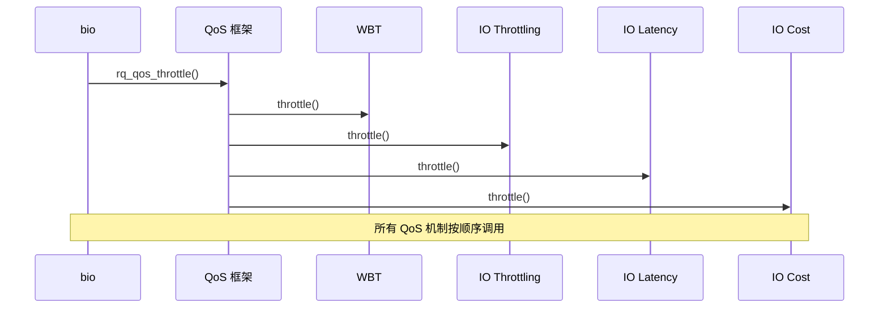

# Block 层 QoS 机制与性能优化

## 学习目标

- 理解 Block 层 QoS 框架（blk-rq-qos）的设计
- 掌握 Writeback Throttling (WBT) 的工作原理
- 了解 IO Throttling 机制
- 理解 IO Latency 控制
- 了解 IO Cost 模型
- 掌握性能优化的实践方法

## 概述

Block 层提供了多种 QoS（Quality of Service）机制来控制和优化 IO 性能。这些机制可以防止 IO 过载、控制延迟、保证公平性。

本文档深入讲解 Block 层的 QoS 机制和性能优化方法。

---

## 一、QoS 框架（blk-rq-qos）

### QoS 框架的作用

**作用**：
1. **统一接口**：为不同 QoS 机制提供统一的接口
2. **组合使用**：支持多个 QoS 机制组合使用
3. **生命周期管理**：管理 QoS 对象的生命周期

### rq_qos 结构

**定义位置**：`block/blk-rq-qos.h`

```c
struct rq_qos {
    const struct rq_qos_ops *ops;  // QoS 操作函数
    struct request_queue *q;      // 关联的队列
    struct rq_qos *next;           // 下一个 QoS 对象（链表）
    struct rq_qos *prev;           // 上一个 QoS 对象
    struct ida *ida;               // ID 分配器
    int id;                        // QoS ID
};
```

### rq_qos_ops - QoS 操作函数

**结构定义**：
```c
struct rq_qos_ops {
    void (*throttle)(struct rq_qos *, struct bio *);
    void (*track)(struct rq_qos *, struct request *, struct bio *);
    void (*merge)(struct rq_qos *, struct request *, struct bio *);
    void (*issue)(struct rq_qos *, struct request *);
    void (*requeue)(struct rq_qos *, struct request *);
    void (*done)(struct rq_qos *, struct request *);
    void (*done_bio)(struct rq_qos *, struct bio *);
    void (*cleanup)(struct rq_qos *, struct bio *);
    void (*queue_depth_changed)(struct rq_qos *);
};
```

### QoS 机制调用链



---

## 二、Writeback Throttling (WBT)

### WBT 的作用

**作用**：
- **控制回写速度**：防止后台回写影响前台 IO
- **平滑 IO**：使 IO 更加平滑
- **基于延迟**：根据设备延迟动态调整

### WBT 的工作原理

#### 1. 延迟测量

**测量设备延迟**：
```c
// block/blk-wbt.c
static void wbt_track(struct rq_qos *rqos, struct request *rq, struct bio *bio)
{
    struct rq_wb *rwb = RQWB(rqos);
    
    // 记录请求时间
    rq->io_start_time_ns = ktime_get_ns();
}
```

#### 2. 延迟控制

**根据延迟调整回写速度**：
```c
static void wbt_update_limits(struct rq_wb *rwb)
{
    struct rq_depth *rqd = &rwb->rq_depth;
    unsigned int depth;
    
    // 根据延迟计算队列深度
    if (rwb->min_lat_nsec == 0) {
        rqd->max_depth = rqd->default_depth;
        return;
    }
    
    // 延迟高，减少队列深度
    if (rwb->cur_win_nsec >= rwb->min_lat_nsec) {
        rqd->scale_step = max(rqd->scale_step - 1, -1);
    } else {
        // 延迟低，增加队列深度
        rqd->scale_step = min(rqd->scale_step + 1, 1);
    }
    
    // 计算新的队列深度
    depth = rqd->default_depth;
    if (rqd->scale_step > 0)
        depth = 1 + ((depth - 1) >> min(31, rqd->scale_step));
    
    rqd->max_depth = depth;
}
```

### WBT 的配置

**启用 WBT**：
```bash
# 启用 WBT
echo 1 > /sys/block/sda/queue/wbt_lat_usec
```

**调整参数**：
```bash
# 设置最小延迟目标（微秒）
echo 1000 > /sys/block/sda/queue/wbt_lat_usec
```

---

## 三、IO Throttling

### IO Throttling 的作用

**作用**：
- **限制 IO 速率**：限制每个 cgroup 的 IO 速率
- **带宽控制**：控制 IO 带宽分配
- **公平性**：保证不同 cgroup 之间的公平性

### IO Throttling 的实现

#### 1. blk_throttle - IO 节流

**结构定义**：
```c
struct blk_throtl_grp {
    struct throtl_service_queue service_queue;  // 服务队列
    struct rb_node rb_node;                    // 红黑树节点
    unsigned int disptime;                      // 分发时间
    uint64_t slice_start[2];                   // 时间片开始
    uint64_t bytes_disp[2];                    // 已分发字节数
    uint64_t io_disp[2];                       // 已分发 IO 数
    unsigned long last_low_overflow_time[2];   // 最后溢出时间
    // ...
};
```

#### 2. 节流机制

**节流检查**：
```c
static bool tg_may_dispatch(struct throtl_grp *tg, struct bio *bio,
                           unsigned long *wait)
{
    unsigned long bps_limit = tg_bps_limit(tg, bio_data_dir(bio));
    unsigned long iops_limit = tg_iops_limit(tg, bio_data_dir(bio));
    
    // 检查带宽限制
    if (bps_limit != U64_MAX) {
        uint64_t bps = tg->bytes_disp[READ] + tg->bytes_disp[WRITE];
        if (bps >= bps_limit) {
            *wait = jiffies + HZ;
            return false;
        }
    }
    
    // 检查 IOPS 限制
    if (iops_limit != U64_MAX) {
        unsigned int ios = tg->io_disp[READ] + tg->io_disp[WRITE];
        if (ios >= iops_limit) {
            *wait = jiffies + HZ;
            return false;
        }
    }
    
    return true;
}
```

### IO Throttling 的配置

**通过 cgroup 配置**：
```bash
# 设置 IO 带宽限制
echo "8:0 1048576" > /sys/fs/cgroup/blkio/blkio.throttle.read_bps_device
echo "8:0 1048576" > /sys/fs/cgroup/blkio/blkio.throttle.write_bps_device

# 设置 IOPS 限制
echo "8:0 1000" > /sys/fs/cgroup/blkio/blkio.throttle.read_iops_device
echo "8:0 1000" > /sys/fs/cgroup/blkio/blkio.throttle.write_iops_device
```

---

## 四、IO Latency 控制

### IO Latency 的作用

**作用**：
- **延迟控制**：控制 IO 延迟在目标范围内
- **保护机制**：保护低延迟目标的任务
- **动态调整**：根据延迟动态调整队列深度

### IO Latency 的实现

#### 1. blk_iolatency - IO 延迟控制

**结构定义**：
```c
struct blk_iolatency {
    struct rq_qos rqos;                    // QoS 对象
    struct timer_list timer;               // 定时器
    struct work_struct enable_work;        // 启用工作
    struct blkcg_gq *blkg;                // blkcg 队列
    // ...
};
```

#### 2. 延迟控制机制

**延迟检查**：
```c
static void check_iolatency(struct blk_iolatency *blkiolat,
                           struct blkcg_gq *blkg)
{
    struct iolatency_grp *iolat = blkg_to_lat(blkg);
    u64 now = ktime_get_ns();
    u64 vtime = atomic64_read(&iolat->vtime);
    u64 delay_nsec = 0;
    
    // 计算延迟
    if (now > vtime) {
        delay_nsec = now - vtime;
    }
    
    // 如果延迟超过目标，进行节流
    if (delay_nsec > iolat->min_lat_nsec) {
        // 节流处理
        blk_mq_delay_run_hw_queue(hctx, delay_nsec / NSEC_PER_MSEC);
    }
}
```

### IO Latency 的配置

**通过 cgroup 配置**：
```bash
# 设置 IO 延迟目标（微秒）
echo "target=1000" > /sys/fs/cgroup/io.cost.qos
```

---

## 五、IO Cost 模型

### IO Cost 的作用

**作用**：
- **成本模型**：基于 IO 成本分配资源
- **权重分配**：根据权重分配 IO 资源
- **比例控制**：按比例分配 IO 带宽

### IO Cost 的实现

#### 1. blk_iocost - IO 成本控制

**结构定义**：
```c
struct ioc {
    struct rq_qos rqos;                    // QoS 对象
    struct timer_list timer;               // 定时器
    struct list_head active_iocgs;         // 活跃 cgroup 列表
    u64 vtime_rate;                        // 虚拟时间速率
    u64 vtime_base;                        // 虚拟时间基准
    // ...
};
```

#### 2. 成本计算

**计算 IO 成本**：
```c
static u64 calc_vtime_cost(struct bio *bio, struct ioc_gq *iocg,
                          bool is_merge)
{
    u64 cost = iocg->params.vrate_pct;
    u64 bytes = bio->bi_iter.bi_size;
    
    // 根据 IO 大小计算成本
    cost = div64_u64(cost * bytes, 1024 * 1024);
    
    return cost;
}
```

### IO Cost 的配置

**通过 cgroup 配置**：
```bash
# 设置 IO 权重
echo "weight=100" > /sys/fs/cgroup/io.cost.weight

# 设置成本参数
echo "vrate=100" > /sys/fs/cgroup/io.cost.qos
```

---

## 六、性能优化实践

### 优化策略

#### 1. 队列深度优化

**调整队列深度**：
```bash
# 增加队列深度（提高吞吐量）
echo 512 > /sys/block/sda/queue/nr_requests

# 减少队列深度（降低延迟）
echo 128 > /sys/block/sda/queue/nr_requests
```

#### 2. 调度器选择

**根据场景选择调度器**：
- **高性能场景**：None
- **通用场景**：MQ-Deadline
- **低延迟场景**：Kyber
- **多任务场景**：BFQ

#### 3. QoS 配置

**启用合适的 QoS 机制**：
- **WBT**：控制回写速度
- **IO Throttling**：限制 IO 速率
- **IO Latency**：控制 IO 延迟
- **IO Cost**：按权重分配资源

### 性能监控

#### 1. 监控指标

**关键指标**：
- **IOPS**：每秒 IO 操作数
- **吞吐量**：每秒传输的字节数
- **延迟**：IO 请求的平均延迟
- **队列深度**：平均队列深度

#### 2. 监控工具

**使用工具**：
```bash
# iostat - 查看 IO 统计
iostat -x 1

# blktrace - 追踪 IO 路径
blktrace -d /dev/sda -o trace

# 查看队列统计
cat /sys/block/sda/queue/stats
```

---

## 七、Android 系统中的 QoS

### Android 的 QoS 使用

**典型场景**：
- **应用启动**：使用 IO Latency 保证启动速度
- **后台任务**：使用 IO Throttling 限制后台 IO
- **多任务**：使用 IO Cost 按权重分配资源

### Android 配置示例

**系统配置**：
```bash
# Android 系统可能配置的 QoS
# 1. 启用 WBT
echo 1 > /sys/block/sda/queue/wbt_lat_usec

# 2. 配置 IO Latency
echo "target=1000" > /sys/fs/cgroup/io.cost.qos

# 3. 配置 IO Cost
echo "weight=100" > /sys/fs/cgroup/io.cost.weight
```

---

## 总结

### 核心要点

1. **QoS 框架**：
   - 提供统一的 QoS 接口
   - 支持多个 QoS 机制组合使用
   - 管理 QoS 对象的生命周期

2. **主要 QoS 机制**：
   - **WBT**：控制回写速度
   - **IO Throttling**：限制 IO 速率
   - **IO Latency**：控制 IO 延迟
   - **IO Cost**：按权重分配资源

3. **性能优化**：
   - 根据场景选择合适的调度器和 QoS
   - 调整队列参数
   - 监控性能指标

### 关键函数

- `rq_qos_throttle()` - QoS 节流
- `rq_qos_track()` - QoS 跟踪
- `rq_qos_done()` - QoS 完成处理

### 后续学习

- [主流 IO 调度器分析](14-主流IO调度器分析.md) - 了解调度器与 QoS 的关系
- [Block 层概述与架构设计](01-Block层概述与架构设计.md) - 理解 Block 层的整体架构

## 参考资源

- 内核源码：
  - `block/blk-rq-qos.c` - QoS 框架实现
  - `block/blk-wbt.c` - WBT 实现
  - `block/blk-throttle.c` - IO Throttling 实现
  - `block/blk-iolatency.c` - IO Latency 实现
  - `block/blk-iocost.c` - IO Cost 实现
- 内核文档：
  - `Documentation/block/wbt.rst`
  - `Documentation/admin-guide/cgroup-v2.rst`

## 更新记录

- 2026-01-26：初始创建，包含 Block 层 QoS 机制和性能优化的详细说明
