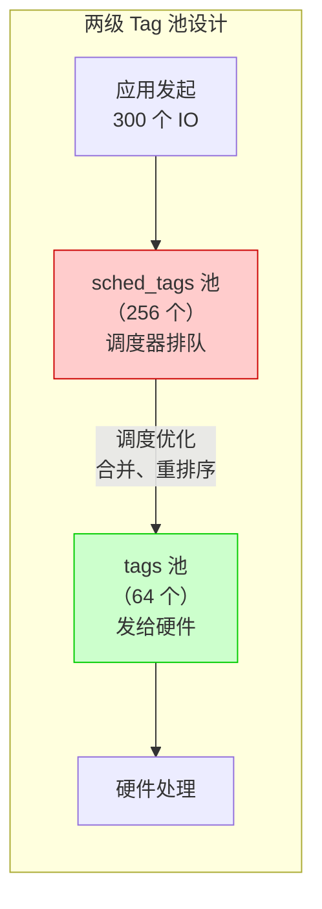
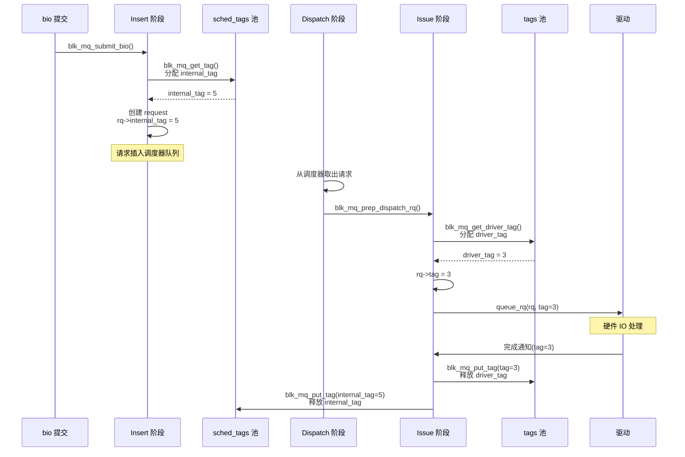
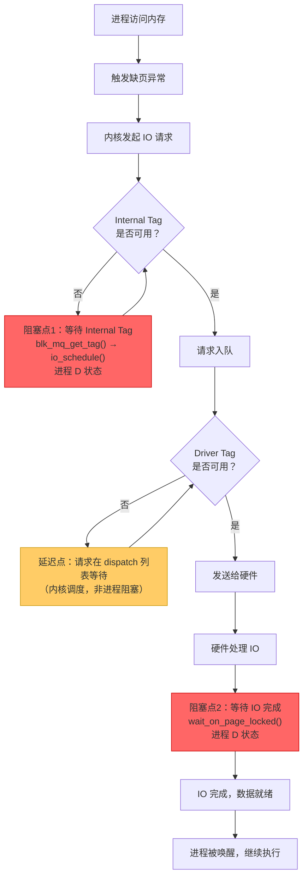
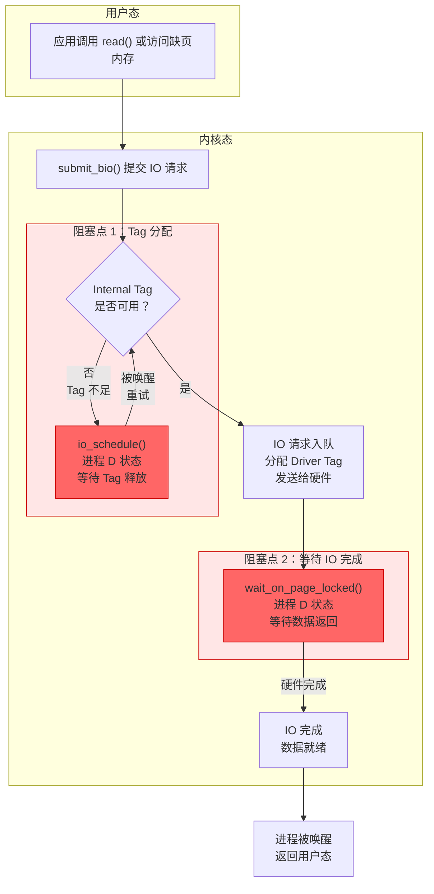
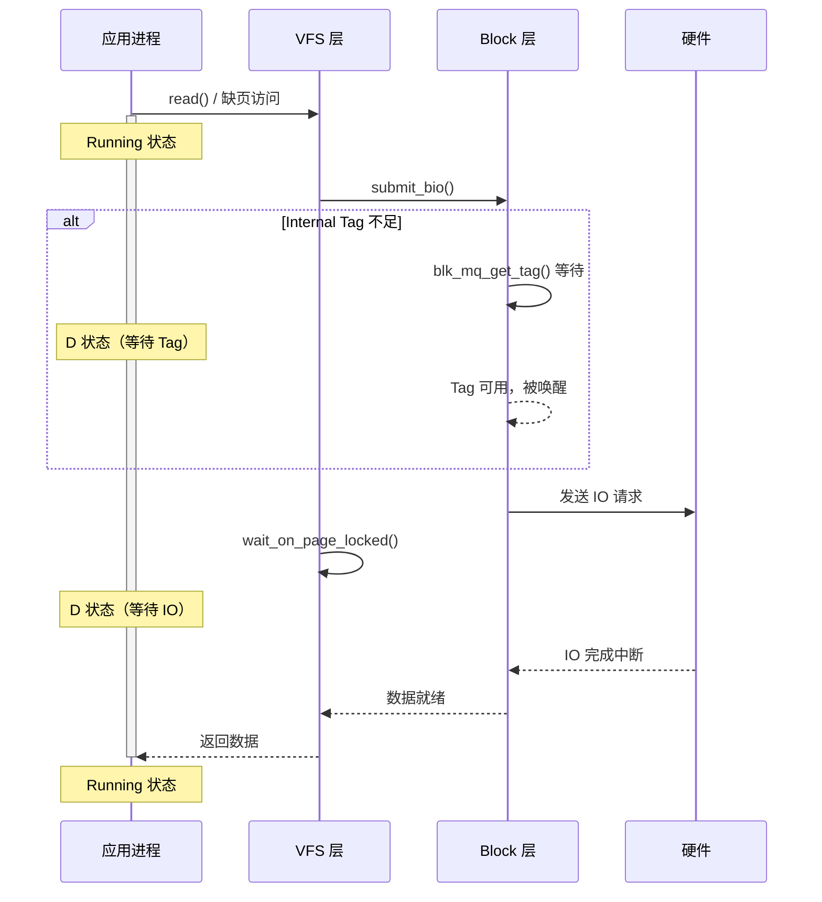

# Tag 机制深入解析

## 学习目标

- 理解为什么 blk-mq 需要 Tag 机制
- 掌握 Internal Tag 和 Driver Tag 的区别
- 理解两套 Tag 池的管理方式
- 了解 Tag 在请求生命周期中的分配和释放流程
- **掌握 Tag 不足时的等待与阻塞机制**

## 概述

Tag 机制是 blk-mq 的核心组成部分，用于在大量并发、乱序完成的 IO 环境下，高效地追踪和定位每一个请求。本文深入分析 Tag 机制的设计原理、Internal Tag 与 Driver Tag 的区别，以及它们的管理方式。

---

## 一、为什么需要 Tag 机制？

### 核心问题：硬件如何告诉你"哪个请求完成了"？

传统的简单队列模型假设请求是同步的，或者按顺序完成。但现代存储设备（特别是 NVMe）是**高度并发和乱序完成**的。

#### 场景分析

假设没有 Tag，只用简单队列：

```
时间线：
t1: 发送请求 A（读 sector 100）  → 硬件
t2: 发送请求 B（读 sector 200）  → 硬件
t3: 发送请求 C（读 sector 50）   → 硬件
t4: 硬件完成中断！数据已就绪

问题：这个中断对应的是 A、B 还是 C？
```

**NVMe 设备可以同时处理数千个请求**，而且它们是**乱序完成**的（C 可能比 A 先完成）。驱动必须知道完成的是哪个请求，才能：
1. 把数据拷贝到正确的用户 buffer
2. 唤醒正确的等待进程
3. 释放正确的资源

### Tag 的解决方案

```
发送时：
请求 A → 分配 tag=5  → 发给硬件（携带 tag=5）
请求 B → 分配 tag=12 → 发给硬件（携带 tag=12）
请求 C → 分配 tag=3  → 发给硬件（携带 tag=3）

完成时：
硬件中断："tag=3 的请求完成了"
驱动：O(1) 查找 → requests[3] → 找到请求 C → 完成回调
```

### 为什么不能用其他方案？

#### 方案1：遍历队列查找

```c
// 硬件完成中断
void irq_handler(void *data) {
    // 遍历所有 in-flight 请求，检查哪个完成了？
    // 问题：怎么检查？硬件只给你数据，不告诉你是哪个请求的
}
```

**问题**：硬件不会告诉你"sector 100 的请求完成了"，它只返回 **tag**。

#### 方案2：按顺序完成

```
假设：请求按发送顺序完成，用 FIFO 队列即可
```

**问题**：现代存储设备**必须乱序完成**才能达到高性能：
- 读请求可能比写请求快
- 相邻 sector 的请求可以合并
- SSD 内部有复杂的调度

#### 方案3：每个请求一个唯一 ID，完成时返回 ID

这正是 Tag！**Tag 就是请求的唯一标识符**。

### Tag 的额外好处

#### 1. 限制并发请求数量（背压机制）

```c
// tag 数量 = 硬件队列深度（如 1024）
// 当所有 tag 都被使用时，新请求必须等待

if (no_free_tag()) {
    // 等待某个请求完成释放 tag
    wait_for_tag();
}
```

没有 tag 的话，软件队列可以无限增长，导致内存耗尽。

#### 2. 预分配 request 结构体

```c
// 有了 tag，可以预分配固定大小的数组
struct request *requests[queue_depth];  // 预分配

// 获取请求：O(1)，无需动态分配
tag = get_free_tag();
req = requests[tag];  // 直接索引

// vs. 无 tag：每次都要 kmalloc
req = kmalloc(sizeof(*req), GFP_NOIO);  // 可能阻塞、失败
```

#### 3. 与硬件协议天然对应

NVMe 协议本身就使用 **Command ID**（16-bit），这就是硬件层面的 tag：

```
NVMe Submission Queue Entry:
┌─────────────────────────────────────┐
│ Command ID (CID) ← 这就是 tag      │
│ Namespace ID                        │
│ LBA (逻辑块地址)                    │
│ ...                                 │
└─────────────────────────────────────┘

NVMe Completion Queue Entry:
┌─────────────────────────────────────┐
│ Command ID (CID) ← 返回相同的 tag  │
│ Status                              │
│ ...                                 │
└─────────────────────────────────────┘
```

### Tag 必要性总结

| 问题 | 无 Tag | 有 Tag |
|------|--------|--------|
| 如何知道哪个请求完成？ | ❌ 无法知道 | ✅ O(1) 查找 |
| 并发请求限制 | ❌ 可能无限增长 | ✅ 自然限制 |
| request 分配 | ❌ 每次 kmalloc | ✅ 预分配数组索引 |
| 与硬件协议对应 | ❌ 需要额外映射 | ✅ 天然对应 |

**结论**：Tag 不是可选的优化，而是异步 I/O 系统的必需机制。

---

## 二、Internal Tag vs Driver Tag

### 为什么需要两套 Tag？

关键问题：**调度器队列和硬件队列的深度不同**。

- **调度器队列**：可以容纳大量请求（如 2000+），软件可配置
- **硬件队列**：深度有限（如 NVMe 通常 1024），受硬件限制

软件可以接收比硬件能处理的更多请求（排队等待），因此需要两套 tag 分别管理这两个不同深度的队列。

### 核心区别

| 特性 | Internal Tag | Driver Tag |
|------|--------------|------------|
| **字段名** | `rq->internal_tag` | `rq->tag` |
| **分配时机** | Insert 阶段（bio → request 时） | Issue 阶段（发送给驱动前） |
| **用途** | 调度器使用 | 驱动/硬件使用 |
| **管理者** | `hctx->sched_tags` | `hctx->tags` |
| **生命周期** | 请求在调度器队列中的整个期间 | 请求在硬件处理期间 |
| **数量限制** | `q->nr_requests`（软件可配置） | 硬件队列深度（硬件限制） |

### 请求生命周期中的 Tag 分配

```
┌─────────────────────────────────────────────────────────────────┐
│                        请求生命周期                              │
├─────────────────────────────────────────────────────────────────┤
│                                                                 │
│   bio 提交                                                       │
│      │                                                          │
│      ▼                                                          │
│   ┌─────────────────────────────────────────┐                   │
│   │  INSERT 阶段                            │                   │
│   │  分配 internal_tag (从 sched_tags)      │                   │
│   │  rq->internal_tag = 5                   │                   │
│   └─────────────────────────────────────────┘                   │
│      │                                                          │
│      ▼                                                          │
│   ┌─────────────────────────────────────────┐                   │
│   │  调度器队列（可能有 1000+ 个请求等待）    │  ← 用 internal_tag │
│   │  - mq-deadline 按时间排序               │    管理这些请求    │
│   │  - kyber 按延迟目标排序                 │                   │
│   └─────────────────────────────────────────┘                   │
│      │                                                          │
│      ▼  调度器选择请求 dispatch                                  │
│   ┌─────────────────────────────────────────┐                   │
│   │  ISSUE 阶段                             │                   │
│   │  分配 driver_tag (从 tags)              │                   │
│   │  rq->tag = 3                            │                   │
│   └─────────────────────────────────────────┘                   │
│      │                                                          │
│      ▼                                                          │
│   ┌─────────────────────────────────────────┐                   │
│   │  硬件队列（深度有限，如 NVMe 1024）      │  ← 用 driver_tag  │
│   │  硬件用这个 tag 标识请求                 │    与硬件通信     │
│   └─────────────────────────────────────────┘                   │
│                                                                 │
└─────────────────────────────────────────────────────────────────┘
```

### 具体场景示例

```c
// 场景：调度器队列有 2000 个请求，硬件队列深度只有 128

// Insert 阶段：2000 个请求都需要 internal_tag
// internal_tag 范围：0 ~ 1999（足够大）
rq->internal_tag = blk_mq_get_tag(hctx->sched_tags, ...);

// Issue 阶段：只有 128 个请求能同时发给硬件
// driver_tag 范围：0 ~ 127（受硬件限制）
rq->tag = blk_mq_get_driver_tag(hctx, ...);
```

---

## 三、两个 Tag 池的管理

### 数据结构

```c
struct blk_mq_hw_ctx {
    // Driver Tag 池 - 由 tag_set（驱动）管理
    struct blk_mq_tags *tags;
    
    // Internal Tag 池 - 由调度器管理  
    struct blk_mq_tags *sched_tags;
};
```

### Driver Tags（`hctx->tags`）

**管理者**：驱动（通过 tag_set）

**创建时机**：驱动注册时

```c
// 驱动初始化时创建 tag_set
struct blk_mq_tag_set tag_set = {
    .ops = &nvme_mq_ops,
    .nr_hw_queues = nr_io_queues,
    .queue_depth = NVME_AQ_DEPTH,  // 硬件队列深度
    // ...
};

// 分配 tag_set，内部会创建 tags
blk_mq_alloc_tag_set(&tag_set);
```

**数量**：等于硬件队列深度（如 NVMe 的 queue_depth）

**特点**：与硬件直接对应，数量受硬件限制

### Internal Tags（`hctx->sched_tags`）

**管理者**：调度器（IO Scheduler）

**创建时机**：调度器挂载时

```c
// block/blk-mq-sched.c
int blk_mq_sched_alloc_tags(struct request_queue *q,
                            struct blk_mq_hw_ctx *hctx,
                            unsigned int hctx_idx)
{
    // 分配 sched_tags
    hctx->sched_tags = blk_mq_alloc_rq_map(set, hctx_idx, 
                                           q->nr_requests,  // 数量由 nr_requests 决定
                                           set->reserved_tags, 
                                           set->flags);
    // ...
}
```

**数量**：等于 `q->nr_requests`（可配置，通常比硬件队列深度大）

**特点**：只在软件层面使用，不与硬件直接交互

### Tag 池对比图

```
┌─────────────────────────────────────────────────────────────────┐
│                    blk_mq_hw_ctx                                │
├─────────────────────────────────────────────────────────────────┤
│                                                                 │
│   ┌─────────────────────────────────────────────────────────┐   │
│   │  sched_tags (Internal Tag 池)                           │   │
│   │  管理者：调度器                                          │   │
│   │  数量：q->nr_requests (如 256)                          │   │
│   │  用途：调度器队列中的请求标识                            │   │
│   │  ┌───┬───┬───┬───┬───┬───┬─────────────────────────┐   │   │
│   │  │ 0 │ 1 │ 2 │ 3 │...│...│        ...              │   │   │
│   │  └───┴───┴───┴───┴───┴───┴─────────────────────────┘   │   │
│   └─────────────────────────────────────────────────────────┘   │
│                                                                 │
│   ┌─────────────────────────────────────────────────────────┐   │
│   │  tags (Driver Tag 池)                                   │   │
│   │  管理者：驱动 (tag_set)                                  │   │
│   │  数量：硬件队列深度 (如 128)                             │   │
│   │  用途：硬件队列中的请求标识                              │   │
│   │  ┌───┬───┬───┬───┬───┬───┬───────┐                     │   │
│   │  │ 0 │ 1 │ 2 │ 3 │...│...│  127  │                     │   │
│   │  └───┴───┴───┴───┴───┴───┴───────┘                     │   │
│   └─────────────────────────────────────────────────────────┘   │
│                                                                 │
└─────────────────────────────────────────────────────────────────┘
```

### 为什么 sched_tags 和 tags 数量不同？

你可能注意到 `sched_tags`（如 256）通常比 `tags`（如 64-128）数量多，这是**故意设计**的。

#### 两级缓冲设计



#### 数量差异对比

| 属性 | sched_tags (Internal) | tags (Driver) |
|------|----------------------|---------------|
| **数量决定者** | `q->nr_requests`（软件配置） | 硬件队列深度（硬件限制） |
| **默认计算** | `2 * min(queue_depth, 128)` | 由设备决定 |
| **典型值** | 256 | eMMC: 32-64, NVMe: 128-1024 |
| **可调整性** | ✅ 可通过 sysfs 调整 | ❌ 硬件决定 |

#### 设计目的

```c
// block/blk-mq-sched.c
int blk_mq_init_sched(struct request_queue *q, struct elevator_type *e)
{
    // sched_tags 数量 = 2 * min(硬件队列深度, 128)
    // 故意比硬件队列深度大！
    q->nr_requests = 2 * min_t(unsigned int, 
                               q->tag_set->queue_depth,  // 硬件队列深度
                               BLKDEV_MAX_RQ);           // 128
    
    // 例如：queue_depth=64  → nr_requests=128
    // 例如：queue_depth=128 → nr_requests=256
    // 例如：queue_depth=1024 → nr_requests=256（被 128 限制）
}
```

**为什么要这样设计？**

1. **调度器需要更多请求来优化**
   - 如果 `sched_tags = tags`，调度器没有多余请求可排序
   - 更多请求 = 更好的合并机会 = 更高效率

2. **形成"蓄水池"效果**
   - 软件可以接收大量请求（sched_tags 大）
   - 但只发送硬件能处理的量（tags 小）
   - 硬件持续有请求可处理，不会空闲

3. **解耦软件和硬件**
   - 软件层面可以灵活调整 `nr_requests`
   - 不受硬件队列深度限制

### ⚠️ 关键澄清：Tag 属于硬件队列，不属于软件队列

**常见误解**：每个 CPU 有自己的 Tag 池

**正确理解**：
- **软件队列（blk_mq_ctx）**：每 CPU 一个，**没有自己的 Tag 池**，只是请求入口
- **硬件队列（blk_mq_hw_ctx）**：拥有 `sched_tags`（Internal Tag 池）和 `tags`（Driver Tag 池）
- 多个软件队列可能共享同一个硬件队列的 Tag 池

**源码证据**：

```c
// block/blk-mq-sched.c
static int blk_mq_sched_alloc_tags(struct request_queue *q,
                                   struct blk_mq_hw_ctx *hctx,  // ← Tag 属于 hctx
                                   unsigned int hctx_idx)
{
    // sched_tags 分配给硬件队列，不是软件队列
    hctx->sched_tags = blk_mq_alloc_rq_map(set, hctx_idx, 
                                           q->nr_requests,  // 数量 = nr_requests
                                           ...);
}

// nr_requests 默认值计算
int blk_mq_init_sched(struct request_queue *q, struct elevator_type *e)
{
    // 默认 = 2 * min(硬件队列深度, 128) = 通常 256
    q->nr_requests = 2 * min_t(unsigned int, 
                               q->tag_set->queue_depth,
                               BLKDEV_MAX_RQ);  // BLKDEV_MAX_RQ = 128
}
```

### Tag 与队列的映射关系

#### 场景 1：eMMC/UFS - 1 个硬件队列（Android 设备典型场景）

```
┌─────────────────────────────────────────────────────────────────────────┐
│                        Android 设备（8 核 CPU）                          │
├─────────────────────────────────────────────────────────────────────────┤
│                                                                         │
│   软件队列（每 CPU 一个）               硬件队列（只有 1 个）             │
│   ═══════════════════                  ═══════════════════              │
│                                                                         │
│   ┌─────┐ ┌─────┐     ┌─────┐                                          │
│   │ctx 0│ │ctx 1│ ... │ctx 7│                                          │
│   │CPU0 │ │CPU1 │     │CPU7 │                                          │
│   └──┬──┘ └──┬──┘     └──┬──┘                                          │
│      │       │           │                                              │
│      │       │           │                                              │
│      └───────┴─────┬─────┘                                              │
│                    │                                                    │
│                    ▼  所有请求汇聚                                       │
│            ┌───────────────────────────────────────┐                    │
│            │         hctx 0（唯一的硬件队列）        │                    │
│            │                                       │                    │
│            │  sched_tags: 256 个 internal_tag      │                    │
│            │  ┌─┬─┬─┬─┬─┬─┬───────────────┬────┐  │                    │
│            │  │0│1│2│3│4│5│      ...      │255 │  │                    │
│            │  └─┴─┴─┴─┴─┴─┴───────────────┴────┘  │                    │
│            │                                       │                    │
│            │  tags: 64 个 driver_tag               │                    │
│            │  ┌─┬─┬─┬─┬─┬─┬────────────┬───┐      │                    │
│            │  │0│1│2│3│4│5│    ...     │63 │      │                    │
│            │  └─┴─┴─┴─┴─┴─┴────────────┴───┘      │                    │
│            └───────────────────────────────────────┘                    │
│                                                                         │
│   ⚠️ 8 个 CPU 的所有请求共享这 256 个 internal_tag！                     │
│   高负载时，每个 CPU 平均只能用 32 个 tag                                 │
│                                                                         │
└─────────────────────────────────────────────────────────────────────────┘
```

#### 场景 2：NVMe SSD - 多个硬件队列（高性能设备）

```
┌─────────────────────────────────────────────────────────────────────────┐
│                        NVMe SSD（8 核 CPU）                              │
├─────────────────────────────────────────────────────────────────────────┤
│                                                                         │
│   软件队列（每 CPU 一个）               硬件队列（8 个，1:1 映射）         │
│   ═══════════════════                  ═══════════════════════          │
│                                                                         │
│   ┌─────┐                              ┌─────────────────────┐          │
│   │ctx 0│  ─────────────────────────►  │      hctx 0         │          │
│   │CPU0 │                              │  sched_tags: 256    │          │
│   └─────┘                              │  tags: 128          │          │
│                                        └─────────────────────┘          │
│   ┌─────┐                              ┌─────────────────────┐          │
│   │ctx 1│  ─────────────────────────►  │      hctx 1         │          │
│   │CPU1 │                              │  sched_tags: 256    │          │
│   └─────┘                              │  tags: 128          │          │
│                                        └─────────────────────┘          │
│      .                                        .                         │
│      .                                        .                         │
│      .                                        .                         │
│   ┌─────┐                              ┌─────────────────────┐          │
│   │ctx 7│  ─────────────────────────►  │      hctx 7         │          │
│   │CPU7 │                              │  sched_tags: 256    │          │
│   └─────┘                              │  tags: 128          │          │
│                                        └─────────────────────┘          │
│                                                                         │
│   ✅ 每个 CPU 有独立的 256 个 internal_tag                               │
│   总共 8 × 256 = 2048 个 internal_tag，无竞争                            │
│                                                                         │
└─────────────────────────────────────────────────────────────────────────┘
```

### Tag 与队列关系总结

| 问题 | 答案 |
|------|------|
| **软件队列有 Tag 池吗？** | ❌ 没有！软件队列只是请求入口 |
| **Internal Tag 属于谁？** | 属于**硬件队列**（`hctx->sched_tags`） |
| **一个硬件队列有多少 internal_tag？** | `nr_requests` 个（默认 256，可配置） |
| **Android eMMC/UFS 设备？** | 8 个 CPU 共享 1 个硬件队列的 256 个 tag |
| **NVMe SSD？** | 每个 CPU 有独立的 256 个 tag（1:1 映射） |
| **高负载影响？** | 共享硬件队列时，多 CPU 竞争 tag 会导致阻塞 |

### 查看设备实际配置

```bash
# 查看硬件队列数量
ls /sys/block/sda/mq/

# 查看 nr_requests（每个硬件队列的 internal_tag 数量）
cat /sys/block/sda/queue/nr_requests

# Android 设备查看
cat /sys/block/mmcblk0/queue/nr_requests  # eMMC
cat /sys/block/sda/queue/nr_requests      # UFS

# 修改 nr_requests（需要 root）
echo 512 > /sys/block/sda/queue/nr_requests
```

---

## 四、无调度器的情况

当没有使用 IO 调度器时，只使用 Driver Tag：

```c
// 没有调度器时，只使用 driver tag
if (!q->elevator) {
    // internal_tag 不使用
    rq->tag = blk_mq_get_tag(hctx->tags, ...);
    rq->internal_tag = BLK_MQ_NO_TAG;
}
```

此时：
- **不创建 sched_tags**：`hctx->sched_tags = NULL`
- **直接使用 driver tag**：请求直接发送给硬件，无需调度
- **internal_tag 设为 BLK_MQ_NO_TAG**：表示不使用

---

## 五、Tag 分配与释放流程

### Tag 分配流程图



### 关键函数

#### Internal Tag 分配

```c
// block/blk-mq.c
static struct request *__blk_mq_alloc_request(struct blk_mq_alloc_data *data)
{
    // 从 sched_tags 分配 internal_tag
    if (data->q->elevator) {
        tag = blk_mq_get_tag(data->hctx->sched_tags, data, alloc_flags);
        rq->internal_tag = tag;
    }
    // ...
}
```

#### Driver Tag 分配

**⚠️ 重要**：与 internal_tag 不同，driver_tag 分配**不会阻塞等待**！

```c
// block/blk-mq.c
// 内部函数：非阻塞获取 driver tag
static bool __blk_mq_get_driver_tag(struct request *rq)
{
    struct sbitmap_queue *bt = rq->mq_hctx->tags->bitmap_tags;
    unsigned int tag_offset = rq->mq_hctx->tags->nr_reserved_tags;
    int tag;

    // 使用 __sbitmap_queue_get() 非阻塞获取
    tag = __sbitmap_queue_get(bt);
    if (tag == BLK_MQ_NO_TAG)
        return false;  // 直接返回 false，不阻塞！

    rq->tag = tag + tag_offset;
    return true;
}

// 对外接口
bool blk_mq_get_driver_tag(struct request *rq)
{
    struct blk_mq_hw_ctx *hctx = rq->mq_hctx;

    // 如果还没有 tag，尝试获取
    if (rq->tag == BLK_MQ_NO_TAG && !__blk_mq_get_driver_tag(rq))
        return false;  // 获取失败，请求会被放回 dispatch list

    // 共享 tag 模式下的活跃请求计数
    if ((hctx->flags & BLK_MQ_F_TAG_QUEUE_SHARED) &&
            !(rq->rq_flags & RQF_MQ_INFLIGHT)) {
        rq->rq_flags |= RQF_MQ_INFLIGHT;
        __blk_mq_inc_active_requests(hctx);
    }
    hctx->tags->rqs[rq->tag] = rq;
    return true;
}
```

#### Tag 释放

```c
// block/blk-mq.c
void __blk_mq_free_request(struct request *rq)
{
    struct blk_mq_hw_ctx *hctx = rq->mq_hctx;
    
    // 释放 driver tag
    if (rq->tag != BLK_MQ_NO_TAG)
        blk_mq_put_tag(hctx->tags, ctx, rq->tag);
    
    // 释放 internal tag
    if (rq->internal_tag != BLK_MQ_NO_TAG)
        blk_mq_put_tag(hctx->sched_tags, ctx, rq->internal_tag);
}
```

---

## 六、Tag 等待与阻塞机制

当并发 IO 请求数超过 Tag 池大小时，请求必须等待。Internal Tag 和 Driver Tag 的等待机制**完全不同**。

### 场景分析：300 个并发 IO 请求

假设 Android 设备（8 核 CPU），有 300 个并发 IO 请求：

```
┌─────────────────────────────────────────────────────────────────────────┐
│                        300 个 IO 请求的分布                              │
├─────────────────────────────────────────────────────────────────────────┤
│                                                                         │
│  ┌─────────────────────────────────────────────────────────────────┐   │
│  │  等待 internal_tag（44 个请求）                                   │   │
│  │  位置：sbitmap 等待队列                                           │   │
│  │  状态：进程 D 状态（不可中断睡眠）                                 │   │
│  │  代码：blk_mq_get_tag() 中的 io_schedule()                       │   │
│  └─────────────────────────────────────────────────────────────────┘   │
│                          │                                              │
│                          ▼                                              │
│  ┌─────────────────────────────────────────────────────────────────┐   │
│  │  等待 driver_tag（192 个请求）                                    │   │
│  │  位置：hctx->dispatch 列表                                        │   │
│  │  请求状态：在队列中排队等待                                        │   │
│  │  用户进程：已在 wait_on_page_locked() 中 D 状态（同步IO场景）       │   │
│  │  代码：list_splice_tail_init(list, &hctx->dispatch)              │   │
│  └─────────────────────────────────────────────────────────────────┘   │
│                          │                                              │
│                          ▼                                              │
│  ┌─────────────────────────────────────────────────────────────────┐   │
│  │  正在硬件处理（64 个请求）                                        │   │
│  │  位置：硬件设备                                                   │   │
│  │  状态：正在执行 IO                                                │   │
│  └─────────────────────────────────────────────────────────────────┘   │
│                                                                         │
│  假设：nr_requests = 256，硬件队列深度 = 64                            │
└─────────────────────────────────────────────────────────────────────────┘
```

### Internal Tag 等待 - 进程真正阻塞的地方

当 internal_tag 不足时，进程会**真正睡眠**：

```c
// block/blk-mq-tag.c - blk_mq_get_tag()

unsigned int blk_mq_get_tag(struct blk_mq_alloc_data *data)
{
    struct sbitmap_queue *bt = tags->bitmap_tags;
    DEFINE_SBQ_WAIT(wait);
    int tag;

    // 第一次尝试获取 tag
    tag = __blk_mq_get_tag(data, bt);
    if (tag != BLK_MQ_NO_TAG)
        goto found_tag;  // 成功！

    // 如果是 NOWAIT 请求（如 O_NONBLOCK），直接返回失败
    if (data->flags & BLK_MQ_REQ_NOWAIT)
        return BLK_MQ_NO_TAG;

    // ⚠️ 关键：进入等待循环
    ws = bt_wait_ptr(bt, data->hctx);
    do {
        // 先尝试运行硬件队列，看能否释放一些 tag
        blk_mq_run_hw_queue(data->hctx, false);

        // 再次尝试
        tag = __blk_mq_get_tag(data, bt);
        if (tag != BLK_MQ_NO_TAG)
            break;

        // 准备睡眠，设置为不可中断状态
        sbitmap_prepare_to_wait(bt, ws, &wait, TASK_UNINTERRUPTIBLE);

        // 最后一次尝试（double-check）
        tag = __blk_mq_get_tag(data, bt);
        if (tag != BLK_MQ_NO_TAG)
            break;

        // ⚠️⚠️⚠️ 这里就是进程阻塞的地方！
        // 进程进入 D 状态（不可中断睡眠）
        // 在 systrace 中会看到进程变为 "Uninterruptible Sleep"
        io_schedule();

        // 被唤醒后继续循环尝试
        sbitmap_finish_wait(bt, ws, &wait);
        // ...
    } while (tag == BLK_MQ_NO_TAG);

    return tag + tag_offset;
}
```

**关键点**：
- `io_schedule()` 会让进程进入 **D 状态**（不可中断睡眠）
- 在 systrace/perfetto 中，你会看到进程状态变为 **"Uninterruptible Sleep - Block I/O"**
- 只有当其他请求完成释放 tag 时，才会被唤醒

### Driver Tag 等待 - 请求排队，dispatch 代码不阻塞

当 driver_tag 不足时，`blk_mq_get_driver_tag()` **不会调用 io_schedule()**，而是直接返回 false，请求被放回队列。但注意：**对于同步 IO，用户进程此时已经在更高层（如 wait_on_page_locked()）等待 IO 完成，处于 D 状态！**

```c
// block/blk-mq.c - blk_mq_dispatch_rq_list()

bool blk_mq_dispatch_rq_list(struct blk_mq_hw_ctx *hctx, struct list_head *list,
                             unsigned int nr_budgets)
{
    do {
        rq = list_first_entry(list, struct request, queuelist);

        // 尝试获取 driver_tag（非阻塞）
        prep = blk_mq_prep_dispatch_rq(rq, !nr_budgets);
        if (prep != PREP_DISPATCH_OK)
            break;  // 获取失败，跳出循环

        // 成功获取 tag，发送给驱动
        ret = q->mq_ops->queue_rq(hctx, &bd);
        // ...
    } while (!list_empty(list));

    // ⚠️ 未获得 tag 的请求放回 hctx->dispatch 列表
    if (!list_empty(list)) {
        spin_lock(&hctx->lock);
        list_splice_tail_init(list, &hctx->dispatch);  // 放回队列！
        spin_unlock(&hctx->lock);

        // 标记需要重新调度
        if (needs_restart)
            blk_mq_sched_mark_restart_hctx(hctx);
        else if (no_tag)
            blk_mq_delay_run_hw_queue(hctx, 3);  // 3ms 后重试
    }
}
```

**关键点**：
- `blk_mq_get_driver_tag()` 获取失败时**直接返回 false**，dispatch 代码不调用 io_schedule()
- 请求被放到 `hctx->dispatch` 列表中等待
- 系统会在 **3ms 后**或有 tag 释放时重新尝试
- **注意**：这不意味着用户进程"不阻塞"！对于同步 IO，进程在 `wait_on_page_locked()` 等待

### Tag 释放与唤醒机制

当 IO 完成时，释放 tag 并唤醒等待者：

```c
// 当 IO 完成时的处理流程
void __blk_mq_free_request(struct request *rq)
{
    struct blk_mq_hw_ctx *hctx = rq->mq_hctx;
    
    // 1. 释放 driver_tag
    if (rq->tag != BLK_MQ_NO_TAG)
        blk_mq_put_tag(hctx->tags, ctx, rq->tag);
        // → 内部调用 sbitmap_queue_clear()
        // → 触发 blk_mq_dispatch_wake() 重新运行硬件队列
    
    // 2. 释放 internal_tag
    if (rq->internal_tag != BLK_MQ_NO_TAG)
        blk_mq_put_tag(hctx->sched_tags, ctx, rq->internal_tag);
        // → 内部调用 sbitmap_queue_clear()
        // → 触发 sbitmap_queue_wake_up()
        // → 唤醒在 io_schedule() 睡眠的进程
}

// sbitmap 唤醒逻辑
static void sbitmap_queue_wake_up(struct sbitmap_queue *sbq)
{
    // 找到等待队列中的进程
    wake_up_nr(&ws->wait, nr);  // 唤醒等待的进程
}
```

### 等待机制对比总结

| 对比项 | Internal Tag 等待 | Driver Tag 等待 |
|--------|------------------|-----------------|
| **等待位置** | sbitmap 等待队列 | `hctx->dispatch` 列表 |
| **代码行为** | 调用 `io_schedule()` 睡眠 | 直接返回 false，请求放回队列 |
| **阻塞的是谁** | **用户进程**在提交时阻塞 | **请求**在队列中排队（内核调度） |
| **唤醒方式** | `sbitmap_queue_wake_up()` | `blk_mq_run_hw_queue()` |
| **IO 请求状态** | 还没被接收入队 | 已入队，等待发给硬件 |
| **典型数量** | 62-256（`nr_requests`） | 31-128（硬件限制） |

### 精确回答：等待 Driver Tag 时用户进程的状态

这是一个容易混淆的问题。让我们精确分析同步 IO 的完整时间线：

```
┌─────────────────────────────────────────────────────────────────────────┐
│                    同步 IO 时间线（如 Major Page Fault）                  │
├─────────────────────────────────────────────────────────────────────────┤
│                                                                         │
│  用户进程执行流程                     内核调度（异步）                     │
│  ════════════════                    ═══════════════                    │
│                                                                         │
│  submit_bio() ──────────────────────► 请求入队                          │
│       │                                    │                            │
│       │  blk_mq_run_hw_queue(async=true)  │                            │
│       │  （异步提交给工作队列/软中断）       │                            │
│       │                                    │                            │
│       ▼                                    │                            │
│  wait_on_page_locked() ◄───────────────────┤                            │
│  ┌──────────────────────────┐              │                            │
│  │ 进程进入 D 状态           │              ▼                            │
│  │ 等待 IO 完成              │         blk_mq_dispatch_rq_list()        │
│  │                          │              │                            │
│  │ 此时无论请求卡在哪里：     │              ▼                            │
│  │ - 等待 driver_tag        │         blk_mq_get_driver_tag()          │
│  │ - 正在硬件处理            │              │                            │
│  │ 进程都是 D 状态！         │         ┌────┴────┐                       │
│  │                          │         │ 失败！  │                       │
│  │                          │         │ 放回队列│                       │
│  │                          │         └────┬────┘                       │
│  │                          │              │                            │
│  │                          │         请求在 dispatch 列表等待           │
│  │                          │              │                            │
│  │                          │         重新获得 driver_tag               │
│  │                          │              │                            │
│  │                          │         发给硬件处理                       │
│  └──────────────────────────┘              │                            │
│       │                                    │                            │
│       ◄────────────────────────────────────┘  IO 完成，唤醒进程          │
│  进程被唤醒，继续执行                                                     │
│                                                                         │
└─────────────────────────────────────────────────────────────────────────┘
```

**精确结论**：

| 时刻 | 请求状态 | 用户进程状态（同步 IO） |
|------|---------|----------------------|
| 等待 Internal Tag | 还没入队 | **D 状态**（卡在 `blk_mq_get_tag()` 的 `io_schedule()`） |
| 等待 Driver Tag | 在 dispatch 列表 | **D 状态**（已在 `wait_on_page_locked()` 等待） |
| 硬件处理中 | 在硬件 | **D 状态**（仍在 `wait_on_page_locked()` 等待） |
| IO 完成 | 完成 | 被唤醒，继续执行 |

**关键理解**：
- "Driver Tag 等待不阻塞"指的是 **dispatch 代码不调用 io_schedule()**
- 但对于同步 IO，**用户进程在 submit_bio() 返回后就进入 wait_on_page_locked()**
- 此时进程已经是 D 状态，在等待 IO 完成
- **无论请求卡在 driver_tag 等待还是硬件处理，用户进程都是 D 状态**

### ⚠️ 补充说明：同步 IO vs 异步 IO 的区别

#### Major Page Fault 完整等待链路



#### 关键区别

| 阻塞点 | 位置 | 含义 | systrace 表现 |
|--------|------|------|--------------|
| **Internal Tag 等待** | `blk_mq_get_tag()` | IO 请求**还没入队**，卡在提交这一步 | D 状态（Block I/O） |
| **Driver Tag 等待** | `hctx->dispatch` | IO 请求**已入队**，在队列里多等一会儿 | 不直接体现，但 IO 耗时变长 |
| **等待 IO 完成** | `wait_on_page_locked()` | 数据**还没从磁盘读回来**，必须等待 | D 状态（Block I/O） |

#### 代码路径示例

```c
// Major Page Fault 路径（同步 IO，必须等待数据）
do_page_fault()
    → handle_mm_fault()
        → filemap_fault()
            → filemap_read_page()
                → submit_bio()              // 提交 IO
                    → blk_mq_get_tag()      // ⚠️ 可能阻塞：等待 internal_tag
                → wait_on_page_locked()     // ⚠️ 必须阻塞：等待 IO 完成！
                                            // 数据没读回来，进程没法继续

// 异步 IO 路径（如 io_uring）
io_uring_submit()
    → submit_bio()                          // 提交 IO
        → blk_mq_get_tag()                  // ⚠️ 可能阻塞：等待 internal_tag
    → return                                // 提交后立即返回，进程继续执行
    // IO 完成后通过 completion 通知
```

**结论**：对于同步 IO 场景（如文件读取、缺页异常），即使 Driver Tag 分配不在用户进程上下文阻塞，进程最终还是要在 `wait_on_page_locked()` 等待数据返回。**进程访问不到数据就是没法继续执行**。

### 实际调试技巧

**当你在 systrace 中看到进程进入 D 状态时**：

1. **很可能是在等待 internal_tag**
2. 检查点：`blk_mq_get_tag()` → `io_schedule()`
3. 常见原因：
   - 大量并发 IO 请求
   - `nr_requests` 配置过小
   - IO 完成太慢导致 tag 释放慢

**查看当前 tag 配置**：

```bash
# 查看 nr_requests（internal_tag 数量上限）
cat /sys/block/sda/queue/nr_requests

# 查看硬件队列深度（driver_tag 数量上限）
cat /sys/block/sda/device/queue_depth
```

**实际设备示例（Android UFS 设备）**：

```bash
TECNO-LI9:/ # cat /sys/block/sda/queue/nr_requests
62
TECNO-LI9:/ # cat /sys/block/sda/device/queue_depth
31
```

**数值解释**：

| 参数 | 值 | 含义 |
|------|-----|------|
| `nr_requests` | 62 | **Internal Tag 数量**，调度器队列可容纳 62 个请求 |
| `queue_depth` | 31 | **Driver Tag 数量**，硬件同时能处理 31 个请求 |

**验证公式**：
```
nr_requests = 2 * min(queue_depth, 128)
            = 2 * min(31, 128)
            = 2 * 31
            = 62  ✓ 符合！
```

**这意味着**：
- 该 UFS 设备硬件队列深度为 **31**（driver_tag 数量）
- 调度器可以接收 **62** 个请求排队（internal_tag 数量）
- 当超过 62 个并发 IO 时，进程会在 `blk_mq_get_tag()` 中阻塞（D 状态）
- 当超过 31 个请求需要发给硬件时，请求会在 `hctx->dispatch` 列表中等待

**⚠️ 关键问题：8 个 CPU 是否共享这 62 个 Internal Tag？**

这取决于**硬件队列数量**。对于 UFS 设备，通常只有 **1 个硬件队列**：

```bash
# 验证硬件队列数量
ls /sys/block/sda/mq/

# 如果输出只有 "0"，说明只有 1 个硬件队列
# 如果输出有 "0 1 2 3 4 5 6 7"，说明有 8 个硬件队列
```

| 硬件队列数量 | Internal Tag 分配 |
|-------------|------------------|
| **1 个**（UFS 典型） | 8 个 CPU **共享** 62 个 tag |
| **8 个**（NVMe 典型） | 每个 CPU **独享** 62 个 tag（总共 496 个） |

**对于这台 UFS 设备（几乎可以确定是 1 个硬件队列）**：
- ✅ **是的，8 个 CPU 共享 62 个 Internal Tag**
- 高负载时，每个 CPU 平均只能使用约 **8 个 tag**
- Tag 竞争会比较激烈，容易出现进程阻塞

```
┌─────────────────────────────────────────────────────────────────────────┐
│                    该设备（8 核 CPU + 1 个硬件队列）                       │
├─────────────────────────────────────────────────────────────────────────┤
│                                                                         │
│   8 个软件队列                          1 个硬件队列                      │
│   ┌─────┐ ┌─────┐     ┌─────┐         ┌─────────────────────────────┐  │
│   │ctx 0│ │ctx 1│ ... │ctx 7│  ─────► │          hctx 0             │  │
│   │CPU0 │ │CPU1 │     │CPU7 │         │                             │  │
│   └─────┘ └─────┘     └─────┘         │  sched_tags: 62 个（共享！） │  │
│                                       │  tags: 31 个（共享！）       │  │
│                                       └─────────────────────────────┘  │
│                                                                         │
│   ⚠️ 8 个 CPU 的所有 IO 请求共享这 62 个 Internal Tag！                  │
│   高负载时，tag 竞争激烈                                                 │
│                                                                         │
└─────────────────────────────────────────────────────────────────────────┘
```

**Tag 分布详细视图**：

```
┌─────────────────────────────────────────────────────────────┐
│                 UFS 设备 Tag 分布（62 + 31）                 │
├─────────────────────────────────────────────────────────────┤
│                                                             │
│   sched_tags (Internal Tag): 62 个                          │
│   ┌─┬─┬─┬─┬─┬─┬─┬─┬─┬─┬───────────────────────┬───┐       │
│   │0│1│2│3│4│5│6│7│8│9│         ...           │61│        │
│   └─┴─┴─┴─┴─┴─┴─┴─┴─┴─┴───────────────────────┴───┘       │
│                          │                                  │
│                          ▼ dispatch                         │
│   tags (Driver Tag): 31 个                                  │
│   ┌─┬─┬─┬─┬─┬─┬─┬─┬─┬─┬─────────────┬───┐                 │
│   │0│1│2│3│4│5│6│7│8│9│     ...     │30│                  │
│   └─┴─┴─┴─┴─┴─┴─┴─┴─┴─┴─────────────┴───┘                 │
│                          │                                  │
│                          ▼                                  │
│                    UFS 硬件处理                              │
│                                                             │
└─────────────────────────────────────────────────────────────┘
```

---

## 七、同步 IO 进程状态详解

### 核心问题：IO 没完成时进程是什么状态？

对于**同步 IO**（read/write 系统调用、major page fault 等），**只要 IO 没完成，进程都是 D 状态**（Uninterruptible Sleep）。但阻塞点不同：

```
┌─────────────────────────────────────────────────────────────────────────┐
│                      同步 IO 进程状态时间线                               │
├─────────────────────────────────────────────────────────────────────────┤
│                                                                         │
│  用户态                                                                  │
│  ═══════                                                                │
│  read() / 访问缺页内存                                                   │
│       │                                                                 │
│       ▼                                                                 │
│  ┌─────────────────────────────────────────────────────────────────┐   │
│  │  内核态                                                          │   │
│  │                                                                  │   │
│  │  submit_bio()                                                    │   │
│  │       │                                                          │   │
│  │       ▼                                                          │   │
│  │  ┌────────────────────────────────────────┐                     │   │
│  │  │ blk_mq_get_tag()                       │                     │   │
│  │  │                                        │                     │   │
│  │  │ Tag 不足？→ io_schedule()              │  ← 阻塞点 1         │   │
│  │  │            进程 D 状态                  │    "等待 Tag"       │   │
│  │  │            (Uninterruptible Sleep)     │                     │   │
│  │  └────────────────────────────────────────┘                     │   │
│  │       │ Tag 获取成功                                             │   │
│  │       ▼                                                          │   │
│  │  IO 请求入队 → 发给硬件                                          │   │
│  │       │                                                          │   │
│  │       ▼                                                          │   │
│  │  ┌────────────────────────────────────────┐                     │   │
│  │  │ wait_on_page_locked() /                │                     │   │
│  │  │ folio_wait_locked()                    │                     │   │
│  │  │                                        │  ← 阻塞点 2         │   │
│  │  │ 进程 D 状态                            │    "等待 IO 完成"   │   │
│  │  │ (Uninterruptible Sleep)               │                     │   │
│  │  └────────────────────────────────────────┘                     │   │
│  │       │ IO 完成，数据就绪                                        │   │
│  │       ▼                                                          │   │
│  └─────────────────────────────────────────────────────────────────┘   │
│       │                                                                 │
│       ▼                                                                 │
│  进程被唤醒，返回用户态                                                   │
│                                                                         │
└─────────────────────────────────────────────────────────────────────────┘
```

**Mermaid 流程图**：



**状态转换时序图**：



### 阻塞点对比

| 阻塞点 | 代码位置 | 原因 | 进程状态 |
|--------|---------|------|---------|
| **Tag 阻塞** | `blk_mq_get_tag()` → `io_schedule()` | Internal Tag 不足 | **D 状态** |
| **IO 等待** | `wait_on_page_locked()` | 数据还没从磁盘读回来 | **D 状态** |

### 同步 IO vs 异步 IO

| IO 类型 | Tag 阻塞时 | IO 处理中 |
|---------|----------|----------|
| **同步 IO**（read/write/page fault） | D 状态 | D 状态 |
| **异步 IO**（io_uring/aio） | D 状态（仅此处可能阻塞） | 进程正常运行 |

```c
// 异步 IO（io_uring）示例
io_uring_submit()
    → submit_bio()
        → blk_mq_get_tag()  // ⚠️ 可能 D 状态（等 tag）
    → return                // 提交成功后立即返回
                            // 进程继续执行，不等待 IO 完成！

// IO 完成后通过 completion ring 通知
```

### 关键结论

**同步 IO 场景下，只要 IO 没执行完，进程都是 D 状态**：
- 不管是卡在 tag 分配
- 还是 IO 正在硬件处理
- 还是 driver tag 排队

唯一区别是 D 状态的**阻塞点不同**，但对应用来说感知是一样的——都是"卡住了"。

---

## 八、队列数量查询命令

### 查看硬件队列数量

```bash
# 列出 mq 目录下的子目录
ls /sys/block/sda/mq/
# 输出示例：0        （表示只有 1 个硬件队列）
# 输出示例：0 1 2 3 4 5 6 7  （表示有 8 个硬件队列）

# 统计数量
ls /sys/block/sda/mq/ | wc -l

# Android 设备
adb shell ls /sys/block/sda/mq/
```

### 查看软件队列数量

软件队列 = CPU 核心数（每个 CPU 一个软件队列）

```bash
# 查看 CPU 核心数（即软件队列数）
nproc
# 或
cat /proc/cpuinfo | grep processor | wc -l

# Android 设备
adb shell cat /proc/cpuinfo | grep processor | wc -l
```

### 查看 CPU 到硬件队列的映射关系

```bash
# 查看每个硬件队列对应哪些 CPU
cat /sys/block/sda/mq/*/cpu_list

# 详细查看
for i in /sys/block/sda/mq/*/; do
    echo "硬件队列 $(basename $i): CPU $(cat $i/cpu_list)"
done
```

### 完整查询脚本

```bash
#!/bin/bash
DEVICE="sda"

echo "=== 设备 $DEVICE 队列信息 ==="

# 硬件队列数量
HW_QUEUES=$(ls /sys/block/$DEVICE/mq/ | wc -l)
echo "硬件队列数量: $HW_QUEUES"

# 软件队列数量（= CPU 数）
SW_QUEUES=$(nproc)
echo "软件队列数量: $SW_QUEUES (每 CPU 一个)"

# nr_requests 和 queue_depth
echo "nr_requests (Internal Tag): $(cat /sys/block/$DEVICE/queue/nr_requests)"
echo "queue_depth (Driver Tag): $(cat /sys/block/$DEVICE/device/queue_depth 2>/dev/null || echo 'N/A')"

# CPU 映射
echo ""
echo "=== CPU 到硬件队列映射 ==="
for i in /sys/block/$DEVICE/mq/*/; do
    echo "hctx $(basename $i): CPU $(cat $i/cpu_list)"
done
```

### Android 设备一键查询

```bash
adb shell "
echo '=== UFS 设备队列信息 ==='
echo '硬件队列数量:' \$(ls /sys/block/sda/mq/ | wc -l)
echo '软件队列数量:' \$(cat /proc/cpuinfo | grep processor | wc -l)
echo 'nr_requests:' \$(cat /sys/block/sda/queue/nr_requests)
echo 'queue_depth:' \$(cat /sys/block/sda/device/queue_depth)
echo ''
echo '=== CPU 映射 ==='
for i in /sys/block/sda/mq/*/; do
    echo \"hctx \$(basename \$i): CPU \$(cat \$i/cpu_list)\"
done
"
```

### 典型输出示例

**UFS 设备（1 个硬件队列）**：
```
=== UFS 设备队列信息 ===
硬件队列数量: 1
软件队列数量: 8
nr_requests: 62
queue_depth: 31

=== CPU 映射 ===
hctx 0: CPU 0-7          ← 所有 8 个 CPU 共享 1 个硬件队列
```

**NVMe 设备（多个硬件队列）**：
```
=== NVMe 设备队列信息 ===
硬件队列数量: 8
软件队列数量: 8
nr_requests: 256
queue_depth: 1024

=== CPU 映射 ===
hctx 0: CPU 0            ← 每个 CPU 独享一个硬件队列
hctx 1: CPU 1
hctx 2: CPU 2
...
hctx 7: CPU 7
```

---

## 九、源码位置参考

| 功能 | 源码位置 |
|------|----------|
| Tag 管理核心 | `block/blk-mq-tag.c` |
| Tag 分配函数 | `blk_mq_get_tag()` |
| Driver Tag 分配 | `blk_mq_get_driver_tag()` |
| Tag 释放函数 | `blk_mq_put_tag()` |
| sched_tags 分配 | `block/blk-mq-sched.c: blk_mq_sched_alloc_tags()` |
| sbitmap（Tag 位图） | `lib/sbitmap.c` |

---

## 十、总结

### Internal Tag vs Driver Tag 对比

| 问题 | Internal Tag | Driver Tag |
|------|--------------|------------|
| **谁分配？** | blk-mq 核心（Insert 时） | blk-mq 核心（Issue 时） |
| **谁管理池？** | 调度器（sched_tags） | 驱动（tags） |
| **数量限制** | nr_requests（软件可配置） | 硬件队列深度（硬件限制） |
| **作用域** | 调度器内部 | 驱动 ↔ 硬件 |
| **生命周期** | 请求在调度器期间 | 请求在硬件处理期间 |
| **分配失败时代码行为** | 调用 `io_schedule()` 阻塞 | 直接返回 false，请求放回 dispatch list |
| **同步 IO 时用户进程** | D 状态（卡在提交阶段） | D 状态（已在 `wait_on_page_locked()` 等待 IO 完成） |

### 设计理念

1. **分离关注点**：调度器关心软件层面的请求管理，驱动关心硬件层面的请求追踪
2. **灵活性**：调度器队列深度可以独立于硬件队列深度配置
3. **性能**：两套 Tag 池可以独立优化，减少竞争
4. **背压机制**：通过 Tag 数量限制实现自然的流量控制
