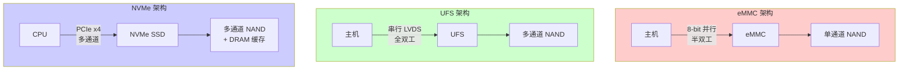
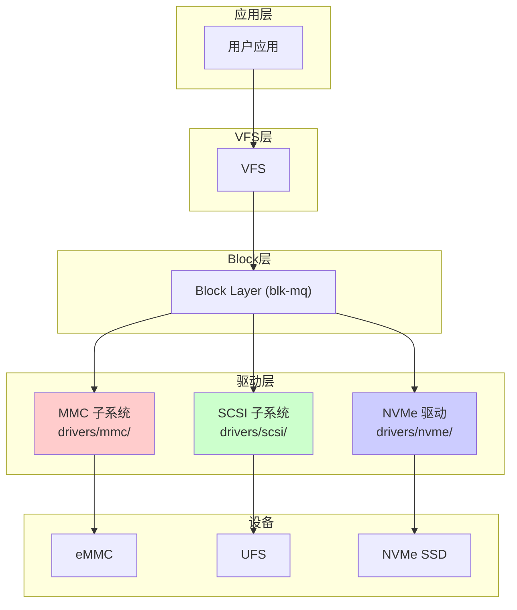
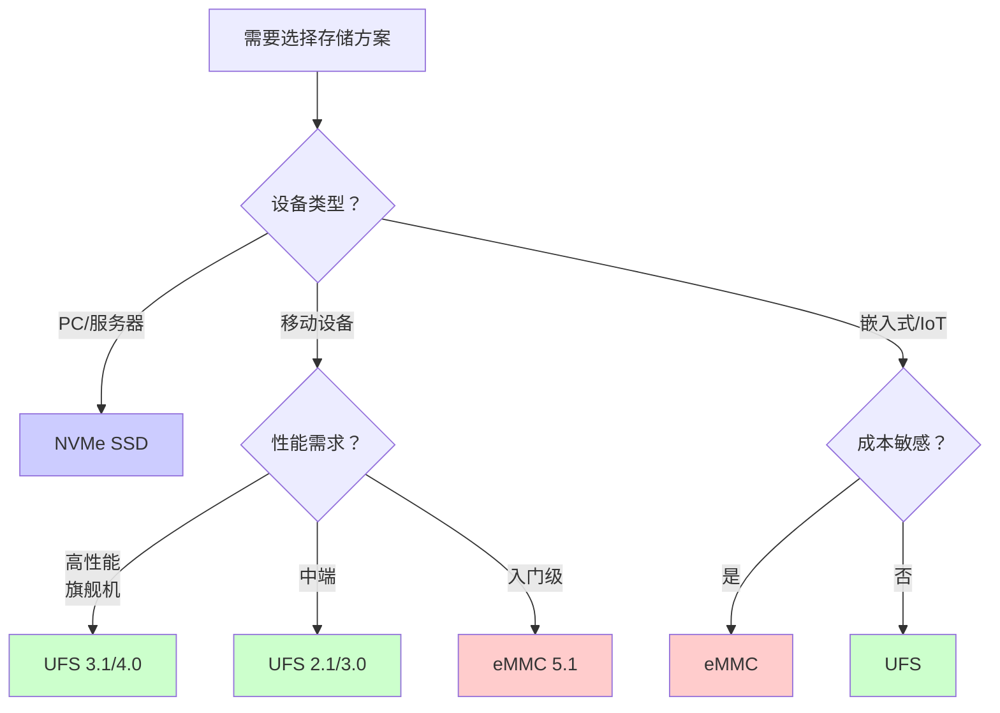

# 存储设备类型对比：eMMC、UFS、NVMe

## 学习目标

- 理解 eMMC、UFS、NVMe 三种存储技术的基本原理
- 掌握三种存储类型的核心区别
- 了解各自的使用场景和适用设备
- 学会通过命令行识别和查询设备类型

## 概述

在嵌入式设备、移动设备和 PC 领域，主流的闪存存储接口有三种：**eMMC**（embedded MultiMediaCard）、**UFS**（Universal Flash Storage）和 **NVMe**（Non-Volatile Memory Express）。它们都是基于 NAND Flash 的存储方案，但在接口协议、性能和应用场景上有显著差异。

---

## 一、三种存储技术简介

### 1.1 eMMC（embedded MultiMediaCard）

**定义**：eMMC 是将 NAND Flash 芯片和控制器封装在一起的嵌入式存储解决方案。

```
┌─────────────────────────────────────────────────────┐
│                    eMMC 封装                         │
├─────────────────────────────────────────────────────┤
│                                                     │
│   ┌─────────────┐      ┌─────────────────────┐     │
│   │   控制器    │ ←──→ │     NAND Flash      │     │
│   │ (Controller)│      │   (存储介质)         │     │
│   └──────┬──────┘      └─────────────────────┘     │
│          │                                          │
│          │ MMC 接口（8-bit 并行）                   │
│          │                                          │
└──────────┼──────────────────────────────────────────┘
           │
           ▼
      主机控制器（SoC）
```

**关键特点**：
- **接口**：8-bit 并行总线，半双工（同一时刻只能读或写）
- **协议**：基于 MMC（MultiMediaCard）协议
- **速度**：最高约 400MB/s（eMMC 5.1）
- **命令队列**：不支持或有限支持（单命令处理）

### 1.2 UFS（Universal Flash Storage）

**定义**：UFS 是 JEDEC 制定的高性能闪存存储标准，专为移动设备设计。

```
┌─────────────────────────────────────────────────────┐
│                    UFS 封装                          │
├─────────────────────────────────────────────────────┤
│                                                     │
│   ┌─────────────┐      ┌─────────────────────┐     │
│   │   UFS 控制器 │ ←──→ │     NAND Flash      │     │
│   │   + PHY     │      │   (存储介质)         │     │
│   └──────┬──────┘      └─────────────────────┘     │
│          │                                          │
│          │ M-PHY + UniPro                           │
│          │ (高速串行，全双工)                        │
│          │                                          │
└──────────┼──────────────────────────────────────────┘
           │
           ▼
      主机控制器（SoC）
```

**关键特点**：
- **接口**：串行 LVDS（Low Voltage Differential Signaling），全双工
- **协议**：SCSI 命令集（通过 UFS 协议层封装）
- **速度**：UFS 2.1 约 1.2GB/s，UFS 3.1 约 2.1GB/s，UFS 4.0 约 4.2GB/s
- **命令队列**：支持多命令队列（通常 16-32 深度）

### 1.3 NVMe（Non-Volatile Memory Express）

**定义**：NVMe 是专为 PCIe 接口的 SSD 设计的高性能存储协议。

```
┌─────────────────────────────────────────────────────┐
│                    NVMe SSD                          │
├─────────────────────────────────────────────────────┤
│                                                     │
│   ┌─────────────┐      ┌─────────────────────┐     │
│   │  NVMe 控制器 │ ←──→ │     NAND Flash      │     │
│   │   + DRAM    │      │   (多通道并行)       │     │
│   └──────┬──────┘      └─────────────────────┘     │
│          │                                          │
│          │ PCIe x4 (Gen3/Gen4/Gen5)                 │
│          │ (高带宽，低延迟)                          │
│          │                                          │
└──────────┼──────────────────────────────────────────┘
           │
           ▼
      PCIe 总线 → CPU
```

**关键特点**：
- **接口**：PCIe（x2/x4 lanes）
- **协议**：NVMe 协议（专为闪存优化）
- **速度**：PCIe 3.0 x4 约 3.5GB/s，PCIe 4.0 x4 约 7GB/s，PCIe 5.0 x4 约 14GB/s
- **命令队列**：支持 65535 个队列，每队列 65536 个命令

---

## 二、核心区别对比

### 2.1 架构对比图



### 2.2 详细对比表

| 对比项 | eMMC | UFS | NVMe |
|-------|------|-----|------|
| **全称** | embedded MultiMediaCard | Universal Flash Storage | Non-Volatile Memory Express |
| **接口类型** | 8-bit 并行 | 串行 LVDS (M-PHY) | PCIe |
| **双工模式** | 半双工 | 全双工 | 全双工 |
| **命令协议** | MMC 命令 | SCSI 命令 | NVMe 命令 |
| **最高带宽** | ~400 MB/s (5.1) | ~4.2 GB/s (4.0) | ~14 GB/s (PCIe 5.0 x4) |
| **随机读 IOPS** | ~10K | ~70K | ~1000K |
| **命令队列深度** | 1（无队列） | 16-32 | 65535 × 65536 |
| **硬件队列数** | 1 | 1 | 可达 CPU 数量 |
| **功耗** | 低 | 中 | 高 |
| **成本** | 低 | 中 | 高 |
| **Linux 设备名** | `/dev/mmcblk0` | `/dev/sda` | `/dev/nvme0n1` |

### 2.3 性能对比

```
顺序读取速度对比：

eMMC 5.1:    ████████████░░░░░░░░░░░░░░░░░░░░░░░░░░░░  400 MB/s
UFS 3.1:     ████████████████████████████████████████  2100 MB/s
UFS 4.0:     ████████████████████████████████████████████████████  4200 MB/s
NVMe Gen4:   ████████████████████████████████████████████████████████████████████  7000 MB/s
NVMe Gen5:   ████████████████████████████████████████████████████████████████████████████████████  14000 MB/s
             |________|________|________|________|________|________|________|
             0       2000     4000     6000     8000    10000    12000    14000 MB/s
```

### 2.4 命令处理能力对比

```
┌─────────────────────────────────────────────────────────────────────────┐
│                         命令处理能力对比                                  │
├─────────────────────────────────────────────────────────────────────────┤
│                                                                         │
│  eMMC: 串行处理，一次只能处理一个命令                                     │
│  ┌─────┐                                                                │
│  │CMD 1│→ 完成 → │CMD 2│→ 完成 → │CMD 3│→ 完成                        │
│  └─────┘         └─────┘         └─────┘                                │
│                                                                         │
│  UFS: 命令队列，可同时处理多个命令（16-32 个）                            │
│  ┌─────┬─────┬─────┬─────┬─────┬─────┐                                 │
│  │CMD 1│CMD 2│CMD 3│CMD 4│ ... │CMD32│  → 并行处理                     │
│  └─────┴─────┴─────┴─────┴─────┴─────┘                                 │
│                                                                         │
│  NVMe: 多队列 + 深队列（65535 队列 × 65536 深度）                        │
│  ┌───────────────────────────────────────┐                              │
│  │ Queue 0: CMD1, CMD2, ... CMD65536     │                              │
│  │ Queue 1: CMD1, CMD2, ... CMD65536     │  → 大规模并行                │
│  │ ...                                   │                              │
│  │ Queue 65535: CMD1, CMD2, ... CMD65536 │                              │
│  └───────────────────────────────────────┘                              │
│                                                                         │
└─────────────────────────────────────────────────────────────────────────┘
```

---

## 三、Linux 内核中的实现差异

### 3.1 驱动层次结构



### 3.2 blk-mq 队列配置差异

| 特性 | eMMC | UFS | NVMe |
|------|------|-----|------|
| **驱动模块** | `mmc_block` | `ufshcd`, `sd_mod` | `nvme` |
| **硬件队列数** | 1 | 1 | 可配置（通常 = CPU 数） |
| **nr_requests** | 64-128 | 62-256 | 256-1024 |
| **queue_depth** | 32-64 | 16-32 | 128-1024 |
| **Tag 共享** | 所有 CPU 共享 | 所有 CPU 共享 | 每 CPU 独享 |

### 3.3 sysfs 路径对比

```bash
# eMMC
/sys/block/mmcblk0/
├── queue/
│   ├── nr_requests      # Internal Tag 数量
│   ├── scheduler        # IO 调度器
│   └── ...
└── mq/
    └── 0/               # 通常只有 1 个硬件队列
        └── cpu_list     # 映射的 CPU 列表

# UFS
/sys/block/sda/
├── device/
│   ├── vendor           # 厂商信息
│   ├── model            # 型号
│   └── queue_depth      # 硬件队列深度
├── queue/
│   ├── nr_requests
│   └── scheduler
└── mq/
    └── 0/               # 通常只有 1 个硬件队列
        └── cpu_list

# NVMe
/sys/block/nvme0n1/
├── queue/
│   ├── nr_requests
│   └── scheduler
└── mq/
    ├── 0/               # 多个硬件队列
    │   └── cpu_list
    ├── 1/
    ├── 2/
    └── ...              # 通常 = CPU 数量

/sys/class/nvme/nvme0/
├── model                # 型号
├── serial               # 序列号
└── firmware_rev         # 固件版本
```

---

## 四、使用场景分析

### 4.1 eMMC 适用场景

```
┌─────────────────────────────────────────────────────────────────────────┐
│                         eMMC 典型应用场景                                │
├─────────────────────────────────────────────────────────────────────────┤
│                                                                         │
│  ✅ 低端智能手机（入门级 Android 手机）                                   │
│  ✅ 智能手表、手环等可穿戴设备                                           │
│  ✅ 机顶盒、智能电视                                                     │
│  ✅ 嵌入式系统（工控设备、IoT 设备）                                     │
│  ✅ 车载信息娱乐系统（非关键存储）                                       │
│  ✅ 低成本平板电脑                                                       │
│                                                                         │
│  特点：成本敏感、性能要求不高、功耗敏感                                   │
│                                                                         │
└─────────────────────────────────────────────────────────────────────────┘
```

### 4.2 UFS 适用场景

```
┌─────────────────────────────────────────────────────────────────────────┐
│                         UFS 典型应用场景                                 │
├─────────────────────────────────────────────────────────────────────────┤
│                                                                         │
│  ✅ 中高端智能手机（Android 旗舰机）                                      │
│  ✅ 高端平板电脑                                                         │
│  ✅ 汽车电子（ADAS、数字仪表盘）                                         │
│  ✅ 高性能嵌入式系统                                                     │
│  ✅ 无人机、机器人                                                       │
│  ✅ VR/AR 设备                                                          │
│                                                                         │
│  特点：高性能、低功耗、紧凑封装                                          │
│                                                                         │
│  版本演进：                                                              │
│  ├── UFS 2.0/2.1: 主流中端手机                                          │
│  ├── UFS 3.0/3.1: 旗舰手机标配                                          │
│  └── UFS 4.0: 最新旗舰机型                                              │
│                                                                         │
└─────────────────────────────────────────────────────────────────────────┘
```

### 4.3 NVMe 适用场景

```
┌─────────────────────────────────────────────────────────────────────────┐
│                        NVMe 典型应用场景                                 │
├─────────────────────────────────────────────────────────────────────────┤
│                                                                         │
│  ✅ 台式电脑、笔记本电脑                                                 │
│  ✅ 工作站                                                               │
│  ✅ 服务器（数据中心）                                                   │
│  ✅ 高性能计算（HPC）                                                    │
│  ✅ 游戏主机（PS5、Xbox Series X）                                       │
│  ✅ 专业视频编辑工作站                                                   │
│  ✅ 数据库服务器                                                         │
│                                                                         │
│  特点：极致性能、高 IOPS、低延迟                                         │
│                                                                         │
│  规格演进：                                                              │
│  ├── PCIe 3.0 x4: ~3.5 GB/s                                             │
│  ├── PCIe 4.0 x4: ~7 GB/s（当前主流）                                   │
│  └── PCIe 5.0 x4: ~14 GB/s（最新高端）                                  │
│                                                                         │
└─────────────────────────────────────────────────────────────────────────┘
```

### 4.4 选型决策流程



---

## 五、设备类型查询命令

### 5.1 快速判断方法

#### 方法一：查看设备名称

```bash
# 查看块设备列表
lsblk

# 判断规则：
# /dev/mmcblk*  → eMMC
# /dev/sd*      → UFS（或 SATA）
# /dev/nvme*    → NVMe
```

#### 方法二：检查 sysfs 目录

```bash
# eMMC 检测
ls /sys/class/mmc_host/

# UFS/SCSI 检测
ls /sys/class/scsi_host/

# NVMe 检测
ls /sys/class/nvme/
```

### 5.2 详细信息查询

#### eMMC 设备

```bash
# 查看 eMMC 设备列表
ls /dev/mmcblk*

# 查看 eMMC 详细信息
cat /sys/class/mmc_host/mmc0/mmc0:0001/name       # 设备名称
cat /sys/class/mmc_host/mmc0/mmc0:0001/cid        # 设备 ID
cat /sys/class/mmc_host/mmc0/mmc0:0001/csd        # 设备参数
cat /sys/class/mmc_host/mmc0/mmc0:0001/date       # 生产日期
cat /sys/class/mmc_host/mmc0/mmc0:0001/fwrev      # 固件版本

# 查看队列信息
cat /sys/block/mmcblk0/queue/nr_requests
ls /sys/block/mmcblk0/mq/
```

#### UFS 设备

```bash
# 查看 UFS 设备列表
ls /dev/sd*

# 查看 UFS 详细信息
cat /sys/block/sda/device/vendor                  # 厂商
cat /sys/block/sda/device/model                   # 型号
cat /sys/block/sda/device/rev                     # 固件版本
cat /sys/block/sda/device/queue_depth             # 硬件队列深度

# 查看队列信息
cat /sys/block/sda/queue/nr_requests
ls /sys/block/sda/mq/

# 查看 UFS 主机控制器信息
ls /sys/class/scsi_host/
cat /sys/class/scsi_host/host0/proc_name          # 驱动名称
```

#### NVMe 设备

```bash
# 查看 NVMe 设备列表
ls /dev/nvme*

# 查看 NVMe 详细信息
cat /sys/class/nvme/nvme0/model                   # 型号
cat /sys/class/nvme/nvme0/serial                  # 序列号
cat /sys/class/nvme/nvme0/firmware_rev            # 固件版本
cat /sys/class/nvme/nvme0/transport               # 传输类型

# 使用 nvme-cli 工具（需要安装）
nvme list                                         # 列出所有 NVMe 设备
nvme id-ctrl /dev/nvme0                           # 控制器信息
nvme smart-log /dev/nvme0                         # SMART 信息

# 查看队列信息
cat /sys/block/nvme0n1/queue/nr_requests
ls /sys/block/nvme0n1/mq/                         # 会显示多个硬件队列
```

### 5.3 完整检测脚本

```bash
#!/bin/bash

echo "=============================================="
echo "        存储设备类型检测脚本"
echo "=============================================="
echo ""

# 检测 NVMe
echo "【NVMe 设备检测】"
if ls /dev/nvme* 2>/dev/null | grep -q nvme; then
    echo "  ✅ 检测到 NVMe 设备"
    for nvme in /sys/class/nvme/nvme*; do
        if [ -d "$nvme" ]; then
            name=$(basename $nvme)
            model=$(cat $nvme/model 2>/dev/null | tr -d ' ')
            serial=$(cat $nvme/serial 2>/dev/null | tr -d ' ')
            echo "  设备: $name"
            echo "    型号: $model"
            echo "    序列号: $serial"
            echo "    硬件队列数: $(ls /sys/block/${name}n1/mq/ 2>/dev/null | wc -l)"
            echo "    nr_requests: $(cat /sys/block/${name}n1/queue/nr_requests 2>/dev/null)"
        fi
    done
else
    echo "  ❌ 未检测到 NVMe 设备"
fi
echo ""

# 检测 UFS
echo "【UFS 设备检测】"
if ls /sys/class/scsi_host/ 2>/dev/null | grep -q host; then
    for sd in /sys/block/sd*; do
        if [ -d "$sd/device" ]; then
            name=$(basename $sd)
            vendor=$(cat $sd/device/vendor 2>/dev/null | tr -d ' ')
            model=$(cat $sd/device/model 2>/dev/null | tr -d ' ')
            queue_depth=$(cat $sd/device/queue_depth 2>/dev/null)
            
            if [ -n "$vendor" ]; then
                echo "  ✅ 检测到 UFS/SCSI 设备"
                echo "  设备: /dev/$name"
                echo "    厂商: $vendor"
                echo "    型号: $model"
                echo "    queue_depth: $queue_depth"
                echo "    硬件队列数: $(ls $sd/mq/ 2>/dev/null | wc -l)"
                echo "    nr_requests: $(cat $sd/queue/nr_requests 2>/dev/null)"
            fi
        fi
    done
else
    echo "  ❌ 未检测到 UFS 设备"
fi
echo ""

# 检测 eMMC
echo "【eMMC 设备检测】"
if ls /dev/mmcblk* 2>/dev/null | grep -q mmcblk; then
    echo "  ✅ 检测到 eMMC 设备"
    for mmc in /sys/class/mmc_host/mmc*/mmc*:*; do
        if [ -d "$mmc" ]; then
            name=$(cat $mmc/name 2>/dev/null)
            type=$(cat $mmc/type 2>/dev/null)
            echo "  设备: $mmc"
            echo "    名称: $name"
            echo "    类型: $type"
        fi
    done
    echo "    硬件队列数: $(ls /sys/block/mmcblk0/mq/ 2>/dev/null | wc -l)"
    echo "    nr_requests: $(cat /sys/block/mmcblk0/queue/nr_requests 2>/dev/null)"
else
    echo "  ❌ 未检测到 eMMC 设备"
fi
echo ""

# 汇总
echo "=============================================="
echo "                设备汇总"
echo "=============================================="
echo "块设备列表:"
lsblk -d -o NAME,SIZE,TYPE,TRAN,MODEL 2>/dev/null || ls /dev/sd* /dev/mmcblk* /dev/nvme* 2>/dev/null
```

### 5.4 Android 设备检测命令

```bash
adb shell "
echo '=============================================='
echo '        Android 存储设备检测'
echo '=============================================='
echo ''

# 检测 UFS
echo '【UFS 检测】'
if [ -f /sys/block/sda/device/vendor ]; then
    echo '  类型: UFS'
    echo '  厂商:' \$(cat /sys/block/sda/device/vendor)
    echo '  型号:' \$(cat /sys/block/sda/device/model)
    echo '  queue_depth:' \$(cat /sys/block/sda/device/queue_depth)
    echo '  nr_requests:' \$(cat /sys/block/sda/queue/nr_requests)
    echo '  硬件队列数:' \$(ls /sys/block/sda/mq/ | wc -l)
    echo '  CPU 映射:' \$(cat /sys/block/sda/mq/0/cpu_list)
fi

# 检测 eMMC
echo ''
echo '【eMMC 检测】'
if [ -d /sys/class/mmc_host/mmc0 ]; then
    if [ -f /sys/class/mmc_host/mmc0/mmc0:0001/name ]; then
        echo '  类型: eMMC'
        echo '  名称:' \$(cat /sys/class/mmc_host/mmc0/mmc0:0001/name)
        echo '  nr_requests:' \$(cat /sys/block/mmcblk0/queue/nr_requests 2>/dev/null)
        echo '  硬件队列数:' \$(ls /sys/block/mmcblk0/mq/ 2>/dev/null | wc -l)
    fi
fi

echo ''
echo '【存储分区】'
ls -la /dev/block/by-name/ 2>/dev/null | head -15
"
```

### 5.5 快速判断表

| 检查项 | eMMC | UFS | NVMe |
|-------|------|-----|------|
| **设备路径** | `/dev/mmcblk0` | `/dev/sda` | `/dev/nvme0n1` |
| **sysfs 类** | `/sys/class/mmc_host/` | `/sys/class/scsi_host/` | `/sys/class/nvme/` |
| **驱动模块** | `mmc_block` | `ufshcd`, `sd_mod` | `nvme` |
| **lsblk TRAN** | `mmc` | `sas`/`usb` | `nvme` |
| **硬件队列数** | 1 | 1 | 通常 = CPU 数 |
| **queue_depth** | 32-64 | 16-32 | 128-1024 |

---

## 六、性能调优建议

### 6.1 eMMC 调优

```bash
# 由于 eMMC 性能有限，主要优化方向：
# 1. 减少不必要的 IO
# 2. 使用更激进的 readahead

# 增大预读
echo 256 > /sys/block/mmcblk0/queue/read_ahead_kb

# 使用 none 调度器（减少调度开销）
echo none > /sys/block/mmcblk0/queue/scheduler
```

### 6.2 UFS 调优

```bash
# 1. 适当增加 nr_requests
echo 128 > /sys/block/sda/queue/nr_requests

# 2. 根据工作负载选择调度器
echo mq-deadline > /sys/block/sda/queue/scheduler  # 延迟敏感
echo bfq > /sys/block/sda/queue/scheduler          # 公平性优先

# 3. 适当增加预读
echo 128 > /sys/block/sda/queue/read_ahead_kb
```

### 6.3 NVMe 调优

```bash
# NVMe 性能已经很高，调优空间有限

# 1. 对于延迟敏感场景，使用 none 调度器
echo none > /sys/block/nvme0n1/queue/scheduler

# 2. 增大队列深度（如果 IO 密集）
echo 1024 > /sys/block/nvme0n1/queue/nr_requests

# 3. 调整中断合并（需要 nvme-cli）
# nvme set-feature /dev/nvme0 -f 0x08 -v 0x0  # 禁用中断合并（低延迟）
```

---

## 七、总结

### 选型建议

| 场景 | 推荐方案 | 理由 |
|------|---------|------|
| **入门级手机/IoT** | eMMC | 成本低、功耗低、够用 |
| **中高端手机** | UFS 3.x/4.0 | 性能好、功耗可控 |
| **PC/服务器** | NVMe | 极致性能、高 IOPS |
| **成本敏感嵌入式** | eMMC | 最经济的选择 |
| **汽车电子** | UFS | 可靠性好、性能适中 |

### 关键结论

1. **eMMC**：半双工、无队列、低成本，适合低端设备
2. **UFS**：全双工、有命令队列、移动端最佳平衡
3. **NVMe**：多队列、超高性能、PC/服务器首选

### Linux 视角

- 三种设备在 Linux 中都通过 **blk-mq** 框架管理
- **eMMC/UFS** 通常只有 **1 个硬件队列**，所有 CPU 共享 Tag 池
- **NVMe** 可以有**多个硬件队列**（通常等于 CPU 数），每个 CPU 独享 Tag 池
- 理解这些差异对性能分析和调优至关重要
