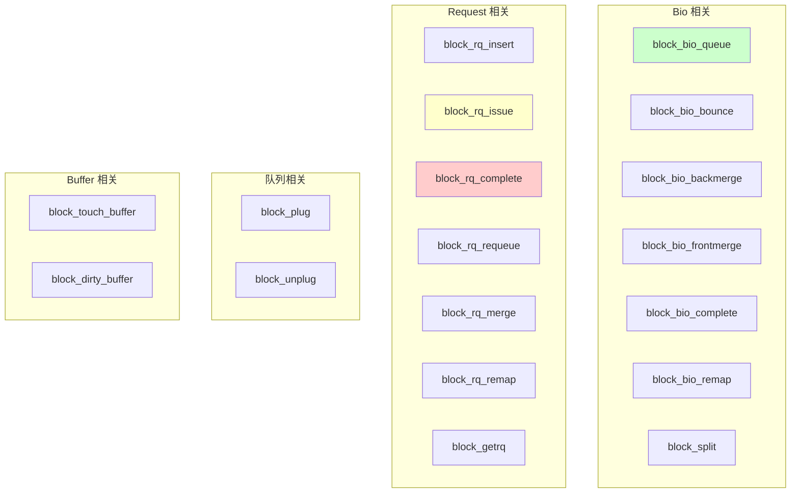

# Block 层 Tracepoint 详解与使用指南

## 学习目标

- 理解 Linux 内核 Tracepoint 机制的基本原理
- 掌握 Block 层各个 Tracepoint 的含义和触发时机
- 学会使用 ftrace、perf、trace-cmd 等工具进行 Block 层追踪
- 能够利用 Tracepoint 进行 IO 性能分析和问题定位

## 概述

`include/trace/events/block.h` 是 Linux 内核中 Block 层的 Tracepoint 定义文件。它定义了一系列用于追踪 Block 层 IO 操作的静态探测点，可以帮助开发者和系统管理员深入了解 IO 请求的完整生命周期。

---

## 一、Tracepoint 机制简介

### 1.1 什么是 Tracepoint？

Tracepoint 是 Linux 内核中的**静态探测点**，它们被预先插入到内核代码的关键位置，允许在运行时动态启用/禁用追踪，而几乎不影响正常性能。

```
┌─────────────────────────────────────────────────────────────────────────┐
│                        Tracepoint 工作原理                               │
├─────────────────────────────────────────────────────────────────────────┤
│                                                                         │
│  内核代码中：                                                            │
│  ┌────────────────────────────────────────────────────────────────┐    │
│  │  void submit_bio(struct bio *bio)                              │    │
│  │  {                                                             │    │
│  │      // ... 一些处理代码 ...                                    │    │
│  │                                                                │    │
│  │      trace_block_bio_queue(bio);  ← Tracepoint 探测点          │    │
│  │                                                                │    │
│  │      // ... 继续处理 ...                                        │    │
│  │  }                                                             │    │
│  └────────────────────────────────────────────────────────────────┘    │
│                                                                         │
│  未启用时：trace_block_bio_queue() 几乎无开销（仅一次条件判断）         │
│  启用时：  记录 bio 相关信息到 trace buffer                            │
│                                                                         │
└─────────────────────────────────────────────────────────────────────────┘
```

### 1.2 Tracepoint vs 其他追踪技术

| 技术 | 类型 | 开销 | 灵活性 | 稳定性 |
|------|------|------|--------|--------|
| **Tracepoint** | 静态探测 | 极低 | 固定位置 | 稳定 API |
| **kprobe** | 动态探测 | 中等 | 任意位置 | 可能随内核变化 |
| **ftrace function** | 函数入口 | 低 | 所有函数 | 较稳定 |
| **eBPF** | 可编程 | 低-中 | 灵活 | 需要适配 |

---

## 二、Block 层 Tracepoint 完整列表

### 2.1 Tracepoint 分类概览



### 2.2 IO 请求生命周期中的 Tracepoint

```
┌─────────────────────────────────────────────────────────────────────────┐
│                    IO 请求生命周期与 Tracepoint                          │
├─────────────────────────────────────────────────────────────────────────┤
│                                                                         │
│  应用程序                                                                │
│      │                                                                  │
│      ▼                                                                  │
│  ┌─────────────────┐                                                   │
│  │  VFS / Page Cache│                                                   │
│  └────────┬────────┘                                                   │
│           │                                                             │
│           ▼  submit_bio()                                               │
│  ┌─────────────────────────────────────────────────────────────────┐   │
│  │                         Block 层                                 │   │
│  │                                                                  │   │
│  │  ① block_bio_queue      ← bio 进入 block 层                     │   │
│  │       │                                                          │   │
│  │       ▼                                                          │   │
│  │  ② block_bio_backmerge  ← bio 合并到已有请求尾部（可选）         │   │
│  │     block_bio_frontmerge← bio 合并到已有请求头部（可选）         │   │
│  │       │                                                          │   │
│  │       ▼                                                          │   │
│  │  ③ block_getrq          ← 分配新的 request 结构                 │   │
│  │       │                                                          │   │
│  │       ▼                                                          │   │
│  │  ④ block_rq_insert      ← request 插入调度器队列                │   │
│  │       │                                                          │   │
│  │       ▼                                                          │   │
│  │  ⑤ block_rq_merge       ← request 在调度器中合并（可选）        │   │
│  │       │                                                          │   │
│  │       ▼                                                          │   │
│  │  ⑥ block_rq_issue       ← request 发送给驱动                    │   │
│  │                                                                  │   │
│  └─────────────────────────────────────────────────────────────────┘   │
│           │                                                             │
│           ▼                                                             │
│  ┌─────────────────┐                                                   │
│  │   设备驱动/硬件  │                                                   │
│  └────────┬────────┘                                                   │
│           │ 完成中断                                                    │
│           ▼                                                             │
│  ┌─────────────────────────────────────────────────────────────────┐   │
│  │  ⑦ block_rq_complete    ← request 完成                          │   │
│  │       │                                                          │   │
│  │       ▼                                                          │   │
│  │  ⑧ block_bio_complete   ← bio 完成，通知上层                    │   │
│  └─────────────────────────────────────────────────────────────────┘   │
│                                                                         │
│  异常路径：                                                              │
│  ─────────                                                              │
│  block_rq_requeue  ← request 重新入队（驱动返回 busy 等）              │
│  block_split       ← bio 被拆分（超过硬件限制）                        │
│  block_bio_bounce  ← 使用 bounce buffer（DMA 限制）                   │
│  block_bio_remap   ← bio 地址重映射（DM/MD 等）                       │
│                                                                         │
└─────────────────────────────────────────────────────────────────────────┘
```

---

## 三、各 Tracepoint 详细说明

### 3.1 Bio 相关 Tracepoint

#### block_bio_queue

**定义位置**：`include/trace/events/block.h:351`

**触发时机**：bio 即将进入 Block 层队列时

**记录字段**：
```c
TP_STRUCT__entry(
    __field( dev_t,        dev        )   // 设备号
    __field( sector_t,     sector     )   // 起始扇区
    __field( unsigned int, nr_sector  )   // 扇区数量
    __array( char,         rwbs, 8    )   // 操作类型（R/W/D/F 等）
    __array( char,         comm, 16   )   // 进程名
)
```

**输出格式**：`major,minor rwbs sector + nr_sector [comm]`

**示例输出**：
```
8,0 WS 12345678 + 8 [dd]
```

**用途**：追踪 IO 请求的入口点，了解 IO 来源

---

#### block_bio_complete

**定义位置**：`include/trace/events/block.h:252`

**触发时机**：bio 操作完成，即将返回上层时

**记录字段**：
```c
TP_STRUCT__entry(
    __field( dev_t,        dev        )
    __field( sector_t,     sector     )
    __field( unsigned,     nr_sector  )
    __field( int,          error      )   // 错误码
    __array( char,         rwbs, 8    )
)
```

**用途**：追踪 IO 完成情况，配合 `block_bio_queue` 计算 IO 延迟

---

#### block_bio_backmerge / block_bio_frontmerge

**触发时机**：bio 被合并到已有请求时
- **backmerge**：合并到请求尾部（最常见）
- **frontmerge**：合并到请求头部（较少见）

**用途**：分析 IO 合并效率，合并率高说明 IO 模式较顺序

---

#### block_split

**定义位置**：`include/trace/events/block.h:437`

**触发时机**：bio 因超过硬件限制被拆分时

**记录字段**：
```c
TP_STRUCT__entry(
    __field( dev_t,        dev        )
    __field( sector_t,     sector     )       // 原始扇区
    __field( sector_t,     new_sector )       // 拆分点
    __array( char,         rwbs, 8    )
    __array( char,         comm, 16   )
)
```

**用途**：分析大 IO 被拆分的情况，可能影响性能

---

### 3.2 Request 相关 Tracepoint

#### block_rq_insert

**定义位置**：`include/trace/events/block.h:209`

**触发时机**：request 插入调度器队列时

**记录字段**：
```c
TP_STRUCT__entry(
    __field( dev_t,         dev        )
    __field( sector_t,      sector     )
    __field( unsigned int,  nr_sector  )
    __field( unsigned int,  bytes      )
    __field( unsigned short, ioprio    )   // IO 优先级
    __array( char,          rwbs, 8    )
    __array( char,          comm, 16   )
)
```

**用途**：追踪请求进入调度器的时机

---

#### block_rq_issue

**定义位置**：`include/trace/events/block.h:223`

**触发时机**：request 发送给设备驱动时

**用途**：这是最重要的追踪点之一！
- 配合 `block_rq_complete` 可以计算**设备层延迟**
- 显示实际发送给硬件的请求

---

#### block_rq_complete

**定义位置**：`include/trace/events/block.h:126`

**触发时机**：request 完成时（驱动返回）

**记录字段**：
```c
TP_STRUCT__entry(
    __field( dev_t,         dev        )
    __field( sector_t,      sector     )
    __field( unsigned int,  nr_sector  )
    __field( unsigned short, ioprio    )
    __field( int,           error      )   // 完成状态
    __array( char,          rwbs, 8    )
)
```

**用途**：追踪 IO 完成，分析错误和延迟

---

#### block_rq_requeue

**定义位置**：`include/trace/events/block.h:80`

**触发时机**：request 被放回队列时（驱动返回 busy、资源不足等）

**用途**：诊断驱动层问题，频繁 requeue 可能表示资源竞争

---

### 3.3 队列相关 Tracepoint

#### block_plug / block_unplug

**触发时机**：
- **block_plug**：队列被 plug 时
- **block_unplug**：队列被 unplug 时

**用途**：分析 IO 批处理效率

```c
// block_unplug 记录的信息
TP_STRUCT__entry(
    __field( int,  nr_rq  )   // unplug 时的请求数量
    __array( char, comm, 16 )
)
```

---

## 四、使用方法

### 4.1 通过 ftrace 使用

#### 查看可用的 block tracepoint

```bash
# 列出所有 block 相关的 tracepoint
ls /sys/kernel/debug/tracing/events/block/

# 输出示例：
# block_bio_backmerge
# block_bio_bounce
# block_bio_complete
# block_bio_frontmerge
# block_bio_queue
# block_bio_remap
# block_dirty_buffer
# block_getrq
# block_plug
# block_rq_complete
# block_rq_insert
# block_rq_issue
# block_rq_merge
# block_rq_requeue
# block_rq_remap
# block_split
# block_touch_buffer
# block_unplug
```

#### 启用单个 tracepoint

```bash
# 启用 block_rq_issue
echo 1 > /sys/kernel/debug/tracing/events/block/block_rq_issue/enable

# 查看 trace 输出
cat /sys/kernel/debug/tracing/trace

# 禁用
echo 0 > /sys/kernel/debug/tracing/events/block/block_rq_issue/enable
```

#### 启用所有 block tracepoint

```bash
# 启用整个 block 子系统
echo 1 > /sys/kernel/debug/tracing/events/block/enable

# 清空 buffer
echo > /sys/kernel/debug/tracing/trace

# 运行测试负载
dd if=/dev/zero of=/tmp/test bs=4k count=1000

# 查看 trace
cat /sys/kernel/debug/tracing/trace

# 禁用
echo 0 > /sys/kernel/debug/tracing/events/block/enable
```

#### ftrace 输出示例

```
# tracer: nop
#
# entries-in-buffer/entries-written: 1234/1234   #P:8
#
#                                _-----=> irqs-off
#                               / _----=> need-resched
#                              | / _---=> hardirq/softirq
#                              || / _--=> preempt-depth
#                              ||| /     delay
#           TASK-PID     CPU#  ||||   TIMESTAMP  FUNCTION
#              | |         |   ||||      |         |
              dd-12345   [002] ....  1234.567890: block_bio_queue: 8,0 W 0 + 8 [dd]
              dd-12345   [002] ....  1234.567891: block_getrq: 8,0 W 0 + 8 [dd]
              dd-12345   [002] ....  1234.567892: block_rq_insert: 8,0 W 4096 () 0 + 8 be,4 [dd]
              dd-12345   [002] ....  1234.567893: block_rq_issue: 8,0 W 4096 () 0 + 8 be,4 [dd]
     kworker/2:1-456     [002] ....  1234.568123: block_rq_complete: 8,0 W () 0 + 8 be,4 [0]
```

### 4.2 通过 perf 使用

#### 记录 block 事件

```bash
# 记录所有 block 事件
perf record -e 'block:*' -a -- sleep 10

# 记录特定事件
perf record -e 'block:block_rq_issue,block:block_rq_complete' -a -- sleep 10

# 查看统计
perf report
```

#### 实时统计

```bash
# 实时显示 block 事件统计
perf stat -e 'block:block_rq_issue,block:block_rq_complete' -a -- sleep 5
```

### 4.3 通过 trace-cmd 使用

```bash
# 安装 trace-cmd
apt install trace-cmd  # Debian/Ubuntu
yum install trace-cmd  # CentOS/RHEL

# 记录 block 事件
trace-cmd record -e block dd if=/dev/zero of=/tmp/test bs=4k count=1000

# 查看报告
trace-cmd report

# 生成可视化报告（配合 kernelshark）
trace-cmd report > trace.txt
kernelshark trace.dat
```

### 4.4 通过 bpftrace 使用（推荐）

```bash
# 安装 bpftrace
apt install bpftrace

# 追踪 IO 延迟（从 issue 到 complete）
bpftrace -e '
tracepoint:block:block_rq_issue {
    @start[args->sector] = nsecs;
}
tracepoint:block:block_rq_complete {
    if (@start[args->sector]) {
        @latency = hist(nsecs - @start[args->sector]);
        delete(@start[args->sector]);
    }
}
'

# 统计各类型 IO 数量
bpftrace -e '
tracepoint:block:block_rq_issue {
    @[args->rwbs] = count();
}
'

# 追踪特定进程的 IO
bpftrace -e '
tracepoint:block:block_bio_queue /comm == "dd"/ {
    printf("%s: %s %d + %d\n", comm, args->rwbs, args->sector, args->nr_sector);
}
'
```

### 4.5 Android 设备使用

```bash
# 通过 adb 启用 ftrace
adb shell "
echo 1 > /sys/kernel/debug/tracing/events/block/block_rq_issue/enable
echo 1 > /sys/kernel/debug/tracing/events/block/block_rq_complete/enable
cat /sys/kernel/debug/tracing/trace_pipe
" &

# 运行测试后停止
adb shell "
echo 0 > /sys/kernel/debug/tracing/events/block/enable
"

# 使用 atrace/systrace
adb shell atrace --list_categories | grep -i block
adb shell atrace -t 5 -b 10240 disk > trace.html
```

---

## 五、实战案例

### 5.1 计算 IO 延迟分布

```bash
#!/bin/bash
# io_latency.sh - 分析 IO 延迟分布

# 启用 tracepoint
echo 1 > /sys/kernel/debug/tracing/events/block/block_rq_issue/enable
echo 1 > /sys/kernel/debug/tracing/events/block/block_rq_complete/enable
echo > /sys/kernel/debug/tracing/trace

# 运行测试负载
echo "Running workload..."
dd if=/dev/sda of=/dev/null bs=4k count=10000 2>/dev/null

# 停止追踪
echo 0 > /sys/kernel/debug/tracing/events/block/enable

# 分析（使用 awk 计算延迟）
echo "Analyzing..."
cat /sys/kernel/debug/tracing/trace | awk '
/block_rq_issue/ {
    split($0, a, " ");
    sector = a[10];
    issue_time[sector] = a[4];
}
/block_rq_complete/ {
    split($0, a, " ");
    sector = a[10];
    if (sector in issue_time) {
        latency = a[4] - issue_time[sector];
        if (latency > 0) {
            total += latency;
            count++;
            if (latency < 0.001) bucket["<1ms"]++;
            else if (latency < 0.01) bucket["1-10ms"]++;
            else if (latency < 0.1) bucket["10-100ms"]++;
            else bucket[">100ms"]++;
        }
    }
}
END {
    print "IO Latency Distribution:";
    for (b in bucket) print b ": " bucket[b];
    if (count > 0) print "Average: " (total/count)*1000 " ms";
}
'
```

### 5.2 监控 IO 合并率

```bash
# 使用 bpftrace 监控合并率
bpftrace -e '
tracepoint:block:block_bio_queue { @total = count(); }
tracepoint:block:block_bio_backmerge { @merged = count(); }
tracepoint:block:block_bio_frontmerge { @merged = count(); }

interval:s:1 {
    if (@total > 0) {
        printf("Merge rate: %d%%\n", @merged * 100 / @total);
    }
    clear(@total);
    clear(@merged);
}
'
```

### 5.3 追踪 IO 错误

```bash
# 监控 IO 错误
bpftrace -e '
tracepoint:block:block_rq_complete /args->error != 0/ {
    printf("IO Error! dev=%d,%d sector=%lld error=%d\n",
        args->dev >> 20, args->dev & 0xfffff,
        args->sector, args->error);
}
'
```

### 5.4 分析 requeue 原因

```bash
# 监控 requeue 事件
bpftrace -e '
tracepoint:block:block_rq_requeue {
    @requeue[args->rwbs] = count();
    printf("Requeue: %s sector=%lld\n", args->rwbs, args->sector);
}

interval:s:5 {
    print(@requeue);
    clear(@requeue);
}
'
```

---

## 六、Tracepoint 字段说明

### 6.1 rwbs 字段解析

`rwbs` 是一个字符串，表示 IO 操作类型：

| 字符 | 含义 |
|------|------|
| **R** | Read（读） |
| **W** | Write（写） |
| **D** | Discard（丢弃/TRIM） |
| **F** | Flush（刷新） |
| **S** | Sync（同步） |
| **M** | Metadata（元数据） |
| **N** | None（无特殊标志） |
| **A** | Read-ahead（预读） |

**常见组合**：
- `R`：普通读
- `WS`：同步写
- `RA`：预读
- `WM`：元数据写

### 6.2 ioprio 字段解析

IO 优先级由两部分组成：
- **类别**（class）：RT（实时）、BE（尽力而为）、IDLE（空闲）
- **级别**（level）：0-7（RT/BE）或 0（IDLE）

```
输出格式：class,level
示例：be,4  表示 Best-Effort 类，级别 4
```

---

## 七、性能影响与最佳实践

### 7.1 性能影响

| 状态 | 性能影响 |
|------|---------|
| Tracepoint 未启用 | 几乎为零（仅一次条件判断） |
| 启用少量 Tracepoint | 约 1-3% |
| 启用所有 Block Tracepoint | 约 5-10% |
| 启用 + 高频 IO | 可能 10-20% |

### 7.2 最佳实践

```bash
# 1. 只启用需要的 tracepoint
echo 1 > /sys/kernel/debug/tracing/events/block/block_rq_issue/enable
# 而不是
echo 1 > /sys/kernel/debug/tracing/events/block/enable

# 2. 使用过滤器减少数据量
echo 'rwbs ~ "*W*"' > /sys/kernel/debug/tracing/events/block/block_rq_issue/filter

# 3. 限制 buffer 大小
echo 4096 > /sys/kernel/debug/tracing/buffer_size_kb

# 4. 使用 trace_pipe 实时消费
cat /sys/kernel/debug/tracing/trace_pipe > /tmp/trace.log &

# 5. 完成后立即禁用
echo 0 > /sys/kernel/debug/tracing/events/block/enable
```

---

## 八、总结

### Block Tracepoint 速查表

| Tracepoint | 触发时机 | 主要用途 |
|------------|---------|---------|
| `block_bio_queue` | bio 进入 block 层 | IO 入口追踪 |
| `block_bio_complete` | bio 完成 | IO 完成追踪 |
| `block_bio_backmerge` | bio 后向合并 | 合并率分析 |
| `block_bio_frontmerge` | bio 前向合并 | 合并率分析 |
| `block_getrq` | 分配 request | 请求分配追踪 |
| `block_rq_insert` | request 入队 | 调度器追踪 |
| `block_rq_issue` | request 发送给驱动 | **设备延迟分析（重要）** |
| `block_rq_complete` | request 完成 | **IO 完成追踪（重要）** |
| `block_rq_requeue` | request 重入队 | 驱动问题诊断 |
| `block_rq_merge` | request 合并 | 调度器合并分析 |
| `block_split` | bio 拆分 | 大 IO 分析 |
| `block_plug` | 队列 plug | 批处理分析 |
| `block_unplug` | 队列 unplug | 批处理分析 |

### 常用分析场景

| 分析目标 | 使用的 Tracepoint |
|---------|------------------|
| **IO 延迟** | `block_rq_issue` + `block_rq_complete` |
| **IO 吞吐** | `block_bio_queue` |
| **合并效率** | `block_bio_backmerge` + `block_bio_frontmerge` |
| **驱动问题** | `block_rq_requeue` |
| **IO 错误** | `block_rq_complete`（检查 error 字段） |
| **批处理效率** | `block_plug` + `block_unplug` |
