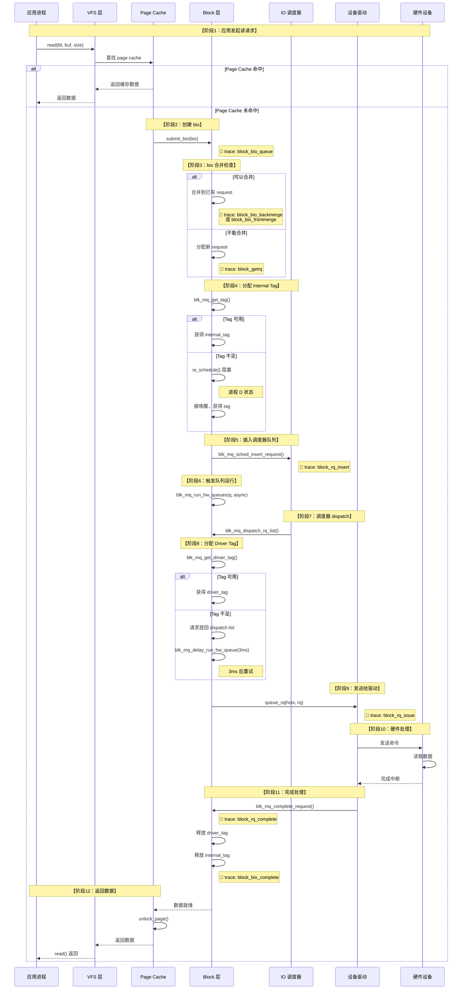
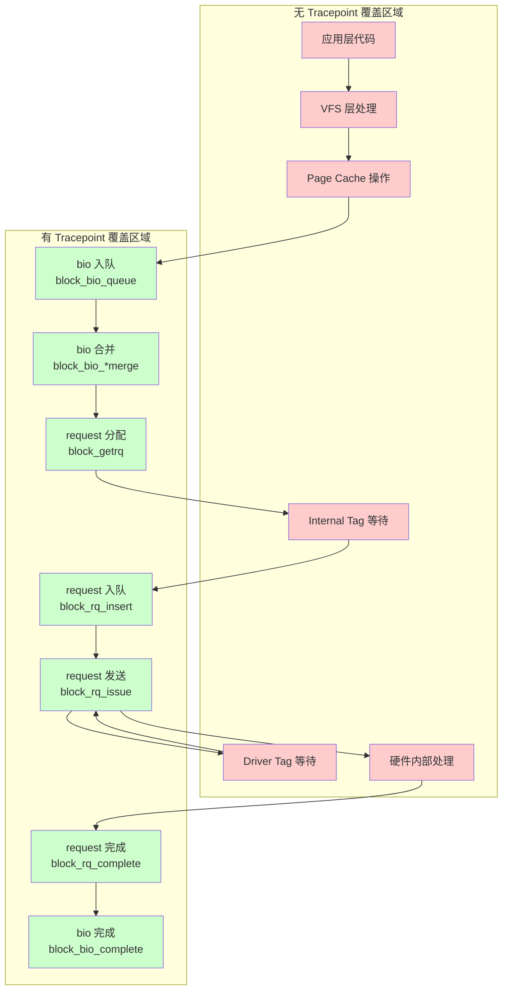
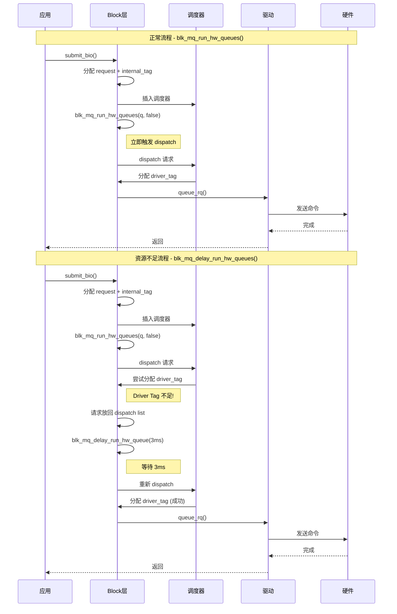

# IO 完整流程与 Tracepoint 位置详解

## 学习目标

- 理解 `blk_mq_run_hw_queues()` 和 `blk_mq_delay_run_hw_queues()` 的区别
- 掌握 IO 请求在 Block 层的完整流程
- 了解每个 Tracepoint 在 IO 流程中的精确位置
- 明确 ftrace 能够监控到的范围

## 概述

本文通过详细的时序图和流程图，展示一个 IO 请求从应用层到硬件完成的完整路径，并标注每个 Tracepoint 的触发位置，帮助理解 ftrace 的监控范围。

---

## 一、blk_mq_run_hw_queues vs blk_mq_delay_run_hw_queues

### 1.1 函数对比

```c
// 立即运行（或异步提交，delay=0）
void blk_mq_run_hw_queues(struct request_queue *q, bool async)
{
    queue_for_each_hw_ctx(q, hctx, i) {
        if (blk_mq_hctx_stopped(hctx))
            continue;
        if (!sq_hctx || sq_hctx == hctx ||
            !list_empty_careful(&hctx->dispatch))
            blk_mq_run_hw_queue(hctx, async);  // ← 调用单队列版本
    }
}

// 延迟运行（delay=msecs）
void blk_mq_delay_run_hw_queues(struct request_queue *q, unsigned long msecs)
{
    queue_for_each_hw_ctx(q, hctx, i) {
        if (blk_mq_hctx_stopped(hctx))
            continue;
        // 关键区别：检查是否已有 pending work
        if (delayed_work_pending(&hctx->run_work))
            continue;  // ← 如果已有 pending，不重复调度
        if (!sq_hctx || sq_hctx == hctx ||
            !list_empty_careful(&hctx->dispatch))
            blk_mq_delay_run_hw_queue(hctx, msecs);  // ← delay 毫秒后运行
    }
}
```

### 1.2 核心区别

| 特性 | `blk_mq_run_hw_queues()` | `blk_mq_delay_run_hw_queues()` |
|------|--------------------------|--------------------------------|
| **执行时机** | 立即（async=false）或异步提交（async=true, delay=0） | 延迟 msecs 毫秒后执行 |
| **async 参数** | 有，控制同步/异步 | 无，始终异步 |
| **pending 检查** | 无 | 有，避免重复调度 |
| **典型延迟** | 0 | 3ms（`BLK_MQ_RESOURCE_DELAY`） |
| **使用场景** | 正常 IO 提交后触发 | 资源不足时延迟重试 |

### 1.3 调用时机图

```
┌─────────────────────────────────────────────────────────────────────────┐
│                     两个函数的调用时机                                    │
├─────────────────────────────────────────────────────────────────────────┤
│                                                                         │
│  blk_mq_run_hw_queues(q, async) 调用场景：                               │
│  ═══════════════════════════════════════                                │
│                                                                         │
│  1. IO 提交后立即触发                                                    │
│     submit_bio() → blk_mq_submit_bio() → blk_mq_run_hw_queues(q, false) │
│                                                                         │
│  2. 队列恢复时                                                           │
│     blk_mq_unquiesce_queue() → blk_mq_run_hw_queues(q, true)            │
│                                                                         │
│  3. 队列冻结过程                                                         │
│     blk_freeze_queue_start() → blk_mq_run_hw_queues(q, false)           │
│                                                                         │
│  4. IO 调度器触发                                                        │
│     bfq_dispatch_request() → blk_mq_run_hw_queues(q, true)              │
│                                                                         │
│  ───────────────────────────────────────────────────────────────────    │
│                                                                         │
│  blk_mq_delay_run_hw_queues(q, msecs) 调用场景：                         │
│  ═══════════════════════════════════════════                            │
│                                                                         │
│  1. 预算不足时（dispatch 失败）                                          │
│     blk_mq_do_dispatch_sched() 没有成功 dispatch →                      │
│     blk_mq_delay_run_hw_queues(q, BLK_MQ_BUDGET_DELAY)  // 3ms          │
│                                                                         │
│  2. Driver Tag 获取失败时                                                │
│     blk_mq_dispatch_rq_list() → 请求放回 dispatch list →                │
│     blk_mq_delay_run_hw_queue(hctx, BLK_MQ_RESOURCE_DELAY)  // 3ms      │
│                                                                         │
│  3. 驱动返回 BLK_STS_RESOURCE 时                                         │
│     queue_rq() 返回资源不足 →                                            │
│     blk_mq_delay_run_hw_queue(hctx, BLK_MQ_RESOURCE_DELAY)              │
│                                                                         │
└─────────────────────────────────────────────────────────────────────────┘
```

---

## 二、IO 完整流程时序图

### 2.1 同步读 IO 完整时序



### 2.2 简化的 ASCII 时序图

```
┌─────────────────────────────────────────────────────────────────────────────────────────┐
│                           IO 完整流程与 Tracepoint 位置                                   │
├─────────────────────────────────────────────────────────────────────────────────────────┤
│                                                                                         │
│ 时间 ───────────────────────────────────────────────────────────────────────────────►   │
│                                                                                         │
│ ┌─────────┐                                                                             │
│ │ 应用层  │  read()/write()/mmap access                                                 │
│ └────┬────┘                                                                             │
│      │                                                                                  │
│      ▼                                                                                  │
│ ┌─────────┐                                                                             │
│ │  VFS    │  sys_read() → vfs_read()                                                   │
│ └────┬────┘                                                                             │
│      │                                                                                  │
│      ▼                                                                                  │
│ ┌─────────────────────────────────────────────────────────────────────────────────────┐│
│ │                              Block 层                                                ││
│ │                                                                                     ││
│ │  submit_bio()                                                                       ││
│ │      │                                                                              ││
│ │      ▼                                                                              ││
│ │  ┌──────────────────┐                                                               ││
│ │  │ 🔴 block_bio_queue │ ← bio 进入 block 层                                          ││
│ │  └────────┬─────────┘                                                               ││
│ │           │                                                                          ││
│ │           ▼                                                                          ││
│ │  ┌────────────────────────────────────────────┐                                     ││
│ │  │  bio 合并检查                               │                                     ││
│ │  │  ┌─────────────────────────────────────┐   │                                     ││
│ │  │  │ 🔴 block_bio_backmerge (合并到尾部) │   │                                     ││
│ │  │  │ 🔴 block_bio_frontmerge (合并到头部)│   │                                     ││
│ │  │  └─────────────────────────────────────┘   │                                     ││
│ │  └────────────────────────────────────────────┘                                     ││
│ │           │                                                                          ││
│ │           ▼ (无法合并时)                                                             ││
│ │  ┌──────────────────┐                                                               ││
│ │  │ 🔴 block_getrq    │ ← 分配新的 request                                            ││
│ │  └────────┬─────────┘                                                               ││
│ │           │                                                                          ││
│ │           ▼                                                                          ││
│ │  ┌─────────────────────────────────────────────────────────┐                        ││
│ │  │  blk_mq_get_tag() - 获取 Internal Tag                    │                        ││
│ │  │  ┌─────────────────────────────────────────────────────┐│                        ││
│ │  │  │ Tag 不足时: io_schedule() → 进程 D 状态              ││                        ││
│ │  │  └─────────────────────────────────────────────────────┘│                        ││
│ │  └─────────────────────────────────────────────────────────┘                        ││
│ │           │                                                                          ││
│ │           ▼                                                                          ││
│ │  ┌──────────────────┐                                                               ││
│ │  │ 🔴 block_rq_insert │ ← request 插入调度器队列                                     ││
│ │  └────────┬─────────┘                                                               ││
│ │           │                                                                          ││
│ │           ▼                                                                          ││
│ │  ┌─────────────────────────────────────────────────────────┐                        ││
│ │  │  ⭐ blk_mq_run_hw_queues(q, async)                       │ ← 正常情况              ││
│ │  │     触发调度器 dispatch                                  │                        ││
│ │  └─────────────────────────────────────────────────────────┘                        ││
│ │           │                                                                          ││
│ │           ▼                                                                          ││
│ │  ┌─────────────────────────────────────────────────────────┐                        ││
│ │  │  调度器选择请求 dispatch                                 │                        ││
│ │  │  ┌─────────────────────────────────────────────────────┐│                        ││
│ │  │  │ 🔴 block_rq_merge (调度器中合并)                     ││                        ││
│ │  │  └─────────────────────────────────────────────────────┘│                        ││
│ │  └─────────────────────────────────────────────────────────┘                        ││
│ │           │                                                                          ││
│ │           ▼                                                                          ││
│ │  ┌─────────────────────────────────────────────────────────┐                        ││
│ │  │  blk_mq_get_driver_tag() - 获取 Driver Tag               │                        ││
│ │  │  ┌─────────────────────────────────────────────────────┐│                        ││
│ │  │  │ Tag 不足时: 请求放回 dispatch list                   ││                        ││
│ │  │  │ ⭐ blk_mq_delay_run_hw_queue(hctx, 3ms)              ││ ← 延迟重试             ││
│ │  │  └─────────────────────────────────────────────────────┘│                        ││
│ │  └─────────────────────────────────────────────────────────┘                        ││
│ │           │                                                                          ││
│ │           ▼ (成功获取 driver_tag)                                                    ││
│ │  ┌──────────────────┐                                                               ││
│ │  │ 🔴 block_rq_issue │ ← request 发送给驱动                                          ││
│ │  └────────┬─────────┘                                                               ││
│ │           │                                                                          ││
│ └───────────┼─────────────────────────────────────────────────────────────────────────┘│
│             │                                                                           │
│             ▼                                                                           │
│ ┌─────────────────────────────────────────────────────────────────────────────────────┐│
│ │                              驱动/硬件层                                             ││
│ │                                                                                     ││
│ │  queue_rq() → 发送命令到硬件                                                        ││
│ │      │                                                                              ││
│ │      ▼                                                                              ││
│ │  硬件处理（读/写磁盘）                                                               ││
│ │      │                                                                              ││
│ │      ▼                                                                              ││
│ │  完成中断                                                                            ││
│ │                                                                                     ││
│ └─────────────────────────────────────────────────────────────────────────────────────┘│
│             │                                                                           │
│             ▼                                                                           │
│ ┌─────────────────────────────────────────────────────────────────────────────────────┐│
│ │                              完成处理                                                ││
│ │                                                                                     ││
│ │  ┌────────────────────┐                                                             ││
│ │  │ 🔴 block_rq_complete │ ← request 完成                                             ││
│ │  └─────────┬──────────┘                                                             ││
│ │            │                                                                         ││
│ │            ▼                                                                         ││
│ │  释放 driver_tag                                                                     ││
│ │  释放 internal_tag → 可能唤醒等待 tag 的进程                                         ││
│ │            │                                                                         ││
│ │            ▼                                                                         ││
│ │  ┌─────────────────────┐                                                            ││
│ │  │ 🔴 block_bio_complete │ ← bio 完成，通知上层                                      ││
│ │  └─────────────────────┘                                                            ││
│ │                                                                                     ││
│ └─────────────────────────────────────────────────────────────────────────────────────┘│
│             │                                                                           │
│             ▼                                                                           │
│ ┌─────────┐                                                                             │
│ │ 应用层  │  read()/write() 返回                                                        │
│ └─────────┘                                                                             │
│                                                                                         │
└─────────────────────────────────────────────────────────────────────────────────────────┘
```

---

## 三、Tracepoint 完整位置图

### 3.1 所有 Block Tracepoint 触发位置

```
┌─────────────────────────────────────────────────────────────────────────────────────────┐
│                        Block 层 Tracepoint 完整位置图                                    │
├─────────────────────────────────────────────────────────────────────────────────────────┤
│                                                                                         │
│  应用层                                                                                  │
│    │                                                                                    │
│    ▼                                                                                    │
│  submit_bio(bio)                                                                        │
│    │                                                                                    │
│    ├──────────────────────────────────────────────────────────────────────────────────► │
│    │  🔴 block_bio_queue          bio 进入 block 层的入口点                             │
│    │                                                                                    │
│    ▼                                                                                    │
│  bio 合并检查                                                                            │
│    │                                                                                    │
│    ├─── 可合并到已有 request 尾部 ────────────────────────────────────────────────────► │
│    │    🔴 block_bio_backmerge    bio 后向合并                                          │
│    │                                                                                    │
│    ├─── 可合并到已有 request 头部 ────────────────────────────────────────────────────► │
│    │    🔴 block_bio_frontmerge   bio 前向合并                                          │
│    │                                                                                    │
│    ├─── bio 太大需要拆分 ─────────────────────────────────────────────────────────────► │
│    │    🔴 block_split            bio 被拆分                                            │
│    │                                                                                    │
│    ├─── 需要 bounce buffer ───────────────────────────────────────────────────────────► │
│    │    🔴 block_bio_bounce       使用 bounce buffer                                    │
│    │                                                                                    │
│    ▼                                                                                    │
│  分配新 request                                                                          │
│    │                                                                                    │
│    ├──────────────────────────────────────────────────────────────────────────────────► │
│    │  🔴 block_getrq              分配 request 结构                                     │
│    │                                                                                    │
│    ▼                                                                                    │
│  blk_mq_get_tag() - 获取 Internal Tag                                                   │
│    │                                                                                    │
│    │  (Tag 不足时进程在此阻塞，无 tracepoint)                                           │
│    │                                                                                    │
│    ▼                                                                                    │
│  插入调度器队列                                                                          │
│    │                                                                                    │
│    ├──────────────────────────────────────────────────────────────────────────────────► │
│    │  🔴 block_rq_insert          request 插入调度器                                    │
│    │                                                                                    │
│    ▼                                                                                    │
│  ⭐ blk_mq_run_hw_queues()                                                              │
│    │                                                                                    │
│    ▼                                                                                    │
│  调度器 dispatch                                                                         │
│    │                                                                                    │
│    ├─── 调度器中合并 ─────────────────────────────────────────────────────────────────► │
│    │    🔴 block_rq_merge         request 在调度器中合并                                │
│    │                                                                                    │
│    ▼                                                                                    │
│  blk_mq_get_driver_tag() - 获取 Driver Tag                                              │
│    │                                                                                    │
│    ├─── Tag 不足，延迟重试 ────────────────────────────────────────────────────────────►│
│    │    ⭐ blk_mq_delay_run_hw_queue(3ms)                                               │
│    │    (请求放回 dispatch list，无 tracepoint)                                         │
│    │                                                                                    │
│    ▼                                                                                    │
│  发送给驱动                                                                              │
│    │                                                                                    │
│    ├──────────────────────────────────────────────────────────────────────────────────► │
│    │  🔴 block_rq_issue           request 发送给驱动（关键！）                          │
│    │                                                                                    │
│    ├─── 驱动返回忙/资源不足 ──────────────────────────────────────────────────────────► │
│    │    🔴 block_rq_requeue       request 重新入队                                      │
│    │    ⭐ blk_mq_delay_run_hw_queue(3ms)                                               │
│    │                                                                                    │
│    ▼                                                                                    │
│  硬件处理                                                                                │
│    │                                                                                    │
│    │  (硬件处理过程无 block tracepoint)                                                 │
│    │                                                                                    │
│    ▼                                                                                    │
│  完成中断                                                                                │
│    │                                                                                    │
│    ├──────────────────────────────────────────────────────────────────────────────────► │
│    │  🔴 block_rq_complete        request 完成（关键！）                                │
│    │                                                                                    │
│    ├──────────────────────────────────────────────────────────────────────────────────► │
│    │  🔴 block_bio_complete       bio 完成                                              │
│    │                                                                                    │
│    ▼                                                                                    │
│  返回应用层                                                                              │
│                                                                                         │
│                                                                                         │
│  ════════════════════════════════════════════════════════════════════════════════════  │
│  队列管理相关 Tracepoint（与具体请求无关）：                                             │
│  ────────────────────────────────────────────                                           │
│  🔴 block_plug       队列 plug（批量收集请求）                                          │
│  🔴 block_unplug     队列 unplug（批量提交请求）                                        │
│                                                                                         │
│  设备映射相关 Tracepoint（DM/MD/RAID 等）：                                              │
│  ────────────────────────────────────────────                                           │
│  🔴 block_bio_remap  bio 地址重映射                                                     │
│  🔴 block_rq_remap   request 地址重映射                                                 │
│                                                                                         │
│  Buffer 相关 Tracepoint：                                                               │
│  ────────────────────────────────────────────                                           │
│  🔴 block_dirty_buffer   buffer 被标记为脏                                              │
│  🔴 block_touch_buffer   buffer 被访问                                                  │
│                                                                                         │
└─────────────────────────────────────────────────────────────────────────────────────────┘
```

### 3.2 Tracepoint 覆盖范围分析



---

## 四、两个函数在流程中的精确位置

### 4.1 blk_mq_run_hw_queues 调用位置

```
┌─────────────────────────────────────────────────────────────────────────────────────────┐
│                    blk_mq_run_hw_queues() 调用位置                                       │
├─────────────────────────────────────────────────────────────────────────────────────────┤
│                                                                                         │
│  【位置1】IO 提交后立即触发                                                              │
│  ═══════════════════════════                                                            │
│                                                                                         │
│  submit_bio()                                                                           │
│      └── blk_mq_submit_bio()                                                            │
│              └── blk_mq_sched_insert_request()                                          │
│                      └── blk_mq_run_hw_queue(hctx, false)  ← 同步执行，尽快处理         │
│                                                                                         │
│  【位置2】队列恢复时                                                                     │
│  ═══════════════════════════                                                            │
│                                                                                         │
│  blk_mq_unquiesce_queue()                                                               │
│      └── blk_mq_run_hw_queues(q, true)  ← 异步执行，处理积压请求                        │
│                                                                                         │
│  【位置3】IO 完成释放 tag 后                                                             │
│  ═══════════════════════════                                                            │
│                                                                                         │
│  blk_mq_free_request()                                                                  │
│      └── blk_mq_put_tag()                                                               │
│              └── sbitmap_queue_clear()                                                  │
│                      └── sbq_wake_up()                                                  │
│                              └── 唤醒等待 tag 的进程                                    │
│                                      └── blk_mq_run_hw_queue()  ← 唤醒后继续处理        │
│                                                                                         │
└─────────────────────────────────────────────────────────────────────────────────────────┘
```

### 4.2 blk_mq_delay_run_hw_queues 调用位置

```
┌─────────────────────────────────────────────────────────────────────────────────────────┐
│                   blk_mq_delay_run_hw_queues() 调用位置                                  │
├─────────────────────────────────────────────────────────────────────────────────────────┤
│                                                                                         │
│  【位置1】调度器 dispatch 失败（预算不足）                                               │
│  ═══════════════════════════════════════════                                            │
│                                                                                         │
│  blk_mq_do_dispatch_sched()                                                             │
│      └── __blk_mq_do_dispatch_sched()                                                   │
│              └── blk_mq_dispatch_hctx_list()                                            │
│                      └── blk_mq_dispatch_rq_list()                                      │
│                              │                                                          │
│                              ├── 预算不足 (PREP_DISPATCH_NO_BUDGET)                     │
│                              │                                                          │
│                              └── blk_mq_delay_run_hw_queues(q, BLK_MQ_BUDGET_DELAY)     │
│                                                              ↑                          │
│                                                              3ms                        │
│                                                                                         │
│  【位置2】Driver Tag 获取失败                                                            │
│  ═══════════════════════════════════════════                                            │
│                                                                                         │
│  blk_mq_dispatch_rq_list()                                                              │
│      └── blk_mq_prep_dispatch_rq()                                                      │
│              └── blk_mq_get_driver_tag()                                                │
│                      │                                                                  │
│                      └── 返回 false (Tag 不足)                                          │
│                              │                                                          │
│                              └── 请求放回 hctx->dispatch                                │
│                                      │                                                  │
│                                      └── blk_mq_delay_run_hw_queue(hctx, 3ms)           │
│                                                                                         │
│  【位置3】驱动返回资源不足                                                               │
│  ═══════════════════════════════════════════                                            │
│                                                                                         │
│  blk_mq_dispatch_rq_list()                                                              │
│      └── q->mq_ops->queue_rq()                                                          │
│              │                                                                          │
│              └── 返回 BLK_STS_RESOURCE / BLK_STS_DEV_RESOURCE                           │
│                      │                                                                  │
│                      └── 请求放回队列                                                   │
│                              │                                                          │
│                              └── blk_mq_delay_run_hw_queue(hctx, BLK_MQ_RESOURCE_DELAY) │
│                                                              ↑                          │
│                                                              3ms                        │
│                                                                                         │
└─────────────────────────────────────────────────────────────────────────────────────────┘
```

### 4.3 两个函数的时序对比



---

## 五、ftrace 监控范围总结

### 5.1 可监控 vs 不可监控

```
┌─────────────────────────────────────────────────────────────────────────────────────────┐
│                           ftrace Block Tracepoint 监控范围                               │
├─────────────────────────────────────────────────────────────────────────────────────────┤
│                                                                                         │
│  ✅ 可以监控到的：                                                                       │
│  ─────────────────                                                                      │
│  • bio 进入 block 层的时间点 (block_bio_queue)                                          │
│  • bio 合并情况 (block_bio_backmerge, block_bio_frontmerge)                            │
│  • request 分配 (block_getrq)                                                          │
│  • request 进入调度器的时间点 (block_rq_insert)                                         │
│  • request 发送给驱动的时间点 (block_rq_issue) ★ 关键                                   │
│  • request 完成的时间点 (block_rq_complete) ★ 关键                                      │
│  • bio 完成时间点 (block_bio_complete)                                                 │
│  • request 重入队 (block_rq_requeue)                                                   │
│  • 队列 plug/unplug 操作                                                               │
│                                                                                         │
│  ❌ 不能直接监控到的：                                                                   │
│  ─────────────────                                                                      │
│  • 应用层系统调用耗时                                                                   │
│  • VFS 层处理耗时                                                                       │
│  • Page Cache 查找/操作耗时                                                             │
│  • Internal Tag 等待时间 (需要用 sched 事件间接计算)                                    │
│  • Driver Tag 等待时间 (需要通过 issue 延迟间接判断)                                    │
│  • 硬件内部处理细节                                                                     │
│  • blk_mq_run_hw_queues() 调用本身                                                     │
│  • blk_mq_delay_run_hw_queues() 调用本身                                               │
│                                                                                         │
└─────────────────────────────────────────────────────────────────────────────────────────┘
```

### 5.2 延迟计算方法

| 延迟类型 | 计算方法 |
|---------|---------|
| **设备延迟** | `block_rq_complete.ts - block_rq_issue.ts` |
| **调度延迟** | `block_rq_issue.ts - block_rq_insert.ts` |
| **bio 延迟** | `block_bio_complete.ts - block_bio_queue.ts` |
| **合并率** | `(backmerge + frontmerge) / bio_queue` |

### 5.3 无法直接测量的延迟

| 延迟类型 | 说明 | 替代方案 |
|---------|------|---------|
| **Tag 等待延迟** | Internal/Driver Tag 不足时的阻塞 | 结合 sched_switch 分析 D 状态 |
| **队列延迟** | 请求在 dispatch list 中的等待 | `issue - insert` 间接反映 |
| **VFS 延迟** | 文件系统层处理时间 | 使用 ext4/f2fs tracepoint |

---

## 六、实战：监控两个函数的调用

虽然这两个函数本身没有 tracepoint，但可以通过 kprobe 或函数追踪来监控。

### 6.1 使用 ftrace function tracer

```bash
# 启用函数追踪
echo function > /sys/kernel/debug/tracing/current_tracer

# 设置过滤器，只追踪这两个函数
echo 'blk_mq_run_hw_queues blk_mq_delay_run_hw_queues' > /sys/kernel/debug/tracing/set_ftrace_filter

# 启用追踪
echo 1 > /sys/kernel/debug/tracing/tracing_on

# 运行测试
dd if=/dev/zero of=/tmp/test bs=4k count=100

# 查看结果
cat /sys/kernel/debug/tracing/trace

# 禁用
echo 0 > /sys/kernel/debug/tracing/tracing_on
echo nop > /sys/kernel/debug/tracing/current_tracer
```

### 6.2 使用 kprobe

```bash
# 添加 kprobe
echo 'p:my_run blk_mq_run_hw_queues q=%di async=%si' > /sys/kernel/debug/tracing/kprobe_events
echo 'p:my_delay blk_mq_delay_run_hw_queues q=%di msecs=%si' >> /sys/kernel/debug/tracing/kprobe_events

# 启用
echo 1 > /sys/kernel/debug/tracing/events/kprobes/my_run/enable
echo 1 > /sys/kernel/debug/tracing/events/kprobes/my_delay/enable

# 查看
cat /sys/kernel/debug/tracing/trace

# 清理
echo > /sys/kernel/debug/tracing/kprobe_events
```

### 6.3 使用 bpftrace

```bash
# 追踪两个函数调用
bpftrace -e '
kprobe:blk_mq_run_hw_queues {
    printf("run_hw_queues: async=%d\n", arg1);
}

kprobe:blk_mq_delay_run_hw_queues {
    printf("delay_run_hw_queues: msecs=%d\n", arg1);
}
'
```

---

## 七、总结

### 7.1 两个函数对比

| 方面 | `blk_mq_run_hw_queues()` | `blk_mq_delay_run_hw_queues()` |
|------|--------------------------|--------------------------------|
| **用途** | 正常触发队列运行 | 资源不足时延迟重试 |
| **执行** | 立即或异步（delay=0） | 延迟 msecs 后 |
| **场景** | IO 提交、队列恢复 | Tag 不足、驱动忙 |
| **调用频率** | 高（每次 IO） | 低（仅异常情况） |

### 7.2 Tracepoint 监控能力

| 阶段 | 可监控 | Tracepoint |
|------|--------|------------|
| bio 入队 | ✅ | `block_bio_queue` |
| bio 合并 | ✅ | `block_bio_*merge` |
| request 入队 | ✅ | `block_rq_insert` |
| 发送给驱动 | ✅ | `block_rq_issue` |
| 硬件处理 | ❌ | - |
| request 完成 | ✅ | `block_rq_complete` |
| Tag 等待 | ❌ | 需间接分析 |

### 7.3 关键时间点

```
bio 进入 block 层 ──► request 入队 ──► 发送给驱动 ──► 硬件完成 ──► bio 完成
      │                    │               │              │           │
      ▼                    ▼               ▼              ▼           ▼
block_bio_queue    block_rq_insert  block_rq_issue  block_rq_complete block_bio_complete
```

**设备延迟 = issue → complete**（最重要的性能指标）
